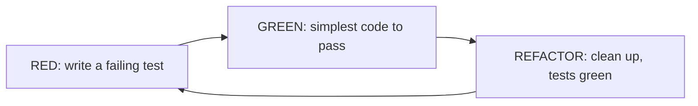
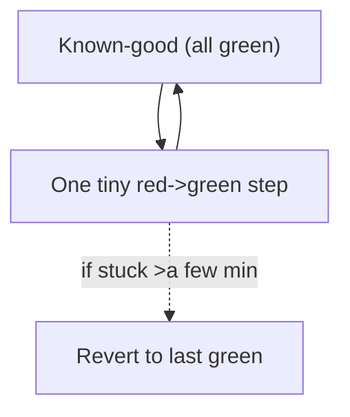
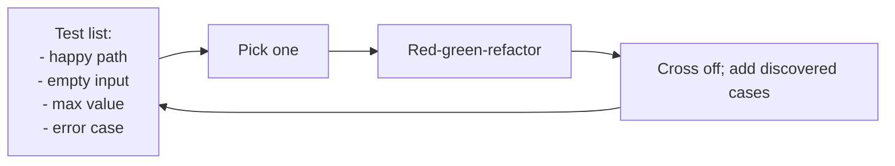
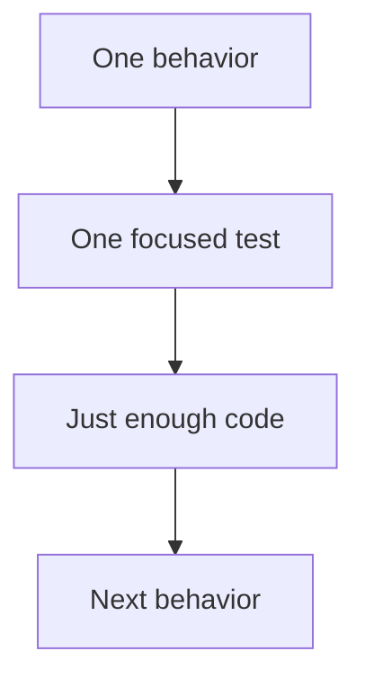
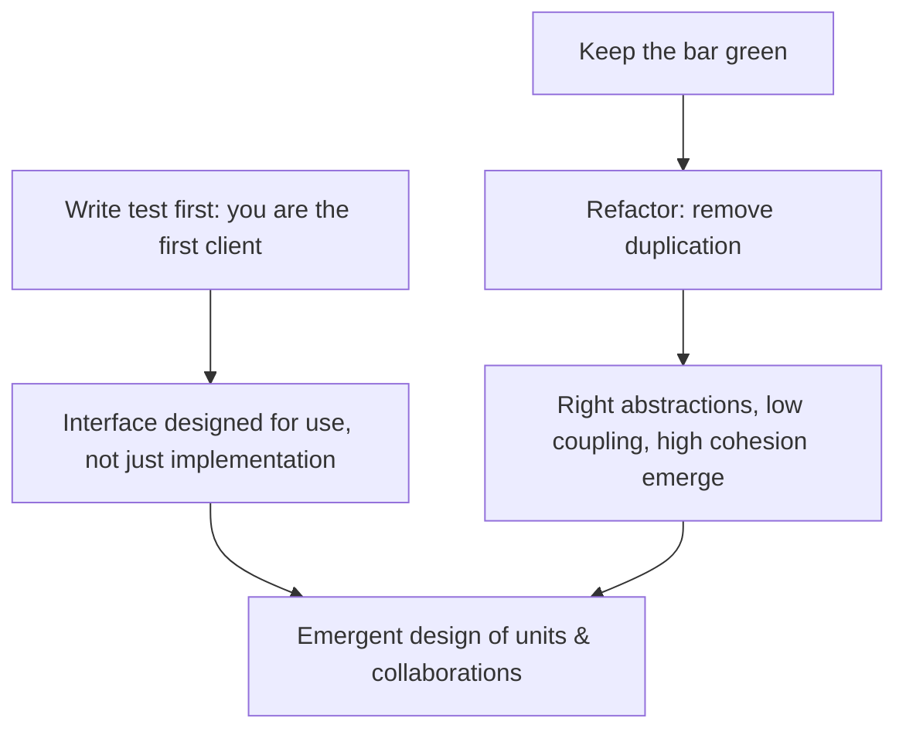
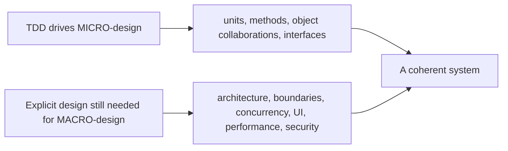

# Test-Driven Development - Complete Professional Guide

> **Category:** 04_engineering_and_practices · **Language:** English

---

### Red, green, refactor — letting tests drive design
**Original guide written from first principles, current to 2026**

> **Original reference book (English).** This is an **independent, originally written** guide. It is not an extract, summary, or paraphrase of any third-party book; it teaches test-driven development from first principles with original examples. Canonical books are listed under **References** as pointers only. Each chapter follows the TO-BRAIN editorial standard (see `FILE_CONVENTIONS.md`).
>
> **Scope notice:** test-driven development (TDD) is writing a failing test **before** the code that makes it pass, in tiny cycles. This guide covers the red-green-refactor loop, how TDD shapes design, and where it fits in 2026 practice (alongside AI-assisted coding and fast CI).

---

## How to read this guide

| Level | Profile | Parts |
|-------|---------|-------|
| 1 — Beginner | New to TDD | Part I |
| 2 — Intermediate | TDD for design | Part II |

**Target audience:** developers who want correctness and good design to fall out of their workflow rather than being bolted on.

**Structure of each chapter:** Introduction · Business context · Theoretical concepts · Architecture · Diagrams (Mermaid) · Real examples · Step by step · Complete examples · Exercises · Challenges · Checklist · Best practices · Anti-patterns · Troubleshooting · References.

> **Note on prerequisites.** Assumes you can write a unit test in one framework. Examples use JUnit-like syntax.

---

## Table of Contents

**Part I – The cycle**
1. Red, green, refactor
2. Small steps and the test list

**Part II – Design**
3. How TDD shapes design (and its limits)

> **Status of this guide:** complete for its declared scope. **Ready:** Parts I–II (Ch. 1–3).

---

## Part I – The cycle

TDD inverts the usual order: you state the desired behavior as a **failing test**, then write the **simplest** code to pass it, then **refactor** with the test as a safety net. Repeating this in tiny cycles keeps you always seconds from a known-good state and produces a comprehensive test suite as a side effect.

---

## Chapter 1 — Red, green, refactor

### 1.1 Introduction

The TDD cycle has three steps: **Red** — write a small test for behavior that doesn't exist yet; run it; watch it fail. **Green** — write the minimum code to make it pass; run; watch it pass. **Refactor** — clean up the code (and tests) with all tests green. Repeat. Each loop is minutes or less.

### 1.2 Business context

TDD front-loads the cost of testing into development, where it's cheapest, and produces a regression suite for free. The bigger payoff is design pressure and feedback: because you must call your code before it exists, you design usable interfaces, and because you take tiny verified steps, defects are caught the instant they appear — when they cost almost nothing to fix. Teams using TDD typically spend far less time in long debugging sessions.

### 1.3 Theoretical concepts: the loop



Each phase has a rule. **Red:** the test must fail for the right reason (proves it tests something real). **Green:** do the *simplest* thing that passes — even hardcoding — to confirm the test, resisting the urge to write more. **Refactor:** improve structure without changing behavior (see the refactoring guide); tests stay green throughout.

### 1.4 Architecture: always near green



Because every cycle is tiny, you're never more than a few minutes from a passing state. If a step gets hard, you revert and take a smaller one — debugging is bounded by design.

### 1.5 Real example

**Scenario.** Implement a function that converts integers to Roman numerals, TDD-style.

**Problem.** Writing it all at once invites edge-case bugs (4, 9, 40…).

**Solution.** Drive it one case at a time: each new test forces just enough code.

**Implementation (first cycles).**

```java
// RED #1
@Test void one() { assertEquals("I", roman(1)); }
// GREEN #1 — simplest thing
String roman(int n) { return "I"; }

// RED #2
@Test void two() { assertEquals("II", roman(2)); }
// GREEN #2 — now generalize a little
String roman(int n) { return "I".repeat(n); }

// RED #3 forces the subtractive rule
@Test void four() { assertEquals("IV", roman(4)); }
// GREEN #3 — extend the algorithm to pass all three
```

**Result.** Each test pins one behavior; the algorithm emerges, fully covered, with edge cases handled because a test demanded each.

**Future improvements.** Continue cases (9, 40, 90…) until the table-driven solution generalizes; then refactor to a clean lookup.

### 1.6 Exercises

1. Name the three phases and the rule of each.
2. Why must the red test fail before you write code?
3. Why write the *simplest* code to go green?

### 1.7 Challenges

- **Challenge.** TDD a small function (e.g. FizzBuzz or a string calculator) strictly one failing test at a time. Notice when a test forces a generalization.

### 1.8 Checklist

- [ ] I write a failing test before the code.
- [ ] I confirm it fails for the right reason.
- [ ] I write the minimum to pass, then refactor.
- [ ] I stay within minutes of a green state.

### 1.9 Best practices

- Keep cycles tiny; commit on green.
- Let each test force exactly one new behavior.
- Refactor only on green, never while red.

### 1.10 Anti-patterns

- Writing the implementation first, tests after (not TDD).
- Giant tests that force a big-bang implementation.
- Skipping refactor, accumulating mess between green steps.

### 1.11 Troubleshooting

| Symptom | Likely cause | Action |
|---------|--------------|--------|
| Test passes immediately | Didn't see it fail first | Break the code; confirm red, then fix |
| Steps feel huge and risky | Cases too coarse | Pick smaller behaviors per test |
| Code messy despite TDD | Skipping refactor phase | Refactor every green |

### 1.12 References

- K. Beck, *Test-Driven Development by Example* (Addison-Wesley, 2002) — ISBN 978-0321146533.
- M. Fowler, "Refactoring," 2nd ed. (Addison-Wesley, 2018) — ISBN 978-0134757599.

---

## Chapter 2 — Small steps and the test list

### 2.1 Introduction

TDD runs on **small steps** and a running **test list** — a scratch list of the behaviors you intend to test. You pick one, drive it red-green-refactor, cross it off, and add any new cases you discover along the way. This keeps you focused on one thing while never losing track of the rest.

### 2.2 Business context

The test list turns a vague "implement feature X" into a visible, ordered set of concrete behaviors, which makes progress measurable and prevents both forgetting edge cases and gold-plating. Small steps keep cognitive load low and integration continuous, so work stays shippable and reviewable rather than ballooning into a giant unverified change.

### 2.3 Theoretical concepts: manage scope with a list



The list is a thinking tool, not a deliverable. Start it with the obvious cases, pull one at a time (usually simplest first to build momentum), and append edge cases as the implementation reveals them. Done when the list is empty.

### 2.4 Architecture: one behavior at a time



Each test targets a single behavior, so a failure points to one cause and the suite documents the unit's behavior case by case.

### 2.5 Real example

**Scenario.** A string-calculator `add` that sums comma-separated numbers.

**Problem.** Many small behaviors (empty string, one number, many, newlines, negatives) — easy to miss some.

**Solution.** A test list drives them in order.

**Implementation (the list + first crosses).**

```text
Test list for add(s):
[x] "" -> 0
[x] "1" -> 1
[x] "1,2" -> 3
[ ] "1\n2,3" -> 6        # newline separators (discovered while coding)
[ ] negatives -> error    # added when requirement clarified
```

**Result.** Progress is visible, no case forgotten, scope controlled — you build exactly the behaviors listed, no more.

**Future improvements.** Keep the finished tests as living documentation of `add`'s contract.

### 2.6 Exercises

1. What is a test list and why keep one?
2. Why pull the simplest case first?
3. How does one-behavior-per-test aid debugging?

### 2.7 Challenges

- **Challenge.** Before coding a small feature, write its test list. Drive each item TDD-style, adding discovered cases. Did the list prevent a missed edge case?

### 2.8 Checklist

- [ ] I keep a running test list for the unit of work.
- [ ] Each test targets one behavior.
- [ ] I add edge cases to the list as I find them.
- [ ] I take the smallest useful step each cycle.

### 2.9 Best practices

- Start the list with obvious cases; grow it as you learn.
- One behavior per test for precise failures.
- Keep steps small enough to stay continuously integrable.

### 2.10 Anti-patterns

- Holding the whole plan in your head, forgetting cases.
- Multi-behavior tests that obscure what failed.
- Big steps that can't be safely reverted.

### 2.11 Troubleshooting

| Symptom | Likely cause | Action |
|---------|--------------|--------|
| Edge cases slip through | No test list | Maintain and grow a test list |
| Hard to tell what a failure means | Test covers many behaviors | Split into focused tests |
| Work balloons before it's shippable | Steps too big | Shrink steps; integrate often |

### 2.12 References

- K. Beck, *Test-Driven Development by Example* (Addison-Wesley, 2002) — ISBN 978-0321146533.
- "The String Calculator Kata" (common TDD exercise), various authors.

---

> **End of Part I.** You can now run the red-green-refactor cycle in tiny steps that keep you seconds from a known-good state, and manage scope with a running test list that drives one behavior at a time. **Part II — Design** (Chapter 3) examines how writing tests first pressures you toward decoupled, usable designs — and where TDD's design influence stops and explicit design must take over.

## Part II – Design

Part I treated TDD as a *correctness* engine: tiny red-green-refactor cycles that keep you seconds from green and build a regression suite for free. But Beck's deeper claim is that TDD is also a *design* engine. Because you must call code before it exists, you are forced to design its interface from the outside, as a client; because you keep the bar green, you refactor continuously; because you remove duplication relentlessly, good structure emerges. Part II examines this design influence — how testability pressures decoupling, how patterns show up in the cycle, how refactoring drives design — and, just as importantly, where that influence stops and deliberate, explicit design must take over.

---

## Chapter 3 — How TDD shapes design (and its limits)

### 3.1 Introduction

TDD shapes design through three mechanisms. First, **writing the test first** makes you the first client of your own code, so you design the interface for usability before you commit to an implementation — awkward-to-test code reveals itself as awkward-to-use code. Second, the **refactor** step, performed under green, is where design actually happens: Beck's central rule is *remove duplication*, and removing duplication systematically pushes a design toward the right abstractions, lower coupling, and higher cohesion. Third, the patterns in Beck's catalog (e.g. how design patterns appear during test-writing and refactoring) give the emerging structure names. The result is **emergent design**: structure that grows from concrete needs rather than up-front speculation. But Beck is explicit about the boundary — TDD is "not an excuse for not thinking about design." It excels at the design of *units and their collaborations*; it does **not** hand you a system architecture, a concurrency model, or a UI design. Those remain deliberate decisions TDD supports but cannot replace.

### 3.2 Business context

The business value of TDD's design influence is *changeability over time*. Code grown test-first tends to be decoupled and covered, which is exactly what keeps the cost of future change low — new requirements land as small additions under a green suite rather than risky surgery on tangled code. This is the long-game payoff: teams that let tests pressure their design accumulate less of the structural debt that eventually slows delivery to a crawl. Equally important for the business is knowing the *limits*: a team that believes "if the tests pass, the design is fine" will TDD its way into a locally-clean system with no coherent architecture — many tidy units that don't add up. Understanding that TDD drives *micro*-design while *macro*-design (boundaries, scaling, cross-cutting concerns) needs explicit attention prevents both under-design (no architecture) and over-design (speculative frameworks built before any test demanded them).

### 3.3 Theoretical concepts: testability is designability



The load-bearing idea is that **what is hard to test is hard to use and hard to change** — testability is a proxy for good design at the unit level. A class that needs a sprawling setup to test has too many dependencies; one whose behavior you can't observe has poor cohesion or leaky encapsulation. The red-green-refactor loop turns these design signals into immediate feedback. Beck's *remove duplication* heuristic is the engine of the refactor step: duplicated logic and duplicated *knowledge* between test and code is the smell that, when removed, forces you to introduce the abstraction the design was missing. Design isn't skipped in TDD; it is *relocated* into the refactor step and made continuous.

### 3.4 Architecture: what TDD designs, and what it doesn't



TDD's reach is the **inside-the-unit** and **between-units** scale: method signatures, where responsibilities sit, which object should own a behavior, how collaborators talk. It is excellent there. It is **not** a substitute for decisions at the system scale — module boundaries, data and consistency models, concurrency and failure handling, UI and interaction design, performance and security architecture. Beck's *Mastering TDD* chapter addresses exactly these "how does this scale?" questions and is candid that TDD assumes you also do architecture-level thinking (e.g. via spikes, explicit design sessions, or up-front decisions about hard-to-change choices). The healthy stance: let TDD design the units, and reserve deliberate design effort for the decisions that are expensive to reverse and that no single failing test will surface.

### 3.5 Real example

**Scenario.** A developer TDDs a `PriceCalculator` that needs current exchange rates from an external service.

**Problem.** Writing the test first immediately raises a design question: the calculator can't depend on a live network call, or the test would be slow and erratic. The *test* is exerting design pressure before any implementation exists.

**Solution.** Let the test drive the design. To make the unit testable, introduce a `RateProvider` abstraction the calculator depends on; the test passes a stub. The need for the seam emerged from testability, not from speculation — and it happens to be exactly the right decoupling for the production design.

**Implementation.**

```java
// The failing test FORCES a collaborator interface into existence
@Test void converts_using_provided_rate() {
    RateProvider rates = currency -> new BigDecimal("5.00");   // stub — design pressure made this seam
    var calc = new PriceCalculator(rates);                     // dependency injected, not hard-wired
    assertEquals(new BigDecimal("50.00"), calc.inBRL(money("10.00", "USD")));
}

// Minimal production code to satisfy it; RateProvider is now a clean boundary
class PriceCalculator {
    private final RateProvider rates;
    PriceCalculator(RateProvider rates) { this.rates = rates; }
    BigDecimal inBRL(Money m) { return m.amount().multiply(rates.rateFor(m.currency())); }
}
// LIMIT: TDD designed this unit well. It did NOT decide caching strategy, retry/timeout
// policy, or where the live HTTP adapter lives — those are explicit architecture choices.
```

**Result.** The unit is decoupled and fully testable, and the `RateProvider` seam — discovered through the test — is also the right production abstraction. The micro-design fell out of the cycle.

**Future improvements.** The *macro*-decisions the test did not make (how to cache rates, timeout/retry policy, where the real HTTP adapter sits, how stale a rate may be) are decided deliberately — informed by, but not produced by, the TDD cycle.

### 3.6 Exercises

1. Explain why "hard to test" is usually a signal of "hard to use" or "hard to change."
2. In which step of red-green-refactor does design primarily happen, and what is the guiding heuristic?
3. Give one design decision TDD will drive for you and one it will not.
4. Why is "the tests pass, so the design is fine" a dangerous belief?

### 3.7 Challenges

- **Challenge.** TDD a small feature that needs an external dependency (clock, network, or file). Notice the exact moment the test pressures you to introduce a seam, and record what abstraction emerged. Then list three design decisions about the feature that *no* test forced — and decide each one explicitly. Which decisions did TDD make, and which did you?

### 3.8 Checklist

- [ ] I treat awkward-to-test code as a design signal, not a testing nuisance.
- [ ] I do real design work in the refactor step by removing duplication.
- [ ] I let collaborator interfaces emerge from testability rather than speculating.
- [ ] I make expensive-to-reverse architecture decisions deliberately, not as a TDD by-product.
- [ ] I don't treat a green suite as proof the macro-design is sound.

### 3.9 Best practices

- Write the test as the first *client* of the code to design usable interfaces.
- Refactor under green and remove duplication to let abstractions emerge.
- Use spikes or explicit design sessions for architecture-scale, hard-to-reverse decisions.
- Keep units small and decoupled so the suite stays fast and the design stays changeable.

### 3.10 Anti-patterns

- Believing TDD removes the need to think about architecture.
- Skipping the refactor step, so design never actually emerges.
- Building speculative frameworks before any test demands them (over-design).
- Forcing testability with awkward seams while ignoring the design smell they reveal.

### 3.11 Troubleshooting

| Symptom | Likely cause | Action |
|---------|--------------|--------|
| A unit is very hard to test | Too many dependencies / poor cohesion | Heed the signal; refactor to a seam, split responsibilities |
| Many tidy units, no coherent architecture | Relying on TDD for macro-design | Add explicit architecture/boundary design |
| Design never improves | Refactor step skipped | Refactor under green every cycle; remove duplication |
| Over-built abstractions unused by tests | Speculative design ahead of need | Let abstractions emerge from failing tests |

### 3.12 References

- K. Beck, *Test-Driven Development by Example* (Addison-Wesley, 2002), Part III "Patterns for Test-Driven Development" — ch. 30 "Design Patterns", ch. 31 "Refactoring", ch. 32 "Mastering TDD" (scope, scale, and limits of TDD) — ISBN 978-0321146533.
- M. Fowler, *Refactoring*, 2nd ed. (Addison-Wesley, 2018) — ISBN 978-0134757599.

---

> **End of Part II.** You can now see TDD as a *design* engine, not only a correctness one: writing the test first makes you the first client and shapes usable interfaces; the **refactor step — driven by removing duplication — is where design actually happens**, growing the right abstractions, low coupling, and high cohesion as *emergent design*. And you know the boundary Beck draws: TDD designs **units and their collaborations** well, but does **not** replace deliberate **macro-design** — architecture, concurrency, UI, performance, security. Let tests drive the micro-design; decide the expensive, hard-to-reverse choices explicitly.
