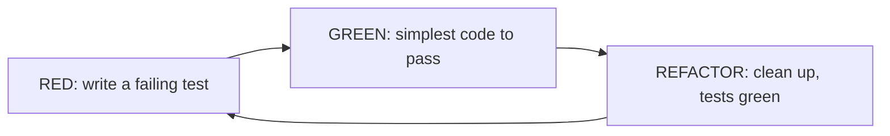
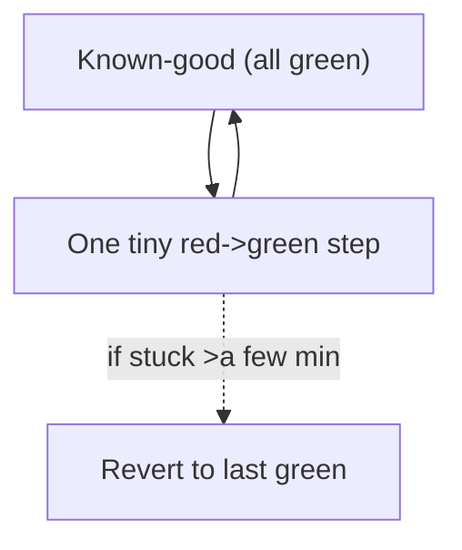
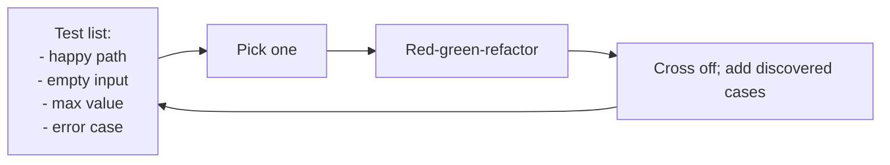
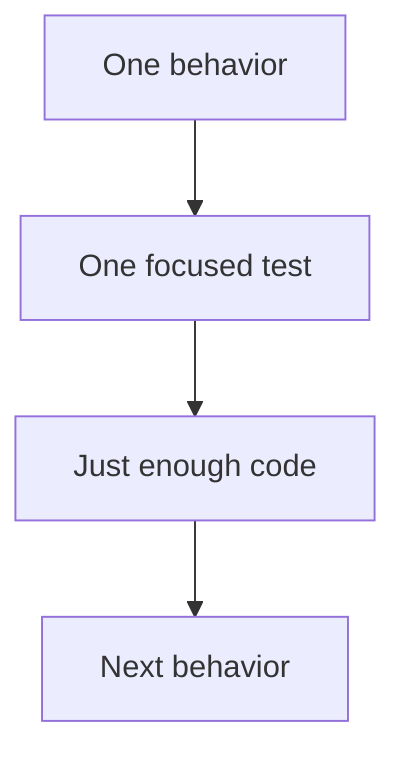

# Test-Driven Development - Complete Professional Guide

> **Category:** 04_engineering_and_practices · **Language:** English

---

### Red, green, refactor — letting tests drive design
**Original guide written from first principles, current to 2026**

> **Original reference book (English).** This is an **independent, originally written** guide. It is not an extract, summary, or paraphrase of any third-party book; it teaches test-driven development from first principles with original examples. Canonical books are listed under **References** as pointers only. Each chapter follows the TO-BRAIN editorial standard (see `FILE_CONVENTIONS.md`).
>
> **Scope notice:** test-driven development (TDD) is writing a failing test **before** the code that makes it pass, in tiny cycles. This guide covers the red-green-refactor loop, how TDD shapes design, and where it fits in 2026 practice (alongside AI-assisted coding and fast CI).

---

## How to read this guide

| Level | Profile | Parts |
|-------|---------|-------|
| 1 — Beginner | New to TDD | Part I |
| 2 — Intermediate | TDD for design | Part II |

**Target audience:** developers who want correctness and good design to fall out of their workflow rather than being bolted on.

**Structure of each chapter:** Introduction · Business context · Theoretical concepts · Architecture · Diagrams (Mermaid) · Real examples · Step by step · Complete examples · Exercises · Challenges · Checklist · Best practices · Anti-patterns · Troubleshooting · References.

> **Note on prerequisites.** Assumes you can write a unit test in one framework. Examples use JUnit-like syntax.

---

## Table of Contents

**Part I – The cycle**
1. Red, green, refactor
2. Small steps and the test list

**Part II – Design**
3. How TDD shapes design (and its limits)

> **Status of this guide:** phased delivery. **Ready:** Part I (Ch. 1–2). **In progress:** Part II.

---

## Part I – The cycle

TDD inverts the usual order: you state the desired behavior as a **failing test**, then write the **simplest** code to pass it, then **refactor** with the test as a safety net. Repeating this in tiny cycles keeps you always seconds from a known-good state and produces a comprehensive test suite as a side effect.

---

## Chapter 1 — Red, green, refactor

### 1.1 Introduction

The TDD cycle has three steps: **Red** — write a small test for behavior that doesn't exist yet; run it; watch it fail. **Green** — write the minimum code to make it pass; run; watch it pass. **Refactor** — clean up the code (and tests) with all tests green. Repeat. Each loop is minutes or less.

### 1.2 Business context

TDD front-loads the cost of testing into development, where it's cheapest, and produces a regression suite for free. The bigger payoff is design pressure and feedback: because you must call your code before it exists, you design usable interfaces, and because you take tiny verified steps, defects are caught the instant they appear — when they cost almost nothing to fix. Teams using TDD typically spend far less time in long debugging sessions.

### 1.3 Theoretical concepts: the loop



Each phase has a rule. **Red:** the test must fail for the right reason (proves it tests something real). **Green:** do the *simplest* thing that passes — even hardcoding — to confirm the test, resisting the urge to write more. **Refactor:** improve structure without changing behavior (see the refactoring guide); tests stay green throughout.

### 1.4 Architecture: always near green



Because every cycle is tiny, you're never more than a few minutes from a passing state. If a step gets hard, you revert and take a smaller one — debugging is bounded by design.

### 1.5 Real example

**Scenario.** Implement a function that converts integers to Roman numerals, TDD-style.

**Problem.** Writing it all at once invites edge-case bugs (4, 9, 40…).

**Solution.** Drive it one case at a time: each new test forces just enough code.

**Implementation (first cycles).**

```java
// RED #1
@Test void one() { assertEquals("I", roman(1)); }
// GREEN #1 — simplest thing
String roman(int n) { return "I"; }

// RED #2
@Test void two() { assertEquals("II", roman(2)); }
// GREEN #2 — now generalize a little
String roman(int n) { return "I".repeat(n); }

// RED #3 forces the subtractive rule
@Test void four() { assertEquals("IV", roman(4)); }
// GREEN #3 — extend the algorithm to pass all three
```

**Result.** Each test pins one behavior; the algorithm emerges, fully covered, with edge cases handled because a test demanded each.

**Future improvements.** Continue cases (9, 40, 90…) until the table-driven solution generalizes; then refactor to a clean lookup.

### 1.6 Exercises

1. Name the three phases and the rule of each.
2. Why must the red test fail before you write code?
3. Why write the *simplest* code to go green?

### 1.7 Challenges

- **Challenge.** TDD a small function (e.g. FizzBuzz or a string calculator) strictly one failing test at a time. Notice when a test forces a generalization.

### 1.8 Checklist

- [ ] I write a failing test before the code.
- [ ] I confirm it fails for the right reason.
- [ ] I write the minimum to pass, then refactor.
- [ ] I stay within minutes of a green state.

### 1.9 Best practices

- Keep cycles tiny; commit on green.
- Let each test force exactly one new behavior.
- Refactor only on green, never while red.

### 1.10 Anti-patterns

- Writing the implementation first, tests after (not TDD).
- Giant tests that force a big-bang implementation.
- Skipping refactor, accumulating mess between green steps.

### 1.11 Troubleshooting

| Symptom | Likely cause | Action |
|---------|--------------|--------|
| Test passes immediately | Didn't see it fail first | Break the code; confirm red, then fix |
| Steps feel huge and risky | Cases too coarse | Pick smaller behaviors per test |
| Code messy despite TDD | Skipping refactor phase | Refactor every green |

### 1.12 References

- K. Beck, *Test-Driven Development by Example* (Addison-Wesley, 2002) — ISBN 978-0321146533.
- M. Fowler, "Refactoring," 2nd ed. (Addison-Wesley, 2018) — ISBN 978-0134757599.

---

## Chapter 2 — Small steps and the test list

### 2.1 Introduction

TDD runs on **small steps** and a running **test list** — a scratch list of the behaviors you intend to test. You pick one, drive it red-green-refactor, cross it off, and add any new cases you discover along the way. This keeps you focused on one thing while never losing track of the rest.

### 2.2 Business context

The test list turns a vague "implement feature X" into a visible, ordered set of concrete behaviors, which makes progress measurable and prevents both forgetting edge cases and gold-plating. Small steps keep cognitive load low and integration continuous, so work stays shippable and reviewable rather than ballooning into a giant unverified change.

### 2.3 Theoretical concepts: manage scope with a list



The list is a thinking tool, not a deliverable. Start it with the obvious cases, pull one at a time (usually simplest first to build momentum), and append edge cases as the implementation reveals them. Done when the list is empty.

### 2.4 Architecture: one behavior at a time



Each test targets a single behavior, so a failure points to one cause and the suite documents the unit's behavior case by case.

### 2.5 Real example

**Scenario.** A string-calculator `add` that sums comma-separated numbers.

**Problem.** Many small behaviors (empty string, one number, many, newlines, negatives) — easy to miss some.

**Solution.** A test list drives them in order.

**Implementation (the list + first crosses).**

```text
Test list for add(s):
[x] "" -> 0
[x] "1" -> 1
[x] "1,2" -> 3
[ ] "1\n2,3" -> 6        # newline separators (discovered while coding)
[ ] negatives -> error    # added when requirement clarified
```

**Result.** Progress is visible, no case forgotten, scope controlled — you build exactly the behaviors listed, no more.

**Future improvements.** Keep the finished tests as living documentation of `add`'s contract.

### 2.6 Exercises

1. What is a test list and why keep one?
2. Why pull the simplest case first?
3. How does one-behavior-per-test aid debugging?

### 2.7 Challenges

- **Challenge.** Before coding a small feature, write its test list. Drive each item TDD-style, adding discovered cases. Did the list prevent a missed edge case?

### 2.8 Checklist

- [ ] I keep a running test list for the unit of work.
- [ ] Each test targets one behavior.
- [ ] I add edge cases to the list as I find them.
- [ ] I take the smallest useful step each cycle.

### 2.9 Best practices

- Start the list with obvious cases; grow it as you learn.
- One behavior per test for precise failures.
- Keep steps small enough to stay continuously integrable.

### 2.10 Anti-patterns

- Holding the whole plan in your head, forgetting cases.
- Multi-behavior tests that obscure what failed.
- Big steps that can't be safely reverted.

### 2.11 Troubleshooting

| Symptom | Likely cause | Action |
|---------|--------------|--------|
| Edge cases slip through | No test list | Maintain and grow a test list |
| Hard to tell what a failure means | Test covers many behaviors | Split into focused tests |
| Work balloons before it's shippable | Steps too big | Shrink steps; integrate often |

### 2.12 References

- K. Beck, *Test-Driven Development by Example* (Addison-Wesley, 2002) — ISBN 978-0321146533.
- "The String Calculator Kata" (common TDD exercise), various authors.

---

> **End of Part I.** You can now run the red-green-refactor cycle in tiny steps that keep you seconds from a known-good state, and manage scope with a running test list that drives one behavior at a time. **Part II — Design** (Chapter 3) examines how writing tests first pressures you toward decoupled, usable designs — and where TDD's design influence stops and explicit design must take over.

<!--APPEND-PART-II-->
