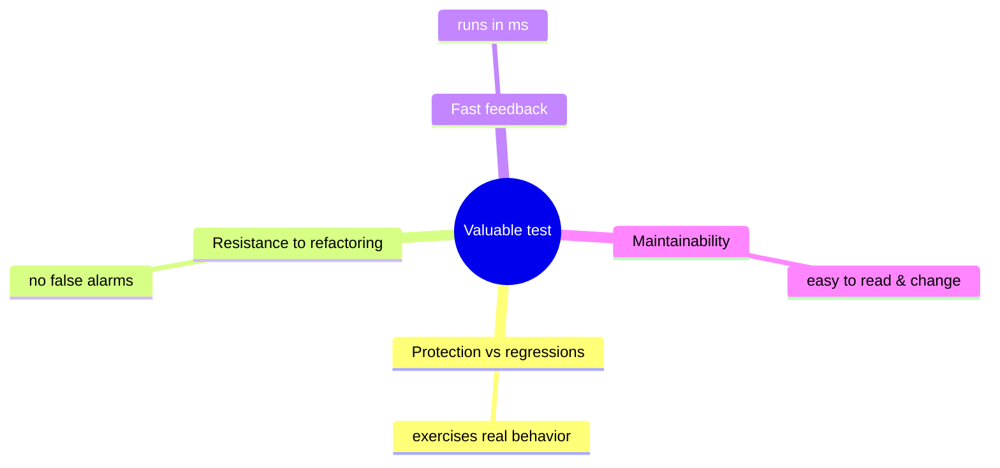
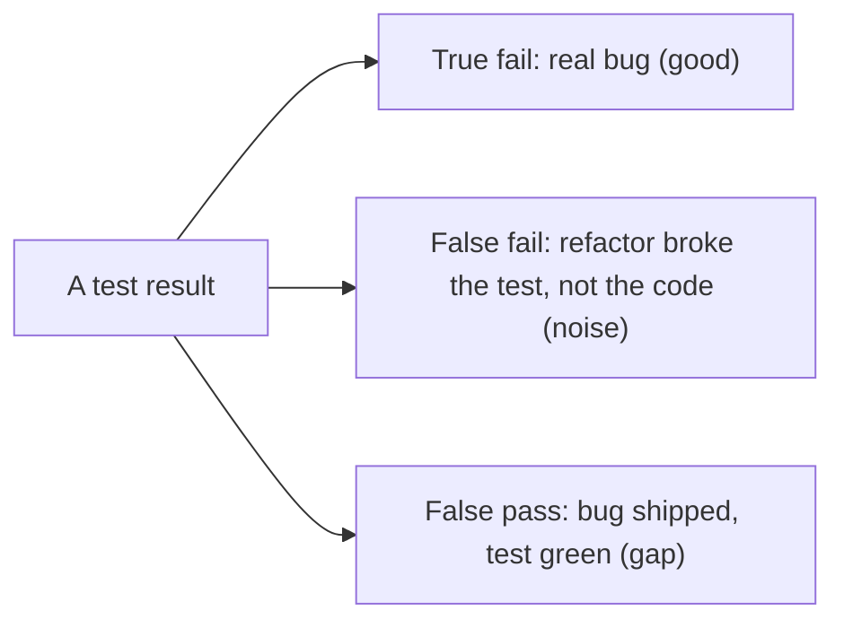
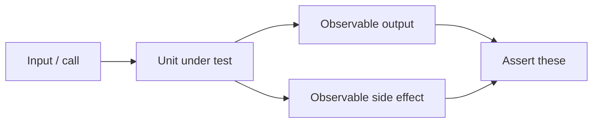
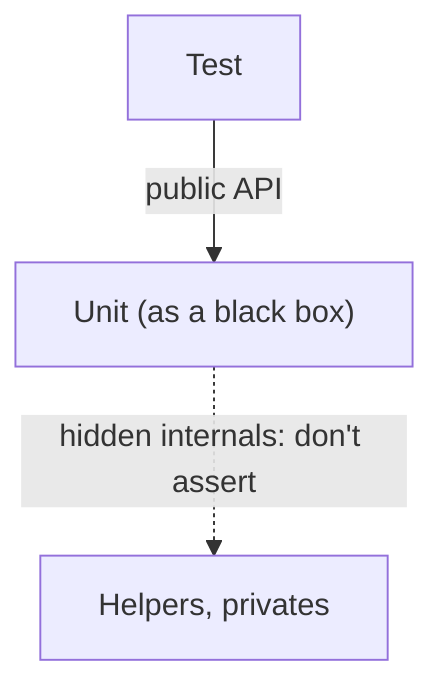
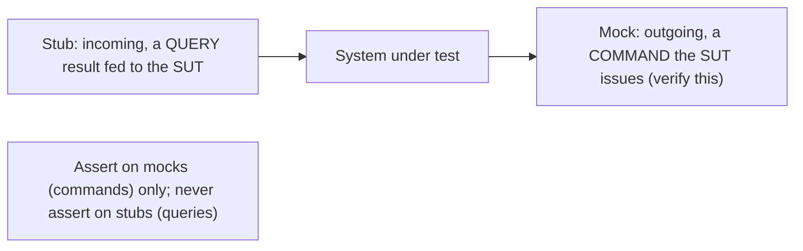
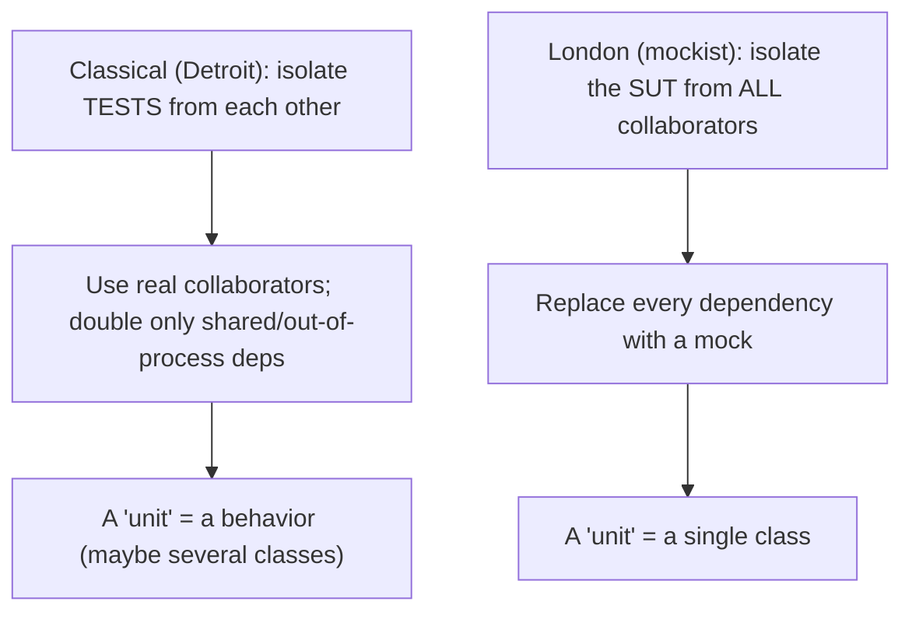

# Unit Testing Principles - Complete Professional Guide

> **Category:** 04_engineering_and_practices · **Language:** English

---

### What makes a test valuable, and how to avoid brittle tests
**Original guide written from first principles, current to 2026**

> **Original reference book (English).** This is an **independent, originally written** guide. It is not an extract, summary, or paraphrase of any third-party book; it teaches unit-testing principles from first principles with original examples. Canonical books are listed under **References** as pointers only. Each chapter follows the TO-BRAIN editorial standard (see `FILE_CONVENTIONS.md`).
>
> **Scope notice:** more tests is not better; the goal is a suite of **valuable** tests that catch real regressions without breaking on every refactor. This guide defines what makes a test good, what to test, and how to use test doubles well, current to 2026 practice.

---

## How to read this guide

| Level | Profile | Parts |
|-------|---------|-------|
| 1 — Beginner | Writing first tests | Part I |
| 2 — Intermediate | Designing a suite | Part II |

**Target audience:** developers who write tests and want them to pay off rather than become a maintenance burden.

**Structure of each chapter:** Introduction · Business context · Theoretical concepts · Architecture · Diagrams (Mermaid) · Real examples · Step by step · Complete examples · Exercises · Challenges · Checklist · Best practices · Anti-patterns · Troubleshooting · References.

> **Note on prerequisites.** Assumes a unit-testing framework and the TDD guide.

---

## Table of Contents

**Part I – What makes a good test**
1. The four properties of a valuable test
2. Test behavior, not implementation

**Part II – Doubles & isolation**
3. Mocks, stubs, and the classical vs London styles

> **Status of this guide:** complete for its declared scope. **Ready:** Parts I–II (Ch. 1–3).

---

## Part I – What makes a good test

A test suite is an asset only if its value exceeds its upkeep. Tests that break on every refactor, or that pass while bugs ship, are liabilities. So the first skill is judging a test's **value** — and writing tests that protect against regressions while staying resilient to change.

---

## Chapter 1 — The four properties of a valuable test

### 1.1 Introduction

A valuable test balances four properties: **protection against regressions** (it catches real bugs), **resistance to refactoring** (it doesn't break when you restructure without changing behavior), **fast feedback** (it runs quickly), and **maintainability** (it's easy to read and change). The hard part is that the first two pull against each other, and a good test maximizes their product, not any one alone.

### 1.2 Business context

Tests cost money to write *and* to maintain; a brittle suite that screams on every refactor can cost more than it saves, leading teams to delete or ignore it. Evaluating tests by these four properties keeps the suite a net asset — catching the regressions that matter while not taxing every change. This is the difference between testing that accelerates a team and testing that drags it down.

### 1.3 Theoretical concepts: the trade-off



The deep tension is **regression protection vs refactoring resistance**: testing more thoroughly (touching internals) raises protection but lowers refactoring resistance (false failures). The resolution is to test **observable behavior** through public interfaces — high protection *and* high resistance — which is why Chapter 2 matters most.

### 1.4 Architecture: false positives vs false negatives



A test loses value both when it cries wolf (false positive on refactor — erodes trust) and when it sleeps through a real bug (false negative). Both are reduced by testing behavior at the right granularity.

### 1.5 Real example

**Scenario.** A discount calculation must be tested.

**Problem.** A test asserting an internal helper was called breaks whenever you refactor the internals, even though behavior is unchanged.

**Solution.** Assert the observable result, not the internal mechanics.

**Implementation.**

```java
// BRITTLE: couples to implementation (breaks on refactor)
verify(discountHelper).computeRate(customer);   // testing HOW

// VALUABLE: asserts behavior (survives refactor, catches real bugs)
@Test void goldCustomerGetsTenPercentOff() {
    Money total = pricing.total(order, goldCustomer);   // testing WHAT
    assertEquals(Money.of(90), total);
}
```

**Result.** The behavior test catches a wrong discount (protection) and survives any internal refactor that keeps the result (resistance) — high on both axes.

**Future improvements.** Add cases for boundary tiers; keep assertions on outputs/effects, never on internal calls.

### 1.6 Exercises

1. Name the four properties of a valuable test.
2. Which two properties are in tension, and why?
3. Give an example of a false positive and a false negative.

### 1.7 Challenges

- **Challenge.** Find a test that asserts an internal call. Rewrite it to assert observable behavior and confirm it now survives a refactor of the internals.

### 1.8 Checklist

- [ ] I judge tests by the four-property balance.
- [ ] My tests catch real regressions.
- [ ] My tests survive behavior-preserving refactors.
- [ ] Tests are fast and readable.

### 1.9 Best practices

- Optimize for the product of protection × refactoring-resistance.
- Treat a test that breaks on refactors as a defect to fix.
- Keep tests fast so they're actually run.

### 1.10 Anti-patterns

- Tests coupled to implementation details (verify-internal-call).
- Chasing coverage numbers over test value.
- Slow suites that get skipped.

### 1.11 Troubleshooting

| Symptom | Likely cause | Action |
|---------|--------------|--------|
| Tests break on every refactor | Coupled to internals | Re-target at observable behavior |
| Bugs ship despite green tests | Tests don't exercise real behavior | Test through public interfaces with real cases |
| Suite ignored | Too slow | Speed up; isolate slow tests |

### 1.12 References

- V. Khorikov, *Unit Testing: Principles, Practices, and Patterns* (Manning, 2020) — ISBN 978-1617296277.
- K. Beck, *Test-Driven Development by Example* (Addison-Wesley, 2002) — ISBN 978-0321146533.

---

## Chapter 2 — Test behavior, not implementation

### 2.1 Introduction

The single most important rule for durable tests: assert **observable behavior** — outputs and externally visible side effects — not how the code achieves them. A test coupled to internals must change every time the internals change, which destroys the refactoring resistance that makes a suite worth keeping.

### 2.2 Business context

Implementation-coupled tests are the top reason teams come to resent and abandon test suites: refactoring becomes a chore of fixing tests that were never about behavior. Behavior-focused tests let the code be restructured freely while the suite keeps guarding the contract — preserving both the safety net and the team's willingness to improve the code.

### 2.3 Theoretical concepts: the unit's contract



Test the **contract**: given inputs, what outputs and side effects should occur. The internal collaborators, private methods, and intermediate states are not the contract — they're free to change. Assert what a caller could observe, nothing more.

### 2.4 Architecture: black-box at the right boundary



Treat the unit as a black box at a meaningful boundary (a class or module with a real responsibility), and assert only across that boundary. "Unit" need not mean "one class" — it means one behavior with a stable interface.

### 2.5 Real example

**Scenario.** An order service saves an order and publishes an event.

**Problem.** Asserting the internal repository method name and call order couples the test to implementation.

**Solution.** Assert the observable side effects: the order is persisted and an event is emitted — via the unit's outputs/observable collaborators.

**Implementation.**

```java
@Test void placingAnOrderPersistsItAndEmitsEvent() {
    var orders = new InMemoryOrders();        // real fake at a true boundary
    var events = new RecordingEvents();
    var service = new PlaceOrder(orders, events);

    OrderId id = service.handle(newOrder());

    assertTrue(orders.contains(id));          // observable effect
    assertTrue(events.contains("OrderPlaced", id));  // observable effect
}
```

**Result.** The test pins the behavior (order saved + event emitted) and ignores how — internal refactors won't break it, but a regression in either effect will.

**Future improvements.** Add failure-path tests (e.g. duplicate order rejected) at the same behavioral boundary.

### 2.6 Exercises

1. What counts as "observable behavior"?
2. Why does asserting private/internal calls hurt a test's value?
3. Why doesn't "unit" have to mean "one class"?

### 2.7 Challenges

- **Challenge.** Take a class with several collaborators. Write a test asserting only its observable outputs/effects, using real fakes at true boundaries — not mocks of internal helpers.

### 2.8 Checklist

- [ ] I assert outputs and observable side effects only.
- [ ] I don't assert private methods or internal call order.
- [ ] I pick the unit boundary by responsibility, not class count.
- [ ] My tests survive internal refactors.

### 2.9 Best practices

- Test through the public interface as a black box.
- Use real or simple fakes at genuine boundaries.
- Cover behavior and its failure paths, not mechanics.

### 2.10 Anti-patterns

- Verifying internal method calls and call order.
- Mocking everything, including the code under test's own helpers.
- One-class-per-test dogma that fragments behavior.

### 2.11 Troubleshooting

| Symptom | Likely cause | Action |
|---------|--------------|--------|
| Refactor breaks many tests | Implementation coupling | Assert behavior at the boundary |
| Tests pass but integration fails | Over-mocked internals | Test real behavior across true boundaries |
| Tests mirror the code structure | Wrong unit boundary | Test by responsibility, not per class |

### 2.12 References

- V. Khorikov, *Unit Testing: Principles, Practices, and Patterns* (Manning, 2020) — ISBN 978-1617296277.
- S. Freeman, N. Pryce, *Growing Object-Oriented Software, Guided by Tests* (Addison-Wesley, 2009) — ISBN 978-0321503626.

---

> **End of Part I.** You can now judge a test by the balance of regression protection, refactoring resistance, speed, and maintainability — and you know the master rule that maximizes the first two together: test observable behavior through public interfaces, never implementation details. **Part II — Doubles & isolation** (Chapter 3) covers stubs vs mocks, when each is appropriate, and the classical vs London testing styles.

## Part II – Doubles & isolation

Part I judged a test by four properties and gave the master rule: test observable behavior, not implementation. Part II confronts the tool most responsible for *violating* that rule when misused — the test double. Replacing a real collaborator with a stand-in is sometimes essential and sometimes the very thing that makes a test brittle. The difference turns on *which kind* of double you use and *what* it stands in for. This chapter draws the one distinction that matters (mocks vs stubs), ties it to commands and queries, and explains the two schools of thought — classical and London — that disagree about how much to isolate, and why that disagreement decides how resilient your suite will be.

---

## Chapter 3 — Mocks, stubs, and the classical vs London styles

### 3.1 Introduction

A **test double** is any object that stands in for a real collaborator to make testing easier — the umbrella term Meszaros coined (from "stunt double"). The literature lists five — dummy, stub, fake, spy, mock — but Khorikov collapses them into the only split that affects test design: **stubs** emulate *incoming* interactions (data flowing **into** the system under test — a query result) and **mocks** emulate and *verify* *outgoing* interactions (calls the system makes **out** to a dependency — a command). The rule that follows is sharp: **never assert on a stub**. Asserting that a query was called couples the test to *how* the code gets its data — an implementation detail — and produces a fragile test. You assert only on mocks, and only for genuine outgoing commands that are part of the system's observable behavior. This maps cleanly onto **command-query separation**: mock the commands, stub the queries.

### 3.2 Business context

Test doubles are where teams unknowingly trade away the value Part I prized. A suite stuffed with mocks that verify every internal call looks thorough but fails the moment anyone refactors — because each test asserts the *mechanism*, not the *outcome*. That is the worst trade in testing: maximum maintenance cost, minimum refactoring resistance. Getting doubles right is therefore a direct business concern: it determines whether your tests *enable* change (catching real regressions while staying quiet during safe refactors) or *obstruct* it (breaking on every structural edit until the team stops trusting them and stops refactoring). The classical-vs-London choice is the strategic version of the same decision — how much of the system to replace with doubles — and it sets the resilience of the entire suite, not just one test.

### 3.3 Theoretical concepts: stubs in, mocks out



The decisive idea is **direction**. A **stub** supplies the system with input it needs (a repository returning a saved user, a clock returning a fixed time); the system's *use* of that input shows up in its observable result, so you check the result, not the stub call. A **mock** stands for an action the system performs on the outside world (sending an email, publishing an event); that the action happened *is* the observable behavior, so you verify it. Asserting both the result and the query that produced it is **over-specification** — Khorikov's term for tests that pin redundant, internal facts and so break under refactoring. Mock commands, stub queries, and you assert exactly once on exactly the right thing.

### 3.4 Architecture: the two schools



The schools disagree on what "isolated" means. The **London (mockist)** school isolates the *system under test* from every collaborator, mocking all of them, so a unit is one class. The **classical (Detroit)** school isolates the *tests* from each other (no shared mutable state), uses *real* collaborators wherever practical, and replaces only **shared, out-of-process** dependencies (a database, an external API) — so a unit is a *behavior*, which may span a small cluster of cooperating classes. Khorikov argues for the classical style: London's blanket mocking couples tests to the implementation graph (every collaboration becomes an asserted interaction), yielding brittle tests that verify *how* over *what*, and it also blurs bug localization rather than improving it. The refined guidance: mock only **unmanaged** out-of-process dependencies — those whose calls are observable by other systems (an email gateway, a message bus) — and use the real thing for **managed** dependencies you fully control (your own database), verified through their end state.

### 3.5 Real example

**Scenario.** A `UserService.changeEmail()` loads a user, applies a rule, persists the change, and — when the email actually changes — publishes a `EmailChanged` message to an external bus other systems consume.

**Problem.** The first version of the test mocks the repository *and* the bus and asserts that `repository.getById()` and `repository.save()` were called. It passes, but it breaks every time the persistence is refactored — even when behavior is unchanged — because it asserts queries (implementation details).

**Solution.** **Stub** the repository's read (a query), let the change flow through, and assert on the *outcome*. **Mock** only the message bus (an unmanaged, outgoing command whose call is genuinely observable behavior) and verify the publish — once, and only when the email truly changed.

**Implementation.**

```csharp
[Fact]
public void Changing_email_publishes_a_message() {
    var repo = new StubUserRepository(existing: new User(1, "old@x.com")); // STUB: query in
    var busMock = new Mock<IMessageBus>();                                 // MOCK: command out
    var sut = new UserService(repo, busMock.Object);

    sut.ChangeEmail(userId: 1, newEmail: "new@x.com");

    Assert.Equal("new@x.com", repo.Saved.Email);          // assert on OUTCOME (managed dep)
    busMock.Verify(b => b.Publish(new EmailChanged(1, "new@x.com")), Times.Once); // assert COMMAND
    // NOTE: no assertion that repo.GetById was called — that's a query (implementation detail)
}
```

**Result.** The test now survives persistence refactors and still fails if the externally-visible behavior (the published message) regresses. It asserts exactly two things — the resulting state and the one outgoing command — and nothing about internal mechanics.

**Future improvements.** Replace the hand-written `StubUserRepository` with an in-memory fake for closer-to-real behavior, and keep the bus as the only mock; if more unmanaged dependencies appear, isolate them behind a single facade so the mocking stays at the system's edge, not woven through its internals.

### 3.6 Exercises

1. Distinguish a stub from a mock in terms of interaction *direction*, and state which one you assert on.
2. Why is asserting that a stubbed query was called an example of over-specification?
3. Contrast what "isolation" means to the classical school versus the London school.
4. What is the difference between a *managed* and an *unmanaged* out-of-process dependency, and how does it change whether you mock it?

### 3.7 Challenges

- **Challenge.** Take a service test that mocks all its dependencies and asserts on several interactions. Reclassify each double as standing for a command or a query. Convert the query-doubles to stubs, delete the assertions on them, keep a mock only for genuine outgoing commands, and add an outcome assertion. Then refactor the service's internals and confirm the rewritten test stays green where the original would have broken.

### 3.8 Checklist

- [ ] I assert on mocks (commands), never on stubs (queries).
- [ ] Each double stands for either an incoming query or an outgoing command — I know which.
- [ ] I mock only unmanaged out-of-process dependencies, not managed ones.
- [ ] My tests verify outcomes and externally-visible commands, not internal call sequences.
- [ ] I default to the classical style and reach for mocks deliberately, at the system's edges.

### 3.9 Best practices

- Mock commands, stub queries — and assert exactly once, on the right thing.
- Use real or in-memory collaborators for dependencies you control; verify them by end state.
- Reserve mocks for dependencies whose calls are observable by other systems (buses, email, third-party APIs).
- Keep doubles at the boundary of the system, not threaded through its internal collaborations.

### 3.10 Anti-patterns

- Asserting interactions with stubs (over-specification) — fragile tests coupled to mechanism.
- Mocking every collaborator (blanket London style), pinning the implementation graph.
- Mocking your own database and asserting on its method calls instead of its resulting state.
- Verifying the *sequence* of internal calls as if it were behavior.

### 3.11 Troubleshooting

| Symptom | Likely cause | Action |
|---------|--------------|--------|
| Tests break on every refactor | Asserting on queries / blanket mocking | Stub queries, assert outcomes, mock only commands |
| Test passes but real integration fails | Mocked a managed dependency away | Use the real/in-memory dependency; verify end state |
| Hard to tell what a test actually checks | Many interaction assertions | Reduce to one outcome + one command assertion |
| Bug not localized despite heavy mocking | Over-isolation hides collaboration defects | Prefer classical style; test behavior across the cluster |

### 3.12 References

- V. Khorikov, *Unit Testing: Principles, Practices, and Patterns* (Manning, 2020), ch. 2 "What is a unit test?" (§2.1–2.3 classical and London schools) and ch. 5 "Mocks and test fragility" (§5.1 differentiating mocks from stubs, §5.4 the schools revisited) — ISBN 978-1617296277.
- G. Meszaros, *xUnit Test Patterns* (Addison-Wesley, 2007) — origin of the test-double taxonomy — ISBN 978-0131495050.

---

> **End of Part II.** You can now use test doubles without sacrificing the resilience Part I prized: **stubs** feed incoming queries and are never asserted on; **mocks** stand for outgoing commands and are the only doubles you verify — mock commands, stub queries, in line with command-query separation. The **classical** school isolates tests from each other and uses real collaborators except for unmanaged out-of-process dependencies, while the **London** school mocks everything and pays in brittleness. Defaulting to classical, and reserving mocks for the system's true external edges, keeps your suite sensitive to real regressions and silent during safe refactors.
