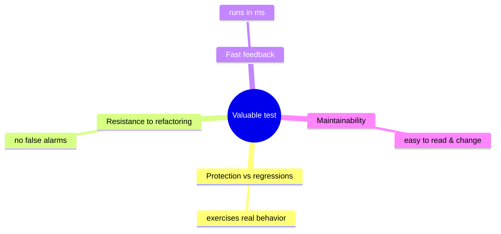
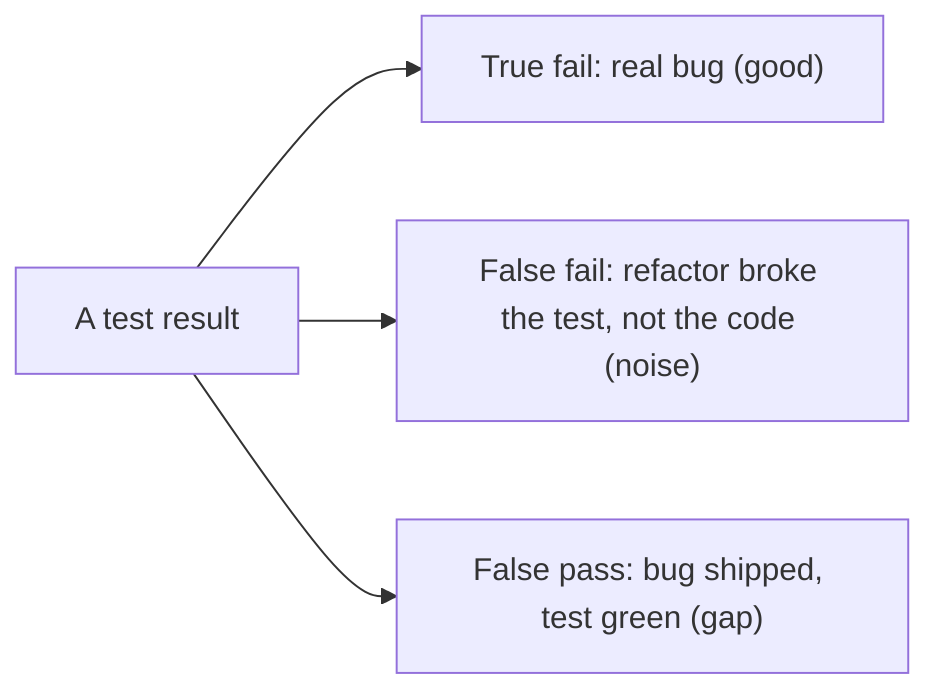
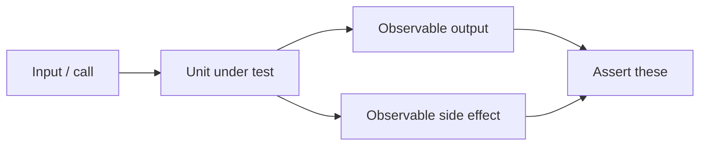
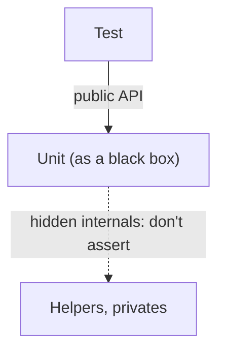

# Unit Testing Principles - Complete Professional Guide

> **Category:** 04_engineering_and_practices · **Language:** English

---

### What makes a test valuable, and how to avoid brittle tests
**Original guide written from first principles, current to 2026**

> **Original reference book (English).** This is an **independent, originally written** guide. It is not an extract, summary, or paraphrase of any third-party book; it teaches unit-testing principles from first principles with original examples. Canonical books are listed under **References** as pointers only. Each chapter follows the TO-BRAIN editorial standard (see `FILE_CONVENTIONS.md`).
>
> **Scope notice:** more tests is not better; the goal is a suite of **valuable** tests that catch real regressions without breaking on every refactor. This guide defines what makes a test good, what to test, and how to use test doubles well, current to 2026 practice.

---

## How to read this guide

| Level | Profile | Parts |
|-------|---------|-------|
| 1 — Beginner | Writing first tests | Part I |
| 2 — Intermediate | Designing a suite | Part II |

**Target audience:** developers who write tests and want them to pay off rather than become a maintenance burden.

**Structure of each chapter:** Introduction · Business context · Theoretical concepts · Architecture · Diagrams (Mermaid) · Real examples · Step by step · Complete examples · Exercises · Challenges · Checklist · Best practices · Anti-patterns · Troubleshooting · References.

> **Note on prerequisites.** Assumes a unit-testing framework and the TDD guide.

---

## Table of Contents

**Part I – What makes a good test**
1. The four properties of a valuable test
2. Test behavior, not implementation

**Part II – Doubles & isolation**
3. Mocks, stubs, and the classical vs London styles

> **Status of this guide:** phased delivery. **Ready:** Part I (Ch. 1–2). **In progress:** Part II.

---

## Part I – What makes a good test

A test suite is an asset only if its value exceeds its upkeep. Tests that break on every refactor, or that pass while bugs ship, are liabilities. So the first skill is judging a test's **value** — and writing tests that protect against regressions while staying resilient to change.

---

## Chapter 1 — The four properties of a valuable test

### 1.1 Introduction

A valuable test balances four properties: **protection against regressions** (it catches real bugs), **resistance to refactoring** (it doesn't break when you restructure without changing behavior), **fast feedback** (it runs quickly), and **maintainability** (it's easy to read and change). The hard part is that the first two pull against each other, and a good test maximizes their product, not any one alone.

### 1.2 Business context

Tests cost money to write *and* to maintain; a brittle suite that screams on every refactor can cost more than it saves, leading teams to delete or ignore it. Evaluating tests by these four properties keeps the suite a net asset — catching the regressions that matter while not taxing every change. This is the difference between testing that accelerates a team and testing that drags it down.

### 1.3 Theoretical concepts: the trade-off



The deep tension is **regression protection vs refactoring resistance**: testing more thoroughly (touching internals) raises protection but lowers refactoring resistance (false failures). The resolution is to test **observable behavior** through public interfaces — high protection *and* high resistance — which is why Chapter 2 matters most.

### 1.4 Architecture: false positives vs false negatives



A test loses value both when it cries wolf (false positive on refactor — erodes trust) and when it sleeps through a real bug (false negative). Both are reduced by testing behavior at the right granularity.

### 1.5 Real example

**Scenario.** A discount calculation must be tested.

**Problem.** A test asserting an internal helper was called breaks whenever you refactor the internals, even though behavior is unchanged.

**Solution.** Assert the observable result, not the internal mechanics.

**Implementation.**

```java
// BRITTLE: couples to implementation (breaks on refactor)
verify(discountHelper).computeRate(customer);   // testing HOW

// VALUABLE: asserts behavior (survives refactor, catches real bugs)
@Test void goldCustomerGetsTenPercentOff() {
    Money total = pricing.total(order, goldCustomer);   // testing WHAT
    assertEquals(Money.of(90), total);
}
```

**Result.** The behavior test catches a wrong discount (protection) and survives any internal refactor that keeps the result (resistance) — high on both axes.

**Future improvements.** Add cases for boundary tiers; keep assertions on outputs/effects, never on internal calls.

### 1.6 Exercises

1. Name the four properties of a valuable test.
2. Which two properties are in tension, and why?
3. Give an example of a false positive and a false negative.

### 1.7 Challenges

- **Challenge.** Find a test that asserts an internal call. Rewrite it to assert observable behavior and confirm it now survives a refactor of the internals.

### 1.8 Checklist

- [ ] I judge tests by the four-property balance.
- [ ] My tests catch real regressions.
- [ ] My tests survive behavior-preserving refactors.
- [ ] Tests are fast and readable.

### 1.9 Best practices

- Optimize for the product of protection × refactoring-resistance.
- Treat a test that breaks on refactors as a defect to fix.
- Keep tests fast so they're actually run.

### 1.10 Anti-patterns

- Tests coupled to implementation details (verify-internal-call).
- Chasing coverage numbers over test value.
- Slow suites that get skipped.

### 1.11 Troubleshooting

| Symptom | Likely cause | Action |
|---------|--------------|--------|
| Tests break on every refactor | Coupled to internals | Re-target at observable behavior |
| Bugs ship despite green tests | Tests don't exercise real behavior | Test through public interfaces with real cases |
| Suite ignored | Too slow | Speed up; isolate slow tests |

### 1.12 References

- V. Khorikov, *Unit Testing: Principles, Practices, and Patterns* (Manning, 2020) — ISBN 978-1617296277.
- K. Beck, *Test-Driven Development by Example* (Addison-Wesley, 2002) — ISBN 978-0321146533.

---

## Chapter 2 — Test behavior, not implementation

### 2.1 Introduction

The single most important rule for durable tests: assert **observable behavior** — outputs and externally visible side effects — not how the code achieves them. A test coupled to internals must change every time the internals change, which destroys the refactoring resistance that makes a suite worth keeping.

### 2.2 Business context

Implementation-coupled tests are the top reason teams come to resent and abandon test suites: refactoring becomes a chore of fixing tests that were never about behavior. Behavior-focused tests let the code be restructured freely while the suite keeps guarding the contract — preserving both the safety net and the team's willingness to improve the code.

### 2.3 Theoretical concepts: the unit's contract



Test the **contract**: given inputs, what outputs and side effects should occur. The internal collaborators, private methods, and intermediate states are not the contract — they're free to change. Assert what a caller could observe, nothing more.

### 2.4 Architecture: black-box at the right boundary



Treat the unit as a black box at a meaningful boundary (a class or module with a real responsibility), and assert only across that boundary. "Unit" need not mean "one class" — it means one behavior with a stable interface.

### 2.5 Real example

**Scenario.** An order service saves an order and publishes an event.

**Problem.** Asserting the internal repository method name and call order couples the test to implementation.

**Solution.** Assert the observable side effects: the order is persisted and an event is emitted — via the unit's outputs/observable collaborators.

**Implementation.**

```java
@Test void placingAnOrderPersistsItAndEmitsEvent() {
    var orders = new InMemoryOrders();        // real fake at a true boundary
    var events = new RecordingEvents();
    var service = new PlaceOrder(orders, events);

    OrderId id = service.handle(newOrder());

    assertTrue(orders.contains(id));          // observable effect
    assertTrue(events.contains("OrderPlaced", id));  // observable effect
}
```

**Result.** The test pins the behavior (order saved + event emitted) and ignores how — internal refactors won't break it, but a regression in either effect will.

**Future improvements.** Add failure-path tests (e.g. duplicate order rejected) at the same behavioral boundary.

### 2.6 Exercises

1. What counts as "observable behavior"?
2. Why does asserting private/internal calls hurt a test's value?
3. Why doesn't "unit" have to mean "one class"?

### 2.7 Challenges

- **Challenge.** Take a class with several collaborators. Write a test asserting only its observable outputs/effects, using real fakes at true boundaries — not mocks of internal helpers.

### 2.8 Checklist

- [ ] I assert outputs and observable side effects only.
- [ ] I don't assert private methods or internal call order.
- [ ] I pick the unit boundary by responsibility, not class count.
- [ ] My tests survive internal refactors.

### 2.9 Best practices

- Test through the public interface as a black box.
- Use real or simple fakes at genuine boundaries.
- Cover behavior and its failure paths, not mechanics.

### 2.10 Anti-patterns

- Verifying internal method calls and call order.
- Mocking everything, including the code under test's own helpers.
- One-class-per-test dogma that fragments behavior.

### 2.11 Troubleshooting

| Symptom | Likely cause | Action |
|---------|--------------|--------|
| Refactor breaks many tests | Implementation coupling | Assert behavior at the boundary |
| Tests pass but integration fails | Over-mocked internals | Test real behavior across true boundaries |
| Tests mirror the code structure | Wrong unit boundary | Test by responsibility, not per class |

### 2.12 References

- V. Khorikov, *Unit Testing: Principles, Practices, and Patterns* (Manning, 2020) — ISBN 978-1617296277.
- S. Freeman, N. Pryce, *Growing Object-Oriented Software, Guided by Tests* (Addison-Wesley, 2009) — ISBN 978-0321503626.

---

> **End of Part I.** You can now judge a test by the balance of regression protection, refactoring resistance, speed, and maintainability — and you know the master rule that maximizes the first two together: test observable behavior through public interfaces, never implementation details. **Part II — Doubles & isolation** (Chapter 3) covers stubs vs mocks, when each is appropriate, and the classical vs London testing styles.

<!--APPEND-PART-II-->
