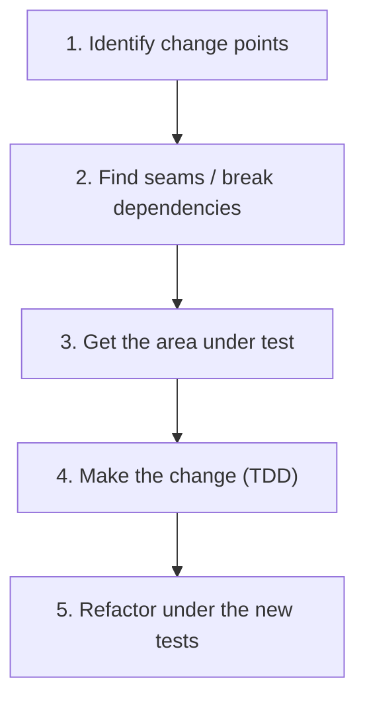
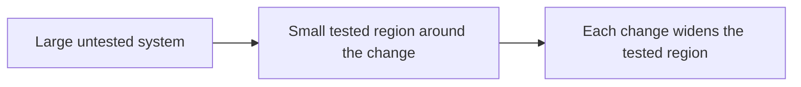
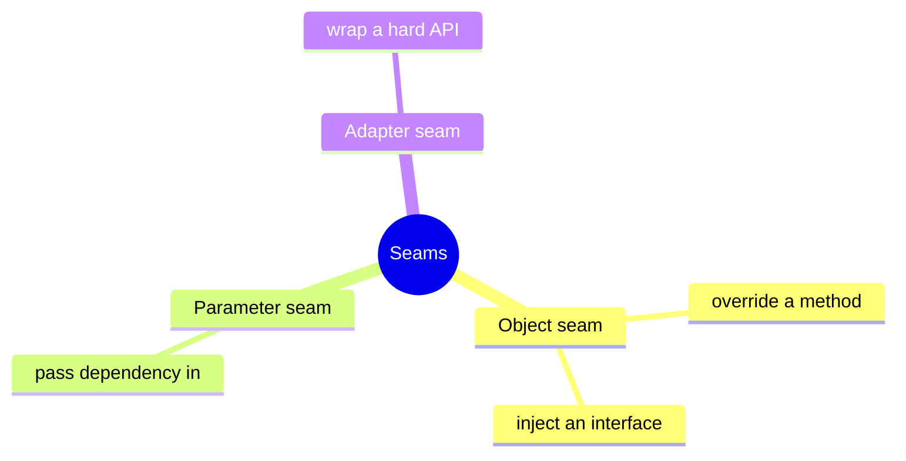
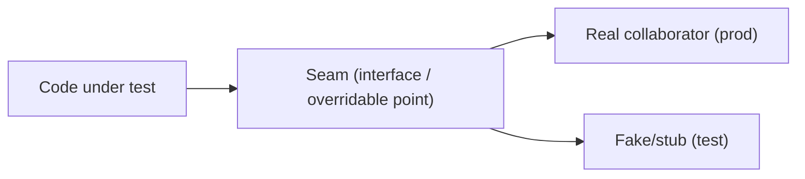
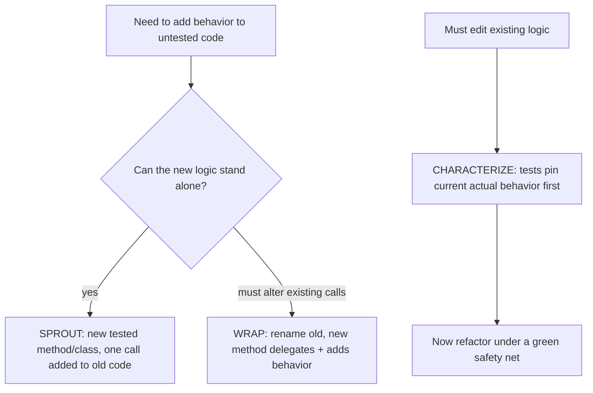
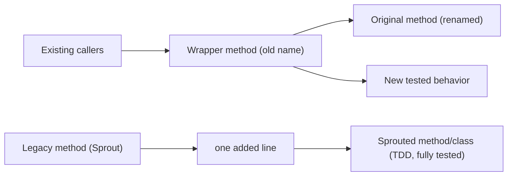

# Working with Legacy Code - Complete Professional Guide

> **Category:** 04_engineering_and_practices · **Language:** English

---

### Getting untested code under test with seams and safe changes
**Original guide written from first principles, current to 2026**

> **Original reference book (English).** This is an **independent, originally written** guide. It is not an extract, summary, or paraphrase of any third-party book; it teaches legacy-code techniques from first principles with original examples. Canonical books are listed under **References** as pointers only. Each chapter follows the TO-BRAIN editorial standard (see `FILE_CONVENTIONS.md`).
>
> **Scope notice:** here, **legacy code** means code without tests — code you're afraid to change because you can't tell if you broke it. This guide covers the core problem (getting code under test) and the techniques (seams, sprout/wrap, characterization tests) to change it safely. Current to 2026 tooling.

---

## How to read this guide

| Level | Profile | Parts |
|-------|---------|-------|
| 1 — Beginner | Inherited scary code | Part I |
| 2 — Intermediate | Breaking dependencies | Part II |

**Target audience:** developers maintaining and changing existing systems that lack tests.

**Structure of each chapter:** Introduction · Business context · Theoretical concepts · Architecture · Diagrams (Mermaid) · Real examples · Step by step · Complete examples · Exercises · Challenges · Checklist · Best practices · Anti-patterns · Troubleshooting · References.

> **Note on prerequisites.** Assumes unit-testing basics and the refactoring guide.

---

## Table of Contents

**Part I – The legacy problem**
1. Legacy code is code without tests
2. Seams: places to change behavior without editing in place

**Part II – Adding behavior safely**
3. Sprout and wrap; characterization tests

> **Status of this guide:** complete for its declared scope. **Ready:** Parts I–II (Ch. 1–3).

---

## Part I – The legacy problem

The defining feature of legacy code isn't age or ugliness — it's the **absence of tests**. Without tests you can't refactor safely, so the code stays risky to touch, so it never improves: a doom loop. The way out is a specific skill: getting a piece of code under test *before* changing it, even when it resists.

---

## Chapter 1 — Legacy code is code without tests

### 1.1 Introduction

**Legacy code** is code you can't change with confidence because nothing tells you whether you broke it. The central dilemma: to change it safely you want tests, but to add tests you often must change it (to break dependencies) — a chicken-and-egg you resolve with minimal, careful, dependency-breaking edits.

### 1.2 Business context

Legacy systems usually run the business, so the inability to change them safely is a direct drag on delivering value — features take longer, every change risks an outage, and fear drives teams to "rewrite" gambles that often fail. The skill of incrementally getting code under test converts a frozen, risky asset back into a changeable one, protecting both velocity and uptime.

### 1.3 Theoretical concepts: the change algorithm



The disciplined approach: find where you must change, break just enough dependencies to instantiate and test that area, write **characterization tests** to pin current behavior, then make the change test-first and refactor. You add tests incrementally around the change, not all at once.

### 1.4 Architecture: a beachhead of safety



You don't test everything; you create a **tested beachhead** around each change and let coverage grow organically as you touch more code over time.

### 1.5 Real example

**Scenario.** A 400-line method must get one new rule, but it news-up a database connection inside, so it can't be unit-tested.

**Problem.** You can't instantiate it in a test without a real database.

**Solution.** Break the dependency minimally (pass the dependency in), then characterize and change.

**Implementation (minimal dependency break).**

```java
// BEFORE: hard dependency makes it untestable
class ReportJob {
    void run() {
        Db db = new Db("prod-conn");   // can't avoid a real DB in a test
        // ...400 lines...
    }
}

// AFTER: parameterize the dependency (smallest safe change) -> now testable
class ReportJob {
    void run() { run(new Db("prod-conn")); }    // keep old callers working
    void run(Db db) { /* ...400 lines... */ }   // tests pass a fake Db
}
```

**Result.** The method can now be exercised with a fake `Db`; you write characterization tests, then add the new rule test-first — without a database in the loop.

**Future improvements.** Continue extracting cohesive pieces of the 400 lines under the now-passing tests.

### 1.6 Exercises

1. What actually defines "legacy code" here?
2. Describe the chicken-and-egg of testing legacy code.
3. What is a "tested beachhead" and why not test everything first?

### 1.7 Challenges

- **Challenge.** Find an untestable method (hard-coded dependency inside). Make the smallest change to inject that dependency and get one test running against it.

### 1.8 Checklist

- [ ] I treat "no tests" as the definition of legacy.
- [ ] I get the change area under test before changing it.
- [ ] I break only the dependencies I must.
- [ ] I grow coverage incrementally around changes.

### 1.9 Best practices

- Add tests around the change, not the whole system.
- Make the smallest dependency-breaking edit needed to test.
- Characterize current behavior before altering it.

### 1.10 Anti-patterns

- "Big rewrite" instead of incrementally testing what exists.
- Changing legacy code with no test net ("edit and pray").
- Trying to achieve full coverage before any change.

### 1.11 Troubleshooting

| Symptom | Likely cause | Action |
|---------|--------------|--------|
| Can't instantiate a class in a test | Hard internal dependencies | Break a seam; inject the dependency |
| Afraid to change a module | No tests | Characterize it, then change test-first |
| Rewrite stalled/failed | Threw away working behavior | Incrementally test and refactor instead |

### 1.12 References

- M. Feathers, *Working Effectively with Legacy Code* (Prentice Hall, 2004) — ISBN 978-0131177055.
- K. Beck, *Test-Driven Development by Example* (Addison-Wesley, 2002) — ISBN 978-0321146533.

---

## Chapter 2 — Seams

### 2.1 Introduction

A **seam** is a place where you can change a program's behavior **without editing in that place** — a point where you can substitute one piece for another (a different implementation, a fake). Seams are how you get rigid code under test: you exploit an existing seam, or introduce one with a tiny edit, to insert a test double where a hard dependency was.

### 2.2 Business context

The reason legacy code resists testing is usually hard-wired dependencies (a `new` inside, a static call, a global). Seams are the lever that pries those open with minimal risk, turning "this can't be tested" into "this can." Knowing seam types means you can almost always find a low-risk way in, instead of resorting to dangerous large edits or giving up on tests.

### 2.3 Theoretical concepts: kinds of seams



The most useful is the **object seam**: depend on an interface (or an overridable method) so a test can supply a fake. Where a class news-up or statically calls a collaborator, you introduce a seam by extracting that call behind something substitutable — the smallest change that lets a double slip in.

### 2.4 Architecture: insert a double at the seam



At the seam, production wires the real collaborator and the test wires a fake — same code, controlled dependency. That control is what makes the unit testable in isolation.

### 2.5 Real example

**Scenario.** A class calls a static `Clock.now()`, making time-dependent logic untestable.

**Problem.** Tests can't control "now," so time-based branches can't be exercised deterministically.

**Solution.** Introduce an object seam: depend on a `Clock` interface instead of the static call.

**Implementation.**

```java
interface Clock { Instant now(); }                         // the seam

class SubscriptionService {
    private final Clock clock;
    SubscriptionService(Clock clock) { this.clock = clock; }
    boolean isExpired(Subscription s) { return s.endsAt().isBefore(clock.now()); }
}

// test: inject a fixed clock — deterministic
var svc = new SubscriptionService(() -> Instant.parse("2026-06-23T00:00:00Z"));
```

**Result.** Time becomes controllable; expiry logic is tested deterministically. The seam (the `Clock` interface) replaced an untestable static call.

**Future improvements.** Apply the same seam to other ambient dependencies (randomness, environment, network).

### 2.6 Exercises

1. Define a seam in your own words.
2. Why is an object seam usually the most useful kind?
3. Give an ambient dependency (besides time) worth putting behind a seam.

### 2.7 Challenges

- **Challenge.** Find code calling a static/global (time, random, env). Introduce an object seam so a test can control it, and write a deterministic test.

### 2.8 Checklist

- [ ] I can spot hard dependencies that block testing.
- [ ] I introduce seams with minimal edits.
- [ ] I inject doubles at seams for isolation.
- [ ] Ambient dependencies (time, random) are behind seams.

### 2.9 Best practices

- Prefer object seams (interfaces/injection) for control.
- Make the seam-introducing edit as small as possible.
- Put time, randomness, and I/O behind seams routinely.

### 2.10 Anti-patterns

- Static/global calls buried in logic, blocking tests.
- Large rewrites to "make it testable" instead of a small seam.
- Tests that depend on real time/network and flake.

### 2.11 Troubleshooting

| Symptom | Likely cause | Action |
|---------|--------------|--------|
| Can't control a dependency in test | Hard static/global call | Introduce an object seam |
| Time/random tests flake | Ambient dependency not seamed | Inject a fixed clock/seed |
| Seam edit feels risky | Doing too much at once | Make the smallest substitutable change |

### 2.12 References

- M. Feathers, *Working Effectively with Legacy Code* (Prentice Hall, 2004) — ISBN 978-0131177055.
- G. Meszaros, *xUnit Test Patterns* (Addison-Wesley, 2007) — ISBN 978-0131495050.

---

> **End of Part I.** You can now recognize legacy code as code without tests, follow the algorithm to get a change area under test before touching it, and use seams — especially object seams via interfaces/injection — to break hard dependencies and insert test doubles with minimal-risk edits. **Part II — Adding behavior safely** (Chapter 3) covers sprout and wrap techniques for adding code without modifying risky methods, and characterization tests for pinning existing behavior.

## Part II – Adding behavior safely

The seams of Part I let you get existing code under test. But there is a chicken-and-egg trap: to change risky code safely you want tests, yet writing tests often requires changing the very code you fear. Part II resolves it with two complementary moves. First, **add new behavior beside the old** — *Sprout* and *Wrap* — so the change lives in fresh, fully tested code while the legacy method stays almost untouched. Second, when you *must* edit existing logic, pin its current behavior first with **characterization tests** — tests that document what the system *actually does*, not what it should do — so any accidental change announces itself as a failure.

---

## Chapter 3 — Sprout and wrap; characterization tests

### 3.1 Introduction

When you must add a feature to a method you can't yet get under test, you have two bad options and two good ones. The bad options: edit it in place (risky, untested) or stall until you've untangled all its dependencies (expensive, indefinite). The good options are Feathers's *sprout* and *wrap* techniques. **Sprout** puts the new logic in a brand-new, test-driven method or class, and calls it from a single added line in the old code. **Wrap** renames the old method and creates a new one in its place that calls the original plus your new behavior, so existing callers pick up the addition without the old logic being touched. Both confine the untested, scary part to one trivial edit. The third tool, the **characterization test**, applies when you cannot avoid editing existing behavior: you write tests that capture what the code *currently* returns — bugs and all — turning its real behavior into a safety net before you refactor.

### 3.2 Business context

Legacy systems carry the business's revenue but resist change; every edit risks a regression nobody can predict because there are no tests to catch it. Sprout, wrap, and characterization testing exist to make change *incremental and reversible* under exactly those conditions, without a big-bang rewrite the business can't afford. Sprouting a new tested method to add, say, a discount rule means the change is isolated, reviewable, and covered — if it breaks, the blast radius is one method. Characterization tests convert tribal knowledge ("don't touch the billing calculation, it does something weird with rounding") into executable facts, so a new developer can refactor confidently and an accidental behavior change is caught in CI rather than by a customer. The net effect is that a frozen, change-averse codebase becomes one a team can evolve a little at a time — the difference between a system that can absorb new requirements and one that must eventually be thrown away.

### 3.3 Theoretical concepts: confine the change, then pin behavior



The unifying principle is **minimize the untested edit**. Sprout and wrap each reduce the change to the legacy method to a single, obvious, low-risk line, while the real work happens in new code built with TDD. A **characterization test** is different in intent from a normal unit test: it does not assert *correct* behavior, it asserts *current* behavior. You write a test, run it, and let it tell you what the code actually does (often by asserting a guessed value, reading the real value from the failure message, then pinning that). The suite that results is a precise, executable description of the legacy system as-is — the reference point against which any future change is measured.

### 3.4 Architecture: where the new code lives



**Sprout** keeps the legacy method as the host and bolts on a single call to fresh code — best when the addition is a distinct piece of work. **Wrap** inverts control at the call site: the old name now points at a thin new method that delegates to the renamed original and layers in the addition — best when *every* existing call must gain the new behavior (logging, auditing, notifications). The architectural payoff in both is the same: new behavior arrives as **clean, tested, named** code rather than another line buried in a long untested method, so the system's tested surface grows with every change instead of shrinking.

### 3.5 Real example

**Scenario.** A 200-line `Transaction.post()` method handles core ledger posting. Product wants every posting to also emit an audit record. The method has no tests and tangled dependencies that make it hard to instantiate in a harness.

**Problem.** Editing `post()` directly is dangerous — there are no tests to catch a regression in the ledger logic — but the team can't quickly get the whole method under test either.

**Solution.** **Sprout** the audit logic into a new, test-driven `AuditEntry` builder and call it from one added line in `post()`. The new code is fully covered; the legacy method changes by exactly one line. Where the team *does* need to touch existing logic (a rounding tweak), they first write **characterization tests** that pin `post()`'s current output for a battery of inputs.

**Implementation.**

```java
// SPROUT — new behavior in fully tested new code
class AuditEntry {                         // built with TDD, 100% covered
    static AuditEntry forPosting(Transaction t) { /* ... */ }
}

class Transaction {
    void post() {
        // ...200 lines of untouched legacy ledger logic...
        AuditEntry.forPosting(this).record();   // <-- the ONE added line
    }
}

// CHARACTERIZATION — pin current behavior before the rounding change
@Test void post_pins_current_balance() {
    Transaction t = sampleTransaction();
    t.post();
    // value read from the FIRST run's failure, not from the spec — it documents what IS
    assertEquals(new BigDecimal("142.86"), t.account().balance());
}
```

**Result.** The audit feature ships as isolated, tested code; the risky `post()` method gained a single reviewable line. The characterization tests caught two unintended balance changes during the rounding refactor that no one had predicted — exactly the regressions that would otherwise have reached production.

**Future improvements.** Each characterization test is a foothold: over successive changes the team adds more, gradually surrounding `post()` until it is well enough covered to be safely decomposed (extract method/class), at which point the sprouted pieces can fold back into a cleaner design.

### 3.6 Exercises

1. State the difference between Sprout Method and Wrap Method, and when each is the better choice.
2. How does a characterization test differ in *intent* from an ordinary unit test?
3. Why does Sprout reduce the change to legacy code to a single line, and why does that matter?
4. Describe the loop for *discovering* the value to assert in a characterization test.

### 3.7 Challenges

- **Challenge.** Take an untested method in any codebase. Add a new piece of behavior using Sprout Method, building the sprouted code test-first. Then pick an existing method you'd like to refactor, write three characterization tests that pin its current output (reading the real values from the failures), and perform a small refactor under that net. Did a characterization test catch anything you didn't expect?

### 3.8 Checklist

- [ ] I add new behavior as new, test-driven code (Sprout/Wrap) rather than inline in untested methods.
- [ ] I keep the edit to the legacy method down to a single, obvious call.
- [ ] I use Wrap when *all* existing callers must gain the behavior; Sprout when it's a distinct addition.
- [ ] Before changing existing logic, I pin its current behavior with characterization tests.
- [ ] My characterization tests assert what the code *does*, not what it *should* do.

### 3.9 Best practices

- Build the sprouted method or class with TDD, so the new code is fully covered from birth.
- Name sprouted code for the concept it adds; let new classes become first-class design elements over time.
- Write characterization tests by asserting a guess, then pinning the actual value the failure reveals.
- Grow characterization coverage opportunistically — every change is a chance to add one more pinning test.

### 3.10 Anti-patterns

- Adding behavior inline in a long untested method ("just one more line").
- Refactoring legacy logic with no characterization tests, trusting your reading of the code.
- Writing characterization tests that assert *intended* behavior, hiding existing bugs the system depends on.
- Sprouting code without tests, losing the entire advantage of the technique.

### 3.11 Troubleshooting

| Symptom | Likely cause | Action |
|---------|--------------|--------|
| Afraid to add a feature to a method | No tests around it | Sprout the feature into new tested code; add one call |
| Need new behavior on every existing call | Editing each call site by hand | Wrap the method: rename original, delegate from a new one |
| Refactor introduced a silent regression | No net pinning current behavior | Add characterization tests first, then refactor |
| Don't know what value to assert | Behavior undocumented | Assert a guess, run, pin the actual value from the failure |

### 3.12 References

- M. Feathers, *Working Effectively with Legacy Code* (Prentice Hall, 2004), ch. 6 "I Don't Have Much Time and I Have to Change It" (Sprout Method/Class, Wrap Method/Class) and ch. 13 "I Need to Make a Change, but I Don't Know What Tests to Write" (Characterization Tests) — ISBN 978-0131177055.
- K. Beck, *Test-Driven Development by Example* (Addison-Wesley, 2002) — ISBN 978-0321146533.

---

> **End of Part II.** You can now add behavior to dangerous code without editing it in place: **Sprout** isolates a distinct addition in new test-driven code reached by one added call, **Wrap** layers behavior onto every existing call by delegating from a renamed original, and **characterization tests** pin what the code *actually does* so you can refactor existing logic under a green safety net. Together with Part I's seams, these techniques let a team change a frozen, untested system incrementally and reversibly — growing the tested surface with every edit instead of gambling on each one.
