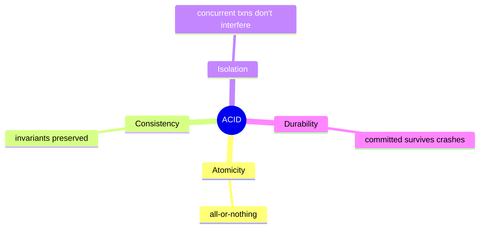
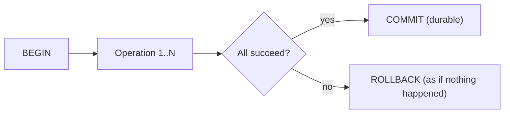
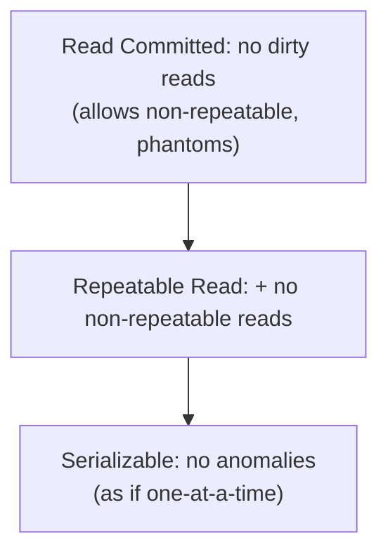
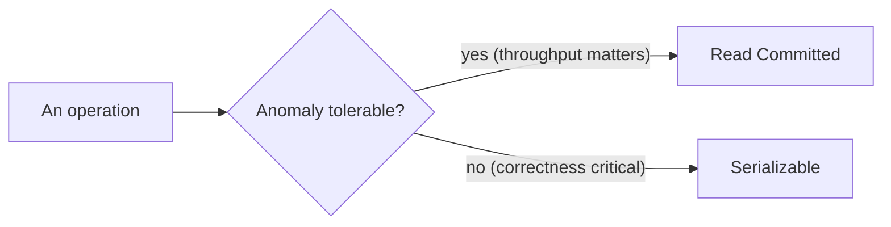

# Database Transactions and Concurrency - Complete Professional Guide

> **Category:** 05_databases · **Language:** English

---

### ACID, isolation levels, and concurrency control
**Original guide written from first principles, current to 2026**

> **Original reference book (English).** This is an **independent, originally written** guide. It is not an extract, summary, or paraphrase of any third-party book; it teaches transactions and concurrency from first principles with original examples. Canonical books are listed under **References** as pointers only. Each chapter follows the TO-BRAIN editorial standard (see `FILE_CONVENTIONS.md`).
>
> **Scope notice:** transactions let many users hit a database at once without corrupting data or seeing inconsistent state. This guide covers ACID, isolation levels and the anomalies they prevent, and how engines enforce them (locking, MVCC) — current to 2026.

---

## How to read this guide

| Level | Profile | Parts |
|-------|---------|-------|
| 1 — Beginner | New to transactions | Part I |
| 2 — Intermediate | Choosing isolation | Part II |

**Target audience:** application developers who write transactional code against relational databases.

**Structure of each chapter:** Introduction · Business context · Theoretical concepts · Architecture · Diagrams (Mermaid) · Real examples · Step by step · Complete examples · Exercises · Challenges · Checklist · Best practices · Anti-patterns · Troubleshooting · References.

> **Note on prerequisites.** Assumes SQL and the data-intensive-systems guide.

---

## Table of Contents

**Part I – Transactions**
1. ACID: what a transaction guarantees
2. Isolation levels and concurrency anomalies

**Part II – Mechanisms**
3. How engines enforce isolation (locking and MVCC)

> **Status of this guide:** phased delivery. **Ready:** Part I (Ch. 1–2). **In progress:** Part II.

---

## Part I – Transactions

A **transaction** groups operations so they succeed or fail as a unit and don't corrupt each other when running concurrently. Without transactions, concurrent users produce lost updates, half-applied changes, and inconsistent reads. ACID names the guarantees; isolation levels let you trade strictness for performance.

---

## Chapter 1 — ACID

### 1.1 Introduction

**ACID** is four guarantees a transaction provides. **Atomicity**: all-or-nothing — either every operation applies or none does. **Consistency**: a transaction moves the database from one valid state to another (constraints hold). **Isolation**: concurrent transactions don't see each other's partial work. **Durability**: once committed, changes survive crashes (the WAL, from the internals guide).

### 1.2 Business context

ACID is what lets a business trust its data under concurrency: money isn't lost or double-spent, an order isn't half-created, a report doesn't read mid-update garbage. Many failures that look like application bugs are really missing transactional boundaries. Knowing ACID lets developers draw the right transaction boundaries so correctness holds even when thousands of users act at once.

### 1.3 Theoretical concepts: the four guarantees



The two that most shape application code are **atomicity** (wrap related changes in one transaction so a failure rolls everything back) and **isolation** (Chapter 2, the configurable one). Consistency is partly the database's job (constraints) and partly yours (correct logic). Durability is handled by the engine's WAL.

### 1.4 Architecture: a transaction boundary



Everything between BEGIN and COMMIT is atomic: a failure anywhere triggers ROLLBACK, leaving the database as if the transaction never ran.

### 1.5 Real example

**Scenario.** Transfer money between two accounts.

**Problem.** Two separate statements (debit, credit) without a transaction can leave money debited but not credited if the second fails.

**Solution.** Wrap both in one transaction — atomicity guarantees both or neither.

**Implementation.**

```sql
BEGIN;
  UPDATE accounts SET balance = balance - 100 WHERE id = :from AND balance >= 100;
  -- if the row wasn't updated (insufficient funds), the app aborts:
  UPDATE accounts SET balance = balance + 100 WHERE id = :to;
COMMIT;   -- both applied, durably; any failure -> ROLLBACK, neither applied
```

**Result.** Money can never be debited without being credited; a crash or error rolls back both halves. The invariant "total money conserved" holds.

**Future improvements.** Add a CHECK constraint (balance >= 0) so consistency is enforced by the database too.

### 1.6 Exercises

1. Name the four ACID guarantees in one phrase each.
2. Which two most directly shape application code?
3. Why must a money transfer be one transaction?

### 1.7 Challenges

- **Challenge.** Find two related writes in your code not wrapped in a transaction. What inconsistent state is possible if the second fails? Wrap them.

### 1.8 Checklist

- [ ] I group related writes into one transaction (atomicity).
- [ ] I rely on the DB to enforce constraints (consistency).
- [ ] I understand isolation is configurable (Ch. 2).
- [ ] I trust durability comes from the WAL.

### 1.9 Best practices

- Draw transaction boundaries around invariants.
- Keep transactions short to reduce contention.
- Let database constraints enforce consistency.

### 1.10 Anti-patterns

- Related writes outside a transaction (partial updates).
- Long-running transactions holding locks/contention.
- Relying only on app logic for invariants the DB could enforce.

### 1.11 Troubleshooting

| Symptom | Likely cause | Action |
|---------|--------------|--------|
| Half-applied multi-step changes | Missing transaction | Wrap related writes in BEGIN/COMMIT |
| Constraint violations slip through | Logic-only checks | Add DB constraints |
| High contention | Long transactions | Shorten transaction scope |

### 1.12 References

- A. Silberschatz, H. Korth, S. Sudarshan, *Database System Concepts*, 7th ed. (McGraw-Hill, 2019) — ISBN 978-0078022159.
- J. Gray, A. Reuter, *Transaction Processing* (Morgan Kaufmann, 1992) — ISBN 978-1558601901.

---

## Chapter 2 — Isolation levels and anomalies

### 2.1 Introduction

Full isolation (transactions behaving as if run one at a time) is expensive, so databases offer **isolation levels** that trade strictness for concurrency. Each level permits or prevents certain **anomalies** — dirty reads, non-repeatable reads, phantoms. Choosing a level is choosing which concurrency bugs you can tolerate for which performance.

### 2.2 Business context

The default isolation level (often Read Committed) allows anomalies many developers don't expect, causing subtle concurrency bugs — a balance check that's stale by the time you act on it, a count that changes mid-transaction. Understanding the levels lets teams pick the right one per operation: strong isolation where correctness is critical (money), weaker where throughput matters and anomalies are harmless. Getting this wrong produces rare, hard-to-reproduce data bugs.

### 2.3 Theoretical concepts: levels vs anomalies



- **Dirty read**: seeing another transaction's uncommitted changes (prevented at Read Committed and above).
- **Non-repeatable read**: re-reading a row and getting a different value (prevented at Repeatable Read).
- **Phantom**: a re-run query returns new rows that appeared (prevented at Serializable).

Higher levels prevent more anomalies at higher cost (more locking/aborts).

### 2.4 Architecture: pick per operation



Isolation isn't one global setting you forget — match it to each operation's correctness needs. A reporting read can tolerate weak isolation; a balance-checking transfer may need Serializable.

### 2.5 Real example

**Scenario.** Enforce "an account may have at most 5 active sessions" under concurrent logins.

**Problem.** At Read Committed, two simultaneous logins both count 4 existing sessions and both insert — ending at 6 (a phantom/write-skew anomaly).

**Solution.** Use Serializable (or an explicit lock) so the count-then-insert is safe.

**Implementation.**

```sql
-- Serializable prevents the write-skew: one transaction will be aborted and retried
BEGIN ISOLATION LEVEL SERIALIZABLE;
  SELECT count(*) FROM sessions WHERE user_id = :u AND active;   -- sees a consistent count
  -- if < 5:
  INSERT INTO sessions(user_id, active) VALUES (:u, true);
COMMIT;   -- concurrent conflicting txn gets a serialization error -> retry
```

**Result.** Concurrent logins can't both slip past the limit; the engine serializes the conflicting pair (one retries), upholding the rule.

**Future improvements.** Handle the serialization-failure error with a retry loop (expected under Serializable).

### 2.6 Exercises

1. Name three anomalies and the level that first prevents each.
2. Why isn't everyone on Serializable by default?
3. What is write skew and which level prevents it?

### 2.7 Challenges

- **Challenge.** Find an invariant enforced by count-then-write in your code. Under the default isolation, can two concurrent transactions both pass? Fix with Serializable or a lock.

### 2.8 Checklist

- [ ] I know what anomalies my default level allows.
- [ ] I raise isolation where correctness demands it.
- [ ] I handle serialization failures with retries.
- [ ] I use the weakest level that's still correct per operation.

### 2.9 Best practices

- Match isolation level to each operation's correctness needs.
- Expect and retry serialization failures under Serializable.
- Don't assume the default prevents all anomalies.

### 2.10 Anti-patterns

- Assuming the default level is fully isolated.
- Count-then-insert invariants under weak isolation.
- Using Serializable everywhere, ignoring its abort/retry cost.

### 2.11 Troubleshooting

| Symptom | Likely cause | Action |
|---------|--------------|--------|
| Rare invariant violations under load | Weak isolation / write skew | Raise to Serializable or lock |
| Stale value used in a decision | Non-repeatable read | Use Repeatable Read or re-check |
| Serialization errors appearing | Serializable conflicts (expected) | Add a retry loop |

### 2.12 References

- A. Silberschatz, H. Korth, S. Sudarshan, *Database System Concepts*, 7th ed. (McGraw-Hill, 2019) — ISBN 978-0078022159.
- PostgreSQL docs, "Transaction Isolation": https://www.postgresql.org/docs/current/transaction-iso.html.

---

> **End of Part I.** You can now reason about transactions: the ACID guarantees (especially atomicity for boundaries and isolation as the tunable one), and the isolation levels that trade strictness for concurrency by permitting or preventing dirty reads, non-repeatable reads, and phantoms — choosing the weakest level that's still correct per operation. **Part II — Mechanisms** (Chapter 3) covers how engines actually enforce isolation: pessimistic locking versus multi-version concurrency control (MVCC), the model behind PostgreSQL and most modern databases.

<!--APPEND-PART-II-->
