# Designing Data-Intensive Systems - Complete Professional Guide

> **Category:** 05_databases · **Language:** English

---

### Reliability, scalability, and maintainability for modern data systems
**Original guide written from primary sources, current to 2026**

> **Original reference book (English).** This is an **independent, originally written** guide. It is not an extract, summary, or paraphrase of any third-party book; it teaches the topic from first principles and primary sources (database documentation, distributed-systems papers, and protocol specifications). Where a canonical book covers the same ground, it is listed under **References** as a pointer only. Each chapter follows the TO-BRAIN editorial standard (see `FILE_CONVENTIONS.md`).
>
> **Scope notice:** this guide covers how to reason about systems whose primary challenge is **data** — its volume, velocity, complexity, and the guarantees applications need from it. It is technology-agnostic but grounded in how real engines (PostgreSQL, Cassandra, Kafka, object stores, modern lakehouse/streaming platforms) behave in 2026.

---

## How to read this guide

| Level | Profile | Parts |
|-------|---------|-------|
| 1 — Beginner | New to data systems | Part I |
| 2 — Intermediate | App developers choosing a store | Parts II–III |
| 3 — Advanced | Designing for scale & failure | Parts IV–V |
| 4 — Specialist | Consistency & coordination | Part VI |
| 5 — Architect | Streaming & system integration | Part VII |

**Target audience:** backend and data engineers, architects, platform/SRE teams, and tech leads who must choose, combine, and operate databases, queues, caches, and stream processors.

**Structure of each chapter:** Introduction · Business context · Theoretical concepts · Architecture · Diagrams (Mermaid) · Real examples · Step by step · Complete examples · Exercises · Challenges · Checklist · Best practices · Anti-patterns · Troubleshooting · References.

> **Note on prerequisites.** Assumes basic SQL, HTTP, and familiarity with at least one programming language. No prior distributed-systems background is required; the concepts are built up from first principles.

---

## Table of Contents

**Part I – Foundations**
1. The three pillars: reliability, scalability, maintainability
2. Thinking in data models (relational, document, graph)

**Part II – Storage & Retrieval**
3. How storage engines actually work (B-trees vs LSM-trees)
4. Encoding, schema evolution, and compatibility

**Part III – Distributing Data**
5. Replication (leader-based, multi-leader, leaderless)
6. Partitioning (sharding) and rebalancing

**Part IV – Consistency & Correctness**
7. Transactions and isolation levels
8. The trouble with distributed systems (clocks, failures, quorums)

**Part V – Consensus & Coordination**
9. Consistency models and consensus

**Part VI – Derived & Streaming Data**
10. Batch and stream processing
11. Designing systems of integration (the "unbundled database")

> **Status of this guide:** complete. **Ready:** Parts I–VI (Ch. 1–11).

---

## Part I – Foundations

A "data-intensive" system is one where the **hard part is the data** — not raw CPU. The bottlenecks are data volume, the rate it changes, and the complexity of the guarantees applications place on it. Almost every such system is assembled from a handful of building blocks — databases, caches, search indexes, message queues, and stream processors — wired together. The skill is knowing what each block guarantees, where it breaks, and how the seams between them behave.

---

## Chapter 1 — The three pillars: reliability, scalability, maintainability

### 1.1 Introduction

Before choosing any technology, name the **non-functional goals** the system must meet. Three recur in every data system: it should keep working correctly when things go wrong (**reliability**), keep performing as load grows (**scalability**), and stay workable for the humans who operate and change it (**maintainability**). These are not vague ideals — each can be made measurable and turned into design pressure.

### 1.2 Business context

These pillars are where engineering meets money. An hour of downtime has a euro figure; so does a checkout page that takes three seconds under Black-Friday load, or an on-call engineer burning out on a system nobody understands. Stating the targets explicitly — "99.9% of writes acknowledged under 50 ms at 10× today's traffic" — turns architecture from taste into a decision you can defend and verify.

### 1.3 Theoretical concepts: defining each pillar

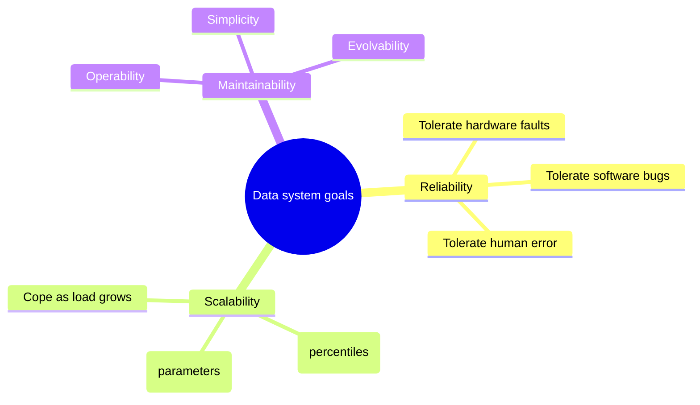

- **Reliability** = continuing to work *correctly* even when faults occur. A *fault* is one component deviating from spec; a *failure* is the system as a whole stopping. The goal is to prevent faults from becoming failures. You raise reliability by **tolerating** faults, not by hoping they never happen — and the only way to trust fault tolerance is to deliberately trigger faults (fault injection, chaos testing).
- **Scalability** = the system's ability to cope with **increased load**. It is meaningless until you (a) describe load with concrete **parameters** (requests/sec, read/write ratio, fan-out, concurrent users) and (b) describe performance with **percentiles**, not averages. Tail latency (p95/p99) is what users actually feel and what amplifies under fan-out.
- **Maintainability** = the cost of *living with* the system over years: **operability** (easy for ops to keep it healthy), **simplicity** (easy for new engineers to understand — fight accidental complexity), and **evolvability** (easy to change as requirements move).

### 1.4 Architecture: where the goals bite

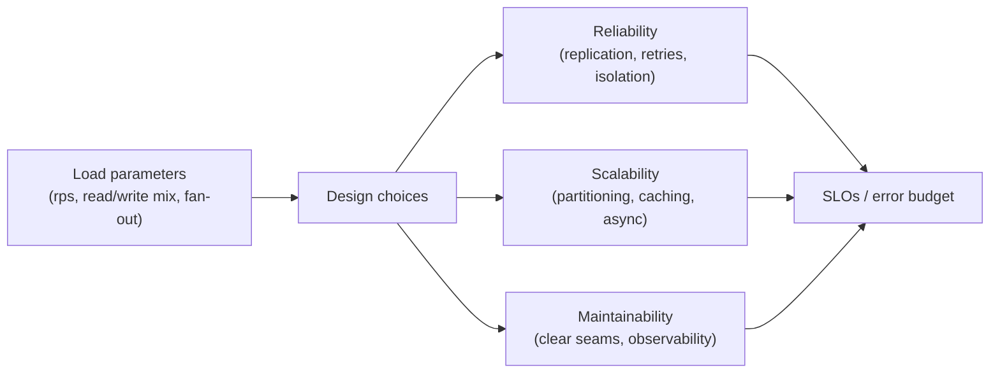

Every later decision in this guide — replication, partitioning, isolation level, batch vs stream — is a trade between these three. There is no "best database," only the best fit for a stated load and a stated guarantee.

### 1.5 Real example

**Scenario.** A social feed must show each user a timeline of posts from people they follow.

**Problem.** A celebrity with 30M followers makes naive "fan-out on read" (query all followees at read time) too slow at the tail, while naive "fan-out on write" (push each post into every follower's timeline) explodes for that same celebrity.

**Solution.** Make load a parameter: most users are cheap to fan out **on write**; a small set of high-follower accounts are handled **on read** and merged in. The split point is chosen from the actual follower-count distribution.

**Implementation (sketch).**

```text
on new post by U:
    if followers(U) <= THRESHOLD:        # ordinary user
        for f in followers(U):           # fan-out on write
            append post_id to timeline_cache[f]
    else:                                # celebrity: skip the fan-out
        mark U as "pull at read time"

on read timeline for V:
    base   = timeline_cache[V]                    # precomputed
    celebs = [u for u in follows(V) if is_pull(u)]
    extra  = recent_posts(celebs)                 # fan-out on read, few accounts
    return merge_by_time(base, extra)
```

**Result.** The expensive operation (touching 30M timelines) never happens; the tail is bounded because the read-time merge touches only a handful of accounts.

**Future improvements.** Measure the threshold from the live follower histogram; cache the celebrity merge for a few seconds; track p99 timeline-build latency as the SLI.

### 1.6 Exercises

1. Give two load parameters for a payment API and two for a chat app — why do they differ?
2. Why is p99 latency a better target than mean latency for a user-facing read?
3. Define *fault* vs *failure* and give one example of turning a fault into a non-failure.

### 1.7 Challenges

- **Challenge.** Take any service you know. Write its load in 3 parameters and its performance goal as a percentile. Then name the single design choice most likely to break first as load grows 10×.

### 1.8 Checklist

- [ ] I can state load as concrete parameters, not "a lot of traffic."
- [ ] I describe latency with percentiles, not averages.
- [ ] I distinguish reliability (tolerating faults) from "no faults."
- [ ] I treat operability, simplicity, and evolvability as design targets.

### 1.9 Best practices

- Write the SLO **before** the architecture; let it drive the trade-offs.
- Test fault tolerance by injecting faults — untested failover is not failover.
- Track tail latency (p95/p99) per endpoint, not just the average.

### 1.10 Anti-patterns

- "Scalable" as a marketing adjective with no load parameter behind it.
- Averaging latency, hiding the tail users actually experience.
- Adding components for resilience without ever exercising the failure path.

### 1.11 Troubleshooting

| Symptom | Likely cause | Action |
|---------|--------------|--------|
| p99 spikes under load, mean looks fine | Tail amplified by fan-out / queueing | Measure per-stage percentiles; bound fan-out |
| Failover never triggers in an outage | Untested fault-tolerance path | Add fault injection to CI/staging |
| "It got slow" with no baseline | No load/perf targets defined | Define load parameters + percentile SLOs |

### 1.12 References

These are pointers for further study; this guide does not reproduce their text.

- M. Kleppmann, *Designing Data-Intensive Applications* (O'Reilly, 2017) — ISBN 978-1449373320.
- Official docs: PostgreSQL (https://www.postgresql.org/docs/), Apache Cassandra (https://cassandra.apache.org/doc/), Apache Kafka (https://kafka.apache.org/documentation/).

---

## Chapter 2 — Thinking in data models

### 2.1 Introduction

A **data model** shapes not just how you store information but how you are able to *think* about the problem. Picking relational, document, or graph is less about "which is newer" and more about **where the relationships live** and **who needs to traverse them**. This chapter frames the choice and the modern (2026) reality that most systems use more than one.

### 2.2 Business context

The data model is the contract between the product's concepts and the storage that outlives any single feature. Get it wrong and every future query fights the schema; get it right and new features fall out naturally. Because migrations are expensive and risky at scale, this is one of the highest-leverage early decisions.

### 2.3 Theoretical concepts: three families

- **Relational** — data as **tables of rows**; relationships expressed by **joins** at read time. Strong fit when the data is highly interconnected and you need flexible, ad-hoc queries with strong integrity (foreign keys, constraints). The dominant default for transactional systems.
- **Document** — data as **self-contained documents** (typically JSON). Strong fit for tree-shaped, one-to-many data read as a unit (an order with its line items). Locality is the win; relationships *across* documents are the weakness — you re-implement joins in the application.
- **Graph** — data as **vertices and edges**, relationships are first-class. Strong fit when the *connections* are the point and traversals are many-hop (social graphs, fraud rings, recommendations, knowledge graphs).

```mermaid
flowchart TB
    q{"Where is the complexity?"}
    q -- "many-to-many, ad-hoc queries" --> rel["Relational"]
    q -- "tree read as a unit, locality" --> doc["Document"]
    q -- "the connections themselves" --> graph["Graph"]
```

The "right" answer is usually **polyglot persistence**: a relational system of record, a document store or cache for read-optimized views, a search index for text, and a graph store where traversal dominates — kept consistent through the integration patterns in Part VII.

### 2.4 Architecture: impedance and locality

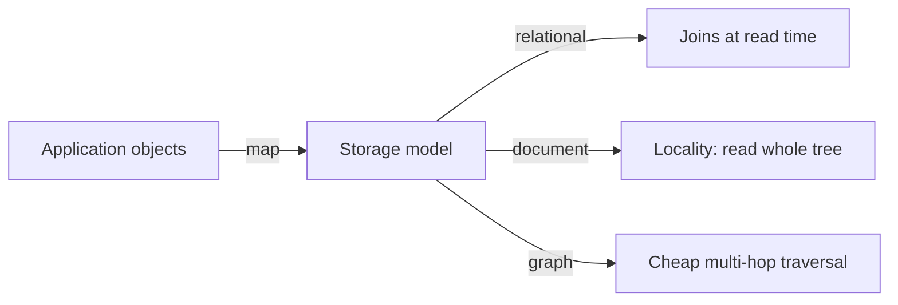

The friction between in-memory objects and the stored shape is the classic **impedance mismatch**. Document models reduce it for tree-shaped aggregates; relational models reduce it for many-to-many; graph models reduce it for deep traversal. Modern relational engines blur the lines by storing and indexing JSON natively, so "relational vs document" is now often a spectrum within one engine.

### 2.5 Real example

**Scenario.** A marketplace needs orders (with line items), product search, and "customers who bought X also bought Y."

**Problem.** No single model serves all three well: orders are tree-shaped, search is text, recommendations are graph traversal.

**Solution.** System of record in a relational store (orders, payments, integrity). A document/JSON projection for fast order reads. A search index for the catalog. A graph projection for co-purchase traversal. One source of truth; the rest are **derived views** kept current by a change stream (Part VII).

**Implementation (relational core, JSON locality where it helps).**

```sql
-- Orders: relational integrity for money, JSON for the flexible line-item shape.
CREATE TABLE orders (
    id           BIGINT PRIMARY KEY,
    customer_id  BIGINT NOT NULL REFERENCES customers(id),
    status       TEXT   NOT NULL,
    total_cents  BIGINT NOT NULL CHECK (total_cents >= 0),
    items        JSONB  NOT NULL,          -- read the order as one unit
    created_at   TIMESTAMPTZ NOT NULL DEFAULT now()
);

-- Index inside the JSON for a common filter (e.g. orders containing a SKU).
CREATE INDEX idx_orders_items_sku ON orders USING gin ((items -> 'skus'));
```

**Result.** Money and relationships get relational guarantees; the order document is read in one shot; search and recommendations live in stores built for them.

**Future improvements.** Drive the derived views from the order table's change stream so they cannot silently drift; add a contract test asserting projection ↔ source-of-truth consistency.

### 2.6 Exercises

1. Give one dataset that is painful in a document store and explain why.
2. When does a graph database beat recursive SQL for a many-hop query?
3. What is the impedance mismatch, and how does a document model reduce it?

### 2.7 Challenges

- **Challenge.** Model a "team → projects → tasks → assignees" domain three ways (relational, document, graph). For each, write the query "all tasks assigned to people on team T" and compare effort.

### 2.8 Checklist

- [ ] I choose a model from where the relationships and queries live, not by fashion.
- [ ] I know when locality (document) helps and when it hurts.
- [ ] I treat non-source-of-truth stores as derived views.
- [ ] I consider native JSON in a relational engine before adding a second database.

### 2.9 Best practices

- Keep **one** system of record; make every other store a derived, rebuildable view.
- Use the relational engine's JSON support before introducing a separate document store.
- Let query patterns — not table count — drive the model.

### 2.10 Anti-patterns

- Scattering the source of truth across several stores with no clear owner.
- Forcing deep graph traversals through many self-joins in SQL.
- Choosing a database for its category buzz rather than the access pattern.

### 2.11 Troubleshooting

| Symptom | Likely cause | Action |
|---------|--------------|--------|
| App is full of hand-written "joins" | Document model used for many-to-many data | Move relationships to a relational core |
| Recommendation queries time out | Multi-hop traversal on a relational schema | Add a graph projection for traversal |
| Derived view disagrees with source | Drift in the projection pipeline | Drive views from a change stream; add contract tests |

### 2.12 References

- E. F. Codd, "A Relational Model of Data for Large Shared Data Banks," *CACM* (1970).
- Official docs: PostgreSQL JSON types (https://www.postgresql.org/docs/current/datatype-json.html), Neo4j Cypher (https://neo4j.com/docs/).
- M. Kleppmann, *Designing Data-Intensive Applications* (O'Reilly, 2017) — ISBN 978-1449373320, for the broader treatment.

---

> **End of Part I.** You can now (1) state a data system's goals as measurable reliability, scalability, and maintainability targets, and (2) choose a data model from where the relationships and queries actually live, defaulting to a single source of truth with derived views. **Part II — Storage & Retrieval** (Chapters 3–4) goes one level down: how B-tree and LSM-tree engines store and find data, and how to evolve schemas without breaking readers or writers.

---

## Part II – Storage & Retrieval

A database does two fundamental things: store data you give it, and give it back when you ask. *How* it does that — the on-disk structure and the wire/format encoding — sets its whole performance and evolution profile. Part II covers the storage engine underneath every query and the encoding that lets a system change shape over time without breaking the programs reading it.

---

## Chapter 3 — How storage engines actually work (B-trees vs LSM-trees)

### 3.1 Introduction

Every database write eventually becomes bytes laid out by a **storage engine**, and two families dominate. **B-tree** engines (PostgreSQL, InnoDB) keep data in sorted, fixed-size pages updated **in place** — excellent reads, random-ish writes. **LSM-tree** engines (Cassandra, RocksDB, ScyllaDB) **append** writes to an in-memory buffer, flush sorted immutable files, and **compact** them in the background — excellent write throughput, with read cost managed by bloom filters and compaction. Knowing which family a database belongs to explains its behavior under load before you ever benchmark it.

### 3.2 Business context

The storage engine is the hardest thing to change after launch — it is baked into the database choice. A write-heavy ingestion product on a B-tree engine fights page contention; a low-latency read product on an untuned LSM setup suffers read amplification. Matching the engine family to whether the workload is read- or write-dominant is a structural decision that avoids an expensive re-platforming later, and it lets an on-call engineer reason about why a system slows the way it does.

### 3.3 Theoretical concepts: in-place vs append-and-merge

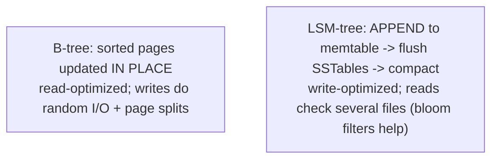

- **B-tree** keeps a balanced tree of sorted pages; a lookup is a few page reads, a range scan walks leaves in order. Writes update the page in place (and may split it), causing random I/O — but the write-ahead log (a sequential append) makes those writes crash-safe.
- **LSM-tree** buffers writes in a sorted in-memory **memtable**, flushes it as an immutable sorted file (**SSTable**), and merges SSTables via **compaction**. Writes are sequential (fast); a read may consult the memtable plus several SSTables, so **bloom filters** short-circuit "key definitely not here" and compaction keeps the file count bounded.

The trade is **read amplification vs write amplification**: B-trees write each page possibly several times (page + WAL), LSM-trees rewrite data during compaction but turn writes sequential.

### 3.4 Architecture: the read and write paths

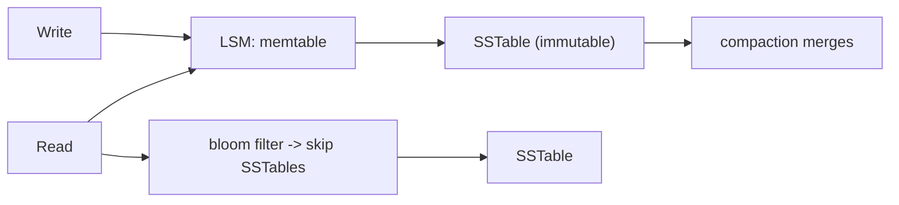

A storage engine's secondary indexes layer on the same machinery: a **clustered** index stores the row in the index leaf (InnoDB primary key), a **non-clustered** index stores a pointer. Either way, every index is extra write work — the price of a faster read. The engineering judgment is the same in both families: add an index for a real read pattern, not speculatively, because each one taxes every write.

### 3.5 Real example

**Scenario.** A telemetry platform ingests millions of events per second; reads are mostly recent ranges and a few key lookups.

**Problem.** A B-tree engine cannot sustain the write rate (random page updates, contention, WAL pressure).

**Solution.** An LSM-based engine: sequential appends absorb the write rate; bloom filters and tiered compaction keep recent-range reads fast.

**Implementation (engine-fit reasoning).**

```text
Workload: write-heavy ingestion, range reads of recent data, sparse point lookups
  B-tree:  random writes + page splits -> write bottleneck at this rate
  LSM:     sequential appends -> sustains the write rate
           compaction tuned for read latency on recent SSTables
Decision: LSM store; size memtables for the write rate; monitor compaction backlog.
```

**Result.** The ingestion rate is met structurally; reads stay fast with appropriate compaction — fitting the engine to the workload instead of fighting it.

**Future improvements.** Watch compaction backlog (the key LSM health metric); for the point-lookup path, confirm bloom-filter false-positive rate is low enough.

### 3.6 Exercises

1. Why does an LSM-tree sustain higher write throughput than a B-tree?
2. What is read amplification, and which two mechanisms mitigate it in LSM engines?
3. Why is every secondary index a tax on writes regardless of engine family?

### 3.7 Challenges

- **Challenge.** Identify the storage engine behind a database you operate. Classify your workload as read- or write-dominant and argue whether the engine family fits — and what metric you'd watch to confirm.

### 3.8 Checklist

- [ ] I know B-tree updates in place and LSM appends-and-compacts.
- [ ] I match engine family to read- vs write-heavy workloads.
- [ ] I understand compaction's role and cost in LSM.
- [ ] I add indexes for real read patterns, knowing each taxes writes.

### 3.9 Best practices

- Choose the engine family to fit the dominant access pattern.
- For LSM, monitor and tune compaction; for B-tree, watch write contention and bloat.
- Justify every secondary index with a concrete query.

### 3.10 Anti-patterns

- Write-heavy ingestion on a read-optimized B-tree without tuning.
- Ignoring LSM compaction until reads degrade.
- Index-shotgunning — adding indexes "to be safe," slowing every write.

### 3.11 Troubleshooting

| Symptom | Likely cause | Action |
|---------|--------------|--------|
| Write throughput hits a wall | Random-write engine for a write-heavy load | Consider an LSM engine; tune WAL/checkpoint |
| Read latency rising over time | LSM compaction falling behind | Tune/scale compaction |
| Writes slow, table bloated | B-tree page splits/fragmentation | Maintenance (vacuum/rebuild); review index count |

### 3.12 References

- M. Kleppmann, *Designing Data-Intensive Applications* (O'Reilly, 2017), Chapter 3 "Storage and Retrieval" — ISBN 978-1449373320.
- See also the sibling guide *How Databases Work Internally* (Part I) for storage-engine and WAL internals.

---

## Chapter 4 — Encoding, schema evolution, and compatibility

### 4.1 Introduction

Data outlives the code that wrote it, and in a running system old and new code coexist. **Encoding** (serialization) is how in-memory structures become bytes for storage or the network; **schema evolution** is changing that shape over time without breaking the programs on either side. The goal is two-way compatibility: **backward** (new code reads old data) and **forward** (old code reads new data). Get encoding wrong and a deploy becomes an outage when a new field meets old readers.

### 4.2 Business context

In any system bigger than one process, you cannot upgrade every component at once — rolling deploys, multiple services, and stored data from last year all coexist. Schema evolution is what makes that survivable: it lets teams ship changes independently instead of coordinating a risky big-bang upgrade. A format chosen for compatibility (and a discipline of compatible changes) is the difference between "add a field, deploy gradually" and "freeze everything for a synchronized release."

### 4.3 Theoretical concepts: compatibility directions

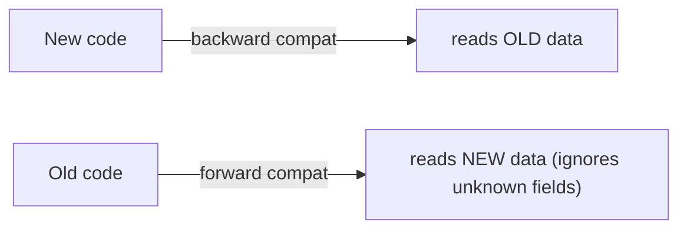

- **Backward compatibility** — newer code can read what older code wrote. Usually easy (you know the old format).
- **Forward compatibility** — older code can read what newer code writes. Harder: old code must *ignore* fields it doesn't understand rather than choke.

Schema-based binary formats (**Protocol Buffers**, **Avro**, **Thrift**) give both cheaply: fields carry tags/IDs, so adding an **optional** field with a new tag is backward- and forward-compatible; removing a required field or reusing a tag breaks compatibility. Textual JSON is forward/backward tolerant by convention (ignore unknown keys) but lacks enforced schemas and is larger on the wire.

### 4.4 Architecture: where encoding lives

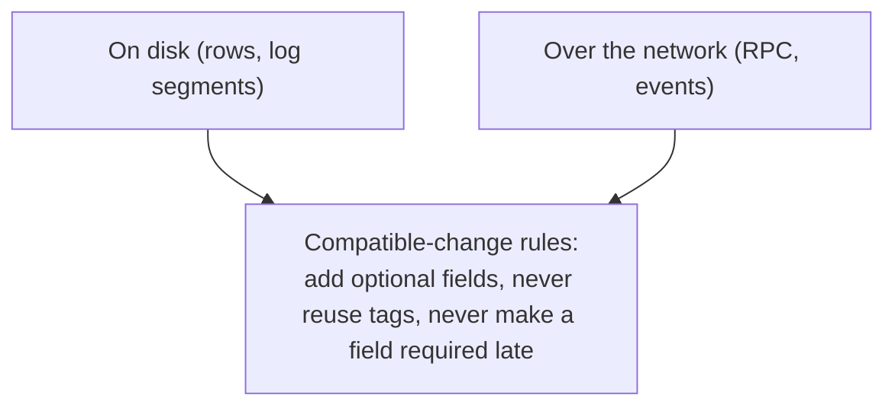

Encoding shows up in three places, each needing evolution discipline: **databases** (a column added today, rows from last year), **service calls** (RPC between independently deployed services), and **message/event streams** (an event written now, consumed months later after replay). The same rule set governs all three: additive, optional changes are safe; destructive or type-changing edits are not. A **schema registry** (common with Avro on Kafka) enforces this automatically by rejecting incompatible schema updates.

### 4.5 Real example

**Scenario.** A payments service and a ledger service exchange `Payment` events on Kafka, deployed independently. A new `currency` field is needed.

**Problem.** If `currency` is added as **required**, old consumers (not yet redeployed) fail to decode new events — a forward-compatibility break that halts the ledger.

**Solution.** Add `currency` as an **optional** field with a new tag and a sensible default; deploy producers and consumers in any order; enforce the rule with a schema registry.

**Implementation (compatible Protobuf change).**

```protobuf
message Payment {
  int64  id          = 1;
  int64  amount_cents = 2;
  string status      = 3;
  string currency    = 4;   // NEW: new tag, optional; old readers ignore it,
                            //      new readers default it when absent. Compatible both ways.
}
// Forbidden: reusing tag 4 later, or deleting a still-read field, or making 4 required.
```

**Result.** Producers and consumers roll out independently with zero coordination; old and new events interoperate. The registry blocks any future incompatible edit before it ships.

**Future improvements.** Add compatibility checks to CI (schema-diff gate); document the field-evolution rules where the schemas live.

### 4.6 Exercises

1. Define backward vs forward compatibility and say which is usually harder, and why.
2. Why does adding an optional, new-tag field keep a binary format compatible both ways?
3. What does a schema registry enforce, and at what point in the lifecycle?

### 4.7 Challenges

- **Challenge.** Take an event or API payload you own. Plan adding one field and removing one field as a sequence of *compatible* steps that never break a rolling deploy. Identify which step must wait for all readers to upgrade.

### 4.8 Checklist

- [ ] I know backward vs forward compatibility and design for both.
- [ ] I make additive changes optional with new field tags/IDs.
- [ ] I never reuse a field tag or make a field required after the fact.
- [ ] I use a schema registry (or equivalent gate) for shared event/RPC formats.

### 4.9 Best practices

- Prefer schema-based binary formats (Avro/Protobuf) for high-volume or long-lived data.
- Evolve schemas additively; sequence destructive changes behind reader upgrades.
- Enforce compatibility automatically in CI / a registry, not by review alone.

### 4.10 Anti-patterns

- Making a new field required, breaking not-yet-upgraded readers.
- Reusing or renumbering field tags, silently corrupting old data.
- Coordinating big-bang upgrades because the format can't evolve.

### 4.11 Troubleshooting

| Symptom | Likely cause | Action |
|---------|--------------|--------|
| Consumers fail decoding after a producer deploy | New required field / incompatible change | Make the field optional; add a registry gate |
| Old rows/events misread after a schema edit | Field tag reused or type changed | Restore tags; treat changes as additive |
| Teams blocked on synchronized releases | Format lacks evolution support | Adopt a schema-based format + compatibility rules |

### 4.12 References

- M. Kleppmann, *Designing Data-Intensive Applications* (O'Reilly, 2017), Chapter 4 "Encoding and Evolution" — ISBN 978-1449373320.
- Apache Avro spec (https://avro.apache.org/docs/) and Protocol Buffers (https://protobuf.dev/).

---

> **End of Part II.** You can now reason one level below the data model: how **B-tree** and **LSM-tree** storage engines trade reads against writes, and how **schema-compatible encoding** (additive, optional fields in formats like Avro/Protobuf) lets a system evolve while old and new code coexist. **Part III — Distributing Data** (Chapters 5–6) takes the next step: copying data across nodes (replication) and splitting it across nodes (partitioning), the two moves that turn a single database into a distributed one.

---

## Part III – Distributing Data

A single node has limits: it can fail, it can be saturated, and it sits in one place. Two independent moves spread data across many nodes. **Replication** keeps *copies* of the same data on several nodes (for availability, read scaling, locality). **Partitioning** splits *different* data across nodes (for capacity and write scaling). Real systems combine both — and most distributed-database complexity lives in how they interact.

---

## Chapter 5 — Replication (leader-based, multi-leader, leaderless)

### 5.1 Introduction

**Replication** means keeping a copy of the same data on multiple nodes. It buys availability (survive a node loss), read scaling (spread reads), and locality (a replica near the user). The whole design space comes down to *who accepts writes and when a write counts as replicated*. Three architectures answer that differently: **single-leader** (one writer, many read replicas), **multi-leader** (several writers, e.g. per region), and **leaderless** (any replica accepts writes, quorums reconcile). Each trades consistency against availability and latency.

### 5.2 Business context

Replication is how a data system survives the inevitable single-node failure and serves a global user base without every read crossing an ocean. But the convenient default — asynchronous copying — quietly trades correctness for speed: a user can write and then read a stale value from a lagging replica. The replication architecture a system uses tells you precisely which failures it survives and which anomalies your users will hit, making it a direct product-quality decision, not an ops detail.

### 5.3 Theoretical concepts: the three architectures

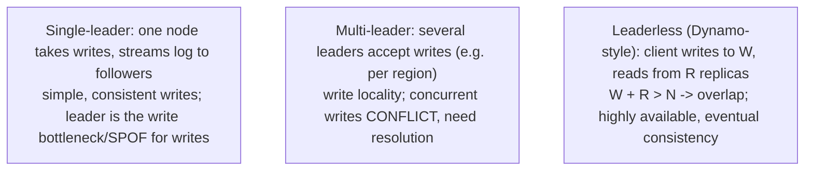

- **Single-leader** — all writes go to the leader, which ships its change log to followers; followers serve reads. Simple and consistent for writes; the leader is a write bottleneck and the failover is the tricky part.
- **Multi-leader** — more than one node accepts writes (typically one per datacenter). Great for write locality and offline tolerance; the cost is **write conflicts** when two leaders modify the same key, requiring conflict resolution (last-write-wins, version vectors, app merge).
- **Leaderless** — any replica accepts reads and writes; the client talks to several. With **quorums** (`W + R > N`), read and write sets overlap so a read sees the latest write; anti-entropy (read repair, background sync) heals divergence.

### 5.4 Architecture: lag, failover, and reading your writes

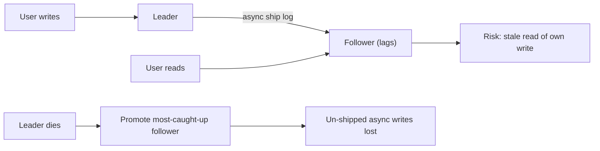

**Replication lag** is the gap async followers run behind the leader; under it, a user may not see their own write. The standard mitigations are **read-your-own-writes** (route a user's reads to the leader or a verified caught-up replica for a window after they write) and **monotonic reads** (a user never sees time go backward). **Failover** promotes a follower when the leader dies — and with async replication, any not-yet-shipped writes are lost. That single fact (async = fast but can drop the write tail) is the heart of the durability-vs-availability trade.

### 5.5 Real example

**Scenario.** A read-heavy app adds async replicas and routes all reads to them; a multi-region rollout later adds a leader per region.

**Problem.** (1) Right after a profile update, users read stale data from a lagging replica. (2) Cross-region, two leaders accept conflicting edits to the same record.

**Solution.** Apply read-your-own-writes for the lag window; for multi-leader, define a deterministic conflict-resolution policy (version vectors + app merge) rather than silent last-write-wins.

**Implementation (routing + conflict policy).**

```text
# Single-leader lag fix
on write(user):  route to LEADER; record T(user)
on read(user):   if now - T(user) < lag_window: read LEADER else read FOLLOWER

# Multi-leader conflict policy
on concurrent edits to key K on leaders A,B:
    attach version vectors -> detect concurrency
    resolve by app merge (e.g. union of cart items), NOT blind last-write-wins
```

**Result.** Users always see their own latest write; the bulk of reads still scale across replicas; cross-region conflicts resolve deterministically instead of silently losing data.

**Future improvements.** Track each replica's log position and route to the least-lagged caught-up replica; alert on lag thresholds; consider CRDTs for conflict-free merge.

### 5.6 Exercises

1. Contrast the failure and consistency profiles of single-leader, multi-leader, and leaderless replication.
2. Why does asynchronous replication risk losing writes on failover?
3. With `N = 3` leaderless replicas, what `W`/`R` guarantee a read sees the latest write?

### 5.7 Challenges

- **Challenge.** For a system you run, identify its replication architecture and mode. State exactly which writes you'd lose if the leader's disk died now, and which anomaly a user could observe under lag — then name the fix.

### 5.8 Checklist

- [ ] I can place a store as single-leader, multi-leader, or leaderless.
- [ ] I know the sync vs async durability/latency trade.
- [ ] I apply read-your-own-writes / monotonic reads against lag.
- [ ] I have a conflict-resolution plan before adopting multi-leader/leaderless.

### 5.9 Best practices

- Keep at least one synchronous follower for data you cannot lose.
- Monitor replication lag and alert before it breaks user-facing guarantees.
- Adopt multi-leader/leaderless only with an explicit conflict-resolution policy.

### 5.10 Anti-patterns

- Serving all reads from async replicas with no caught-up routing.
- Pure async replication for critical data, then losing the tail on failover.
- Multi-leader with blind last-write-wins, silently dropping concurrent edits.

### 5.11 Troubleshooting

| Symptom | Likely cause | Action |
|---------|--------------|--------|
| User can't see data they just saved | Stale read from a lagging replica | Read-your-own-writes routing |
| Writes lost after failover | Async replication dropped the tail | Add a synchronous follower; tune failover |
| Conflicting values on one key | Concurrent multi-leader/leaderless writes | Deterministic resolution (version vectors/CRDT) |

### 5.12 References

- M. Kleppmann, *Designing Data-Intensive Applications* (O'Reilly, 2017), Chapter 5 "Replication" — ISBN 978-1449373320.
- See also the sibling guide *How Databases Work Internally* (Chapter 3) for replication internals.

---

## Chapter 6 — Partitioning (sharding) and rebalancing

### 6.1 Introduction

When data or write load outgrows a single node, you **partition** (shard) it: split the dataset so each node holds a subset. The central problem is choosing a partitioning scheme that spreads data and load **evenly** while still supporting the queries you need — and then **rebalancing** as nodes are added or removed without downtime or a data avalanche. Done well, partitioning scales nearly linearly; done badly, it creates **hot spots** that defeat the whole point.

### 6.2 Business context

Partitioning is what lets a system grow past one machine's capacity — the foundation of scaling writes and storage. But the scheme is hard to change later (it's wired into where every row lives), and a bad choice concentrates load on one "celebrity" partition while others idle, so the cluster is expensive *and* slow. Choosing a partition key that matches the access pattern, and planning rebalancing up front, is a high-leverage decision that determines whether adding nodes actually adds capacity.

### 6.3 Theoretical concepts: key range vs hash

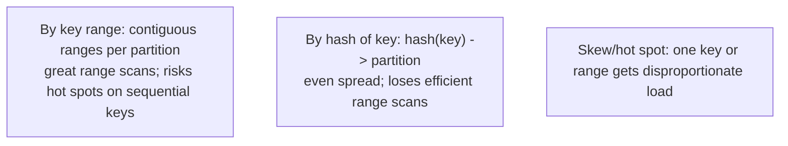

- **Range partitioning** keeps keys in sorted, contiguous ranges per node — efficient range scans (e.g. time ranges), but a sequential key (timestamps, auto-increment IDs) sends all new writes to one partition: a **hot spot**.
- **Hash partitioning** assigns by `hash(key)` — spreads load evenly and kills sequential hot spots, at the cost of efficient range scans (adjacent keys land on different nodes).

**Secondary indexes** complicate this: a **document-partitioned** (local) index is fast to write but a read must scatter-gather across all partitions; a **term-partitioned** (global) index makes reads targeted but writes touch multiple partitions. Neither is free.

### 6.4 Architecture: rebalancing without an avalanche

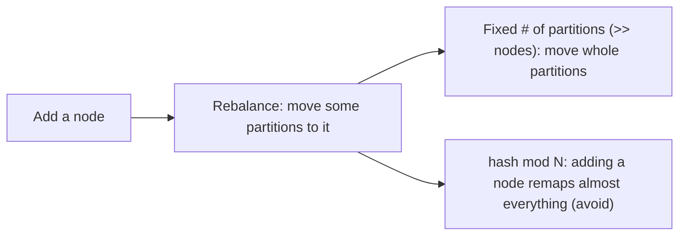

The classic mistake is `hash(key) mod N` over the node count: change `N` and almost every key moves — a rebalancing avalanche. The standard fix is a **fixed, large number of partitions** decoupled from node count: create (say) 1000 partitions up front, assign many per node, and to rebalance just move whole partitions to the new node. **Consistent hashing** and explicit partition assignment achieve the same goal — minimal data movement when the cluster size changes. A **request router** (or the client) maps each key to its current partition's node.

### 6.5 Real example

**Scenario.** An events table keyed by `timestamp` is sharded by range; ingestion is heavy and recent.

**Problem.** All new writes have "now" timestamps, so they all hit the **last** partition — one node is saturated while the rest idle. A classic sequential-key hot spot.

**Solution.** Partition by a **compound key** that leads with a high-cardinality, evenly distributed field (e.g. `hash(device_id)`) and keeps time *within* the partition, preserving per-device range scans while spreading write load.

**Implementation (de-hot-spotting the key).**

```text
# before: partition by timestamp -> all "now" writes hit one partition
partition_key = timestamp

# after: lead with an evenly distributed field; time is secondary within partition
partition_key = hash(device_id)          # spreads writes across all partitions
clustering_key = timestamp               # still supports "this device, this time range"
# Rebalancing: fixed 1024 partitions assigned across nodes; add a node -> move whole partitions
```

**Result.** Writes spread evenly across the cluster; adding a node adds real capacity; per-device time-range reads still work. The hot spot is gone by construction.

**Future improvements.** Monitor per-partition load to catch emergent skew (a single hot device); add a salt to split a known hot key across sub-partitions.

### 6.6 Exercises

1. When does range partitioning beat hash partitioning, and what's its failure mode?
2. Why is `hash(key) mod N` over node count a bad rebalancing scheme?
3. Contrast document-partitioned vs term-partitioned secondary indexes on read/write cost.

### 6.7 Challenges

- **Challenge.** Take a table you'd shard. Pick a partition key, argue it spreads load for your write pattern, identify any hot-spot risk, and describe how you'd rebalance when adding a node without moving most of the data.

### 6.8 Checklist

- [ ] I choose range vs hash partitioning from the query and write pattern.
- [ ] I avoid sequential partition keys that create hot spots.
- [ ] I decouple partition count from node count for clean rebalancing.
- [ ] I know the read/write trade of local vs global secondary indexes.

### 6.9 Best practices

- Pick a partition key that spreads both data and load evenly.
- Use a fixed large partition count (or consistent hashing) for rebalancing.
- Monitor per-partition load to catch skew early.

### 6.10 Anti-patterns

- Sequential keys (timestamps, auto-increment) as the partition key.
- `hash mod N` rebalancing that remaps the whole dataset on a node change.
- Ignoring secondary-index partitioning, then suffering scatter-gather reads.

### 6.11 Troubleshooting

| Symptom | Likely cause | Action |
|---------|--------------|--------|
| One node hot, others idle | Sequential/low-cardinality partition key | Repartition on an evenly distributed key |
| Adding a node barely helps | Skew or near-total remap on rebalance | Fixed partition count; fix the key |
| Secondary-index reads slow | Scatter-gather over local indexes | Consider a term-partitioned (global) index |

### 6.12 References

- M. Kleppmann, *Designing Data-Intensive Applications* (O'Reilly, 2017), Chapter 6 "Partitioning" — ISBN 978-1449373320.
- Apache Cassandra docs, "Data partitioning": https://cassandra.apache.org/doc/stable/cassandra/architecture/dynamo.html.

---

> **End of Part III.** You can now turn a single database into a distributed one along two axes: **replication** (copies of the same data — single-leader, multi-leader, leaderless — trading consistency for availability and locality) and **partitioning** (different data per node — range vs hash keys chosen to avoid hot spots, with rebalancing decoupled from node count). **Part IV — Consistency & Correctness** (Chapters 7–8) asks what guarantees survive once data is distributed: transactions across the spread, and the hard truths of clocks, partial failures, and unreliable networks.

---

## Part IV – Consistency & Correctness

Distribution buys scale and availability but costs *certainty*. Part IV is about the guarantees that keep data correct under concurrency and failure. Chapter 7 covers **transactions** — the abstraction that lets you treat a group of operations as one all-or-nothing, isolated unit. Chapter 8 confronts the uncomfortable physics of distributed systems: unreliable networks, unsynchronized clocks, and partial failures that single-node intuition gets wrong.

---

## Chapter 7 — Transactions and isolation levels

### 7.1 Introduction

A **transaction** groups several reads and writes into one logical unit with **ACID** guarantees: **Atomicity** (all or nothing), **Consistency** (invariants preserved), **Isolation** (concurrent transactions don't corrupt each other), and **Durability** (committed data survives crashes). The point of transactions is to spare the application from reasoning about every possible concurrency interleaving and partial failure. The tunable, subtle one is **isolation**: stronger levels prevent more anomalies but reduce concurrency, so the job is to pick the weakest level that is still correct.

### 7.2 Business context

Transactions are what let a business trust its data through concurrency and crashes — a money transfer that can't lose the credit half, an inventory count two buyers can't both win. Weak isolation, chosen for speed, lets subtle anomalies (lost updates, write skew) corrupt invariants rarely and under load — exactly when it's costliest and hardest to reproduce. Knowing what each isolation level does and doesn't prevent is the difference between a correct system and one that's "usually" correct.

### 7.3 Theoretical concepts: isolation levels and anomalies

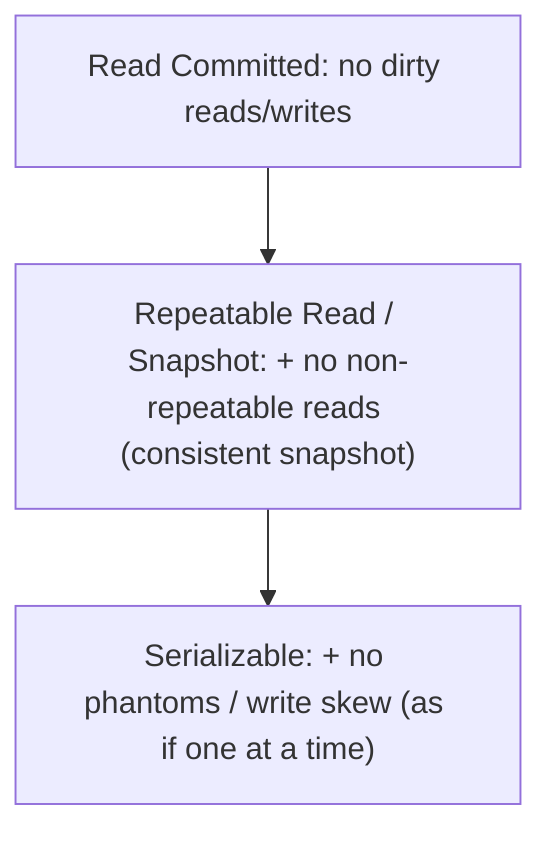

Each level permits a specific set of **anomalies**:

- **Read Committed** — no dirty reads (you never see uncommitted data) or dirty writes; still allows non-repeatable reads.
- **Snapshot / Repeatable Read** — each transaction reads a consistent snapshot (MVCC); prevents non-repeatable reads, but **write skew** can slip through (two transactions read a shared invariant, each writes, together they break it).
- **Serializable** — the strongest: the result is as if transactions ran one at a time. Implemented by actual serial execution, two-phase locking, or **Serializable Snapshot Isolation** (SSI), which detects conflicting read/write dependencies and aborts a transaction (which the app retries).

### 7.4 Architecture: distributed transactions and their cost

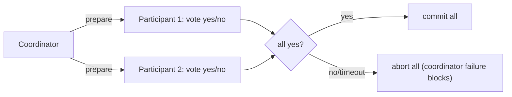

Across nodes, atomicity needs an agreement protocol. **Two-phase commit (2PC)** has a coordinator ask all participants to *prepare*, then commit only if all vote yes. It guarantees atomicity but is a **blocking** protocol: if the coordinator dies after prepare, participants hold locks indefinitely. That fragility is why many modern designs **avoid** distributed transactions — keeping a transaction within one partition, or using idempotent operations and sagas across services. The lesson: cross-node ACID is expensive and brittle; design so you rarely need it.

### 7.5 Real example

**Scenario.** A booking system checks "seats remaining > 0" then inserts a booking, under snapshot isolation.

**Problem.** Two concurrent transactions both read "1 seat left," both pass the check on their own snapshot, both insert — overbooking. A textbook **write skew** the snapshot level doesn't prevent.

**Solution.** Raise to **Serializable** (SSI aborts one, app retries) or take an explicit lock on the contended rows (`SELECT … FOR UPDATE`) so the second transaction blocks and re-checks.

**Implementation (the two correct fixes).**

```sql
-- Option A: lock the rows the invariant depends on
BEGIN;
SELECT count(*) FROM seats WHERE flight = 'X' AND booked = false FOR UPDATE; -- serialize the check
INSERT INTO bookings (...);                                                  -- safe under the lock
COMMIT;

-- Option B: SERIALIZABLE + retry (let SSI catch the conflict)
-- run the same logic; on SQLSTATE 40001, retry the whole transaction
```

**Result.** Only one of the two concurrent bookings succeeds; the invariant "no overbooking" holds. The anomaly is closed deliberately — by the weakest mechanism that fixes *this* case.

**Future improvements.** Keep the transaction inside one partition to avoid distributed commit; if it must span services, use a saga with compensating actions instead of 2PC.

### 7.6 Exercises

1. Name an anomaly each level (Read Committed, Snapshot, Serializable) first prevents.
2. Why does snapshot isolation allow write skew, and what are two ways to prevent it?
3. Why is two-phase commit called a blocking protocol, and why avoid it when you can?

### 7.7 Challenges

- **Challenge.** Find an invariant in your system enforced by check-then-write. Show whether two concurrent transactions can both pass under your default isolation, and fix it with the minimal correct mechanism (lock or Serializable).

### 7.8 Checklist

- [ ] I know the anomalies my default isolation level allows.
- [ ] I raise isolation (or lock) exactly where an invariant needs it.
- [ ] I treat serialization failures as retryable, not as bugs.
- [ ] I keep transactions within a partition to avoid distributed commit.

### 7.9 Best practices

- Use the weakest isolation that stays correct, per operation.
- Prefer single-partition transactions; avoid 2PC across nodes.
- Wrap Serializable transactions in a bounded retry loop.

### 7.10 Anti-patterns

- Assuming the default level prevents all anomalies.
- Check-then-write invariants under snapshot isolation (write skew).
- Sprawling distributed transactions where a saga or single partition would do.

### 7.11 Troubleshooting

| Symptom | Likely cause | Action |
|---------|--------------|--------|
| Rare invariant violations under load | Write skew / weak isolation | Serializable or `FOR UPDATE` lock |
| Locks held forever across nodes | Coordinator failure in 2PC | Avoid distributed txns; use sagas/idempotency |
| Serialization errors appear | SSI aborting real conflicts (expected) | Add a retry loop |

### 7.12 References

- M. Kleppmann, *Designing Data-Intensive Applications* (O'Reilly, 2017), Chapter 7 "Transactions" — ISBN 978-1449373320.
- See also the sibling guide *Database Transactions and Concurrency* for ACID and isolation in depth.

---

## Chapter 8 — The trouble with distributed systems

### 8.1 Introduction

Single-node intuition fails in a distributed system because three things you take for granted stop holding: the **network** is unreliable (messages drop, delay, reorder), **clocks** are not synchronized (each node's time drifts), and failures are **partial** (some nodes work while others don't, and you can't tell *which* from the outside). This chapter is about replacing comfortable assumptions with the pessimism distributed systems actually require — because most distributed-systems bugs come from assuming away exactly these problems.

### 8.2 Business context

Every distributed data system runs on these unreliable foundations, and the bugs they cause are the worst kind: rare, non-deterministic, and catastrophic (duplicated payments, split-brain writes, data corruption after a "successful" deploy). Building with honest assumptions — that the network *will* drop a message, that a node *will* pause unpredictably, that a clock *will* be wrong — is what separates systems that degrade gracefully from ones that corrupt data the first time the network hiccups. This pessimism is cheaper than the incident it prevents.

### 8.3 Theoretical concepts: unreliable networks and clocks

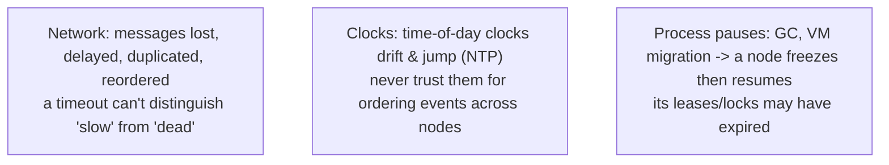

- **Networks** give no reliable failure signal: a request that times out might have failed, or succeeded with a lost reply, or still be in flight. You cannot tell — so operations must be **idempotent** and detection must use timeouts you treat as *suspicions*, not facts.
- **Clocks** drift and jump; a node's wall-clock can move backward after an NTP correction. **Never order events across nodes by timestamp.** Use **logical clocks** (version vectors, Lamport timestamps) for ordering, and clocks only for rough timing.
- **Process pauses** (GC, hypervisor pauses) can freeze a node for seconds; when it resumes, a lease or lock it held may have expired and another node may have taken over — the source of split-brain.

### 8.4 Architecture: fencing against a zombie leader

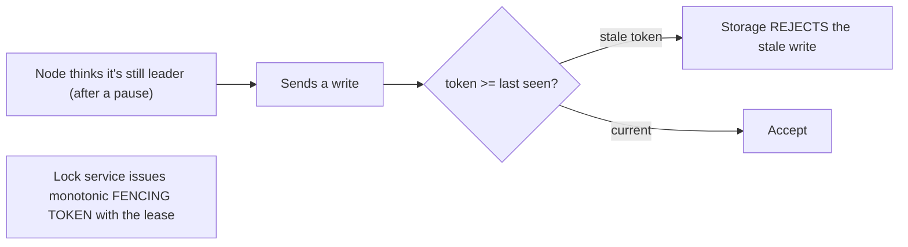

The defining hazard is a node that *believes* it still holds leadership or a lock after its lease silently expired (a pause, a partition). If it then writes, you get split-brain corruption. The robust defense is a **fencing token**: the lock service hands out a monotonically increasing number with each lease, every write carries its token, and the storage layer **rejects any write with a stale token**. This makes correctness independent of timing assumptions — the system tolerates pauses and partitions instead of hoping they don't happen.

### 8.5 Real example

**Scenario.** A leader-elected worker holds a lock to be the sole writer to a file/store; leadership is granted by a lock service.

**Problem.** The leader hits a long GC pause; its lease expires; a new leader is elected. The old leader resumes, still "believing" it's the leader, and writes — two writers, corrupted data (split-brain).

**Solution.** Issue a **fencing token** with each lease and have the storage reject stale tokens, so the resumed old leader's write is refused.

**Implementation (fencing).**

```text
lock service: grant lease -> token = monotonically increasing N
writer: every write includes its current token
storage: track highest token seen; if incoming token < highest -> REJECT

# old leader resumes with token=33; new leader already wrote with token=34
# storage has seen 34, so the stale token=33 write is rejected -> no split-brain
```

**Result.** The zombie leader cannot corrupt data; correctness holds regardless of how long the pause lasted or whether the network lied. Timing assumptions are removed from the correctness argument.

**Future improvements.** Make all write operations idempotent (so a retried-after-timeout request is harmless); use logical clocks for cross-node ordering instead of timestamps.

### 8.6 Exercises

1. Why can't a timeout distinguish a failed node from a slow one, and what does that imply for retries?
2. Give a concrete bug caused by trusting wall-clock timestamps to order events across nodes.
3. How does a fencing token prevent split-brain after a process pause?

### 8.7 Challenges

- **Challenge.** Find a place in your system that assumes "if the call returned an error, the operation didn't happen" or orders events by timestamp across machines. Describe the failure it hides and redesign it with idempotency or a fencing token / logical clock.

### 8.8 Checklist

- [ ] I treat a timeout as "unknown outcome," not "failed."
- [ ] I make cross-node operations idempotent.
- [ ] I never order cross-node events by wall-clock time.
- [ ] I use fencing tokens for leader/lock-protected writes.

### 8.9 Best practices

- Design every remote operation to be safely retryable (idempotent).
- Use logical clocks for ordering; physical clocks only for rough timing.
- Protect single-writer invariants with fencing tokens, not lease timing alone.

### 8.10 Anti-patterns

- Assuming a returned error means the operation didn't take effect.
- Ordering or expiring data by `now()` compared across machines.
- Relying on a lock's lease time for correctness without fencing.

### 8.11 Troubleshooting

| Symptom | Likely cause | Action |
|---------|--------------|--------|
| Duplicate effects (double charge) | Retried request after a lost reply | Make the operation idempotent (dedupe key) |
| Split-brain / two writers | Zombie leader after a pause/partition | Add fencing tokens; reject stale writes |
| Events ordered wrong across nodes | Trusting wall-clock timestamps | Use logical clocks / version vectors |

### 8.12 References

- M. Kleppmann, *Designing Data-Intensive Applications* (O'Reilly, 2017), Chapter 8 "The Trouble with Distributed Systems" — ISBN 978-1449373320.
- L. Lamport, "Time, Clocks, and the Ordering of Events in a Distributed System," *CACM* (1978).

---

> **End of Part IV.** You can now reason about correctness under concurrency and failure: **transactions** give all-or-nothing, isolated units (pick the weakest isolation that stays correct, and avoid brittle distributed commit), while the **trouble with distributed systems** — unreliable networks, drifting clocks, partial failures, and process pauses — forces idempotency, logical clocks, and fencing tokens instead of comfortable assumptions. **Part V — Consensus & Coordination** (Chapter 9) builds the positive result on top of this pessimism: the consistency models systems can offer and how nodes *agree* despite all of it.

---

## Part V – Consensus & Coordination

Part IV established what goes wrong. Part V is the constructive answer: despite unreliable networks and partial failures, nodes *can* agree — on a leader, on a value, on the order of events — and systems *can* offer strong guarantees, at a price. This single chapter ties the guide's distributed-systems thread together: the spectrum of consistency models, and the consensus that makes the strongest of them possible.

---

## Chapter 9 — Consistency models and consensus

### 9.1 Introduction

A **consistency model** is the contract a distributed store offers about what reads can observe. They form a spectrum from **eventual consistency** (replicas converge eventually; reads may be stale) up to **linearizability** (the system behaves as if there is a single, up-to-date copy — every read sees the latest committed write). Stronger models are easier to program against but cost latency and availability. The strongest guarantees, and the agreement that underpins leader election and atomic commit, rest on **consensus**: getting several nodes to irrevocably agree on one value despite failures.

### 9.2 Business context

The consistency model is a promise that leaks straight into product behavior and engineering effort. Linearizability lets developers reason as if there's one copy — no stale reads, no surprises — but it cannot be maintained during a network partition without sacrificing availability (the CAP trade). Choosing where on the spectrum each piece of data sits, and paying for consensus only where you truly need it (leader election, uniqueness, atomic commit), is the difference between a system that's both correct and available *enough* and one that's needlessly slow or subtly wrong.

### 9.3 Theoretical concepts: the consistency spectrum

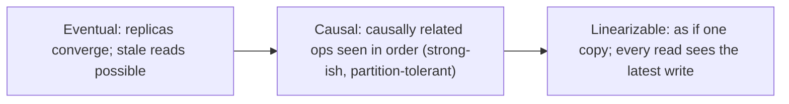

- **Eventual consistency** — given no new writes, replicas eventually agree. Cheap and highly available; the app must tolerate staleness and conflicts.
- **Causal consistency** — operations that are causally related are seen in the same order by everyone (concurrent ones may differ). Often the *strongest* model achievable while staying available under partition — a sweet spot.
- **Linearizability** — the strongest single-object model: there appears to be one copy and operations take effect atomically at a point in time. Required for things like a lock, uniqueness constraint, or leader election — and impossible to keep available during a partition (CAP).

### 9.4 Architecture: consensus and total order

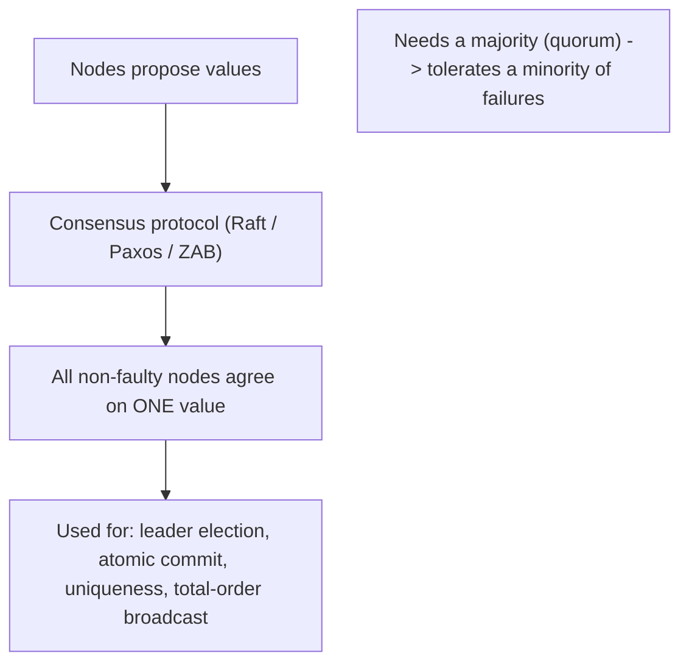

**Consensus** is the problem of getting nodes to agree on a single value such that the decision is unanimous and final. Practical protocols — **Raft**, **Paxos/Multi-Paxos**, **ZAB** (ZooKeeper) — solve it by requiring a **majority quorum**, so the system tolerates a minority of failures and avoids split-brain. Consensus is equivalent to **total-order broadcast** (every node delivers the same messages in the same order), which is exactly what you need to keep replicas linearizable. Because consensus needs a majority, it *halts* (chooses unavailability) during a partition that breaks quorum — the CAP choice made concrete. The pragmatic pattern: don't reimplement consensus; delegate coordination (leader election, locks, config) to a proven system like **ZooKeeper/etcd**.

### 9.5 Real example

**Scenario.** A cluster of workers must have exactly one **leader** (sole writer) at a time, and the choice must survive node failures without split-brain.

**Problem.** Ad-hoc election by timestamps or "first to grab a row" fails under partitions and clock skew (Chapter 8) — two nodes can both think they won.

**Solution.** Delegate election to a **consensus-backed coordination service** (etcd/ZooKeeper): it elects a leader via a majority quorum and issues a lease + **fencing token** (Chapter 8), so at most one leader is valid and stale writes are rejected.

**Implementation (delegated election).**

```text
# Don't build consensus yourself; use a quorum-based coordinator.
etcd/ZooKeeper:
  - candidates campaign for leadership; the service grants it via majority quorum
  - winner holds a lease + monotonically increasing fencing token
  - on partition that loses quorum: NO new leader (chooses consistency over availability)
  - every write carries the token; storage rejects stale tokens -> no split-brain
```

**Result.** Exactly one valid leader at any time, correct across failures and partitions; the unavoidable cost is that a quorum-losing partition pauses leadership rather than risking two leaders. The CAP choice is explicit and correct.

**Future improvements.** Reserve consensus for the few things that need it (leadership, uniqueness); keep bulk data on a weaker, more available model (causal/eventual) and reconcile.

### 9.6 Exercises

1. Order eventual, causal, and linearizable consistency by strength and say what each costs.
2. Why can't a linearizable system stay available during a network partition?
3. What does consensus require to make progress, and what does it do when that's unavailable?

### 9.7 Challenges

- **Challenge.** Identify one thing in your system that truly needs linearizability (a lock, a unique ID, a leader) and one that doesn't. Justify using a consensus-backed coordinator for the first and a weaker, more available model for the second.

### 9.8 Checklist

- [ ] I can place a guarantee on the eventual → causal → linearizable spectrum.
- [ ] I know linearizability trades availability under partition (CAP).
- [ ] I understand consensus needs a majority quorum and halts without one.
- [ ] I delegate coordination to a proven consensus system rather than rolling my own.

### 9.9 Best practices

- Use the weakest consistency model each dataset can tolerate; reserve linearizability for where it's essential.
- Delegate leader election, locks, and config to etcd/ZooKeeper, not bespoke code.
- Pair leadership with fencing tokens so a lost quorum can't cause split-brain.

### 9.10 Anti-patterns

- Demanding linearizability everywhere, paying its latency/availability tax needlessly.
- Hand-rolling consensus or leader election with timestamps and locks.
- Ignoring that a quorum-losing partition must (correctly) pause, treating the pause as a bug.

### 9.11 Troubleshooting

| Symptom | Likely cause | Action |
|---------|--------------|--------|
| Two leaders / split-brain | Ad-hoc election without quorum/fencing | Use a consensus coordinator + fencing tokens |
| Cluster stalls during a partition | Consensus correctly waiting for quorum | Expected; size quorum/regions; don't "fix" by weakening it |
| Stale reads where correctness needs current | Eventual model used where linearizable is required | Move that operation to a linearizable path |

### 9.12 References

- M. Kleppmann, *Designing Data-Intensive Applications* (O'Reilly, 2017), Chapter 9 "Consistency and Consensus" — ISBN 978-1449373320.
- D. Ongaro, J. Ousterhout, "In Search of an Understandable Consensus Algorithm (Raft)," USENIX ATC (2014); Apache ZooKeeper / etcd documentation.

---

> **End of Part V.** You can now reason about agreement despite failure: the **consistency spectrum** from eventual through causal to linearizable (stronger = easier to use, costlier in latency and availability), and **consensus** — majority-quorum protocols (Raft/Paxos/ZAB) that underpin leader election, uniqueness, and atomic commit, and that correctly pause rather than split-brain when quorum is lost. The pragmatic rule: pick the weakest model each dataset tolerates and delegate the rest to a proven coordinator. **Part VI — Derived & Streaming Data** (Chapters 10–11) turns from storing truth to *deriving* value from it: batch and stream processing, and composing whole systems as flows of data.

---

## Part VI – Derived & Streaming Data

A mature data system has one source of truth and many **derived** views built from it — search indexes, caches, aggregates, recommendation graphs. Part VI is about *deriving* value: processing data in **batches** (bounded, historical) and as **streams** (unbounded, continuous), and then composing whole systems as **flows of data** between specialized stores — the "unbundled database." This is where everything earlier (storage, replication, encoding, consistency) comes together into an architecture.

---

## Chapter 10 — Batch and stream processing

### 10.1 Introduction

There are two ways to process data at scale, distinguished by the *boundedness* of their input. **Batch processing** consumes a fixed, finite dataset (yesterday's logs, the full table) and produces an output — high throughput, not latency-sensitive, easy to re-run. **Stream processing** consumes an **unbounded**, continuous input (events as they happen) and produces continuously updated output — low latency, but it must reason about time and completeness because the input never ends. Modern systems use both, and the deep insight is that they are two points on one continuum, not opposites.

### 10.2 Business context

Batch and stream are how raw data becomes the things a business actually uses: reports, search indexes, fraud signals, live dashboards, recommendations. Batch gives correct, reproducible answers over complete data (the nightly financial roll-up); streaming gives timely answers that update as events arrive (the live fraud alert). Choosing the right one — and increasingly, combining them — directly sets the **latency vs. completeness** of every derived product. Picking streaming for a job that needs exactness, or batch for one that needs immediacy, is a costly mismatch.

### 10.3 Theoretical concepts: bounded vs unbounded

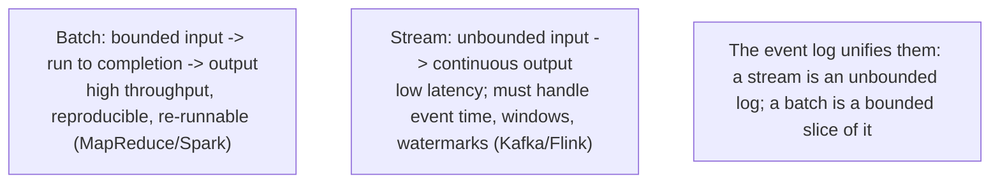

- **Batch** processing (MapReduce, Spark) reads complete input and is **deterministic and replayable** — a failed job just re-runs, and the same input yields the same output. Its functional, immutable-input style is why it's so robust.
- **Stream** processing (Kafka Streams, Flink) handles events one at a time over an endless input, so it must answer "when is a window's result complete?" using **event time**, **windows**, and **watermarks** (see the sibling *Stream Processing* guide).
- The unifying idea: an **append-only event log** is the common substrate. A stream is the log read as it grows; a batch is a bounded slice of the same log. This is why "batch vs stream" is converging.

### 10.4 Architecture: derived state from an event log

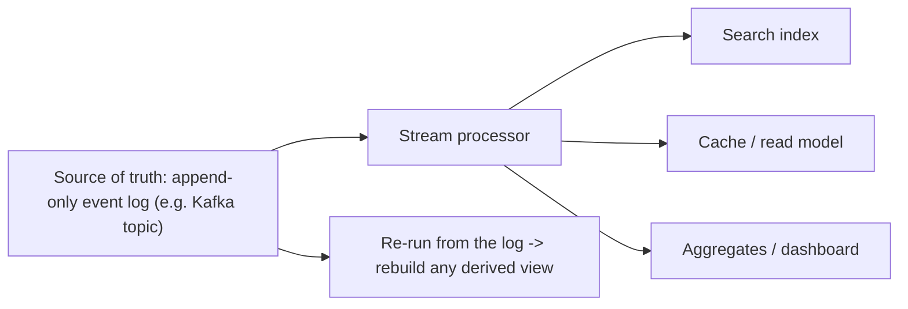

Treat the **log as the source of truth** and every search index, cache, and aggregate as a **derived view** computed from it. This makes derived state **reproducible**: to fix a bug in a projection or add a new index, you don't migrate in place — you **reprocess the log from the start** and rebuild the view. Batch reprocesses the historical log; streaming keeps the view current as new events arrive. The same code path (or the *kappa architecture*'s single streaming path) can do both, which is why log-centric design has become the backbone of large data systems.

### 10.5 Real example

**Scenario.** A product needs a search index over orders, and the indexing logic has a bug that mis-tokenizes some fields.

**Problem.** With state mutated in place, fixing the index means a risky, hard-to-verify in-place migration — and there's no clean way to rebuild from scratch.

**Solution.** Make the **order event log** the source of truth and the search index a **derived view**. Fix the indexing code and **reprocess the log** to rebuild the index from a known-good input; keep it current with the streaming path going forward.

**Implementation (log-as-truth, rebuildable view).**

```text
source of truth: orders.events  (append-only log, immutable)

# fix the bug, then rebuild deterministically:
batch job: read orders.events from offset 0 -> apply FIXED indexing -> write search_index_v2
switch reads to search_index_v2 (atomic), drop v1
stream job: continue applying new events to search_index_v2 to keep it current
```

**Result.** The index is rebuilt correctly from immutable history with no risky in-place migration; old and new indexes coexist during cutover; the streaming path keeps it live. Derived state became reproducible.

**Future improvements.** Keep the log retention long enough to rebuild any view; add a contract test asserting the derived view matches a recomputation from the log.

### 10.6 Exercises

1. What distinguishes batch from stream processing, and why is batch easy to re-run?
2. How does an append-only event log unify batch and streaming?
3. Why does treating the log as source of truth make derived views reproducible?

### 10.7 Challenges

- **Challenge.** Pick a derived dataset you maintain (an index, a cache, an aggregate). Describe how you'd rebuild it from an event log after a logic fix, with zero in-place migration, and how the streaming path keeps it current.

### 10.8 Checklist

- [ ] I distinguish bounded (batch) from unbounded (stream) processing.
- [ ] I treat an append-only log as the unifying substrate for both.
- [ ] I model search indexes/caches/aggregates as derived, rebuildable views.
- [ ] I can rebuild a derived view by reprocessing the log instead of migrating in place.

### 10.9 Best practices

- Keep one source of truth (ideally an event log) and derive everything else from it.
- Make derived views rebuildable by reprocessing; retain the log long enough to do so.
- Use batch for completeness/reproducibility, streaming for timeliness — over the same log.

### 10.10 Anti-patterns

- Mutating derived state in place, with no way to rebuild it cleanly.
- Multiple independent sources of truth that drift apart.
- Choosing streaming for a job that needs exact, reproducible batch results (or vice versa).

### 10.11 Troubleshooting

| Symptom | Likely cause | Action |
|---------|--------------|--------|
| Derived view is wrong, scary to fix | State mutated in place, not derived | Make it a view; rebuild by reprocessing the log |
| Reports disagree across systems | Multiple sources of truth | Designate one log/source; derive the rest |
| Can't rebuild a view after a bug | Log retention too short | Increase retention; snapshot + log |

### 10.12 References

- M. Kleppmann, *Designing Data-Intensive Applications* (O'Reilly, 2017), Chapter 10 "Batch Processing" and Chapter 11 "Stream Processing" — ISBN 978-1449373320.
- See also the sibling guide *Stream Processing* for event time, windows, and watermarks.

---

## Chapter 11 — Designing systems of integration (the "unbundled database")

### 11.1 Introduction

No single tool does everything well, so a real system is several specialized stores wired together: a relational system of record, a search index, a cache, a stream processor, an analytics warehouse. Viewed as a whole, these compose an **"unbundled database"** — the components a monolithic database hides internally (storage, indexes, replication, materialized views) are pulled apart into separate systems and **reconnected by streams of data**. This final chapter is about designing those seams deliberately so the assembled system stays consistent and evolvable.

### 11.2 Business context

The integration *between* systems — not any single store — is where large architectures succeed or fail. Done well, each tool does what it's best at and data flows reliably between them, so new capabilities (a new index, a new analytic) are added without re-platforming. Done badly, brittle point-to-point syncs and dual writes leave stores silently disagreeing, producing the worst class of bug: data that's wrong in one system and right in another, with no clear owner. Designing the dataflow is therefore the architect's highest-leverage job in a data-intensive system.

### 11.3 Theoretical concepts: dataflow over dual writes

```mermaid
flowchart TB
    dual["Dual writes: app writes to DB and to index/cache separately<br/>-> they diverge on partial failure (anti-pattern)"]
    cdc["Change Data Capture: DB change log -> stream -> derived stores<br/>one ordered source of truth feeds all views"]
    dual -. avoid .-> cdc
```

The naive way to keep two stores in sync is **dual writes** — the application writes to the database *and* the search index itself. This is fragile: any partial failure (one write succeeds, the other doesn't) leaves them permanently inconsistent, and concurrent dual writes can apply in different orders to each store. The robust alternative is **dataflow**: designate one **ordered source of truth** (a database with **Change Data Capture**, or an event log) and derive every other store from its change stream. Now there is a single ordering, failures are just "the consumer is behind" (it catches up), and adding a new derived store means replaying the stream.

### 11.4 Architecture: CDC feeding derived stores

```mermaid
flowchart LR
    db["System of record (DB)"] -->|change data capture| log["Ordered change stream / log"]
    log --> search["Search index"]
    log --> cache["Cache / read model"]
    log --> warehouse["Analytics warehouse"]
    log --> new["New derived store (replay the stream to backfill)"]
```

**Change Data Capture (CDC)** turns a database's own write log into an event stream other systems consume — the source of truth stays the database, but its changes propagate to every derived store **in order**. This is the unbundled database made concrete: the "materialized view maintenance" a monolithic DB does internally becomes an explicit stream pipeline you can observe, test, and extend. Adding a new index or warehouse is a matter of attaching a new consumer and replaying history to backfill — no dual writes, no drift. The design discipline is to keep these seams **idempotent** and **replayable** (Chapter 8) so a consumer can always rebuild from the log.

### 11.5 Real example

**Scenario.** An app keeps a PostgreSQL system of record and an Elasticsearch index; today the app writes to both directly.

**Problem.** Under partial failures and concurrency, the two diverge — search shows products that no longer exist, or misses new ones — with no single owner of truth and no clean way to reconcile.

**Solution.** Stop dual-writing. Make PostgreSQL the source of truth, capture its changes with **CDC** (e.g. Debezium → Kafka), and have a consumer keep Elasticsearch updated from that ordered stream. Backfill by replaying history.

**Implementation (CDC pipeline replaces dual writes).**

```text
# before (fragile): app -> write PostgreSQL; app -> write Elasticsearch  (can diverge)

# after (dataflow):
PostgreSQL (source of truth)
  -> CDC (Debezium) captures the WAL as an ordered change stream -> Kafka topic
  -> consumer applies changes idempotently to Elasticsearch (keyed by primary key)
# new index or warehouse later: attach a new consumer, replay the topic to backfill
```

**Result.** Search can no longer silently disagree with the database: every change flows from one ordered source, partial failures become "consumer lag" that self-heals, and adding derived stores is replay, not rework. The architecture is now an unbundled database with explicit, observable seams.

**Future improvements.** Monitor consumer lag as an SLI; make every consumer idempotent (keyed upserts); add a periodic reconciliation that recomputes a derived store from the log and diffs it against the live one.

### 11.6 Exercises

1. Why are dual writes fragile, and what two failure modes do they cause?
2. How does Change Data Capture provide a single ordering for all derived stores?
3. Why does log-centric dataflow make adding a new derived store easy?

### 11.7 Challenges

- **Challenge.** Find a place where your app dual-writes to two stores. Redesign it as a CDC/event-log dataflow: name the source of truth, the change stream, the idempotent consumer, and how you'd backfill a brand-new derived store.

### 11.8 Checklist

- [ ] I designate one ordered source of truth per dataset.
- [ ] I derive other stores from a change stream, not dual writes.
- [ ] My stream consumers are idempotent and replayable.
- [ ] I can add a derived store by attaching a consumer and replaying history.

### 11.9 Best practices

- Replace dual writes with CDC / event-log dataflow from a single source of truth.
- Keep every seam idempotent and replayable; monitor consumer lag.
- Add periodic reconciliation to detect and heal any drift.

### 11.10 Anti-patterns

- Dual writes from the application to multiple stores.
- Point-to-point sync spaghetti with no single source of truth.
- Non-idempotent consumers that can't safely replay or recover.

### 11.11 Troubleshooting

| Symptom | Likely cause | Action |
|---------|--------------|--------|
| Search/cache disagrees with the database | Dual writes diverged | Switch to CDC dataflow from one source of truth |
| Derived store stuck/behind | Consumer lag or failure | Monitor lag; resume/replay the idempotent consumer |
| Duplicates after a replay | Non-idempotent consumer | Make writes keyed upserts (idempotent) |

### 11.12 References

- M. Kleppmann, *Designing Data-Intensive Applications* (O'Reilly, 2017), Chapter 11 "Stream Processing" and Chapter 12 "The Future of Data Systems" (the unbundled database) — ISBN 978-1449373320.
- Debezium documentation (Change Data Capture): https://debezium.io/documentation/.

---

> **End of guide.** You can now reason about data-intensive systems end to end. Start by naming the goals as measurable **reliability, scalability, and maintainability** and choosing a **data model** (Part I). Go one level down to **storage engines** and **schema-compatible encoding** (Part II), then **distribute** data with **replication** and **partitioning** (Part III). Keep it correct with **transactions** and honest assumptions about **unreliable networks, clocks, and pauses** (Part IV), and obtain strong guarantees through the **consistency spectrum** and **consensus** (Part V). Finally, **derive** value with **batch and stream processing** and compose the whole as an **unbundled database** of specialized stores wired by ordered dataflow (Part VI). The single thread through all of it: there is no best database, only the best fit for a stated load and a stated guarantee — and the architect's craft is making each trade-off deliberately, then deriving everything from one source of truth.
