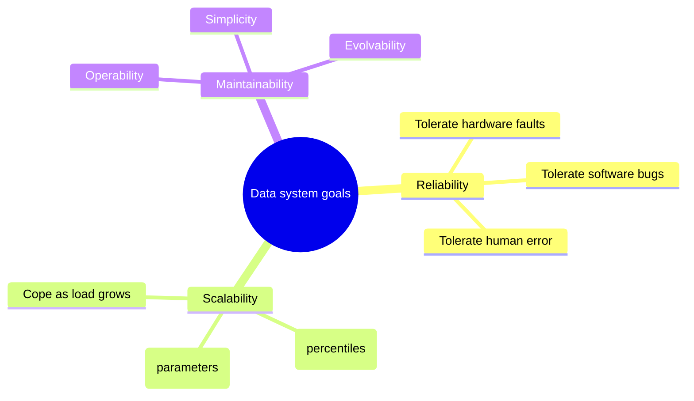
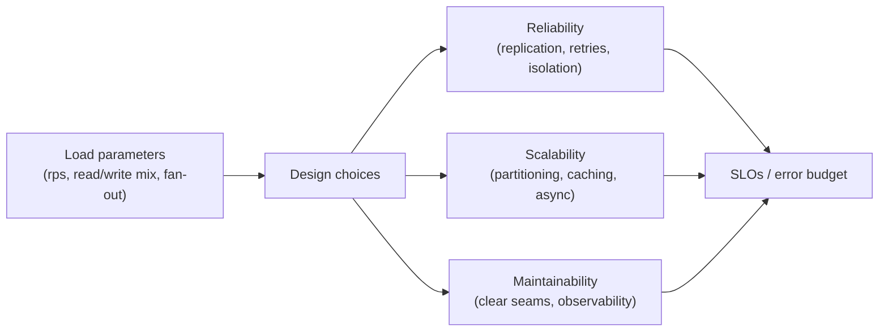
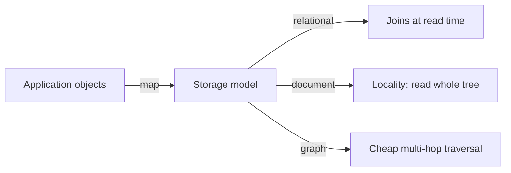

# Designing Data-Intensive Systems - Complete Professional Guide

> **Category:** 05_databases · **Language:** English

---

### Reliability, scalability, and maintainability for modern data systems
**Original guide written from primary sources, current to 2026**

> **Original reference book (English).** This is an **independent, originally written** guide. It is not an extract, summary, or paraphrase of any third-party book; it teaches the topic from first principles and primary sources (database documentation, distributed-systems papers, and protocol specifications). Where a canonical book covers the same ground, it is listed under **References** as a pointer only. Each chapter follows the TO-BRAIN editorial standard (see `FILE_CONVENTIONS.md`).
>
> **Scope notice:** this guide covers how to reason about systems whose primary challenge is **data** — its volume, velocity, complexity, and the guarantees applications need from it. It is technology-agnostic but grounded in how real engines (PostgreSQL, Cassandra, Kafka, object stores, modern lakehouse/streaming platforms) behave in 2026.

---

## How to read this guide

| Level | Profile | Parts |
|-------|---------|-------|
| 1 — Beginner | New to data systems | Part I |
| 2 — Intermediate | App developers choosing a store | Parts II–III |
| 3 — Advanced | Designing for scale & failure | Parts IV–V |
| 4 — Specialist | Consistency & coordination | Part VI |
| 5 — Architect | Streaming & system integration | Part VII |

**Target audience:** backend and data engineers, architects, platform/SRE teams, and tech leads who must choose, combine, and operate databases, queues, caches, and stream processors.

**Structure of each chapter:** Introduction · Business context · Theoretical concepts · Architecture · Diagrams (Mermaid) · Real examples · Step by step · Complete examples · Exercises · Challenges · Checklist · Best practices · Anti-patterns · Troubleshooting · References.

> **Note on prerequisites.** Assumes basic SQL, HTTP, and familiarity with at least one programming language. No prior distributed-systems background is required; the concepts are built up from first principles.

---

## Table of Contents

**Part I – Foundations**
1. The three pillars: reliability, scalability, maintainability
2. Thinking in data models (relational, document, graph)

**Part II – Storage & Retrieval**
3. How storage engines actually work (B-trees vs LSM-trees)
4. Encoding, schema evolution, and compatibility

**Part III – Distributing Data**
5. Replication (leader-based, multi-leader, leaderless)
6. Partitioning (sharding) and rebalancing

**Part IV – Consistency & Correctness**
7. Transactions and isolation levels
8. The trouble with distributed systems (clocks, failures, quorums)

**Part V – Consensus & Coordination**
9. Consistency models and consensus

**Part VI – Derived & Streaming Data**
10. Batch and stream processing
11. Designing systems of integration (the "unbundled database")

> **Status of this guide:** phased delivery. **Ready:** Part I (Ch. 1–2). **In progress:** Parts II–VII.

---

## Part I – Foundations

A "data-intensive" system is one where the **hard part is the data** — not raw CPU. The bottlenecks are data volume, the rate it changes, and the complexity of the guarantees applications place on it. Almost every such system is assembled from a handful of building blocks — databases, caches, search indexes, message queues, and stream processors — wired together. The skill is knowing what each block guarantees, where it breaks, and how the seams between them behave.

---

## Chapter 1 — The three pillars: reliability, scalability, maintainability

### 1.1 Introduction

Before choosing any technology, name the **non-functional goals** the system must meet. Three recur in every data system: it should keep working correctly when things go wrong (**reliability**), keep performing as load grows (**scalability**), and stay workable for the humans who operate and change it (**maintainability**). These are not vague ideals — each can be made measurable and turned into design pressure.

### 1.2 Business context

These pillars are where engineering meets money. An hour of downtime has a euro figure; so does a checkout page that takes three seconds under Black-Friday load, or an on-call engineer burning out on a system nobody understands. Stating the targets explicitly — "99.9% of writes acknowledged under 50 ms at 10× today's traffic" — turns architecture from taste into a decision you can defend and verify.

### 1.3 Theoretical concepts: defining each pillar



- **Reliability** = continuing to work *correctly* even when faults occur. A *fault* is one component deviating from spec; a *failure* is the system as a whole stopping. The goal is to prevent faults from becoming failures. You raise reliability by **tolerating** faults, not by hoping they never happen — and the only way to trust fault tolerance is to deliberately trigger faults (fault injection, chaos testing).
- **Scalability** = the system's ability to cope with **increased load**. It is meaningless until you (a) describe load with concrete **parameters** (requests/sec, read/write ratio, fan-out, concurrent users) and (b) describe performance with **percentiles**, not averages. Tail latency (p95/p99) is what users actually feel and what amplifies under fan-out.
- **Maintainability** = the cost of *living with* the system over years: **operability** (easy for ops to keep it healthy), **simplicity** (easy for new engineers to understand — fight accidental complexity), and **evolvability** (easy to change as requirements move).

### 1.4 Architecture: where the goals bite



Every later decision in this guide — replication, partitioning, isolation level, batch vs stream — is a trade between these three. There is no "best database," only the best fit for a stated load and a stated guarantee.

### 1.5 Real example

**Scenario.** A social feed must show each user a timeline of posts from people they follow.

**Problem.** A celebrity with 30M followers makes naive "fan-out on read" (query all followees at read time) too slow at the tail, while naive "fan-out on write" (push each post into every follower's timeline) explodes for that same celebrity.

**Solution.** Make load a parameter: most users are cheap to fan out **on write**; a small set of high-follower accounts are handled **on read** and merged in. The split point is chosen from the actual follower-count distribution.

**Implementation (sketch).**

```text
on new post by U:
    if followers(U) <= THRESHOLD:        # ordinary user
        for f in followers(U):           # fan-out on write
            append post_id to timeline_cache[f]
    else:                                # celebrity: skip the fan-out
        mark U as "pull at read time"

on read timeline for V:
    base   = timeline_cache[V]                    # precomputed
    celebs = [u for u in follows(V) if is_pull(u)]
    extra  = recent_posts(celebs)                 # fan-out on read, few accounts
    return merge_by_time(base, extra)
```

**Result.** The expensive operation (touching 30M timelines) never happens; the tail is bounded because the read-time merge touches only a handful of accounts.

**Future improvements.** Measure the threshold from the live follower histogram; cache the celebrity merge for a few seconds; track p99 timeline-build latency as the SLI.

### 1.6 Exercises

1. Give two load parameters for a payment API and two for a chat app — why do they differ?
2. Why is p99 latency a better target than mean latency for a user-facing read?
3. Define *fault* vs *failure* and give one example of turning a fault into a non-failure.

### 1.7 Challenges

- **Challenge.** Take any service you know. Write its load in 3 parameters and its performance goal as a percentile. Then name the single design choice most likely to break first as load grows 10×.

### 1.8 Checklist

- [ ] I can state load as concrete parameters, not "a lot of traffic."
- [ ] I describe latency with percentiles, not averages.
- [ ] I distinguish reliability (tolerating faults) from "no faults."
- [ ] I treat operability, simplicity, and evolvability as design targets.

### 1.9 Best practices

- Write the SLO **before** the architecture; let it drive the trade-offs.
- Test fault tolerance by injecting faults — untested failover is not failover.
- Track tail latency (p95/p99) per endpoint, not just the average.

### 1.10 Anti-patterns

- "Scalable" as a marketing adjective with no load parameter behind it.
- Averaging latency, hiding the tail users actually experience.
- Adding components for resilience without ever exercising the failure path.

### 1.11 Troubleshooting

| Symptom | Likely cause | Action |
|---------|--------------|--------|
| p99 spikes under load, mean looks fine | Tail amplified by fan-out / queueing | Measure per-stage percentiles; bound fan-out |
| Failover never triggers in an outage | Untested fault-tolerance path | Add fault injection to CI/staging |
| "It got slow" with no baseline | No load/perf targets defined | Define load parameters + percentile SLOs |

### 1.12 References

These are pointers for further study; this guide does not reproduce their text.

- M. Kleppmann, *Designing Data-Intensive Applications* (O'Reilly, 2017) — ISBN 978-1449373320.
- Official docs: PostgreSQL (https://www.postgresql.org/docs/), Apache Cassandra (https://cassandra.apache.org/doc/), Apache Kafka (https://kafka.apache.org/documentation/).

---

## Chapter 2 — Thinking in data models

### 2.1 Introduction

A **data model** shapes not just how you store information but how you are able to *think* about the problem. Picking relational, document, or graph is less about "which is newer" and more about **where the relationships live** and **who needs to traverse them**. This chapter frames the choice and the modern (2026) reality that most systems use more than one.

### 2.2 Business context

The data model is the contract between the product's concepts and the storage that outlives any single feature. Get it wrong and every future query fights the schema; get it right and new features fall out naturally. Because migrations are expensive and risky at scale, this is one of the highest-leverage early decisions.

### 2.3 Theoretical concepts: three families

- **Relational** — data as **tables of rows**; relationships expressed by **joins** at read time. Strong fit when the data is highly interconnected and you need flexible, ad-hoc queries with strong integrity (foreign keys, constraints). The dominant default for transactional systems.
- **Document** — data as **self-contained documents** (typically JSON). Strong fit for tree-shaped, one-to-many data read as a unit (an order with its line items). Locality is the win; relationships *across* documents are the weakness — you re-implement joins in the application.
- **Graph** — data as **vertices and edges**, relationships are first-class. Strong fit when the *connections* are the point and traversals are many-hop (social graphs, fraud rings, recommendations, knowledge graphs).

```mermaid
flowchart TB
    q{"Where is the complexity?"}
    q -- "many-to-many, ad-hoc queries" --> rel["Relational"]
    q -- "tree read as a unit, locality" --> doc["Document"]
    q -- "the connections themselves" --> graph["Graph"]
```

The "right" answer is usually **polyglot persistence**: a relational system of record, a document store or cache for read-optimized views, a search index for text, and a graph store where traversal dominates — kept consistent through the integration patterns in Part VII.

### 2.4 Architecture: impedance and locality



The friction between in-memory objects and the stored shape is the classic **impedance mismatch**. Document models reduce it for tree-shaped aggregates; relational models reduce it for many-to-many; graph models reduce it for deep traversal. Modern relational engines blur the lines by storing and indexing JSON natively, so "relational vs document" is now often a spectrum within one engine.

### 2.5 Real example

**Scenario.** A marketplace needs orders (with line items), product search, and "customers who bought X also bought Y."

**Problem.** No single model serves all three well: orders are tree-shaped, search is text, recommendations are graph traversal.

**Solution.** System of record in a relational store (orders, payments, integrity). A document/JSON projection for fast order reads. A search index for the catalog. A graph projection for co-purchase traversal. One source of truth; the rest are **derived views** kept current by a change stream (Part VII).

**Implementation (relational core, JSON locality where it helps).**

```sql
-- Orders: relational integrity for money, JSON for the flexible line-item shape.
CREATE TABLE orders (
    id           BIGINT PRIMARY KEY,
    customer_id  BIGINT NOT NULL REFERENCES customers(id),
    status       TEXT   NOT NULL,
    total_cents  BIGINT NOT NULL CHECK (total_cents >= 0),
    items        JSONB  NOT NULL,          -- read the order as one unit
    created_at   TIMESTAMPTZ NOT NULL DEFAULT now()
);

-- Index inside the JSON for a common filter (e.g. orders containing a SKU).
CREATE INDEX idx_orders_items_sku ON orders USING gin ((items -> 'skus'));
```

**Result.** Money and relationships get relational guarantees; the order document is read in one shot; search and recommendations live in stores built for them.

**Future improvements.** Drive the derived views from the order table's change stream so they cannot silently drift; add a contract test asserting projection ↔ source-of-truth consistency.

### 2.6 Exercises

1. Give one dataset that is painful in a document store and explain why.
2. When does a graph database beat recursive SQL for a many-hop query?
3. What is the impedance mismatch, and how does a document model reduce it?

### 2.7 Challenges

- **Challenge.** Model a "team → projects → tasks → assignees" domain three ways (relational, document, graph). For each, write the query "all tasks assigned to people on team T" and compare effort.

### 2.8 Checklist

- [ ] I choose a model from where the relationships and queries live, not by fashion.
- [ ] I know when locality (document) helps and when it hurts.
- [ ] I treat non-source-of-truth stores as derived views.
- [ ] I consider native JSON in a relational engine before adding a second database.

### 2.9 Best practices

- Keep **one** system of record; make every other store a derived, rebuildable view.
- Use the relational engine's JSON support before introducing a separate document store.
- Let query patterns — not table count — drive the model.

### 2.10 Anti-patterns

- Scattering the source of truth across several stores with no clear owner.
- Forcing deep graph traversals through many self-joins in SQL.
- Choosing a database for its category buzz rather than the access pattern.

### 2.11 Troubleshooting

| Symptom | Likely cause | Action |
|---------|--------------|--------|
| App is full of hand-written "joins" | Document model used for many-to-many data | Move relationships to a relational core |
| Recommendation queries time out | Multi-hop traversal on a relational schema | Add a graph projection for traversal |
| Derived view disagrees with source | Drift in the projection pipeline | Drive views from a change stream; add contract tests |

### 2.12 References

- E. F. Codd, "A Relational Model of Data for Large Shared Data Banks," *CACM* (1970).
- Official docs: PostgreSQL JSON types (https://www.postgresql.org/docs/current/datatype-json.html), Neo4j Cypher (https://neo4j.com/docs/).
- M. Kleppmann, *Designing Data-Intensive Applications* (O'Reilly, 2017) — ISBN 978-1449373320, for the broader treatment.

---

> **End of Part I.** You can now (1) state a data system's goals as measurable reliability, scalability, and maintainability targets, and (2) choose a data model from where the relationships and queries actually live, defaulting to a single source of truth with derived views. **Part II — Storage & Retrieval** (Chapters 3–4) goes one level down: how B-tree and LSM-tree engines store and find data, and how to evolve schemas without breaking readers or writers.

<!--APPEND-PART-II-->
