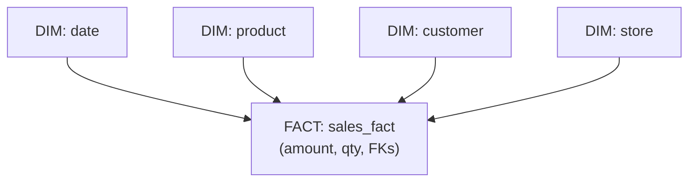
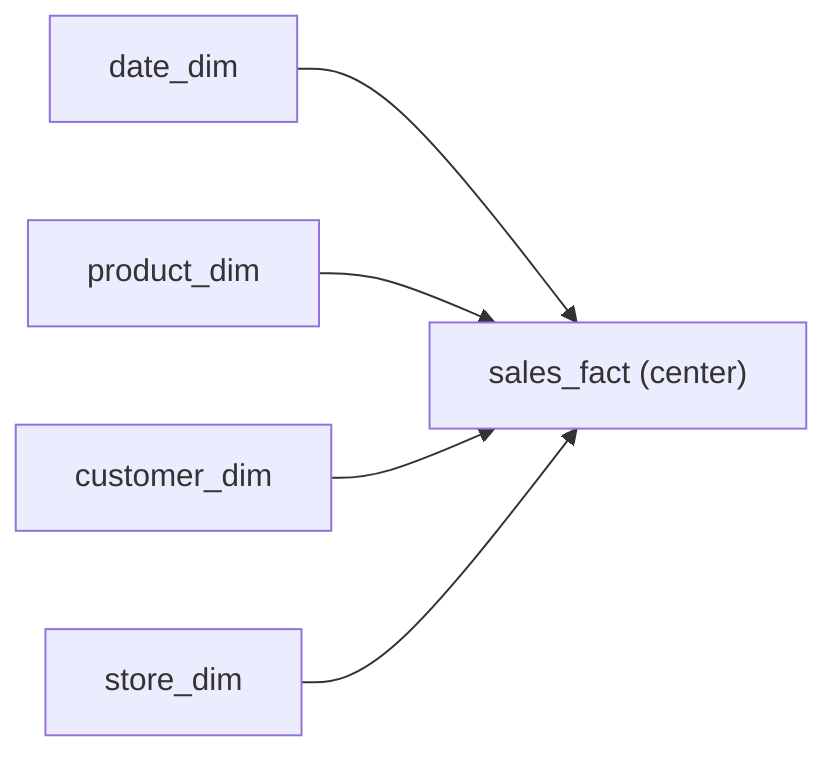
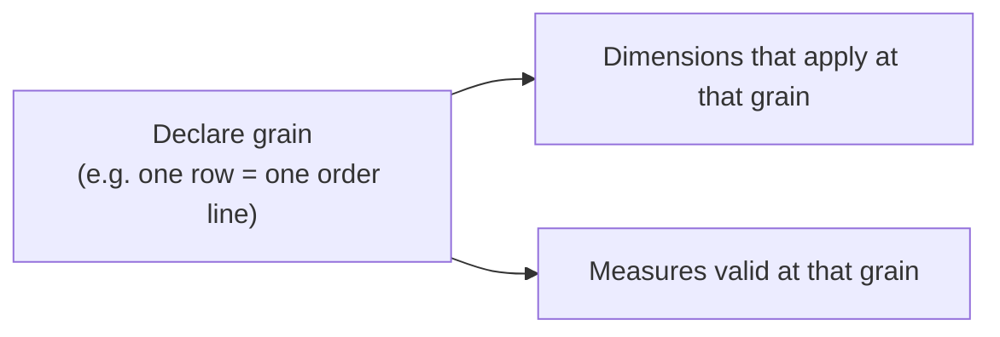
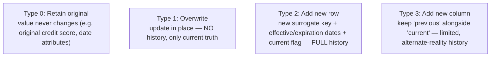
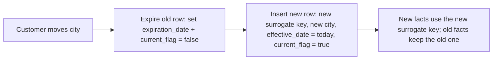

# Dimensional Modeling for Analytics - Complete Professional Guide

> **Category:** 05_databases · **Language:** English

---

### Facts, dimensions, and the star schema for analytical data
**Original guide written from first principles, current to 2026**

> **Original reference book (English).** This is an **independent, originally written** guide. It is not an extract, summary, or paraphrase of any third-party book; it teaches dimensional modeling from first principles with original examples. Canonical books are listed under **References** as pointers only. Each chapter follows the TO-BRAIN editorial standard (see `FILE_CONVENTIONS.md`).
>
> **Scope notice:** analytical data ("what happened, sliced by everything") has different needs than transactional data. This guide covers dimensional modeling — facts, dimensions, star schemas, and slowly changing dimensions — current to 2026 (cloud warehouses, lakehouse).

---

## How to read this guide

| Level | Profile | Parts |
|-------|---------|-------|
| 1 — Beginner | New to analytics modeling | Part I |
| 2 — Intermediate | Designing a star schema | Part II |

**Target audience:** data engineers, analysts, and backend developers building reporting/analytics data.

**Structure of each chapter:** Introduction · Business context · Theoretical concepts · Architecture · Diagrams (Mermaid) · Real examples · Step by step · Complete examples · Exercises · Challenges · Checklist · Best practices · Anti-patterns · Troubleshooting · References.

> **Note on prerequisites.** Assumes SQL and basic relational modeling.

---

## Table of Contents

**Part I – The star schema**
1. Facts and dimensions
2. The star schema and grain

**Part II – Change over time**
3. Slowly changing dimensions

> **Status of this guide:** complete. **Ready:** Part I (Ch. 1–2), Part II (Ch. 3).

---

## Part I – The star schema

Transactional (OLTP) schemas are normalized for fast, consistent writes. Analytical (OLAP) schemas have the opposite job: answer "sum/average/count, sliced by any combination of attributes" fast and understandably. Dimensional modeling — **facts** surrounded by **dimensions** in a **star schema** — is the dominant pattern for that job.

---

## Chapter 1 — Facts and dimensions

### 1.1 Introduction

Dimensional modeling splits analytical data into two kinds of table. **Fact tables** hold the **measurements** of a business process (a sale's amount, quantity) plus foreign keys to context. **Dimension tables** hold the **context** by which you slice those measurements (product, customer, date, store). "Sales by product by month" = a fact (sales) sliced by two dimensions (product, date).

### 1.2 Business context

Analysts ask questions in business terms — "revenue by region by quarter," "units by category by promotion." A dimensional model maps directly onto how the business thinks, so reports are easy to write and understand, and queries are fast because the structure is built for aggregation-and-slice. A normalized OLTP schema, by contrast, forces analysts through a maze of joins and is slow for big aggregations — the reason warehouses model dimensionally.

### 1.3 Theoretical concepts: measurements vs context



- **Facts** are mostly numeric, **additive** measurements (you sum/average them), and there are many rows (one per event).
- **Dimensions** are descriptive, textual attributes (names, categories, dates) you **group and filter by**, with relatively few rows.

The questions you can answer are facts sliced/grouped by dimension attributes.

### 1.4 Architecture: the star



The **star schema**: one central fact table joined to several dimension tables, forming a star. Dimensions are deliberately **denormalized** (flat, wide) so queries need only one join per dimension — simple and fast, trading some redundancy for clarity and speed.

### 1.5 Real example

**Scenario.** Report retail sales by product category and month.

**Problem.** The OLTP schema needs many joins (order → line → product → category, plus date math) and is slow for big aggregations.

**Solution.** A sales fact with date/product/store/customer dimensions; category lives flat in the product dimension.

**Implementation.**

```sql
-- sales_fact: one row per sale line; measurements + dimension keys
-- product_dim: flat, includes category (denormalized)
SELECT d.year, d.month, p.category, SUM(f.amount) AS revenue
FROM   sales_fact f
JOIN   date_dim    d ON d.date_key    = f.date_key
JOIN   product_dim p ON p.product_key = f.product_key
GROUP BY d.year, d.month, p.category
ORDER BY d.year, d.month, p.category;
```

**Result.** One join per dimension, a clean GROUP BY, and the warehouse aggregates it fast — the report mirrors the business question directly.

**Future improvements.** Pre-aggregate common rollups; partition the fact by date for pruning.

### 1.6 Exercises

1. What's the difference between a fact and a dimension?
2. Why are dimensions denormalized in a star schema?
3. Give a business question and identify its fact and dimensions.

### 1.7 Challenges

- **Challenge.** Take a reporting need you have. Identify the fact (the measurement and its grain) and the dimensions you'd slice by. Sketch the star.

### 1.8 Checklist

- [ ] I separate measurements (facts) from context (dimensions).
- [ ] Facts are additive numeric measures with dimension keys.
- [ ] Dimensions are flat/denormalized descriptive tables.
- [ ] Reports map to facts sliced by dimension attributes.

### 1.9 Best practices

- Model analytical data as facts surrounded by dimensions.
- Denormalize dimensions for one-join-per-dimension queries.
- Keep facts numeric and additive where possible.

### 1.10 Anti-patterns

- Running analytics directly on a normalized OLTP schema at scale.
- Mixing measurements and descriptive attributes in one table.
- Over-normalizing dimensions (snowflaking) without need.

### 1.11 Troubleshooting

| Symptom | Likely cause | Action |
|---------|--------------|--------|
| Reports slow, join-heavy | Querying OLTP for analytics | Build a dimensional model |
| Analysts confused by schema | Not business-aligned | Model facts/dimensions in business terms |
| Many joins per dimension | Snowflaked dimensions | Denormalize into flat dimensions |

### 1.12 References

- R. Kimball, M. Ross, *The Data Warehouse Toolkit*, 3rd ed. (Wiley, 2013) — ISBN 978-1118530801.
- Cloud warehouse docs: e.g. BigQuery, Snowflake modeling guides.

---

## Chapter 2 — The star schema and grain

### 2.1 Introduction

The most important decision in a fact table is its **grain** — exactly what one row represents (one sale line? one daily summary? one shipment?). Declaring the grain first, precisely, governs everything else: which dimensions apply and which measures make sense. A fuzzy grain produces a fact table nobody can query correctly.

### 2.2 Business context

Grain errors are the costliest dimensional-modeling mistakes: mix grains in one fact table and aggregations double-count or undercount, producing wrong numbers that erode trust in the whole warehouse. Declaring grain explicitly up front keeps measures additive and reports correct. It also sets expectations for storage and detail level — atomic grain enables any rollup; pre-aggregated grain is smaller but limited.

### 2.3 Theoretical concepts: declare the grain first



Kimball's discipline: **choose the grain before anything else**. Prefer the **atomic** grain (the finest detail, e.g. one row per line item) — it lets you roll up to any summary later. Don't mix grains; if you need daily summaries too, that's a *separate* fact table (or a derived rollup).

### 2.4 Architecture: one grain per fact table


Each fact table has exactly one grain. Different reporting needs at different grains get different fact tables, all sharing **conformed dimensions** (the same product/date dimensions) so they combine consistently.

### 2.5 Real example

**Scenario.** A sales fact accidentally mixes per-line rows and per-order summary rows.

**Problem.** `SUM(amount)` double-counts (line rows + an order-total row) — every revenue number is wrong.

**Solution.** Pick one grain (order line); derive order/day summaries separately.

**Implementation (grain stated and enforced).**

```text
sales_line_fact
  GRAIN: exactly one row per order line item
  measures: line_amount, quantity   (additive at this grain)
  dims: date, product, customer, store

# daily/store rollups => a SEPARATE fact table or a view, not mixed in.
```

**Result.** With one clean grain, `SUM(line_amount)` is correct; rollups to order/day/month are derived consistently. Trust in the numbers is restored.

**Future improvements.** Document the grain in the table comment; add a test that no non-atomic rows leak in.

### 2.6 Exercises

1. What is the grain of a fact table?
2. Why prefer the atomic grain?
3. What goes wrong if you mix grains in one fact table?

### 2.7 Challenges

- **Challenge.** For a fact table you use or design, write its grain in one sentence. Check every measure is additive at that grain and no rows violate it.

### 2.8 Checklist

- [ ] I declare the fact grain before designing.
- [ ] I prefer the atomic (finest) grain.
- [ ] One grain per fact table — no mixing.
- [ ] Dimensions are conformed across fact tables.

### 2.9 Best practices

- State the grain first, precisely, and document it.
- Default to atomic grain; derive summaries separately.
- Share conformed dimensions across facts.

### 2.10 Anti-patterns

- Mixed grains in one fact table (double-counting).
- Starting with summary grain, losing detail you later need.
- Inconsistent dimensions that don't combine across facts.

### 2.11 Troubleshooting

| Symptom | Likely cause | Action |
|---------|--------------|--------|
| Aggregations double/undercount | Mixed grains | Enforce one grain; separate summaries |
| Can't drill into detail | Grain too coarse | Model at atomic grain |
| Facts don't combine | Non-conformed dimensions | Standardize shared dimensions |

### 2.12 References

- R. Kimball, M. Ross, *The Data Warehouse Toolkit*, 3rd ed. (Wiley, 2013) — ISBN 978-1118530801.
- R. Kimball, "Declaring the grain" (Kimball Group design tips), https://www.kimballgroup.com.

---

> **End of Part I.** You can now model analytical data dimensionally: separate measurements (facts) from descriptive context (dimensions) in a star schema with denormalized dimensions, and declare a single, precise, preferably atomic grain per fact table so aggregations stay correct. **Part II — Change over time** (Chapter 3) covers slowly changing dimensions — how to track history when a dimension's attributes (a customer's address, a product's category) change.

---

## Part II – Change over time

Part I modeled a snapshot. But dimensions are not static: customers move, products get recategorized, sales reps change regions. The decisive question for an analytics model is *what should happen to history when a descriptive attribute changes* — and the answer is not one rule but a deliberate choice per attribute. That choice is the **slowly changing dimension**.

---

## Chapter 3 — Slowly changing dimensions

### 3.1 Introduction

A **slowly changing dimension (SCD)** is the set of techniques for handling change in a dimension's descriptive attributes over time. The name (coined by Ralph Kimball in 1995) captures that these attributes change occasionally and unpredictably — a customer's city, a product's category, an employee's department — unlike facts, which arrive continuously. The core decision is whether a new value should **overwrite** the old (keeping only the current truth) or **preserve history** (so a measurement is reported against the attribute value that was true *when it happened*). Get this wrong and your historical reports silently rewrite the past — last year's sales suddenly attributed to this year's territories.

### 3.2 Business context

Analytics exists to answer "how did this measure behave over time, sliced by these attributes?" If a sales rep moves from the West to the East region and you simply update their region, every historical sale they ever made instantly *moves* to the East — the West's past performance is falsified. Conversely, sometimes you *do* want the correction to apply everywhere (a misspelled product name should just be fixed). There is no universally right answer; the business question dictates whether history must be preserved. Choosing the SCD type per attribute is therefore a modeling decision with direct reporting consequences, not a technical detail.

### 3.3 Theoretical concepts: the SCD types



Kimball numbers the techniques; three carry almost all real use:

- **Type 1 — Overwrite.** Replace the old value. Simple, no history; the dimension always reflects the current truth. Right for corrections (a fixed typo) and any attribute where nobody needs the old value.
- **Type 2 — Add a new row.** When the attribute changes, insert a *new* dimension row with a *new surrogate key*, an effective date, an expiration date on the old row, and a "current" flag. Facts from before the change still point at the old row; facts after point at the new one. This is the workhorse for true history.
- **Type 3 — Add a new column.** Keep `current_value` and `previous_value` side by side. Allows exactly one level of "alternate reality" (group by old *or* new). Used rarely, for planned redefinitions.

(Types 0, 5, 6, 7 are refinements — e.g. Type 6 layers a Type-1 "current" attribute onto a Type-2 row so you can report by either the historical or the present value.)

### 3.4 Architecture: Type 2 mechanics



Type 2 is why dimension tables use **surrogate keys** (Part I) rather than natural keys: one customer (one natural/durable key) can have many dimension rows over time, each with its own surrogate key. A fact row's foreign key captures *which version* of the customer was true at the moment of the measurement. To support point-in-time queries, the dimension row carries `effective_date`, `expiration_date`, and a `is_current` flag. "Total sales by the customer's city **at time of sale**" joins on the surrogate key (automatic). "Total sales by the customer's **current** city" filters `is_current = true` — or uses a Type-6 current attribute. Both questions become answerable because the history was preserved.

### 3.5 Real example

**Scenario.** A `dim_customer` records each customer's `region`. A customer relocates from West to East. A quarterly report breaks sales down by region.

**Problem.** With **Type 1** (overwrite), updating the region retroactively moves *all* of that customer's past sales to East — last year's West totals are now wrong. The business needs sales attributed to the region the customer was in *at the time of each sale*.

**Solution.** Make `region` a **Type 2** attribute: expire the old customer row and insert a new one with a new surrogate key. Past facts keep the old surrogate key (West); new facts get the new one (East).

**Implementation (Type 2 transition).**

```sql
-- 1. Expire the existing version
UPDATE dim_customer
SET expiration_date = CURRENT_DATE - 1, is_current = false
WHERE customer_natural_key = 'C-42' AND is_current = true;

-- 2. Insert the new version with a fresh surrogate key
INSERT INTO dim_customer
  (customer_sk, customer_natural_key, name, region, effective_date, expiration_date, is_current)
VALUES
  (nextval('dim_customer_sk'), 'C-42', 'Acme Co', 'East', CURRENT_DATE, '9999-12-31', true);

-- Past facts still join to the West (old) surrogate key; new facts use the East one.
-- "sales by current region":   join dim_customer WHERE is_current = true
-- "sales by region at sale time": join on the fact's customer_sk (no extra filter)
```

**Result.** Historical reports correctly attribute each sale to the region in effect when it occurred; the relocation does not falsify the past. Both "as-was" and "as-is" questions are answerable from the same model.

**Future improvements.** Apply Type 1 to genuinely correctional attributes on the same table (mixed types in one dimension are normal); add a Type-6 current-region attribute if "current region" reporting is frequent enough to want without the `is_current` filter.

### 3.6 Exercises

1. State, in one sentence each, what Type 1, Type 2, and Type 3 do to history.
2. Why does Type 2 require surrogate keys rather than natural keys in the dimension?
3. Give one attribute best modeled Type 1 and one best modeled Type 2, and justify each.

### 3.7 Challenges

- **Challenge.** Pick a dimension you maintain and classify each attribute as Type 0, 1, or 2 by asking "if this changes, must past facts keep the old value?" Then design the Type 2 transition (expire + insert) for one attribute that needs history.

### 3.8 Checklist

- [ ] I choose an SCD type per attribute based on whether history must be preserved.
- [ ] My Type 2 dimensions use surrogate keys, effective/expiration dates, and a current flag.
- [ ] I can answer both "as-was" and "as-is" questions from a Type 2 dimension.
- [ ] I use Type 1 only where the old value is genuinely disposable (corrections).
- [ ] I understand mixing types within one dimension is normal and expected.

### 3.9 Best practices

- Decide the SCD type during modeling, driven by the business reporting need.
- Default attributes that describe "who/what/where it was" to Type 2 history.
- Use surrogate keys so one natural entity can have many time-versioned rows.
- Maintain effective/expiration dates and a current flag for point-in-time queries.

### 3.10 Anti-patterns

- Overwriting (Type 1) an attribute whose history the business reports on — silently falsifying the past.
- Using natural keys in a dimension that needs Type 2 history.
- Pushing changing attributes into the fact table to "avoid" SCDs.
- Treating the SCD type as a one-size decision for the whole dimension.

### 3.11 Troubleshooting

| Symptom | Likely cause | Action |
|---------|--------------|--------|
| Past report totals change after an attribute update | Type 1 overwrite where history is needed | Convert the attribute to Type 2 |
| Can't reproduce a prior period's breakdown | No historical versions kept | Add Type 2 versioning (surrogate keys + dates) |
| Duplicate-looking dimension rows | Type 2 versions of one entity (expected) | Filter `is_current` or join on the fact's surrogate key |
| "Current value" reporting is awkward | Pure Type 2 needs an `is_current` filter | Add a Type-6 current attribute |

### 3.12 References

- R. Kimball, M. Ross, *The Data Warehouse Toolkit*, 3rd ed. (Wiley, 2013), Chapter 5 "Procurement" — Slowly Changing Dimension Techniques (Types 0–7) — ISBN 978-1118530801.
- Kimball Group, "Slowly Changing Dimensions" (design tips): https://www.kimballgroup.com.

---

> **End of guide.** You can now model analytical data dimensionally end to end: separate **facts** from **dimensions** in a star schema at a precise **grain** (Part I), and handle change over time with **slowly changing dimensions** (Part II) — overwriting (Type 1) where the past is disposable, and versioning rows (Type 2, with surrogate keys, effective/expiration dates, and a current flag) where history must be preserved. The recurring discipline is to let the business question drive the model: declare the grain, then decide per attribute whether a change should rewrite history or record it.
