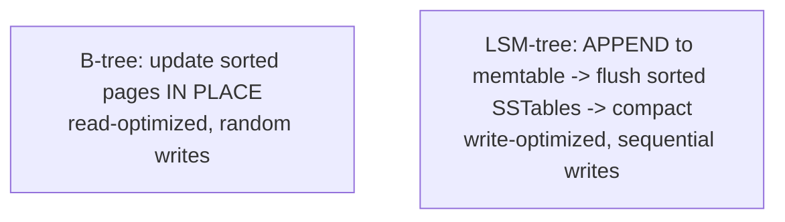
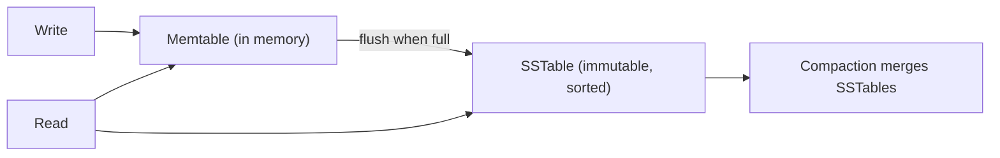
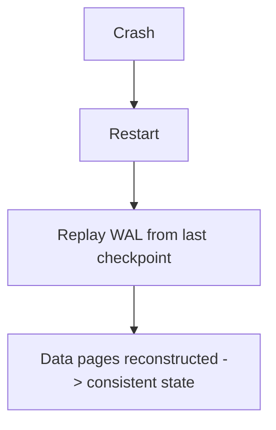

# How Databases Work Internally - Complete Professional Guide

> **Category:** 05_databases · **Language:** English

---

### Storage engines, write-ahead logs, and replication under the hood
**Original guide written from first principles, current to 2026**

> **Original reference book (English).** This is an **independent, originally written** guide. It is not an extract, summary, or paraphrase of any third-party book; it teaches database internals from first principles with original examples. Canonical books are listed under **References** as pointers only. Each chapter follows the TO-BRAIN editorial standard (see `FILE_CONVENTIONS.md`).
>
> **Scope notice:** understanding what a database does internally — how it stores, durably writes, and replicates data — makes you better at choosing engines and diagnosing performance. This guide covers storage engines (B-tree vs LSM), the write-ahead log, and replication basics, current to 2026.

---

## How to read this guide

| Level | Profile | Parts |
|-------|---------|-------|
| 1 — Beginner | Curious about internals | Part I |
| 2 — Intermediate | Choosing/operating engines | Part II |

**Target audience:** backend and data engineers who want to reason about database behavior, not just use SQL.

**Structure of each chapter:** Introduction · Business context · Theoretical concepts · Architecture · Diagrams (Mermaid) · Real examples · Step by step · Complete examples · Exercises · Challenges · Checklist · Best practices · Anti-patterns · Troubleshooting · References.

> **Note on prerequisites.** Assumes basic databases and the data-intensive-systems guide.

---

## Table of Contents

**Part I – Storage**
1. B-tree vs LSM-tree storage engines
2. Durability: the write-ahead log

**Part II – Distribution**
3. Replication and how nodes stay in sync

> **Status of this guide:** phased delivery. **Ready:** Part I (Ch. 1–2). **In progress:** Part II.

---

## Part I – Storage

Underneath every query is a **storage engine** deciding how bytes hit disk. The two dominant designs — B-tree and LSM-tree — make opposite trade-offs between read and write performance. Knowing which your database uses explains its behavior under load and guides when to pick one over another.

---

## Chapter 1 — B-tree vs LSM-tree

### 1.1 Introduction

Two storage-engine families dominate. **B-tree** engines (PostgreSQL, MySQL/InnoDB) update data **in place** in sorted pages — excellent reads, decent writes. **LSM-tree** (Log-Structured Merge tree) engines (Cassandra, RocksDB) **append** writes to memory then flush sorted files, merging later — excellent write throughput, with read amplification managed by compaction. The choice shapes a database's whole performance profile.

### 1.2 Business context

Picking the wrong storage engine for a workload is a structural performance mistake that's expensive to undo. A write-heavy ingestion system on a B-tree engine fights page contention; a read-latency-sensitive app on a naive LSM setup suffers read amplification. Knowing the trade-off lets teams match the engine to whether their workload is read- or write-dominant, avoiding costly re-platforming later.

### 1.3 Theoretical concepts: in-place vs append-merge



- **B-tree**: keeps data in sorted, fixed-size pages updated in place; reads are direct, writes may cause random I/O and page splits. Strong for read-heavy, range-query workloads.
- **LSM-tree**: buffers writes in memory (memtable), flushes immutable sorted files (SSTables), and **compacts** them in the background. Writes are sequential (fast); reads may check several files (mitigated by bloom filters and compaction).

### 1.4 Architecture: the LSM write path



LSM turns random writes into sequential appends — the reason it sustains huge write throughput. The cost is background compaction work and reads possibly touching multiple files, which bloom filters and tiered compaction keep in check.

### 1.5 Real example

**Scenario.** A telemetry pipeline ingests millions of writes per second; reads are mostly recent ranges.

**Problem.** A B-tree engine struggles with that write rate (random page updates, contention).

**Solution.** An LSM-based engine: sequential append writes sustain the rate; compaction keeps reads sane.

**Implementation (engine choice rationale).**

```text
Workload: write-heavy ingestion, range reads of recent data
  B-tree engine:  random writes, page splits -> write bottleneck
  LSM engine:     sequential appends -> sustains high write throughput
Decision: LSM-based store; tune compaction for read latency on recent data.
```

**Result.** The ingestion rate is met by sequential writes; recent-range reads stay fast with appropriate compaction — a structural fit instead of fighting the engine.

**Future improvements.** Monitor compaction backlog (a key LSM health metric); size memtables for the write rate.

### 1.6 Exercises

1. How do B-tree and LSM engines differ in how they write?
2. Why does LSM sustain high write throughput?
3. What is read amplification and how is it mitigated in LSM?

### 1.7 Challenges

- **Challenge.** Identify the storage engine behind a database you use. Is it B-tree or LSM? Does its read/write profile match your workload?

### 1.8 Checklist

- [ ] I know B-tree updates in place; LSM appends and compacts.
- [ ] I match engine choice to read- vs write-heavy workloads.
- [ ] I understand compaction's role and cost in LSM.
- [ ] I monitor the right health metric per engine.

### 1.9 Best practices

- Choose the engine family to fit the dominant access pattern.
- For LSM, watch compaction backlog and tune it.
- For B-tree, watch write contention and page bloat.

### 1.10 Anti-patterns

- Write-heavy ingestion on a read-optimized B-tree without tuning.
- Ignoring LSM compaction, letting reads degrade.
- Assuming all databases have the same performance shape.

### 1.11 Troubleshooting

| Symptom | Likely cause | Action |
|---------|--------------|--------|
| Write throughput hits a wall | Random-write engine for write-heavy load | Consider an LSM engine |
| Read latency rising over time | LSM compaction falling behind | Tune/scale compaction |
| Bloat and slow writes | B-tree page splits/fragmentation | Maintenance (vacuum/rebuild) |

### 1.12 References

- A. Petrov, *Database Internals* (O'Reilly, 2019) — ISBN 978-1492040347.
- A. Silberschatz, H. Korth, S. Sudarshan, *Database System Concepts*, 7th ed. (McGraw-Hill, 2019) — ISBN 978-0078022159.

---

## Chapter 2 — Durability: the write-ahead log

### 2.1 Introduction

How does a database survive a crash mid-write without corrupting data? The **write-ahead log (WAL)**: before changing the actual data pages, the engine first appends the change to a sequential log and flushes it to disk. If the system crashes, it **replays** the log to recover a consistent state. The WAL is the foundation of durability (the D in ACID) and of replication.

### 2.2 Business context

Data loss and corruption are catastrophic and erode all trust in a system. The WAL is what lets a database promise that a committed transaction survives crashes and power loss — the guarantee businesses depend on for anything that matters (payments, orders, records). Understanding it explains commit latency (a WAL flush) and why pulling the plug doesn't corrupt a properly-configured database.

### 2.3 Theoretical concepts: log before data


The rule: **write the log before the data**. Once the WAL record is safely on disk (an `fsync`), the transaction is durable — even if the actual data pages are written later or lost to a crash, recovery replays the log. This decouples "durable" from "fully applied," which is why commits are fast (one sequential flush) while page writes happen in the background.

### 2.4 Architecture: crash recovery



On restart the engine replays WAL records since the last **checkpoint** to redo committed changes (and undo uncommitted ones), restoring consistency. Checkpoints periodically flush data pages so recovery doesn't replay the entire log.

### 2.5 Real example

**Scenario.** A payment is committed, then the server loses power a millisecond later.

**Problem.** Without a WAL, an in-progress data-page write could leave the database corrupt or the payment lost.

**Solution.** The WAL recorded and fsynced the commit before acknowledging it; recovery replays it.

**Implementation (the guarantee).**

```text
COMMIT payment:
  1. write WAL record for the transaction
  2. fsync WAL  -> now durable
  3. ack COMMIT to the client
  -- power loss here is safe: on restart, WAL replay re-applies the payment
```

**Result.** The committed payment survives the crash; recovery replays the WAL to a consistent state. The client's "committed" was a real promise.

**Future improvements.** Ship the WAL to a replica (Chapter 3) so a whole-node loss is also survivable.

### 2.6 Exercises

1. Why must the log be written before the data pages?
2. What makes a transaction "durable" in WAL terms?
3. What is a checkpoint and why does it exist?

### 2.7 Challenges

- **Challenge.** Explain to a teammate why a database can commit fast yet survive a power cut. Trace the WAL path for one committed transaction.

### 2.8 Checklist

- [ ] I understand the WAL records changes before data pages.
- [ ] Durability comes from fsync-ing the log at commit.
- [ ] Crash recovery replays the WAL from a checkpoint.
- [ ] I relate commit latency to WAL flushing.

### 2.9 Best practices

- Keep the WAL on fast, reliable storage.
- Don't disable fsync/durability for data that matters.
- Tune checkpoint frequency to balance recovery time and I/O.

### 2.10 Anti-patterns

- Turning off durability (fsync) to "go faster" on critical data.
- Putting the WAL on slow/unreliable storage.
- Ignoring checkpoint tuning, causing long recovery or I/O spikes.

### 2.11 Troubleshooting

| Symptom | Likely cause | Action |
|---------|--------------|--------|
| Data loss after a crash | Durability disabled / no fsync | Enable proper WAL durability |
| Slow commits | WAL on slow disk / heavy fsync | Faster WAL storage; group commits |
| Very long recovery | Infrequent checkpoints | Tune checkpoint frequency |

### 2.12 References

- A. Petrov, *Database Internals* (O'Reilly, 2019) — ISBN 978-1492040347.
- PostgreSQL docs, "Write-Ahead Logging (WAL)": https://www.postgresql.org/docs/current/wal-intro.html.

---

> **End of Part I.** You can now reason about database internals: how B-tree (in-place, read-optimized) and LSM-tree (append-and-compact, write-optimized) storage engines trade reads against writes, and how the write-ahead log delivers crash-survivable durability by logging changes before applying them. **Part II — Distribution** (Chapter 3) covers replication — how data is copied across nodes (leader-based and beyond) for availability and read scaling, building on the WAL that feeds it.

<!--APPEND-PART-II-->
