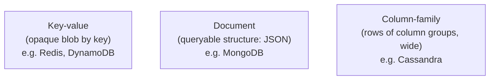
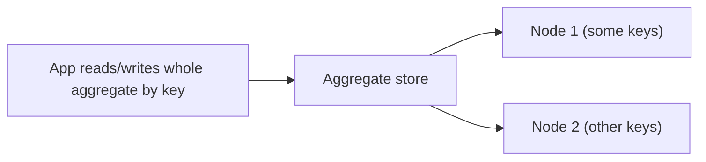
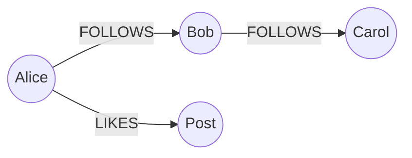

# NoSQL Data Models - Complete Professional Guide

> **Category:** 05_databases · **Language:** English

---

### Key-value, document, column-family, graph — and when each fits
**Original guide written from first principles, current to 2026**

> **Original reference book (English).** This is an **independent, originally written** guide. It is not an extract, summary, or paraphrase of any third-party book; it teaches NoSQL data models from first principles with original examples. Canonical books are listed under **References** as pointers only. Each chapter follows the TO-BRAIN editorial standard (see `FILE_CONVENTIONS.md`).
>
> **Scope notice:** "NoSQL" covers several non-relational data models that trade relational features for scale, flexibility, or specific access patterns. This guide explains the four families, the aggregate concept that unifies most of them, and the consistency trade-offs — current to 2026 (including how relational engines now overlap NoSQL).

---

## How to read this guide

| Level | Profile | Parts |
|-------|---------|-------|
| 1 — Beginner | New to NoSQL | Part I |
| 2 — Intermediate | Choosing a store | Part II |

**Target audience:** developers and architects deciding whether and which non-relational store to use.

**Structure of each chapter:** Introduction · Business context · Theoretical concepts · Architecture · Diagrams (Mermaid) · Real examples · Step by step · Complete examples · Exercises · Challenges · Checklist · Best practices · Anti-patterns · Troubleshooting · References.

> **Note on prerequisites.** Assumes relational basics and the data-intensive-systems guide.

---

## Table of Contents

**Part I – The models**
1. Aggregate-oriented stores (key-value, document, column-family)
2. Graph stores and when relationships dominate

**Part II – Trade-offs**
3. Consistency, CAP, and choosing deliberately

> **Status of this guide:** phased delivery. **Ready:** Part I (Ch. 1–2). **In progress:** Part II.

---

## Part I – The models

NoSQL isn't one thing — it's four broad families with very different strengths. Three of them (key-value, document, column-family) share a key idea: the **aggregate**. The fourth (graph) is the opposite, optimized for connections. Knowing which model fits an access pattern is the whole skill; using the wrong one is the usual NoSQL regret.

---

## Chapter 1 — Aggregate-oriented stores

### 1.1 Introduction

An **aggregate** is a cluster of related data treated as a single unit — e.g. an order with its line items, stored and retrieved together. **Key-value**, **document**, and **column-family** stores are all *aggregate-oriented*: you read and write whole aggregates by key, optimizing for that access pattern at the cost of cross-aggregate queries and joins.

### 1.2 Business context

Aggregate stores shine when the application reads and writes data in big self-contained chunks (a user profile, a shopping cart, a product page) at very high scale — they distribute easily because an aggregate lives on one node. The trade-off is they're poor at ad-hoc queries spanning many aggregates. Choosing one means betting that your access is aggregate-shaped; if it isn't, you fight the database forever.

### 1.3 Theoretical concepts: three aggregate stores



- **Key-value**: the simplest — store/get an opaque value by key. Fastest, least queryable. Great for caches, sessions.
- **Document**: the value is a structured document (JSON) you can also query and index by its fields. The most flexible aggregate store.
- **Column-family**: rows grouped into column families, optimized for huge write volumes and wide rows across a cluster.

### 1.4 Architecture: aggregate as the unit of distribution



Because an aggregate is self-contained and accessed by key, the store can **shard** by key across nodes trivially — the source of NoSQL's horizontal scalability. The flip side: operations spanning multiple aggregates (joins, multi-key transactions) are hard or unsupported.

### 1.5 Real example

**Scenario.** A shopping cart read and written as a whole, at very high traffic.

**Problem.** A relational schema (cart + items tables) means multiple joins per page and is harder to scale to extreme write volume.

**Solution.** Store the cart as one document keyed by cart id — one read, one write, shards by key.

**Implementation (document shape).**

```json
// key: cart:8123  ->  one aggregate, read/written whole
{
  "cartId": "8123",
  "userId": "u42",
  "items": [
    { "sku": "A1", "qty": 2, "price": 9.99 },
    { "sku": "B7", "qty": 1, "price": 19.99 }
  ],
  "updatedAt": "2026-06-23T10:00:00Z"
}
```

**Result.** The whole cart is one keyed read/write; the store shards carts across nodes for scale. No joins on the hot path.

**Future improvements.** Keep the system of record relational if you also need cross-cart analytics; treat the document store as a fast read model.

### 1.6 Exercises

1. What is an aggregate, and which three stores are aggregate-oriented?
2. Why do aggregate stores shard so easily?
3. What do you give up by choosing an aggregate store?

### 1.7 Challenges

- **Challenge.** Pick an entity in your app read/written as a unit. Model it as a single document. What queries become easy, and which (cross-entity) become hard?

### 1.8 Checklist

- [ ] I can name the three aggregate-oriented stores.
- [ ] I choose them when access is aggregate-shaped and high-scale.
- [ ] I understand they sacrifice cross-aggregate queries.
- [ ] I know the aggregate is the unit of sharding.

### 1.9 Best practices

- Use aggregate stores when you read/write whole units by key at scale.
- Model the aggregate around the application's access pattern.
- Keep cross-entity analytics elsewhere (relational/warehouse).

### 1.10 Anti-patterns

- Forcing cross-aggregate joins onto a key-value/document store.
- Choosing NoSQL for scale you don't have, losing relational integrity.
- Splitting a naturally-aggregate entity across many keys.

### 1.11 Troubleshooting

| Symptom | Likely cause | Action |
|---------|--------------|--------|
| Many round-trips to assemble data | Aggregate split across keys | Store it as one aggregate |
| Painful cross-entity queries | Wrong model for the access pattern | Keep a relational/warehouse copy |
| Hot single node | Poor shard key | Choose a key that distributes load |

### 1.12 References

- P. Sadalage, M. Fowler, *NoSQL Distilled* (Addison-Wesley, 2012) — ISBN 978-0321826626.
- Official docs: Redis (https://redis.io/docs/), MongoDB (https://www.mongodb.com/docs/), Apache Cassandra (https://cassandra.apache.org/doc/).

---

## Chapter 2 — Graph stores

### 2.1 Introduction

A **graph database** is the opposite of an aggregate store: instead of self-contained chunks, it optimizes for **relationships**. Data is **nodes** and **edges**, both with properties, and traversing connections is cheap regardless of depth. When the relationships *are* the point — social networks, recommendations, fraud rings, knowledge graphs — a graph store does in one query what relational joins do slowly.

### 2.2 Business context

Some problems are fundamentally about connections, and relational databases handle deep, variable-length relationship queries poorly (many self-joins, slow). Graph databases make these queries natural and fast, enabling features (real-time recommendations, fraud detection, dependency analysis) that would be impractical elsewhere. Recognizing a "this is really a graph problem" pattern can turn an unworkable feature into an easy one.

### 2.3 Theoretical concepts: nodes, edges, traversal



Both **nodes** (entities) and **edges** (relationships) carry properties. The query language traverses edges directly — "friends of friends," "shortest path," "all accounts connected to this one within 3 hops" — operations that grow expensive as repeated joins in SQL but stay cheap in a graph engine.

### 2.4 Architecture: relationships as first-class

```mermaid
flowchart TB
    q["Many-hop / variable-depth relationship query"] --> graph["Graph engine traverses edges"]
    graph --> fast["Cost ~ size of result, not whole table"]
```

Because edges are stored as direct pointers between nodes, traversal cost depends on how much of the graph you touch, not the total data size — the key performance advantage for connection-heavy queries.

### 2.5 Real example

**Scenario.** "People you may know" — friends-of-friends not already connected.

**Problem.** In SQL this is multiple self-joins on a friendships table, slow as the network grows.

**Solution.** A graph traversal: from a person, hop two FOLLOWS edges, exclude direct connections.

**Implementation (Cypher-style).**

```cypher
MATCH (me:Person {id: $id})-[:FOLLOWS]->(friend)-[:FOLLOWS]->(fof)
WHERE NOT (me)-[:FOLLOWS]->(fof) AND fof <> me
RETURN fof, count(*) AS mutuals
ORDER BY mutuals DESC
LIMIT 10;
```

**Result.** A natural two-hop traversal returns suggestions ranked by mutual connections — fast and readable, where the SQL equivalent is a slow tangle of joins.

**Future improvements.** Add edge properties (since when, weight) to refine ranking; use indexes on node ids for entry points.

### 2.6 Exercises

1. How does a graph store differ from an aggregate store?
2. Give two problems that are naturally graph-shaped.
3. Why are deep relationship queries cheap in a graph engine?

### 2.7 Challenges

- **Challenge.** Take a "friends of friends" or "dependency chain" query you'd write with self-joins. Express it as a graph traversal and compare clarity.

### 2.8 Checklist

- [ ] I recognize when relationships are the core of the problem.
- [ ] I model entities as nodes and relationships as edges.
- [ ] I use traversals for many-hop/variable-depth queries.
- [ ] I don't force deep-relationship queries onto relational joins.

### 2.9 Best practices

- Reach for a graph store when traversal dominates.
- Put properties on both nodes and edges to enrich queries.
- Index entry-point nodes for fast traversal starts.

### 2.10 Anti-patterns

- Many self-joins in SQL for a fundamentally graph problem.
- Using a graph store for aggregate-shaped, key-access data.
- Ignuring entry-point indexing, making every traversal scan.

### 2.11 Troubleshooting

| Symptom | Likely cause | Action |
|---------|--------------|--------|
| Relationship queries slow in SQL | Graph problem in a relational store | Use a graph database |
| Graph store slow for key lookups | Wrong model (aggregate access) | Use an aggregate store for that data |
| Traversals scan everything | No entry-point index | Index the starting nodes |

### 2.12 References

- I. Robinson, J. Webber, E. Eifrem, *Graph Databases*, 2nd ed. (O'Reilly, 2015) — ISBN 978-1491930892.
- Neo4j Cypher docs: https://neo4j.com/docs/cypher-manual/current/.

---

> **End of Part I.** You can now distinguish the NoSQL families: aggregate-oriented stores (key-value, document, column-family) that read/write self-contained units by key and shard easily but sacrifice cross-aggregate queries, versus graph stores that make deep relationship traversal natural and fast. **Part II — Trade-offs** (Chapter 3) covers consistency models, the CAP theorem's real meaning, and choosing a store deliberately rather than by hype — including how 2026 relational engines absorb much of the document model.

<!--APPEND-PART-II-->
