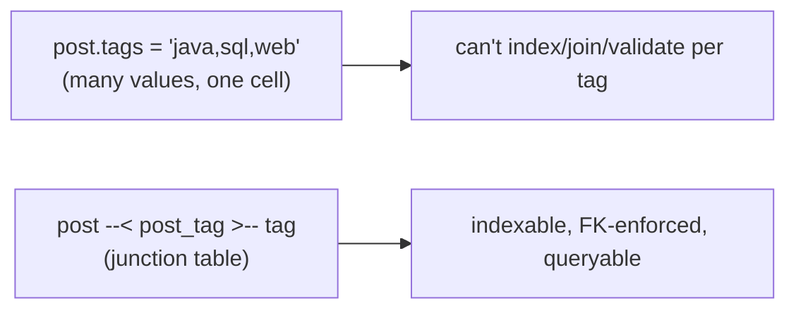
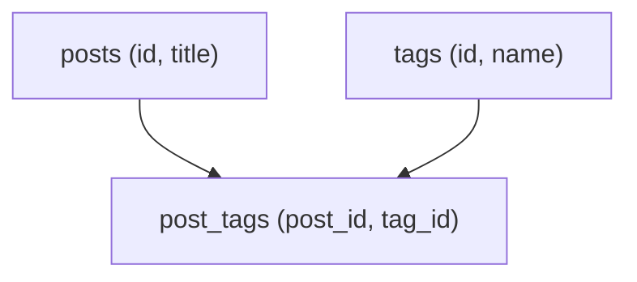
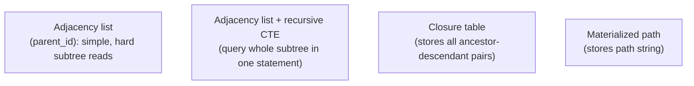
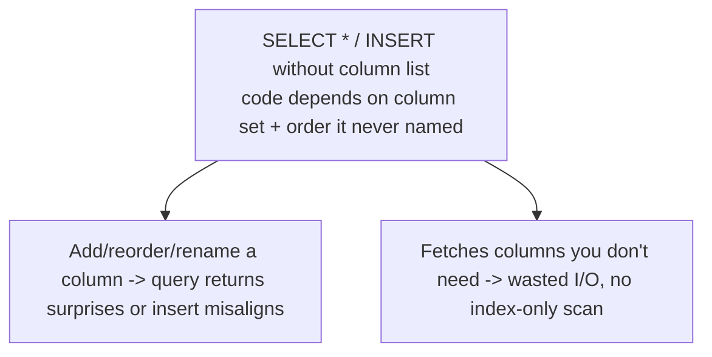
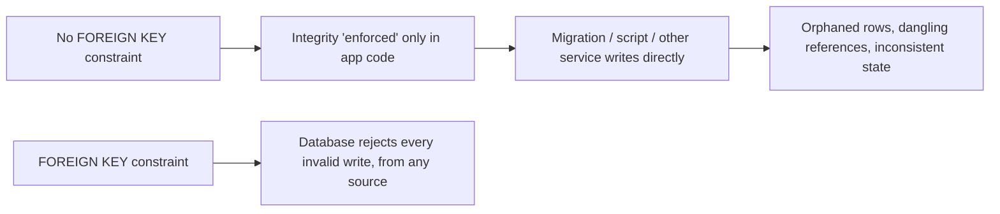

# SQL Database Antipatterns - Complete Professional Guide

> **Category:** 05_databases · **Language:** English

---

### Common schema and query mistakes, and how to fix them
**Original guide written from first principles, current to 2026**

> **Original reference book (English).** This is an **independent, originally written** guide. It is not an extract, summary, or paraphrase of any third-party book; it teaches SQL antipatterns from first principles with original examples. Canonical books are listed under **References** as pointers only. Each chapter follows the TO-BRAIN editorial standard (see `FILE_CONVENTIONS.md`).
>
> **Scope notice:** the same database mistakes recur across projects — storing lists in a comma-separated column, naive tree storage, relying on implicit behavior. This guide names the most common SQL antipatterns and gives the relational fix for each, current to 2026 engines.

---

## How to read this guide

| Level | Profile | Parts |
|-------|---------|-------|
| 1 — Beginner | New to schema design | Part I |
| 2 — Intermediate | Fixing existing schemas | Part II |

**Target audience:** application developers who design and query relational schemas.

**Structure of each chapter:** Introduction · Business context · Theoretical concepts · Architecture · Diagrams (Mermaid) · Real examples · Step by step · Complete examples · Exercises · Challenges · Checklist · Best practices · Anti-patterns · Troubleshooting · References.

> **Note on prerequisites.** Assumes basic SQL (SELECT/JOIN, primary/foreign keys).

---

## Table of Contents

**Part I – Schema antipatterns**
1. Storing multiple values in one column
2. Naive trees: storing hierarchies with parent_id only

**Part II – Query & integrity antipatterns**
3. Relying on implicit columns and missing constraints

> **Status of this guide:** complete. **Ready:** Part I (Ch. 1–2), Part II (Ch. 3).

---

## Part I – Schema antipatterns

Most database pain comes from a handful of schema mistakes that feel convenient at first and become expensive later. Recognizing them by name — and knowing the relational fix — saves projects from data integrity problems and slow, awkward queries down the line.

---

## Chapter 1 — Storing multiple values in one column

### 1.1 Introduction

A frequent antipattern: storing a list of values in a single column as a delimited string (e.g. `tags = "java,sql,web"`). It looks simple but breaks the relational model — you can't index individual values, enforce referential integrity, or query them cleanly. The fix is an **intersection (junction) table**.

### 1.2 Business context

The comma-separated shortcut saves minutes when first writing the schema and costs days later: searching for one tag requires fragile string matching, you can't guarantee a tag exists, and updates are error-prone. Modeling it relationally costs a little more up front but makes the data queryable, indexable, and trustworthy — the difference between a feature that scales and one that's quietly broken.

### 1.3 Theoretical concepts: one value per cell



The relational rule (first normal form) is **one value per cell**. A many-to-many relationship (a post has many tags; a tag belongs to many posts) is modeled with a **junction table** holding one row per (post, tag) pair, with foreign keys to both.

### 1.4 Architecture: the junction table



`post_tags` has a foreign key to each side; a composite primary key (post_id, tag_id) prevents duplicates. Now every tag is a real, referenceable entity.

### 1.5 Real example

**Scenario.** Posts need tags, and users must be able to find all posts with a given tag.

**Problem.** `posts.tags = "java,sql"` makes "find posts tagged sql" a `LIKE '%sql%'` that also matches "mysql", can't use an index, and lets typos in.

**Solution.** A junction table with foreign keys.

**Implementation.**

```sql
CREATE TABLE tags (
    id   BIGINT PRIMARY KEY,
    name TEXT UNIQUE NOT NULL
);
CREATE TABLE post_tags (
    post_id BIGINT NOT NULL REFERENCES posts(id),
    tag_id  BIGINT NOT NULL REFERENCES tags(id),
    PRIMARY KEY (post_id, tag_id)
);

-- find posts tagged 'sql' (indexed, exact, integrity-checked)
SELECT p.* FROM posts p
JOIN post_tags pt ON pt.post_id = p.id
JOIN tags t       ON t.id = pt.tag_id
WHERE t.name = 'sql';
```

**Result.** Tag queries are exact and indexed; a tag can't be misspelled into existence; counts and joins are trivial.

**Future improvements.** Add an index on `post_tags(tag_id)` for "posts by tag" lookups.

### 1.6 Exercises

1. Why does a comma-separated value column break the relational model?
2. What is a junction table and when do you need one?
3. Why is `LIKE '%x%'` a poor substitute for a real relationship?

### 1.7 Challenges

- **Challenge.** Find a delimited-list column in a schema you know. Model it as a junction table and rewrite a query against it. Compare correctness and indexability.

### 1.8 Checklist

- [ ] Each cell holds a single value (1NF).
- [ ] Many-to-many uses a junction table.
- [ ] Related values are foreign-keyed.
- [ ] I don't store lists as delimited strings.

### 1.9 Best practices

- Model multi-valued attributes as their own rows.
- Use junction tables with foreign keys for many-to-many.
- Let the database enforce existence and uniqueness.

### 1.10 Anti-patterns

- Comma-separated value columns ("jaywalking").
- Querying lists with `LIKE` substring matches.
- No foreign key, so invalid values creep in.

### 1.11 Troubleshooting

| Symptom | Likely cause | Action |
|---------|--------------|--------|
| Tag/category search slow or wrong | Delimited-list column | Move to a junction table |
| Invalid values in a list field | No referential integrity | Foreign-key the values |
| Can't count/join by value | Values not first-class rows | Normalize to rows |

### 1.12 References

- B. Karwin, *SQL Antipatterns* (Pragmatic Bookshelf, 2010) — ISBN 978-1934356555.
- C. Date, *SQL and Relational Theory*, 3rd ed. (O'Reilly, 2015) — ISBN 978-1491941171.

---

## Chapter 2 — Naive trees

### 2.1 Introduction

Hierarchies (categories, comments, org charts) are commonly stored with a single `parent_id` column (the **adjacency list**). That's fine for simple cases, but querying an arbitrary-depth subtree ("all descendants") with plain `parent_id` requires many queries or recursion. Knowing the alternatives — and that modern SQL has **recursive CTEs** — avoids the classic pain.

### 2.2 Business context

Teams often hit a wall when a feature needs "the whole subtree" (all comments under a thread, all sub-categories) and the naive `parent_id` schema forces N+1 queries or application-side recursion that's slow and complex. Choosing the right tree model — or using recursive queries — keeps hierarchy features fast and simple, avoiding a painful schema migration later when the data grows.

### 2.3 Theoretical concepts: tree storage options



- **Adjacency list** (`parent_id`): trivial inserts; subtree reads are hard without recursion.
- **Recursive CTE**: query an adjacency list's full subtree in **one** statement — the 2026 default for most cases.
- **Closure table**: a separate table of every ancestor→descendant pair; fast subtree/ancestor queries at the cost of more storage and write complexity.
- **Materialized path**: store the path (`/1/4/9/`); easy subtree by prefix, weaker integrity.

### 2.4 Architecture: recursive CTE over an adjacency list


For most applications, keep the simple `parent_id` schema and use a recursive CTE to read subtrees — no extra tables, supported by all major engines in 2026.

### 2.5 Real example

**Scenario.** Nested categories; you need every descendant of a category.

**Problem.** With only `parent_id`, fetching all descendants meant looping queries in the app.

**Solution.** A recursive CTE returns the whole subtree in one query.

**Implementation.**

```sql
-- categories(id, parent_id, name)
WITH RECURSIVE subtree AS (
    SELECT id, parent_id, name FROM categories WHERE id = :root
    UNION ALL
    SELECT c.id, c.parent_id, c.name
    FROM categories c
    JOIN subtree s ON c.parent_id = s.id
)
SELECT * FROM subtree;
```

**Result.** The full descendant set comes back in a single, index-friendly query — no application recursion, no N+1.

**Future improvements.** If subtree reads dominate and trees are huge, consider a closure table; otherwise the CTE is enough.

### 2.6 Exercises

1. Why is a plain `parent_id` schema awkward for subtree reads?
2. What does a recursive CTE let you do over an adjacency list?
3. When is a closure table worth its extra complexity?

### 2.7 Challenges

- **Challenge.** Take a `parent_id` hierarchy. Write a recursive CTE to fetch a full subtree and an ancestor chain. Measure vs the app-side loop it replaces.

### 2.8 Checklist

- [ ] I know the tree-storage options and their trade-offs.
- [ ] I use recursive CTEs for subtree queries by default.
- [ ] I reach for closure tables only when reads demand it.
- [ ] I don't loop queries in the app to walk trees.

### 2.9 Best practices

- Default to adjacency list + recursive CTE.
- Add a closure table only when subtree reads are hot and large.
- Index `parent_id` for traversal.

### 2.10 Anti-patterns

- Application-side recursion / N+1 to read subtrees.
- Choosing a complex tree model before it's needed.
- No index on the parent column.

### 2.11 Troubleshooting

| Symptom | Likely cause | Action |
|---------|--------------|--------|
| Subtree reads do many queries | Naive parent_id loop | Use a recursive CTE |
| Tree reads slow at scale | Repeated recursion | Consider a closure table |
| Slow parent lookups | No index on parent_id | Add the index |

### 2.12 References

- B. Karwin, *SQL Antipatterns* (Pragmatic Bookshelf, 2010) — ISBN 978-1934356555.
- PostgreSQL docs, "WITH Queries (Recursive)": https://www.postgresql.org/docs/current/queries-with.html.

---

> **End of Part I.** You can now spot and fix two pervasive schema antipatterns: storing multiple values in one column (fix: junction tables with foreign keys) and naive tree storage (fix: adjacency list with recursive CTEs, escalating to a closure table only when reads demand it). **Part II — Query & integrity antipatterns** (Chapter 3) covers relying on implicit columns (`SELECT *`, ambiguous defaults) and the cost of skipping constraints that the database could enforce for you.

---

## Part II – Query & integrity antipatterns

Part I fixed how data is *shaped*. Part II fixes how it is *queried* and *protected*. Two antipatterns here are nearly universal because they feel convenient: writing `SELECT *` instead of naming columns, and leaving out foreign-key constraints "for flexibility." Both trade a tiny short-term convenience for a large, recurring tax in fragility and corrupt data.

---

## Chapter 3 — Implicit columns and missing constraints

### 3.1 Introduction

Two habits quietly erode a schema's reliability. **Implicit columns** — `SELECT *` and `INSERT` without a column list — couple your code to the table's exact column set and order, so any schema change can silently break a query or insert. **Missing constraints** — especially foreign keys — push integrity enforcement out of the database and into the (inevitably incomplete) application code, so orphaned and inconsistent rows accumulate. Both feel faster to write. Both are debt that compounds: the database offers to do this work correctly and forever, and these antipatterns decline the offer.

### 3.2 Business context

Data outlives code. A constraint the database enforces holds for every writer — the app, a migration, a one-off script, a future service — for the lifetime of the data. An invariant enforced only in one application's code holds only when *that* code runs the write, and silently fails the moment anything else touches the table. Likewise, `SELECT *` turns a routine "add a column" into a production incident. These antipatterns convert the database from a guardian of correctness into a passive store that trusts every caller — and someone eventually pays in a data-cleanup project.

### 3.3 Theoretical concepts: implicit columns (`SELECT *`)



The **Implicit Columns** antipattern is relying on the database to supply the column list. `SELECT *` returns whatever columns exist *today*, in whatever order — so a join that adds a duplicate column name, or a new `BLOB` column, changes the result silently, breaks ordinal-position access, and prevents covering (index-only) reads. `INSERT INTO t VALUES (...)` without naming columns breaks the instant a column is added or reordered. The fix is simply to **name the columns you mean**: `SELECT id, name, email …` and `INSERT INTO users (name, email) VALUES (…)`. Explicit columns are self-documenting, change-tolerant, and let the optimizer fetch only what you use.

### 3.4 Architecture: missing constraints (Keyless Entry)



The **Keyless Entry** antipattern is omitting foreign-key constraints — often justified as "they slow down inserts" or "the ORM handles it." The result is **referential decay**: child rows pointing at deleted parents, imports that half-succeed, and reports that silently drop or double-count. A real `FOREIGN KEY` does three things application code cannot reliably do: it **rejects** invalid references from *every* writer, it **cascades** (or restricts) deletes and updates by a declared rule, and it **documents** the relationship for tools and humans. The minor write-time cost buys guaranteed integrity that no amount of careful application code can match, because the application is not the only thing that ever writes.

### 3.5 Real example

**Scenario.** An `orders` table references `customers` by `customer_id`, but with no foreign key. Reports use `SELECT *`. A cleanup script deletes some customers.

**Problem.** Orders now point at non-existent customers (orphans); a customer report under-counts revenue. Separately, adding an `internal_notes` column to `orders` breaks a downstream consumer that read columns by position from `SELECT *`.

**Solution.** Add the missing foreign key (after cleaning existing orphans) so the database rejects orphaning deletes, and replace `SELECT *` with explicit column lists.

**Implementation (both fixes).**

```sql
-- 1. Missing constraint: enforce referential integrity in the database
DELETE FROM orders WHERE customer_id NOT IN (SELECT id FROM customers); -- clean existing orphans
ALTER TABLE orders
  ADD CONSTRAINT fk_orders_customer
  FOREIGN KEY (customer_id) REFERENCES customers (id)
  ON DELETE RESTRICT;          -- now a customer with orders cannot be silently deleted

-- 2. Implicit columns: name what you mean
-- before:  SELECT * FROM orders WHERE customer_id = 42;
SELECT id, customer_id, order_date, total   -- explicit: change-tolerant, only what's used
FROM orders WHERE customer_id = 42;
```

**Result.** The delete that would orphan orders now fails loudly instead of corrupting data; the report is correct. Adding columns no longer breaks consumers, because every query names its columns. Integrity moved from hope to guarantee.

**Future improvements.** Audit the schema for every referencing column lacking a foreign key; add `NOT NULL`, `UNIQUE`, and `CHECK` constraints wherever the data has a rule the database can enforce.

### 3.6 Exercises

1. Give two distinct ways `SELECT *` can break a working query after a schema change.
2. Why can application code never fully replace a foreign-key constraint?
3. What does `ON DELETE RESTRICT` vs `ON DELETE CASCADE` each promise, and when would you pick each?

### 3.7 Challenges

- **Challenge.** In a schema you own, find one referencing column with no foreign key. Write the query that detects existing orphans, then add the constraint. Separately, find one `SELECT *` in hot code and make its columns explicit.

### 3.8 Checklist

- [ ] My queries name columns explicitly; no `SELECT *` in application code.
- [ ] My inserts list their target columns.
- [ ] Every referencing column has a foreign-key constraint.
- [ ] I use `NOT NULL`, `UNIQUE`, and `CHECK` where the data has a rule.
- [ ] I chose `RESTRICT`/`CASCADE`/`SET NULL` deliberately per relationship.

### 3.9 Best practices

- Name columns in every `SELECT` and `INSERT` — treat `*` as a tool only for ad-hoc exploration.
- Declare foreign keys for every relationship; let the database enforce them.
- Add every constraint the data's rules imply (`NOT NULL`, `UNIQUE`, `CHECK`).
- Clean existing violations before adding a constraint, so it applies cleanly.

### 3.10 Anti-patterns

- `SELECT *` in application code, coupling it to the live column set and order.
- `INSERT … VALUES (…)` with no column list.
- Omitting foreign keys "for performance" or "because the ORM handles it."
- Enforcing integrity only in one application while other writers bypass it.

### 3.11 Troubleshooting

| Symptom | Likely cause | Action |
|---------|--------------|--------|
| Query breaks after adding a column | `SELECT *` / positional column access | Name columns explicitly |
| Rows reference deleted parents | No foreign-key constraint (Keyless Entry) | Clean orphans, add `FOREIGN KEY` |
| Import half-succeeds, leaves bad data | Integrity enforced only in app code | Move the rule into a DB constraint |
| Report under/over-counts | Orphaned or duplicate references | Add FK + `UNIQUE`/`NOT NULL` as the data requires |

### 3.12 References

- B. Karwin, *SQL Antipatterns* (Pragmatic Bookshelf, 2010), Chapter 5 "Keyless Entry" and Chapter 19 "Implicit Columns" — ISBN 978-1934356555.
- PostgreSQL docs, "Constraints": https://www.postgresql.org/docs/current/ddl-constraints.html.

---

> **End of guide.** You can now spot and fix the four antipatterns that quietly wreck relational schemas: **multiple values in one column** and **naive trees** at the schema level (Part I), and **implicit columns** (`SELECT *`) and **missing constraints** (keyless entry) at the query-and-integrity level (Part II). The unifying lesson is to let the database do its job — model relationships explicitly, name what you query, and declare every rule as a constraint — so correctness is enforced once, for every writer, for the life of the data.
