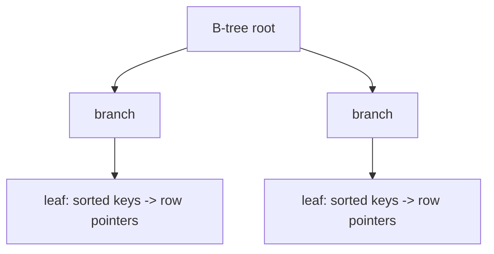
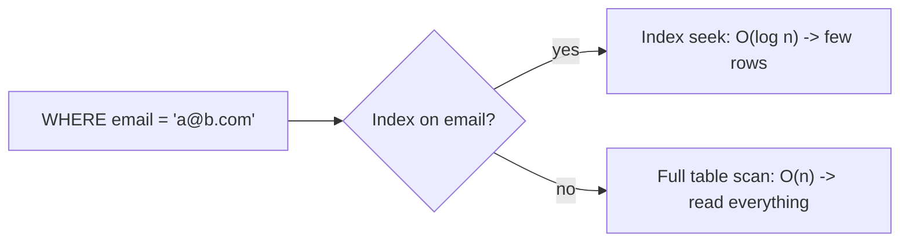
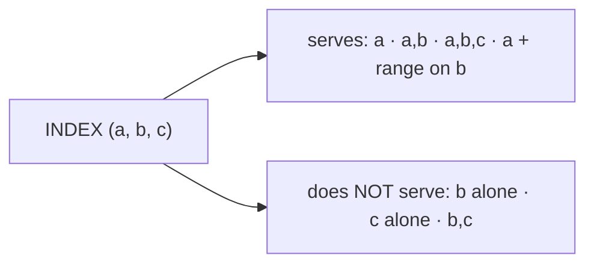
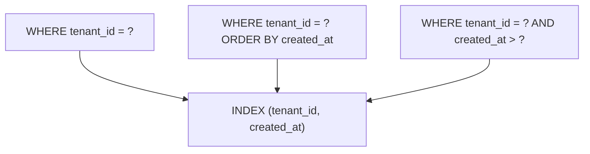
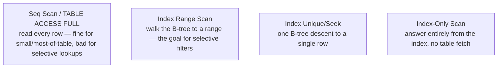
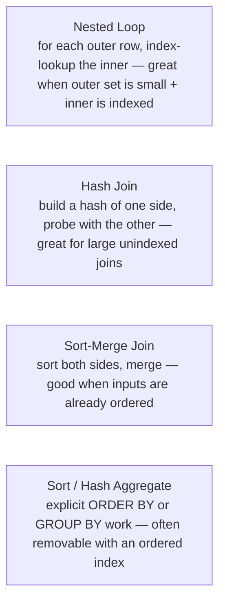

# SQL Performance and Indexing - Complete Professional Guide

> **Category:** 05_databases · **Language:** English

---

### How indexes work and how to read what the database is doing
**Original guide written from first principles, current to 2026**

> **Original reference book (English).** This is an **independent, originally written** guide. It is not an extract, summary, or paraphrase of any third-party book; it teaches SQL performance from first principles with original examples. Canonical books are listed under **References** as pointers only. Each chapter follows the TO-BRAIN editorial standard (see `FILE_CONVENTIONS.md`).
>
> **Scope notice:** most SQL performance problems are **indexing** problems, and most are diagnosed by reading the **execution plan**. This guide explains how B-tree indexes work, the rules for designing them (including composite-column order), and how to read a plan — current to 2026 engines (PostgreSQL/MySQL).

---

## How to read this guide

| Level | Profile | Parts |
|-------|---------|-------|
| 1 — Beginner | New to indexing | Part I |
| 2 — Intermediate | Designing indexes | Part II |

**Target audience:** application developers who write queries and need them to be fast.

**Structure of each chapter:** Introduction · Business context · Theoretical concepts · Architecture · Diagrams (Mermaid) · Real examples · Step by step · Complete examples · Exercises · Challenges · Checklist · Best practices · Anti-patterns · Troubleshooting · References.

> **Note on prerequisites.** Assumes basic SQL and WHERE/ORDER BY.

---

## Table of Contents

**Part I – Indexes**
1. How a B-tree index works
2. Composite indexes and column order

**Part II – Diagnosis**
3. Reading the execution plan

> **Status of this guide:** complete. **Ready:** Part I (Ch. 1–2), Part II (Ch. 3).

---

## Part I – Indexes

An index is a separate, sorted data structure that lets the database find rows without scanning the whole table — like a book's index versus reading every page. Understanding how indexes work, and designing them for your real queries, is the single highest-leverage database performance skill.

---

## Chapter 1 — How a B-tree index works

### 1.1 Introduction

The default index type is the **B-tree** (balanced tree): a sorted, multi-level structure that lets the database locate a value in logarithmic time. Because it keeps entries **sorted**, a B-tree accelerates equality lookups (`= x`), range scans (`BETWEEN`, `<`, `>`), and ordered reads (`ORDER BY`) on the indexed column(s).

### 1.2 Business context

A missing or wrong index is the most common cause of a query that's fast on test data and unusably slow in production — performance that silently degrades as the table grows. Understanding indexes lets developers prevent these problems at design time rather than firefighting them after an outage. Indexes are also a trade-off (they speed reads but slow writes and use space), so knowing how they work is needed to choose well.

### 1.3 Theoretical concepts: sorted lookup



The B-tree's branches narrow the search at each level; leaves hold the sorted keys pointing to rows. Logarithmic depth means even a billion-row table is a handful of steps deep. Because keys are sorted, the index serves three things: **point lookups**, **range scans**, and **sorted order** — the basis of every indexing decision.

### 1.4 Architecture: index vs table scan



With an index the engine seeks straight to matching rows; without one it scans the whole table. On large tables that's the difference between milliseconds and seconds.

### 1.5 Real example

**Scenario.** Users are looked up by email at login.

**Problem.** No index on `email`; every login scans the whole `users` table — fine at 1k rows, terrible at 10M.

**Solution.** Add a B-tree index (and a uniqueness constraint, which creates one).

**Implementation.**

```sql
-- creates a B-tree index AND enforces uniqueness
ALTER TABLE users ADD CONSTRAINT users_email_unique UNIQUE (email);

-- now this is an index seek, not a full scan
SELECT id, password_hash FROM users WHERE email = :email;
```

**Result.** Login lookups go from O(n) scans to O(log n) seeks; latency stays flat as the table grows.

**Future improvements.** Verify with the execution plan (Chapter 3) that the index is actually used.

### 1.6 Exercises

1. Why does a sorted B-tree help equality, range, and ORDER BY?
2. What's the cost trade-off of adding an index?
3. What's the difference between an index seek and a table scan?

### 1.7 Challenges

- **Challenge.** Find a frequent `WHERE col = ?` query with no index on `col`. Add one and compare the execution plan and timing before/after on realistic data.

### 1.8 Checklist

- [ ] I understand B-trees serve equality, ranges, and order.
- [ ] I index columns used in frequent WHERE/JOIN/ORDER BY.
- [ ] I weigh read speed against write/space cost.
- [ ] Uniqueness constraints give me an index too.

### 1.9 Best practices

- Index the columns your hot queries filter, join, and sort on.
- Use unique constraints for natural keys (they index too).
- Don't over-index — each index taxes writes and storage.

### 1.10 Anti-patterns

- No index on frequently filtered columns.
- Indexing everything, slowing writes needlessly.
- Assuming small-data speed will hold at scale.

### 1.11 Troubleshooting

| Symptom | Likely cause | Action |
|---------|--------------|--------|
| Query fast in dev, slow in prod | Missing index, full scan at scale | Add an index on the filter column |
| Writes slowing down | Too many indexes | Remove unused ones |
| Lookup still slow with an index | Index not used (see Ch. 3) | Check the execution plan |

### 1.12 References

- M. Winand, *SQL Performance Explained* (2012) — ISBN 978-3950307825; also https://use-the-index-luke.com.
- PostgreSQL docs, "Indexes": https://www.postgresql.org/docs/current/indexes.html.

---

## Chapter 2 — Composite indexes and column order

### 2.1 Introduction

A **composite index** covers multiple columns, and the **order of those columns matters enormously**. A composite index on `(a, b)` works like a phone book sorted by last name then first name: great for "find by last name" or "last + first," useless for "find by first name alone." This leftmost-prefix rule governs composite index design.

### 2.2 Business context

Getting composite-index column order wrong is a subtle, common cause of "I added an index but it's still slow." Understanding the leftmost-prefix rule lets developers design one well-ordered index that serves several queries, instead of piling on redundant single-column indexes (which bloat writes and storage). It's the difference between a lean, effective index strategy and an expensive, ineffective one.

### 2.3 Theoretical concepts: leftmost prefix



A composite index can be used for queries that filter on a **leftmost prefix** of its columns: `(a)`, `(a, b)`, `(a, b, c)`. It cannot efficiently serve a query filtering only on `b` or `c`. Put the most **selective**, most-often-equality-filtered columns first; a column used only for ranges typically goes last.

### 2.4 Architecture: one index, many queries



A well-ordered composite index serves equality on the first column plus range/sort on the next — covering several common query shapes with one structure.

### 2.5 Real example

**Scenario.** A multi-tenant app lists a tenant's recent orders: `WHERE tenant_id = ? ORDER BY created_at DESC`.

**Problem.** Separate indexes on `tenant_id` and `created_at` don't serve the combined filter-then-sort well.

**Solution.** One composite index `(tenant_id, created_at)` — equality on tenant, ordered by date.

**Implementation.**

```sql
CREATE INDEX idx_orders_tenant_created ON orders (tenant_id, created_at DESC);

-- served efficiently: seek to tenant, read already-sorted by created_at
SELECT * FROM orders
WHERE tenant_id = :tenant
ORDER BY created_at DESC
LIMIT 20;
```

**Result.** The engine seeks to the tenant's rows already sorted by date — no separate sort step, no scan. One index serves the filter and the order.

**Future improvements.** If queries also filter by status, consider `(tenant_id, status, created_at)` — order by selectivity and usage.

### 2.6 Exercises

1. State the leftmost-prefix rule.
2. Why does `INDEX (a, b)` not help a query filtering only on `b`?
3. Where should a range-filtered column go in a composite index?

### 2.7 Challenges

- **Challenge.** Take a query with an equality filter plus an ORDER BY. Design a single composite index that serves both and verify the plan drops the sort step.

### 2.8 Checklist

- [ ] I order composite columns by selectivity and query usage.
- [ ] Equality columns come before range columns.
- [ ] I rely on the leftmost-prefix rule, not redundant indexes.
- [ ] One composite index serves multiple query shapes where possible.

### 2.9 Best practices

- Put the most selective equality columns first.
- Place a single range/sort column last.
- Prefer one well-ordered composite over many single-column indexes.

### 2.10 Anti-patterns

- Composite column order that ignores the query's filters.
- Many overlapping single-column indexes "just in case."
- A range column early, blocking use of later columns.

### 2.11 Troubleshooting

| Symptom | Likely cause | Action |
|---------|--------------|--------|
| Index added but unused | Wrong column order / not a prefix | Reorder to match the query's filters |
| Extra sort step in the plan | Order-by column not in index order | Add it after the equality column |
| Too many indexes, slow writes | Redundant single-column indexes | Consolidate into composites |

### 2.12 References

- M. Winand, *SQL Performance Explained* (2012) — ISBN 978-3950307825; also https://use-the-index-luke.com.
- MySQL docs, "Multiple-Column Indexes": https://dev.mysql.com/doc/refman/en/multiple-column-indexes.html.

---

> **End of Part I.** You can now reason about indexing: how a B-tree serves equality, range, and ordered reads, and how composite-index column order (the leftmost-prefix rule) lets one well-designed index serve several query shapes. **Part II — Diagnosis** (Chapter 3) teaches reading the execution plan (EXPLAIN) so you can see whether your indexes are actually used, spot full scans and missing-index sorts, and verify a fix.

---

## Part II – Diagnosis

Part I taught how indexes *should* work. Part II teaches how to *check*. The execution plan is the database telling you, in its own words, how it ran your query — which index it used (or ignored), how it joined tables, and where it spent the time. Reading it turns performance work from guessing into measuring.

---

## Chapter 3 — Reading the execution plan

### 3.1 Introduction

The **execution plan** is the optimizer's chosen recipe for a query: the order of operations, the access method for each table, and the estimated (or, with `ANALYZE`, the actual) row counts and cost. You obtain it with `EXPLAIN` (and `EXPLAIN ANALYZE` to run the query and report real timings). Reading it is the single most useful database performance skill: it ends the guessing. Instead of "I added an index, is it faster?", you *see* whether the plan now uses an **index scan** instead of a **full table scan**, and whether a costly **sort** disappeared. Without the plan, indexing is superstition; with it, it is engineering.

### 3.2 Business context

Most "the database is slow" tickets are one query doing a full scan or a needless sort that an index would remove. The execution plan is how you find *which* query and *why*, before touching anything. It also prevents the opposite waste: adding indexes the optimizer never uses. Teams that read plans fix the actual bottleneck and prove the gain with a before/after; teams that don't ship speculative indexes that bloat writes without helping reads.

### 3.3 Theoretical concepts: access methods in the plan



The first thing to read in a plan is the **access method** per table:

- **Full table scan** (`Seq Scan`, `TABLE ACCESS FULL`) — reads every row. Correct when the query needs most of the table; a red flag when it needs a few rows from a big table.
- **Index range scan** — descends the B-tree and walks a contiguous range. This is what a selective `WHERE` should produce.
- **Index unique scan / seek** — one descent to a single row (typically a primary-key lookup).
- **Index-only scan** — the index alone has every column the query needs, so the table is never touched (a covering index; Part I, leftmost-prefix economics).

A selective query showing a full scan is the classic "missing or unused index" signal.

### 3.4 Architecture: joins and sorts in the plan



Beyond single-table access, two plan elements drive most cost:

- **Join algorithm.** A **nested loop** is ideal when the outer input is small and the inner table is indexed on the join key — but catastrophic (O(n×m)) when the outer set is large and the inner lookup is a scan. A **hash join** suits large, unindexed joins; a **sort-merge join** suits inputs already sorted. When a nested loop over a big input shows up, the fix is usually an index on the inner join column.
- **Sort.** An explicit `Sort` step for `ORDER BY` or `GROUP BY` is work the database could often skip if an index already delivered rows in that order (Part I). Seeing a large sort that spills to disk is a direct pointer to a missing ordered index.

`EXPLAIN ANALYZE` adds the decisive column: **estimated vs actual rows**. A wild mismatch means the optimizer's statistics are stale — it chose a bad plan from bad estimates, and the fix is to refresh statistics, not to add an index.

### 3.5 Real example

**Scenario.** A report query filtering `orders` by `customer_id` and sorting by `order_date` takes seconds on a large table.

**Problem.** `EXPLAIN ANALYZE` shows a `Seq Scan` on `orders` plus a large `Sort` that spills to disk — no index serves the filter, and none provides the order.

**Solution.** A composite index on `(customer_id, order_date)` serves the equality filter *and* returns rows already ordered, removing both the scan and the sort.

**Implementation (read the plan, fix, re-read).**

```sql
-- before
EXPLAIN ANALYZE
SELECT * FROM orders WHERE customer_id = 42 ORDER BY order_date;
--   Sort  (actual rows=1200 ...)            <- explicit sort, spills to disk
--     ->  Seq Scan on orders                <- full scan, filter applied after read

CREATE INDEX idx_orders_cust_date ON orders (customer_id, order_date);

-- after
EXPLAIN ANALYZE
SELECT * FROM orders WHERE customer_id = 42 ORDER BY order_date;
--   Index Scan using idx_orders_cust_date   <- range scan on the filter,
--                                               rows already ordered: NO sort step
```

**Result.** The plan switches from `Seq Scan + Sort` to a single `Index Scan`; the sort is gone because the index supplies the order. The before/after plan is the proof the fix worked — not a stopwatch hunch.

**Future improvements.** If the query selects only a few columns, extend the index to cover them for an **index-only scan**, eliminating the table fetch entirely.

### 3.6 Exercises

1. What does a `Seq Scan` on a large table under a selective `WHERE` usually indicate?
2. When is a nested-loop join the right choice, and when is it a disaster?
3. In `EXPLAIN ANALYZE`, what does a large gap between estimated and actual rows tell you, and what's the fix?

### 3.7 Challenges

- **Challenge.** Take your slowest query. Capture its `EXPLAIN ANALYZE`, identify the single most expensive operation (scan, join, or sort), apply one targeted index, and capture the plan again. Quantify the improvement from the two plans.

### 3.8 Checklist

- [ ] I can read the access method (full scan vs index scan) for each table.
- [ ] I recognize nested-loop, hash, and sort-merge joins and when each is appropriate.
- [ ] I spot an explicit sort that an ordered index would remove.
- [ ] I use `EXPLAIN ANALYZE` and compare estimated vs actual rows.
- [ ] I prove every fix with a before/after plan, not a guess.

### 3.9 Best practices

- Always confirm a new index is used by re-reading the plan — don't assume.
- Use `EXPLAIN ANALYZE` to get real timings and row counts, not just estimates.
- When estimates are wildly off, refresh table statistics before adding indexes.
- Keep the plan and timing as before/after evidence for the change.

### 3.10 Anti-patterns

- Adding indexes without reading the plan to see if the optimizer uses them.
- Ignoring a large `Sort` step that an ordered index would eliminate.
- Reading only estimated cost and never running `ANALYZE` for actual rows.
- Blaming the query when stale statistics caused a bad plan.

### 3.11 Troubleshooting

| Symptom | Likely cause | Action |
|---------|--------------|--------|
| `Seq Scan` on a big table for a selective filter | Missing or unusable index | Add an index matching the `WHERE` (and order) |
| Query slow despite an index existing | Optimizer ignores it (low selectivity / function on column) | Check selectivity; avoid wrapping the column in a function |
| Large `Sort` spilling to disk | No index provides the required order | Add an ordered/composite index covering `ORDER BY` |
| Estimated rows far from actual | Stale statistics → bad plan | Refresh statistics (`ANALYZE`); then re-check the plan |

### 3.12 References

- M. Winand, *SQL Performance Explained* (2012), Appendix A "Execution Plans" (Oracle, PostgreSQL, SQL Server, MySQL) and Chapter 4 "The Join Operation" — ISBN 978-3950307825; also https://use-the-index-luke.com.
- PostgreSQL docs, "Using EXPLAIN": https://www.postgresql.org/docs/current/using-explain.html.

---

> **End of guide.** You can now reason about SQL performance end to end: how a **B-tree index** and **composite-column order** serve equality, range, and ordered reads (Part I), and how to **read the execution plan** to verify it (Part II) — spotting full scans, recognizing join algorithms, eliminating needless sorts, and trusting estimated-vs-actual rows over hunches. The discipline is the same throughout: design the index for the access pattern, then read the plan to prove the database actually uses it.
