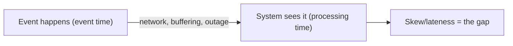
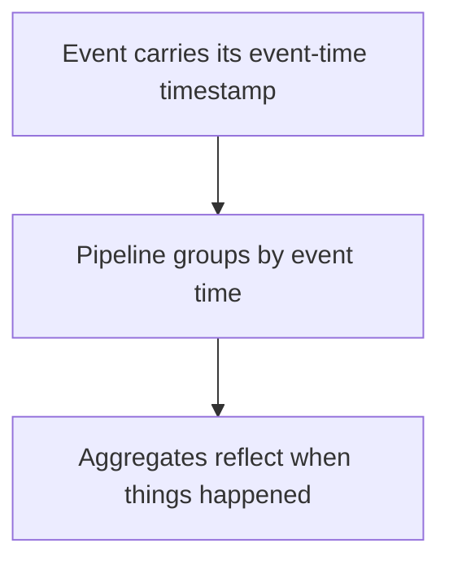
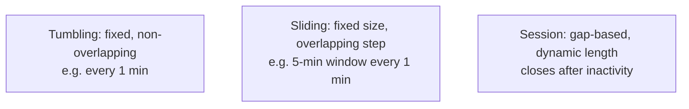
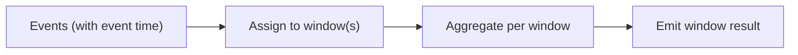
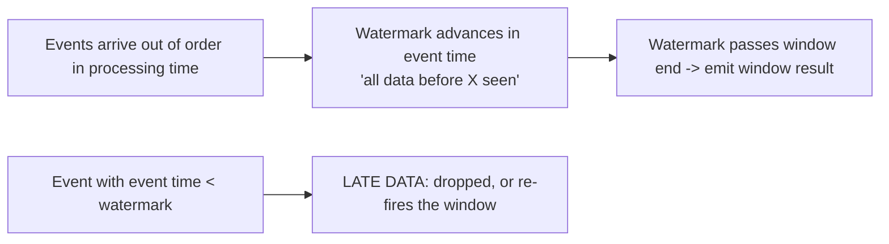
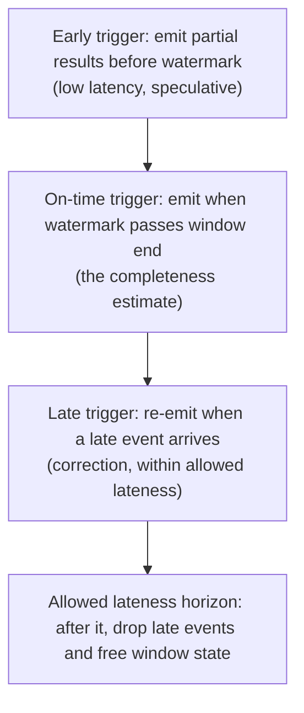

# Stream Processing - Complete Professional Guide

> **Category:** 05_databases · **Language:** English

---

### Event time, windowing, and watermarks for unbounded data
**Original guide written from first principles, current to 2026**

> **Original reference book (English).** This is an **independent, originally written** guide. It is not an extract, summary, or paraphrase of any third-party book; it teaches stream processing from first principles with original examples. Canonical books are listed under **References** as pointers only. Each chapter follows the TO-BRAIN editorial standard (see `FILE_CONVENTIONS.md`).
>
> **Scope notice:** stream processing handles **unbounded, continuously-arriving** data, where the hard problems are time and completeness. This guide covers event time vs processing time, windowing, and watermarks — the core ideas behind 2026 streaming engines (Flink, Kafka Streams, Beam).

---

## How to read this guide

| Level | Profile | Parts |
|-------|---------|-------|
| 1 — Beginner | New to streaming | Part I |
| 2 — Intermediate | Designing pipelines | Part II |

**Target audience:** data and backend engineers building real-time pipelines and analytics.

**Structure of each chapter:** Introduction · Business context · Theoretical concepts · Architecture · Diagrams (Mermaid) · Real examples · Step by step · Complete examples · Exercises · Challenges · Checklist · Best practices · Anti-patterns · Troubleshooting · References.

> **Note on prerequisites.** Assumes the messaging and data-intensive-systems guides.

---

## Table of Contents

**Part I – Time and windows**
1. Event time vs processing time
2. Windowing unbounded streams

**Part II – Completeness**
3. Watermarks and handling late data

> **Status of this guide:** complete. **Ready:** Part I (Ch. 1–2), Part II (Ch. 3).

---

## Part I – Time and windows

Batch processing has a luxury streams don't: a finite, complete dataset. A stream is **unbounded** — data keeps arriving, out of order, possibly delayed. The central challenges become "*which* time do we mean?" and "how do we compute aggregates over something that never ends?" Getting time and windows right is most of stream processing.

---

## Chapter 1 — Event time vs processing time

### 1.1 Introduction

Two clocks matter in streaming. **Event time** is when something actually happened (the timestamp on the event). **Processing time** is when your system observes it. They differ — sometimes by a lot — because of network delays, buffering, and outages. Choosing the right one is the most consequential decision in a streaming pipeline, because results computed on the wrong clock are subtly wrong.

### 1.2 Business context

Computing on processing time is easy but gives wrong answers when data is delayed: a sensor outage that later flushes an hour of readings would all be attributed to "now," corrupting any time-based metric. Event-time processing produces **correct** results that reflect when things truly happened, regardless of arrival delays — essential for billing, analytics, and anything where temporal accuracy matters. The trade-off is added complexity (handling lateness), which the rest of the guide addresses.

### 1.3 Theoretical concepts: two clocks, a gap



The **skew** between event time and processing time is variable and unbounded in the worst case (a phone offline for hours). Processing-time logic is simple but conflates "when it happened" with "when we saw it." Event-time logic is correct but must decide how long to wait for stragglers (watermarks, Chapter 3).

### 1.4 Architecture: timestamp travels with the event



Correct streaming requires the **event's own timestamp** to flow through the pipeline, so windows and aggregations are assigned by when the event occurred, not when it arrived.

### 1.5 Real example

**Scenario.** Count rides per hour for a ride-hailing app; some phones report minutes late.

**Problem.** Processing-time counting puts late 2:59pm rides into the 3pm hour — both hours are wrong.

**Solution.** Assign each ride to an hour by its **event-time** timestamp, regardless of arrival.

**Implementation (assign by event time).**

```text
ride event: { id, rider, eventTime: "14:59:30", ... }
window assignment: floor(eventTime to hour) -> 14:00 bucket
# a ride observed at 15:02 but with eventTime 14:59 still counts in the 14:00 hour
```

**Result.** Each hour's count reflects rides that actually happened in that hour, even when reported late — correct metrics instead of arrival-skewed ones.

**Future improvements.** Define how long to keep an hour "open" for late rides via a watermark (Chapter 3).

### 1.6 Exercises

1. Define event time and processing time.
2. Why can processing-time results be wrong?
3. What must travel with an event to enable event-time processing?

### 1.7 Challenges

- **Challenge.** Take a time-bucketed metric in a system you know. Would late data distort it under processing time? Re-specify it in event-time terms.

### 1.8 Checklist

- [ ] I distinguish event time from processing time.
- [ ] Events carry their own timestamps.
- [ ] Time-based aggregates use event time.
- [ ] I expect and plan for event/processing skew.

### 1.9 Best practices

- Use event time for any temporally-meaningful metric.
- Propagate event timestamps end to end.
- Treat skew as variable and possibly large.

### 1.10 Anti-patterns

- Bucketing by processing time for metrics that must be temporally accurate.
- Dropping or ignoring event timestamps in the pipeline.
- Assuming data arrives in order and on time.

### 1.11 Troubleshooting

| Symptom | Likely cause | Action |
|---------|--------------|--------|
| Metrics spike when delayed data arrives | Processing-time bucketing | Switch to event time |
| Counts disagree with reality after outages | Arrival skew | Assign by event time |
| Can't do event time | Timestamps not propagated | Carry event time through the pipeline |

### 1.12 References

- T. Akidau, S. Chernyak, R. Lax, *Streaming Systems* (O'Reilly, 2018), Chapter 1 "Streaming 101" — ISBN 978-1491983874.
- Apache Flink docs, "Event Time": https://nightlies.apache.org/flink/flink-docs-stable/docs/concepts/time/.

---

## Chapter 2 — Windowing unbounded streams

### 2.1 Introduction

You can't "sum a stream" — it never ends. **Windowing** slices an unbounded stream into finite chunks you *can* aggregate: per-minute counts, per-session totals. The window type — **tumbling**, **sliding**, or **session** — encodes how you carve time, and choosing it correctly is how an endless stream yields meaningful, bounded results.

### 2.2 Business context

Windowing is what turns a firehose of events into the metrics a business actually uses: requests per minute, revenue per hour, activity per user session. The window choice directly shapes the meaning of the result — tumbling for non-overlapping reporting periods, sliding for smoothed moving metrics, session for user-activity bursts. Picking the wrong window produces technically-correct numbers that answer the wrong question.

### 2.3 Theoretical concepts: three window types



- **Tumbling**: contiguous, non-overlapping fixed windows — each event in exactly one (per-minute counts).
- **Sliding**: fixed-size windows that overlap by a smaller step — moving averages, "last 5 minutes, updated each minute."
- **Session**: dynamic windows defined by **gaps of inactivity** — group a user's burst of activity, close it after N minutes idle.

### 2.4 Architecture: events fall into windows by event time



Each event is placed into one or more windows by its event time; when a window is considered complete (Chapter 3's watermarks), its aggregate is emitted.

### 2.5 Real example

**Scenario.** Measure user engagement as activity bursts separated by idle gaps.

**Problem.** Fixed (tumbling) windows split one continuous session across boundaries or merge separate sessions.

**Solution.** A **session window** with a 30-minute inactivity gap.

**Implementation (session windowing sketch).**

```text
session window: gap = 30 min
  events for user U at 10:00, 10:05, 10:20  -> one session [10:00–10:20]
  next event at 11:00 (>30 min gap)         -> new session starts
result: per-session duration & event count, matching real engagement bursts
```

**Result.** Each session reflects a real burst of activity, dynamically sized — something no fixed window could capture.

**Future improvements.** Tune the gap to the product's behavior; combine with event-time correctness for late events.

### 2.6 Exercises

1. Why can't you aggregate an unbounded stream without windows?
2. Contrast tumbling, sliding, and session windows.
3. Give a metric best served by each window type.

### 2.7 Challenges

- **Challenge.** For a real-time metric you want, choose a window type and parameters. Justify why that window matches the question being asked.

### 2.8 Checklist

- [ ] I window streams to get bounded aggregates.
- [ ] I choose the window type to match the question.
- [ ] Windows are assigned by event time.
- [ ] Session gaps reflect real behavior where used.

### 2.9 Best practices

- Match window type to the metric's meaning.
- Assign windows by event time, not arrival.
- Tune session gaps and slide steps to the domain.

### 2.10 Anti-patterns

- Tumbling windows for activity that spans boundaries (use sessions).
- Sliding windows so granular they overwhelm the system.
- Windowing by processing time, distorting results.

### 2.11 Troubleshooting

| Symptom | Likely cause | Action |
|---------|--------------|--------|
| Sessions split or merged wrongly | Fixed windows for burst activity | Use session windows |
| Moving metric too jumpy | Tumbling instead of sliding | Use sliding windows |
| Window results skewed by lateness | Processing-time windows | Window by event time |

### 2.12 References

- T. Akidau, S. Chernyak, R. Lax, *Streaming Systems* (O'Reilly, 2018), Chapter 2 "The What, Where, When, and How of Data Processing" — ISBN 978-1491983874.
- Apache Beam docs, "Windowing": https://beam.apache.org/documentation/programming-guide/#windowing.

---

> **End of Part I.** You can now handle the core challenges of unbounded data: distinguish event time (when it happened) from processing time (when you saw it) and compute on event time for correctness, and carve streams into tumbling, sliding, or session windows matched to the question. **Part II — Completeness** (Chapter 3) covers watermarks — how a streaming system decides a window is "complete enough" to emit — and strategies for handling data that arrives late.

---

## Part II – Completeness

Part I established *when* an event happened (event time) and *how* to group events (windows). But a stream never ends, so a window covering event-time `[12:00, 12:05)` can never be sure no more `12:03` events are coming. Part II answers the question that makes streaming usable: *when is a window complete enough to emit a result* — and what to do when an event shows up after you already answered.

---

## Chapter 3 — Watermarks and handling late data

### 3.1 Introduction

A **watermark** is the streaming system's notion of **input completeness in event time**: a watermark of time `X` asserts "all events with event time before `X` have (probably) been observed." It is the answer to *when can I emit a window's result?* — when the watermark passes the window's end, the system believes the window is complete and fires. Because real pipelines reorder and delay events, the watermark is an estimate, not a guarantee: some events still arrive **late**, after the watermark has passed their window. The whole discipline of Part II is managing this tension — emitting timely results without permanently losing the stragglers.

### 3.2 Business context

Streaming exists to produce answers *before* the data is complete — a dashboard that updates now, not tomorrow. The watermark is the knob that trades **latency against correctness**: emit eagerly (aggressive watermark) and risk missing late events; wait longer (conservative watermark) and the result is more complete but more delayed. Every streaming product makes this trade, explicitly or by accident. Knowing watermarks lets a team set that trade deliberately — "the 5-minute count can be 2 seconds late but must eventually be exact" — instead of discovering at 2 a.m. that late mobile events were silently dropped from yesterday's revenue.

### 3.3 Theoretical concepts: the watermark as a progress metric



A watermark is a monotonically advancing **event-time** value flowing through the pipeline. Two kinds:

- **Perfect watermark** — possible only when you know the source is fully ordered/complete; once it passes `X`, no event before `X` can ever arrive. Rare in practice.
- **Heuristic watermark** — an *estimate* (from observed lag, source metadata, partition timestamps) of how far event time has progressed. Practical, but fallible: events can arrive *behind* it. These are the late events.

The watermark answers "is the window complete?"; a separate mechanism, the **trigger**, answers "when do I actually materialize output?" — at the watermark (completeness), and/or early (periodic, before the watermark) and late (on each straggler, after it).

### 3.4 Architecture: triggers and late-data strategies



Because a heuristic watermark is wrong sometimes, robust pipelines emit a window **more than once**:

1. **Early** firings give a fast, speculative answer before the watermark arrives.
2. The **on-time** firing at the watermark is the "complete enough" result.
3. **Late** firings re-emit a corrected result each time a straggler lands — *as long as it falls within the configured **allowed lateness***.

**Allowed lateness** is the crucial bound: the window's state must be kept in memory to incorporate late events, so it cannot be kept forever. After the lateness horizon, the system **drops** further late events and garbage-collects the window. Setting allowed lateness is therefore an explicit decision about how late an event can be and still count — and how much state you are willing to retain to honor that.

### 3.5 Real example

**Scenario.** A mobile app emits usage events; a pipeline counts events per 1-minute event-time window for a live dashboard. Phones go offline and flush buffered events minutes later.

**Problem.** A pure on-time-only trigger emits each minute's count when the watermark passes — but events buffered on offline phones arrive *after* that, so the dashboard permanently undercounts active usage.

**Solution.** Combine an on-time firing (timely number) with **late firings** within an **allowed lateness** window (e.g. 10 minutes), so each straggler corrects the count; events later than 10 minutes are dropped deliberately and counted in a "dropped-late" metric.

**Implementation (trigger + allowed lateness, Beam-style pseudocode).**

```text
window: fixed 1-minute event-time windows
trigger:
  - on-time: fire when watermark passes window end        -> timely count
  - late:    fire on every element after the watermark    -> corrected count
allowed_lateness: 10 minutes   -> keep window state 10 min past the watermark
after allowed_lateness: drop element, increment dropped_late_events counter
```

**Result.** The dashboard shows a fast on-time count that then self-corrects as offline phones reconnect, converging to an accurate value within the 10-minute horizon. Events later than that are dropped *visibly* (a metric), not silently — the team can widen lateness if the dropped count is too high.

**Future improvements.** Tune the watermark heuristic from observed source lag; alert when `dropped_late_events` rises (a sign the lateness horizon is too tight or a source is misbehaving).

### 3.6 Exercises

1. In one sentence, what does a watermark of value `X` assert?
2. Why is a heuristic watermark fallible, and what are the events that "prove" it wrong called?
3. What does **allowed lateness** bound, and why can't it be infinite?

### 3.7 Challenges

- **Challenge.** For a windowed metric you compute, decide its latency/correctness trade: how late can an event be and still count? Express that as an allowed-lateness value and a trigger (early/on-time/late) configuration, and define a metric for events dropped past the horizon.

### 3.8 Checklist

- [ ] I understand a watermark estimates input completeness in event time.
- [ ] I distinguish a perfect from a heuristic (fallible) watermark.
- [ ] I separate "is the window complete?" (watermark) from "when do I emit?" (trigger).
- [ ] I configure allowed lateness deliberately and bound window state with it.
- [ ] I track dropped-late events rather than losing them silently.

### 3.9 Best practices

- Treat the watermark as the explicit latency-vs-correctness knob and set it on purpose.
- Use early/on-time/late triggers to emit fast and then self-correct.
- Choose allowed lateness from real source-lag data, not a guess.
- Emit a metric for events dropped past the lateness horizon.

### 3.10 Anti-patterns

- On-time-only triggers on sources with real late data — silent undercounting.
- Unbounded allowed lateness — window state grows without limit.
- Dropping late events with no visibility (no metric, no alert).
- Assuming the watermark is exact and never auditing late arrivals.

### 3.11 Troubleshooting

| Symptom | Likely cause | Action |
|---------|--------------|--------|
| Counts permanently lower than batch truth | Late events dropped (on-time-only trigger) | Add late firings + allowed lateness |
| Streaming job memory grows over time | Allowed lateness too large / unbounded window state | Bound lateness; tune state retention |
| Results too delayed for the dashboard | Watermark too conservative | Add early triggers; tune watermark heuristic |
| Spike in dropped-late events | Lateness horizon too tight or a lagging source | Widen lateness or fix the source; investigate lag |

### 3.12 References

- T. Akidau, S. Chernyak, R. Lax, *Streaming Systems* (O'Reilly, 2018), Chapter 3 "Watermarks" (and Chapter 2 on triggers and late data) — ISBN 978-1491983874.
- Apache Beam docs, "Watermarks and late data": https://beam.apache.org/documentation/basics/#watermarks.

---

> **End of guide.** You can now reason about stream processing end to end: compute on **event time** and carve unbounded data into **windows** (Part I), then use **watermarks** to estimate window completeness and **triggers + allowed lateness** to emit timely results that self-correct as late data arrives (Part II). The constant theme is that a stream is never "done" — so every result is a deliberate point on the latency-versus-correctness curve, and good streaming makes that choice explicit rather than accidental.
