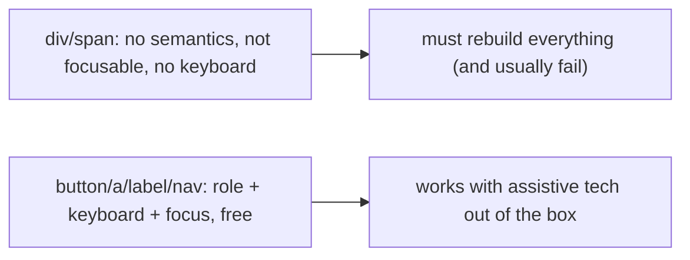
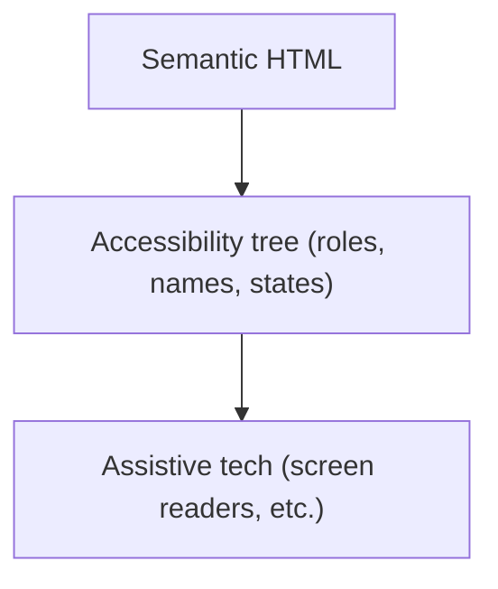
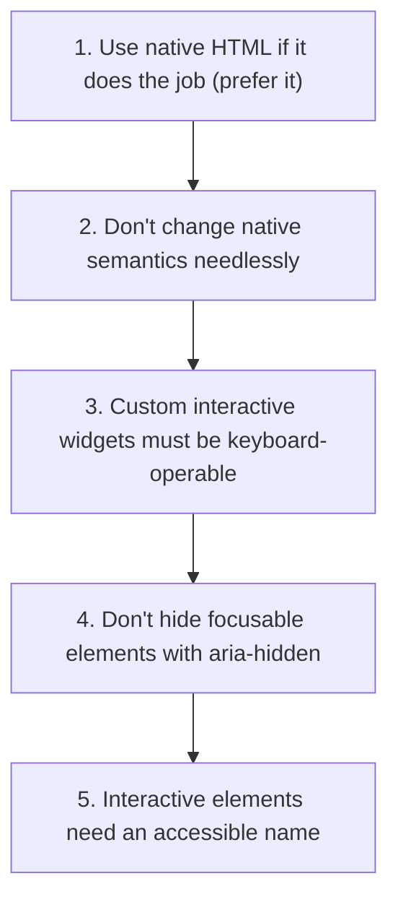
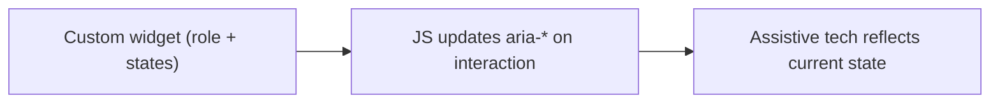
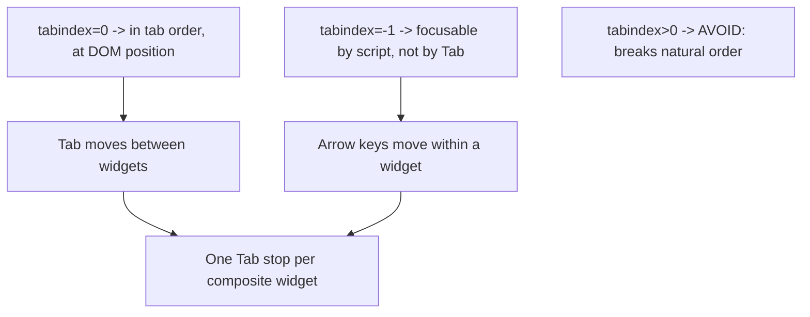
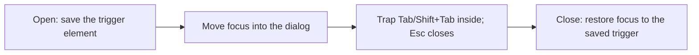

# Accessible Web Components - Complete Professional Guide

> **Category:** 06_web_and_frontend · **Language:** English

---

### Semantic HTML, ARIA, and keyboard support for everyone
**Original guide written from first principles, current to 2026**

> **Original reference book (English).** This is an **independent, originally written** guide. It is not an extract, summary, or paraphrase of any third-party book; it teaches accessible component building from first principles with original examples. Canonical books are listed under **References** as pointers only. Each chapter follows the TO-BRAIN editorial standard (see `FILE_CONVENTIONS.md`).
>
> **Scope notice:** accessibility (a11y) means people with disabilities can use your interface — via keyboard, screen reader, or other assistive tech. This guide covers semantic HTML, when (and when not) to use ARIA, and keyboard support, current to 2026 (WCAG 2.2).

---

## How to read this guide

| Level | Profile | Parts |
|-------|---------|-------|
| 1 — Beginner | New to a11y | Part I |
| 2 — Intermediate | Building components | Part II |

**Target audience:** frontend developers building interactive components that everyone can use.

**Structure of each chapter:** Introduction · Business context · Theoretical concepts · Architecture · Diagrams (Mermaid) · Real examples · Step by step · Complete examples · Exercises · Challenges · Checklist · Best practices · Anti-patterns · Troubleshooting · References.

> **Note on prerequisites.** Assumes HTML/CSS/JS and the CSS-layout guide.

---

## Table of Contents

**Part I – Foundations**
1. Semantic HTML first
2. ARIA: the rules and when to use it

**Part II – Interaction**
3. Keyboard support and focus management

> **Status of this guide:** complete. **Ready:** Part I (Ch. 1–2) and Part II (Ch. 3).

---

## Part I – Foundations

The biggest accessibility wins come not from special tools but from using the **right HTML elements**. A real `<button>`, `<a>`, `<label>`, and `<nav>` come with keyboard support, screen-reader semantics, and focus behavior for free. Most a11y failures are caused by reinventing these with `<div>`s. Build on semantics first; reach for ARIA only to fill gaps.

---

## Chapter 1 — Semantic HTML first

### 1.1 Introduction

**Semantic HTML** means using elements for their meaning: `<button>` for actions, `<a>` for navigation, `<h1>`–`<h6>` for structure, `<label>` for form fields, `<nav>`/`<main>`/`<header>` for landmarks. These elements carry built-in **roles**, keyboard behavior, and focusability that assistive technology understands. Using them correctly is 80% of accessibility, for free.

### 1.2 Business context

Accessibility is both an ethical and legal requirement (WCAG/ADA/EN 301 549) and a market reach issue — a significant share of users rely on assistive tech, and accessible sites also rank and convert better. Most accessibility lawsuits and failures stem from non-semantic markup (clickable `<div>`s, missing labels). Using semantic HTML prevents the bulk of these problems at no extra cost, while custom `<div>` widgets create expensive, ongoing remediation.

### 1.3 Theoretical concepts: elements carry semantics



A native `<button>` is focusable, activates on Enter/Space, and announces as "button" to a screen reader — automatically. A `<div onclick>` has none of that. The rule: **use the element that means what you intend**; only style it, don't replace it.

### 1.4 Architecture: semantics → accessibility tree



The browser builds an **accessibility tree** from your HTML; assistive tech reads it. Semantic elements populate it correctly; generic `<div>`s leave it empty of meaning.

### 1.5 Real example

**Scenario.** A custom "button" built as a styled `<div>`.

**Problem.** It's not focusable, doesn't respond to keyboard, and a screen reader doesn't announce it as a button — unusable for many.

**Solution.** Use a real `<button>` and style it.

**Implementation.**

```html
<!-- INACCESSIBLE: no focus, no keyboard, no role -->
<div class="btn" onclick="submit()">Submit</div>

<!-- ACCESSIBLE: focusable, Enter/Space work, announced as a button -->
<button type="button" class="btn" onclick="submit()">Submit</button>
```

**Result.** The native button is keyboard-operable, focusable, and announced correctly — accessible by default, with the same styling. A whole class of users regains access.

**Future improvements.** Audit the app for other `<div onclick>` controls and replace them with semantic elements.

### 1.6 Exercises

1. Name four semantic elements and the behavior each provides for free.
2. What does a screen reader read — the HTML or the accessibility tree?
3. Why is a `<div onclick>` button inaccessible?

### 1.7 Challenges

- **Challenge.** Find a `<div>`/`<span>` acting as a control in your app. Replace it with the correct semantic element and test with keyboard only.

### 1.8 Checklist

- [ ] I use elements for their meaning.
- [ ] Actions are `<button>`, navigation is `<a>`.
- [ ] Form fields have associated `<label>`s.
- [ ] Landmarks (`nav`/`main`/`header`) structure the page.

### 1.9 Best practices

- Default to semantic HTML; style it rather than rebuild it.
- Associate every input with a label.
- Use headings and landmarks for structure.

### 1.10 Anti-patterns

- Clickable `<div>`/`<span>` controls.
- Skipping or visually-hiding labels with no accessible name.
- Using headings for size instead of structure.

### 1.11 Troubleshooting

| Symptom | Likely cause | Action |
|---------|--------------|--------|
| Control unreachable by keyboard | Non-semantic element | Use `<button>`/`<a>` |
| Screen reader says nothing useful | Empty accessibility tree | Use semantic HTML/labels |
| Form fields unlabeled | Missing `<label>` association | Associate labels with inputs |

### 1.12 References

- H. Pickering, *Inclusive Components* (2018) — https://inclusive-components.design.
- W3C, "WCAG 2.2": https://www.w3.org/TR/WCAG22/; MDN ARIA: https://developer.mozilla.org/en-US/docs/Web/Accessibility/ARIA.

---

## Chapter 2 — ARIA: rules and when to use it

### 2.1 Introduction

**WAI-ARIA** adds roles, states, and properties to HTML to describe custom widgets to assistive tech (e.g. `role="tablist"`, `aria-expanded`, `aria-label`). It's powerful but easy to misuse. The most important guidance is the **first rule of ARIA**: *don't use ARIA if a native HTML element already does the job*. ARIA fills gaps; it doesn't replace semantics.

### 2.2 Business context

Misused ARIA actively breaks accessibility — incorrect roles or unmanaged states confuse assistive tech worse than no ARIA at all ("bad ARIA is worse than no ARIA"). Knowing the rules lets teams build the custom widgets they genuinely need (complex menus, tabs, comboboxes) correctly, while not sprinkling ARIA on things HTML already handles. This avoids both inaccessible widgets and self-inflicted regressions.

### 2.3 Theoretical concepts: the rules of ARIA



ARIA provides three things: **roles** (what it is), **states/properties** (`aria-expanded`, `aria-checked`, `aria-label`), and a way to relate elements (`aria-describedby`). You must keep states **in sync** with reality via JS — a `role="checkbox"` whose `aria-checked` never updates is broken.

### 2.4 Architecture: ARIA describes, JS keeps it true



### 2.5 Real example

**Scenario.** A custom collapsible section (accordion) built with divs.

**Problem.** Screen-reader users can't tell it's expandable or whether it's open.

**Solution.** Use a real `<button>` for the trigger and `aria-expanded` reflecting state — minimal, correct ARIA on a semantic base.

**Implementation.**

```html
<h3>
  <button aria-expanded="false" aria-controls="sect1" id="acc1">Shipping details</button>
</h3>
<div id="sect1" role="region" aria-labelledby="acc1" hidden>...</div>
```

```js
// keep aria-expanded in sync with reality
btn.addEventListener('click', () => {
  const open = btn.getAttribute('aria-expanded') === 'true';
  btn.setAttribute('aria-expanded', String(!open));
  panel.hidden = open;
});
```

**Result.** The trigger is a real button (keyboard + focus free); `aria-expanded` tells screen-reader users whether it's open and updates on toggle. Minimal ARIA, correct behavior.

**Future improvements.** Follow the established ARIA Authoring Practices pattern for the full widget (e.g. disclosure/accordion).

### 2.6 Exercises

1. State the first rule of ARIA.
2. Why is bad ARIA worse than none?
3. What must you keep in sync for `aria-*` states?

### 2.7 Challenges

- **Challenge.** Find a custom widget using ARIA. Check each rule: native element preferred? keyboard-operable? states synced? accessible name present? Fix one gap.

### 2.8 Checklist

- [ ] I prefer native HTML over ARIA.
- [ ] Custom widgets are keyboard-operable.
- [ ] `aria-*` states stay in sync via JS.
- [ ] Interactive elements have accessible names.

### 2.9 Best practices

- Use ARIA only to fill genuine gaps.
- Follow the ARIA Authoring Practices patterns for complex widgets.
- Keep states accurate at all times.

### 2.10 Anti-patterns

- ARIA on elements HTML already covers.
- Roles without the required keyboard behavior/states.
- `aria-hidden` over focusable content.

### 2.11 Troubleshooting

| Symptom | Likely cause | Action |
|---------|--------------|--------|
| Widget confuses screen readers | Bad/incomplete ARIA | Follow the authoring pattern; sync states |
| State not announced | aria-* not updated | Update `aria-*` on every change |
| Redundant role warnings | ARIA duplicating native semantics | Remove; use native element |

### 2.12 References

- W3C, "ARIA Authoring Practices Guide": https://www.w3.org/WAI/ARIA/apg/.
- H. Pickering, *Inclusive Components* (2018) — https://inclusive-components.design.

---

> **End of Part I.** You can now build accessible components by starting from semantic HTML (which gives roles, keyboard support, and focus for free) and adding ARIA only to fill genuine gaps — following its rules, keeping states in sync, and always providing accessible names. **Part II — Interaction** (Chapter 3) covers keyboard support and focus management for custom widgets: tab order, focus trapping in dialogs, and visible focus indicators.

---

## Part II – Interaction

Semantic HTML gives you keyboard support for free — but the moment you build a widget the platform does not provide (a custom menu, a tab interface, a modal dialog), you inherit the job the browser used to do: deciding what is focusable, what order focus moves in, what each key does, and where focus goes when things open and close. Part II is that job done correctly. Get it wrong and the component is literally unusable for anyone not holding a mouse; get it right and it works for keyboard, switch, and screen-reader users alike.

---

## Chapter 3 — Keyboard support and focus management

### 3.1 Introduction

Every interaction a mouse can do, the keyboard must be able to do too — this is a baseline requirement of WCAG, not a nice-to-have. For native elements you get it automatically: links, buttons, and form controls are focusable and respond to Enter/Space. For **custom widgets** you must supply it deliberately: make the right elements focusable, manage **tab order** with `tabindex`, implement the **keyboard interaction pattern** the widget's role implies, **trap and restore focus** around modals, and keep the **focus indicator visible**. This chapter covers those four levers and the patterns that combine them.

### 3.2 Business context

Keyboard access is the foundation that switch devices, voice control, and screen readers all build on — fix the keyboard and you fix a whole class of assistive technology at once. It is also where most "accessible-looking" components silently fail: a `<div>` styled as a button looks fine in a demo and is invisible to a keyboard user. Beyond the human cost, keyboard operability is the most-cited issue in accessibility audits and legal complaints (WCAG 2.1.1 *Keyboard*, 2.4.3 *Focus Order*, 2.4.7 *Focus Visible*). Getting it right is cheaper as a habit than as a remediation project, and it benefits everyone — power users navigate faster by keyboard than by mouse.

### 3.3 Theoretical concepts: tabindex and the roving pattern



`tabindex="0"` puts an element in the natural tab order at its DOM position; `tabindex="-1"` makes it focusable by script (`element.focus()`) but skips it during Tab. **Positive** `tabindex` values are an anti-pattern — they override DOM order and create unmaintainable focus traps. Composite widgets (menus, tab lists, grids, toolbars) use the **roving tabindex** pattern: exactly one child has `tabindex="0"` and is the single Tab stop; the rest are `tabindex="-1"`; **arrow keys** move focus between children, updating which one is the `0`. This matches the WAI-ARIA Authoring Practices: Tab moves *between* widgets, arrow keys move *within* one.

### 3.4 Architecture: focus flow through a modal dialog



A modal dialog is the canonical focus-management problem. On open, **record** the element that triggered it, then move focus to the dialog (its first control or the dialog container). While open, **trap** focus: Tab from the last control wraps to the first, Shift+Tab from the first wraps to the last, and content behind the dialog is inert (`inert` attribute or `aria-hidden`). **Esc** closes. On close, **restore** focus to the saved trigger so the user is not dumped at the top of the page. The native `<dialog>` element with `showModal()` provides trapping and inertness for free — reach for it before hand-rolling.

### 3.5 Real example

**Scenario.** A custom "actions" menu button that opens a list of options, plus a confirmation dialog for the destructive action.

**Problem.** The first version uses `<div>`s with click handlers: nothing is focusable, arrow keys do nothing, and when the dialog opens focus stays behind it — keyboard and screen-reader users cannot operate it at all.

**Solution.** A real `<button>` trigger, a roving-tabindex menu, and the native `<dialog>` for modal focus management.

**Implementation.**

```html
<button id="menuBtn" aria-haspopup="true" aria-expanded="false" aria-controls="menu">Actions</button>
<ul id="menu" role="menu" hidden>
  <li role="menuitem" tabindex="0">Rename</li>
  <li role="menuitem" tabindex="-1">Duplicate</li>
  <li role="menuitem" tabindex="-1">Delete…</li>
</ul>
<dialog id="confirm"><p>Delete this item?</p><button>Cancel</button><button>Delete</button></dialog>
```

```js
const items = [...menu.querySelectorAll('[role=menuitem]')];
menu.addEventListener('keydown', (e) => {
  const i = items.indexOf(document.activeElement);
  if (e.key === 'ArrowDown' || e.key === 'ArrowUp') {
    e.preventDefault();
    const next = (i + (e.key === 'ArrowDown' ? 1 : items.length - 1)) % items.length;
    items[i].tabIndex = -1;            // roving tabindex: move the single 0
    items[next].tabIndex = 0;
    items[next].focus();
  }
  if (e.key === 'Escape') { closeMenu(); menuBtn.focus(); }  // restore focus to trigger
});
// Native <dialog> traps focus and restores it on close automatically:
deleteItem.addEventListener('click', () => confirm.showModal());
```

**Result.** The menu is one Tab stop; arrow keys move between items; Esc returns focus to the button. The dialog traps Tab while open and restores focus to its trigger on close. The component is fully operable by keyboard, switch, and screen reader.

**Future improvements.** Add type-ahead (jump to an item by typing its first letter), Home/End to jump to first/last, and `:focus-visible` styling so the focus ring shows for keyboard but not mouse users.

### 3.6 Exercises

1. What is the difference between `tabindex="0"` and `tabindex="-1"`, and why avoid positive values?
2. Describe the roving tabindex pattern and which widgets use it.
3. What three focus steps must a modal dialog perform (open, while open, close)?

### 3.7 Challenges

- **Challenge.** Take a custom dropdown built from `<div>`s and rebuild it with a real `<button>` trigger and roving tabindex. Then replace a hand-rolled modal with the native `<dialog>` and confirm focus is trapped while open and restored to the trigger on close.

### 3.8 Checklist

- [ ] Everything operable by mouse is operable by keyboard (WCAG 2.1.1).
- [ ] Composite widgets are one Tab stop with arrow-key navigation (roving tabindex).
- [ ] No positive `tabindex` values anywhere.
- [ ] Modals trap focus, close on Esc, and restore focus to the trigger.
- [ ] A visible focus indicator is never removed without a replacement.

### 3.9 Best practices

- Start from native elements (`<button>`, `<a>`, `<dialog>`) so you inherit focus and keyboard behavior.
- Implement the keyboard pattern the role implies — follow the WAI-ARIA Authoring Practices.
- Use `:focus-visible` to show a strong ring for keyboard users without distracting mouse users.
- Save and restore focus around any overlay, menu, or dialog.

### 3.10 Anti-patterns

- `<div onclick>` "buttons" with no `tabindex` and no key handling.
- Positive `tabindex` to force an order.
- `outline: none` with no visible replacement focus style.
- Overlays that leave focus behind them or scatter it to the page top on close.

### 3.11 Troubleshooting

| Symptom | Likely cause | Action |
|---------|--------------|--------|
| Can't reach a control with Tab | Not focusable | Use a native control or add `tabindex="0"` |
| Tab visits every menu item | No roving tabindex | One `0`, rest `-1`, arrow keys move focus |
| Focus lost after closing a dialog | No restore step | Save the trigger, call `.focus()` on close |
| Focus ring invisible | `outline` removed | Restore with `:focus-visible` styling |

### 3.12 References

- W3C, "ARIA Authoring Practices Guide — Developing a Keyboard Interface": https://www.w3.org/WAI/ARIA/apg/practices/keyboard-interface/.
- H. Pickering, *Inclusive Components* (2018) — chapters on Menus & Menu Buttons, Tabbed Interfaces, and Modal dialogs. https://inclusive-components.design.
- MDN, "&lt;dialog&gt; element": https://developer.mozilla.org/en-US/docs/Web/HTML/Element/dialog.

---

> **End of guide.** You can now build accessible components end to end: start from semantic HTML for roles, names, and built-in behavior (Part I), add ARIA only to fill real gaps, and supply correct keyboard and focus management — tab order, roving tabindex, focus trapping, and visible focus — for the custom widgets the platform does not provide (Part II).
