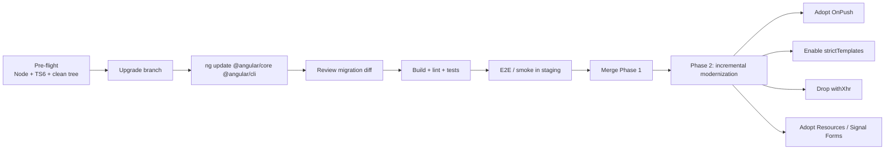

# Angular 22 - Complete Professional Guide

> **Category:** 06_web_and_frontend · **Language:** English

---

# Angular 22 — Complete Professional Guide
### What's New in v22: Signal Forms, Resources, OnPush by Default, Fetch, AI Tooling, and Migration
**Edition for Angular v22.0 (released June 3, 2026)**

> **Reference book (English).** A professional, in-depth guide **focused on what's new in Angular 22**, for developers, architects, and teams already familiar with Angular. Based primarily on the official sources: the Angular release (https://github.com/angular/angular/releases/tag/v22.0.0), angular.dev, and the detailed v22 release notes.
>
> **Scope notice:** this is a **version-focused** book. Rather than teaching Angular from scratch, it concentrates on the APIs that changed or stabilized in v22 — and the practical impact for production code and migrations. Each chapter follows the TO-BRAIN editorial standard (see `FILE_CONVENTIONS.md`).

---

## How to read this book

Progressive depth across five maturity levels, all centered on v22:

| Level | Profile | Parts |
|-------|---------|-------|
| 1 — Beginner (to v22) | Coming from older Angular | Part I |
| 2 — Intermediate | Reactivity: Signals, Resources | Part II |
| 3 — Advanced | Signal Forms, DI, templates | Parts III–V |
| 4 — Specialist | AI/WebMCP, testing, CLI/build | Parts VI–VII |
| 5 — Enterprise | Security, performance, production | Part VIII |

**Target audience:** Java and full-stack developers, software architects, frontend engineers, tech leads, and CTOs adopting or migrating to Angular 22.

**Structure of each chapter:** Introduction · Business context · Theoretical concepts · Architecture · Diagrams (Mermaid) · Real examples · Step by step · Complete code · Exercises · Challenges · Checklist · Best practices · Anti-patterns · Troubleshooting · Official references.

**Example format:** Scenario · Problem · Solution · Implementation · Result · Future improvements.

> **Note on prerequisites.** This book assumes working knowledge of standalone components, signals (`signal`, `computed`, `effect`), and the modern Angular control flow (`@if`, `@for`, `@switch`, `@defer`) introduced in earlier versions. Where a v22 feature builds on a prior one, we link the lineage.

---

## Table of Contents

**Part I – Angular 22 Overview & Migration**
1. What's new in Angular 22 — the big picture
2. Requirements and breaking changes (TypeScript 6, Node, OnPush, strictTemplates, Fetch)
3. Upgrading to Angular 22 — the migration playbook

**Part II – Reactivity: Resources & Debouncing**
4. The Resource API is stable (`resource`, `rxResource`, `httpResource`, `chain`, SSR cache)
5. `debounced()` and the three flavors of debouncing
6. OnPush by default and change detection

**Part III – Signal Forms (stable)**
7. Signal Forms fundamentals
8. Validation: `when`, `minDate`/`maxDate`, `getError`, async + debounce, `reloadValidation`
9. Custom controls: `FormValueControl` and `ControlValueAccessor` compatibility

**Part IV – Dependency Injection & Services**
10. The `@Service` decorator
11. `injectAsync()` and lazy-loaded services

**Part V – Templates, Router & SSR**
12. Template & compiler changes (strictTemplates, optional chaining, `@default never`, new errors)
13. Router changes (input binding options, `browserUrl`, `canMatch`, param inheritance)
14. HttpClient with Fetch, and SSR (incremental hydration by default)

**Part VI – AI & WebMCP**
15. Building and debugging Angular apps with AI (skills, MCP, DevTools)
16. WebMCP tools and Signal Forms integration

**Part VII – Testing, CLI & Build**
17. Testing (Vitest, `TestBed.getLastFixture`, Zone.js patch)
18. CLI & build (Karma→Vitest migration, dev server, chunk optimization, Rollup)

**Part VIII – Enterprise & Production**
19. Security enhancements (SSRF guards, stricter sanitization)
20. Performance and production best practices for v22

> **Status of this edition:** phased delivery (each part keeps the same depth standard). **Ready:** Part I (Ch. 1–3). **In progress:** Parts II–VIII.

---

# Part I – Angular 22 Overview & Migration

Part I gives you the strategic map of Angular 22 and a concrete migration path. v22 is a **"modernization-by-default"** release: features that were experimental or opt-in for several versions (Signal Forms, Resources, Fetch, strict templates, OnPush) become **stable and/or the default**. Understanding which defaults flipped — and which changes are breaking — is the difference between a smooth upgrade and a broken build.

---

## Chapter 1 — What's new in Angular 22 — the big picture

### 1.1 Introduction

Angular **v22.0.0** was released on **June 3, 2026**. It continues the framework's signal-first modernization: **Signal Forms** and the **Resource APIs** graduate to stable, **OnPush** becomes the default change detection strategy, the **HttpClient uses Fetch** by default, a new **`@Service`** decorator and **`injectAsync()`** function arrive, and the AI tooling story expands significantly (skills, DevTools agents, WebMCP). This chapter is the executive overview — the mental map you'll use to navigate the rest of the book.

### 1.2 Business context

For engineering leaders, a major Angular release raises three questions: *what do we gain, what breaks, and how much will the upgrade cost?* v22's theme answers the first two crisply: you gain **production-ready reactive primitives** (less RxJS boilerplate, simpler async data) and **safer-by-default behavior** (OnPush, strict templates, Fetch, hardened SSR), at the cost of a **TypeScript 6 / Node bump** and a handful of breaking defaults that ship with **automated migrations**. The strategic read: v22 reduces long-term maintenance cost by making the modern, performant path the default path.

### 1.3 Theoretical concepts: the five themes of v22

```mermaid
mindmap
  root((Angular 22))
    Stable reactivity
      Resource API stable
      Signal Forms stable
      debounced() (experimental)
    New defaults
      OnPush by default
      strictTemplates by default
      HttpClient uses Fetch
      Incremental hydration default
    DI ergonomics
      @Service decorator
      injectAsync()
    AI & WebMCP
      Angular skills + MCP
      DevTools agent tools
      WebMCP tools from Signal Forms
    Platform & security
      TypeScript 6 required
      Node 20 dropped, Node 26 supported
      SSRF guards + stricter sanitization
```

The unifying direction: **signals as the default reactive model**, with the framework nudging every new app toward OnPush, stable resources, and Signal Forms — while keeping legacy paths working via opt-outs and migrations.

### 1.4 Architecture: where each change lives

```mermaid
flowchart TB
    app[Angular 22 App] --> cd[Change Detection<br/>OnPush default]
    app --> react[Reactivity<br/>Resources + debounced]
    app --> forms[Signal Forms<br/>stable]
    app --> di[DI<br/>@Service / injectAsync]
    app --> tmpl[Templates/Compiler<br/>strictTemplates]
    app --> http[HttpClient<br/>Fetch default]
    app --> ssr[SSR<br/>incremental hydration]
    app --> ai[AI/WebMCP]
    app --> sec[platform-server<br/>SSRF + sanitization]
```

### 1.5 Real example

**Scenario.** A team maintains a medium Angular 21 app and wants to understand, at a glance, what adopting v22 means in code.

**Problem.** The "what's new" list is long; the team needs a single before/after that captures the spirit of v22.

**Solution.** A compact comparison of the most visible changes.

**Implementation (before/after sketch):**

```typescript
// Angular 21 (typical)
@Injectable({ providedIn: 'root' })
class UserService { /* ... */ }

@Component({
  changeDetection: ChangeDetectionStrategy.OnPush, // had to opt in
  // ...
})
class UsersComponent {
  // async data via RxJS or experimental resource()
}
provideHttpClient(withFetch()); // had to opt in to Fetch
```

```typescript
// Angular 22
@Service()                       // new, concise; providedIn root by default
class UserService { /* ... */ }

@Component({
  // OnPush is now the DEFAULT — no need to specify it
  // ...
})
class UsersComponent {
  // resource()/httpResource() are STABLE — recommended for async data
  protected readonly users = httpResource(() => '/api/users');
}
provideHttpClient();             // Fetch is the default now
```

**Result.** Less ceremony, safer defaults, stable reactive primitives — the same app, more modern with fewer explicit opt-ins.

**Future improvements.** Migrate forms to Signal Forms (Part III) and async flows to Resources (Part II).

### 1.6 Exercises

1. List the four "new defaults" in v22 and state what each one replaced.
2. Which two reactive feature families became *stable* in v22?
3. Name the new decorator and the new injection function introduced in v22.

### 1.7 Challenges

- **Challenge.** For your current app, classify each v22 theme as "free win," "needs migration," or "needs code review," and justify.

### 1.8 Checklist

- [ ] I can name the five themes of v22.
- [ ] I know which APIs became stable (Signal Forms, Resources).
- [ ] I know which defaults flipped (OnPush, strictTemplates, Fetch, incremental hydration).
- [ ] I know v22 requires TypeScript 6 and bumps Node.

### 1.9 Best practices

- Read v22 as a *defaults* release: most value comes from adopting the new defaults, not fighting them.
- Prefer Resources and Signal Forms for **new** code immediately; migrate existing code incrementally.
- Treat the AI tooling (skills/MCP) as a first-class part of the v22 developer experience.

### 1.10 Anti-patterns

- Disabling every new default to "keep things as they were" — you forfeit the upgrade's benefits.
- Rewriting all forms/async to the new APIs in one big-bang change instead of incrementally.
- Upgrading without reading the breaking-change list (Chapter 2).

### 1.11 Troubleshooting

| Symptom | Likely cause | Action |
|---------|--------------|--------|
| Components stop updating after upgrade | OnPush now default; mutating state without signals | Use signals or set `Eager` via migration |
| Type errors in templates | strictTemplates now default | Fix types or temporarily set `strictTemplates: false` |
| Build fails on TypeScript | v22 requires TS 6 | Upgrade TypeScript to v6 |
| Upload progress missing | Fetch default lacks upload progress | Use `withXhr()` or `reportUploadProgress` |

### 1.12 Official references

- Angular v22.0.0 release: https://github.com/angular/angular/releases/tag/v22.0.0
- What's new in Angular 22 (Ninja Squad): https://blog.ninja-squad.com/2026/06/03/what-is-new-angular-22.0
- Angular v22 event: https://angular.dev/events/v22
- Angular docs: https://angular.dev

---

## Chapter 2 — Requirements and breaking changes

### 2.1 Introduction

Every major Angular release carries a small set of breaking changes; v22's are concentrated in **platform requirements** (TypeScript, Node) and **flipped defaults** (OnPush, strictTemplates, Fetch, hydration, router params). The good news: most ship with **automatic migrations** via `ng update`. This chapter is your pre-flight checklist — what will break, what auto-fixes, and what needs manual attention.

### 2.2 Business context

Underestimating breaking changes is how upgrades blow their timeline. Knowing in advance which changes are *transparent*, which are *auto-migrated*, and which require *manual review* lets you size the work accurately and avoid production surprises — especially the few changes that have **no migration**.

### 2.3 Theoretical concepts: platform requirements

- **TypeScript v6 required.** Older versions, including v5.9, are no longer supported. This is a hard requirement — the build fails otherwise.
- **Node.js bump.** Node v20 support is **dropped**; **Node v26** is supported. Plan your CI images and local environments accordingly (target a currently supported LTS that v22 accepts).

### 2.4 Architecture: the breaking-change map (auto vs manual)

```mermaid
flowchart TB
    subgraph auto["Auto-migrated by ng update"]
        a1[OnPush default → adds Eager where missing]
        a2[strictTemplates → adds strictTemplates:false]
        a3[Fetch default → adds withXhr() / removes withFetch()]
        a4[canMatch 3rd param currentSnapshot]
        a5[Incremental hydration default]
        a6[model+output name clash → input + linkedSignal]
        a7[optional chaining → $safeNavigationMigration wrapper]
    end
    subgraph manual["Needs manual attention (no/partial migration)"]
        m1[TypeScript 6 upgrade]
        m2[Node version bump]
        m3[paramsInheritanceStrategy now 'always']
        m4[Signal Forms touched model → touch output]
        m5[@Service: no auto migration]
    end
```

### 2.5 The flipped defaults, in detail

- **OnPush is the default change detection.** Previously the default was `Eager` (formerly named `Default`). A component without an explicit strategy now uses **OnPush**. The migration adds `changeDetection: ChangeDetectionStrategy.Eager` to components that didn't specify one, preserving behavior. *Manual risk:* code that mutated state outside signals/inputs may stop re-rendering if you adopt OnPush.
- **`strictTemplates` is the default.** Strict template type-checking no longer needs to be enabled in `tsconfig.json`. The migration adds `strictTemplates: false` to preserve old behavior; adopting strictness may surface real type errors to fix.
- **HttpClient uses Fetch.** `withFetch()` is now the default and is deprecated. The migration removes `withFetch()` or adds `withXhr()` to keep XHR. The only Fetch gap is **upload progress**; `reportProgress` is deprecated in favor of `reportUploadProgress`/`reportDownloadProgress`.
- **Incremental hydration is the default** for SSR. `withIncrementalHydration()` is deprecated; the migration adds `withNoIncrementalHydration()` if you weren't using it.
- **Router `paramsInheritanceStrategy: 'always'`** by default. Child routes inherit parent params. **No migration** — set `'emptyOnly'` manually to keep the old behavior.

### 2.6 Real example

**Scenario.** A team runs `ng update @angular/core @angular/cli` to go from 21 to 22 and wants to know what the migrations touched.

**Problem.** Reviewing a large auto-migration diff without a mental model is error-prone.

**Solution.** Map each diff hunk to the change it preserves.

**Implementation (expected migration outcomes):**

```text
✔ Added changeDetection: ChangeDetectionStrategy.Eager to 142 components
✔ Added strictTemplates: false to tsconfig.json
✔ Removed withFetch() from app.config.ts
✔ Added currentSnapshot param to 3 canMatch guards
✔ Wrapped 7 optional-chaining template expressions in $safeNavigationMigration()
⚠ paramsInheritanceStrategy: review manually (no migration)
⚠ @Service: not applied automatically
```

**Result.** A green build that behaves like v21, giving you a stable base from which to *opt into* the new defaults deliberately, file by file.

**Future improvements.** Remove `strictTemplates: false` and fix the surfaced type errors; drop `$safeNavigationMigration()` wrappers after reviewing each (Chapter 12).

### 2.7 Exercises

1. Split the v22 breaking changes into "auto-migrated" and "manual."
2. Which breaking change has **no** migration and how do you preserve the old behavior?
3. Why is `reportProgress` deprecated under Fetch?

### 2.8 Challenges

- **Challenge.** Write a one-page upgrade impact assessment for your app: platform bumps, expected auto-migrations, and the manual items (params inheritance, Signal Forms `touched`, `@Service`).

### 2.9 Checklist

- [ ] TypeScript upgraded to v6.
- [ ] CI/local Node updated to a v22-supported version (Node 20 dropped).
- [ ] Reviewed the auto-migration diff and understood each change.
- [ ] Decided on `paramsInheritanceStrategy` explicitly.
- [ ] Noted Fetch upload-progress implications.

### 2.10 Best practices

- Upgrade in a branch; let `ng update` run all migrations; review the diff before merging.
- Keep the migration-added opt-outs (`Eager`, `strictTemplates: false`, `withXhr`) at first, then remove them deliberately to adopt the new defaults.
- Pin Node and TypeScript versions in CI to match v22's requirements.

### 2.11 Anti-patterns

- Bumping `@angular/*` versions in `package.json` by hand instead of using `ng update` (you skip the migrations).
- Adopting every new default and the version bump in one PR — hard to bisect failures.
- Ignoring the no-migration items (`paramsInheritanceStrategy`, Signal Forms `touched`).

### 2.12 Troubleshooting

| Symptom | Cause | Action |
|---------|-------|--------|
| `ng update` refuses to run | Node/TS below requirements | Upgrade Node to a supported version and TS to 6 |
| Routes receive unexpected inherited params | `paramsInheritanceStrategy: 'always'` | Set `'emptyOnly'` explicitly |
| Custom form control can't "untouch" | `touched` model replaced | Use the `touched` input + `touch()` output |
| Template type errors after upgrade | strictTemplates default | Fix types or temporarily disable strictTemplates |

### 2.13 Official references

- What's new in Angular 22 (requirements & breaking changes): https://blog.ninja-squad.com/2026/06/03/what-is-new-angular-22.0
- Angular update guide: https://angular.dev/update-guide
- Angular v22.0.0 release notes: https://github.com/angular/angular/releases/tag/v22.0.0

---

## Chapter 3 — Upgrading to Angular 22 — the migration playbook

### 3.1 Introduction

This chapter turns the breaking-change knowledge from Chapter 2 into a **repeatable, low-risk upgrade procedure**. The goal is a green build that behaves like v21 on day one, followed by a *deliberate* adoption of the new defaults. We cover the command sequence, the order of operations, validation gates, and rollback.

### 3.2 Business context

A botched framework upgrade can freeze feature delivery for weeks. A disciplined playbook — staging first, automated migrations, validation gates, incremental adoption — keeps the upgrade predictable and reversible, which is exactly what stakeholders need to approve it.

### 3.3 Theoretical concepts: the two-phase upgrade

The professional approach separates **"upgrade"** from **"modernize."**

1. **Phase 1 — Upgrade (behavior-preserving).** Bump platform (Node, TS 6), run `ng update`, accept all auto-migrations and opt-outs, get a green build that behaves like before.
2. **Phase 2 — Modernize (opt-in, incremental).** Remove the opt-outs one area at a time (OnPush, strictTemplates, Fetch) and adopt the new stable APIs (Resources, Signal Forms), each behind its own PR and tests.

### 3.4 Architecture: the upgrade pipeline



### 3.5 Real example

**Scenario.** Upgrade a production Angular 21 app to v22 with minimal risk.

**Problem.** The team can't afford a long feature freeze or a risky big-bang change.

**Solution.** Execute Phase 1 in a single short-lived branch; schedule Phase 2 as ongoing tech-debt work.

**Implementation (step by step).**

```bash
# 0) Pre-flight: ensure a clean git tree and supported toolchain
node -v            # must be a v22-supported version (Node 20 dropped)
npm i -D typescript@6

# 1) Create the upgrade branch
git checkout -b chore/angular-22

# 2) Run the official update (this runs the migrations)
ng update @angular/core @angular/cli

# 3) If you use other Angular packages, update them too
ng update @angular/material @angular/cdk   # example, if present

# 4) Validate
npm run build
npm run lint
npm test
```

**Code (validating change detection after the OnPush default flip):**

```typescript
// A component the migration marked Eager to preserve behavior.
// Phase 2: convert to OnPush by moving mutable state into signals.
@Component({
  selector: 'app-cart',
  // changeDetection: ChangeDetectionStrategy.Eager   // ← remove in Phase 2
  template: `<p>Total: {{ total() }}</p>`
})
export class CartComponent {
  private readonly items = signal<CartItem[]>([]);
  protected readonly total = computed(() =>
    this.items().reduce((s, i) => s + i.price * i.qty, 0)
  );
  add(item: CartItem) { this.items.update(list => [...list, item]); }
}
```

**Result.** Phase 1 merges as a behavior-preserving upgrade; the app runs on v22 with TS 6 and Fetch under the hood. Phase 2 then removes opt-outs area by area, each independently verifiable.

**Future improvements.** Track Phase 2 items as a checklist (OnPush per module, strictTemplates cleanup, Resources/Signal Forms adoption) and burn them down sprint by sprint.

### 3.6 Exercises

1. Why separate "upgrade" from "modernize"? Give two concrete benefits.
2. Write the exact command that runs the v22 migrations.
3. Which validation gates would you require before merging Phase 1?

### 3.7 Challenges

- **Challenge.** Draft a Phase 2 backlog for your app: list each opt-out to remove and each legacy API to replace, ordered by risk and value.

### 3.8 Checklist

- [ ] Clean git tree and supported Node/TS 6 before starting.
- [ ] Ran `ng update` (not a manual `package.json` bump).
- [ ] Reviewed and understood the migration diff.
- [ ] Build, lint, unit, and smoke tests pass in staging.
- [ ] Phase 2 modernization backlog created.

### 3.9 Best practices

- Keep Phase 1 small and behavior-preserving; never mix it with feature work.
- Use a staging environment with realistic data for smoke/E2E before merging.
- Adopt new defaults per-area with their own PRs and tests — easy to review and revert.

### 3.10 Anti-patterns

- Big-bang "upgrade + rewrite all forms/async" in one PR.
- Skipping `ng update` and editing versions by hand (loses migrations).
- Leaving `strictTemplates: false` and `$safeNavigationMigration()` wrappers forever (permanent debt).

### 3.11 Troubleshooting

| Symptom | Cause | Action |
|---------|-------|--------|
| `ng update` errors mid-run | Dirty git tree or unsupported toolchain | Commit/stash; fix Node/TS; rerun |
| Third-party lib incompatible with v22 | Lib not yet updated | Upgrade the lib or hold that package; check its v22 support |
| App behaves differently after upgrade | A no-migration change (router params, `touched`) | Apply the manual fix from Chapter 2 |
| Tests fail only in CI | Node version mismatch | Align CI Node image with v22 requirements |

### 3.12 Official references

- Angular Update Guide: https://angular.dev/update-guide
- What's new in Angular 22: https://blog.ninja-squad.com/2026/06/03/what-is-new-angular-22.0
- Angular CLI `ng update`: https://angular.dev/cli/update

---

> **End of Part I.** You now have the strategic map of Angular 22 (what's new and why), the full breaking-change inventory (auto-migrated vs manual), and a two-phase migration playbook. **Part II — Reactivity: Resources & Debouncing** (Chapters 4–6) dives into the now-stable Resource API (`resource`, `rxResource`, `httpResource`, `chain`, SSR caching), the new `debounced()` function, and OnPush-by-default change detection.

<!--APPEND-PARTE-II-->
