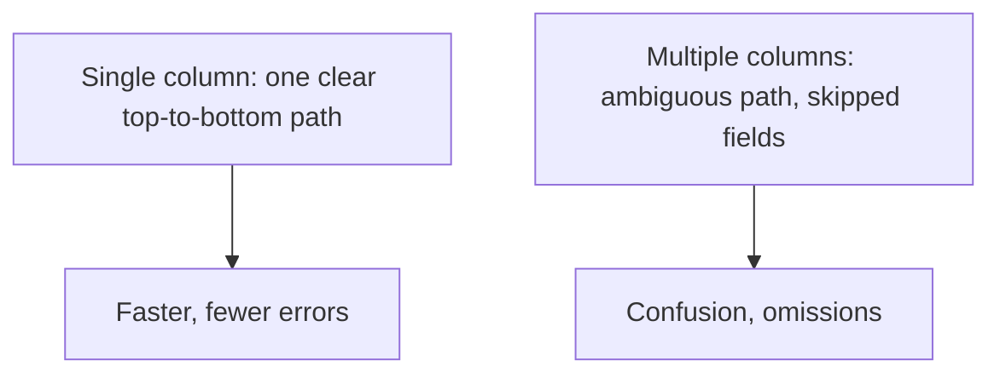
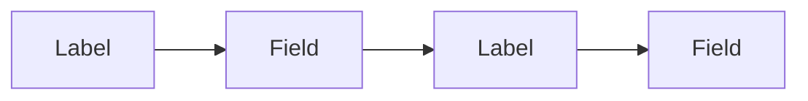
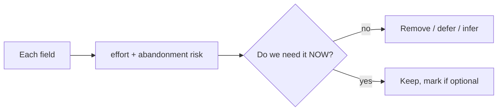
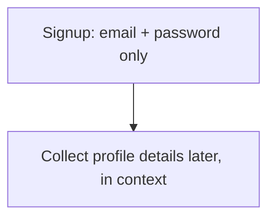

# Form Design and UX - Complete Professional Guide

> **Category:** 06_web_and_frontend · **Language:** English

---

### Layout, labels, and validation that respect the user
**Original guide written from first principles, current to 2026**

> **Original reference book (English).** This is an **independent, originally written** guide. It is not an extract, summary, or paraphrase of any third-party book; it teaches form design from first principles with original examples. Canonical books are listed under **References** as pointers only. Each chapter follows the TO-BRAIN editorial standard (see `FILE_CONVENTIONS.md`).
>
> **Scope notice:** forms are where users do the work — and where they abandon. This guide covers form layout, labeling, and validation UX that minimize effort and errors, current to 2026.

---

## How to read this guide

| Level | Profile | Parts |
|-------|---------|-------|
| 1 — Beginner | New to form UX | Part I |
| 2 — Intermediate | Reducing abandonment | Part II |

**Target audience:** frontend and full-stack developers building forms users actually complete.

**Structure of each chapter:** Introduction · Business context · Theoretical concepts · Architecture · Diagrams (Mermaid) · Real examples · Step by step · Complete examples · Exercises · Challenges · Checklist · Best practices · Anti-patterns · Troubleshooting · References.

> **Note on prerequisites.** Assumes HTML forms and the usability + accessibility guides.

---

## Table of Contents

**Part I – Layout & labels**
1. Single-column layout and top-aligned labels
2. Asking for less

**Part II – Errors**
3. Validation and error messages that help

> **Status of this guide:** phased delivery. **Ready:** Part I (Ch. 1–2). **In progress:** Part II.

---

## Part I – Layout & labels

Forms convert intent into action — and every avoidable bit of friction loses users. The structural choices (layout, label placement, how much you ask) determine completion as much as anything. The reliable defaults are well established; following them beats clever experiments.

---

## Chapter 1 — Single-column layout and labels

### 1.1 Introduction

Two structural defaults make forms faster to complete: a **single-column layout** (one field per row, top to bottom) and **labels placed above their fields**. Single column gives a clear, unambiguous path through the form; top-aligned labels are fastest to scan and don't break on translation or small screens.

### 1.2 Business context

Form completion is directly tied to revenue and signups — abandonment is lost customers. Multi-column layouts create ambiguous reading paths (users skip fields or fill them in the wrong order), and poorly placed labels slow everyone down. The single-column, top-label pattern is repeatedly shown to be fastest and least error-prone, so it lifts completion with zero downside. It's also the most responsive and accessible default.

### 1.3 Theoretical concepts: a clear vertical path



Top-aligned labels let the eye move straight down (label, field, label, field) and adapt cleanly to any width. Left-aligned labels can be faster for scanning but cost horizontal space and struggle on mobile. For most forms in 2026: **single column, labels on top**.

### 1.4 Architecture: vertical rhythm



### 1.5 Real example

**Scenario.** A checkout form laid out in two columns to "save vertical space."

**Problem.** Users miss fields in the second column and fill things out of order; completion drops.

**Solution.** Single column, top labels — a clear linear path.

**Implementation.**

```html
<form class="checkout">                <!-- single column via CSS -->
  <div class="field">
    <label for="email">Email</label>   <!-- label on top -->
    <input id="email" type="email" autocomplete="email" required>
  </div>
  <div class="field">
    <label for="card">Card number</label>
    <input id="card" inputmode="numeric" autocomplete="cc-number" required>
  </div>
</form>
```

```css
.checkout { display: flex; flex-direction: column; gap: 1.25rem; max-width: 28rem; }
.field label { display: block; margin-bottom: .25rem; }
```

**Result.** A single clear path; no skipped fields; works on mobile; labels always associated for accessibility. Completion improves.

**Future improvements.** Add `autocomplete` and proper `inputmode`/`type` so browsers help users fill faster (already shown above).

### 1.6 Exercises

1. Why does single-column beat multi-column for most forms?
2. Why are top-aligned labels a strong default?
3. How do `type`/`inputmode`/`autocomplete` reduce effort?

### 1.7 Challenges

- **Challenge.** Take a multi-column form. Convert it to a single column with top labels and proper input attributes. Test completion on mobile.

### 1.8 Checklist

- [ ] Forms are single-column with a clear path.
- [ ] Labels sit above their fields and are associated.
- [ ] Inputs use correct `type`/`inputmode`/`autocomplete`.
- [ ] Layout works on small screens.

### 1.9 Best practices

- Default to single column, top-aligned labels.
- Use semantic input types and autocomplete.
- Keep one clear vertical path through the form.

### 1.10 Anti-patterns

- Multi-column layouts that fragment the path.
- Placeholder text used instead of labels.
- Generic `type="text"` for emails/numbers/dates.

### 1.11 Troubleshooting

| Symptom | Likely cause | Action |
|---------|--------------|--------|
| Users skip fields | Multi-column ambiguity | Switch to single column |
| Mobile keyboards wrong | Generic input types | Set `type`/`inputmode` |
| Slow autofill | Missing `autocomplete` | Add proper autocomplete tokens |

### 1.12 References

- L. Wroblewski, *Web Form Design* (Rosenfeld Media, 2008) — ISBN 978-1933820248.
- Baymard Institute, form usability research: https://baymard.com/blog.

---

## Chapter 2 — Asking for less

### 2.1 Introduction

The most effective way to improve a form is to **remove fields**. Every field is effort and a chance to abandon. Ask only for what you truly need now; defer or infer the rest. A short form that respects the user's time converts far better than a thorough one that doesn't.

### 2.2 Business context

Each additional field measurably lowers completion. Teams routinely collect data "just in case" (phone numbers, company size, optional extras) that costs conversions for marginal value. Ruthlessly minimizing fields — and clearly marking the few optional ones — directly increases signups and checkouts. The cheapest conversion optimization is often deletion.

### 2.3 Theoretical concepts: every field has a cost



For each field ask: do we need this *now*, or can we collect it later, infer it (e.g. derive city from postal code), or drop it? Distinguish **required** from **optional** clearly (mark the rarer case). Fewer, well-justified fields beats comprehensive data collection.

### 2.4 Architecture: minimal now, more later



### 2.5 Real example

**Scenario.** A signup form asks for name, email, password, phone, company, and role.

**Problem.** Six fields up front; many users abandon at "phone."

**Solution.** Ask for email + password only to create the account; gather the rest later when it's actually needed.

**Implementation (the cut).**

```text
Before: name, email, password, phone, company, role  (6 fields)
After:  email, password                              (2 fields)
        -> collect name in onboarding, company/role only if/when a feature needs it
```

**Result.** The barrier to signup drops to two fields; completion rises. The other data is gathered later, in context, when the user is invested.

**Future improvements.** Infer what you can (timezone, locale) instead of asking; make any remaining non-essential field clearly optional.

### 2.6 Exercises

1. What is the most effective single change to most forms?
2. Give three ways to avoid asking for a field.
3. Should you mark required or optional fields — and why?

### 2.7 Challenges

- **Challenge.** Audit a form you own. For each field, justify "needed now." Remove or defer every field that fails. Count how many you cut.

### 2.8 Checklist

- [ ] Every field is justified as needed now.
- [ ] I defer or infer data where possible.
- [ ] Required vs optional is clearly marked.
- [ ] The form is as short as it can be.

### 2.9 Best practices

- Ask only for what's needed at this step.
- Infer or defer the rest.
- Mark the rarer of required/optional explicitly.

### 2.10 Anti-patterns

- "Just in case" data collection up front.
- Long forms that front-load everything.
- Unclear which fields are optional.

### 2.11 Troubleshooting

| Symptom | Likely cause | Action |
|---------|--------------|--------|
| High abandonment | Too many fields | Cut/defer non-essential fields |
| Drop-off at a specific field | Unjustified ask | Remove or make clearly optional |
| Users enter junk data | Asking for unneeded info | Stop asking; infer instead |

### 2.12 References

- L. Wroblewski, *Web Form Design* (Rosenfeld Media, 2008) — ISBN 978-1933820248.
- Baymard Institute checkout research: https://baymard.com/checkout-usability.

---

> **End of Part I.** You can now structure forms for completion: a single-column layout with top-aligned, associated labels and correct input types gives a clear, fast, accessible path, and ruthlessly removing or deferring fields cuts the effort and abandonment that every extra field causes. **Part II — Errors** (Chapter 3) covers validation UX — inline, timely, specific error messages that tell users exactly how to fix a problem rather than scolding them.

<!--APPEND-PART-II-->
