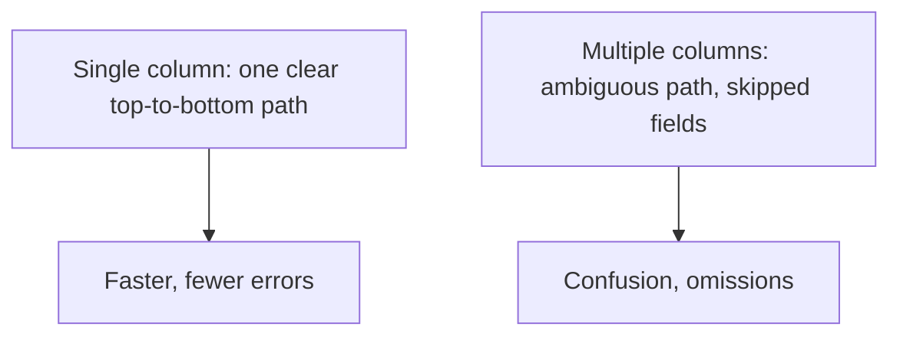
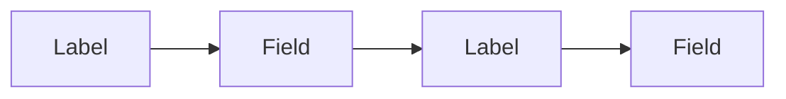
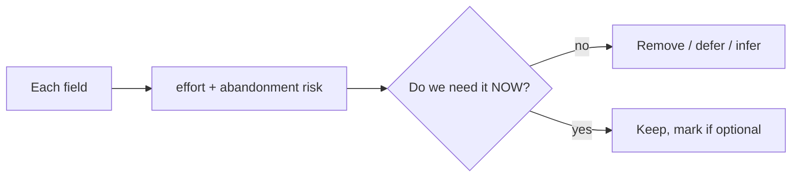
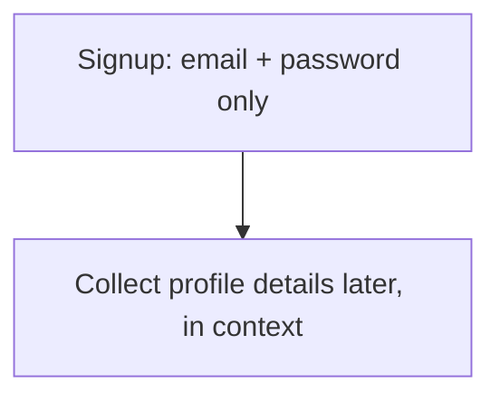
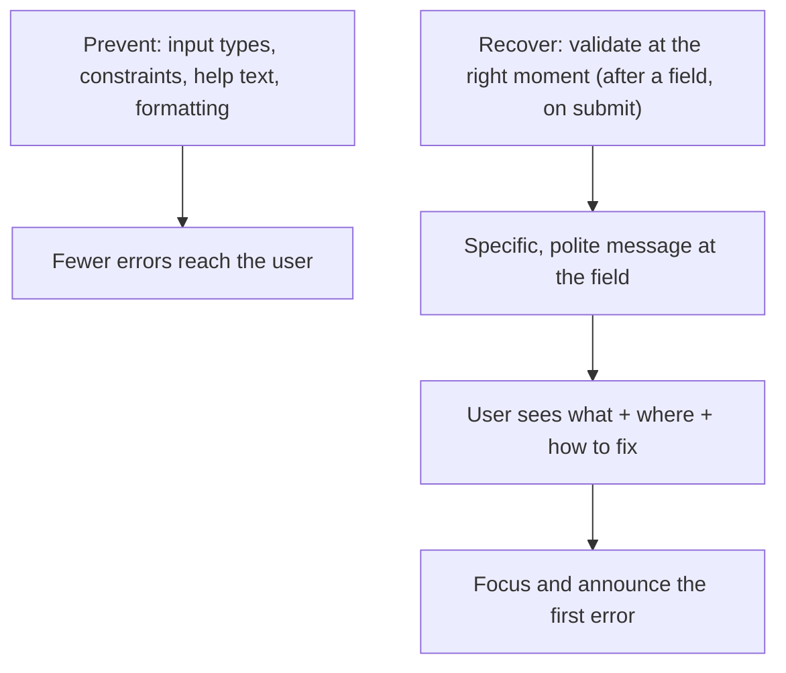
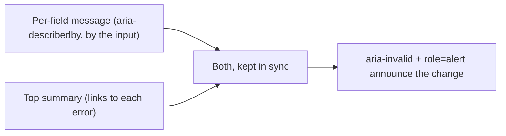

# Form Design and UX - Complete Professional Guide

> **Category:** 06_web_and_frontend · **Language:** English

---

### Layout, labels, and validation that respect the user
**Original guide written from first principles, current to 2026**

> **Original reference book (English).** This is an **independent, originally written** guide. It is not an extract, summary, or paraphrase of any third-party book; it teaches form design from first principles with original examples. Canonical books are listed under **References** as pointers only. Each chapter follows the TO-BRAIN editorial standard (see `FILE_CONVENTIONS.md`).
>
> **Scope notice:** forms are where users do the work — and where they abandon. This guide covers form layout, labeling, and validation UX that minimize effort and errors, current to 2026.

---

## How to read this guide

| Level | Profile | Parts |
|-------|---------|-------|
| 1 — Beginner | New to form UX | Part I |
| 2 — Intermediate | Reducing abandonment | Part II |

**Target audience:** frontend and full-stack developers building forms users actually complete.

**Structure of each chapter:** Introduction · Business context · Theoretical concepts · Architecture · Diagrams (Mermaid) · Real examples · Step by step · Complete examples · Exercises · Challenges · Checklist · Best practices · Anti-patterns · Troubleshooting · References.

> **Note on prerequisites.** Assumes HTML forms and the usability + accessibility guides.

---

## Table of Contents

**Part I – Layout & labels**
1. Single-column layout and top-aligned labels
2. Asking for less

**Part II – Errors**
3. Validation and error messages that help

> **Status of this guide:** complete. **Ready:** Part I (Ch. 1–2) and Part II (Ch. 3).

---

## Part I – Layout & labels

Forms convert intent into action — and every avoidable bit of friction loses users. The structural choices (layout, label placement, how much you ask) determine completion as much as anything. The reliable defaults are well established; following them beats clever experiments.

---

## Chapter 1 — Single-column layout and labels

### 1.1 Introduction

Two structural defaults make forms faster to complete: a **single-column layout** (one field per row, top to bottom) and **labels placed above their fields**. Single column gives a clear, unambiguous path through the form; top-aligned labels are fastest to scan and don't break on translation or small screens.

### 1.2 Business context

Form completion is directly tied to revenue and signups — abandonment is lost customers. Multi-column layouts create ambiguous reading paths (users skip fields or fill them in the wrong order), and poorly placed labels slow everyone down. The single-column, top-label pattern is repeatedly shown to be fastest and least error-prone, so it lifts completion with zero downside. It's also the most responsive and accessible default.

### 1.3 Theoretical concepts: a clear vertical path



Top-aligned labels let the eye move straight down (label, field, label, field) and adapt cleanly to any width. Left-aligned labels can be faster for scanning but cost horizontal space and struggle on mobile. For most forms in 2026: **single column, labels on top**.

### 1.4 Architecture: vertical rhythm



### 1.5 Real example

**Scenario.** A checkout form laid out in two columns to "save vertical space."

**Problem.** Users miss fields in the second column and fill things out of order; completion drops.

**Solution.** Single column, top labels — a clear linear path.

**Implementation.**

```html
<form class="checkout">                <!-- single column via CSS -->
  <div class="field">
    <label for="email">Email</label>   <!-- label on top -->
    <input id="email" type="email" autocomplete="email" required>
  </div>
  <div class="field">
    <label for="card">Card number</label>
    <input id="card" inputmode="numeric" autocomplete="cc-number" required>
  </div>
</form>
```

```css
.checkout { display: flex; flex-direction: column; gap: 1.25rem; max-width: 28rem; }
.field label { display: block; margin-bottom: .25rem; }
```

**Result.** A single clear path; no skipped fields; works on mobile; labels always associated for accessibility. Completion improves.

**Future improvements.** Add `autocomplete` and proper `inputmode`/`type` so browsers help users fill faster (already shown above).

### 1.6 Exercises

1. Why does single-column beat multi-column for most forms?
2. Why are top-aligned labels a strong default?
3. How do `type`/`inputmode`/`autocomplete` reduce effort?

### 1.7 Challenges

- **Challenge.** Take a multi-column form. Convert it to a single column with top labels and proper input attributes. Test completion on mobile.

### 1.8 Checklist

- [ ] Forms are single-column with a clear path.
- [ ] Labels sit above their fields and are associated.
- [ ] Inputs use correct `type`/`inputmode`/`autocomplete`.
- [ ] Layout works on small screens.

### 1.9 Best practices

- Default to single column, top-aligned labels.
- Use semantic input types and autocomplete.
- Keep one clear vertical path through the form.

### 1.10 Anti-patterns

- Multi-column layouts that fragment the path.
- Placeholder text used instead of labels.
- Generic `type="text"` for emails/numbers/dates.

### 1.11 Troubleshooting

| Symptom | Likely cause | Action |
|---------|--------------|--------|
| Users skip fields | Multi-column ambiguity | Switch to single column |
| Mobile keyboards wrong | Generic input types | Set `type`/`inputmode` |
| Slow autofill | Missing `autocomplete` | Add proper autocomplete tokens |

### 1.12 References

- L. Wroblewski, *Web Form Design* (Rosenfeld Media, 2008) — Ch. 4 (Labels — alignment and top-aligned labels), and Section One (Form Structure) on single-column layout. ISBN 978-1933820248.
- Baymard Institute, form usability research: https://baymard.com/blog.

---

## Chapter 2 — Asking for less

### 2.1 Introduction

The most effective way to improve a form is to **remove fields**. Every field is effort and a chance to abandon. Ask only for what you truly need now; defer or infer the rest. A short form that respects the user's time converts far better than a thorough one that doesn't.

### 2.2 Business context

Each additional field measurably lowers completion. Teams routinely collect data "just in case" (phone numbers, company size, optional extras) that costs conversions for marginal value. Ruthlessly minimizing fields — and clearly marking the few optional ones — directly increases signups and checkouts. The cheapest conversion optimization is often deletion.

### 2.3 Theoretical concepts: every field has a cost



For each field ask: do we need this *now*, or can we collect it later, infer it (e.g. derive city from postal code), or drop it? Distinguish **required** from **optional** clearly (mark the rarer case). Fewer, well-justified fields beats comprehensive data collection.

### 2.4 Architecture: minimal now, more later



### 2.5 Real example

**Scenario.** A signup form asks for name, email, password, phone, company, and role.

**Problem.** Six fields up front; many users abandon at "phone."

**Solution.** Ask for email + password only to create the account; gather the rest later when it's actually needed.

**Implementation (the cut).**

```text
Before: name, email, password, phone, company, role  (6 fields)
After:  email, password                              (2 fields)
        -> collect name in onboarding, company/role only if/when a feature needs it
```

**Result.** The barrier to signup drops to two fields; completion rises. The other data is gathered later, in context, when the user is invested.

**Future improvements.** Infer what you can (timezone, locale) instead of asking; make any remaining non-essential field clearly optional.

### 2.6 Exercises

1. What is the most effective single change to most forms?
2. Give three ways to avoid asking for a field.
3. Should you mark required or optional fields — and why?

### 2.7 Challenges

- **Challenge.** Audit a form you own. For each field, justify "needed now." Remove or defer every field that fails. Count how many you cut.

### 2.8 Checklist

- [ ] Every field is justified as needed now.
- [ ] I defer or infer data where possible.
- [ ] Required vs optional is clearly marked.
- [ ] The form is as short as it can be.

### 2.9 Best practices

- Ask only for what's needed at this step.
- Infer or defer the rest.
- Mark the rarer of required/optional explicitly.

### 2.10 Anti-patterns

- "Just in case" data collection up front.
- Long forms that front-load everything.
- Unclear which fields are optional.

### 2.11 Troubleshooting

| Symptom | Likely cause | Action |
|---------|--------------|--------|
| High abandonment | Too many fields | Cut/defer non-essential fields |
| Drop-off at a specific field | Unjustified ask | Remove or make clearly optional |
| Users enter junk data | Asking for unneeded info | Stop asking; infer instead |

### 2.12 References

- L. Wroblewski, *Web Form Design* (Rosenfeld Media, 2008) — Ch. 10 (Unnecessary Inputs), Ch. 13 (Gradual Engagement). ISBN 978-1933820248.
- Baymard Institute checkout research: https://baymard.com/checkout-usability.

---

> **End of Part I.** You can now structure forms for completion: a single-column layout with top-aligned, associated labels and correct input types gives a clear, fast, accessible path, and ruthlessly removing or deferring fields cuts the effort and abandonment that every extra field causes. **Part II — Errors** (Chapter 3) covers validation UX — inline, timely, specific error messages that tell users exactly how to fix a problem rather than scolding them.

---

## Part II – Errors

A well-structured form still fails the user at the last step if validation is hostile: errors shown only after submit, generic messages that don't say what's wrong, fields cleared on reload, focus left at the top of the page. Errors are not an edge case — they are part of the main path, because real people mistype, paste formatted numbers, and skip fields. Part II is about making the recovery path as considerate as the happy path: catch problems at the right moment, explain them in plain language, and put the fix within immediate reach.

---

## Chapter 3 — Validation and error messages that help

### 3.1 Introduction

Validation is the form's feedback loop. Done well, it prevents errors before they happen and, when one does occur, tells the user **what** is wrong, **where**, and **how to fix it** — politely, next to the field, at the right moment. Done badly, it punishes: a single generic banner after submit, the form scrolled away from the offending field, and previously typed values wiped out. This chapter covers the timing of validation (inline vs. on submit), the anatomy of a helpful message, error placement and focus, and the accessibility hooks (`aria-invalid`, `aria-describedby`, live regions) that make errors perceivable to everyone.

### 3.2 Business context

Validation UX is measured directly in completion and abandonment rates. A user who hits an unclear error and can't recover simply leaves — and on a checkout or signup form that is lost revenue, not just frustration. Wroblewski's field research found that *inline* validation (feedback as the user moves through the form) improved success rates, satisfaction, and completion time versus validating only on submit. The cost of bad validation is also support load: every "why won't it accept my phone number?" is a ticket. Considerate validation — prevention first, then clear recovery — is one of the highest-leverage changes available on any form.

### 3.3 Theoretical concepts: prevent, then recover



The first job of validation is to **prevent** errors: correct `type`/`inputmode`, `required`, `pattern`, sensible constraints, and **help text** (Wroblewski Ch. 7) that sets expectations *before* the user types. When an error still occurs, **timing** matters — validate a field when the user has plausibly finished it (e.g. on `blur`), not on every keystroke, and re-validate the whole form on submit. The **message** must be specific and constructive: not "Invalid input" but "Enter a date as MM/DD/YYYY." Place it **at the field**, not only in a top banner, and on submit move **focus to the first error** so recovery starts where the problem is.

### 3.4 Architecture: where errors appear



The robust pattern is **both**: a message immediately adjacent to each invalid field (associated via `aria-describedby` so screen readers read it with the field), plus a **summary** at the top of the form listing every error as a link to its field — invaluable on long forms where the first error may be off-screen. Mark invalid fields with `aria-invalid="true"`; deliver newly appearing messages through a live region (`role="alert"`) so they are announced, not silently painted. Never rely on **color alone** to signal an error — pair it with an icon and text.

### 3.5 Real example

**Scenario.** A signup form rejects the password and email on submit with a single red banner: "Please correct the errors below." Fields are not marked, the page stays scrolled at the submit button, and nothing is announced to screen readers.

**Problem.** The user can't tell *which* fields failed or *why*, has to hunt for them, and assistive-tech users get no feedback at all. Abandonment spikes.

**Solution.** Inline validation on blur, specific messages tied to each field, an error summary with focus management, and proper ARIA.

**Implementation.**

```html
<label for="email">Email</label>
<input id="email" type="email" autocomplete="email" required
       aria-describedby="email-hint email-err" aria-invalid="false">
<p id="email-hint" class="hint">We'll send a confirmation here.</p>
<p id="email-err" class="error" hidden></p>
```

```js
email.addEventListener('blur', () => {
  const msg = email.validity.valueMissing ? 'Enter your email address.'
            : email.validity.typeMismatch ? 'Enter a valid email, e.g. name@example.com.'
            : '';
  email.setAttribute('aria-invalid', msg ? 'true' : 'false');
  emailErr.textContent = msg;            // specific: what + how to fix
  emailErr.hidden = !msg;
});

form.addEventListener('submit', (e) => {
  const firstInvalid = form.querySelector('[aria-invalid="true"], :invalid');
  if (firstInvalid) { e.preventDefault(); firstInvalid.focus(); }  // recover at the error
});
```

```css
.error { color: #b00020; }
.error::before { content: "⚠ "; }   /* not color alone */
```

**Result.** Each field reports its own problem in plain language the moment the user leaves it; on submit, focus jumps to the first error; screen readers announce the messages via the described-by association. The user always knows what to fix and where.

**Future improvements.** Add a positive inline state (a check when a field becomes valid), a linked error summary at the top for long forms, and server-side re-validation that returns the same field-level messages so the experience is identical when JavaScript is unavailable.

### 3.6 Exercises

1. Why validate a field on `blur` rather than on every keystroke?
2. Rewrite "Invalid input" into a specific, constructive message for a phone-number field.
3. What two places should an error appear on a long form, and why?

### 3.7 Challenges

- **Challenge.** Take a form that validates only on submit with a generic banner. Add inline, field-level messages associated via `aria-describedby`, mark invalid fields with `aria-invalid`, and on submit move focus to the first error. Verify with a screen reader that each message is announced.

### 3.8 Checklist

- [ ] I prevent errors first (input types, constraints, help text) before validating.
- [ ] Messages are specific and constructive — what, where, and how to fix.
- [ ] Errors appear at the field (via `aria-describedby`) and, on long forms, in a top summary.
- [ ] Invalid fields carry `aria-invalid`; new messages are announced (live region).
- [ ] On submit, focus moves to the first error; errors are never signaled by color alone.

### 3.9 Best practices

- Validate at a natural moment (after a field, and on submit) — not on every keystroke.
- Write messages in plain, polite language that states the fix.
- Preserve the user's input on error; never clear the form.
- Confirm success too — positive feedback reassures as much as errors warn.

### 3.10 Anti-patterns

- A single generic banner ("Please fix the errors") with no field-level detail.
- Validating aggressively on each keystroke before the user has finished.
- Clearing entered values when validation fails.
- Color-only error signaling; messages not associated with their field.

### 3.11 Troubleshooting

| Symptom | Likely cause | Action |
|---------|--------------|--------|
| Users can't find what's wrong | Errors only in a top banner | Add per-field messages via `aria-describedby` |
| Screen reader silent on error | No `aria-invalid` / live region | Set `aria-invalid`; announce with `role="alert"` |
| High abandonment at one field | Generic or premature message | Make it specific; validate on blur, not keystroke |
| Submit scrolls nowhere useful | No focus management | Focus the first invalid field on submit |

### 3.12 References

- L. Wroblewski, *Web Form Design* (Rosenfeld Media, 2008) — Ch. 7 (Help Text), Ch. 8 (Errors and Success), Ch. 9 (Inline Validation). ISBN 978-1933820248.
- W3C WAI, "Forms tutorial — User notifications": https://www.w3.org/WAI/tutorials/forms/notifications/.
- MDN, "Client-side form validation": https://developer.mozilla.org/en-US/docs/Learn/Forms/Form_validation.

---

> **End of guide.** You can now design a form that completes: structure it in a single column with clear labels and the right input types, ask for as little as possible (Part I), and make validation considerate — prevent errors up front, then recover with specific, well-placed, accessible messages and sensible focus when one slips through (Part II).
