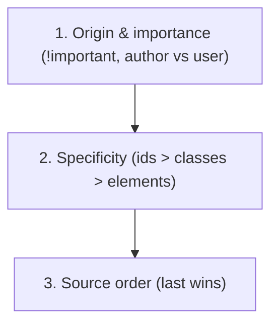
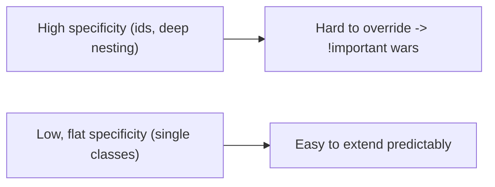
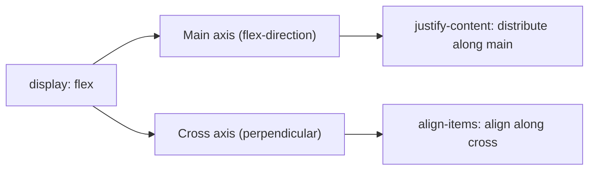
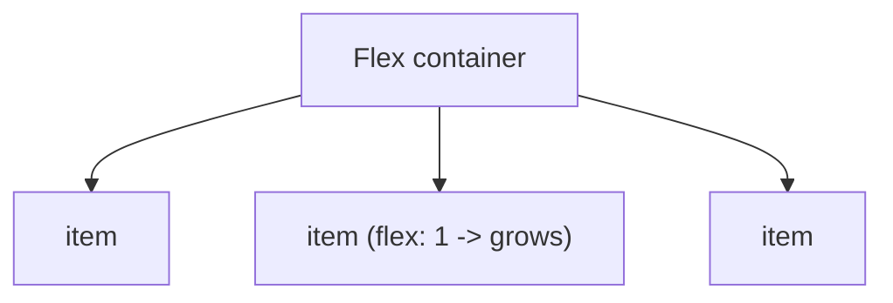

# Modern CSS Layout - Complete Professional Guide

> **Category:** 06_web_and_frontend · **Language:** English

---

### The cascade, Flexbox, and Grid for robust layouts
**Original guide written from first principles, current to 2026**

> **Original reference book (English).** This is an **independent, originally written** guide. It is not an extract, summary, or paraphrase of any third-party book; it teaches CSS layout from first principles with original examples. Canonical books are listed under **References** as pointers only. Each chapter follows the TO-BRAIN editorial standard (see `FILE_CONVENTIONS.md`).
>
> **Scope notice:** modern CSS layout is built on the cascade, Flexbox (one-dimensional), and Grid (two-dimensional). This guide covers how they work and when to use each, current to 2026 (container queries, logical properties, modern color).

---

## How to read this guide

| Level | Profile | Parts |
|-------|---------|-------|
| 1 — Beginner | New to CSS layout | Part I |
| 2 — Intermediate | Building responsive UIs | Part II |

**Target audience:** frontend developers who want predictable, maintainable layouts.

**Structure of each chapter:** Introduction · Business context · Theoretical concepts · Architecture · Diagrams (Mermaid) · Real examples · Step by step · Complete examples · Exercises · Challenges · Checklist · Best practices · Anti-patterns · Troubleshooting · References.

> **Note on prerequisites.** Assumes basic HTML/CSS (selectors, the box model).

---

## Table of Contents

**Part I – Foundations**
1. The cascade, specificity, and the box model
2. Flexbox: one-dimensional layout

**Part II – Two dimensions**
3. Grid and responsive layout (container queries)

> **Status of this guide:** phased delivery. **Ready:** Part I (Ch. 1–2). **In progress:** Part II.

---

## Part I – Foundations

CSS feels unpredictable until you understand the rules underneath: how conflicting declarations are resolved (the cascade and specificity) and how boxes size themselves. With those clear, Flexbox and Grid turn layout from a fight into a declarative description of intent.

---

## Chapter 1 — The cascade, specificity, and the box model

### 1.1 Introduction

When multiple rules target the same element, CSS resolves the conflict by the **cascade**: a combination of **origin/importance**, **specificity**, and **source order**. And every element is a **box** whose size is governed by the box model. Mastering these two ideas removes most "why is my CSS not applying?" confusion.

### 1.2 Business context

CSS that's fought rather than understood produces brittle styles, `!important` wars, and specificity hacks that make every change risky and slow. Understanding the cascade and box model lets developers write predictable, low-specificity CSS that's safe to extend — directly affecting how fast a team can ship UI changes without regressions. It's the difference between a maintainable design system and an unmanageable stylesheet.

### 1.3 Theoretical concepts: how conflicts resolve



The cascade resolves conflicts in that order. **Specificity** counts selector parts: inline > id > class/attribute/pseudo-class > element. Ties break by **source order** (later wins). Keeping specificity **low and flat** (favor classes, avoid ids and deep selectors) keeps CSS overridable and predictable. For sizing, prefer `box-sizing: border-box` so width includes padding and border.

### 1.4 Architecture: low, flat specificity



A flat specificity landscape means new rules can override old ones by source order alone, without escalating hacks.

### 1.5 Real example

**Scenario.** A button's color won't change despite a new rule.

**Problem.** An id selector (`#header .btn`) outranks the new class rule (`.btn-primary`), so the new color is ignored.

**Solution.** Lower specificity: style by class, not id-anchored descendants.

**Implementation.**

```css
/* PROBLEM: high specificity wins, blocks overrides */
#header .btn { color: white; background: gray; }   /* id => hard to override */

/* FIX: flat, class-based; predictable and overridable */
.btn          { color: white; background: gray; box-sizing: border-box; }
.btn--primary { background: rebeccapurple; }        /* overrides by source order */
```

**Result.** `.btn--primary` reliably applies; no `!important` needed. The stylesheet stays overridable.

**Future improvements.** Adopt a naming convention (e.g. BEM) and design tokens for color so overrides are systematic.

### 1.6 Exercises

1. List the three cascade tiers in order.
2. Why keep specificity low and flat?
3. What does `box-sizing: border-box` change?

### 1.7 Challenges

- **Challenge.** Find a rule you "fixed" with `!important`. Trace the specificity conflict and resolve it by lowering specificity instead.

### 1.8 Checklist

- [ ] I understand origin → specificity → source order.
- [ ] I keep specificity low (classes over ids/deep nesting).
- [ ] I avoid `!important` as a default tool.
- [ ] I use `border-box` sizing.

### 1.9 Best practices

- Style with single classes; avoid ids and deep descendant selectors.
- Reserve `!important` for genuine utility overrides only.
- Set `box-sizing: border-box` globally.

### 1.10 Anti-patterns

- `!important` wars to win specificity battles.
- Id-anchored or deeply nested selectors that can't be overridden.
- Fighting the box model with magic-number widths.

### 1.11 Troubleshooting

| Symptom | Likely cause | Action |
|---------|--------------|--------|
| A rule won't apply | Higher-specificity rule wins | Lower specificity; check source order |
| Escalating `!important` | Specificity too high | Flatten selectors |
| Widths overflow unexpectedly | `content-box` sizing | Use `border-box` |

### 1.12 References

- K. Grant, *CSS in Depth*, 2nd ed. (Manning, 2024) — ISBN 978-1633437555.
- MDN, "The cascade": https://developer.mozilla.org/en-US/docs/Web/CSS/Cascade.

---

## Chapter 2 — Flexbox

### 2.1 Introduction

**Flexbox** lays out items along a single axis — a row or a column — and excels at distributing space and aligning items within a container. It's the right tool for one-dimensional layouts: navbars, toolbars, centering, equal-height columns. Understanding its main axis vs cross axis makes alignment intuitive instead of trial-and-error.

### 2.2 Business context

Before Flexbox, common UI needs (vertical centering, equal spacing, flexible toolbars) required fragile hacks (floats, absolute positioning, table tricks) that broke easily. Flexbox makes these declarative and robust, cutting the time and bugs in building responsive components. It's foundational to every modern component library and design system.

### 2.3 Theoretical concepts: main axis and cross axis



Set `display: flex` on the container. `flex-direction` chooses the **main axis** (row/column). `justify-content` distributes items **along the main axis**; `align-items` aligns them **on the cross axis**. Items can grow/shrink via `flex`. Once you map "justify = main, align = cross," alignment stops being guesswork.

### 2.4 Architecture: container controls children



The container's flex properties govern how children are sized and aligned; children opt into growing/shrinking with the `flex` shorthand.

### 2.5 Real example

**Scenario.** A navbar with a logo on the left and links on the right, vertically centered.

**Problem.** Old approaches (floats + line-height hacks) were fragile and hard to center vertically.

**Solution.** Flexbox: space between, centered cross-axis.

**Implementation.**

```css
.navbar {
  display: flex;
  justify-content: space-between;  /* logo left, links right (main axis) */
  align-items: center;             /* vertically centered (cross axis) */
  gap: 1rem;
}
```

**Result.** Logo and links sit at opposite ends, perfectly centered vertically, with consistent spacing — robust across content sizes, no hacks.

**Future improvements.** Use `flex-wrap` and a container query (Chapter 3) to stack on narrow screens.

### 2.6 Exercises

1. What kind of layout is Flexbox designed for?
2. Which property aligns on the main axis vs the cross axis?
3. What does `flex: 1` on an item do?

### 2.7 Challenges

- **Challenge.** Rebuild a component you currently center with hacks using Flexbox. Center it both axes with two properties.

### 2.8 Checklist

- [ ] I use Flexbox for one-dimensional layouts.
- [ ] I map justify-content to the main axis, align-items to the cross axis.
- [ ] I use `gap` for spacing instead of margins where possible.
- [ ] Items grow/shrink intentionally via `flex`.

### 2.9 Best practices

- Reach for Flexbox for rows/columns of items.
- Use `gap` for consistent spacing.
- Think in main/cross axis to reason about alignment.

### 2.10 Anti-patterns

- Float/absolute hacks for things Flexbox does natively.
- Margins-for-spacing where `gap` is cleaner.
- Using Flexbox for genuinely 2D grids (use Grid).

### 2.11 Troubleshooting

| Symptom | Likely cause | Action |
|---------|--------------|--------|
| Can't vertically center | Wrong axis property | `align-items: center` (cross axis) |
| Items won't space evenly | Manual margins | Use `justify-content` / `gap` |
| 2D layout fighting Flexbox | Wrong tool | Use Grid for two dimensions |

### 2.12 References

- K. Grant, *CSS in Depth*, 2nd ed. (Manning, 2024) — ISBN 978-1633437555.
- MDN, "Flexbox": https://developer.mozilla.org/en-US/docs/Web/CSS/CSS_flexible_box_layout.

---

> **End of Part I.** You can now write predictable CSS by understanding the cascade (origin → specificity → source order) and keeping specificity low, and you can build robust one-dimensional layouts with Flexbox by thinking in main and cross axes. **Part II — Two dimensions** (Chapter 3) covers CSS Grid for genuine two-dimensional layout and modern responsive techniques including container queries, which size components by their container rather than the viewport.

<!--APPEND-PART-II-->
