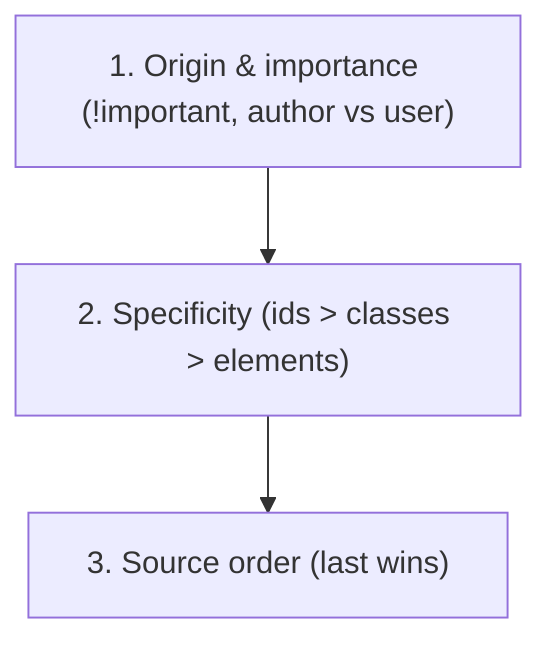
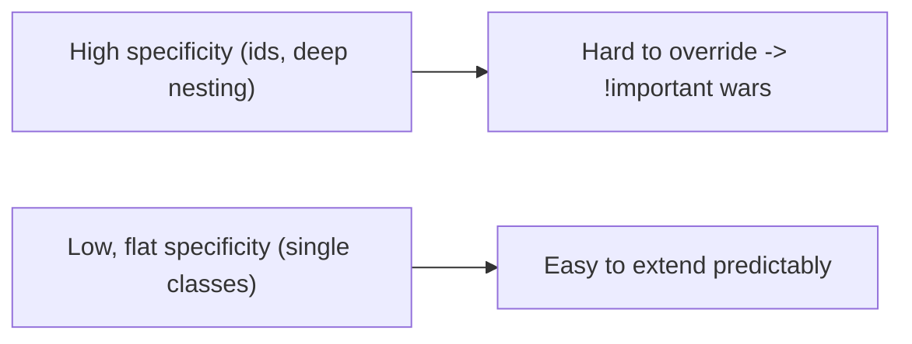
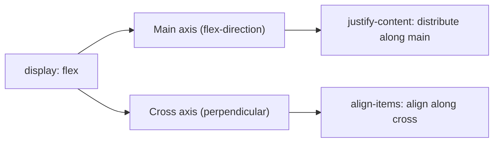
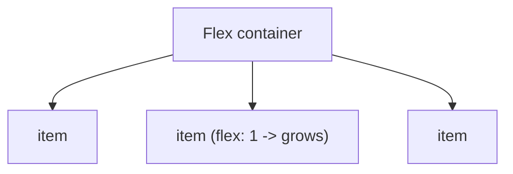
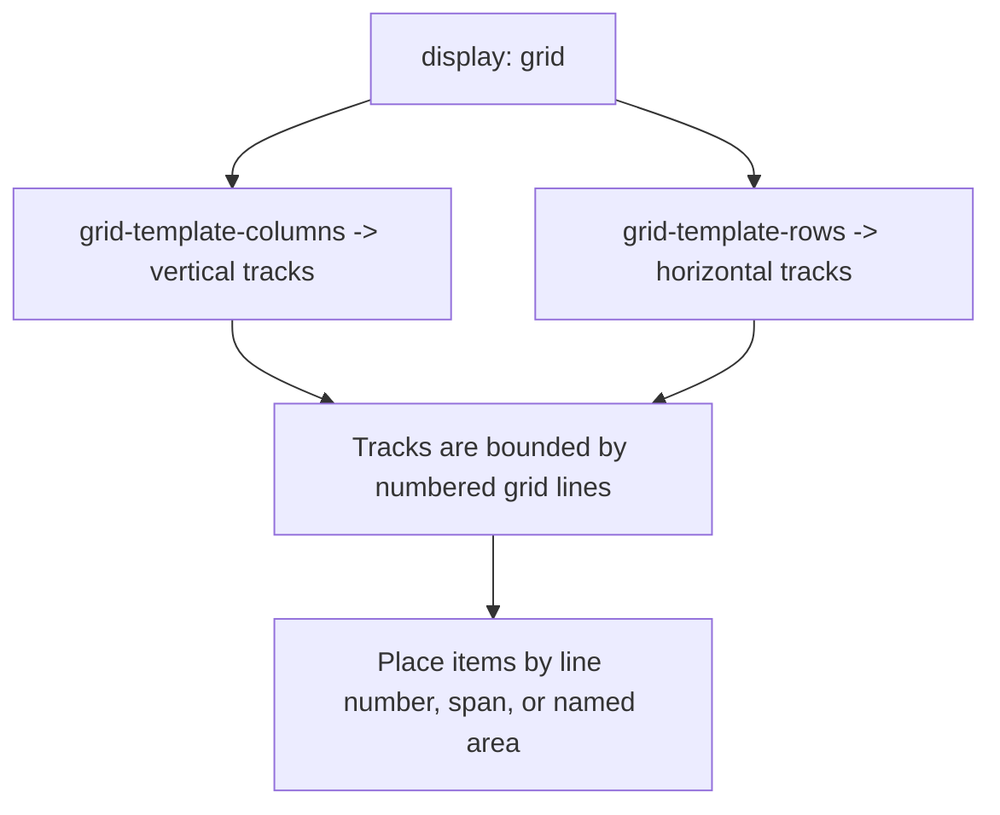
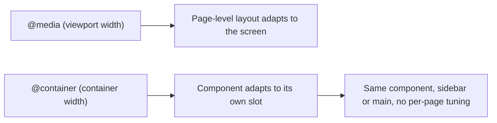

# Modern CSS Layout - Complete Professional Guide

> **Category:** 06_web_and_frontend · **Language:** English

---

### The cascade, Flexbox, and Grid for robust layouts
**Original guide written from first principles, current to 2026**

> **Original reference book (English).** This is an **independent, originally written** guide. It is not an extract, summary, or paraphrase of any third-party book; it teaches CSS layout from first principles with original examples. Canonical books are listed under **References** as pointers only. Each chapter follows the TO-BRAIN editorial standard (see `FILE_CONVENTIONS.md`).
>
> **Scope notice:** modern CSS layout is built on the cascade, Flexbox (one-dimensional), and Grid (two-dimensional). This guide covers how they work and when to use each, current to 2026 (container queries, logical properties, modern color).

---

## How to read this guide

| Level | Profile | Parts |
|-------|---------|-------|
| 1 — Beginner | New to CSS layout | Part I |
| 2 — Intermediate | Building responsive UIs | Part II |

**Target audience:** frontend developers who want predictable, maintainable layouts.

**Structure of each chapter:** Introduction · Business context · Theoretical concepts · Architecture · Diagrams (Mermaid) · Real examples · Step by step · Complete examples · Exercises · Challenges · Checklist · Best practices · Anti-patterns · Troubleshooting · References.

> **Note on prerequisites.** Assumes basic HTML/CSS (selectors, the box model).

---

## Table of Contents

**Part I – Foundations**
1. The cascade, specificity, and the box model
2. Flexbox: one-dimensional layout

**Part II – Two dimensions**
3. Grid and responsive layout (container queries)

> **Status of this guide:** complete. **Ready:** Part I (Ch. 1–2) and Part II (Ch. 3).

---

## Part I – Foundations

CSS feels unpredictable until you understand the rules underneath: how conflicting declarations are resolved (the cascade and specificity) and how boxes size themselves. With those clear, Flexbox and Grid turn layout from a fight into a declarative description of intent.

---

## Chapter 1 — The cascade, specificity, and the box model

### 1.1 Introduction

When multiple rules target the same element, CSS resolves the conflict by the **cascade**: a combination of **origin/importance**, **specificity**, and **source order**. And every element is a **box** whose size is governed by the box model. Mastering these two ideas removes most "why is my CSS not applying?" confusion.

### 1.2 Business context

CSS that's fought rather than understood produces brittle styles, `!important` wars, and specificity hacks that make every change risky and slow. Understanding the cascade and box model lets developers write predictable, low-specificity CSS that's safe to extend — directly affecting how fast a team can ship UI changes without regressions. It's the difference between a maintainable design system and an unmanageable stylesheet.

### 1.3 Theoretical concepts: how conflicts resolve



The cascade resolves conflicts in that order. **Specificity** counts selector parts: inline > id > class/attribute/pseudo-class > element. Ties break by **source order** (later wins). Keeping specificity **low and flat** (favor classes, avoid ids and deep selectors) keeps CSS overridable and predictable. For sizing, prefer `box-sizing: border-box` so width includes padding and border.

### 1.4 Architecture: low, flat specificity



A flat specificity landscape means new rules can override old ones by source order alone, without escalating hacks.

### 1.5 Real example

**Scenario.** A button's color won't change despite a new rule.

**Problem.** An id selector (`#header .btn`) outranks the new class rule (`.btn-primary`), so the new color is ignored.

**Solution.** Lower specificity: style by class, not id-anchored descendants.

**Implementation.**

```css
/* PROBLEM: high specificity wins, blocks overrides */
#header .btn { color: white; background: gray; }   /* id => hard to override */

/* FIX: flat, class-based; predictable and overridable */
.btn          { color: white; background: gray; box-sizing: border-box; }
.btn--primary { background: rebeccapurple; }        /* overrides by source order */
```

**Result.** `.btn--primary` reliably applies; no `!important` needed. The stylesheet stays overridable.

**Future improvements.** Adopt a naming convention (e.g. BEM) and design tokens for color so overrides are systematic.

### 1.6 Exercises

1. List the three cascade tiers in order.
2. Why keep specificity low and flat?
3. What does `box-sizing: border-box` change?

### 1.7 Challenges

- **Challenge.** Find a rule you "fixed" with `!important`. Trace the specificity conflict and resolve it by lowering specificity instead.

### 1.8 Checklist

- [ ] I understand origin → specificity → source order.
- [ ] I keep specificity low (classes over ids/deep nesting).
- [ ] I avoid `!important` as a default tool.
- [ ] I use `border-box` sizing.

### 1.9 Best practices

- Style with single classes; avoid ids and deep descendant selectors.
- Reserve `!important` for genuine utility overrides only.
- Set `box-sizing: border-box` globally.

### 1.10 Anti-patterns

- `!important` wars to win specificity battles.
- Id-anchored or deeply nested selectors that can't be overridden.
- Fighting the box model with magic-number widths.

### 1.11 Troubleshooting

| Symptom | Likely cause | Action |
|---------|--------------|--------|
| A rule won't apply | Higher-specificity rule wins | Lower specificity; check source order |
| Escalating `!important` | Specificity too high | Flatten selectors |
| Widths overflow unexpectedly | `content-box` sizing | Use `border-box` |

### 1.12 References

- K. Grant, *CSS in Depth*, 2nd ed. (Manning, 2024) — ISBN 978-1633437555.
- MDN, "The cascade": https://developer.mozilla.org/en-US/docs/Web/CSS/Cascade.

---

## Chapter 2 — Flexbox

### 2.1 Introduction

**Flexbox** lays out items along a single axis — a row or a column — and excels at distributing space and aligning items within a container. It's the right tool for one-dimensional layouts: navbars, toolbars, centering, equal-height columns. Understanding its main axis vs cross axis makes alignment intuitive instead of trial-and-error.

### 2.2 Business context

Before Flexbox, common UI needs (vertical centering, equal spacing, flexible toolbars) required fragile hacks (floats, absolute positioning, table tricks) that broke easily. Flexbox makes these declarative and robust, cutting the time and bugs in building responsive components. It's foundational to every modern component library and design system.

### 2.3 Theoretical concepts: main axis and cross axis



Set `display: flex` on the container. `flex-direction` chooses the **main axis** (row/column). `justify-content` distributes items **along the main axis**; `align-items` aligns them **on the cross axis**. Items can grow/shrink via `flex`. Once you map "justify = main, align = cross," alignment stops being guesswork.

### 2.4 Architecture: container controls children



The container's flex properties govern how children are sized and aligned; children opt into growing/shrinking with the `flex` shorthand.

### 2.5 Real example

**Scenario.** A navbar with a logo on the left and links on the right, vertically centered.

**Problem.** Old approaches (floats + line-height hacks) were fragile and hard to center vertically.

**Solution.** Flexbox: space between, centered cross-axis.

**Implementation.**

```css
.navbar {
  display: flex;
  justify-content: space-between;  /* logo left, links right (main axis) */
  align-items: center;             /* vertically centered (cross axis) */
  gap: 1rem;
}
```

**Result.** Logo and links sit at opposite ends, perfectly centered vertically, with consistent spacing — robust across content sizes, no hacks.

**Future improvements.** Use `flex-wrap` and a container query (Chapter 3) to stack on narrow screens.

### 2.6 Exercises

1. What kind of layout is Flexbox designed for?
2. Which property aligns on the main axis vs the cross axis?
3. What does `flex: 1` on an item do?

### 2.7 Challenges

- **Challenge.** Rebuild a component you currently center with hacks using Flexbox. Center it both axes with two properties.

### 2.8 Checklist

- [ ] I use Flexbox for one-dimensional layouts.
- [ ] I map justify-content to the main axis, align-items to the cross axis.
- [ ] I use `gap` for spacing instead of margins where possible.
- [ ] Items grow/shrink intentionally via `flex`.

### 2.9 Best practices

- Reach for Flexbox for rows/columns of items.
- Use `gap` for consistent spacing.
- Think in main/cross axis to reason about alignment.

### 2.10 Anti-patterns

- Float/absolute hacks for things Flexbox does natively.
- Margins-for-spacing where `gap` is cleaner.
- Using Flexbox for genuinely 2D grids (use Grid).

### 2.11 Troubleshooting

| Symptom | Likely cause | Action |
|---------|--------------|--------|
| Can't vertically center | Wrong axis property | `align-items: center` (cross axis) |
| Items won't space evenly | Manual margins | Use `justify-content` / `gap` |
| 2D layout fighting Flexbox | Wrong tool | Use Grid for two dimensions |

### 2.12 References

- K. Grant, *CSS in Depth*, 2nd ed. (Manning, 2024) — ISBN 978-1633437555.
- MDN, "Flexbox": https://developer.mozilla.org/en-US/docs/Web/CSS/CSS_flexible_box_layout.

---

> **End of Part I.** You can now write predictable CSS by understanding the cascade (origin → specificity → source order) and keeping specificity low, and you can build robust one-dimensional layouts with Flexbox by thinking in main and cross axes. **Part II — Two dimensions** (Chapter 3) covers CSS Grid for genuine two-dimensional layout and modern responsive techniques including container queries, which size components by their container rather than the viewport.

---

## Part II – Two dimensions

Flexbox lays items along a single axis. The moment a layout has structure in **both** directions at once — a header that spans the full width above a sidebar and a main column, cards that must align across rows *and* columns — you are fighting Flexbox with nested wrappers. CSS Grid was designed for exactly this: you declare the two-dimensional structure on the container and place children into it. Part II also closes the responsive story: media queries adapt to the *viewport*, but reusable components live in containers of unknown size, and **container queries** let a component adapt to the space it is actually given.

---

## Chapter 3 — Grid and responsive layout (container queries)

### 3.1 Introduction

**CSS Grid** is the first CSS tool built for genuine **two-dimensional** layout: you define rows and columns on the container and place items into the resulting cells. Where Flexbox distributes items along one axis and wraps as a side effect, Grid lets you state the whole structure up front — `grid-template-columns`, `grid-template-rows`, named areas — and have children land in it predictably. Paired with **container queries**, which size a component by its own container rather than the viewport, Grid turns responsive layout from a pile of breakpoint hacks into a declarative description of intent.

### 3.2 Business context

Most application screens are two-dimensional: a shell with header, sidebar, content, and footer; a dashboard of aligned cards; a form grid. Building these with Flexbox and floats means nested wrapper `<div>`s whose only job is to coerce one-dimensional tools into a two-dimensional result — markup that is brittle, hard to reorder, and expensive to restyle. Grid collapses that nesting into a single container, so a layout change is a one-line edit to the template instead of a markup refactor. Container queries take it further: a card component drops into a sidebar *or* a wide content area and adapts itself, so design-system components become truly reusable instead of being re-tuned per page. Both directly cut the time and regression risk of every layout change a team ships.

### 3.3 Theoretical concepts: tracks, lines, and areas



A grid **container** (`display: grid`) is divided into **tracks** — columns and rows — defined by `grid-template-columns` and `grid-template-rows`. Tracks are separated by numbered **grid lines**; three equal columns (`1fr 1fr 1fr`) create four vertical lines. The `fr` unit is a *fraction of the free space*, behaving like Flexbox's grow factor, so `2fr 1fr` splits remaining space two-to-one. Items are placed either by line (`grid-column: 1 / 3`, i.e. line 1 to line 3, spanning two tracks), by `span`, or — most readably — by **named areas** (`grid-template-areas`), an ASCII-art map of the layout. `repeat()`, `minmax()`, and `auto-fill`/`auto-fit` express *responsive* track counts without media queries: `repeat(auto-fill, minmax(200px, 1fr))` fits as many ≥200px columns as the container allows.

### 3.4 Architecture: media queries vs container queries



**Media queries** ask about the viewport — correct for page-level structure (when does the shell go from one column to sidebar-plus-content). **Container queries** ask about the element's own container: declare `container-type: inline-size` on a wrapper, then `@container (min-width: 30rem)` inside the component. The same card now reflows based on the width it is *given*, not the width of the screen — the key to components that are genuinely reusable across layouts.

### 3.5 Real example

**Scenario.** An app shell: full-width header, a sidebar and main column below it, full-width footer. Inside the main column, a grid of cards that should switch from stacked to side-by-side based on the column's width, not the screen's.

**Problem.** Built with Flexbox, the shell needs nested wrappers and the cards use viewport media queries — so when the same card appears in the narrow sidebar it still uses the "wide screen" two-column layout and overflows.

**Solution.** Grid with named areas for the shell; `auto-fit` + `minmax` plus a container query for the cards.

**Implementation.**

```css
/* App shell: the whole two-dimensional structure in one container */
.app {
  display: grid;
  grid-template-columns: 16rem 1fr;          /* sidebar + content */
  grid-template-rows: auto 1fr auto;          /* header, body, footer */
  grid-template-areas:
    "header  header"
    "sidebar main"
    "footer  footer";
  min-height: 100vh;
}
.app > header { grid-area: header; }
.app > nav    { grid-area: sidebar; }
.app > main   { grid-area: main; }
.app > footer { grid-area: footer; }

/* Card grid: as many >=14rem columns as fit, no media query */
.cards {
  display: grid;
  grid-template-columns: repeat(auto-fit, minmax(14rem, 1fr));
  gap: 1rem;
}

/* Card adapts to ITS container, not the viewport */
.card { container-type: inline-size; }
@container (min-width: 24rem) {
  .card__body { display: grid; grid-template-columns: auto 1fr; gap: 1rem; }
}
```

**Result.** The shell is one container with a readable area map; reordering regions is a one-line edit. Cards reflow to fit whatever width they are handed, so the same component works in the sidebar and the main column with no per-page overrides and no overflow.

**Future improvements.** Use `subgrid` so card internals (heading, body, footer) align across the whole row; add logical properties (`grid-template-columns` with `inline`/`block` reasoning) for RTL support; gate `subgrid` behind `@supports` for older engines.

### 3.6 Exercises

1. What does the `fr` unit represent, and how is it like Flexbox's `flex-grow`?
2. When do you reach for Grid instead of Flexbox?
3. What problem do container queries solve that media queries cannot?

### 3.7 Challenges

- **Challenge.** Take a page you currently build with nested Flexbox wrappers and rebuild the shell as a single grid with `grid-template-areas`. Then convert one reusable component's media queries to a container query and drop it into two differently sized slots.

### 3.8 Checklist

- [ ] I use Grid for two-dimensional layouts and Flexbox for one-dimensional.
- [ ] I express responsive track counts with `repeat(auto-fit, minmax(...))` before reaching for media queries.
- [ ] I name areas (`grid-template-areas`) when it makes the layout readable.
- [ ] I use container queries for components that must adapt to their slot.

### 3.9 Best practices

- Declare structure on the container; keep grid items free of layout wrappers.
- Prefer `fr`, `minmax()`, and `auto-fit`/`auto-fill` over fixed pixel tracks.
- Use named areas for app shells; use line-based placement for fine control.
- Reach for container queries to make design-system components portable.

### 3.10 Anti-patterns

- Nesting Flexbox wrappers to fake a two-dimensional grid.
- Hard-coding column counts with media queries where `auto-fit` + `minmax` would adapt automatically.
- Sizing components off the viewport when they live in containers of unknown width.
- Fixed-pixel tracks that overflow on small screens.

### 3.11 Troubleshooting

| Symptom | Likely cause | Action |
|---------|--------------|--------|
| Items overflow the container | Fixed-pixel tracks | Use `fr` / `minmax(0, 1fr)` |
| Card uses wrong layout in a narrow slot | Viewport media query | Switch to `@container` with `container-type` |
| Grid areas don't apply | Area names don't match `grid-area` | Align the template map with each item's `grid-area` |
| `auto-fit` collapses to one column | `minmax` min too large | Lower the min (e.g. `minmax(14rem, 1fr)`) |

### 3.12 References

- K. Grant, *CSS in Depth*, 2nd ed. (Manning, 2024) — Ch. 5 (grid layout), Ch. 7 (responsive design), Ch. 10 (container queries). ISBN 978-1633437555.
- MDN, "CSS grid layout": https://developer.mozilla.org/en-US/docs/Web/CSS/CSS_grid_layout.
- MDN, "CSS container queries": https://developer.mozilla.org/en-US/docs/Web/CSS/CSS_containment/Container_queries.

---

> **End of guide.** You can now build predictable CSS from the cascade up (Part I), lay out one dimension with Flexbox, and structure two dimensions with Grid while making components adapt to their own container (Part II). Together these cover the layout needs of modern web UIs current to 2026: low-specificity styles, main/cross-axis reasoning, named grid areas, and container-driven responsiveness.
