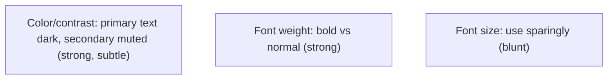
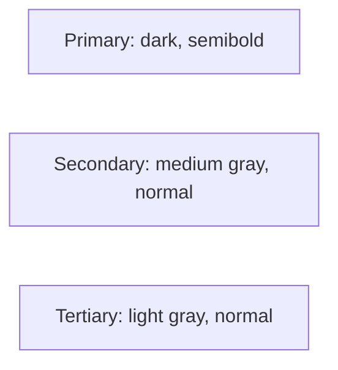
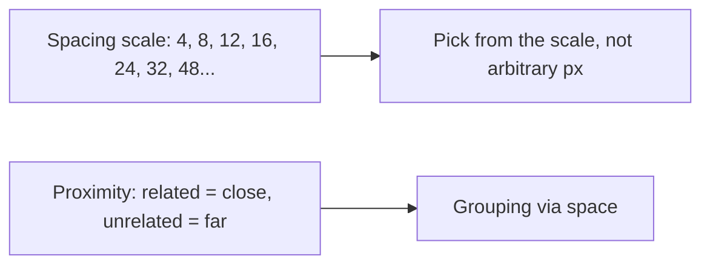
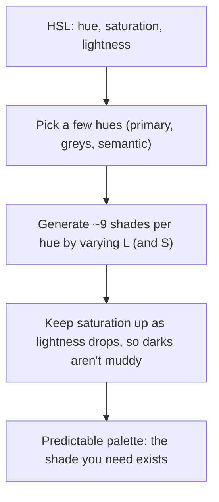
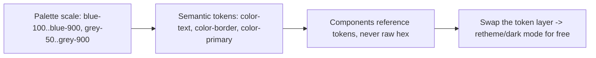

# Practical Visual Design - Complete Professional Guide

> **Category:** 06_web_and_frontend · **Language:** English

---

### Hierarchy, spacing, and color for developers
**Original guide written from first principles, current to 2026**

> **Original reference book (English).** This is an **independent, originally written** guide. It is not an extract, summary, or paraphrase of any third-party book; it teaches practical visual design from first principles with original examples. Canonical books are listed under **References** as pointers only. Each chapter follows the TO-BRAIN editorial standard (see `FILE_CONVENTIONS.md`).
>
> **Scope notice:** developers can produce good-looking interfaces with a few concrete, learnable techniques — no art degree required. This guide covers visual hierarchy, spacing, and color used systematically, current to 2026 (design tokens, modern color).

---

## How to read this guide

| Level | Profile | Parts |
|-------|---------|-------|
| 1 — Beginner | Design-shy developer | Part I |
| 2 — Intermediate | Building a UI system | Part II |

**Target audience:** developers who want their UIs to look professional without a designer on hand.

**Structure of each chapter:** Introduction · Business context · Theoretical concepts · Architecture · Diagrams (Mermaid) · Real examples · Step by step · Complete examples · Exercises · Challenges · Checklist · Best practices · Anti-patterns · Troubleshooting · References.

> **Note on prerequisites.** Assumes basic CSS and the usability guide.

---

## Table of Contents

**Part I – The big levers**
1. Hierarchy without relying on font size
2. Spacing and a consistent scale

**Part II – Color**
3. Choosing and using color systematically

> **Status of this guide:** complete. **Ready:** Part I (Ch. 1–2) and Part II (Ch. 3).

---

## Part I – The big levers

Good UI design isn't innate taste — it's a handful of concrete techniques applied consistently. The biggest wins come from **visual hierarchy** (making the right things stand out) and **spacing** (giving elements room and rhythm). Master these two and your interfaces look dramatically more professional.

---

## Chapter 1 — Hierarchy without font size

### 1.1 Introduction

Beginners reach for **font size** to show importance, but that's the weakest tool and quickly produces huge, clumsy text. Stronger levers for **hierarchy** are **font weight** and **color/contrast**: a slightly smaller but bolder, darker label often reads as more important than a giant light one. Use size sparingly; lean on weight and color.

### 1.2 Business context

Interfaces where everything competes for attention (or where importance is faked with ever-bigger text) look amateurish and slow users down. Establishing clear hierarchy with weight and contrast makes UIs feel polished and guides users efficiently — improving both perceived quality (trust) and task speed. It's a high-impact, low-effort lever any developer can pull.

### 1.3 Theoretical concepts: three hierarchy tools, ranked



To emphasize, **darken/raise contrast** and **increase weight** before increasing size. To de-emphasize, **lighten/mute** rather than shrink. Three text "levels" — primary (dark), secondary (medium gray), tertiary (light) — handle most needs without changing size much.

### 1.4 Architecture: emphasis via weight + color



### 1.5 Real example

**Scenario.** A card title and metadata where the developer made the title huge to stand out.

**Problem.** A 32px light title looks clumsy and the metadata still competes.

**Solution.** Modest size; use weight and color for the hierarchy.

**Implementation.**

```css
.card-title { font-size: 1.125rem; font-weight: 600; color: #111; }  /* primary: weight+dark */
.card-meta  { font-size: 0.875rem; font-weight: 400; color: #6b7280; } /* secondary: muted */
```

**Result.** The title clearly leads via weight and contrast, the metadata recedes via muting — polished, not shouty. Size barely changed.

**Future improvements.** Define these as design tokens (`--text-primary`, `--text-secondary`) for consistency across the app.

### 1.6 Exercises

1. Rank font size, weight, and color as hierarchy tools.
2. How do you de-emphasize text without shrinking it?
3. What three text levels cover most needs?

### 1.7 Challenges

- **Challenge.** Take a component where you used big font sizes for emphasis. Recreate the hierarchy using weight and color, keeping sizes modest. Compare polish.

### 1.8 Checklist

- [ ] I emphasize with weight/contrast before size.
- [ ] I de-emphasize by muting color, not shrinking.
- [ ] I use ~three text levels.
- [ ] Hierarchy is consistent across components.

### 1.9 Best practices

- Lead with weight and color for emphasis.
- Mute secondary/tertiary text with gray.
- Keep a small, consistent set of text styles.

### 1.10 Anti-patterns

- Ever-larger font sizes to force importance.
- Pure-black on pure-white everywhere (harsh, flat).
- Inconsistent ad-hoc text styles.

### 1.11 Troubleshooting

| Symptom | Likely cause | Action |
|---------|--------------|--------|
| UI looks clumsy/shouty | Size-based hierarchy | Use weight + color instead |
| Everything competes | No de-emphasis | Mute secondary text |
| Inconsistent look | Ad-hoc styles | Define text tokens/levels |

### 1.12 References

- A. Wathan, S. Schoger, *Refactoring UI* (2018) — https://www.refactoringui.com.
- R. Williams, *The Non-Designer's Design Book*, 4th ed. (Peachpit, 2014) — ISBN 978-0133966152.

---

## Chapter 2 — Spacing and a consistent scale

### 2.1 Introduction

**Spacing** — the empty room around and between elements — is one of the strongest signals of quality and one of the easiest to get right with a rule: use a **consistent spacing scale** instead of arbitrary pixel values. Generous, systematic whitespace makes interfaces feel calm, organized, and professional.

### 2.2 Business context

Cramped, inconsistently-spaced UIs feel cheap and are harder to scan, hurting both perceived quality and usability. Adopting a spacing scale (and erring toward more space) instantly raises the visual quality of an interface with near-zero design skill required. Consistent spacing also makes a codebase's UI predictable and faster to build, since spacing decisions become picking from a small set.

### 2.3 Theoretical concepts: a scale, and proximity



Two rules: (1) choose spacing from a **fixed scale** (often multiples of 4 or 8) so rhythm is consistent; (2) use **proximity** — closely related items get less space between them, unrelated items more — so grouping is communicated by space alone. When in doubt, **add more space**; beginners almost always use too little.

### 2.4 Architecture: space communicates grouping

```mermaid
flowchart TB
    label["Label"] -->|tight (related)| input["Input"]
    input -->|loose (separate)| nextfield["Next field group"]
```

### 2.5 Real example

**Scenario.** A form where label-to-input and field-to-field spacing are the same, so groups blur together.

**Problem.** Equal spacing everywhere means the eye can't tell which label belongs to which input.

**Solution.** Tight space within a field (label↔input), looser space between fields — and all values from a scale.

**Implementation.**

```css
:root { --space-1: 4px; --space-2: 8px; --space-4: 16px; --space-6: 24px; }
.field label { margin-bottom: var(--space-1); }   /* tight: label belongs to input */
.field       { margin-bottom: var(--space-6); }   /* loose: separates field groups */
```

**Result.** Each label visibly pairs with its input; field groups read as distinct. Spacing comes from a scale, so the rhythm is consistent and the form looks designed.

**Future improvements.** Expose the scale as design tokens and reuse it for padding/margins everywhere.

### 2.6 Exercises

1. Why use a spacing scale instead of arbitrary values?
2. How does proximity communicate grouping?
3. Which way do beginners usually err — too much or too little space?

### 2.7 Challenges

- **Challenge.** Take a cramped component. Apply a 4/8-based spacing scale and use proximity (tighter within groups, looser between). Does it look more professional?

### 2.8 Checklist

- [ ] Spacing comes from a fixed scale.
- [ ] Related items are closer; unrelated farther (proximity).
- [ ] I err toward more whitespace.
- [ ] Spacing is consistent across the UI.

### 2.9 Best practices

- Define and use a spacing scale (multiples of 4/8).
- Communicate grouping with proximity.
- Default to more space than feels necessary.

### 2.10 Anti-patterns

- Arbitrary, inconsistent pixel spacing.
- Equal spacing that blurs groups.
- Cramped layouts with no breathing room.

### 2.11 Troubleshooting

| Symptom | Likely cause | Action |
|---------|--------------|--------|
| Groups blur together | Uniform spacing | Use proximity to separate groups |
| UI feels cramped/cheap | Too little whitespace | Increase spacing from the scale |
| Inconsistent rhythm | Arbitrary values | Adopt a spacing scale |

### 2.12 References

- A. Wathan, S. Schoger, *Refactoring UI* (2018) — https://www.refactoringui.com.
- MDN/Material/Tailwind spacing-scale references (e.g. https://tailwindcss.com/docs/customizing-spacing).

---

> **End of Part I.** You can now apply the two biggest visual-design levers without design training: build hierarchy with font weight and color/contrast (using size sparingly) so importance reads clearly, and use a consistent spacing scale plus proximity so whitespace communicates grouping and the UI feels professional. **Part II — Color** (Chapter 3) covers choosing a usable palette (a few well-chosen hues with many shades), ensuring contrast for accessibility, and applying color systematically with design tokens.

---

## Part II – Color

Color is where untrained designers most often get stuck: they pick a couple of hex values, discover they need a "slightly lighter" border and a "slightly darker" hover, and end up with a sprawling, inconsistent palette assembled one eyedropper at a time. The fix is not artistic talent — it is **structure**. Choose a small number of hues, generate a predictable set of shades for each, hold the result to a contrast standard, and store it as tokens. Part II turns color from guesswork into a system.

---

## Chapter 3 — Choosing and using color systematically

### 3.1 Introduction

A usable palette is not a handful of nice colors — it is a **structured set**: a few hues (one or two primaries, a set of neutral greys, and a few semantic accents for success/warning/danger), each expanded into a **range of shades** from light to dark. Working in **HSL** instead of hex makes that range tractable, because you build shades by adjusting lightness and saturation along a single hue. On top of structure sits one hard constraint — **contrast** — so text and UI remain legible for everyone. This chapter covers choosing the palette, generating shades, meeting WCAG contrast, and applying it all through design tokens.

### 3.2 Business context

Color decisions made ad hoc are a recurring tax: every new component needs a border shade, a hover state, a disabled grey, and without a system each is hand-picked, so the UI drifts and looks amateurish. A structured palette removes those micro-decisions — the shade you need already exists — which speeds delivery and keeps the product visually coherent as it grows. Contrast is also a legal and reach question: WCAG-level contrast is required by accessibility regulations in many markets, and low-contrast text excludes users with low vision *and* anyone on a phone in sunlight. A systematic palette is simultaneously faster to build with, more consistent, and more accessible.

### 3.3 Theoretical concepts: HSL and a shade range



**HSL** describes a color the way the eye reasons about it: **hue** (position on the wheel), **saturation** (how vivid), **lightness** (how light/dark). That makes a *shade range* easy — fix the hue and step the lightness to get 5, 10, 90% versions of "blue." Two refinements from Refactoring UI: you need **more shades than you think** (roughly nine per hue covers backgrounds, borders, text, and states), and **don't let lightness kill saturation** — as you darken or lighten, nudge saturation up so the extremes don't turn grey and lifeless. Beyond hues, you need a **grey scale** (most of a UI is greys) and a few **semantic** colors (success, warning, danger).

### 3.4 Architecture: tokens, not literals



Store color in two layers. The **scale** is the raw palette (`--blue-500`, `--grey-200`, …). **Semantic tokens** map intent to a scale value (`--color-text: var(--grey-900)`, `--color-primary: var(--blue-600)`). Components reference *semantic* tokens only — never raw hex. This indirection is what makes theming and dark mode a localized change (swap the token layer) instead of a find-and-replace across the codebase, and it guarantees the same blue everywhere.

### 3.5 Real example

**Scenario.** A growing app whose CSS contains 40+ distinct hex values: a dozen near-identical greys, three "brand blues," and hover states hand-darkened per component.

**Problem.** Nothing is consistent — two buttons use different blues, borders are eyeballed greys, and a dark-mode request would mean editing hundreds of literals. Several grey-on-grey labels also fail contrast.

**Solution.** Replace the literals with an HSL-based scale and semantic tokens, and check contrast.

**Implementation.**

```css
:root {
  /* Scale: one hue, shades by lightness; saturation kept up at the dark end */
  --blue-100: hsl(214 95% 93%);
  --blue-600: hsl(221 83% 45%);   /* primary */
  --blue-700: hsl(222 80% 38%);   /* hover */
  --grey-50:  hsl(210 20% 98%);
  --grey-200: hsl(214 15% 88%);   /* borders */
  --grey-700: hsl(215 25% 27%);
  --grey-900: hsl(217 33% 12%);   /* body text */
  --red-600:  hsl(0 72% 45%);     /* danger */

  /* Semantic tokens: components use these, never the scale directly */
  --color-text:    var(--grey-900);
  --color-border:  var(--grey-200);
  --color-primary: var(--blue-600);
  --color-primary-hover: var(--blue-700);
}
.btn-primary { background: var(--color-primary); color: white; }
.btn-primary:hover { background: var(--color-primary-hover); }
```

`--grey-900` on white is ~16:1 and `--blue-600` text on white is ~5:1 — both clear WCAG AA (4.5:1 for body text, 3:1 for large text and UI components).

**Result.** One blue, one grey scale, hover states that come from the scale rather than guesswork. The UI is visually consistent, contrast passes, and dark mode is now a matter of remapping the semantic tokens.

**Future improvements.** Add a dark theme by overriding the semantic-token layer under `prefers-color-scheme: dark`; validate every text/background pair against AA in CI; pair color-coded states with an icon or label so meaning never depends on color alone.

### 3.6 Exercises

1. Why is HSL easier than hex for generating a range of shades?
2. Roughly how many shades per hue do you need, and what do they cover?
3. What are the WCAG AA contrast minimums for body text vs. large text/UI?

### 3.7 Challenges

- **Challenge.** Take a component's hand-picked hex colors and rebuild them as an HSL scale plus semantic tokens. Generate at least seven shades of one hue, verify your text/background pairs meet AA, then add a dark mode by overriding only the token layer.

### 3.8 Checklist

- [ ] I define colors in HSL and generate shades by varying lightness (and saturation).
- [ ] My palette has a grey scale and semantic accents, not just one or two hues.
- [ ] Components reference semantic tokens, never raw hex.
- [ ] Text meets WCAG AA contrast (4.5:1 body, 3:1 large/UI).
- [ ] Meaning never depends on color alone (icon/label paired).

### 3.9 Best practices

- Build a scale of ~9 shades per hue up front; reuse instead of eyedropping new ones.
- Keep saturation up at light and dark extremes so shades don't go muddy/grey.
- Layer color as scale → semantic tokens → components for easy theming.
- Check contrast as part of definition, not as an afterthought.

### 3.10 Anti-patterns

- A palette assembled one hex value at a time, with many near-identical greys.
- Hand-darkening hover/active states per component.
- Low-contrast grey-on-grey text that looks elegant but fails AA.
- Encoding status with color only (red/green) with no icon or text.

### 3.11 Troubleshooting

| Symptom | Likely cause | Action |
|---------|--------------|--------|
| Palette feels inconsistent | Ad hoc hex values | Generate an HSL scale; map semantic tokens |
| Dark shades look muddy | Saturation dropped with lightness | Raise saturation at the dark end |
| Text fails accessibility audit | Contrast below AA | Use a darker shade until ≥4.5:1 (body) |
| Retheming is a huge edit | Components use raw hex | Introduce a semantic-token layer |

### 3.12 References

- A. Wathan & S. Schoger, *Refactoring UI* (2018) — "Working with Color" (Ditch hex for HSL; You probably need more colors than you think; Don't let lightness kill your saturation; Accessible doesn't have to mean ugly).
- W3C, "WCAG 2.2 — Contrast (Minimum) 1.4.3": https://www.w3.org/WAI/WCAG22/Understanding/contrast-minimum.html.
- MDN, "Using CSS custom properties": https://developer.mozilla.org/en-US/docs/Web/CSS/Using_CSS_custom_properties.

---

> **End of guide.** You can now make interfaces look designed without design training: build hierarchy with weight and contrast and structure space with a consistent scale (Part I), then choose and apply color as a system — HSL-based shade ranges, a grey scale and semantic accents, WCAG contrast, and design tokens (Part II).
