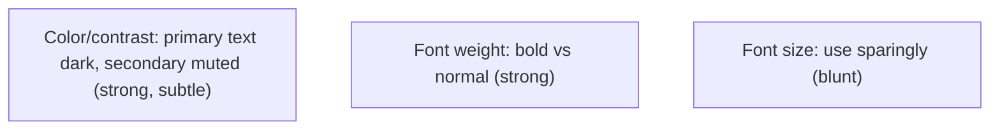
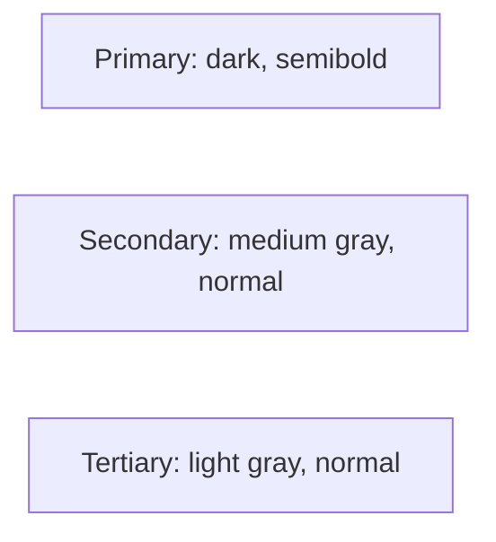
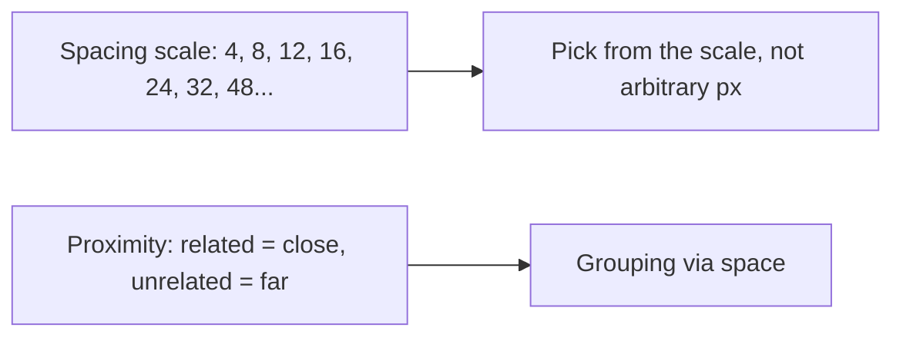

# Practical Visual Design - Complete Professional Guide

> **Category:** 06_web_and_frontend · **Language:** English

---

### Hierarchy, spacing, and color for developers
**Original guide written from first principles, current to 2026**

> **Original reference book (English).** This is an **independent, originally written** guide. It is not an extract, summary, or paraphrase of any third-party book; it teaches practical visual design from first principles with original examples. Canonical books are listed under **References** as pointers only. Each chapter follows the TO-BRAIN editorial standard (see `FILE_CONVENTIONS.md`).
>
> **Scope notice:** developers can produce good-looking interfaces with a few concrete, learnable techniques — no art degree required. This guide covers visual hierarchy, spacing, and color used systematically, current to 2026 (design tokens, modern color).

---

## How to read this guide

| Level | Profile | Parts |
|-------|---------|-------|
| 1 — Beginner | Design-shy developer | Part I |
| 2 — Intermediate | Building a UI system | Part II |

**Target audience:** developers who want their UIs to look professional without a designer on hand.

**Structure of each chapter:** Introduction · Business context · Theoretical concepts · Architecture · Diagrams (Mermaid) · Real examples · Step by step · Complete examples · Exercises · Challenges · Checklist · Best practices · Anti-patterns · Troubleshooting · References.

> **Note on prerequisites.** Assumes basic CSS and the usability guide.

---

## Table of Contents

**Part I – The big levers**
1. Hierarchy without relying on font size
2. Spacing and a consistent scale

**Part II – Color**
3. Choosing and using color systematically

> **Status of this guide:** phased delivery. **Ready:** Part I (Ch. 1–2). **In progress:** Part II.

---

## Part I – The big levers

Good UI design isn't innate taste — it's a handful of concrete techniques applied consistently. The biggest wins come from **visual hierarchy** (making the right things stand out) and **spacing** (giving elements room and rhythm). Master these two and your interfaces look dramatically more professional.

---

## Chapter 1 — Hierarchy without font size

### 1.1 Introduction

Beginners reach for **font size** to show importance, but that's the weakest tool and quickly produces huge, clumsy text. Stronger levers for **hierarchy** are **font weight** and **color/contrast**: a slightly smaller but bolder, darker label often reads as more important than a giant light one. Use size sparingly; lean on weight and color.

### 1.2 Business context

Interfaces where everything competes for attention (or where importance is faked with ever-bigger text) look amateurish and slow users down. Establishing clear hierarchy with weight and contrast makes UIs feel polished and guides users efficiently — improving both perceived quality (trust) and task speed. It's a high-impact, low-effort lever any developer can pull.

### 1.3 Theoretical concepts: three hierarchy tools, ranked



To emphasize, **darken/raise contrast** and **increase weight** before increasing size. To de-emphasize, **lighten/mute** rather than shrink. Three text "levels" — primary (dark), secondary (medium gray), tertiary (light) — handle most needs without changing size much.

### 1.4 Architecture: emphasis via weight + color



### 1.5 Real example

**Scenario.** A card title and metadata where the developer made the title huge to stand out.

**Problem.** A 32px light title looks clumsy and the metadata still competes.

**Solution.** Modest size; use weight and color for the hierarchy.

**Implementation.**

```css
.card-title { font-size: 1.125rem; font-weight: 600; color: #111; }  /* primary: weight+dark */
.card-meta  { font-size: 0.875rem; font-weight: 400; color: #6b7280; } /* secondary: muted */
```

**Result.** The title clearly leads via weight and contrast, the metadata recedes via muting — polished, not shouty. Size barely changed.

**Future improvements.** Define these as design tokens (`--text-primary`, `--text-secondary`) for consistency across the app.

### 1.6 Exercises

1. Rank font size, weight, and color as hierarchy tools.
2. How do you de-emphasize text without shrinking it?
3. What three text levels cover most needs?

### 1.7 Challenges

- **Challenge.** Take a component where you used big font sizes for emphasis. Recreate the hierarchy using weight and color, keeping sizes modest. Compare polish.

### 1.8 Checklist

- [ ] I emphasize with weight/contrast before size.
- [ ] I de-emphasize by muting color, not shrinking.
- [ ] I use ~three text levels.
- [ ] Hierarchy is consistent across components.

### 1.9 Best practices

- Lead with weight and color for emphasis.
- Mute secondary/tertiary text with gray.
- Keep a small, consistent set of text styles.

### 1.10 Anti-patterns

- Ever-larger font sizes to force importance.
- Pure-black on pure-white everywhere (harsh, flat).
- Inconsistent ad-hoc text styles.

### 1.11 Troubleshooting

| Symptom | Likely cause | Action |
|---------|--------------|--------|
| UI looks clumsy/shouty | Size-based hierarchy | Use weight + color instead |
| Everything competes | No de-emphasis | Mute secondary text |
| Inconsistent look | Ad-hoc styles | Define text tokens/levels |

### 1.12 References

- A. Wathan, S. Schoger, *Refactoring UI* (2018) — https://www.refactoringui.com.
- R. Williams, *The Non-Designer's Design Book*, 4th ed. (Peachpit, 2014) — ISBN 978-0133966152.

---

## Chapter 2 — Spacing and a consistent scale

### 2.1 Introduction

**Spacing** — the empty room around and between elements — is one of the strongest signals of quality and one of the easiest to get right with a rule: use a **consistent spacing scale** instead of arbitrary pixel values. Generous, systematic whitespace makes interfaces feel calm, organized, and professional.

### 2.2 Business context

Cramped, inconsistently-spaced UIs feel cheap and are harder to scan, hurting both perceived quality and usability. Adopting a spacing scale (and erring toward more space) instantly raises the visual quality of an interface with near-zero design skill required. Consistent spacing also makes a codebase's UI predictable and faster to build, since spacing decisions become picking from a small set.

### 2.3 Theoretical concepts: a scale, and proximity



Two rules: (1) choose spacing from a **fixed scale** (often multiples of 4 or 8) so rhythm is consistent; (2) use **proximity** — closely related items get less space between them, unrelated items more — so grouping is communicated by space alone. When in doubt, **add more space**; beginners almost always use too little.

### 2.4 Architecture: space communicates grouping

```mermaid
flowchart TB
    label["Label"] -->|tight (related)| input["Input"]
    input -->|loose (separate)| nextfield["Next field group"]
```

### 2.5 Real example

**Scenario.** A form where label-to-input and field-to-field spacing are the same, so groups blur together.

**Problem.** Equal spacing everywhere means the eye can't tell which label belongs to which input.

**Solution.** Tight space within a field (label↔input), looser space between fields — and all values from a scale.

**Implementation.**

```css
:root { --space-1: 4px; --space-2: 8px; --space-4: 16px; --space-6: 24px; }
.field label { margin-bottom: var(--space-1); }   /* tight: label belongs to input */
.field       { margin-bottom: var(--space-6); }   /* loose: separates field groups */
```

**Result.** Each label visibly pairs with its input; field groups read as distinct. Spacing comes from a scale, so the rhythm is consistent and the form looks designed.

**Future improvements.** Expose the scale as design tokens and reuse it for padding/margins everywhere.

### 2.6 Exercises

1. Why use a spacing scale instead of arbitrary values?
2. How does proximity communicate grouping?
3. Which way do beginners usually err — too much or too little space?

### 2.7 Challenges

- **Challenge.** Take a cramped component. Apply a 4/8-based spacing scale and use proximity (tighter within groups, looser between). Does it look more professional?

### 2.8 Checklist

- [ ] Spacing comes from a fixed scale.
- [ ] Related items are closer; unrelated farther (proximity).
- [ ] I err toward more whitespace.
- [ ] Spacing is consistent across the UI.

### 2.9 Best practices

- Define and use a spacing scale (multiples of 4/8).
- Communicate grouping with proximity.
- Default to more space than feels necessary.

### 2.10 Anti-patterns

- Arbitrary, inconsistent pixel spacing.
- Equal spacing that blurs groups.
- Cramped layouts with no breathing room.

### 2.11 Troubleshooting

| Symptom | Likely cause | Action |
|---------|--------------|--------|
| Groups blur together | Uniform spacing | Use proximity to separate groups |
| UI feels cramped/cheap | Too little whitespace | Increase spacing from the scale |
| Inconsistent rhythm | Arbitrary values | Adopt a spacing scale |

### 2.12 References

- A. Wathan, S. Schoger, *Refactoring UI* (2018) — https://www.refactoringui.com.
- MDN/Material/Tailwind spacing-scale references (e.g. https://tailwindcss.com/docs/customizing-spacing).

---

> **End of Part I.** You can now apply the two biggest visual-design levers without design training: build hierarchy with font weight and color/contrast (using size sparingly) so importance reads clearly, and use a consistent spacing scale plus proximity so whitespace communicates grouping and the UI feels professional. **Part II — Color** (Chapter 3) covers choosing a usable palette (a few well-chosen hues with many shades), ensuring contrast for accessibility, and applying color systematically with design tokens.

<!--APPEND-PART-II-->
