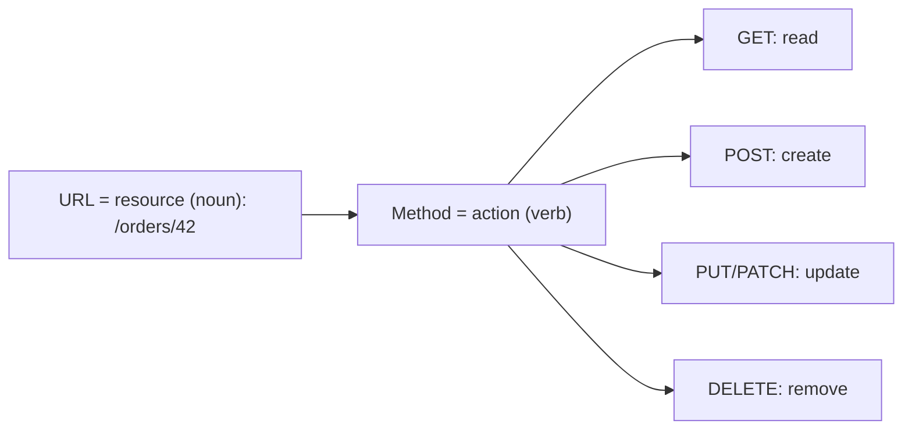
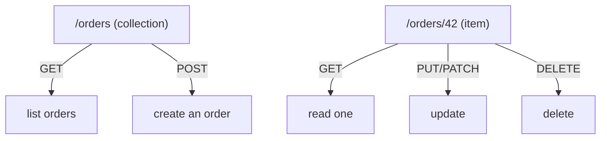
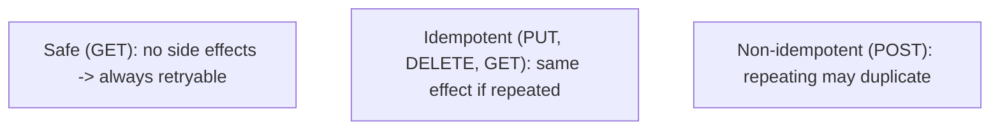
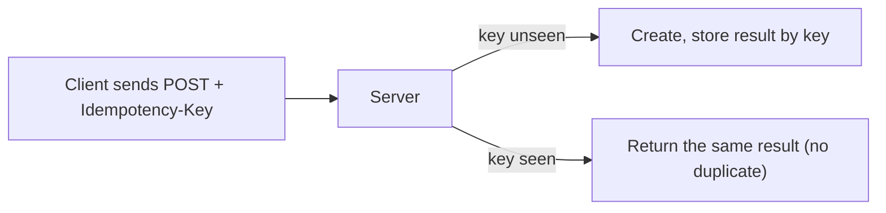
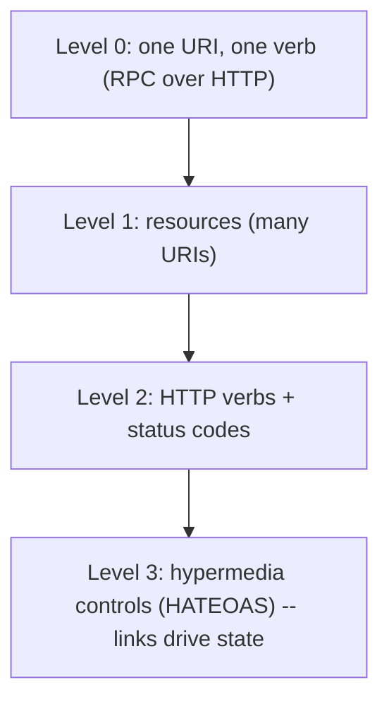

# RESTful API Design - Complete Professional Guide

> **Category:** 06_web_and_frontend · **Language:** English

---

### Resources, HTTP semantics, and hypermedia
**Original guide written from first principles, current to 2026**

> **Original reference book (English).** This is an **independent, originally written** guide. It is not an extract, summary, or paraphrase of any third-party book; it teaches REST API design from first principles with original examples. Canonical books are listed under **References** as pointers only. Each chapter follows the TO-BRAIN editorial standard (see `FILE_CONVENTIONS.md`).
>
> **Scope notice:** REST is an architectural style for networked APIs built on HTTP's own semantics — resources, methods, status codes, and (at its fullest) hypermedia. This guide covers designing clean REST APIs and the maturity model, current to 2026 (alongside notes on when GraphQL/gRPC fit better).

---

## How to read this guide

| Level | Profile | Parts |
|-------|---------|-------|
| 1 — Beginner | New to API design | Part I |
| 2 — Intermediate | Designing real APIs | Part II |

**Target audience:** backend and full-stack developers designing HTTP APIs.

**Structure of each chapter:** Introduction · Business context · Theoretical concepts · Architecture · Diagrams (Mermaid) · Real examples · Step by step · Complete examples · Exercises · Challenges · Checklist · Best practices · Anti-patterns · Troubleshooting · References.

> **Note on prerequisites.** Assumes basic HTTP (methods, status codes) and JSON.

---

## Table of Contents

**Part I – Resources & methods**
1. Resources and using HTTP methods correctly
2. Status codes and idempotency

**Part II – Maturity**
3. Hypermedia and the Richardson maturity model

> **Status of this guide:** complete. **Ready:** Part I (Ch. 1–2) and Part II (Ch. 3).

---

## Part I – Resources & methods

REST works *with* HTTP rather than tunneling RPC over it. You model the domain as **resources** (nouns) identified by URLs, and act on them with HTTP's standard **methods** (verbs) whose meanings are already defined. Honoring those semantics gives you caching, idempotency, and intermediary support for free.

---

## Chapter 1 — Resources and HTTP methods

### 1.1 Introduction

In REST, the design unit is the **resource** — a thing in your domain (an order, a user) addressed by a URL (`/orders/42`). You don't invent verbs in the URL; you use HTTP's **methods**: `GET` to read, `POST` to create, `PUT`/`PATCH` to update, `DELETE` to remove. The URL names *what*; the method says *what to do*.

### 1.2 Business context

APIs that ignore HTTP semantics (`POST /getOrder`, `GET /deleteUser`) break caching, confuse clients, and can't use standard tooling, proxies, or retries safely. A resource-oriented design that honors method semantics is predictable, cacheable, and interoperable — clients and infrastructure already know how `GET` and `DELETE` behave. This lowers integration cost and bugs across every consumer of the API.

### 1.3 Theoretical concepts: nouns in URLs, verbs in methods



Model collections (`/orders`) and items (`/orders/42`). Keep URLs noun-based and hierarchical; never put actions in the path. Each method has defined **semantics** (safe? idempotent?) that clients and caches rely on (Chapter 2).

### 1.4 Architecture: collection and item resources



This uniform interface means a client that understands one resource understands them all — the consistency that makes REST APIs easy to consume.

### 1.5 Real example

**Scenario.** An API to manage orders.

**Problem.** An RPC-style design (`POST /createOrder`, `POST /getOrder?id=42`, `POST /cancelOrder`) is inconsistent and uncacheable.

**Solution.** Resource-oriented endpoints using proper methods.

**Implementation.**

```http
POST   /orders            # create        -> 201 Created, Location: /orders/42
GET    /orders/42         # read          -> 200 OK (cacheable)
PATCH  /orders/42         # partial update -> 200 OK
DELETE /orders/42         # cancel/remove  -> 204 No Content
GET    /orders?status=open # filtered list -> 200 OK
```

**Result.** Consistent, cacheable, tool-friendly endpoints; a client that knows one resource knows them all. "Cancel" is expressed as a state change (PATCH) or DELETE, not a custom verb.

**Future improvements.** If "cancel" is a rich domain action, model it as a sub-resource state (`PATCH /orders/42 {status:"cancelled"}`) rather than `/cancelOrder`.

### 1.6 Exercises

1. What is a resource, and what belongs in the URL vs the method?
2. Why is `POST /getOrder` a poor design?
3. Give the right method for read, create, update, delete.

### 1.7 Challenges

- **Challenge.** Take an RPC-ish endpoint you have (verb in the URL). Redesign it as a resource with proper HTTP methods. What caching/retry benefits appear?

### 1.8 Checklist

- [ ] URLs name resources (nouns), not actions.
- [ ] I use HTTP methods for their defined meaning.
- [ ] Collections and items follow a consistent pattern.
- [ ] No verbs in the path.

### 1.9 Best practices

- Model the domain as resources with hierarchical, noun-based URLs.
- Use the method that matches the intent and its semantics.
- Keep the interface uniform across resources.

### 1.10 Anti-patterns

- RPC over HTTP (`/doThing`, verbs in URLs).
- `GET` requests that mutate state.
- Inconsistent endpoint shapes per resource.

### 1.11 Troubleshooting

| Symptom | Likely cause | Action |
|---------|--------------|--------|
| Clients confused by the API | RPC-style inconsistency | Redesign around resources |
| Can't cache reads | Reads via POST | Use GET for reads |
| Risky retries | Wrong/odd methods | Match methods to semantics (Ch. 2) |

### 1.12 References

- J. Webber, S. Parastatidis, I. Robinson, *REST in Practice* (O'Reilly, 2010) — ISBN 978-0596805821.
- R. Fielding, "Architectural Styles and the Design of Network-based Software Architectures" (2000), the REST dissertation.

---

## Chapter 2 — Status codes and idempotency

### 2.1 Introduction

HTTP **status codes** communicate outcomes in a standard vocabulary (2xx success, 4xx client error, 5xx server error), and method **idempotency** determines whether a request can be safely retried. Using both correctly is what makes an API robust over an unreliable network — clients know what happened and when it's safe to retry.

### 2.2 Business context

Networks fail, and clients retry. If your API uses vague status codes (200 for everything, errors hidden in the body) or non-idempotent operations where retries duplicate data (double-charging a card), you get data corruption and brittle integrations. Correct status codes and idempotency make the API safe to consume with standard retry logic — critical for reliability and for not double-processing money or orders.

### 2.3 Theoretical concepts: semantics that enable retries



- **Safe** methods (GET, HEAD) don't change state — freely retryable and cacheable.
- **Idempotent** methods (PUT, DELETE, plus GET) produce the same result whether called once or many times — safe to retry.
- **POST** is *not* idempotent by default — a retry may create duplicates. Make critical POSTs idempotent with an **idempotency key**.

Pair these with accurate status codes: `201` (created), `200` (ok), `204` (no content), `400` (bad request), `404` (not found), `409` (conflict), `422` (validation), `429` (rate limited), `500` (server error).

### 2.4 Architecture: idempotent create



An idempotency key lets a retried POST return the original result instead of creating a second resource — essential for payments and orders.

### 2.5 Real example

**Scenario.** A payment POST that clients may retry after a timeout.

**Problem.** A naive POST charges twice if the client retries an apparently-failed-but-actually-succeeded request.

**Solution.** Require an `Idempotency-Key`; the server dedupes on it.

**Implementation.**

```http
POST /payments
Idempotency-Key: 8f3a-...-key
{ "amount": 5000, "currency": "BRL" }

# First call: 201 Created, charge made, result stored under the key.
# Retry with same key: 200 OK, returns the SAME charge — no double-charge.
```

**Result.** Retries are safe; the customer is charged exactly once regardless of network retries. Status codes tell the client precisely what happened.

**Future improvements.** Set a TTL on stored keys; document which endpoints require idempotency keys.

### 2.6 Exercises

1. Distinguish safe, idempotent, and non-idempotent methods.
2. Why is POST not idempotent, and how do you make it so?
3. Map three outcomes to the right status codes.

### 2.7 Challenges

- **Challenge.** Find a non-idempotent create in your API that clients retry. Add idempotency-key handling and verify a duplicate request returns the original result.

### 2.8 Checklist

- [ ] I return accurate, specific status codes.
- [ ] Safe methods have no side effects.
- [ ] Idempotent methods are truly repeatable.
- [ ] Critical POSTs support idempotency keys.

### 2.9 Best practices

- Use the most specific correct status code.
- Keep GET safe and PUT/DELETE idempotent.
- Add idempotency keys to money/order-creating endpoints.

### 2.10 Anti-patterns

- `200 OK` for everything, errors hidden in the body.
- Non-idempotent operations clients retry, causing duplicates.
- Side effects in GET.

### 2.11 Troubleshooting

| Symptom | Likely cause | Action |
|---------|--------------|--------|
| Duplicate charges/orders | Non-idempotent POST + retries | Add idempotency keys |
| Clients can't handle errors | Vague status codes | Return specific codes |
| Retries unsafe | Wrong method semantics | Align methods with safety/idempotency |

### 2.12 References

- J. Webber, S. Parastatidis, I. Robinson, *REST in Practice* (O'Reilly, 2010) — ISBN 978-0596805821.
- MDN, "HTTP response status codes": https://developer.mozilla.org/en-US/docs/Web/HTTP/Status.

---

> **End of Part I.** You can now design REST APIs that work with HTTP rather than against it: model the domain as resources with noun-based URLs acted on by correctly-chosen methods, return specific status codes, and use idempotency (including idempotency keys for POST) so the API is safe to retry over unreliable networks. **Part II — Maturity** (Chapter 3) covers hypermedia (HATEOAS) and the Richardson maturity model, plus when GraphQL or gRPC is the better fit than REST.

---

## Part II – Maturity

Most APIs that call themselves "RESTful" are really HTTP-flavored RPC: resources and verbs, but the client hard-codes every URL it will ever call. That works until the server needs to change a URL, add a state, or guide the client through a workflow — then every client breaks. The Richardson maturity model names the rungs of this ladder, and **hypermedia** is its top rung: responses carry the links that tell the client what it can do next. Part II is about understanding that ladder, knowing how far up it is worth climbing, and recognizing when a different paradigm (GraphQL, gRPC) fits better than REST at all.

---

## Chapter 3 — Hypermedia and the Richardson maturity model

### 3.1 Introduction

The **Richardson Maturity Model (RMM)** classifies web APIs by how much of the web's architecture they actually use, in three rungs above a "level 0" of plain RPC-over-HTTP: **Level 1** introduces *resources* (many URIs instead of one endpoint); **Level 2** uses *HTTP verbs and status codes* correctly (the subject of Part I); **Level 3** adds *hypermedia controls* — **HATEOAS**, "hypermedia as the engine of application state" — where responses include links describing the next valid transitions. This chapter explains the model, shows what hypermedia buys you and what it costs, and closes by placing REST against GraphQL and gRPC so you choose the right tool, not the fashionable one.

### 3.2 Business context

The model is a shared vocabulary for "how RESTful is this, really?" — useful in design reviews and API governance. Its practical payoff is **evolvability and coupling**: a Level 2 API forces clients to hard-code URLs and out-of-band knowledge of the workflow, so any server-side change to URL structure or state machine is a breaking change coordinated across every consumer. Level 3 hypermedia lets the server publish the next steps as links, so it can relocate resources and evolve workflows while clients follow links by their *relation* (`rel`) rather than by a memorized path — the same property that lets websites restructure without breaking browsers. The trade-off is real: hypermedia adds complexity that pays off for long-lived, multi-client, evolving APIs and is over-engineering for a small internal service. Knowing where on the ladder to stop is the business decision.

### 3.3 Theoretical concepts: the three rungs



Each rung builds on the last. **Level 1** breaks a single endpoint into many resource URIs. **Level 2** uses the uniform interface properly: GET to read, POST/PUT/PATCH/DELETE to change, with meaningful status codes — this is where most well-designed APIs live and where Part I left off. **Level 3** makes responses *self-describing*: alongside data, the server returns **links** (`self`, `next`, `cancel`, `pay`) telling the client which transitions are currently legal. The client navigates by following links identified by their relation, not by constructing URLs from documentation. Webber et al. note that most "RESTful" services in the wild are actually Level 1 — using HTTP as a transport, not as an application protocol.

### 3.4 Architecture: hypermedia drives the state machine


In a hypermedia API the server owns the workflow's state machine and exposes it as links. A freshly created order returns links to `cancel` and `payment`; once paid, those links disappear and a `receipt` link appears. The client doesn't encode "after creating, POST to /payment" — it discovers the `payment` link when (and only when) that action is valid. The server can change URLs, gate actions by permission, or add steps, and well-behaved clients keep working because they bind to **link relations**, not paths.

### 3.5 Real example

**Scenario.** A coffee-ordering API. Clients currently build every URL from docs: create at `POST /orders`, then `POST /payments?order=N`, then `GET /receipts/N`.

**Problem.** When the team splits payments onto a new service with different URLs — or wants to forbid paying an already-cancelled order — every client breaks, because the workflow lives in client code, not in the API.

**Solution.** Return hypermedia controls so the server drives the workflow.

**Implementation.**

```http
POST /orders            →  201 Created
{
  "id": 1, "status": "awaiting-payment", "total": "4.50",
  "_links": {
    "self":    { "href": "/orders/1" },
    "cancel":  { "href": "/orders/1", "method": "DELETE" },
    "payment": { "href": "/orders/1/payment", "method": "PUT" }
  }
}
```

After a successful `PUT /orders/1/payment`, the next representation drops `cancel`/`payment` and offers `receipt`:

```http
GET /orders/1           →  200 OK
{ "id": 1, "status": "paid",
  "_links": { "self": {"href":"/orders/1"}, "receipt": {"href":"/orders/1/receipt"} } }
```

The client logic becomes: *follow the link whose `rel` matches the action I want, if it exists.* A standard media type such as **HAL** (`application/hal+json`) gives `_links` a documented shape.

**Result.** The server can move the payment resource, reorder steps, or hide actions by state, and clients that navigate by relation keep working. The set of available links *is* the documentation of what's currently possible.

**Future improvements.** Adopt a richer hypermedia format (HAL, JSON:API, or Siren) with link relations registered in a profile; advertise available actions per user permission; pair with conditional requests (ETags) from Part I for safe concurrent updates.

### 3.6 When REST is not the answer

REST excels at resource-shaped, cacheable, evolvable APIs over HTTP. It is *not* always the best fit:

- **GraphQL** suits clients that need to fetch exactly the fields they want across a graph of related data in one round trip, avoiding REST's over-/under-fetching — at the cost of HTTP caching and a new query layer. (See the dedicated GraphQL guide in `14_frameworks/`.)
- **gRPC** suits low-latency, high-throughput *internal* service-to-service calls with strict schemas (Protocol Buffers) and streaming — at the cost of browser-friendliness and human-readable payloads.

Choose by the consumer and the shape of the data, not by trend.

### 3.7 Exercises

1. Name the three rungs of the Richardson maturity model above Level 0.
2. What does HATEOAS let the server change without breaking conformant clients?
3. Give one scenario where GraphQL fits better than REST, and one for gRPC.

### 3.8 Challenges

- **Challenge.** Take a Level 2 endpoint and add HAL-style `_links` that expose the valid next actions for the resource's current state. Write a client that performs a two-step workflow purely by following link relations, never by constructing a URL.

### 3.9 Checklist

- [ ] I can place an API on the RMM and justify the target rung for its lifespan and client count.
- [ ] Resources are real URIs (Level 1) acted on by correct verbs/status codes (Level 2).
- [ ] Where evolvability matters, responses carry hypermedia links keyed by relation (Level 3).
- [ ] I use a standard hypermedia media type rather than ad hoc link fields.
- [ ] I choose REST vs GraphQL vs gRPC by consumer needs and data shape.

### 3.10 Best practices

- Reach Level 2 by default; add Level 3 hypermedia where multiple/long-lived clients and evolving workflows justify it.
- Bind clients to link relations, not hard-coded URLs.
- Use an established format (HAL/JSON:API/Siren) for consistency and tooling.
- Document available transitions as the links the server returns per state.

### 3.11 Anti-patterns

- "RESTful" APIs that are really Level 0/1 RPC (verbs in URLs, one endpoint).
- Clients hard-coding every URL and the entire workflow from prose docs.
- Inventing a bespoke link format per endpoint.
- Forcing REST onto problems better served by GraphQL or gRPC.

### 3.12 Troubleshooting

| Symptom | Likely cause | Action |
|---------|--------------|--------|
| Every URL change breaks clients | No hypermedia; URLs hard-coded | Return links by relation; bind clients to `rel` |
| "RESTful" API feels like RPC | Stuck at Level 0/1 | Model resources; use verbs/status codes (Level 2) |
| Clients over-fetch or under-fetch | Resource shape vs client need mismatch | Consider GraphQL for field-level selection |
| Internal calls too slow/chatty | HTTP/JSON overhead | Consider gRPC for internal service-to-service |

### 3.13 References

- J. Webber, S. Parastatidis & I. Robinson, *REST in Practice* (O'Reilly, 2010) — Ch. 1 (Web friendliness and the Richardson Maturity Model), Ch. 5 (Hypermedia Services). ISBN 978-0596805821.
- L. Richardson & M. Amundsen, *RESTful Web APIs* (O'Reilly, 2013) — hypermedia formats and link relations.
- MDN, "HTTP — Hypermedia / link relations": https://developer.mozilla.org/en-US/docs/Web/HTTP.

---

> **End of guide.** You can now design REST APIs that respect HTTP end to end: resources, correct methods, status codes, and idempotency (Part I), then situate them on the Richardson maturity model and add hypermedia for evolvable, low-coupling workflows — while recognizing when GraphQL or gRPC is the better fit (Part II).
