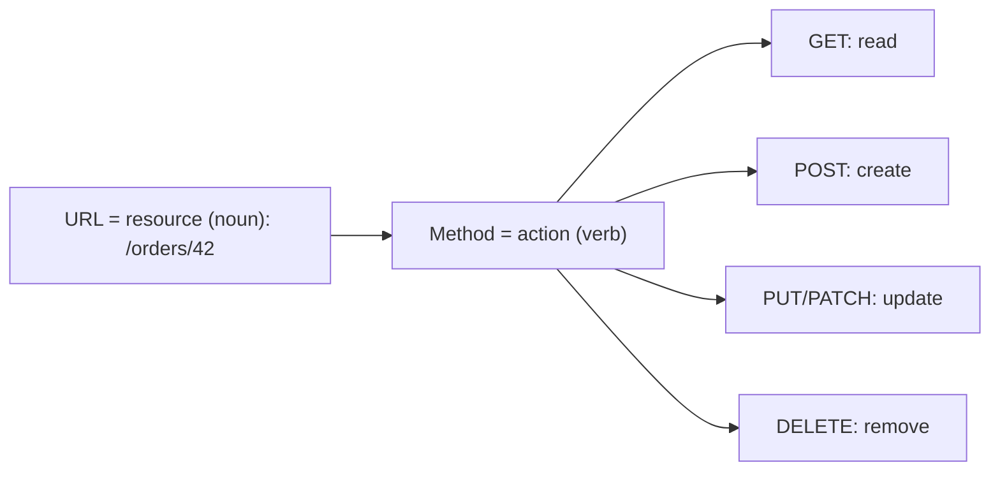
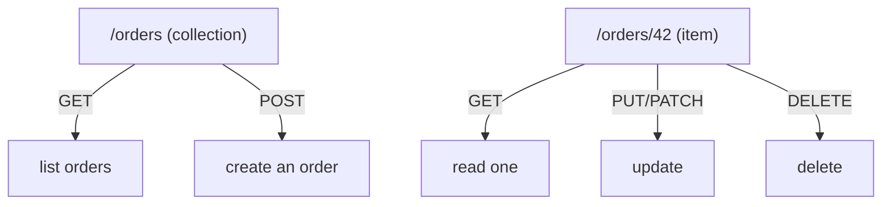
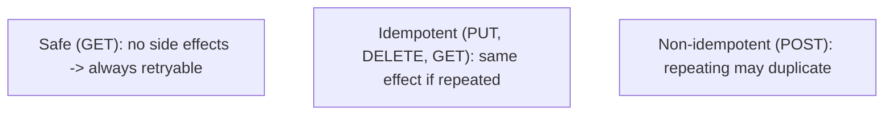
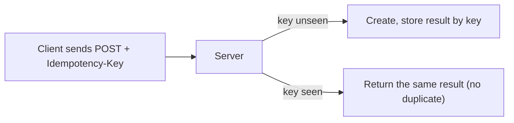

# RESTful API Design - Complete Professional Guide

> **Category:** 06_web_and_frontend · **Language:** English

---

### Resources, HTTP semantics, and hypermedia
**Original guide written from first principles, current to 2026**

> **Original reference book (English).** This is an **independent, originally written** guide. It is not an extract, summary, or paraphrase of any third-party book; it teaches REST API design from first principles with original examples. Canonical books are listed under **References** as pointers only. Each chapter follows the TO-BRAIN editorial standard (see `FILE_CONVENTIONS.md`).
>
> **Scope notice:** REST is an architectural style for networked APIs built on HTTP's own semantics — resources, methods, status codes, and (at its fullest) hypermedia. This guide covers designing clean REST APIs and the maturity model, current to 2026 (alongside notes on when GraphQL/gRPC fit better).

---

## How to read this guide

| Level | Profile | Parts |
|-------|---------|-------|
| 1 — Beginner | New to API design | Part I |
| 2 — Intermediate | Designing real APIs | Part II |

**Target audience:** backend and full-stack developers designing HTTP APIs.

**Structure of each chapter:** Introduction · Business context · Theoretical concepts · Architecture · Diagrams (Mermaid) · Real examples · Step by step · Complete examples · Exercises · Challenges · Checklist · Best practices · Anti-patterns · Troubleshooting · References.

> **Note on prerequisites.** Assumes basic HTTP (methods, status codes) and JSON.

---

## Table of Contents

**Part I – Resources & methods**
1. Resources and using HTTP methods correctly
2. Status codes and idempotency

**Part II – Maturity**
3. Hypermedia and the Richardson maturity model

> **Status of this guide:** phased delivery. **Ready:** Part I (Ch. 1–2). **In progress:** Part II.

---

## Part I – Resources & methods

REST works *with* HTTP rather than tunneling RPC over it. You model the domain as **resources** (nouns) identified by URLs, and act on them with HTTP's standard **methods** (verbs) whose meanings are already defined. Honoring those semantics gives you caching, idempotency, and intermediary support for free.

---

## Chapter 1 — Resources and HTTP methods

### 1.1 Introduction

In REST, the design unit is the **resource** — a thing in your domain (an order, a user) addressed by a URL (`/orders/42`). You don't invent verbs in the URL; you use HTTP's **methods**: `GET` to read, `POST` to create, `PUT`/`PATCH` to update, `DELETE` to remove. The URL names *what*; the method says *what to do*.

### 1.2 Business context

APIs that ignore HTTP semantics (`POST /getOrder`, `GET /deleteUser`) break caching, confuse clients, and can't use standard tooling, proxies, or retries safely. A resource-oriented design that honors method semantics is predictable, cacheable, and interoperable — clients and infrastructure already know how `GET` and `DELETE` behave. This lowers integration cost and bugs across every consumer of the API.

### 1.3 Theoretical concepts: nouns in URLs, verbs in methods



Model collections (`/orders`) and items (`/orders/42`). Keep URLs noun-based and hierarchical; never put actions in the path. Each method has defined **semantics** (safe? idempotent?) that clients and caches rely on (Chapter 2).

### 1.4 Architecture: collection and item resources



This uniform interface means a client that understands one resource understands them all — the consistency that makes REST APIs easy to consume.

### 1.5 Real example

**Scenario.** An API to manage orders.

**Problem.** An RPC-style design (`POST /createOrder`, `POST /getOrder?id=42`, `POST /cancelOrder`) is inconsistent and uncacheable.

**Solution.** Resource-oriented endpoints using proper methods.

**Implementation.**

```http
POST   /orders            # create        -> 201 Created, Location: /orders/42
GET    /orders/42         # read          -> 200 OK (cacheable)
PATCH  /orders/42         # partial update -> 200 OK
DELETE /orders/42         # cancel/remove  -> 204 No Content
GET    /orders?status=open # filtered list -> 200 OK
```

**Result.** Consistent, cacheable, tool-friendly endpoints; a client that knows one resource knows them all. "Cancel" is expressed as a state change (PATCH) or DELETE, not a custom verb.

**Future improvements.** If "cancel" is a rich domain action, model it as a sub-resource state (`PATCH /orders/42 {status:"cancelled"}`) rather than `/cancelOrder`.

### 1.6 Exercises

1. What is a resource, and what belongs in the URL vs the method?
2. Why is `POST /getOrder` a poor design?
3. Give the right method for read, create, update, delete.

### 1.7 Challenges

- **Challenge.** Take an RPC-ish endpoint you have (verb in the URL). Redesign it as a resource with proper HTTP methods. What caching/retry benefits appear?

### 1.8 Checklist

- [ ] URLs name resources (nouns), not actions.
- [ ] I use HTTP methods for their defined meaning.
- [ ] Collections and items follow a consistent pattern.
- [ ] No verbs in the path.

### 1.9 Best practices

- Model the domain as resources with hierarchical, noun-based URLs.
- Use the method that matches the intent and its semantics.
- Keep the interface uniform across resources.

### 1.10 Anti-patterns

- RPC over HTTP (`/doThing`, verbs in URLs).
- `GET` requests that mutate state.
- Inconsistent endpoint shapes per resource.

### 1.11 Troubleshooting

| Symptom | Likely cause | Action |
|---------|--------------|--------|
| Clients confused by the API | RPC-style inconsistency | Redesign around resources |
| Can't cache reads | Reads via POST | Use GET for reads |
| Risky retries | Wrong/odd methods | Match methods to semantics (Ch. 2) |

### 1.12 References

- J. Webber, S. Parastatidis, I. Robinson, *REST in Practice* (O'Reilly, 2010) — ISBN 978-0596805821.
- R. Fielding, "Architectural Styles and the Design of Network-based Software Architectures" (2000), the REST dissertation.

---

## Chapter 2 — Status codes and idempotency

### 2.1 Introduction

HTTP **status codes** communicate outcomes in a standard vocabulary (2xx success, 4xx client error, 5xx server error), and method **idempotency** determines whether a request can be safely retried. Using both correctly is what makes an API robust over an unreliable network — clients know what happened and when it's safe to retry.

### 2.2 Business context

Networks fail, and clients retry. If your API uses vague status codes (200 for everything, errors hidden in the body) or non-idempotent operations where retries duplicate data (double-charging a card), you get data corruption and brittle integrations. Correct status codes and idempotency make the API safe to consume with standard retry logic — critical for reliability and for not double-processing money or orders.

### 2.3 Theoretical concepts: semantics that enable retries



- **Safe** methods (GET, HEAD) don't change state — freely retryable and cacheable.
- **Idempotent** methods (PUT, DELETE, plus GET) produce the same result whether called once or many times — safe to retry.
- **POST** is *not* idempotent by default — a retry may create duplicates. Make critical POSTs idempotent with an **idempotency key**.

Pair these with accurate status codes: `201` (created), `200` (ok), `204` (no content), `400` (bad request), `404` (not found), `409` (conflict), `422` (validation), `429` (rate limited), `500` (server error).

### 2.4 Architecture: idempotent create



An idempotency key lets a retried POST return the original result instead of creating a second resource — essential for payments and orders.

### 2.5 Real example

**Scenario.** A payment POST that clients may retry after a timeout.

**Problem.** A naive POST charges twice if the client retries an apparently-failed-but-actually-succeeded request.

**Solution.** Require an `Idempotency-Key`; the server dedupes on it.

**Implementation.**

```http
POST /payments
Idempotency-Key: 8f3a-...-key
{ "amount": 5000, "currency": "BRL" }

# First call: 201 Created, charge made, result stored under the key.
# Retry with same key: 200 OK, returns the SAME charge — no double-charge.
```

**Result.** Retries are safe; the customer is charged exactly once regardless of network retries. Status codes tell the client precisely what happened.

**Future improvements.** Set a TTL on stored keys; document which endpoints require idempotency keys.

### 2.6 Exercises

1. Distinguish safe, idempotent, and non-idempotent methods.
2. Why is POST not idempotent, and how do you make it so?
3. Map three outcomes to the right status codes.

### 2.7 Challenges

- **Challenge.** Find a non-idempotent create in your API that clients retry. Add idempotency-key handling and verify a duplicate request returns the original result.

### 2.8 Checklist

- [ ] I return accurate, specific status codes.
- [ ] Safe methods have no side effects.
- [ ] Idempotent methods are truly repeatable.
- [ ] Critical POSTs support idempotency keys.

### 2.9 Best practices

- Use the most specific correct status code.
- Keep GET safe and PUT/DELETE idempotent.
- Add idempotency keys to money/order-creating endpoints.

### 2.10 Anti-patterns

- `200 OK` for everything, errors hidden in the body.
- Non-idempotent operations clients retry, causing duplicates.
- Side effects in GET.

### 2.11 Troubleshooting

| Symptom | Likely cause | Action |
|---------|--------------|--------|
| Duplicate charges/orders | Non-idempotent POST + retries | Add idempotency keys |
| Clients can't handle errors | Vague status codes | Return specific codes |
| Retries unsafe | Wrong method semantics | Align methods with safety/idempotency |

### 2.12 References

- J. Webber, S. Parastatidis, I. Robinson, *REST in Practice* (O'Reilly, 2010) — ISBN 978-0596805821.
- MDN, "HTTP response status codes": https://developer.mozilla.org/en-US/docs/Web/HTTP/Status.

---

> **End of Part I.** You can now design REST APIs that work with HTTP rather than against it: model the domain as resources with noun-based URLs acted on by correctly-chosen methods, return specific status codes, and use idempotency (including idempotency keys for POST) so the API is safe to retry over unreliable networks. **Part II — Maturity** (Chapter 3) covers hypermedia (HATEOAS) and the Richardson maturity model, plus when GraphQL or gRPC is the better fit than REST.

<!--APPEND-PART-II-->
