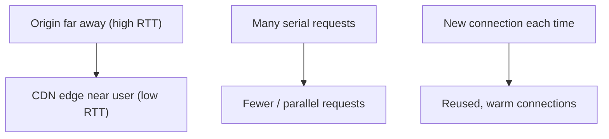
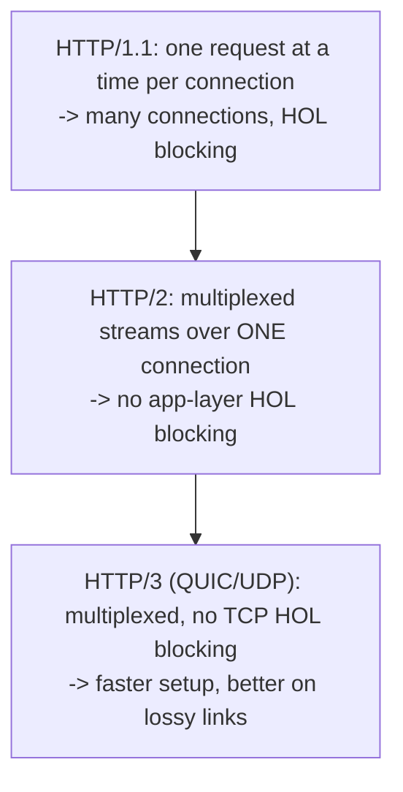
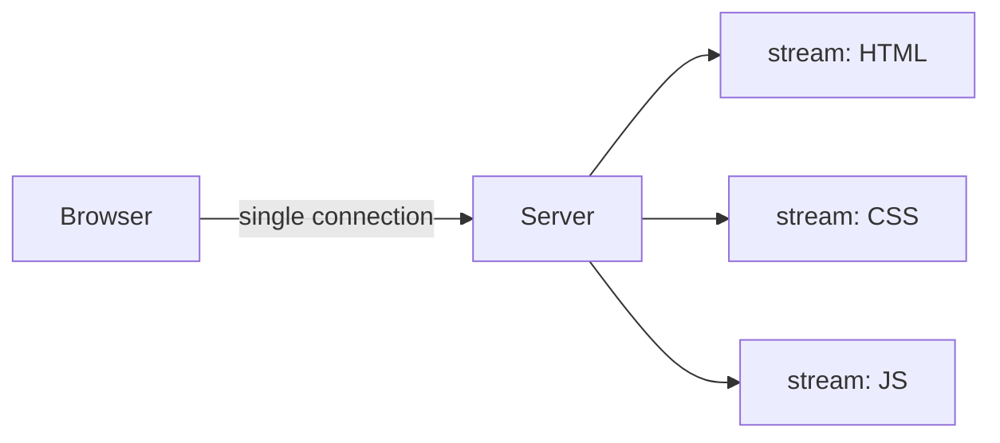
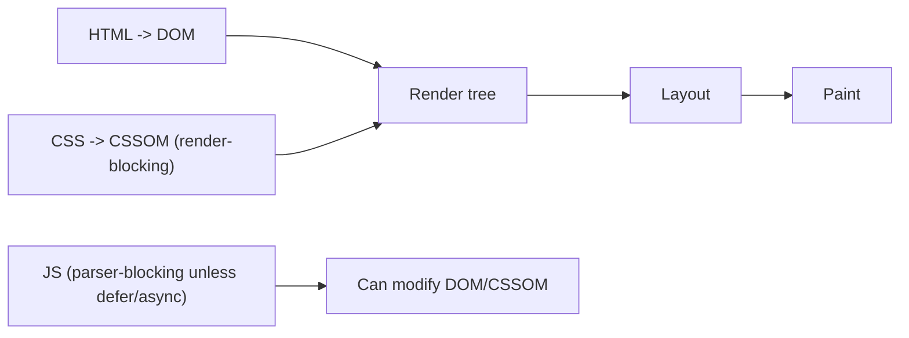
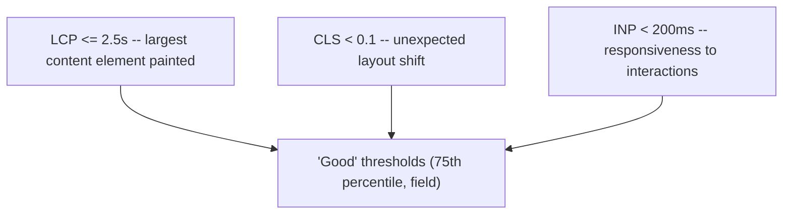

# Web Performance and Networking - Complete Professional Guide

> **Category:** 06_web_and_frontend · **Language:** English

---

### Latency, protocols, and the critical rendering path
**Original guide written from first principles, current to 2026**

> **Original reference book (English).** This is an **independent, originally written** guide. It is not an extract, summary, or paraphrase of any third-party book; it teaches web performance from first principles with original examples. Canonical books are listed under **References** as pointers only. Each chapter follows the TO-BRAIN editorial standard (see `FILE_CONVENTIONS.md`).
>
> **Scope notice:** web performance is mostly a story about **latency** and how the browser and network conspire to delay the first useful pixel. This guide covers why latency dominates, modern protocols (HTTP/2, HTTP/3), and the critical rendering path — current to 2026 (Core Web Vitals).

---

## How to read this guide

| Level | Profile | Parts |
|-------|---------|-------|
| 1 — Beginner | New to web perf | Part I |
| 2 — Intermediate | Optimizing loads | Part II |

**Target audience:** frontend and full-stack developers responsible for page speed.

**Structure of each chapter:** Introduction · Business context · Theoretical concepts · Architecture · Diagrams (Mermaid) · Real examples · Step by step · Complete examples · Exercises · Challenges · Checklist · Best practices · Anti-patterns · Troubleshooting · References.

> **Note on prerequisites.** Assumes basic HTTP and how a browser loads a page.

---

## Table of Contents

**Part I – The bottleneck**
1. Latency, not bandwidth, dominates
2. Modern protocols: HTTP/2 and HTTP/3

**Part II – Rendering**
3. The critical rendering path and Core Web Vitals

> **Status of this guide:** complete. **Ready:** Part I (Ch. 1–2) and Part II (Ch. 3).

---

## Part I – The bottleneck

The single most counterintuitive fact in web performance: for most page loads, **latency (round-trip time), not bandwidth, is the limit**. Adding bandwidth past a modest point barely helps; reducing the number and cost of round trips helps enormously. Understanding this reframes every optimization.

---

## Chapter 1 — Latency dominates

### 1.1 Introduction

**Latency** is the time for a packet to travel and return (round-trip time, RTT); **bandwidth** is how much data per second. Page loads are typically made of many small, dependent requests, so they're gated by **how many round trips** are needed and the RTT of each — not by raw throughput. This is why a fast connection can still feel slow on a high-latency link.

### 1.2 Business context

Speed is money: slower pages measurably reduce conversions, engagement, and search ranking. Teams often "fix" performance by chasing bandwidth or premature micro-optimizations, missing that round-trip count is the real lever. Understanding latency directs effort to what actually moves the needle — fewer round trips, closer servers (CDNs), reused connections — yielding real business gains in conversion and retention.

### 1.3 Theoretical concepts: round trips add up


Each step before the first byte costs round trips; sub-resources (CSS, JS, images) add more, some serially (dependency chains). Reducing round trips — fewer requests, connection reuse, CDNs to cut RTT distance, and parallelism — is the highest-leverage work. Bandwidth helps only for large transfers.

### 1.4 Architecture: cut and shorten round trips



The three levers: **shorten** each RTT (CDNs, edge), **reduce** the number of round trips (bundling where still helpful, fewer blocking requests), and **reuse** connections (covered by HTTP/2-3).

### 1.5 Real example

**Scenario.** A global app feels slow for users far from the single origin server.

**Problem.** Every asset is a high-RTT round trip to a distant origin; bandwidth is fine but latency is brutal.

**Solution.** Serve static assets from a CDN edge near users, cutting per-request RTT dramatically.

**Implementation (the lever).**

```text
Before: user (Brazil) -> origin (US-east), ~150ms RTT x many requests
After:  user (Brazil) -> CDN edge (São Paulo), ~10ms RTT
Result: per-request latency cut ~15x; page feels far faster, same bandwidth.
```

**Result.** Page load improves dramatically with no bandwidth change — because the bottleneck (RTT) was attacked directly.

**Future improvements.** Reduce blocking requests on the critical path (Chapter 3); preconnect to required origins.

### 1.6 Exercises

1. Why does latency usually matter more than bandwidth for page loads?
2. Name the three levers for reducing round-trip cost.
3. Why does a CDN help even with the same bandwidth?

### 1.7 Challenges

- **Challenge.** Open a page's network waterfall. Count the round trips before first contentful paint. Which are serial and could be cut or parallelized?

### 1.8 Checklist

- [ ] I optimize for round trips, not bandwidth.
- [ ] Static assets are served from a CDN/edge.
- [ ] Connections are reused (HTTP/2-3).
- [ ] Critical-path requests are minimized.

### 1.9 Best practices

- Serve assets from edges close to users.
- Reduce and parallelize critical-path requests.
- Reuse warm connections; preconnect to needed origins.

### 1.10 Anti-patterns

- Chasing bandwidth while ignoring round trips.
- Long serial dependency chains of blocking requests.
- A single distant origin for a global audience.

### 1.11 Troubleshooting

| Symptom | Likely cause | Action |
|---------|--------------|--------|
| Slow despite fast connection | Latency-bound, many RTTs | Cut/shorten round trips; use a CDN |
| Far-away users much slower | Distant origin | Serve from edge locations |
| Long waterfall before paint | Serial blocking requests | Parallelize / defer non-critical |

### 1.12 References

- I. Grigorik, *High Performance Browser Networking* (O'Reilly, 2013) — ISBN 978-1449344764; also https://hpbn.co.
- web.dev, "Core Web Vitals": https://web.dev/vitals/.

---

## Chapter 2 — Modern protocols: HTTP/2 and HTTP/3

### 2.1 Introduction

**HTTP/2** and **HTTP/3** exist largely to fight latency. HTTP/2 multiplexes many requests over one connection (no more head-of-line blocking at the HTTP layer, no need for many connections). **HTTP/3** goes further, running over **QUIC** (UDP-based) to remove TCP's head-of-line blocking and cut connection setup. Both reduce the round-trip and connection overhead that HTTP/1.1 suffered.

### 2.2 Business context

On HTTP/1.1, browsers opened many connections and still serialized requests per connection, and old optimizations (sprite sheets, domain sharding, concatenation) were workarounds for those limits. HTTP/2-3 make many of those hacks unnecessary or even counterproductive. Knowing what the protocol now does for free lets teams drop obsolete complexity and configure servers to actually deliver the latency wins users feel.

### 2.3 Theoretical concepts: multiplexing and QUIC



- **HTTP/2**: multiple concurrent **streams** over a single TCP connection; one slow response no longer blocks others at the HTTP layer (though TCP HOL blocking remains).
- **HTTP/3 / QUIC**: built on UDP, independent streams avoid TCP's head-of-line blocking and combine handshakes, shining on mobile/lossy networks.

### 2.4 Architecture: one connection, many streams



With one multiplexed connection, parallelism comes from streams, not many connections — so per-domain bundling and sharding hacks lose their point.

### 2.5 Real example

**Scenario.** A site still concatenates all JS into one huge bundle and shards assets across domains (HTTP/1.1-era tactics).

**Problem.** On HTTP/2, the giant bundle hurts caching (one byte change re-downloads everything) and sharding adds connection overhead.

**Solution.** Serve over HTTP/2-3 and split into cacheable modules; drop domain sharding.

**Implementation (modernization).**

```text
HTTP/1.1 era:  1 mega-bundle + 4 sharded domains  (workarounds)
HTTP/2-3:      smaller cacheable chunks over ONE multiplexed connection
               - a change re-downloads only the changed chunk
               - no per-domain connection overhead
```

**Result.** Better caching and parallelism with less complexity; the protocol provides the parallelism the hacks used to fake.

**Future improvements.** Enable HTTP/3 where supported; use `preload`/`preconnect` for critical resources.

### 2.6 Exercises

1. What problem does HTTP/2 multiplexing solve?
2. How does HTTP/3 improve on HTTP/2 for lossy networks?
3. Why are domain sharding and mega-bundles obsolete on HTTP/2-3?

### 2.7 Challenges

- **Challenge.** Check which HTTP version your site uses. If HTTP/2-3, find an HTTP/1.1-era hack (sharding, huge bundle) you can remove.

### 2.8 Checklist

- [ ] My site is served over HTTP/2 or HTTP/3.
- [ ] I rely on multiplexing instead of many connections.
- [ ] I've dropped obsolete sharding/concatenation hacks.
- [ ] Assets are split for effective caching.

### 2.9 Best practices

- Serve over HTTP/2/3 and let multiplexing handle parallelism.
- Split assets into cacheable units.
- Use preconnect/preload for critical origins and resources.

### 2.10 Anti-patterns

- Domain sharding on HTTP/2-3 (adds overhead).
- One mega-bundle that busts caching on any change.
- Ignoring HTTP/3 on mobile-heavy audiences.

### 2.11 Troubleshooting

| Symptom | Likely cause | Action |
|---------|--------------|--------|
| Poor caching, full re-downloads | Mega-bundle | Split into cacheable chunks |
| Extra connection overhead | Domain sharding on H2/3 | Consolidate to one origin |
| Slow on lossy mobile | TCP HOL blocking (H2) | Enable HTTP/3 (QUIC) |

### 2.12 References

- I. Grigorik, *High Performance Browser Networking* (O'Reilly, 2013) — ISBN 978-1449344764; also https://hpbn.co.
- MDN, "Evolution of HTTP": https://developer.mozilla.org/en-US/docs/Web/HTTP/Basics_of_HTTP/Evolution_of_HTTP.

---

> **End of Part I.** You can now reason about web performance correctly: latency (round-trip count and RTT), not bandwidth, dominates most page loads, so you cut and shorten round trips with CDNs, connection reuse, and fewer critical-path requests — and you let HTTP/2/3 multiplexing provide parallelism, retiring HTTP/1.1-era hacks. **Part II — Rendering** (Chapter 3) covers the browser's critical rendering path and the Core Web Vitals (LCP, CLS, INP) that measure real user-perceived performance.

---

## Part II – Rendering

Getting the bytes to the browser quickly (Part I) is only half the story. The other half is what the browser *does* with them: parse markup and styles, build the render tree, lay out, and paint. Resources on this **critical rendering path** block the first pixel, and a few render-blocking files can squander all the network gains you fought for. Part II covers that pipeline and then the user-centric metrics — the **Core Web Vitals** — that turn "feels fast" into numbers you can target, measure in the field, and hold a release to.

---

## Chapter 3 — The critical rendering path and Core Web Vitals

### 3.1 Introduction

The **critical rendering path (CRP)** is the sequence the browser runs to turn HTML, CSS, and JavaScript into pixels: parse HTML into the **DOM**, parse CSS into the **CSSOM**, combine them into the **render tree**, compute **layout**, and **paint**. CSS is **render-blocking** and synchronous `<script>` is **parser-blocking**, so the placement and size of those resources directly set the time to first paint. Layered on top are the **Core Web Vitals** — Google's user-centric metrics: **LCP** (loading), **CLS** (visual stability), and **INP** (responsiveness, which replaced FID in March 2024). This chapter explains the pipeline, how to keep it unblocked, and how to optimize each vital.

### 3.2 Business context

Rendering performance is revenue and reach. Core Web Vitals are a Google **ranking signal**, so they affect organic traffic, and they correlate with bounce and conversion: every extra second to LCP loses users, and layout shifts (CLS) cause mis-taps that erode trust. Because the vitals are measured on **real users** (field data via the Chrome UX Report), they capture the slow devices and networks a fast laptop hides — making them a fairer target than a single lab score. Treating them as a budget enforced in CI prevents the slow, invisible regression that performance work otherwise suffers as features pile on.

### 3.3 Theoretical concepts: the rendering pipeline



The browser builds the **DOM** by parsing HTML incrementally. In parallel it builds the **CSSOM** from stylesheets — but the CSSOM is **render-blocking**: nothing paints until CSS is parsed, because styles could change every box. A synchronous `<script>` is **parser-blocking**: it pauses DOM construction (it might `document.write`) and must wait for any pending CSSOM (it might read computed styles). Hence the classic rule "styles in the `<head>`, scripts at the end / `defer`": get CSS down fast, and keep JavaScript off the critical path with `defer` (runs after parse, in order) or `async` (runs as soon as it loads). Inlining **critical CSS** and deferring the rest shrinks the path to first paint.

### 3.4 Architecture: the three Core Web Vitals



- **LCP (Largest Contentful Paint)** — when the largest above-the-fold element (hero image, heading block) finishes rendering. Target **≤ 2.5 s**. Driven by server response (Part I), render-blocking resources, and large images. Fix with fast TTFB, preloading the LCP image, and removing render-blockers.
- **CLS (Cumulative Layout Shift)** — how much visible content jumps unexpectedly. Target **< 0.1**. Caused by images/ads/embeds without reserved dimensions and late-injected content. Fix with explicit `width`/`height` (or `aspect-ratio`) and space reserved for dynamic content.
- **INP (Interaction to Next Paint)** — the latency from a user interaction to the next paint, across the whole visit. Target **< 200 ms**. Hurt by long JavaScript tasks blocking the main thread. Fix by breaking up long tasks, reducing JS, and yielding to the browser.

Each vital uses the **75th percentile** of real users for its "good" rating.

### 3.5 Real example

**Scenario.** A content site has a 2 MB hero image, a large render-blocking CSS bundle, an analytics `<script>` in the `<head>`, and ads that inject without reserved space.

**Problem.** LCP is 4.8 s (blocking CSS + heavy hero), CLS is 0.28 (ads and an unsized hero shove text down), and INP is 320 ms (a long analytics task blocks input). The page fails all three vitals.

**Solution.** Unblock the path, size media, and defer scripts.

**Implementation.**

```html
<head>
  <style>/* inlined critical CSS for above-the-fold */</style>
  <link rel="preload" as="image" href="/hero.avif" fetchpriority="high">
  <link rel="stylesheet" href="/full.css" media="print" onload="this.media='all'"> <!-- non-blocking rest -->
  <script src="/analytics.js" defer></script>            <!-- off the critical path -->
</head>
<body>
    <!-- dimensions reserve space: no CLS -->
  <div class="ad-slot" style="min-height:250px"></div>      <!-- space reserved for late content -->
</body>
```

Plus: serve the hero as a compressed AVIF/WebP at display size, and split the long analytics task so it yields to input.

**Result.** Inlined critical CSS and a preloaded, right-sized hero bring LCP under 2.5 s; reserved dimensions drop CLS below 0.1; deferring and chunking the script brings INP under 200 ms. All three vitals pass at the 75th percentile.

**Future improvements.** Set a performance budget enforced in CI (e.g. Lighthouse CI), monitor field vitals via the Chrome UX Report / `web-vitals` library, and adopt `content-visibility` for below-the-fold sections to cut rendering work.

### 3.6 Exercises

1. Why is CSS render-blocking, and what does `defer` change about a script?
2. Give the "good" threshold for LCP, CLS, and INP.
3. Which metric does reserving image dimensions improve, and why?

### 3.7 Challenges

- **Challenge.** Profile a real page in Lighthouse and the field (CrUX). Identify its worst vital, apply the matching fix (inline critical CSS / preload the LCP image / size media / defer-and-chunk JS), and re-measure to confirm it crosses the "good" threshold at the 75th percentile.

### 3.8 Checklist

- [ ] CSS is minimal and critical-inlined; the rest loads non-blocking.
- [ ] Scripts use `defer`/`async`; none block the parser in the `<head>`.
- [ ] The LCP element is preloaded and right-sized; TTFB is low.
- [ ] Images/embeds/ads reserve space (`width`/`height`/`aspect-ratio`/`min-height`).
- [ ] Long JS tasks are broken up; vitals are measured on field data and budgeted in CI.

### 3.9 Best practices

- Keep the critical path short: fewer render-blocking bytes, critical CSS inlined.
- Optimize per vital — LCP (load), CLS (stability), INP (responsiveness) have different fixes.
- Measure real users (75th percentile), not just a lab score on a fast machine.
- Enforce a performance budget so regressions fail the build.

### 3.10 Anti-patterns

- Synchronous analytics/ad scripts in the `<head>`.
- Unsized images and late-injected content that shift the layout.
- One giant render-blocking CSS bundle for the whole site.
- Shipping megabytes of JavaScript that monopolize the main thread.

### 3.11 Troubleshooting

| Symptom | Likely cause | Action |
|---------|--------------|--------|
| Slow first paint / high LCP | Render-blocking CSS/JS, heavy hero | Inline critical CSS, defer JS, preload/right-size LCP image |
| Content jumps (high CLS) | Unsized media / late content | Set dimensions / `aspect-ratio`; reserve space |
| Sluggish interactions (high INP) | Long main-thread tasks | Break up tasks, reduce JS, yield to input |
| Lab good, users slow | Lab ignores real devices/networks | Track field vitals (CrUX / `web-vitals`) |

### 3.12 References

- I. Grigorik, *High Performance Browser Networking* (O'Reilly, 2013) — Ch. 10 (Primer on Web Performance: DOM, CSSOM, and the critical rendering path; browser optimization). ISBN 978-1449344764.
- Google, "Core Web Vitals" and "INP": https://web.dev/articles/vitals and https://web.dev/articles/inp.
- MDN, "Critical rendering path": https://developer.mozilla.org/en-US/docs/Web/Performance/Critical_rendering_path.

---

> **End of guide.** You can now optimize web performance end to end: cut and shorten network round trips and let modern protocols parallelize them (Part I), then keep the browser's critical rendering path unblocked and drive the Core Web Vitals — LCP, CLS, INP — to their "good" thresholds on real users (Part II).
