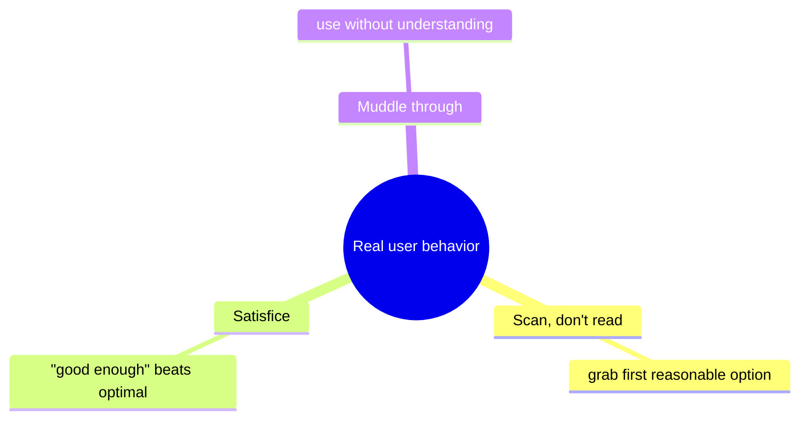
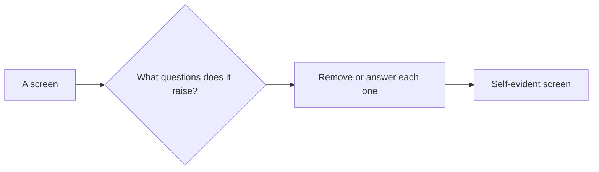
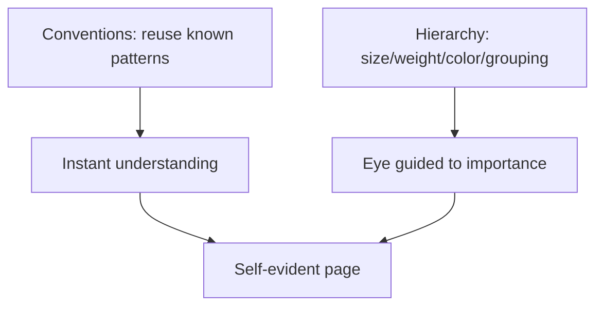
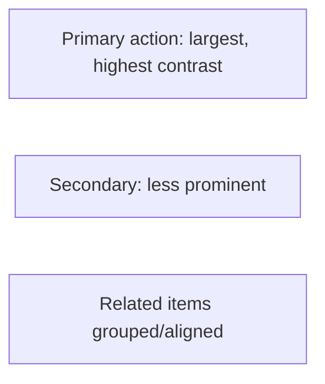

# Web Usability Principles - Complete Professional Guide

> **Category:** 06_web_and_frontend · **Language:** English

---

### Don't make users think: clarity, conventions, and self-evident design
**Original guide written from first principles, current to 2026**

> **Original reference book (English).** This is an **independent, originally written** guide. It is not an extract, summary, or paraphrase of any third-party book; it teaches web usability from first principles with original examples. Canonical books are listed under **References** as pointers only. Each chapter follows the TO-BRAIN editorial standard (see `FILE_CONVENTIONS.md`).
>
> **Scope notice:** usability is about reducing the effort a person spends figuring out an interface. This guide covers the core principle (don't make users think), conventions, and clear visual hierarchy — current to 2026.

---

## How to read this guide

| Level | Profile | Parts |
|-------|---------|-------|
| 1 — Beginner | New to usability | Part I |
| 2 — Intermediate | Improving interfaces | Part II |

**Target audience:** frontend developers, designers, and product people building interfaces people must use without training.

**Structure of each chapter:** Introduction · Business context · Theoretical concepts · Architecture · Diagrams (Mermaid) · Real examples · Step by step · Complete examples · Exercises · Challenges · Checklist · Best practices · Anti-patterns · Troubleshooting · References.

> **Note on prerequisites.** None beyond having used websites and apps.

---

## Table of Contents

**Part I – The core principle**
1. Don't make me think: self-evident design
2. Conventions and visual hierarchy

**Part II – Validating**
3. Cheap usability testing

> **Status of this guide:** phased delivery. **Ready:** Part I (Ch. 1–2). **In progress:** Part II.

---

## Part I – The core principle

The guiding rule of usability: a page should be **self-evident**. Users shouldn't have to puzzle out what things are or how to use them — every moment of confusion is friction that costs attention and goodwill. Most usability work is removing small questions ("Is this clickable?" "Where am I?") before they're asked.

---

## Chapter 1 — Don't make me think

### 1.1 Introduction

The central usability principle: **don't make users think** about how to use your interface. Every element should be obvious — what it is, whether it's clickable, what will happen. People don't read pages carefully; they scan, satisfice (pick the first reasonable option), and muddle through. Design for that reality and the interface feels effortless.

### 1.2 Business context

Confusion is abandonment: each "huh?" moment increases the chance a user gives up, and on the web a competitor is one click away. Self-evident design directly improves conversion, task completion, and satisfaction — and reduces support load. It's cheaper to remove confusion in design than to recover users lost to it. Clarity is a revenue lever, not a nicety.

### 1.3 Theoretical concepts: how people actually use sites



Design accordingly: make important things **obvious and prominent**, label things in plain words, and make clickable things look clickable. Reduce the **questions** the interface raises — "What is this?", "Can I click it?", "Did that work?" — because each unanswered one is friction.

### 1.4 Architecture: minimize questions per screen



### 1.5 Real example

**Scenario.** A signup page where users hesitate at a styled-but-ambiguous "Continue" element.

**Problem.** It's a `div` styled like text; users aren't sure it's a button, so they pause or miss it.

**Solution.** Make it unmistakably a button — obvious affordance, clear label of the outcome.

**Implementation.**

```html
<!-- AMBIGUOUS: looks like text, unclear if clickable -->
<div class="cta">Continue</div>

<!-- SELF-EVIDENT: obviously a button, says what happens -->
<button class="btn btn--primary">Create my account</button>
```

**Result.** No hesitation: it clearly looks clickable and the label states the outcome ("Create my account" beats vague "Continue"). One less question, smoother conversion.

**Future improvements.** Add a visible focus state and loading feedback so the click's result is obvious too.

### 1.6 Exercises

1. State the core usability principle in five words.
2. Name three things real users do instead of reading carefully.
3. Why is each "question" an interface raises a cost?

### 1.7 Challenges

- **Challenge.** Open a screen you built. List every question a first-time user might ask ("Is this clickable?"). Remove or answer the top three.

### 1.8 Checklist

- [ ] Important elements are obvious and prominent.
- [ ] Clickable things look clickable.
- [ ] Labels are plain and outcome-focused.
- [ ] The screen raises few questions.

### 1.9 Best practices

- Make affordances obvious; don't disguise buttons.
- Use plain, specific labels over clever or vague ones.
- Remove ambiguity before adding features.

### 1.10 Anti-patterns

- Mystery-meat navigation (unclear what's clickable).
- Clever labels that prioritize style over clarity.
- Dense screens where the primary action isn't obvious.

### 1.11 Troubleshooting

| Symptom | Likely cause | Action |
|---------|--------------|--------|
| Users miss the primary action | Not prominent/obvious | Make it visually dominant and clearly clickable |
| Hesitation on controls | Weak affordances | Style clickable things as clickable |
| Vague label confusion | Clever/abstract wording | Use plain, outcome-based labels |

### 1.12 References

- S. Krug, *Don't Make Me Think, Revisited*, 3rd ed. (New Riders, 2014) — ISBN 978-0321965516.
- J. Nielsen, "Usability Heuristics," https://www.nngroup.com/articles/ten-usability-heuristics/.

---

## Chapter 2 — Conventions and visual hierarchy

### 2.1 Introduction

Two tools make pages self-evident: **conventions** (established patterns users already know — logo top-left links home, a magnifier means search) and **visual hierarchy** (size, weight, color, and grouping that show what's important and how things relate). Following conventions and expressing hierarchy lets users understand a page at a glance, without learning it.

### 2.2 Business context

Reinventing conventions ("innovating" navigation) forces users to relearn basics, raising friction and abandonment for no benefit. Conventions are free comprehension — users transfer knowledge from every other site. Clear visual hierarchy guides the eye to what matters, speeding tasks and reducing errors. Together they cut the cognitive cost of every visit, which compounds across millions of sessions into real business impact.

### 2.3 Theoretical concepts: known patterns + clear emphasis



Use conventions unless you have a strong, tested reason not to. Express hierarchy so that **more important = more visually prominent**, and **related things look related** (proximity, alignment, consistent styling). The visual structure should mirror the logical structure.

### 2.4 Architecture: hierarchy mirrors meaning



### 2.5 Real example

**Scenario.** A dashboard where everything is the same size and weight.

**Problem.** No hierarchy — users can't tell the key metric from minor details, and the primary action competes with everything else.

**Solution.** Establish hierarchy: emphasize the key number and primary action; de-emphasize the rest; group related items.

**Implementation (hierarchy via emphasis, conceptual).**

```text
Before: all text 14px, same weight/color  -> flat, no focus
After:  key metric  -> 32px bold, high contrast
        primary CTA -> prominent button color
        secondary   -> muted, smaller
        related KPIs grouped in one card, aligned
```

**Result.** The eye lands on what matters first; the primary action stands out; related data reads as a group. Users grasp the screen instantly.

**Future improvements.** Apply consistent spacing and a type scale (see the visual-design guide) to make hierarchy systematic.

### 2.6 Exercises

1. Why follow UI conventions instead of inventing new ones?
2. Name three tools for creating visual hierarchy.
3. What does "related things look related" mean concretely?

### 2.7 Challenges

- **Challenge.** Take a flat screen. Establish hierarchy: make the single most important thing clearly dominant and group related items. Does comprehension improve?

### 2.8 Checklist

- [ ] I reuse established conventions.
- [ ] Visual prominence matches importance.
- [ ] Related items are visually grouped.
- [ ] The visual structure mirrors the logical one.

### 2.9 Best practices

- Follow conventions unless testing justifies breaking them.
- Make the most important element the most prominent.
- Group and align related content.

### 2.10 Anti-patterns

- Reinventing standard navigation/icons.
- Flat designs with no emphasis.
- Important and trivial elements given equal weight.

### 2.11 Troubleshooting

| Symptom | Likely cause | Action |
|---------|--------------|--------|
| Users confused by navigation | Broke conventions | Return to familiar patterns |
| Key info overlooked | No hierarchy | Emphasize what matters most |
| Page feels cluttered | No grouping | Group and align related items |

### 2.12 References

- S. Krug, *Don't Make Me Think, Revisited*, 3rd ed. (New Riders, 2014) — ISBN 978-0321965516.
- J. Tidwell, *Designing Interfaces*, 3rd ed. (O'Reilly, 2020) — ISBN 978-1492051961.

---

> **End of Part I.** You can now apply the core usability principle — make interfaces self-evident so users don't have to think — by designing for how people actually behave (scan, satisfice, muddle through), reusing conventions, and expressing visual hierarchy so prominence matches importance. **Part II — Validating** (Chapter 3) covers cheap, frequent usability testing — watching a few real users attempt tasks — as the reliable way to find the confusion you can't see yourself.

<!--APPEND-PART-II-->
