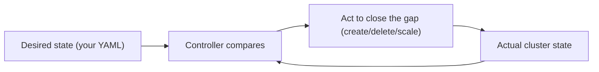
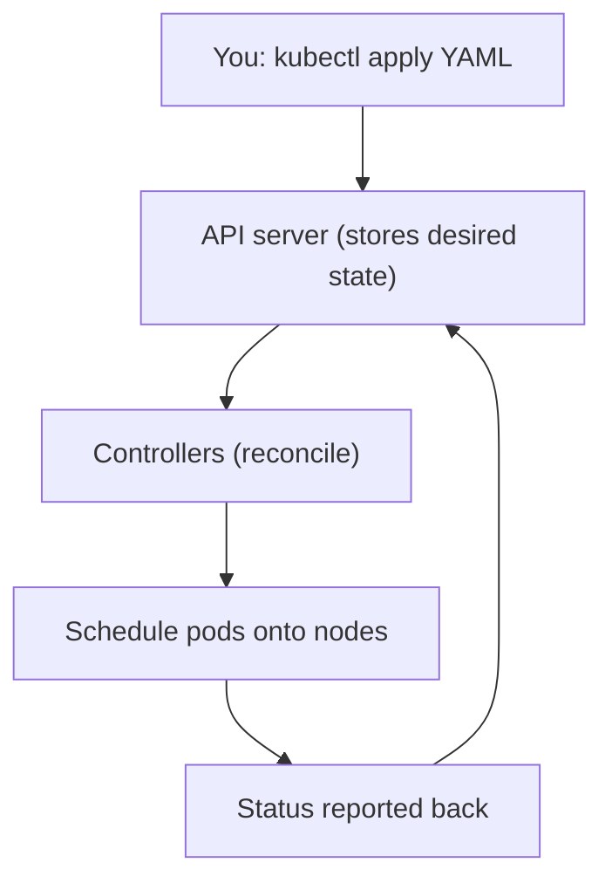
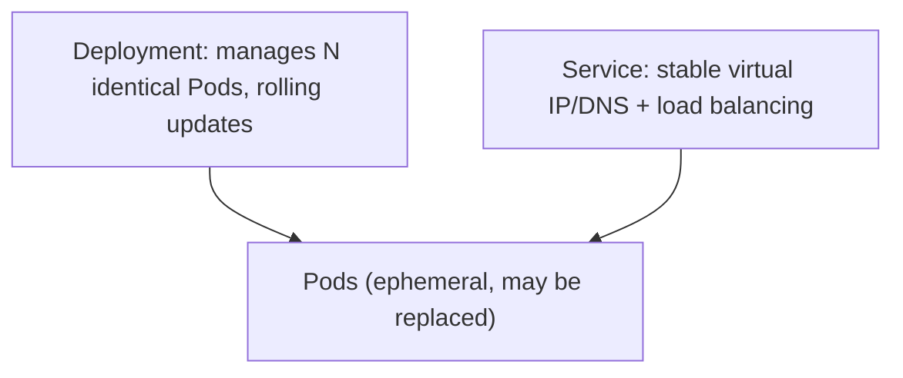
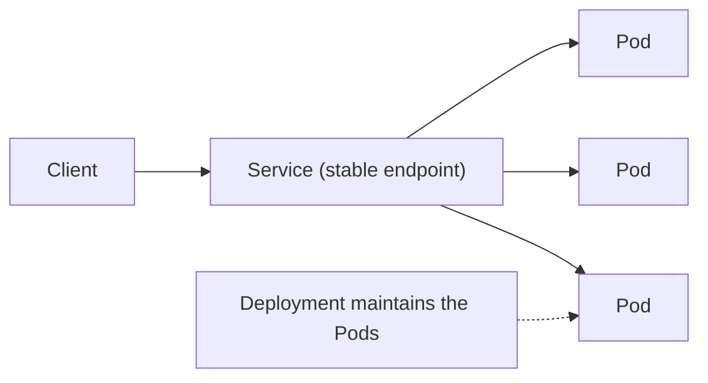
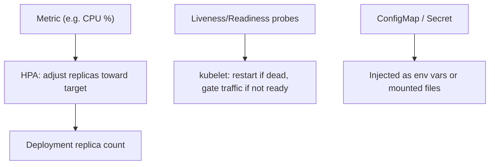
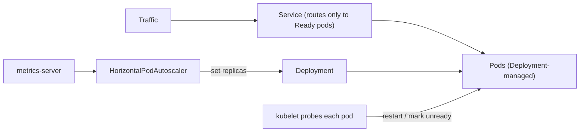

# Container Orchestration with Kubernetes - Complete Professional Guide

> **Category:** 07_devops_sre_operations · **Language:** English

---

### Pods, deployments, services, and declarative desired state
**Original guide written from first principles, current to 2026**

> **Original reference book (English).** This is an **independent, originally written** guide. It is not an extract, summary, or paraphrase of any third-party book; it teaches Kubernetes from first principles with original examples. Canonical books are listed under **References** as pointers only. Each chapter follows the TO-BRAIN editorial standard (see `FILE_CONVENTIONS.md`).
>
> **Scope notice:** Kubernetes orchestrates containers across a cluster — scheduling, scaling, healing, and networking them. This guide covers its core objects and the declarative, reconciliation model that defines how it works, current to 2026.

---

## How to read this guide

| Level | Profile | Parts |
|-------|---------|-------|
| 1 — Beginner | New to Kubernetes | Part I |
| 2 — Intermediate | Deploying workloads | Part II |

**Target audience:** developers and platform engineers running containerized workloads.

**Structure of each chapter:** Introduction · Business context · Theoretical concepts · Architecture · Diagrams (Mermaid) · Real examples · Step by step · Complete examples · Exercises · Challenges · Checklist · Best practices · Anti-patterns · Troubleshooting · References.

> **Note on prerequisites.** Assumes containers (Docker) and basic networking.

---

## Table of Contents

**Part I – Core model**
1. Declarative desired state and reconciliation
2. Pods, Deployments, and Services

**Part II – Operations**
3. Scaling, health, and config

> **Status of this edition:** complete for its declared scope. **Ready:** Parts I–II (Ch. 1–3).

---

## Part I – Core model

Kubernetes' power comes from one idea applied everywhere: you **declare the desired state**, and the system continuously works to make reality match it. You don't run imperative commands to start/stop containers; you describe what you want, and controllers reconcile the cluster toward it — scheduling, restarting, and scaling automatically.

---

## Chapter 1 — Declarative desired state

### 1.1 Introduction

In Kubernetes you submit **declarative** specifications — "I want 3 replicas of this container running" — to the API server, which stores the **desired state**. **Controllers** constantly compare desired state to actual state and act to close any gap (this is **reconciliation**). If a container dies, the controller notices the gap and starts a new one. You manage the *goal*, not the steps.

### 1.2 Business context

Imperative ops ("ssh in and restart it") don't scale and drift from any documented intent. Declarative, self-healing infrastructure means the system maintains itself toward a known-good state, recovering from failures automatically and making deployments repeatable and auditable (the desired state is version-controlled YAML). This reduces operational toil and outages, and is why Kubernetes became the standard substrate for running services at scale.

### 1.3 Theoretical concepts: the reconciliation loop



Everything in Kubernetes is an **object** with a desired `spec` and an observed `status`. Controllers run reconciliation loops: observe, diff, act, repeat. This loop is what makes the cluster self-healing — kill a pod and the loop recreates it to restore the declared replica count.

### 1.4 Architecture: API server + controllers



### 1.5 Real example

**Scenario.** You need a web service to always have 3 instances running, surviving node/pod failures.

**Problem.** Manually restarting crashed instances is error-prone and slow.

**Solution.** Declare 3 replicas; Kubernetes keeps that true automatically.

**Implementation (declarative spec).**

```yaml
apiVersion: apps/v1
kind: Deployment
metadata: { name: web }
spec:
  replicas: 3                 # desired state
  selector: { matchLabels: { app: web } }
  template:
    metadata: { labels: { app: web } }
    spec:
      containers:
        - name: web
          image: myorg/web:1.4.2
```

```bash
kubectl apply -f web.yaml    # submit desired state; controllers maintain 3 replicas
# kill a pod -> the Deployment controller starts a replacement automatically
```

**Result.** Three replicas are always maintained; a crashed pod or failed node is healed without human action. You manage intent (3 replicas), not individual containers.

**Future improvements.** Add health probes and resource requests (Chapter 3) so scheduling and healing are accurate.

### 1.6 Exercises

1. What does "declarative desired state" mean in Kubernetes?
2. What is a reconciliation loop?
3. How does the cluster self-heal a killed pod?

### 1.7 Challenges

- **Challenge.** Apply a Deployment with 2 replicas. Delete a pod and watch Kubernetes recreate it. Explain what closed the gap.

### 1.8 Checklist

- [ ] I declare desired state, not imperative steps.
- [ ] I understand controllers reconcile spec vs status.
- [ ] My manifests are version-controlled.
- [ ] I rely on self-healing rather than manual restarts.

### 1.9 Best practices

- Keep manifests in version control (GitOps).
- Express intent declaratively; let controllers act.
- Treat the cluster's desired state as the source of truth.

### 1.10 Anti-patterns

- Imperative `kubectl` edits that drift from manifests.
- Manually managing individual containers.
- Snowflake clusters configured by hand.

### 1.11 Troubleshooting

| Symptom | Likely cause | Action |
|---------|--------------|--------|
| Config drift | Imperative changes | Apply from version-controlled manifests |
| Pods not recovering | Wrong/no controller | Use a Deployment/ReplicaSet |
| Surprised by changes | Out-of-band edits | Reconcile from declared state |

### 1.12 References

- B. Burns, J. Beda, K. Hightower, *Kubernetes: Up and Running*, 3rd ed. (O'Reilly, 2022) — ISBN 978-1098110208.
- Kubernetes docs, "Concepts": https://kubernetes.io/docs/concepts/.

---

## Chapter 2 — Pods, Deployments, and Services

### 2.1 Introduction

Three objects cover most workloads. A **Pod** is the smallest deployable unit — one or more containers sharing network/storage. A **Deployment** manages a set of identical Pods (replicas, rolling updates, self-healing). A **Service** gives a stable network endpoint to a changing set of Pods. Together: Deployment runs your app, Service exposes it.

### 2.2 Business context

Pods are ephemeral — they come and go, with changing IPs — so you never address them directly. Deployments make running many copies and updating them safely routine, and Services provide the stable address and load balancing that let clients reach the app despite pod churn. Understanding this trio is the minimum to deploy a real service reliably; misusing it (e.g. addressing pods directly) causes brittle, broken connectivity.

### 2.3 Theoretical concepts: the trio



- **Pod** — your container(s) plus shared network/volume; ephemeral and replaceable.
- **Deployment** — declares replica count, handles rolling updates and rollbacks, recreates failed Pods.
- **Service** — a stable name/IP that load-balances to the current set of healthy Pods (selected by labels), so clients don't track individual Pod IPs.

### 2.4 Architecture: client → Service → Pods



### 2.5 Real example

**Scenario.** A frontend must reach a backend whose pods are recreated and rescheduled constantly.

**Problem.** Pod IPs change; hardcoding them breaks connectivity on every restart.

**Solution.** A Service gives the backend a stable DNS name; the frontend calls that.

**Implementation.**

```yaml
apiVersion: v1
kind: Service
metadata: { name: backend }
spec:
  selector: { app: backend }      # routes to any Pod with this label
  ports: [ { port: 80, targetPort: 8080 } ]
# frontend calls http://backend  (stable DNS) — never a Pod IP
```

**Result.** The frontend reaches the backend via the stable `backend` name; the Service load-balances across whatever healthy Pods exist, surviving pod churn and scaling. Connectivity no longer breaks on restart.

**Future improvements.** Add an Ingress/Gateway for external traffic; set readiness probes so the Service only routes to ready Pods.

### 2.6 Exercises

1. Why don't you address Pods directly?
2. What does a Deployment add over a bare Pod?
3. How does a Service find the right Pods?

### 2.7 Challenges

- **Challenge.** Deploy an app via a Deployment and expose it with a Service. Scale the Deployment and confirm the Service still routes correctly.

### 2.8 Checklist

- [ ] I run apps via Deployments, not bare Pods.
- [ ] I expose Pods through Services, not direct IPs.
- [ ] Services select Pods by labels.
- [ ] Rolling updates/rollbacks go through the Deployment.

### 2.9 Best practices

- Use Deployments for stateless apps; Services for stable access.
- Select Pods by clear, consistent labels.
- Let the Service handle load balancing and pod churn.

### 2.10 Anti-patterns

- Hardcoding Pod IPs.
- Running long-lived apps as bare Pods (no self-healing/updates).
- Inconsistent labels breaking Service selection.

### 2.11 Troubleshooting

| Symptom | Likely cause | Action |
|---------|--------------|--------|
| Connectivity breaks on restart | Addressing Pods directly | Use a Service's stable endpoint |
| No self-healing/rolling update | Bare Pod, no Deployment | Wrap in a Deployment |
| Service routes to nothing | Label selector mismatch | Align Service selector with Pod labels |

### 2.12 References

- B. Burns, J. Beda, K. Hightower, *Kubernetes: Up and Running*, 3rd ed. (O'Reilly, 2022) — ISBN 978-1098110208.
- Kubernetes docs, "Workloads" & "Services": https://kubernetes.io/docs/concepts/.

---

> **End of Part I.** You can now reason about Kubernetes via its core model — declare desired state and let controllers reconcile reality toward it (self-healing) — and the three workhorse objects: Pods (ephemeral units), Deployments (managing replicas and rolling updates), and Services (stable endpoints load-balancing across pod churn). **Part II — Operations** (Chapter 3) covers scaling (manual and autoscaling), health probes (liveness/readiness), and configuration/secrets so workloads are robust and properly wired.

---

## Part II – Operations

Running a workload is more than keeping the declared replica count alive. Production demands that the cluster **scale with load**, **route traffic only to instances that can serve it**, **restart instances that have wedged**, and **inject configuration without rebuilding images**. Kubernetes provides first-class objects for each: the HorizontalPodAutoscaler, liveness/readiness/startup probes, resource requests and limits, and ConfigMaps and Secrets. This chapter wires the core model of Part I into a robust, self-managing production workload.

---

## Chapter 3 — Scaling, health, and config

### 3.1 Introduction

Three operational concerns turn a bare Deployment into a production-grade workload. **Scaling** adjusts the replica count to match load — manually (`kubectl scale`) or automatically via a **HorizontalPodAutoscaler** (HPA) that watches a metric like CPU and changes `replicas` for you. **Health probes** tell Kubernetes whether each container is alive and whether it is ready to receive traffic, so the platform restarts wedged containers and keeps unready ones out of the Service. **Configuration** — non-secret settings in **ConfigMaps**, sensitive values in **Secrets**, plus **resource requests/limits** — wires apps without baking environment-specific values into the image.

### 3.2 Business context

Without these, a Deployment is fragile: it cannot absorb traffic spikes (fixed replica count), it sends requests to pods that are still starting or have silently hung (no probes), and it forces a rebuild for every config change (values baked into the image). Each gap maps to a real outage class — overload, error spikes during deploys, and risky redeploys for trivial config edits. Probes, autoscaling, and externalized config are the difference between a workload that needs constant babysitting and one the platform keeps healthy, right-sized, and reconfigurable on its own.

### 3.3 Theoretical concepts: scale, probe, configure



- **Liveness probe** — if it fails, the kubelet **restarts** the container (recovers a hung process).
- **Readiness probe** — if it fails, the pod is **removed from Service endpoints** (no traffic) but **not** restarted; it rejoins when ready. A **startup probe** protects slow-booting apps from premature liveness kills.
- **Requests/limits** — `requests` drive **scheduling** (and HPA math); `limits` cap usage. Together they set the pod's **QoS class** (Guaranteed/Burstable/BestEffort), which governs eviction order under pressure.
- **HPA** — scales replicas to keep an observed metric near a target; it needs accurate `requests` because CPU-target HPAs measure utilization as a fraction of the request.

### 3.4 Architecture: the control loops around a Deployment



### 3.5 Real example

**Scenario.** A checkout service has a fixed 3 replicas. Under flash-sale load it overloads; during deploys, the Service briefly routes to pods that are still warming caches, causing 500s; and a config change (payment timeout) requires a full image rebuild.

**Problem.** No autoscaling (overload), no readiness gating (errors during rollout), and config baked into the image (slow, risky changes).

**Solution.** Add resource requests, liveness/readiness probes, externalize the timeout to a ConfigMap, and attach an HPA on CPU.

**Implementation.**

```yaml
apiVersion: apps/v1
kind: Deployment
metadata: { name: checkout }
spec:
  replicas: 3
  selector: { matchLabels: { app: checkout } }
  template:
    metadata: { labels: { app: checkout } }
    spec:
      containers:
        - name: checkout
          image: myorg/checkout:2.1.0
          resources:                       # scheduling + HPA baseline
            requests: { cpu: "250m", memory: "256Mi" }
            limits:   { cpu: "500m", memory: "512Mi" }
          envFrom:
            - configMapRef: { name: checkout-config }   # externalized config
          readinessProbe:                  # gate traffic until warm
            httpGet: { path: /readyz, port: 8080 }
            initialDelaySeconds: 5
            periodSeconds: 5
          livenessProbe:                   # restart if wedged
            httpGet: { path: /healthz, port: 8080 }
            periodSeconds: 10
---
apiVersion: v1
kind: ConfigMap
metadata: { name: checkout-config }
data:
  PAYMENT_TIMEOUT_MS: "3000"               # change without rebuilding the image
---
apiVersion: autoscaling/v2
kind: HorizontalPodAutoscaler
metadata: { name: checkout }
spec:
  scaleTargetRef: { apiVersion: apps/v1, kind: Deployment, name: checkout }
  minReplicas: 3
  maxReplicas: 20
  metrics:
    - type: Resource
      resource:
        name: cpu
        target: { type: Utilization, averageUtilization: 70 }
```

**Result.** The HPA grows replicas toward 70% CPU during the sale and shrinks them afterward; the readiness probe keeps warming pods out of the Service so rollouts no longer emit 500s; the liveness probe recovers any wedged container; and the payment timeout changes with a `kubectl apply` of the ConfigMap (plus a rollout) instead of a rebuild.

**Future improvements.** Move `PAYMENT_TIMEOUT_MS` to a versioned config and roll deliberately; autoscale on a custom or external metric (queue depth, RPS) instead of CPU; add a PodDisruptionBudget so scaling/maintenance never drops below a safe replica count.

### 3.6 Exercises

1. Contrast a liveness probe and a readiness probe — what does Kubernetes do when each fails?
2. Why must an HPA target be backed by accurate resource `requests`?
3. When would you inject config as a mounted volume rather than environment variables?

### 3.7 Challenges

- **Challenge.** Take a Deployment, add readiness + liveness probes and CPU requests, attach an HPA (`minReplicas: 2`, `maxReplicas: 10`, 70% CPU), then generate load and watch `kubectl get hpa` scale replicas up and back down. Explain which control loop made each change.

### 3.8 Checklist

- [ ] Every container sets resource `requests` (and sensible `limits`).
- [ ] Liveness and readiness probes are defined and distinct.
- [ ] Traffic-bearing workloads gate on readiness before receiving requests.
- [ ] Config lives in ConfigMaps/Secrets, not baked into images.
- [ ] An HPA (or deliberate manual policy) governs replica count under load.

### 3.9 Best practices

- Make readiness reflect *true* serving capacity (dependencies reachable, caches warm); keep liveness cheap and local.
- Set `requests` from real measurements so scheduling and HPA math are accurate.
- Keep Secrets out of ConfigMaps and out of images; mount or inject them, and restrict access via RBAC.
- Pair an HPA with a PodDisruptionBudget and a minReplicas floor.

### 3.10 Anti-patterns

- A liveness probe that depends on a downstream service — a dependency blip restarts healthy pods and amplifies the outage.
- No `requests`, then wondering why the scheduler packs badly and the HPA misbehaves.
- Storing secrets in ConfigMaps or in the container image.
- Autoscaling on CPU when the real bottleneck is queue depth or latency.

### 3.11 Troubleshooting

| Symptom | Likely cause | Action |
|---------|--------------|--------|
| 500s during every rollout | No readiness probe; traffic hits warming pods | Add a readiness probe reflecting serving capacity |
| Healthy pods restart in a loop | Liveness probe too strict or depends on a downstream | Loosen timing; make liveness local; add a startup probe |
| HPA never scales | Missing metrics-server or missing CPU `requests` | Install metrics-server; set resource requests |
| Pods evicted first under pressure | BestEffort QoS (no requests/limits) | Set requests/limits to raise QoS class |
| Config change needs a rebuild | Values baked into the image | Externalize to a ConfigMap/Secret |

### 3.12 References

- B. Burns, J. Beda, K. Hightower, *Kubernetes: Up and Running*, 3rd ed. (O'Reilly, 2022) — ISBN 978-1098110208 — Ch. 5 "Health Checks & Resource Management" and Ch. 13 "ConfigMaps and Secrets".
- Kubernetes docs, "Configure Liveness, Readiness and Startup Probes" & "Horizontal Pod Autoscaling": https://kubernetes.io/docs/tasks/.

---

> **End of Part II — and of the guide.** You can now run a Kubernetes workload that manages itself in production: it **scales** to load via the HorizontalPodAutoscaler over accurate resource requests, **routes traffic only to Ready pods** and **restarts wedged ones** through readiness and liveness probes, and is **configured without rebuilds** via ConfigMaps and Secrets. Combined with Part I's declarative core model — desired state reconciled by controllers, exposed through Deployments and Services — this is the foundation for operating containerized services reliably at scale.
