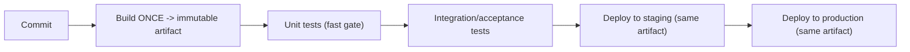
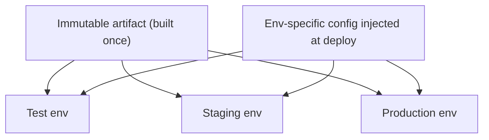
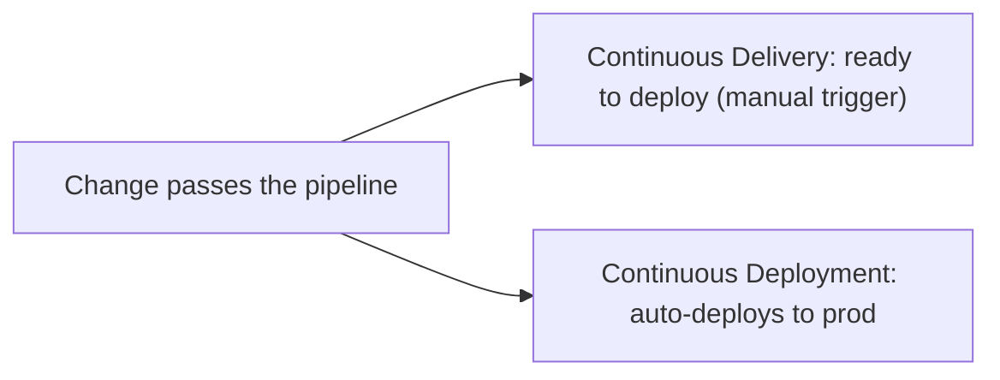
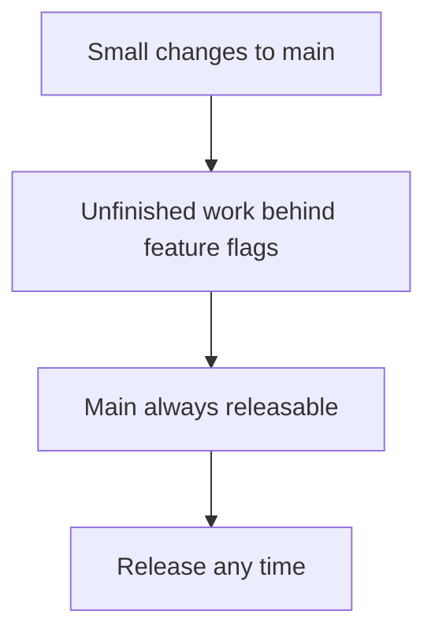
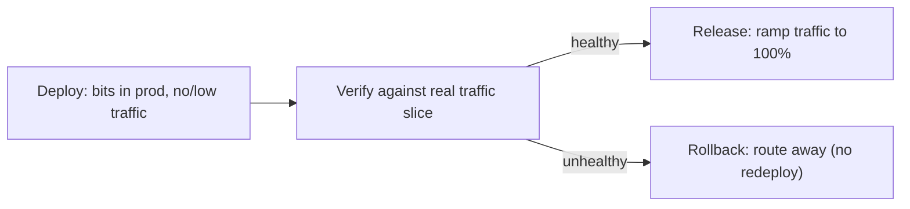
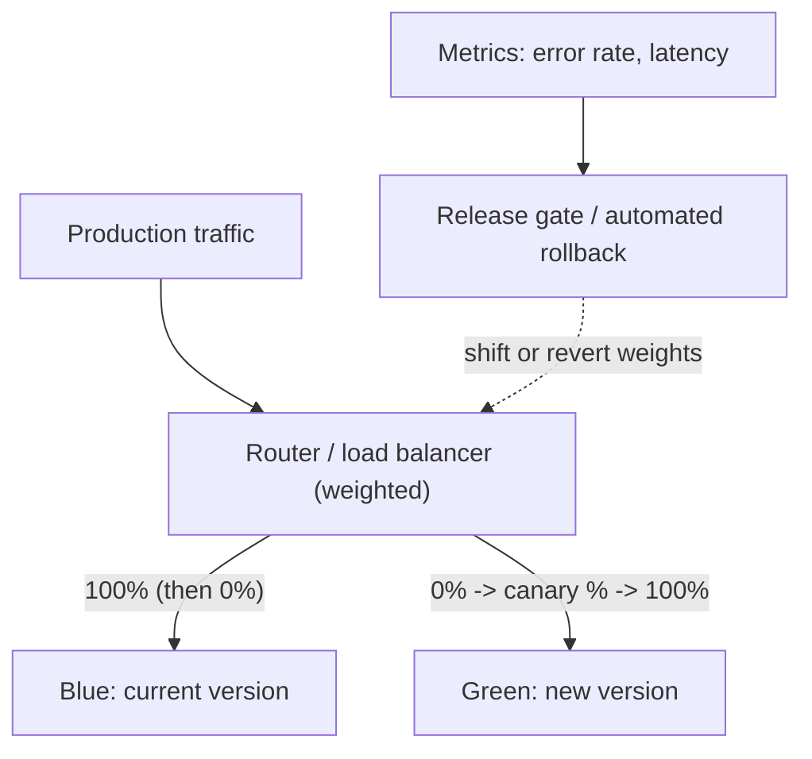

# Continuous Delivery and Deployment Pipelines - Complete Professional Guide

> **Category:** 07_devops_sre_operations · **Language:** English

---

### Build once, automate the path to production, deploy safely
**Original guide written from first principles, current to 2026**

> **Original reference book (English).** This is an **independent, originally written** guide. It is not an extract, summary, or paraphrase of any third-party book; it teaches continuous delivery from first principles with original examples. Canonical books are listed under **References** as pointers only. Each chapter follows the TO-BRAIN editorial standard (see `FILE_CONVENTIONS.md`).
>
> **Scope notice:** continuous delivery (CD) is the practice of keeping software **always releasable** by automating the path from commit to production. This guide covers the deployment pipeline, build-once principle, and safe release strategies, current to 2026.

---

## How to read this guide

| Level | Profile | Parts |
|-------|---------|-------|
| 1 — Beginner | New to CD | Part I |
| 2 — Intermediate | Building pipelines | Part II |

**Target audience:** developers and platform engineers automating delivery.

**Structure of each chapter:** Introduction · Business context · Theoretical concepts · Architecture · Diagrams (Mermaid) · Real examples · Step by step · Complete examples · Exercises · Challenges · Checklist · Best practices · Anti-patterns · Troubleshooting · References.

> **Note on prerequisites.** Assumes the DevOps-principles guide and basic CI.

---

## Table of Contents

**Part I – The pipeline**
1. The deployment pipeline and build-once
2. Always releasable: continuous delivery vs deployment

**Part II – Safe release**
3. Progressive delivery (blue-green, canary)

> **Status of this edition:** complete for its declared scope. **Ready:** Parts I–II (Ch. 1–3).

---

## Part I – The pipeline

Continuous delivery turns "preparing a release" from a manual, risky event into a routine, automated, repeatable process. The core artifact is the **deployment pipeline**: an automated path that takes every change through build, test, and deploy stages, providing fast feedback and a push-button (or fully automatic) release.

---

## Chapter 1 — The deployment pipeline and build-once

### 1.1 Introduction

A **deployment pipeline** is the automated implementation of your path from version control to production: each commit triggers a build, runs progressively broader tests, and can deploy through environments. A central rule is **build once**: produce a single immutable artifact and promote that *same* artifact through every environment — never rebuild per environment.

### 1.2 Business context

Manual, environment-specific builds and deploys are slow and a top source of "works in staging, breaks in prod" failures, because each environment runs subtly different bits. An automated pipeline with one immutable artifact makes releases fast, repeatable, and trustworthy — what ran in test is exactly what runs in production. This reliability is what lets a business release often and confidently instead of fearing every deploy.

### 1.3 Theoretical concepts: stages and immutability



Early stages are **fast** (fail quick on cheap checks); later stages are broader and slower. Configuration differs per environment (injected at deploy), but the **artifact** is identical everywhere. This eliminates "it built differently for prod" as a failure class.

### 1.4 Architecture: promote the same artifact



### 1.5 Real example

**Scenario.** A team rebuilds the app separately for staging and production.

**Problem.** A dependency resolves to different versions in the two builds; staging passes, production breaks — a classic environment drift bug.

**Solution.** Build one immutable artifact; promote it unchanged; inject only config per environment.

**Implementation (build-once promotion).**

```text
CI build (once):  produce app:1.4.2 (immutable image/artifact)
deploy test:      run app:1.4.2 + test config
deploy staging:   run app:1.4.2 + staging config   # SAME artifact
deploy prod:      run app:1.4.2 + prod config       # SAME artifact
# config injected via env vars/secrets, not baked per build
```

**Result.** Exactly the same bits run everywhere; "different build for prod" bugs vanish. Releases become predictable promotions of a tested artifact.

**Future improvements.** Sign artifacts and verify provenance; record which artifact version is in each environment.

### 1.6 Exercises

1. What is a deployment pipeline?
2. State the build-once principle and why it matters.
3. What differs per environment if the artifact doesn't?

### 1.7 Challenges

- **Challenge.** Check whether your app is built once and promoted, or rebuilt per environment. If rebuilt, design a single-artifact promotion flow.

### 1.8 Checklist

- [ ] Every change flows through an automated pipeline.
- [ ] One immutable artifact is built and promoted.
- [ ] Config is injected per environment, not baked in.
- [ ] Fast checks run first; broader tests later.

### 1.9 Best practices

- Build once; promote the same artifact everywhere.
- Order pipeline stages fast-to-slow for quick feedback.
- Inject environment config at deploy time.

### 1.10 Anti-patterns

- Rebuilding per environment (drift).
- Manual, snowflake deployments.
- Baking environment config into the artifact.

### 1.11 Troubleshooting

| Symptom | Likely cause | Action |
|---------|--------------|--------|
| Works in staging, breaks in prod | Per-environment rebuilds | Build once, promote the artifact |
| Slow feedback on failures | Slow checks run first | Reorder fast checks earlier |
| Config errors across envs | Config baked into builds | Inject config at deploy |

### 1.12 References

- J. Humble, D. Farley, *Continuous Delivery* (Addison-Wesley, 2010) — ISBN 978-0321601919.
- continuousdelivery.com: https://continuousdelivery.com.

---

## Chapter 2 — Always releasable

### 2.1 Introduction

The defining goal of CD is that software is **always in a releasable state** — `main` is never broken, and a release can happen at any time with low risk. **Continuous delivery** means every change is *ready* to deploy (deploy is a business decision, often push-button); **continuous deployment** goes further and deploys every passing change automatically. Both depend on keeping the mainline always green.

### 2.2 Business context

When the mainline is often broken or "not ready," releasing is a stressful, infrequent event, and value is stuck in inventory. Keeping software always releasable decouples *deploy* from *release decision*, so the business can ship whenever it wants — for a fix, an experiment, or a deadline — without a scramble. This agility (release on demand, low risk) is a major competitive advantage.

### 2.3 Theoretical concepts: delivery vs deployment



Both require: a mainline that's always green (trunk-based development, feature flags to hide unfinished work), comprehensive automated tests, and the ability to deploy safely (Chapter 3). The difference is only whether the final production deploy is automatic (deployment) or a human decision (delivery).

### 2.4 Architecture: keep main green with flags



### 2.5 Real example

**Scenario.** A team wants to merge a half-built feature without breaking releasability.

**Problem.** Merging incomplete work to main would block releases until it's done (or force a long-lived branch).

**Solution.** Merge small increments behind a **feature flag**, off in production, so main stays releasable while the feature is built.

**Implementation (feature flag).**

```text
merge small pieces to main continuously, each behind FEATURE_NEW_CHECKOUT=off
  -> main is always releasable (flag hides unfinished UI/logic)
  -> enable the flag for staff/canary, then everyone, when ready
  -> remove the flag after rollout
```

**Result.** The team integrates continuously without ever blocking releases; the feature ships by flipping a flag when complete. Main is always green and deployable.

**Future improvements.** Track flags and remove stale ones; use the flag to do a gradual rollout (Chapter 3).

### 2.6 Exercises

1. What does "always releasable" mean and why is it the goal?
2. Distinguish continuous delivery from continuous deployment.
3. How do feature flags keep main releasable?

### 2.7 Challenges

- **Challenge.** Find a long-lived branch in your repo. Plan how to land it in small flagged increments to main instead, keeping main releasable.

### 2.8 Checklist

- [ ] Main is always in a releasable state.
- [ ] Unfinished work is hidden behind flags.
- [ ] Comprehensive automated tests gate the mainline.
- [ ] Deploy is decoupled from the release decision.

### 2.9 Best practices

- Practice trunk-based development with small merges.
- Hide incomplete features behind flags.
- Keep the test suite trustworthy so main stays green.

### 2.10 Anti-patterns

- Long-lived feature branches blocking releasability.
- A frequently-broken mainline.
- Coupling deploy to a big manual release ceremony.

### 2.11 Troubleshooting

| Symptom | Likely cause | Action |
|---------|--------------|--------|
| Can't release on demand | Main not always green | Trunk-based dev + flags |
| Big merge conflicts/risk | Long-lived branches | Merge small increments behind flags |
| Release is a stressful event | Deploy coupled to readiness | Keep always-releasable; decouple deploy |

### 2.12 References

- J. Humble, D. Farley, *Continuous Delivery* (Addison-Wesley, 2010) — ISBN 978-0321601919.
- P. Hodgson, "Feature Toggles," https://martinfowler.com/articles/feature-toggles.html.

---

> **End of Part I.** You can now build a continuous delivery capability: an automated deployment pipeline that builds one immutable artifact and promotes it through fast-to-slow stages, keeping software always releasable via trunk-based development and feature flags — so deploying becomes a routine, low-risk decision rather than a risky event. **Part II — Safe release** (Chapter 3) covers progressive delivery: blue-green deployments and canary releases that expose new versions to a fraction of traffic first, with automatic rollback on trouble.

---

## Part II – Safe release

Part I made software *always releasable*; this part makes the **act of releasing** safe. Even a perfectly tested artifact carries risk at the moment it meets real production traffic — load, data, and integrations no test fully reproduces. Progressive delivery shrinks that risk by **decoupling deploy from release** and exposing a new version to a controlled slice of traffic first, with a fast, rehearsed path back. Two techniques anchor the chapter: blue-green deployments and canary releases.

---

## Chapter 3 — Progressive delivery (blue-green, canary)

### 3.1 Introduction

**Blue-green deployment** runs two production environments — *blue* (current) and *green* (new) — and switches all traffic from one to the other in a single routing change; if the new version misbehaves, you switch back instantly. **Canary releasing** routes a small fraction of traffic (say 1–5%) to the new version, watches its error and latency metrics, and ramps up only if it stays healthy — otherwise it rolls back having affected few users. Both rest on a key idea: **deploying** a version (putting the bits in production) is separate from **releasing** it (sending users to it).

### 3.2 Business context

A big-bang cutover exposes 100% of users to an unproven version at once; if it fails, everyone is affected and rollback is a scramble. Progressive delivery converts that all-or-nothing gamble into a measured, reversible step: blue-green makes rollback a routing flip (seconds, not a redeploy), and canary caps the blast radius of a bad release to a tiny user fraction. For the business this means releasing frequently *without* betting the whole user base on each one — the confidence that underpins true continuous delivery.

### 3.3 Theoretical concepts: deploy ≠ release



- **Blue-green** — two full environments; the router points at one. Cut over by repointing; roll back by repointing. Needs both environments runnable at once and a way to handle in-flight sessions and database schema compatibility.
- **Canary** — one environment, weighted routing. Start at a small percentage, compare canary vs baseline metrics, then ramp (5% → 25% → 100%) or abort. Needs good observability to judge "healthy".
- **Automated rollback** — define metric thresholds (error rate, p99 latency) up front; the pipeline aborts and reverts traffic automatically when a threshold is crossed, so a human isn't the failure detector.

### 3.4 Architecture: a router in front of versions



### 3.5 Real example

**Scenario.** A payments API releases a rewrite of its fraud-scoring path. The team cannot afford a bad version reaching all merchants, but wants to ship this week.

**Problem.** A full cutover would expose every merchant at once; a regression in scoring would mean mass false declines and a slow, manual rollback.

**Solution.** Deploy the new version alongside the old and release it as a canary behind a CD pipeline (e.g. a Jenkins pipeline) with metric-gated, automatic rollback, then blue-green for the final cutover.

**Implementation (pipeline stage, pseudocode).**

```groovy
// Jenkins declarative pipeline stage (illustrative)
stage('Canary release') {
  steps {
    sh 'deploy fraud-api:2.0.0 --to green --traffic 0'   // deploy, no traffic
    sh 'route --canary green --weight 5'                  // 5% to the canary
    script {
      def ok = waitForMetrics(window: '10m',
                              errorRate: '< 0.5%', p99: '< 250ms')
      if (ok) {
        sh 'route --canary green --weight 25'             // ramp
        sh 'route --promote green --weight 100'           // blue-green cutover
      } else {
        sh 'route --abort green --weight 0'               // automatic rollback
        error 'Canary failed health gate; rolled back'
      }
    }
  }
}
```

**Result.** The rewrite first saw 5% of traffic; metrics stayed within the gate, so the pipeline ramped to 25% and then promoted green to 100% — a blue-green cutover with blue kept warm for instant revert. Had scoring regressed, the gate would have routed traffic back to blue automatically, sparing the vast majority of merchants.

**Future improvements.** Add automated canary *analysis* (statistical comparison of canary vs baseline rather than fixed thresholds); ensure database changes are backward-compatible (expand/contract) so blue and green can run against the same schema; rehearse the rollback path regularly.

### 3.6 Exercises

1. Why does progressive delivery insist that "deploy" and "release" are different acts?
2. Contrast blue-green and canary — what does each optimize, and what does each require of the database schema?
3. Why should rollback be triggered by metrics rather than by a human noticing?

### 3.7 Challenges

- **Challenge.** Take a service and design a canary release: pick two SLIs (error rate, latency), define abort thresholds and a ramp schedule (e.g. 5% → 25% → 100%), and describe exactly what the automated rollback does when a threshold is crossed mid-ramp.

### 3.8 Checklist

- [ ] Deploy is decoupled from release (traffic is controlled separately from the running version).
- [ ] A blue-green or canary strategy is chosen deliberately per service.
- [ ] Rollback is a routing change, not a rebuild/redeploy.
- [ ] Health gates (error rate, latency) are defined *before* the release and enforced automatically.
- [ ] Database schema changes are backward-compatible across the two versions.

### 3.9 Best practices

- Keep the previous version warm (blue-green) so rollback is instant.
- Use expand/contract (backward-compatible) database migrations so two app versions coexist safely.
- Gate ramps on real SLIs and automate the abort; don't rely on humans watching dashboards.
- Start canaries small and ramp in steps, not one jump to 100%.

### 3.10 Anti-patterns

- A "rollback" that requires rebuilding and redeploying the old version (slow, error-prone).
- Coupling a breaking schema change to the deploy, so blue and green can't run together.
- Canarying without observability — you can't judge health, so the canary is theater.
- Big-bang cutover for high-risk changes because progressive delivery "seems complex".

### 3.11 Troubleshooting

| Symptom | Likely cause | Action |
|---------|--------------|--------|
| Rollback takes many minutes | Rollback means redeploy, not reroute | Keep prior version running; revert by routing |
| Canary looks fine but full release breaks | Canary % too small or wrong metrics | Ramp in steps; gate on user-facing SLIs |
| Errors right after cutover | Breaking DB schema change | Use expand/contract; make schema version-compatible |
| Bad release reached all users | No automated health gate | Add metric thresholds that auto-abort the ramp |

### 3.12 References

- J. Humble, D. Farley, *Continuous Delivery* (Addison-Wesley, 2010) — ISBN 978-0321601919 — Ch. 10 "Deploying and Releasing Applications" (Blue-Green Deployments; Canary Releasing).
- M. Soni, *Jenkins Essentials* (Packt, 2015) — pipeline orchestration of build/test/deploy stages.
- M. Fowler, "BlueGreenDeployment" & "CanaryRelease": https://martinfowler.com/bliki/.

---

> **End of Part II — and of the guide.** You can now release safely as well as build releasably: by **decoupling deploy from release** and putting a router in front of versions, you cut over with **blue-green** (instant reroute-based rollback) and limit blast radius with **canary** releases gated on real SLIs and automatic rollback. Together with Part I's build-once deployment pipeline and always-releasable trunk, this makes shipping to production a frequent, low-risk, reversible decision rather than an event to be feared.
