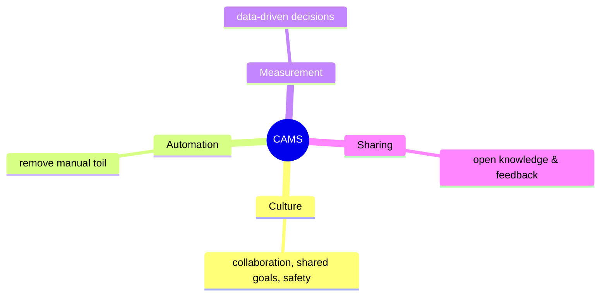
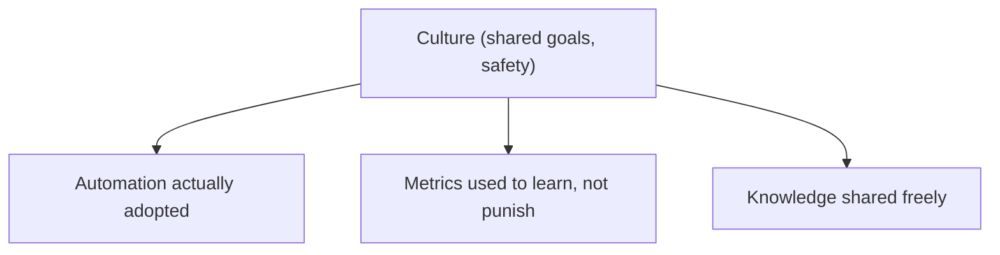
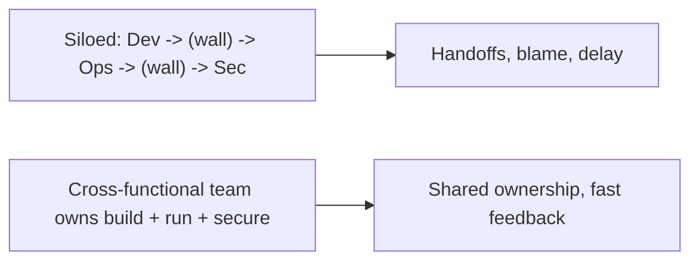
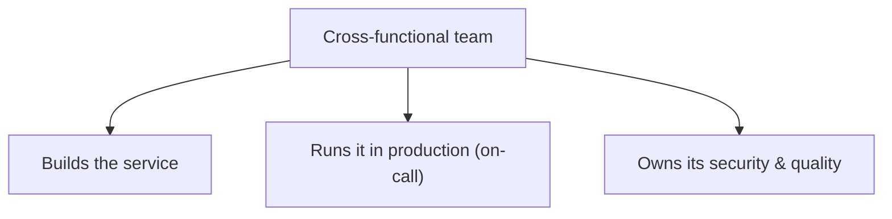

# DevOps Culture and Collaboration - Complete Professional Guide

> **Category:** 07_devops_sre_operations · **Language:** English

---

### CAMS: culture, automation, measurement, sharing
**Original guide written from first principles, current to 2026**

> **Original reference book (English).** This is an **independent, originally written** guide. It is not an extract, summary, or paraphrase of any third-party book; it teaches DevOps culture from first principles with original examples. Canonical books are listed under **References** as pointers only. Each chapter follows the TO-BRAIN editorial standard (see `FILE_CONVENTIONS.md`).
>
> **Scope notice:** DevOps is more culture than tooling — the tools fail without the collaboration and incentives that make them work. This guide covers the CAMS pillars and why culture comes first, current to 2026.

---

## How to read this guide

| Level | Profile | Parts |
|-------|---------|-------|
| 1 — Beginner | New to DevOps culture | Part I |
| 2 — Intermediate | Changing org culture | Part II |

**Target audience:** engineers, leads, and managers trying to make DevOps stick beyond tooling.

**Structure of each chapter:** Introduction · Business context · Theoretical concepts · Architecture · Diagrams (Mermaid) · Real examples · Step by step · Complete examples · Exercises · Challenges · Checklist · Best practices · Anti-patterns · Troubleshooting · References.

> **Note on prerequisites.** Assumes the DevOps-principles guide.

---

## Table of Contents

**Part I – Culture first**
1. CAMS and why culture leads
2. Breaking down silos: collaboration over handoffs

**Part II – Sustaining it**
3. Blameless culture and shared ownership

> **Status of this guide:** phased delivery. **Ready:** Part I (Ch. 1–2). **In progress:** Part II.

---

## Part I – Culture first

Organizations often "adopt DevOps" by buying tools and renaming a team, then wonder why nothing improves. DevOps is fundamentally about **how people work together** — collaboration, shared goals, and aligned incentives. Tools and automation amplify a good culture; they can't substitute for it. Culture is the foundation; everything else builds on it.

---

## Chapter 1 — CAMS and why culture leads

### 1.1 Introduction

**CAMS** names DevOps's four pillars: **Culture** (collaboration, shared responsibility), **Automation** (remove manual toil), **Measurement** (data-driven improvement), and **Sharing** (knowledge and feedback flow openly). The order matters: **culture comes first** — without it, automation and metrics are applied to a broken system and don't help.

### 1.2 Business context

Companies that treat DevOps as a tooling purchase or a team rename see little benefit, because the real bottleneck is organizational: silos, misaligned incentives, and blame. Investing in culture first — shared goals between dev and ops, psychological safety — unlocks the gains the tools promise. This is why two organizations with the same tools get wildly different results; the differentiator is culture, which determines whether the tools are used well.

### 1.3 Theoretical concepts: the four pillars



**Culture** sets shared goals so dev and ops succeed or fail together. **Automation** frees people from repetitive work (and reduces error). **Measurement** (see the DORA guide) grounds improvement in data. **Sharing** spreads learning so improvements propagate. Pillars reinforce each other, but a poor culture undermines all three of the others.

### 1.4 Architecture: culture enables the rest



### 1.5 Real example

**Scenario.** A company buys a CI/CD platform but keeps dev and ops as rival teams with opposing incentives (dev rewarded for features, ops for stability).

**Problem.** The tool exists, but the silo and conflicting incentives mean ops still blocks deploys and dev still throws work over the wall — no improvement.

**Solution.** Align incentives and goals first (shared ownership of delivery *and* reliability), then the tooling pays off.

**Implementation (culture change).**

```text
Before: dev metric = features shipped; ops metric = uptime  (opposed)
After:  shared goals = delivery throughput AND reliability (both teams own both)
        -> ops helps automate safe deploys; dev owns production health
        -> the CI/CD tool is finally used as intended
```

**Result.** With aligned incentives and shared ownership, collaboration replaces blame and the tooling delivers its promised gains. The change was cultural, not technical.

**Future improvements.** Add shared on-call/ownership so "works on my machine" becomes everyone's problem to prevent.

### 1.6 Exercises

1. What do the letters CAMS stand for?
2. Why must culture come before automation and metrics?
3. Why do two orgs with the same tools get different results?

### 1.7 Challenges

- **Challenge.** Identify a place where dev and ops (or two teams) have opposing incentives. Propose a shared goal that aligns them.

### 1.8 Checklist

- [ ] I treat culture as the foundation, not tooling.
- [ ] Dev and ops share goals and ownership.
- [ ] Automation and metrics serve learning, not blame.
- [ ] Knowledge is shared across teams.

### 1.9 Best practices

- Align incentives so teams succeed together.
- Invest in culture before/with tooling.
- Use metrics to learn, automation to free people, sharing to spread it.

### 1.10 Anti-patterns

- "DevOps" as a tool purchase or a renamed team.
- Opposing dev/ops incentives.
- Automation/metrics layered on a blame culture.

### 1.11 Troubleshooting

| Symptom | Likely cause | Action |
|---------|--------------|--------|
| Tools bought, no improvement | Culture not addressed | Align goals/incentives first |
| Dev vs ops conflict | Opposing metrics | Create shared ownership |
| Metrics resented | Used to punish | Use data for learning |

### 1.12 References

- J. Davis, K. Daniels, *Effective DevOps* (O'Reilly, 2016) — ISBN 978-1491926307.
- J. Willis, "What DevOps Means to Me" (origin of CAMS).

---

## Chapter 2 — Breaking down silos

### 2.1 Introduction

The original wall DevOps tears down is the one between **development** and **operations** — but the principle generalizes to any silo (security, QA, data). Silos create handoffs, finger-pointing, and slow feedback. DevOps replaces handoffs with **collaboration**: shared responsibility, embedded skills, and cross-functional teams that own a service end to end.

### 2.2 Business context

Handoffs between siloed teams are where delays, miscommunication, and blame accumulate — each boundary is friction and a place for work to stall or quality to drop. Breaking silos (cross-functional teams, shared on-call, embedded specialists) removes those boundaries, speeding flow and improving quality. It also builds resilience: when teams own the whole lifecycle, they design for operability and fix root causes instead of lobbing problems elsewhere.

### 2.3 Theoretical concepts: collaboration over handoff



Two common shapes: **cross-functional teams** that contain the skills to build and operate their service ("you build it, you run it"), or **embedding** specialists (ops, security) into product teams. Either way, the goal is **shared responsibility** so no one can throw problems over a wall.

### 2.4 Architecture: you build it, you run it



### 2.5 Real example

**Scenario.** Developers ship code and ops gets paged for its production issues at 3am.

**Problem.** Devs feel no consequence for unoperable code; ops resents cleaning up; quality suffers (a classic silo failure).

**Solution.** Shared on-call: the team that builds a service also operates it.

**Implementation (shared ownership).**

```text
Before: dev ships; ops carries the pager; blame flows across the wall
After:  the building team is on-call for its service
        -> devs feel production pain -> they build for operability
        -> better logging, alerts, resilience; fewer 3am pages overall
```

**Result.** With skin in the game, the team builds more operable software; incidents drop and the dev/ops wall dissolves into shared responsibility. Quality rises because consequences are shared.

**Future improvements.** Provide the team good observability and runbooks so ownership is supported, not just imposed.

### 2.6 Exercises

1. What problems do silos and handoffs create?
2. Name two ways to break silos.
3. Why does "you build it, you run it" improve quality?

### 2.7 Challenges

- **Challenge.** Find a handoff between two teams in your delivery flow. Propose how to remove that wall (cross-functional team or embedding).

### 2.8 Checklist

- [ ] Handoffs are minimized in our flow.
- [ ] Teams share responsibility across the lifecycle.
- [ ] Specialists are embedded or skills are cross-functional.
- [ ] Builders have a stake in operating their service.

### 2.9 Best practices

- Form cross-functional teams that own build and run.
- Replace handoffs with shared responsibility.
- Give teams the support (tools, runbooks) ownership requires.

### 2.10 Anti-patterns

- Throw-it-over-the-wall handoffs.
- Builders insulated from production consequences.
- Silos that point fingers across boundaries.

### 2.11 Troubleshooting

| Symptom | Likely cause | Action |
|---------|--------------|--------|
| Delays/blame at team boundaries | Silos and handoffs | Cross-functional ownership |
| Unoperable code shipped | No production skin-in-the-game | Shared on-call ("run what you build") |
| Specialists a bottleneck | Centralized silo | Embed them in product teams |

### 2.12 References

- J. Davis, K. Daniels, *Effective DevOps* (O'Reilly, 2016) — ISBN 978-1491926307.
- M. Skelton, M. Pais, *Team Topologies* (IT Revolution, 2019) — ISBN 978-1942788812.

---

> **End of Part I.** You can now treat DevOps as culture-first: the CAMS pillars (Culture, Automation, Measurement, Sharing) with culture as the enabler the others depend on, and the breaking of silos by replacing handoffs with shared responsibility and cross-functional ownership ("you build it, you run it"). **Part II — Sustaining it** (Chapter 3) covers blameless postmortems and psychological safety — the practices that keep a collaborative culture healthy so failures generate learning rather than fear.

<!--APPEND-PART-II-->
