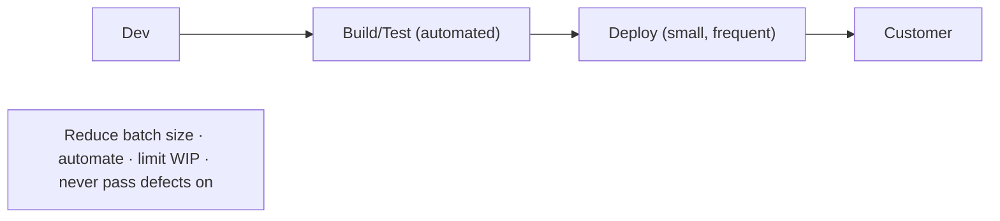
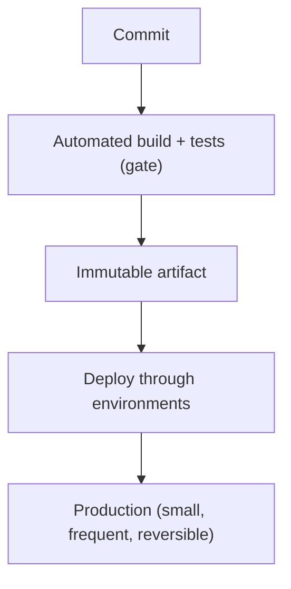
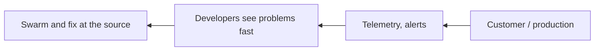
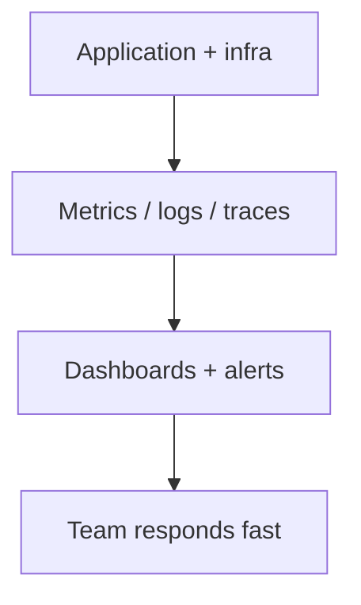

# DevOps Principles and Flow - Complete Professional Guide

> **Category:** 07_devops_sre_operations · **Language:** English

---

### The Three Ways: flow, feedback, and continual learning
**Original guide written from first principles, current to 2026**

> **Original reference book (English).** This is an **independent, originally written** guide. It is not an extract, summary, or paraphrase of any third-party book; it teaches DevOps principles from first principles with original examples. Canonical books are listed under **References** as pointers only. Each chapter follows the TO-BRAIN editorial standard (see `FILE_CONVENTIONS.md`).
>
> **Scope notice:** DevOps is a culture and set of practices that shorten the path from idea to production reliably. This guide covers its core principles — the Three Ways — and the flow-based thinking behind them, current to 2026.

---

## How to read this guide

| Level | Profile | Parts |
|-------|---------|-------|
| 1 — Beginner | New to DevOps | Part I |
| 2 — Intermediate | Improving delivery | Part II |

**Target audience:** engineers, leads, and managers improving how their organization ships and operates software.

**Structure of each chapter:** Introduction · Business context · Theoretical concepts · Architecture · Diagrams (Mermaid) · Real examples · Step by step · Complete examples · Exercises · Challenges · Checklist · Best practices · Anti-patterns · Troubleshooting · References.

> **Note on prerequisites.** None beyond having shipped software in a team.

---

## Table of Contents

**Part I – The Three Ways**
1. The First Way: flow
2. The Second Way: feedback

**Part II – Culture**
3. The Third Way: continual learning and experimentation

> **Status of this guide:** phased delivery. **Ready:** Part I (Ch. 1–2). **In progress:** Part II.

---

## Part I – The Three Ways

DevOps emerged to break the wall between development (which wants change) and operations (which wants stability). Its principles are often framed as the **Three Ways**: optimize **flow** (left to right, dev to customer), amplify **feedback** (right to left), and build a culture of **continual learning**. Together they turn delivery from a slow, blame-ridden handoff into a fast, reliable, improving system.

---

## Chapter 1 — The First Way: flow

### 1.1 Introduction

The **First Way** is about the **flow of work** from development to operations to the customer. The goal: make work flow **fast and smoothly** in small batches, never passing defects downstream, and never letting local optimization harm the whole. Practices like small frequent deploys, automation, and limiting work-in-progress all serve flow.

### 1.2 Business context

Slow, batchy delivery means value sits unrealized and problems compound: big releases are risky, hard to debug, and stressful. Optimizing flow — smaller batches, more automation, fewer handoffs — gets value to customers faster and *more* safely (small changes are easier to verify and roll back). Organizations with good flow out-deliver competitors and respond faster to the market, which is the core business case for DevOps.

### 1.3 Theoretical concepts: make work flow



Flow improves by **reducing batch size** (deploy small changes often), **automating** the path to production (CI/CD), **limiting work-in-progress** (finish before starting more), and **making work visible**. A defect must never be passed downstream — fix it where it's found, at the source.

### 1.4 Architecture: the deployment pipeline



A deployment pipeline makes flow concrete: every change flows through automated gates to production in small, reversible increments.

### 1.5 Real example

**Scenario.** A team deploys once a month in a big, scary release.

**Problem.** Large batches mean risky deploys, hard debugging (many changes at once), and slow value delivery.

**Solution.** Shrink batch size — deploy small changes daily through an automated pipeline.

**Implementation (the shift).**

```text
Before: 1 big monthly release (hundreds of changes, all-hands, high risk)
After:  many small deploys/day via CI/CD
        - each change small, tested, independently deployable & reversible
        - a failure isolates to one small change
```

**Result.** Risk per deploy drops (small, isolated changes), value reaches customers continuously, and incidents are easy to pinpoint and roll back. Flow replaces the monthly fire drill.

**Future improvements.** Add fast feedback (Chapter 2) so problems surface within the pipeline, not in production.

### 1.6 Exercises

1. What is the First Way optimizing, and in which direction?
2. Name three techniques that improve flow.
3. Why are small batches safer, not just faster?

### 1.7 Challenges

- **Challenge.** Measure your team's deploy batch size and frequency. Pick one change to halve batch size (e.g. deploy weekly instead of monthly) and observe risk.

### 1.8 Checklist

- [ ] Work flows in small batches to production.
- [ ] The path to production is automated.
- [ ] WIP is limited; work is visible.
- [ ] Defects are fixed at the source, not passed on.

### 1.9 Best practices

- Deploy small changes frequently.
- Automate build, test, and deploy.
- Limit work-in-progress; finish before starting.

### 1.10 Anti-patterns

- Large, infrequent "big bang" releases.
- Manual, error-prone deployment steps.
- Passing known defects downstream.

### 1.11 Troubleshooting

| Symptom | Likely cause | Action |
|---------|--------------|--------|
| Risky, painful releases | Large batch size | Deploy smaller, more often |
| Slow path to production | Manual steps | Automate the pipeline |
| Work piling up unfinished | Too much WIP | Limit WIP; finish first |

### 1.12 References

- G. Kim, J. Humble, P. Debois, J. Willis, *The DevOps Handbook*, 2nd ed. (IT Revolution, 2021) — ISBN 978-1950508402.
- G. Kim, K. Behr, G. Spafford, *The Phoenix Project* (IT Revolution, 2013) — ISBN 978-0988262508.

---

## Chapter 2 — The Second Way: feedback

### 2.1 Introduction

The **Second Way** is about fast **feedback** flowing right to left — from operations and customers back to development. The goal: see problems as they occur and swarm them, so quality is built in rather than inspected later. Monitoring, automated tests, and stop-the-line responses all create the feedback that prevents small issues from becoming disasters.

### 2.2 Business context

Without fast feedback, problems are discovered late — in production, by customers — when they're most expensive and damaging. Amplifying feedback (telemetry, fast tests, alerting, blameless escalation) lets teams catch and fix issues immediately, raising reliability and reducing the cost of failure. It also shortens the learning loop, so the system and the people improve faster. Feedback is what makes fast flow *safe*.

### 2.3 Theoretical concepts: shorten and amplify loops



Create feedback at every stage: automated tests give feedback in seconds, monitoring gives it in production, and a culture of **stopping to fix** (swarming a problem when it appears) prevents defects from propagating. The shorter and louder the loop, the cheaper the fix.

### 2.4 Architecture: telemetry everywhere



Pervasive telemetry turns production into a feedback source: you can see how a change behaves immediately and react before users are widely affected.

### 2.5 Real example

**Scenario.** A deploy subtly raises error rates, but no one notices for days until customers complain.

**Problem.** No fast feedback from production; the loop is days long.

**Solution.** Add deploy-time monitoring and alerting on error rate/latency so regressions surface in minutes.

**Implementation (feedback loop).**

```text
On deploy:
  watch error_rate, p99_latency for the new version
  alert if error_rate > baseline + threshold
  -> auto-rollback or page the team within minutes
Result: a bad deploy is caught and reverted before most users hit it.
```

**Result.** The feedback loop shrinks from days (customer complaints) to minutes (telemetry), so regressions are caught and reverted fast. Fast flow stays safe.

**Future improvements.** Add canary releases so only a fraction of traffic sees a new version until it's proven.

### 2.6 Exercises

1. Which direction does Second-Way feedback flow, and from where?
2. Name two feedback mechanisms at different stages.
3. Why does fast feedback make fast flow safe?

### 2.7 Challenges

- **Challenge.** For your last production issue, measure how long until you detected it. Add one feedback mechanism (a metric/alert) that would have caught it faster.

### 2.8 Checklist

- [ ] Feedback flows fast from production to dev.
- [ ] Telemetry (metrics/logs/traces) is pervasive.
- [ ] Tests give feedback in seconds.
- [ ] The team swarms and fixes problems at the source.

### 2.9 Best practices

- Instrument everything; alert on user-facing symptoms.
- Make feedback loops as short and loud as possible.
- Stop and fix when a problem appears, rather than working around it.

### 2.10 Anti-patterns

- Discovering problems only via customer complaints.
- Deploys with no monitoring of the new version.
- Ignoring or routing around recurring failures.

### 2.11 Troubleshooting

| Symptom | Likely cause | Action |
|---------|--------------|--------|
| Issues found late, by users | Slow feedback loop | Add telemetry and alerting |
| Regressions slip through | No deploy-time monitoring | Watch key metrics per release |
| Same failures recur | Not fixing at the source | Swarm and address root cause |

### 2.12 References

- G. Kim, J. Humble, P. Debois, J. Willis, *The DevOps Handbook*, 2nd ed. (IT Revolution, 2021) — ISBN 978-1950508402.
- B. Beyer et al., *Site Reliability Engineering* (O'Reilly, 2016) — ISBN 978-1491929124.

---

> **End of Part I.** You can now apply the first two of the Three Ways: optimize **flow** (small batches, automation, limited WIP, never passing defects downstream) so value reaches customers fast and safely, and amplify **feedback** (pervasive telemetry, fast tests, swarming) so problems are caught and fixed at the source. **Part II — Culture** (Chapter 3) covers the Third Way: continual learning and experimentation, including blameless postmortems and turning local discoveries into global improvements.

<!--APPEND-PART-II-->
