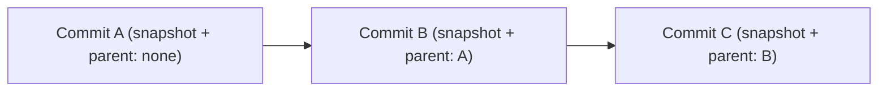
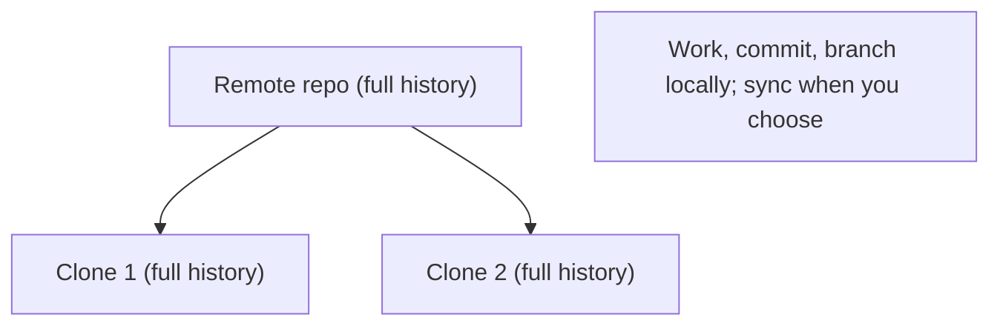
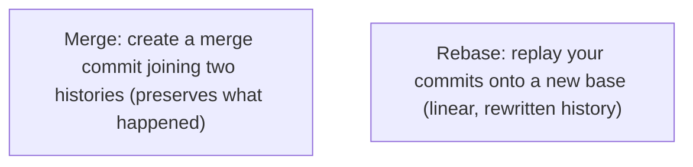
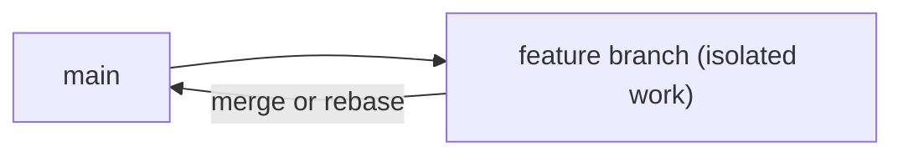
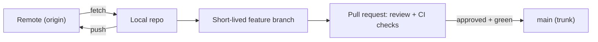
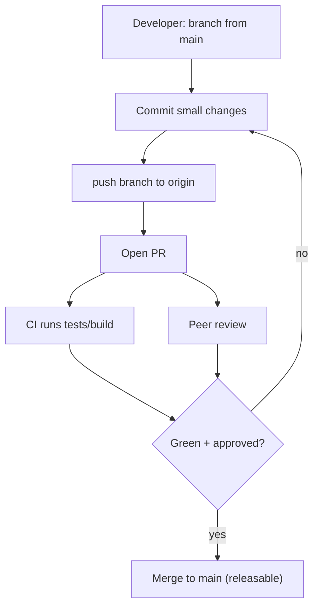

# Git Version Control - Complete Professional Guide

> **Category:** 07_devops_sre_operations · **Language:** English

---

### Commits, branching, and the distributed model
**Original guide written from first principles, current to 2026**

> **Original reference book (English).** This is an **independent, originally written** guide. It is not an extract, summary, or paraphrase of any third-party book; it teaches Git from first principles with original examples. Canonical books are listed under **References** as pointers only. Each chapter follows the TO-BRAIN editorial standard (see `FILE_CONVENTIONS.md`).
>
> **Scope notice:** Git is the standard distributed version-control system. This guide covers its data model (commits as snapshots), branching, and the distributed workflow that underpins modern collaboration, current to 2026.

---

## How to read this guide

| Level | Profile | Parts |
|-------|---------|-------|
| 1 — Beginner | New to Git | Part I |
| 2 — Intermediate | Branching workflows | Part II |

**Target audience:** every developer who collaborates on code.

**Structure of each chapter:** Introduction · Business context · Theoretical concepts · Architecture · Diagrams (Mermaid) · Real examples · Step by step · Complete examples · Exercises · Challenges · Checklist · Best practices · Anti-patterns · Troubleshooting · References.

> **Note on prerequisites.** Assumes basic command-line use.

---

## Table of Contents

**Part I – The model**
1. Commits as snapshots; the distributed model
2. Branching and merging

**Part II – Collaboration**
3. Remotes, pull requests, and workflows

> **Status of this edition:** complete for its declared scope. **Ready:** Parts I–II (Ch. 1–3).

---

## Part I – The model

Git confuses people until its **data model** clicks. Once you see that a commit is a full **snapshot** with a parent pointer, and that a branch is just a movable pointer to a commit, the commands stop being magic incantations. Git is a content-addressed history of snapshots that every clone holds in full — the basis of its speed and resilience.

---

## Chapter 1 — Commits and the distributed model

### 1.1 Introduction

A Git **commit** is a **snapshot** of your whole project at a moment, plus metadata (author, message) and a pointer to its **parent** commit(s). Commits link into a history (a directed acyclic graph). Git is **distributed**: every clone is a complete copy of the entire history, not a thin checkout — so most operations are local and fast, and there's no single point of failure.

### 1.2 Business context

The distributed model means developers work offline, branch freely, and never lose history to a server outage — every clone is a backup. Commits-as-snapshots make history reliable and auditable: you can reconstruct exactly what the code was at any point, who changed what, and why. This underpins safe collaboration, code review, debugging via history, and compliance — the reasons Git is universal.

### 1.3 Theoretical concepts: snapshots, not diffs



Conceptually each commit stores a **complete snapshot** (Git deduplicates unchanged files internally, but the mental model is snapshots, not patches). Each commit references its parent, forming history. A commit is identified by a hash of its content, so history is tamper-evident. A **branch** is simply a movable pointer to a commit; **HEAD** points to your current branch.

### 1.4 Architecture: every clone is complete



### 1.5 Real example

**Scenario.** A developer works on a flight with no internet and needs full version control.

**Problem.** A centralized VCS would block commits/branches without server access.

**Solution.** Git: commit, branch, view history, and diff entirely locally; push later.

**Implementation (all local).**

```bash
git add .                 # stage the snapshot's contents
git commit -m "Add parser"   # create a local commit (snapshot + parent)
git log --oneline         # full local history, offline
git checkout -b fix-bug   # branch locally, instantly
# ...later, online:
git push origin fix-bug   # sync to the remote
```

**Result.** Full version-control workflow offline; commits and branches are instant and local, synced to the remote whenever convenient. No server dependency to do real work.

**Future improvements.** Write clear commit messages (why, not just what); keep commits focused for a readable history.

### 1.6 Exercises

1. What does a commit contain?
2. What does "distributed" give you over a centralized VCS?
3. What is a branch, mechanically?

### 1.7 Challenges

- **Challenge.** Offline, make several commits and a branch in a repo. Then go online and push. Note which operations needed no network.

### 1.8 Checklist

- [ ] I understand commits are snapshots with parents.
- [ ] I know a branch is a movable pointer.
- [ ] I work and commit locally, sync deliberately.
- [ ] I write meaningful commit messages.

### 1.9 Best practices

- Make small, focused commits with clear messages (explain why).
- Commit often locally; push when ready.
- Treat history as documentation.

### 1.10 Anti-patterns

- Giant commits mixing unrelated changes.
- Vague messages ("fix", "update").
- Treating Git like a centralized VCS (fear of local branching).

### 1.11 Troubleshooting

| Symptom | Likely cause | Action |
|---------|--------------|--------|
| Can't understand a change later | Huge/unfocused commits | Make small, single-purpose commits |
| History unreadable | Poor messages | Explain the why in messages |
| Afraid to experiment | Misunderstanding branches | Branch freely; it's cheap and local |

### 1.12 References

- S. Chacon, B. Straub, *Pro Git*, 2nd ed. (Apress, 2014) — ISBN 978-1484200773; https://git-scm.com/book.
- Git docs: https://git-scm.com/doc.

---

## Chapter 2 — Branching and merging

### 2.1 Introduction

Git's **branching** is cheap and fast because a branch is just a pointer. You branch to work on something in isolation, then **merge** to bring the work together. Understanding the two integration mechanisms — **merge** (joins histories with a merge commit) and **rebase** (replays your commits onto another base for a linear history) — lets you collaborate cleanly.

### 2.2 Business context

Cheap branching enables parallel work: features, fixes, and experiments proceed independently without stepping on each other, then integrate. Good branching and merging discipline keeps the mainline stable and history understandable, which speeds reviews and debugging. Teams that branch well ship in parallel safely; teams that don't get tangled merges and broken mainlines that stall delivery.

### 2.3 Theoretical concepts: merge vs rebase



- **Merge** keeps the true history including the branch point, producing a merge commit. Non-destructive; the graph shows parallel work.
- **Rebase** moves your commits to sit on top of another branch, giving a clean linear history — but **rewrites** commits, so never rebase commits others already have.

Choose by team convention: merge for honesty about parallelism, rebase for a tidy linear log (on local/unshared work).

### 2.4 Architecture: branch, then integrate



### 2.5 Real example

**Scenario.** You built a feature on a branch while `main` advanced.

**Problem.** You must integrate, and the team wants a readable history.

**Solution.** Rebase your *local, unshared* feature onto the latest main (linear), then merge into main via a reviewed PR.

**Implementation.**

```bash
git checkout feature
git fetch origin
git rebase origin/main     # replay feature commits onto latest main (local only!)
# resolve conflicts as they appear, continue
git push --force-with-lease origin feature   # update your PR branch safely
# then merge the PR into main (reviewed)
```

**Result.** The feature applies cleanly on the latest main with a linear, reviewable history; conflicts were handled during rebase. `--force-with-lease` avoids clobbering others' work.

**Future improvements.** Agree a team policy (rebase feature branches, merge into main) so history stays consistent.

### 2.6 Exercises

1. Why is branching cheap in Git?
2. Contrast merge and rebase.
3. Why must you not rebase commits others already have?

### 2.7 Challenges

- **Challenge.** Create a branch, let main advance, then integrate twice: once with merge, once with rebase (on a copy). Compare the resulting history graphs.

### 2.8 Checklist

- [ ] I branch for isolated work.
- [ ] I understand merge vs rebase trade-offs.
- [ ] I never rebase shared/published commits.
- [ ] I keep the mainline stable when integrating.

### 2.9 Best practices

- Use short-lived branches; integrate often.
- Rebase only local/unshared commits; merge to share.
- Resolve conflicts thoughtfully, with tests.

### 2.10 Anti-patterns

- Rebasing public/shared history (breaks everyone).
- Long-lived branches with massive merge conflicts.
- Force-pushing over teammates' work (use `--force-with-lease`).

### 2.11 Troubleshooting

| Symptom | Likely cause | Action |
|---------|--------------|--------|
| Painful giant merges | Long-lived branches | Branch short; integrate frequently |
| Teammates' work lost | Rebased/force-pushed shared history | Only rebase local; use `--force-with-lease` |
| Messy history | No merge/rebase policy | Agree a team convention |

### 2.12 References

- S. Chacon, B. Straub, *Pro Git*, 2nd ed. (Apress, 2014) — ISBN 978-1484200773; https://git-scm.com/book.
- Atlassian Git tutorials: https://www.atlassian.com/git/tutorials.

---

> **End of Part I.** You can now reason about Git from its data model: commits are content-addressed snapshots linked to parents, branches are cheap movable pointers, and every clone holds the full distributed history (work offline, no single point of failure). You can branch for isolation and integrate with merge (honest history) or rebase (linear, local-only). **Part II — Collaboration** (Chapter 3) covers remotes, pull-request workflows, and choosing a branching strategy (trunk-based vs GitFlow) for your team.

---

## Part II – Collaboration

Part I covered Git as a local data model — snapshots, branches, merge and rebase. But Git's real purpose is letting *many people* work on the same history without stepping on each other. That requires **remotes** (shared copies of the repository), a disciplined way to propose and review changes (**pull requests**), and an agreed **branching workflow** so a team's branches mean the same thing to everyone. This chapter turns the single-developer model into a collaboration model.

---

## Chapter 3 — Remotes, pull requests, and workflows

### 3.1 Introduction

A **remote** is a named reference to another copy of the repository (commonly `origin` on a server like GitHub/GitLab). You synchronize with it via `fetch` (download new commits, don't touch your work), `pull` (fetch + integrate), and `push` (upload your commits). A **pull request** (PR / merge request) is a proposal to merge one branch into another, wrapped in review and automated checks. A **branching workflow** is the team's shared convention for how branches are created, reviewed, and integrated — e.g. **trunk-based development** (short-lived branches merged to one main line many times a day) versus heavier models like **GitFlow** (long-lived develop/release/feature branches).

### 3.2 Business context

Without shared conventions, collaboration degrades into painful merges, lost work, and "works on my branch" surprises. Remotes give everyone a common integration point; pull requests make change **reviewable and gated** (tests + human eyes before code lands), which is where quality and knowledge-sharing happen; and the choice of workflow directly affects delivery speed. Trunk-based development — small, frequently integrated changes — is the workflow consistently associated with high delivery performance, because long-lived branches accumulate divergence and turn integration into a risky event (the very thing continuous delivery avoids).

### 3.3 Theoretical concepts: fetch, integrate, propose



- **fetch vs pull** — `fetch` is safe (updates remote-tracking refs only); `pull` also merges/rebases into your branch. Preferring `fetch` then a deliberate integrate avoids surprise merges.
- **Pull request** — the unit of review. Keep it small so review is fast and meaningful; attach CI so it can't merge red.
- **Trunk-based development** — everyone integrates to `main` frequently via short-lived branches; pairs naturally with feature flags (from the CD guide) to keep `main` always releasable.
- **GitFlow** — multiple long-lived branches; powerful for versioned/released products with parallel maintenance, but its branch divergence and ceremony slow continuous-delivery teams.

### 3.4 Architecture: the collaboration loop



### 3.5 Real example

**Scenario.** A six-person team works off long-lived feature branches that live for weeks. Merges to `main` are dreaded multi-hour conflict marathons, and nobody reviews changes until the end.

**Problem.** Long-lived branches diverge badly; integration is a rare, high-risk event; review happens too late to be useful; `main` is rarely in a releasable state.

**Solution.** Adopt trunk-based development with small PRs, branch protection, and required CI — integrate to `main` daily.

**Implementation (trunk-based flow).**

```bash
git fetch origin                       # get latest without touching local work
git switch -c feat/add-rate-limit origin/main   # short-lived branch off trunk
# ... small, focused commits ...
git push -u origin feat/add-rate-limit
# open a PR; CI runs; a peer reviews a *small* diff
# branch protection on main: require 1 approval + green CI before merge
git switch main && git pull            # after merge, sync
# branch is deleted; next change starts fresh from main
```

```text
Branch protection (server-side) on main:
  - require pull request before merging
  - require status checks (CI) to pass
  - require at least 1 approving review
  - keep branches short-lived (merge within a day or two)
```

**Result.** Integration becomes a daily non-event because branches are small and short-lived; review is fast and catches issues early; CI keeps `main` green and releasable. The conflict marathons disappear because divergence never accumulates.

**Future improvements.** Pair trunk-based development with feature flags to merge incomplete work safely; add CODEOWNERS for automatic reviewer assignment; enforce linear history or squash-merge for a clean trunk.

### 3.6 Exercises

1. What is the difference between `git fetch` and `git pull`, and why prefer fetch-then-integrate?
2. What does a pull request add beyond simply pushing to a shared branch?
3. Why does trunk-based development tend to outperform long-lived-branch workflows for delivery speed?

### 3.7 Challenges

- **Challenge.** Set up branch protection on a repo's `main`: require a PR, a passing CI check, and one review. Then ship a small change end-to-end through the protected flow and explain at which points quality is gated.

### 3.8 Checklist

- [ ] A shared remote (`origin`) is the team's integration point.
- [ ] Changes land via small, reviewed pull requests, not direct pushes to main.
- [ ] CI status checks gate merges; `main` stays green and releasable.
- [ ] Feature branches are short-lived (hours/days, not weeks).
- [ ] The team has an explicit, agreed branching workflow.

### 3.9 Best practices

- Keep PRs small and single-purpose so review is fast and effective.
- Integrate to trunk frequently; use feature flags to hide incomplete work.
- Protect `main` with required reviews and required CI checks.
- Prefer `fetch` + deliberate integrate over reflexive `pull` on shared branches.

### 3.10 Anti-patterns

- Long-lived feature branches that diverge for weeks (merge hell).
- Direct pushes to `main` with no review or CI gate.
- Giant PRs that are impossible to review meaningfully.
- Rebasing/force-pushing shared branches others have already based work on.

### 3.11 Troubleshooting

| Symptom | Likely cause | Action |
|---------|--------------|--------|
| Painful, hours-long merges | Long-lived divergent branches | Switch to short-lived branches; integrate daily |
| Bugs found only at the end | Review happens too late | Small PRs reviewed continuously |
| `main` often broken | No required CI gate | Add branch protection + required checks |
| Lost/overwritten commits | Force-push to shared branch | Never rewrite shared history; protect main |

### 3.12 References

- S. Chacon, B. Straub, *Pro Git*, 2nd ed. (Apress, 2014) — ISBN 978-1484200773 — Ch. 2–3 (Git Basics: remotes) and Ch. 5–6 (Distributed/GitHub workflows); https://git-scm.com/book.
- "Trunk-Based Development": https://trunkbaseddevelopment.com/.

---

> **End of Part II — and of the guide.** Building on Part I's data model (snapshots, branches, merge/rebase), you can now collaborate at scale: synchronize through **remotes** with safe `fetch`/`push`, propose change through **pull requests** that gate quality with review and CI, and choose a **workflow** — favoring trunk-based development with short-lived branches and feature flags — that keeps `main` continuously integrated and releasable. This is the version-control foundation on which continuous delivery and DevOps flow are built.
