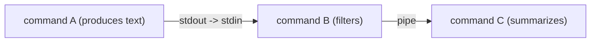
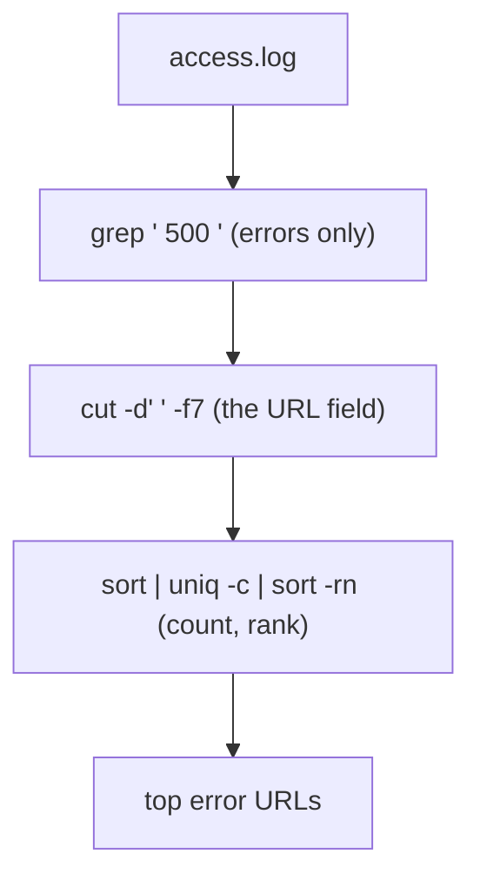
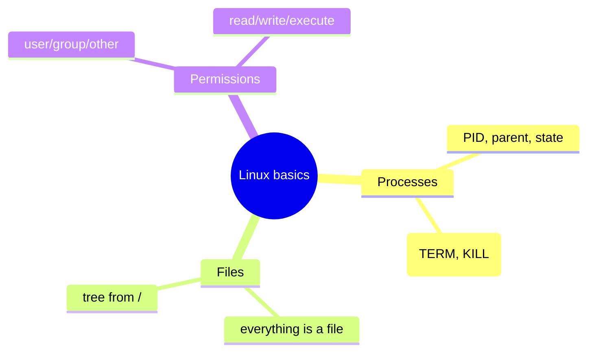
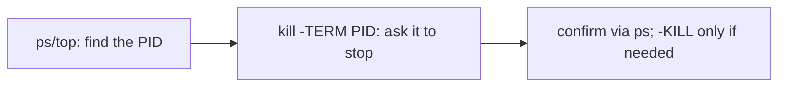

# Linux Command-Line for Operations - Complete Professional Guide

> **Category:** 07_devops_sre_operations · **Language:** English

---

### Shell, pipes, processes, and text tools for running systems
**Original guide written from first principles, current to 2026**

> **Original reference book (English).** This is an **independent, originally written** guide. It is not an extract, summary, or paraphrase of any third-party book; it teaches the Linux command line from first principles with original examples. Canonical references are listed under **References** as pointers only. Each chapter follows the TO-BRAIN editorial standard (see `FILE_CONVENTIONS.md`).
>
> **Scope notice:** the Linux command line is where servers are operated and debugged. This guide covers the shell, the pipe-and-filter philosophy, and process/file basics that make you effective, current to 2026.

---

## How to read this guide

| Level | Profile | Parts |
|-------|---------|-------|
| 1 — Beginner | New to the shell | Part I |
| 2 — Intermediate | Operating servers | Part II |

**Target audience:** developers and ops who work on Linux servers and containers.

**Structure of each chapter:** Introduction · Business context · Theoretical concepts · Architecture · Diagrams (Mermaid) · Real examples · Step by step · Complete examples · Exercises · Challenges · Checklist · Best practices · Anti-patterns · Troubleshooting · References.

> **Note on prerequisites.** Assumes you can open a terminal.

---

## Table of Contents

**Part I – The philosophy**
1. Small tools and pipes
2. Processes, files, and permissions

**Part II – Operating**
3. Inspecting a running system

> **Status of this guide:** phased delivery. **Ready:** Part I (Ch. 1–2). **In progress:** Part II.

---

## Part I – The philosophy

The Linux command line is powerful not because any one tool is huge, but because **small, single-purpose tools compose**. Each does one thing well; you connect them with **pipes** to build exactly the command you need. Internalizing this composition mindset is worth more than memorizing flags.

---

## Chapter 1 — Small tools and pipes

### 1.1 Introduction

The Unix philosophy: each program does **one thing well**, reads from standard input, writes to standard output, and can be **piped** into another. Instead of one mega-tool, you chain small ones (`grep`, `sort`, `cut`, `wc`) to transform text streams. A pipeline `A | B | C` feeds A's output into B into C — composing a custom tool on the fly.

### 1.2 Business context

On a server, you constantly need to extract, filter, and summarize data (logs, process lists, metrics) ad hoc. The ability to compose small tools into a one-line pipeline answers questions in seconds without writing a program — invaluable during incidents and routine ops. Engineers fluent in this are dramatically faster at diagnosing and operating systems, which directly shortens outages and toil.

### 1.3 Theoretical concepts: composition via streams



Each tool consumes **stdin** and produces **stdout**; the pipe `|` connects them. This stream model means you don't need a tool for every task — you assemble one. Redirection (`>` to a file, `<` from a file, `2>` for errors) connects streams to files. Mastering a handful of filters plus the pipe covers most needs.

### 1.4 Architecture: a pipeline as a custom tool



### 1.5 Real example

**Scenario.** During an incident, find which URLs return the most HTTP 500s in an access log.

**Problem.** Opening a huge log by hand is hopeless; writing a script is too slow mid-incident.

**Solution.** A one-line pipeline composing small tools.

**Implementation.**

```bash
grep ' 500 ' access.log \
  | awk '{print $7}' \
  | sort | uniq -c | sort -rn \
  | head
# -> counts of 500s per URL, highest first
```

**Result.** In one line, the top error-producing URLs are ranked — answering the incident question in seconds without any program. Composition delivered a bespoke tool instantly.

**Future improvements.** Save useful pipelines as shell functions/aliases; for repeated analysis, move to a proper log tool.

### 1.6 Exercises

1. State the Unix philosophy in one sentence.
2. What do stdin/stdout/pipe let you do?
3. Build a pipeline to count unique IPs in a log.

### 1.7 Challenges

- **Challenge.** Take a log file. Write a one-line pipeline that extracts, filters, counts, and ranks something useful (e.g. top clients, slowest endpoints).

### 1.8 Checklist

- [ ] I compose small tools with pipes.
- [ ] I use stdin/stdout and redirection.
- [ ] I prefer a pipeline to a script for ad-hoc questions.
- [ ] I know a core set of filters (grep/awk/sort/uniq/cut).

### 1.9 Best practices

- Compose single-purpose tools instead of seeking one big tool.
- Save handy pipelines as aliases/functions.
- Keep each stage doing one transformation.

### 1.10 Anti-patterns

- Writing a program for what a pipeline answers instantly.
- Opening huge files manually during incidents.
- Monolithic, unreadable one-liners with no structure.

### 1.11 Troubleshooting

| Symptom | Likely cause | Action |
|---------|--------------|--------|
| Slow to answer log questions | Not using pipelines | Compose grep/awk/sort/uniq |
| Pipeline gives nothing | Wrong field/filter | Inspect each stage's output step by step |
| Errors not captured | stderr not redirected | Use `2>&1` or `2>file` |

### 1.12 References

- B. Lee, *Linux Utilities Cookbook* (Packt, 2013) — ISBN 978-1782162001.
- The GNU Coreutils manual: https://www.gnu.org/software/coreutils/manual/.

---

## Chapter 2 — Processes, files, and permissions

### 2.1 Introduction

Operating a Linux system means understanding **processes** (running programs, each with a PID), the **file system** (everything is a file, organized in a tree), and **permissions** (who can read/write/execute what). These three concepts underlie nearly every operational task: starting/stopping services, finding what's using resources, and securing access.

### 2.2 Business context

Most production issues come down to a process (a runaway service, a crashed daemon), a file (a full disk, a misconfigured config), or a permission (a service can't read a key). Fluency here is the difference between resolving an incident in minutes and flailing. It's also foundational to security: wrong permissions are a common vulnerability. These basics are the operational literacy every engineer on Linux needs.

### 2.3 Theoretical concepts: processes, files, permissions



- **Processes**: each has a PID, a parent, and a state; you signal them (e.g. `SIGTERM` to stop gracefully, `SIGKILL` to force). Tools: `ps`, `top`/`htop`, `kill`.
- **Files**: a single tree from `/`; devices, sockets, and even process info (`/proc`) appear as files.
- **Permissions**: each file has read/write/execute bits for **user/group/other**; `chmod`/`chown` manage them.

### 2.4 Architecture: signal a process, inspect via /proc



### 2.5 Real example

**Scenario.** A runaway process is consuming all CPU on a server.

**Problem.** The server is sluggish; you must find and stop the offender without rebooting.

**Solution.** Identify the process, then signal it to stop gracefully.

**Implementation.**

```bash
top -o %CPU            # find the CPU hog and note its PID
ps -p 12345 -o pid,cmd # confirm what PID 12345 actually is
kill -TERM 12345       # ask it to shut down gracefully
# if it ignores TERM after a moment:
kill -KILL 12345       # force-stop (last resort)
```

**Result.** The offending process is identified and stopped cleanly (TERM first, KILL only if needed), restoring the server without a disruptive reboot.

**Future improvements.** Find *why* it ran away (logs, the parent process); add resource limits (cgroups) so one process can't starve the host.

### 2.6 Exercises

1. What is a PID and how do you signal a process?
2. Why prefer `SIGTERM` over `SIGKILL` first?
3. What does "everything is a file" mean practically?

### 2.7 Challenges

- **Challenge.** Find the top memory-consuming process on a machine, confirm what it is, and describe how you'd stop it safely.

### 2.8 Checklist

- [ ] I can find and inspect processes (ps/top).
- [ ] I signal processes correctly (TERM before KILL).
- [ ] I understand the single file tree and `/proc`.
- [ ] I can read and set permissions (chmod/chown).

### 2.9 Best practices

- Stop processes gracefully (TERM) before forcing (KILL).
- Use least-privilege file permissions.
- Investigate root cause, not just the symptom process.

### 2.10 Anti-patterns

- `kill -9` as a first resort (no graceful shutdown).
- Overly permissive permissions (e.g. world-writable secrets).
- Rebooting to clear a single bad process.

### 2.11 Troubleshooting

| Symptom | Likely cause | Action |
|---------|--------------|--------|
| Server sluggish | Runaway process | Find PID (top), TERM it |
| "Permission denied" for a service | Wrong file permissions/owner | Fix with chmod/chown (least privilege) |
| Disk full | Large/unrotated files | Find big files; rotate logs |

### 2.12 References

- B. Lee, *Linux Utilities Cookbook* (Packt, 2013) — ISBN 978-1782162001.
- "The Linux Documentation Project": https://tldp.org; `man` pages.

---

> **End of Part I.** You can now work effectively on Linux: compose small single-purpose tools with pipes to answer operational questions on the fly, and handle the core operational objects — processes (find and signal them gracefully), files (one tree, everything-is-a-file), and permissions (least privilege). **Part II — Operating** (Chapter 3) covers inspecting a running system under pressure: disk/memory/network checks, log locations, and the first commands to run during an incident.

<!--APPEND-PART-II-->
