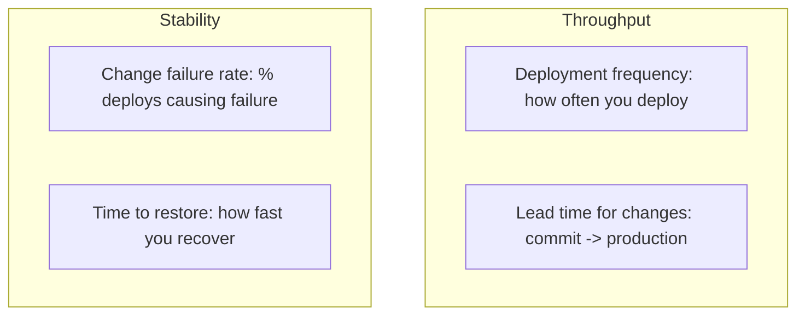
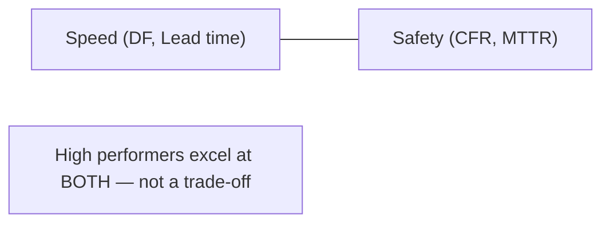
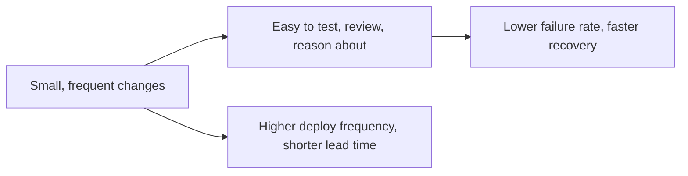
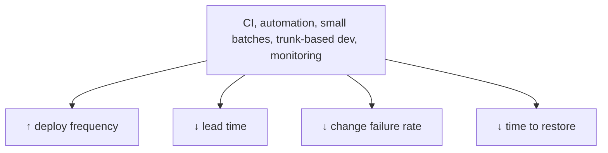

# Measuring Software Delivery Performance - Complete Professional Guide

> **Category:** 07_devops_sre_operations · **Language:** English

---

### The four key metrics and the capabilities that drive them
**Original guide written from first principles, current to 2026**

> **Original reference book (English).** This is an **independent, originally written** guide. It is not an extract, summary, or paraphrase of any third-party book; it teaches delivery-performance measurement from first principles with original examples. Canonical books are listed under **References** as pointers only. Each chapter follows the TO-BRAIN editorial standard (see `FILE_CONVENTIONS.md`).
>
> **Scope notice:** how do you know if your delivery is actually good? Research identified four metrics that distinguish high performers and predict business outcomes. This guide covers those metrics (DORA) and the capabilities that improve them, current to 2026.

---

## How to read this guide

| Level | Profile | Parts |
|-------|---------|-------|
| 1 — Beginner | New to delivery metrics | Part I |
| 2 — Intermediate | Improving performance | Part II |

**Target audience:** engineering leaders, teams, and managers wanting evidence-based delivery improvement.

**Structure of each chapter:** Introduction · Business context · Theoretical concepts · Architecture · Diagrams (Mermaid) · Real examples · Step by step · Complete examples · Exercises · Challenges · Checklist · Best practices · Anti-patterns · Troubleshooting · References.

> **Note on prerequisites.** Assumes the DevOps-principles guide.

---

## Table of Contents

**Part I – The metrics**
1. The four key metrics (DORA)
2. Why throughput and stability rise together

**Part II – Improvement**
3. Capabilities that drive performance

> **Status of this guide:** phased delivery. **Ready:** Part I (Ch. 1–2). **In progress:** Part II.

---

## Part I – The metrics

Large-scale research found that software delivery performance can be measured by just **four metrics**, and that these predict organizational performance (profitability, productivity, market share). Crucially, the research overturned a myth: speed and stability are **not** a trade-off — high performers achieve both. Measuring the right four things focuses improvement on what actually matters.

---

## Chapter 1 — The four key metrics

### 1.1 Introduction

The four metrics (often called **DORA metrics**) split into **throughput** and **stability**. Throughput: **deployment frequency** (how often you ship) and **lead time for changes** (commit to production). Stability: **change failure rate** (what % of deploys cause a problem) and **time to restore service** (how fast you recover). Together they capture both how fast and how safely you deliver.

### 1.2 Business context

Without good metrics, "are we improving?" is guesswork, and teams optimize vanity numbers (lines of code, velocity points) that don't predict outcomes. The four key metrics are evidence-based predictors of business performance, so tracking them focuses effort on changes that genuinely help. They also give leadership an honest, comparable picture of delivery capability — and a target for improvement that correlates with real results.

### 1.3 Theoretical concepts: throughput and stability



- **Deployment frequency** — high performers deploy on demand (multiple times a day); low performers, monthly or less.
- **Lead time for changes** — time from code committed to running in production; shorter is better.
- **Change failure rate** — fraction of changes that degrade service and need remediation.
- **Time to restore service** — how quickly you recover from a failure.

Measure all four; optimizing throughput alone (ignoring stability) or vice versa misleads.

### 1.4 Architecture: a balanced scorecard



### 1.5 Real example

**Scenario.** A team brags about high "velocity" (story points) but ships slowly and breaks often.

**Problem.** Velocity doesn't measure delivery performance; it can rise while real outcomes worsen.

**Solution.** Track the four key metrics to see the truth and target improvement.

**Implementation (the scorecard).**

```text
Team baseline (measured):
  Deployment frequency:   1 / month        -> low
  Lead time for changes:  3 weeks          -> low
  Change failure rate:    35%              -> low
  Time to restore:        2 days           -> low
Goal: move each toward elite (deploy on demand, lead time < 1 day,
      CFR < 15%, restore < 1 hour) via capability changes (Ch. 3).
```

**Result.** The team now has honest, outcome-correlated targets instead of vanity velocity — and a clear direction (smaller batches, automation, monitoring) that improves all four.

**Future improvements.** Automate metric collection from CI/CD and incident tooling so the scorecard is always current.

### 1.6 Exercises

1. Name the four key metrics and group them into throughput vs stability.
2. Why is velocity (story points) a poor delivery-performance metric?
3. What does "time to restore service" measure?

### 1.7 Challenges

- **Challenge.** Estimate your team's four metrics from recent data. Which is weakest? That's your first improvement target.

### 1.8 Checklist

- [ ] I track deployment frequency and lead time (throughput).
- [ ] I track change failure rate and time to restore (stability).
- [ ] I avoid vanity metrics as performance measures.
- [ ] Metrics are collected from real tooling, not guessed.

### 1.9 Best practices

- Measure all four key metrics together.
- Automate collection from CI/CD and incident systems.
- Use the metrics to target improvement, not to rank people.

### 1.10 Anti-patterns

- Optimizing speed while ignoring stability (or vice versa).
- Using velocity/LOC as performance measures.
- Weaponizing metrics to compare or punish individuals.

### 1.11 Troubleshooting

| Symptom | Likely cause | Action |
|---------|--------------|--------|
| "Improving" but outcomes flat | Vanity metrics | Switch to the four key metrics |
| Fast but fragile delivery | Throughput-only focus | Track and improve stability too |
| Metrics gamed | Used for ranking | Use for learning, not judging |

### 1.12 References

- N. Forsgren, J. Humble, G. Kim, *Accelerate* (IT Revolution, 2018) — ISBN 978-1942788331.
- DORA, "State of DevOps" reports: https://dora.dev.

---

## Chapter 2 — Throughput and stability rise together

### 2.1 Introduction

The most counterintuitive research finding: **speed and stability are not opposed**. The same practices that let you deliver faster (small batches, automation, continuous integration) also make you more stable. High performers deploy far more often *and* fail less *and* recover faster. This kills the old belief that you must slow down to be safe.

### 2.2 Business context

Many organizations impose heavy process (change-approval boards, infrequent releases) believing it buys safety — when research shows such practices often *hurt* both speed and stability. Understanding that throughput and stability are complementary lets leaders stop trading one for the other and instead adopt practices that improve both, ending the false "fast vs safe" debate that slows companies down and demoralizes teams.

### 2.3 Theoretical concepts: small batches are safer



Small batches are both faster to deliver and **safer**: a small change is easy to verify, easy to debug if it fails, and easy to roll back. So reducing batch size improves throughput *and* stability simultaneously — the mechanism behind high performers' dual success.

### 2.4 Architecture: practices that lift all four



### 2.5 Real example

**Scenario.** A company adds a heavyweight change-approval board to reduce failures.

**Problem.** Approvals slow delivery *and*, research shows, don't reduce failure rate — they often correlate with worse stability (big risky batches build up).

**Solution.** Replace the board with peer review + automated testing and smaller batches — improving speed and stability together.

**Implementation (the change).**

```text
Before: external change-approval board (slow, ~no stability gain)
After:  peer review in PRs + automated tests + small batches
        -> faster lead time AND lower change failure rate
```

**Result.** Delivery speeds up *and* failures drop — the opposite of the feared trade-off, because lightweight, automated controls beat heavyweight gatekeeping.

**Future improvements.** Track the four metrics before/after the change to confirm both improved.

### 2.6 Exercises

1. Why aren't speed and stability a trade-off?
2. How do small batches improve stability specifically?
3. Why can heavyweight approval processes hurt both metrics?

### 2.7 Challenges

- **Challenge.** Find a "safety" process in your org that slows delivery. Hypothesize whether it actually improves stability. Propose a lighter, automated alternative.

### 2.8 Checklist

- [ ] I treat speed and stability as complementary.
- [ ] I reduce batch size to improve both.
- [ ] I prefer automated/peer controls over heavyweight gates.
- [ ] I verify changes against all four metrics.

### 2.9 Best practices

- Shrink batch size to lift throughput and stability at once.
- Replace heavyweight approvals with automated testing and peer review.
- Adopt CI and trunk-based development.

### 2.10 Anti-patterns

- Slowing delivery in the name of safety without evidence.
- External change-approval boards as the main control.
- Assuming you must choose fast or stable.

### 2.11 Troubleshooting

| Symptom | Likely cause | Action |
|---------|--------------|--------|
| Slow delivery, still unstable | Heavyweight gatekeeping | Lighter automated controls + small batches |
| Fear of frequent deploys | Belief in fast-vs-safe trade-off | Show small-batch safety; start small |
| Approvals add delay, no stability gain | Wrong control mechanism | Peer review + automated tests |

### 2.12 References

- N. Forsgren, J. Humble, G. Kim, *Accelerate* (IT Revolution, 2018) — ISBN 978-1942788331.
- DORA, "State of DevOps" reports: https://dora.dev.

---

> **End of Part I.** You can now measure delivery performance with the four key metrics — deployment frequency and lead time (throughput), change failure rate and time to restore (stability) — and you understand the central finding that these rise together: small batches and automation make delivery both faster and safer, so there's no real speed-vs-stability trade-off. **Part II — Improvement** (Chapter 3) covers the technical, process, and cultural capabilities that research links to high performance, and how to drive improvement against the metrics.

<!--APPEND-PART-II-->
