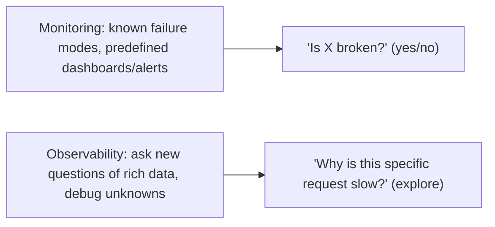
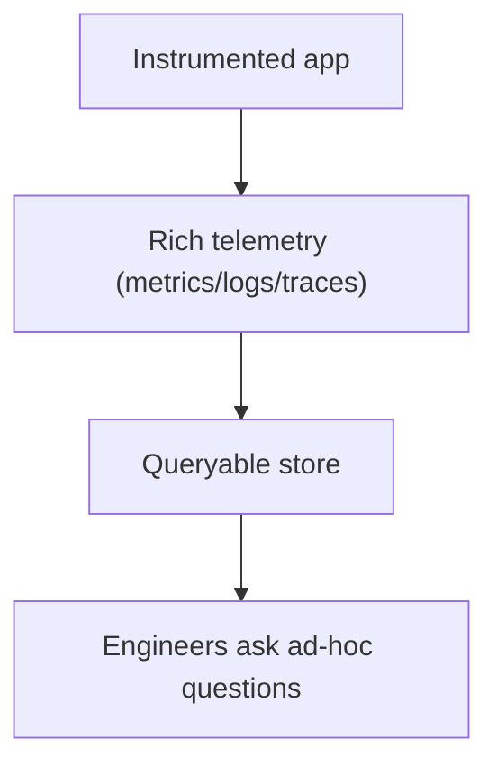
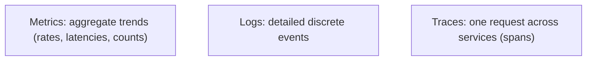
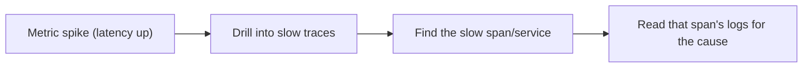
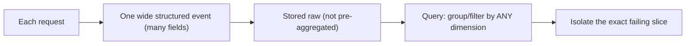
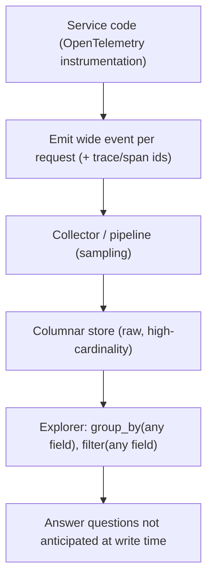

# Observability - Complete Professional Guide

> **Category:** 07_devops_sre_operations · **Language:** English

---

### Understanding systems from the outside: metrics, logs, and traces
**Original guide written from first principles, current to 2026**

> **Original reference book (English).** This is an **independent, originally written** guide. It is not an extract, summary, or paraphrase of any third-party book; it teaches observability from first principles with original examples. Canonical books are listed under **References** as pointers only. Each chapter follows the TO-BRAIN editorial standard (see `FILE_CONVENTIONS.md`).
>
> **Scope notice:** observability is the ability to understand a system's internal state from its external outputs — crucial for debugging modern distributed systems. This guide covers the telemetry types, high-cardinality structured events, and how observability differs from monitoring, current to 2026 (OpenTelemetry).

---

## How to read this guide

| Level | Profile | Parts |
|-------|---------|-------|
| 1 — Beginner | New to observability | Part I |
| 2 — Intermediate | Instrumenting systems | Part II |

**Target audience:** developers and SREs who operate and debug production systems.

**Structure of each chapter:** Introduction · Business context · Theoretical concepts · Architecture · Diagrams (Mermaid) · Real examples · Step by step · Complete examples · Exercises · Challenges · Checklist · Best practices · Anti-patterns · Troubleshooting · References.

> **Note on prerequisites.** Assumes the SRE and DevOps-principles guides.

---

## Table of Contents

**Part I – Foundations**
1. Observability vs monitoring
2. Metrics, logs, and traces

**Part II – Modern observability**
3. High-cardinality structured events

> **Status of this edition:** complete for its declared scope. **Ready:** Parts I–II (Ch. 1–3).

---

## Part I – Foundations

You can't fix what you can't see. As systems became distributed and dynamic, the old model (predefined dashboards for known failure modes) stopped being enough — you face failures you never anticipated. **Observability** is about being able to ask **new questions** of your system without shipping new code, so you can debug the unknown-unknowns.

---

## Chapter 1 — Observability vs monitoring

### 1.1 Introduction

**Monitoring** watches for **known** problems via predefined metrics and alerts ("is CPU > 90%?"). **Observability** is the property that lets you investigate **unknown** problems — ask arbitrary new questions about what your system is doing, after the fact, from rich telemetry. Monitoring tells you *that* something is wrong; observability helps you find out *why*, even for a failure you never predicted.

### 1.2 Business context

In complex distributed systems, most serious incidents are novel — combinations no one dashboarded for. Pure monitoring leaves teams blind when a new failure mode hits, extending outages. Observability shortens time-to-diagnosis by letting engineers slice and explore live data to find the actual cause, directly reducing downtime and its cost. As systems grow more dynamic (microservices, serverless), observability shifts from nice-to-have to essential.

### 1.3 Theoretical concepts: known vs unknown



Observability requires telemetry rich and granular enough to answer questions you didn't anticipate — which means **context-rich, high-cardinality** data (Chapter 3), not just pre-aggregated counters. Monitoring is a subset: useful for known conditions, insufficient for novel debugging.

### 1.4 Architecture: instrument for exploration



### 1.5 Real example

**Scenario.** A small subset of users see slow checkouts, but all dashboards are green.

**Problem.** Monitoring covers aggregate metrics (overall latency is fine), so the targeted slowness is invisible.

**Solution.** Observability: query the data by user/region/version to isolate the affected slice.

**Implementation (asking a new question).**

```text
With rich, high-cardinality telemetry you can query:
  p99 latency WHERE region = 'sa-east' AND app_version = '1.4.2' AND payment = 'pix'
  -> reveals one provider+region+version combo is slow
No code change needed; the question is answered from existing telemetry.
```

**Result.** The affected slice (a specific provider/region/version) is isolated by exploring data, despite green aggregate dashboards. Diagnosis goes from days of guessing to minutes of querying.

**Future improvements.** Add the dimensions that mattered (provider, region, version) as standard fields so such questions are always answerable.

### 1.6 Exercises

1. Distinguish monitoring from observability.
2. Why is monitoring insufficient for distributed systems?
3. What kind of data does observability require?

### 1.7 Challenges

- **Challenge.** Recall an incident where dashboards were green but users hurt. What dimension would you have needed to slice by? Add it to your telemetry.

### 1.8 Checklist

- [ ] I distinguish known-problem monitoring from observability.
- [ ] My telemetry is rich enough to ask new questions.
- [ ] I can slice data by meaningful dimensions.
- [ ] I don't rely only on pre-aggregated dashboards.

### 1.9 Best practices

- Instrument for exploration, not just known alerts.
- Capture context-rich, queryable telemetry.
- Keep both: monitoring for knowns, observability for unknowns.

### 1.10 Anti-patterns

- Only predefined dashboards; blind to novel failures.
- Pre-aggregating away the detail needed to debug.
- Treating observability as just "more dashboards."

### 1.11 Troubleshooting

| Symptom | Likely cause | Action |
|---------|--------------|--------|
| Green dashboards, hurting users | Aggregate-only monitoring | Add high-cardinality, queryable data |
| Long diagnosis for novel issues | No observability | Instrument for ad-hoc questions |
| Can't isolate affected slice | Missing dimensions | Add relevant fields to telemetry |

### 1.12 References

- C. Majors, L. Fong-Jones, G. Miranda, *Observability Engineering* (O'Reilly, 2022) — ISBN 978-1492076445.
- OpenTelemetry docs: https://opentelemetry.io/docs/.

---

## Chapter 2 — Metrics, logs, and traces

### 2.1 Introduction

Observability is commonly built on three telemetry types (the "three pillars"): **metrics** (numeric measurements over time), **logs** (discrete event records), and **traces** (the path of one request across services). Each answers different questions; together — and especially when correlated — they let you go from "something's wrong" to "here's exactly where and why."

### 2.2 Business context

Using only one telemetry type leaves blind spots: metrics show *that* latency rose but not *which* request or *why*; logs are detailed but hard to aggregate; traces show cross-service flow but not system-wide trends. Combining them — and being able to jump between them (a spiking metric → the slow traces → their logs) — is what makes diagnosis fast. The business payoff is shorter outages and less engineer time lost to guesswork.

### 2.3 Theoretical concepts: three views



- **Metrics** — cheap, aggregate, great for trends and alerting ("is error rate up?").
- **Logs** — rich detail per event; best **structured** (JSON) so they're queryable.
- **Traces** — a request's journey through services as **spans**, revealing where time goes in a distributed call.

The power is **correlation**: a request/trace id links a metric spike to the exact traces and their logs.

### 2.4 Architecture: correlate across the three



### 2.5 Real example

**Scenario.** Checkout latency rises; you must find the cause across five services.

**Problem.** A metric shows the rise but not where; logs alone can't show the cross-service path.

**Solution.** Use a trace to follow one slow request through the services and see which span is slow, then its logs.

**Implementation (correlated debugging).**

```text
1. Metric: checkout p99 latency up at 14:00
2. Trace: open a slow checkout trace -> spans:
     gateway 5ms -> orders 8ms -> payment 1200ms (!) -> ...
3. Logs of the payment span: "upstream provider timeout, retrying"
-> root cause: payment provider slow; retries inflating latency
```

**Result.** Three correlated views pinpoint the slow service (payment) and the reason (provider timeout/retries) in minutes — impossible with any one pillar alone.

**Future improvements.** Propagate trace context everywhere (OpenTelemetry); ensure logs include the trace id for instant correlation.

### 2.6 Exercises

1. What question does each of metrics, logs, and traces best answer?
2. Why should logs be structured?
3. What makes correlation across the three powerful?

### 2.7 Challenges

- **Challenge.** For a recent latency issue, trace one slow request end-to-end. Identify the slow span and confirm the cause from its logs.

### 2.8 Checklist

- [ ] I use metrics for trends/alerting.
- [ ] Logs are structured and queryable.
- [ ] Traces propagate across services.
- [ ] Telemetry is correlated by trace/request id.

### 2.9 Best practices

- Emit structured logs with a trace id.
- Instrument distributed tracing (OpenTelemetry).
- Design so you can jump metric → trace → log.

### 2.10 Anti-patterns

- Unstructured logs that resist querying.
- Metrics with no way to drill into specifics.
- Traces that break at service boundaries (no context propagation).

### 2.11 Troubleshooting

| Symptom | Likely cause | Action |
|---------|--------------|--------|
| Know latency rose, not where | Metrics only | Add tracing to locate the slow span |
| Logs hard to search | Unstructured | Emit structured (JSON) logs |
| Traces stop mid-flow | No context propagation | Propagate trace context end-to-end |

### 2.12 References

- C. Majors, L. Fong-Jones, G. Miranda, *Observability Engineering* (O'Reilly, 2022) — ISBN 978-1492076445.
- OpenTelemetry, "Signals": https://opentelemetry.io/docs/concepts/signals/.

---

> **End of Part I.** You can now distinguish observability (asking new questions of rich data to debug unknown failures) from monitoring (alerting on known conditions), and use the three telemetry types — metrics for trends, structured logs for detail, traces for cross-service flow — correlated by trace id to diagnose distributed problems fast. **Part II — Modern observability** (Chapter 3) covers high-cardinality, context-rich structured events as the foundation that makes truly arbitrary querying — and debugging the unknown-unknowns — possible.

---

## Part II – Modern observability

Part I framed observability as the ability to ask new questions of your system. But *what data* makes that possible? Pre-aggregated metrics can't — they discard the detail you'd need to slice by a value you didn't anticipate. The foundation of modern observability is the **high-cardinality, context-rich structured event**: capture everything about each unit of work as it happens, keep it raw, and let arbitrary questions be answered after the fact. This chapter explains why that data shape is what truly lets you debug the unknown-unknowns.

---

## Chapter 3 — High-cardinality structured events

### 3.1 Introduction

A **structured event** is a single record — typically one per request per service — that captures *everything* known about that unit of work as a set of key–value fields: timing, status, plus rich context like `user_id`, `build_id`, `region`, `feature_flag`, `db_query_hash`, `shopping_cart_size`. **Cardinality** is the number of distinct values a field can have; `user_id` is *high-cardinality* (millions of values). **Dimensionality** is the number of fields. Modern observability is built on capturing **wide** (many fields) events with **high-cardinality** values and keeping them raw, so you can later group and filter by any combination — including dimensions you never thought to pre-define.

### 3.2 Business context

Traditional metrics force you to decide *in advance* what to measure; a metric like "p99 latency" can't tell you the slow requests are all from one `customer_id` on one `build_id` in one `region` unless you pre-tagged that exact combination — and high-cardinality tags blow up metric storage. So when a novel problem hits ("only *some* enterprise users on the new build see timeouts"), aggregate metrics hide the needle. High-cardinality events let you slice reality arbitrarily after the fact, cutting debugging from hours of guessing to minutes of querying. For the business, that's directly shorter incidents and the ability to answer questions no one anticipated.

### 3.3 Theoretical concepts: keep it wide, raw, and high-cardinality



- **Wide events over narrow metrics** — one rich event per request carries far more diagnostic power than dozens of disconnected counters.
- **High cardinality is a feature, not a cost to avoid** — the most useful debugging dimensions (user, request id, build, query) are exactly the high-cardinality ones; observability tooling is designed to store and query them, unlike metric systems.
- **Don't pre-aggregate** — aggregation is a query-time choice, not an ingestion-time one; pre-aggregating throws away the detail that answers tomorrow's question.
- **Events subsume traces** — a trace is a set of correlated events (spans) sharing a trace id; the same wide-event foundation produces both. **OpenTelemetry** is the vendor-neutral way to emit them.

### 3.4 Architecture: from instrumented code to arbitrary query



### 3.5 Real example

**Scenario.** Checkout latency p99 spikes intermittently. Dashboards show the spike but not the cause; the team stares at aggregate graphs and guesses.

**Problem.** Pre-aggregated metrics can't be sliced by the dimensions that matter (which users? which build? which dependency?), because those high-cardinality tags were never baked into the metric.

**Solution.** Emit a wide structured event per checkout request with rich context, store it raw, and slice it after the fact.

**Implementation (wide event + investigative queries).**

```jsonc
// One structured event per checkout request (emitted via OpenTelemetry)
{
  "ts": "2026-06-30T14:02:11Z",
  "service": "checkout",
  "trace_id": "a1b2c3...",          // ties spans into a trace
  "duration_ms": 1840,
  "status": 200,
  "user_id": "u_9f33c2",            // high cardinality
  "customer_tier": "enterprise",
  "build_id": "checkout-2.4.0",     // high cardinality
  "region": "eu-west-1",
  "payment_provider": "stripe",
  "db_query_hash": "q_7af1",        // high cardinality
  "cart_items": 23
}
```

```text
Investigate by slicing the raw events (no new deploy needed):
  group_by(build_id)          -> spikes concentrate on build checkout-2.4.0
  filter(build_id=2.4.0),
    group_by(payment_provider)-> only payment_provider="stripe" is slow
  filter(...), group_by(region) -> only region="eu-west-1"
  => "2.4.0 + stripe + eu-west-1" is the failing slice — found in minutes
```

**Result.** Grouping the raw events by `build_id`, then `payment_provider`, then `region` isolates the exact failing slice — a regression in build 2.4.0's Stripe path in one region — without shipping any new instrumentation. The needle that aggregate metrics hid is found by querying dimensions that were captured but never pre-aggregated.

**Future improvements.** Adopt OpenTelemetry across all services for consistent wide events; add tail-based sampling to control volume while keeping the interesting (slow/error) events; build SLO burn alerts on top of the same event data so alerting and debugging share one source of truth.

### 3.6 Exercises

1. Define cardinality and dimensionality, with a high-cardinality and a low-cardinality field example.
2. Why can't a pre-aggregated p99 latency metric isolate "slow only for enterprise users on build X"?
3. How does a wide structured event relate to a distributed trace?

### 3.7 Challenges

- **Challenge.** Design the wide event for one request in a service you know: list 8–10 fields including at least three high-cardinality ones, then write the sequence of `group_by`/`filter` queries you'd run to isolate a slice-specific latency problem.

### 3.8 Checklist

- [ ] Services emit one wide structured event per unit of work.
- [ ] Events include high-cardinality context (ids, build, region, query).
- [ ] Events are stored raw, not pre-aggregated at ingest.
- [ ] Instrumentation is vendor-neutral (OpenTelemetry).
- [ ] Trace/span ids tie events into traces.

### 3.9 Best practices

- Capture rich context at write time; decide aggregation at query time.
- Embrace high-cardinality fields — they're the most diagnostic.
- Standardize on OpenTelemetry so events are consistent and portable.
- Use sampling (ideally tail-based) to manage volume without losing the interesting events.

### 3.10 Anti-patterns

- Pre-aggregating into metrics and discarding per-event detail.
- Avoiding high-cardinality tags out of metric-cost habit (wrong tool's constraint).
- Narrow, context-poor logs that can't be sliced by the dimensions that matter.
- Vendor-locked instrumentation that can't be re-queried or moved.

### 3.11 Troubleshooting

| Symptom | Likely cause | Action |
|---------|--------------|--------|
| Can't slice by the dimension that matters | Data pre-aggregated into metrics | Emit wide raw events; aggregate at query time |
| "It's slow for some users" stays unsolved | No high-cardinality context captured | Add user/build/region/query fields to events |
| Telemetry locked to one vendor | Proprietary instrumentation | Adopt OpenTelemetry |
| Event volume/cost too high | No sampling strategy | Add tail-based sampling, keep slow/error events |

### 3.12 References

- C. Majors, L. Fong-Jones, G. Miranda, *Observability Engineering* (O'Reilly, 2022) — ISBN 978-1492076445 — high-cardinality, high-dimensionality structured events and debugging the unknown-unknowns.
- OpenTelemetry: https://opentelemetry.io/docs/.

---

> **End of Part II — and of the guide.** Modern observability rests on the **high-cardinality, context-rich structured event**: capture everything about each unit of work, keep it raw, and decide how to aggregate at query time — so you can group and filter by *any* dimension, including ones you never anticipated, and isolate the exact failing slice in minutes. Built on Part I's foundations (observability vs monitoring; metrics, logs, and traces correlated by id), this is what makes debugging the unknown-unknowns of distributed systems actually possible.
