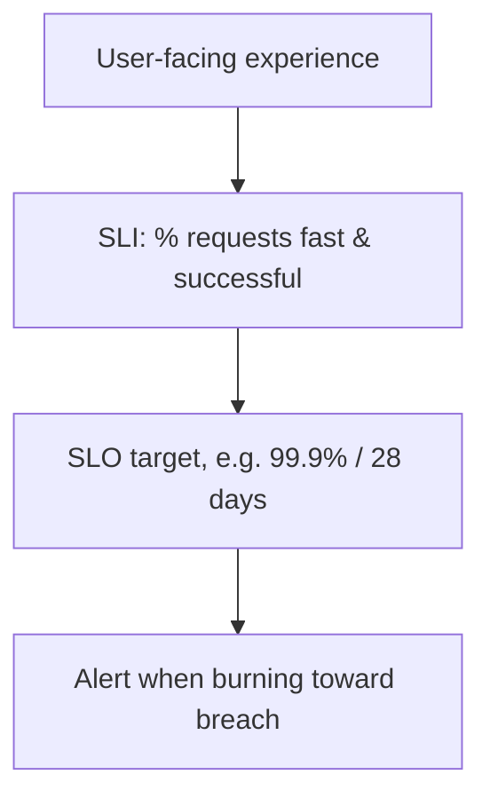
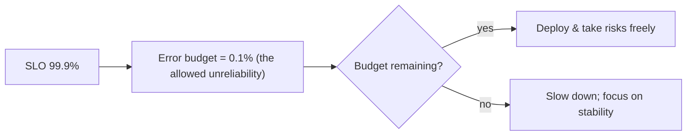
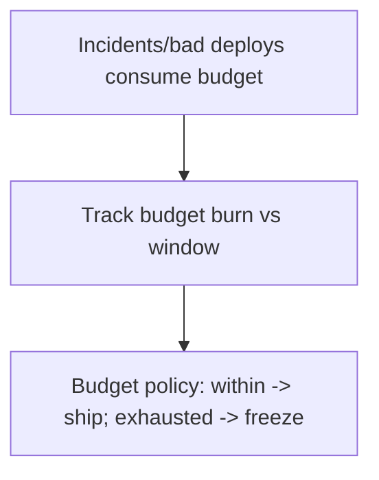

# Site Reliability Engineering - Complete Professional Guide

> **Category:** 07_devops_sre_operations · **Language:** English

---

### SLOs, error budgets, and engineering reliability
**Original guide written from first principles, current to 2026**

> **Original reference book (English).** This is an **independent, originally written** guide. It is not an extract, summary, or paraphrase of any third-party book; it teaches SRE from first principles with original examples. Canonical books are listed under **References** as pointers only. Each chapter follows the TO-BRAIN editorial standard (see `FILE_CONVENTIONS.md`).
>
> **Scope notice:** Site Reliability Engineering (SRE) treats operations as a software problem and reliability as a measurable, budgeted property. This guide covers SLIs/SLOs, error budgets, and reducing toil, current to 2026.

---

## How to read this guide

| Level | Profile | Parts |
|-------|---------|-------|
| 1 — Beginner | New to SRE | Part I |
| 2 — Intermediate | Setting SLOs | Part II |

**Target audience:** engineers and ops staff responsible for production reliability.

**Structure of each chapter:** Introduction · Business context · Theoretical concepts · Architecture · Diagrams (Mermaid) · Real examples · Step by step · Complete examples · Exercises · Challenges · Checklist · Best practices · Anti-patterns · Troubleshooting · References.

> **Note on prerequisites.** Assumes the DevOps-principles guide.

---

## Table of Contents

**Part I – Measuring reliability**
1. SLIs, SLOs, and "100% is the wrong target"
2. Error budgets

**Part II – Operating**
3. Toil and eliminating it with engineering

> **Status of this guide:** phased delivery. **Ready:** Part I (Ch. 1–2). **In progress:** Part II.

---

## Part I – Measuring reliability

SRE's key insight is that reliability must be **defined, measured, and budgeted** like any other engineering property — not pursued as a vague "keep it up." You set a target level of reliability based on user needs, measure how you're doing, and use the gap as a budget that governs how aggressively you can change the system.

---

## Chapter 1 — SLIs, SLOs, and the right target

### 1.1 Introduction

An **SLI** (Service Level Indicator) is a measured aspect of service quality — e.g. the proportion of requests served successfully under 200ms. An **SLO** (Service Level Objective) is a target for an SLI — e.g. "99.9% of requests succeed under 200ms over 28 days." The crucial SRE idea: **100% reliability is the wrong target** — it's impossible, ruinously expensive, and usually not what users need.

### 1.2 Business context

Chasing perfect uptime wastes enormous effort for diminishing returns and paralyzes change (every deploy threatens the streak). Defining an explicit SLO based on what users actually need lets a business invest the *right* amount in reliability — enough to keep users happy, not so much it strangles delivery. It turns "how reliable should we be?" from an emotional argument into a deliberate, data-informed target.

### 1.3 Theoretical concepts: indicator, objective, target


A good SLI measures what **users experience** (availability, latency, correctness), expressed as a ratio of good events to total. The SLO sets the target over a window. Set the SLO from user needs and cost, not at 100%: the gap between 100% and your SLO is deliberate room to operate (Chapter 2).

### 1.4 Architecture: SLO from the user's view



### 1.5 Real example

**Scenario.** A team aims for "100% uptime" and treats every minor blip as a crisis.

**Problem.** The target is unattainable and makes the team risk-averse and burned out; minor blips users never noticed trigger fire drills.

**Solution.** Define an SLI (successful requests) and a realistic SLO (99.9% over 28 days) from user expectations.

**Implementation (SLO definition).**

```text
SLI: proportion of HTTP requests that return < 500 AND within 300ms
SLO: >= 99.9% of such requests over a rolling 28-day window
  -> ~43 min/month of allowable "bad" budget (Chapter 2)
Alerts fire on fast burn of the budget, not on every transient blip.
```

**Result.** The team has a clear, achievable reliability bar tied to user experience; transient blips within budget no longer cause panic, and effort focuses on real threats to the SLO.

**Future improvements.** Validate the SLO against actual user satisfaction; adjust if users need more (or tolerate less).

### 1.6 Exercises

1. Distinguish SLI from SLO with an example of each.
2. Why is 100% reliability the wrong target?
3. What should a good SLI measure?

### 1.7 Challenges

- **Challenge.** For a service you run, define one user-centric SLI and a realistic SLO. Justify the target from user needs, not aspiration.

### 1.8 Checklist

- [ ] My SLIs measure user-facing quality.
- [ ] SLOs have explicit targets and windows.
- [ ] Targets come from user needs, not 100%.
- [ ] Alerts relate to SLO risk, not every blip.

### 1.9 Best practices

- Choose a few user-centric SLIs (availability, latency).
- Set SLOs deliberately below 100%, from real needs.
- Alert on SLO-threatening conditions, not noise.

### 1.10 Anti-patterns

- Targeting 100% / "five nines" without justification.
- SLIs that measure internals users don't feel.
- Alerting on every transient error.

### 1.11 Troubleshooting

| Symptom | Likely cause | Action |
|---------|--------------|--------|
| Team panics over tiny blips | No SLO; chasing 100% | Define a realistic SLO |
| Alert fatigue | Alerting on noise | Tie alerts to SLO burn |
| Reliability effort misdirected | SLIs measure internals | Re-anchor SLIs on user experience |

### 1.12 References

- B. Beyer, C. Jones, J. Petoff, N. Murphy (eds.), *Site Reliability Engineering* (O'Reilly, 2016) — ISBN 978-1491929124; https://sre.google/books/.
- Google, "The Site Reliability Workbook" (2018) — ISBN 978-1492029502.

---

## Chapter 2 — Error budgets

### 2.1 Introduction

If your SLO is 99.9%, then **0.1% unreliability is allowed** — that's your **error budget**. The error budget reframes reliability as a resource you can *spend*: as long as you're within budget, you can deploy and take risks freely; when you exhaust it, you slow down and prioritize stability. It's the mechanism that resolves the dev-vs-ops tension with data.

### 2.2 Business context

Developers want to ship; ops wants stability — an endless conflict resolved by the error budget. It converts a political argument into an objective rule: within budget, ship fast; over budget, stop feature work and fix reliability. This aligns everyone on the same number, removes blame, and ensures reliability gets attention exactly when it's needed — not too much (strangling delivery) or too little (angry users).

### 2.3 Theoretical concepts: spend the budget



The budget is consumed by incidents, bad deploys, and degradation. Spending it on bold changes is *fine* — that's its purpose. Running out triggers an agreed response (e.g. a feature freeze until reliability recovers). The policy is decided in advance, so it's not a negotiation during a crisis.

### 2.4 Architecture: budget governs change pace



### 2.5 Real example

**Scenario.** Dev and ops constantly argue about whether to ship or stabilize.

**Problem.** No objective basis — it's whoever argues hardest, breeding resentment.

**Solution.** An error-budget policy: while budget remains, ship; if a quarter's budget is exhausted, freeze features and fix reliability.

**Implementation (the policy).**

```text
SLO 99.9% / quarter -> error budget = 0.1% of the quarter
Policy (agreed upfront):
  budget remaining   -> normal feature delivery, free to take risks
  budget exhausted   -> feature freeze; only reliability work until recovered
Tracked on a shared dashboard; no debate needed — the number decides.
```

**Result.** The ship-vs-stabilize fight is replaced by a shared rule; reliability work happens automatically when (and only when) the budget says so. Both sides trust the same data.

**Future improvements.** Automate budget tracking and alert on burn rate so the team sees trouble before the budget is gone.

### 2.6 Exercises

1. What is an error budget, given an SLO?
2. Why is spending the error budget acceptable?
3. How does the budget resolve the dev-vs-ops tension?

### 2.7 Challenges

- **Challenge.** Compute the error budget for a 99.9% monthly SLO (minutes/month). Draft a one-line policy for what happens when it's exhausted.

### 2.8 Checklist

- [ ] I derive an error budget from the SLO.
- [ ] We can spend the budget on changes/risks.
- [ ] A pre-agreed policy governs budget exhaustion.
- [ ] Budget burn is tracked and visible.

### 2.9 Best practices

- Treat the budget as a resource to spend on velocity.
- Agree the exhaustion policy in advance.
- Track burn rate; act before the budget is gone.

### 2.10 Anti-patterns

- Ignoring the budget and shipping regardless.
- Treating any budget spend as failure.
- Negotiating the response during a crisis instead of pre-agreeing it.

### 2.11 Troubleshooting

| Symptom | Likely cause | Action |
|---------|--------------|--------|
| Endless ship-vs-stabilize fights | No error budget | Define SLO + budget policy |
| Reliability ignored until outages | Budget not enforced | Enforce the exhaustion policy |
| Surprise SLO breaches | No burn tracking | Monitor budget burn rate |

### 2.12 References

- B. Beyer et al. (eds.), *Site Reliability Engineering* (O'Reilly, 2016) — ISBN 978-1491929124; https://sre.google/books/.
- Google, "The Site Reliability Workbook" (2018) — ISBN 978-1492029502.

---

> **End of Part I.** You can now engineer reliability as a measured, budgeted property: define user-centric SLIs and realistic SLOs (never 100%), and derive an error budget that you spend freely on change while in budget and that triggers a pre-agreed stability focus when exhausted — resolving the dev-vs-ops tension with data. **Part II — Operating** (Chapter 3) covers toil — manual, repetitive operational work — and how SRE caps and eliminates it through automation so engineers spend time on lasting improvements.

<!--APPEND-PART-II-->
