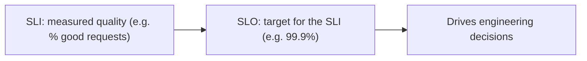
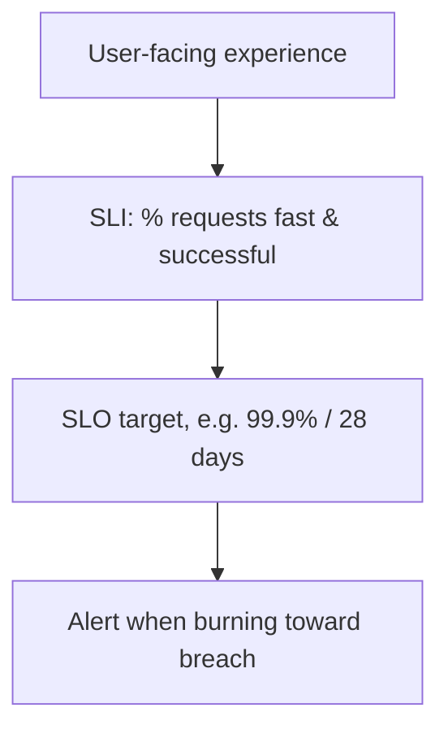
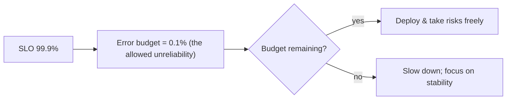
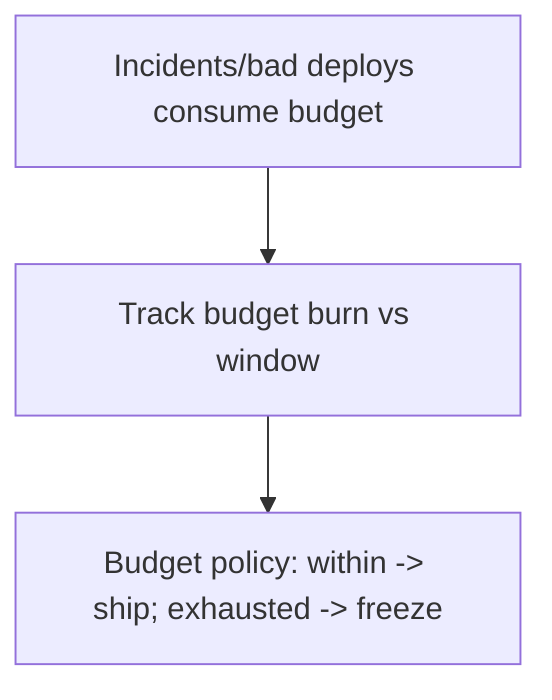
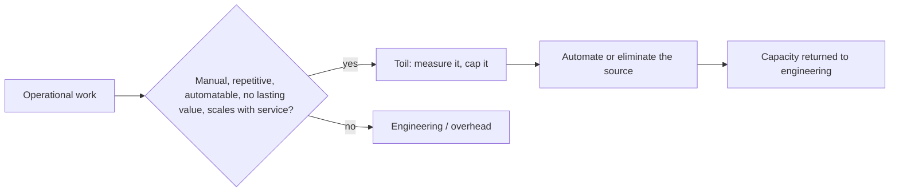
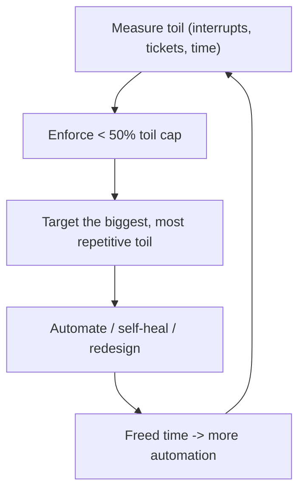

# Site Reliability Engineering - Complete Professional Guide

> **Category:** 07_devops_sre_operations · **Language:** English

---

### SLOs, error budgets, and engineering reliability
**Original guide written from first principles, current to 2026**

> **Original reference book (English).** This is an **independent, originally written** guide. It is not an extract, summary, or paraphrase of any third-party book; it teaches SRE from first principles with original examples. Canonical books are listed under **References** as pointers only. Each chapter follows the TO-BRAIN editorial standard (see `FILE_CONVENTIONS.md`).
>
> **Scope notice:** Site Reliability Engineering (SRE) treats operations as a software problem and reliability as a measurable, budgeted property. This guide covers SLIs/SLOs, error budgets, and reducing toil, current to 2026.

---

## How to read this guide

| Level | Profile | Parts |
|-------|---------|-------|
| 1 — Beginner | New to SRE | Part I |
| 2 — Intermediate | Setting SLOs | Part II |

**Target audience:** engineers and ops staff responsible for production reliability.

**Structure of each chapter:** Introduction · Business context · Theoretical concepts · Architecture · Diagrams (Mermaid) · Real examples · Step by step · Complete examples · Exercises · Challenges · Checklist · Best practices · Anti-patterns · Troubleshooting · References.

> **Note on prerequisites.** Assumes the DevOps-principles guide.

---

## Table of Contents

**Part I – Measuring reliability**
1. SLIs, SLOs, and "100% is the wrong target"
2. Error budgets

**Part II – Operating**
3. Toil and eliminating it with engineering

> **Status of this edition:** complete for its declared scope. **Ready:** Parts I–II (Ch. 1–3).

---

## Part I – Measuring reliability

SRE's key insight is that reliability must be **defined, measured, and budgeted** like any other engineering property — not pursued as a vague "keep it up." You set a target level of reliability based on user needs, measure how you're doing, and use the gap as a budget that governs how aggressively you can change the system.

---

## Chapter 1 — SLIs, SLOs, and the right target

### 1.1 Introduction

An **SLI** (Service Level Indicator) is a measured aspect of service quality — e.g. the proportion of requests served successfully under 200ms. An **SLO** (Service Level Objective) is a target for an SLI — e.g. "99.9% of requests succeed under 200ms over 28 days." The crucial SRE idea: **100% reliability is the wrong target** — it's impossible, ruinously expensive, and usually not what users need.

### 1.2 Business context

Chasing perfect uptime wastes enormous effort for diminishing returns and paralyzes change (every deploy threatens the streak). Defining an explicit SLO based on what users actually need lets a business invest the *right* amount in reliability — enough to keep users happy, not so much it strangles delivery. It turns "how reliable should we be?" from an emotional argument into a deliberate, data-informed target.

### 1.3 Theoretical concepts: indicator, objective, target



A good SLI measures what **users experience** (availability, latency, correctness), expressed as a ratio of good events to total. The SLO sets the target over a window. Set the SLO from user needs and cost, not at 100%: the gap between 100% and your SLO is deliberate room to operate (Chapter 2).

### 1.4 Architecture: SLO from the user's view



### 1.5 Real example

**Scenario.** A team aims for "100% uptime" and treats every minor blip as a crisis.

**Problem.** The target is unattainable and makes the team risk-averse and burned out; minor blips users never noticed trigger fire drills.

**Solution.** Define an SLI (successful requests) and a realistic SLO (99.9% over 28 days) from user expectations.

**Implementation (SLO definition).**

```text
SLI: proportion of HTTP requests that return < 500 AND within 300ms
SLO: >= 99.9% of such requests over a rolling 28-day window
  -> ~43 min/month of allowable "bad" budget (Chapter 2)
Alerts fire on fast burn of the budget, not on every transient blip.
```

**Result.** The team has a clear, achievable reliability bar tied to user experience; transient blips within budget no longer cause panic, and effort focuses on real threats to the SLO.

**Future improvements.** Validate the SLO against actual user satisfaction; adjust if users need more (or tolerate less).

### 1.6 Exercises

1. Distinguish SLI from SLO with an example of each.
2. Why is 100% reliability the wrong target?
3. What should a good SLI measure?

### 1.7 Challenges

- **Challenge.** For a service you run, define one user-centric SLI and a realistic SLO. Justify the target from user needs, not aspiration.

### 1.8 Checklist

- [ ] My SLIs measure user-facing quality.
- [ ] SLOs have explicit targets and windows.
- [ ] Targets come from user needs, not 100%.
- [ ] Alerts relate to SLO risk, not every blip.

### 1.9 Best practices

- Choose a few user-centric SLIs (availability, latency).
- Set SLOs deliberately below 100%, from real needs.
- Alert on SLO-threatening conditions, not noise.

### 1.10 Anti-patterns

- Targeting 100% / "five nines" without justification.
- SLIs that measure internals users don't feel.
- Alerting on every transient error.

### 1.11 Troubleshooting

| Symptom | Likely cause | Action |
|---------|--------------|--------|
| Team panics over tiny blips | No SLO; chasing 100% | Define a realistic SLO |
| Alert fatigue | Alerting on noise | Tie alerts to SLO burn |
| Reliability effort misdirected | SLIs measure internals | Re-anchor SLIs on user experience |

### 1.12 References

- B. Beyer, C. Jones, J. Petoff, N. Murphy (eds.), *Site Reliability Engineering* (O'Reilly, 2016) — ISBN 978-1491929124; https://sre.google/books/.
- Google, "The Site Reliability Workbook" (2018) — ISBN 978-1492029502.

---

## Chapter 2 — Error budgets

### 2.1 Introduction

If your SLO is 99.9%, then **0.1% unreliability is allowed** — that's your **error budget**. The error budget reframes reliability as a resource you can *spend*: as long as you're within budget, you can deploy and take risks freely; when you exhaust it, you slow down and prioritize stability. It's the mechanism that resolves the dev-vs-ops tension with data.

### 2.2 Business context

Developers want to ship; ops wants stability — an endless conflict resolved by the error budget. It converts a political argument into an objective rule: within budget, ship fast; over budget, stop feature work and fix reliability. This aligns everyone on the same number, removes blame, and ensures reliability gets attention exactly when it's needed — not too much (strangling delivery) or too little (angry users).

### 2.3 Theoretical concepts: spend the budget



The budget is consumed by incidents, bad deploys, and degradation. Spending it on bold changes is *fine* — that's its purpose. Running out triggers an agreed response (e.g. a feature freeze until reliability recovers). The policy is decided in advance, so it's not a negotiation during a crisis.

### 2.4 Architecture: budget governs change pace



### 2.5 Real example

**Scenario.** Dev and ops constantly argue about whether to ship or stabilize.

**Problem.** No objective basis — it's whoever argues hardest, breeding resentment.

**Solution.** An error-budget policy: while budget remains, ship; if a quarter's budget is exhausted, freeze features and fix reliability.

**Implementation (the policy).**

```text
SLO 99.9% / quarter -> error budget = 0.1% of the quarter
Policy (agreed upfront):
  budget remaining   -> normal feature delivery, free to take risks
  budget exhausted   -> feature freeze; only reliability work until recovered
Tracked on a shared dashboard; no debate needed — the number decides.
```

**Result.** The ship-vs-stabilize fight is replaced by a shared rule; reliability work happens automatically when (and only when) the budget says so. Both sides trust the same data.

**Future improvements.** Automate budget tracking and alert on burn rate so the team sees trouble before the budget is gone.

### 2.6 Exercises

1. What is an error budget, given an SLO?
2. Why is spending the error budget acceptable?
3. How does the budget resolve the dev-vs-ops tension?

### 2.7 Challenges

- **Challenge.** Compute the error budget for a 99.9% monthly SLO (minutes/month). Draft a one-line policy for what happens when it's exhausted.

### 2.8 Checklist

- [ ] I derive an error budget from the SLO.
- [ ] We can spend the budget on changes/risks.
- [ ] A pre-agreed policy governs budget exhaustion.
- [ ] Budget burn is tracked and visible.

### 2.9 Best practices

- Treat the budget as a resource to spend on velocity.
- Agree the exhaustion policy in advance.
- Track burn rate; act before the budget is gone.

### 2.10 Anti-patterns

- Ignoring the budget and shipping regardless.
- Treating any budget spend as failure.
- Negotiating the response during a crisis instead of pre-agreeing it.

### 2.11 Troubleshooting

| Symptom | Likely cause | Action |
|---------|--------------|--------|
| Endless ship-vs-stabilize fights | No error budget | Define SLO + budget policy |
| Reliability ignored until outages | Budget not enforced | Enforce the exhaustion policy |
| Surprise SLO breaches | No burn tracking | Monitor budget burn rate |

### 2.12 References

- B. Beyer et al. (eds.), *Site Reliability Engineering* (O'Reilly, 2016) — ISBN 978-1491929124; https://sre.google/books/.
- Google, "The Site Reliability Workbook" (2018) — ISBN 978-1492029502.

---

> **End of Part I.** You can now engineer reliability as a measured, budgeted property: define user-centric SLIs and realistic SLOs (never 100%), and derive an error budget that you spend freely on change while in budget and that triggers a pre-agreed stability focus when exhausted — resolving the dev-vs-ops tension with data. **Part II — Operating** (Chapter 3) covers toil — manual, repetitive operational work — and how SRE caps and eliminates it through automation so engineers spend time on lasting improvements.

---

## Part II – Operating

Part I made reliability a measured, budgeted property (SLIs, SLOs, error budgets). But there's a second force that determines whether an SRE team stays effective: how it spends its *time*. A team drowning in manual operational work has no capacity to improve anything — it just keeps the lights on, more expensively each quarter as the service grows. SRE's defining discipline is treating operations as a software problem: identifying **toil** and engineering it away so that human time goes to lasting improvements, not endless repetition. This chapter defines toil, explains the cap SRE places on it, and shows how to eliminate it.

---

## Chapter 3 — Toil and eliminating it with engineering

### 3.1 Introduction

**Toil** is operational work tied to running a service that is **manual, repetitive, automatable, tactical (interrupt-driven), devoid of enduring value, and that scales linearly with the service's size**. Restarting a hung process by hand, manually applying a config to ten servers, copy-pasting steps from a wiki during every deploy — all toil. It is not the same as overhead (meetings, email); it's the grind of *running* the system. SRE's signature move is to treat this work as a software-engineering problem: measure it, cap it, and **automate it away**, so that the cost of operating a service grows sublinearly even as the service grows.

### 3.2 Business context

Toil is dangerous precisely because it feels like "just doing the job." Left unchecked it consumes a team entirely: as the service grows, linear toil eventually eats 100% of capacity, leaving no time for engineering — so reliability and velocity stagnate, and the team burns out and attrits. Capping and eliminating toil is what lets a *fixed-size* team run an *ever-growing* service, which is the whole economic argument for SRE. Every hour of toil automated away is an hour returned to work that compounds (better tooling, better reliability), instead of an hour that must be paid again next week.

### 3.3 Theoretical concepts: identify, cap, automate



- **The hallmarks of toil** — manual, repetitive, automatable, tactical, no enduring value, O(n) with service growth. The more boxes a task ticks, the more it's toil.
- **The 50% cap** — Google's SRE rule: keep toil **below 50%** of each SRE's time, reserving the rest for engineering that reduces future toil and improves reliability. If toil exceeds the cap, that's a signal to push back (e.g. return pager load to the dev team) and invest in automation.
- **Eliminate the source, not just the symptom** — automating a bad manual process is good; redesigning the system so the work doesn't exist is better.
- **Measure it** — track toil (e.g. via ticket/interrupt accounting) so the cap is enforceable and progress is visible.

### 3.4 Architecture: turning toil into engineering capacity



### 3.5 Real example

**Scenario.** An on-call SRE manually restarts a memory-leaking service ~5 times a day and hand-edits a config across 12 hosts on every change. The team spends most of its week on this and has no time for improvements.

**Problem.** This work is pure toil — manual, repetitive, automatable, no lasting value, and growing as more hosts are added. It's pushing the team past 50% toil and toward burnout, with reliability never actually improving.

**Solution.** Measure the toil, then engineer it away: automate the restart as self-healing and replace hand-editing with config management — and fix the leak at the source.

**Implementation (eliminate the source, then automate the rest).**

```text
1. MEASURE
   - log each manual restart + each manual config edit (count, minutes)
   - result: ~3 hrs/day of toil, trending up with host count

2. ELIMINATE THE SOURCE (best)
   - file a bug for the memory leak; fix it -> restarts no longer needed

3. AUTOMATE WHAT REMAINS
   - until fixed: liveness probe / supervisor auto-restarts on OOM (self-healing)
   - config: move to a managed source-of-truth applied by automation
     (push once -> all hosts converge; O(1) human effort, not O(n))

4. RE-MEASURE against the < 50% toil cap; redirect freed time to the next toil source
```

**Result.** The leak fix removes the restart toil entirely; config management makes a 12-host change a single push instead of 12 manual edits; measured toil drops well under the 50% cap. The reclaimed time goes into more automation, so operating cost stops scaling with the fleet. The team escapes the treadmill.

**Future improvements.** Build a toil budget into planning and review it each cycle; create self-service tooling so common requests don't generate tickets; periodically re-audit for new toil that crept in as the system changed.

### 3.6 Exercises

1. List the hallmarks that make a task "toil", and classify two tasks from your own work.
2. Why does SRE cap toil at 50%, and what should happen when a team exceeds it?
3. Why is eliminating the *source* of toil better than automating the manual steps?

### 3.7 Challenges

- **Challenge.** Track one week of your operational work and tag each item as toil or engineering. Pick the single largest toil source and write a concrete plan to eliminate or automate it — including how you'd measure the time reclaimed.

### 3.8 Checklist

- [ ] Toil is identified by its hallmarks, not by gut feel.
- [ ] Toil is measured (interrupts/tickets/time), so it's visible.
- [ ] Toil is kept below the ~50% cap; exceeding it triggers action.
- [ ] Automation eliminates sources of toil, not just symptoms.
- [ ] Reclaimed time is reinvested in further toil reduction/reliability.

### 3.9 Best practices

- Measure toil continuously so the cap is enforceable.
- Attack the biggest, most repetitive toil first (highest leverage).
- Prefer fixing the system so the work disappears over automating the work.
- Protect engineering time; don't let toil silently expand to fill the week.

### 3.10 Anti-patterns

- Treating toil as "just the job" and never measuring it.
- Heroically absorbing rising toil until the team burns out.
- Automating a broken process instead of removing the need for it.
- Letting toil exceed 50% indefinitely with no push-back or investment.

### 3.11 Troubleshooting

| Symptom | Likely cause | Action |
|---------|--------------|--------|
| No time for engineering | Toil over the 50% cap | Measure it; automate the biggest source |
| Same manual fix, daily | Symptom automated, source untouched | Fix the root cause (e.g. the leak) |
| Effort grows with fleet size | O(n) manual work | Replace with O(1) automation/config management |
| Burnout, attrition on-call | Unbounded, unmeasured toil | Enforce the cap; return excess load to dev teams |

### 3.12 References

- B. Beyer, C. Jones, J. Petoff, N. Murphy (eds.), *Site Reliability Engineering* (O'Reilly, 2016) — ISBN 978-1491929124 — Ch. 5 "Eliminating Toil"; https://sre.google/books/.
- Google, "The Site Reliability Workbook" (2018) — ISBN 978-1492029502 — toil measurement and reduction.

---

> **End of Part II — and of the guide.** SRE's second pillar is **time discipline**: recognize **toil** — manual, repetitive, automatable work that scales with the service and carries no lasting value — measure it, keep it under the ~50% cap, and engineer it away (ideally by removing its source). Combined with Part I's measured, budgeted reliability (SLIs/SLOs/error budgets), this is what lets a fixed-size team run an ever-growing service reliably: human effort goes to improvements that compound, not to a treadmill that must be re-run every week.
