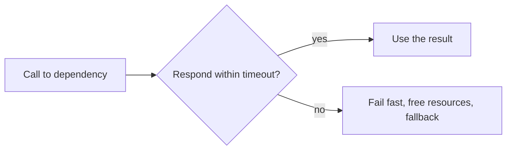
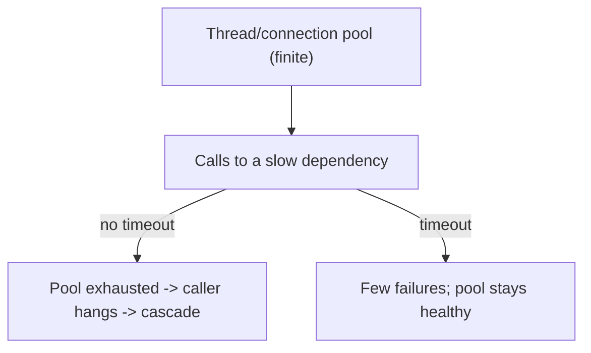
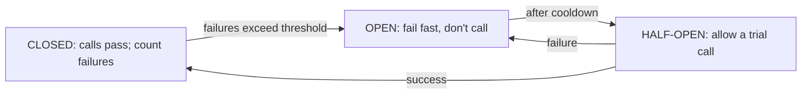
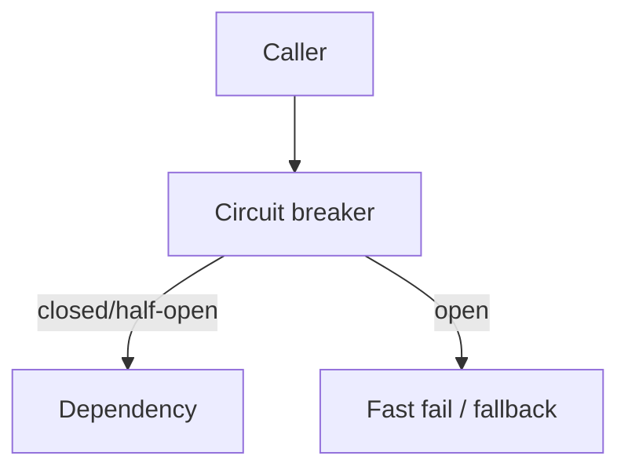
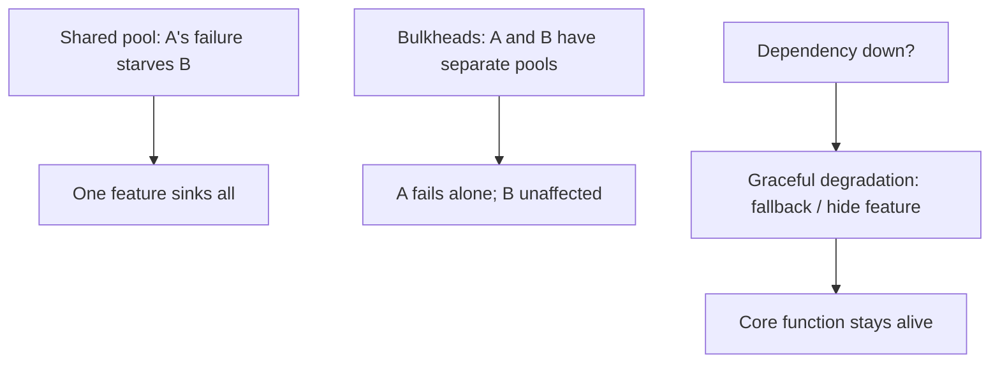
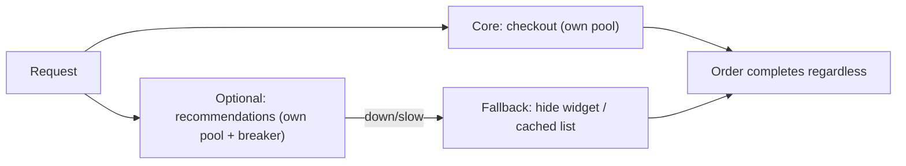

# Stability Patterns for Production - Complete Professional Guide

> **Category:** 07_devops_sre_operations · **Language:** English

---

### Timeouts, circuit breakers, and bulkheads that stop cascading failure
**Original guide written from first principles, current to 2026**

> **Original reference book (English).** This is an **independent, originally written** guide. It is not an extract, summary, or paraphrase of any third-party book; it teaches stability patterns from first principles with original examples. Canonical books are listed under **References** as pointers only. Each chapter follows the TO-BRAIN editorial standard (see `FILE_CONVENTIONS.md`).
>
> **Scope notice:** in production, the question isn't *if* dependencies fail but *when* — and whether one failure takes down everything. This guide covers stability patterns that contain failure: timeouts, circuit breakers, and bulkheads, current to 2026.

---

## How to read this guide

| Level | Profile | Parts |
|-------|---------|-------|
| 1 — Beginner | New to resilience | Part I |
| 2 — Intermediate | Hardening services | Part II |

**Target audience:** backend engineers and SREs building services that must survive partial failure.

**Structure of each chapter:** Introduction · Business context · Theoretical concepts · Architecture · Diagrams (Mermaid) · Real examples · Step by step · Complete examples · Exercises · Challenges · Checklist · Best practices · Anti-patterns · Troubleshooting · References.

> **Note on prerequisites.** Assumes the reactive-systems and SRE guides.

---

## Table of Contents

**Part I – Containing failure**
1. Timeouts and the danger of waiting forever
2. Circuit breakers

**Part II – Isolation**
3. Bulkheads and graceful degradation

> **Status of this edition:** complete for its declared scope. **Ready:** Parts I–II (Ch. 1–3).

---

## Part I – Containing failure

Every integration point is a place a failure can enter, and the default behaviors (wait forever, retry blindly) actively spread failure. Stability patterns are deliberate defenses that **contain** a failing dependency so it degrades one feature instead of toppling the whole system. They assume failure and engineer for it.

---

## Chapter 1 — Timeouts

### 1.1 Introduction

The most fundamental stability pattern is the **timeout**: never wait indefinitely for a response. A call to a slow or hung dependency must give up after a bounded time, freeing the resources (threads, connections) it holds. Missing timeouts are the single most common cause of cascading failure — one slow dependency exhausts a caller's resources, which exhausts *its* caller's, and so on.

### 1.2 Business context

A dependency rarely fails by going cleanly down; more often it gets **slow**. Without timeouts, callers pile up waiting, exhaust their thread/connection pools, and become unresponsive themselves — turning one slow service into a system-wide outage. Timeouts cap that blast radius: the slow dependency causes a few failed requests, not a total collapse. They are the cheapest, highest-impact resilience measure.

### 1.3 Theoretical concepts: bound every wait



Apply timeouts to **every** remote call (HTTP, DB, cache, queue). A timed-out call should fail fast and release its resources, optionally returning a fallback. The danger isn't outright failure — it's **unbounded waiting** that ties up finite resources until nothing is left.

### 1.4 Architecture: resource pools protected by timeouts



### 1.5 Real example

**Scenario.** A product page calls a recommendations service that becomes slow (not down).

**Problem.** With no timeout, request threads block waiting on recommendations; the thread pool fills; the *entire* product page stops responding.

**Solution.** A short timeout on the recommendations call — fail fast, render without recommendations.

**Implementation.**

```text
recommendations call: timeout = 100ms
  on timeout -> log, return empty recs (fallback), free the thread
result: a slow recs service costs one missing widget, not the whole page
```

**Result.** The slow dependency degrades one section; the page stays responsive because threads aren't held hostage. One failure stays contained.

**Future improvements.** Add a circuit breaker (Chapter 2) so the app stops calling a persistently-slow recs service entirely.

### 1.6 Exercises

1. Why is unbounded waiting more dangerous than outright failure?
2. Which calls need timeouts?
3. What should happen when a call times out?

### 1.7 Challenges

- **Challenge.** Audit your service for remote calls without timeouts. Add a bounded timeout and a fallback to the riskiest one.

### 1.8 Checklist

- [ ] Every remote call has a timeout.
- [ ] Timed-out calls free their resources.
- [ ] Fallbacks exist for non-critical dependencies.
- [ ] Slowness can't exhaust caller resource pools.

### 1.9 Best practices

- Set timeouts on all I/O (HTTP, DB, cache, queue).
- Fail fast and degrade gracefully on timeout.
- Size timeouts to real latency budgets, not guesses.

### 1.10 Anti-patterns

- Default/infinite timeouts on remote calls.
- Holding pool resources while waiting indefinitely.
- No fallback for a slow non-critical dependency.

### 1.11 Troubleshooting

| Symptom | Likely cause | Action |
|---------|--------------|--------|
| One slow dependency hangs everything | Missing timeouts | Add bounded timeouts + fallbacks |
| Thread/connection pool exhausted | Unbounded waits | Cap waits; free resources on timeout |
| Whole page fails for one widget | No graceful degradation | Fallback on timeout |

### 1.12 References

- M. Nygard, *Release It!*, 2nd ed. (Pragmatic Bookshelf, 2018) — ISBN 978-1680502398.
- AWS, "Timeouts, retries, and backoff with jitter": https://aws.amazon.com/builders-library/.

---

## Chapter 2 — Circuit breakers

### 2.1 Introduction

A **circuit breaker** stops calling a dependency that is clearly failing, giving it room to recover and failing fast for callers. Like an electrical breaker, it **trips open** after too many failures: while open, calls fail immediately (or use a fallback) instead of waiting and piling up. After a cooldown it allows a trial call to see if the dependency recovered.

### 2.2 Business context

Hammering a struggling dependency with requests (and retries) often makes it worse and wastes the caller's resources waiting for calls that will fail anyway. A circuit breaker cuts that off: it protects both the caller (fail fast, stay responsive) and the dependency (stop the pile-on, allow recovery). This prevents a localized failure from becoming a self-amplifying outage — a key resilience pattern for any system with remote dependencies.

### 2.3 Theoretical concepts: three states



- **Closed**: normal; calls go through, failures are counted.
- **Open**: the breaker tripped; calls fail immediately (or fall back) without hitting the dependency.
- **Half-open**: after a wait, a probe call tests recovery — success closes the breaker, failure re-opens it.

### 2.4 Architecture: breaker in front of a dependency



### 2.5 Real example

**Scenario.** A payment provider has an outage; the checkout keeps calling it and timing out on every request.

**Problem.** Even with timeouts, every checkout waits the full timeout and the dead provider is pointlessly hammered.

**Solution.** A circuit breaker trips after repeated failures — checkout fails fast (or queues) instead of waiting, and stops pounding the provider.

**Implementation (breaker behavior).**

```text
payment breaker: trip after 5 failures in 10s
  OPEN: checkout immediately returns "try another method"/queues (no wait)
  after 30s -> HALF-OPEN: one trial payment
    success -> CLOSED (provider back)
    failure -> OPEN again (wait another 30s)
```

**Result.** During the outage, checkout stays fast (no per-request timeout wait) and the recovering provider isn't overwhelmed by a thundering herd. Recovery is detected automatically.

**Future improvements.** Combine with retries-with-jitter for transient blips, and a bulkhead (Chapter 3) so payment issues can't starve other features.

### 2.6 Exercises

1. Name the three circuit-breaker states and the transitions.
2. Why does failing fast help both caller and dependency?
3. What does half-open accomplish?

### 2.7 Challenges

- **Challenge.** Wrap a flaky dependency in a circuit breaker. Simulate an outage and confirm calls fail fast while open and recover via half-open.

### 2.8 Checklist

- [ ] Risky dependencies sit behind a circuit breaker.
- [ ] Open state fails fast / uses a fallback.
- [ ] Half-open probes for recovery.
- [ ] Thresholds and cooldowns are tuned to the dependency.

### 2.9 Best practices

- Put breakers around remote dependencies that can fail.
- Pair breakers with timeouts and sensible fallbacks.
- Expose breaker state as a metric.

### 2.10 Anti-patterns

- Blindly retrying a dead dependency (thundering herd).
- No fast-fail path, so callers always wait the timeout.
- Breakers with thresholds that never trip (or trip constantly).

### 2.11 Troubleshooting

| Symptom | Likely cause | Action |
|---------|--------------|--------|
| Dead dependency hammered by retries | No circuit breaker | Add one to fail fast and back off |
| Callers slow during an outage | Always waiting the timeout | Breaker to fail fast when open |
| Breaker never recovers | No/!broken half-open probe | Implement half-open trial calls |

### 2.12 References

- M. Nygard, *Release It!*, 2nd ed. (Pragmatic Bookshelf, 2018) — ISBN 978-1680502398.
- M. Fowler, "CircuitBreaker": https://martinfowler.com/bliki/CircuitBreaker.html.

---

> **End of Part I.** You can now contain failure with two foundational stability patterns: timeouts that bound every wait so a slow dependency can't exhaust your resources, and circuit breakers that stop calling a clearly-failing dependency — failing fast for callers and giving the dependency room to recover. **Part II — Isolation** (Chapter 3) covers bulkheads (partitioning resources so one overloaded feature can't sink the whole ship) and graceful degradation strategies for keeping core functionality alive under partial failure.

---

## Part II – Isolation

Timeouts and circuit breakers (Part I) contain a failure *at the integration point*. But failures also spread *inside* your own system: one overloaded feature can consume every thread, connection, or megabyte until unrelated features starve too. Isolation patterns draw internal walls so a problem stays in one compartment, and degradation strategies let the system keep serving its core function even when parts are failing. This chapter covers **bulkheads** and **graceful degradation** — how to keep the ship afloat when one compartment floods.

---

## Chapter 3 — Bulkheads and graceful degradation

### 3.1 Introduction

A **bulkhead** (named for a ship's watertight compartments) partitions resources so a failure in one part can't consume the resources of the whole. If feature A and feature B share one thread pool, A's slowdown starves B; give each its own pool and A's failure is contained to A. **Graceful degradation** is the complementary strategy: when a dependency or resource is unavailable, **shed or substitute** non-essential functionality rather than failing entirely — serve a cached value, hide a recommendations widget, queue work for later — so the core experience survives. Both rest on the same principle: decide *in advance* what to sacrifice so a partial failure stays partial.

### 3.2 Business context

Without bulkheads, a single misbehaving feature takes down the entire application — the classic outage where "the recommendations service got slow and the whole site went down." That's a catastrophic over-reaction to a minor problem. Bulkheads and degradation convert total outages into *partial* ones: the site stays up and takes orders even if recommendations or reviews are temporarily gone. For the business, that's the difference between losing one feature and losing all revenue during an incident — and it's usually the non-critical features that fail, so protecting the core is high-value.

### 3.3 Theoretical concepts: partition resources, shed the non-essential



- **Bulkhead** — partition any shared resource (thread pools, connection pools, separate instances/clusters per tenant or feature) so exhaustion in one partition can't drain the others. Pairs naturally with timeouts and circuit breakers, which keep one bulkhead's failure from leaking.
- **Graceful degradation** — pre-decide a fallback for each non-critical dependency: cached/stale data, a default value, a hidden widget, or deferred (queued) processing. The core path must not depend on the optional one.
- **Decide what's essential up front** — degradation only works if you've classified features by criticality *before* the incident, so the system knows what to drop.
- **Back pressure / load shedding** — when overloaded, reject or shed excess work fast rather than accepting it and collapsing.

### 3.4 Architecture: compartments with fallbacks



### 3.5 Real example

**Scenario.** An e-commerce site calls a recommendations service on every product and checkout page. They share the web tier's single thread pool. When recommendations gets slow, every thread blocks waiting on it.

**Problem.** No isolation: the slow optional dependency consumes all threads, so checkout — the revenue path — also hangs. A minor feature's failure becomes a full-site outage.

**Solution.** Bulkhead recommendations into its own bounded pool behind a circuit breaker, and degrade gracefully (hide the widget) when it's unavailable.

**Implementation (bulkhead + fallback).**

```text
BULKHEAD: give recommendations its own small, bounded thread pool
  - core request threads NEVER block on recommendations
  - if the rec pool is exhausted, calls are rejected immediately (fail fast)

CIRCUIT BREAKER (from Part I) around the rec call:
  - trips when rec is failing -> stop calling for a cool-off

GRACEFUL DEGRADATION (pre-decided fallback):
  recommendations available?
    yes -> render the widget
    no  -> hide the widget (or show a cached/generic list)
  checkout path has ZERO dependency on recommendations
```

```java
// Illustrative: isolate the optional call in its own bounded pool
ExecutorService recPool = Executors.newFixedThreadPool(8); // bulkhead
List<Item> recs;
try {
    recs = recPool.submit(() -> recommendationService.fetch(userId))
                  .get(150, TimeUnit.MILLISECONDS);          // timeout
} catch (Exception e) {
    recs = Collections.emptyList();   // graceful degradation: just hide it
}
// checkout proceeds regardless of recs
```

**Result.** When recommendations slows, only its 8-thread bulkhead fills; core request threads are untouched, so product pages and checkout stay fast. The widget simply disappears (graceful degradation) until recommendations recovers. A would-be full outage becomes an invisible-to-most partial degradation, and revenue keeps flowing.

**Future improvements.** Bulkhead per tenant to stop one noisy customer affecting others; add load shedding/back pressure at the edge; rehearse degradation in Game Days (from the DevOps Principles guide) so fallbacks are known to work.

### 3.6 Exercises

1. Explain the ship's-bulkhead analogy and how it maps to thread/connection pools.
2. Why must the core path have no dependency on an optional feature for graceful degradation to work?
3. How do bulkheads, timeouts, and circuit breakers reinforce each other?

### 3.7 Challenges

- **Challenge.** Take an app with one critical path and two optional features. Design bulkheads (separate bounded pools) and a pre-decided fallback for each optional feature, then describe what the user sees when each optional dependency fails — proving the core path survives.

### 3.8 Checklist

- [ ] Optional dependencies are isolated in their own bounded resource pools.
- [ ] The core path has no hard dependency on optional features.
- [ ] Each non-critical dependency has a pre-decided fallback.
- [ ] Features are classified by criticality before incidents, not during.
- [ ] Bulkheads are paired with timeouts and circuit breakers.

### 3.9 Best practices

- Partition resources (pools, instances) by feature/tenant criticality.
- Pre-decide and test the fallback for every optional dependency.
- Fail fast inside a full bulkhead rather than queuing unbounded work.
- Protect the revenue/core path above all; let optional features degrade.

### 3.10 Anti-patterns

- One shared thread/connection pool for critical and optional work alike.
- A core path that hard-depends on an optional service.
- "Degradation" invented during the incident because nothing was pre-decided.
- Unbounded queues that turn overload into collapse instead of shedding load.

### 3.11 Troubleshooting

| Symptom | Likely cause | Action |
|---------|--------------|--------|
| One slow feature takes down the site | Shared resource pool, no bulkhead | Isolate features into bounded pools |
| Checkout fails when an optional service is down | Core path depends on optional dep | Remove the dependency; add a fallback |
| System collapses under load spikes | No load shedding / unbounded queues | Apply back pressure; fail fast when full |
| Fallback didn't work in an incident | Degradation never tested | Rehearse degradation (Game Days) |

### 3.12 References

- M. Nygard, *Release It!*, 2nd ed. (Pragmatic Bookshelf, 2018) — ISBN 978-1680502398 — Stability Patterns: Bulkheads, Steady State, Fail Fast, and graceful degradation.
- Related: the timeout and circuit-breaker patterns of Part I; chaos/Game-Day practice from the DevOps Principles guide.

---

> **End of Part II — and of the guide.** Beyond containing failure at the boundary (Part I's timeouts and circuit breakers), you can now isolate it *inside* the system: **bulkheads** partition resources so one overloaded feature can't starve the rest, and **graceful degradation** sheds or substitutes non-essential functionality so the core experience survives partial failure. Together these turn the default catastrophe — one minor dependency toppling everything — into a contained, often invisible, partial degradation. That is what production-grade stability means: assume failure, and engineer so it stays small.
