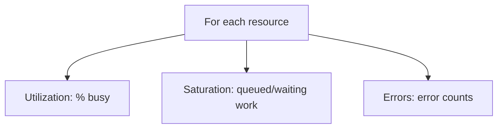
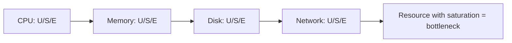
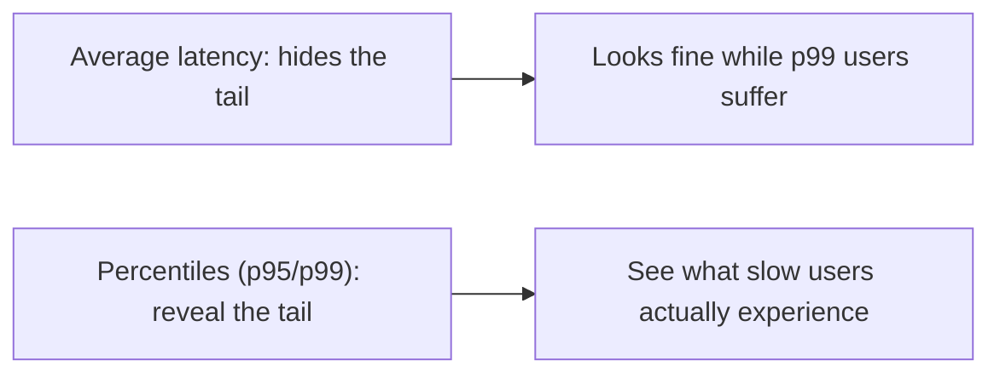
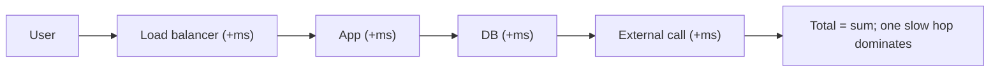

# Systems Performance Analysis - Complete Professional Guide

> **Category:** 07_devops_sre_operations · **Language:** English

---

### Finding bottlenecks with method, not guesswork
**Original guide written from first principles, current to 2026**

> **Original reference book (English).** This is an **independent, originally written** guide. It is not an extract, summary, or paraphrase of any third-party book; it teaches systems performance from first principles with original examples. Canonical books are listed under **References** as pointers only. Each chapter follows the TO-BRAIN editorial standard (see `FILE_CONVENTIONS.md`).
>
> **Scope notice:** performance analysis is finding *where* time and resources actually go, using systematic methods instead of guessing. This guide covers a methodical approach (the USE method), latency thinking, and where to look across the stack, current to 2026.

---

## How to read this guide

| Level | Profile | Parts |
|-------|---------|-------|
| 1 — Beginner | New to perf analysis | Part I |
| 2 — Intermediate | Diagnosing bottlenecks | Part II |

**Target audience:** developers and SREs diagnosing slow or resource-hungry systems.

**Structure of each chapter:** Introduction · Business context · Theoretical concepts · Architecture · Diagrams (Mermaid) · Real examples · Step by step · Complete examples · Exercises · Challenges · Checklist · Best practices · Anti-patterns · Troubleshooting · References.

> **Note on prerequisites.** Assumes basic OS concepts (CPU, memory, I/O).

---

## Table of Contents

**Part I – Method**
1. Measure, don't guess: the USE method
2. Latency and the importance of the right metric

**Part II – Across the stack**
3. Resources: CPU, memory, disk, network

> **Status of this guide:** phased delivery. **Ready:** Part I (Ch. 1–2). **In progress:** Part II.

---

## Part I – Method

The biggest mistake in performance work is **guessing** — optimizing the thing you assume is slow rather than measuring what actually is. A method directs your investigation so you find the real bottleneck quickly instead of randomly tuning. Performance is a discipline of measurement and elimination, not intuition.

---

## Chapter 1 — The USE method

### 1.1 Introduction

The **USE method** is a fast, systematic way to find resource bottlenecks: for **every resource** (CPU, memory, disk, network), check three things — **Utilization** (how busy it is), **Saturation** (how much queued/extra work is waiting), and **Errors**. Working through the checklist surfaces the constrained resource quickly, before you waste time optimizing the wrong thing.

### 1.2 Business context

Random performance tuning wastes engineering time and often makes things worse (optimizing a non-bottleneck). A methodical approach finds the real constraint fast, so effort goes where it actually helps — shortening incidents and avoiding pointless work. For a business, faster diagnosis means less downtime and less money spent chasing phantom problems. Method turns performance from art into repeatable engineering.

### 1.3 Theoretical concepts: U, S, E per resource



For CPU, memory, disks, and network interfaces, ask all three. **High utilization alone** isn't necessarily a problem (a resource can be 100% busy and keeping up); **saturation** (a growing queue) is the strong signal of a bottleneck. **Errors** often explain anomalies. The resource with high saturation is your suspect.

### 1.4 Architecture: a checklist over resources



### 1.5 Real example

**Scenario.** A service is slow; the team assumes "we need more CPU."

**Problem.** They're guessing; CPU might not be the constraint.

**Solution.** Run the USE checklist; find which resource is actually saturated.

**Implementation (the checklist outcome).**

```text
CPU:    util 40%, saturation low, no errors   -> NOT the bottleneck
Memory: util 70%, low swap                     -> ok
Disk:   util 99%, high queue (saturation!)     -> BOTTLENECK
Network: util 10%                              -> ok
Conclusion: disk I/O is the constraint, not CPU. Add capacity / reduce I/O there.
```

**Result.** The real bottleneck (disk I/O saturation) is identified; buying more CPU would have wasted money and not helped. Effort targets disk.

**Future improvements.** Profile what's driving the disk I/O (queries, logging) and reduce it at the source.

### 1.6 Exercises

1. What three things does USE check per resource?
2. Why is saturation a stronger bottleneck signal than utilization?
3. Why does a method beat guessing?

### 1.7 Challenges

- **Challenge.** On a slow system, run the USE checklist across CPU/memory/disk/network. Which resource shows saturation? Was it what you'd have guessed?

### 1.8 Checklist

- [ ] I measure before optimizing.
- [ ] I check U/S/E for every resource.
- [ ] I treat saturation as the key bottleneck signal.
- [ ] I confirm the constraint before acting.

### 1.9 Best practices

- Apply USE systematically across resources.
- Trust measurements over intuition.
- Optimize the saturated resource, not the assumed one.

### 1.10 Anti-patterns

- Optimizing by guesswork/assumption.
- Treating high utilization alone as the problem.
- Adding capacity to a non-bottleneck.

### 1.11 Troubleshooting

| Symptom | Likely cause | Action |
|---------|--------------|--------|
| Tuning doesn't help | Wrong bottleneck targeted | Run USE to find the real one |
| "Add more CPU" reflex | No measurement | Check saturation per resource |
| Anomalous slowness | Resource errors | Inspect error counts |

### 1.12 References

- B. Gregg, *Systems Performance*, 2nd ed. (Addison-Wesley, 2020) — ISBN 978-0136820154.
- B. Gregg, "The USE Method": https://www.brendangregg.com/usemethod.html.

---

## Chapter 2 — Latency and the right metric

### 2.1 Introduction

**Latency** — the time an operation takes — is often the metric that matters most, because it's what users feel. But measuring it well is subtle: **averages hide problems**. You must look at **distributions and percentiles** (p95, p99) and understand that latency compounds across a request's path. Picking the right metric and the right summary is half of performance analysis.

### 2.2 Business context

Optimizing the wrong metric (throughput when users care about tail latency, or averages when the tail is what hurts) wastes effort and leaves users unhappy. Measuring latency correctly — at the right percentiles and the right point in the stack — ensures you improve what users actually experience. This directly affects satisfaction, conversion, and SLO compliance (see the SRE guide), making it a business-critical skill, not just a technical one.

### 2.3 Theoretical concepts: percentiles, not averages



A mean can look healthy while the slowest 1% (p99) are terrible — and at scale, that 1% is many users, amplified further by request fan-out. Always examine the **distribution**. Also measure latency at the **right layer** (end-to-end user latency vs a single component) so you optimize where the time really goes.

### 2.4 Architecture: latency compounds along the path



### 2.5 Real example

**Scenario.** A dashboard shows "average latency 50ms" but users complain it's slow.

**Problem.** The average hides a heavy tail: p99 is 2 seconds, affecting many users.

**Solution.** Measure percentiles; find and fix the tail's cause.

**Implementation (right metric).**

```text
mean latency: 50ms          -> looks fine (misleading)
p50: 30ms  p95: 400ms  p99: 2000ms   -> the tail is the real story
investigate p99 requests -> a slow DB query on a code path -> optimize it
```

**Result.** The misleading average is replaced by percentile insight; the slow-tail cause (a specific query) is found and fixed, improving the experience for the users who were actually suffering.

**Future improvements.** Alert on p99 against an SLO, not on averages; trace tail requests (see the observability guide).

### 2.6 Exercises

1. Why are averages dangerous for latency?
2. What do p95/p99 reveal that a mean doesn't?
3. Why measure latency at the right layer?

### 2.7 Challenges

- **Challenge.** For an endpoint, compare its mean latency to p95/p99. Is the tail much worse? Investigate one slow-tail request.

### 2.8 Checklist

- [ ] I measure latency distributions, not just averages.
- [ ] I track p95/p99 for user-facing operations.
- [ ] I measure at the layer that matters.
- [ ] I optimize the tail where users feel it.

### 2.9 Best practices

- Report and alert on percentiles, not means.
- Trace and fix tail latency, not just the median.
- Measure end-to-end user latency, then decompose.

### 2.10 Anti-patterns

- Judging performance by average latency.
- Optimizing throughput when users feel latency.
- Measuring the wrong layer.

### 2.11 Troubleshooting

| Symptom | Likely cause | Action |
|---------|--------------|--------|
| "Fast on average," users complain | Hidden tail | Look at p95/p99; fix the tail |
| Optimization doesn't help users | Wrong metric/layer | Measure end-to-end percentiles |
| Random slowness | Specific slow path in the tail | Trace tail requests |

### 2.12 References

- B. Gregg, *Systems Performance*, 2nd ed. (Addison-Wesley, 2020) — ISBN 978-0136820154.
- G. Tene, "How NOT to Measure Latency" (on percentiles/coordinated omission).

---

> **End of Part I.** You can now approach performance methodically: use the USE method (Utilization, Saturation, Errors per resource) to find the real bottleneck instead of guessing, and measure latency correctly via distributions and percentiles (p95/p99) at the layer users feel — optimizing the tail, not the misleading average. **Part II — Across the stack** (Chapter 3) goes resource by resource (CPU, memory, disk, network), covering what saturates each, the tools to observe it, and common remedies.

<!--APPEND-PART-II-->
