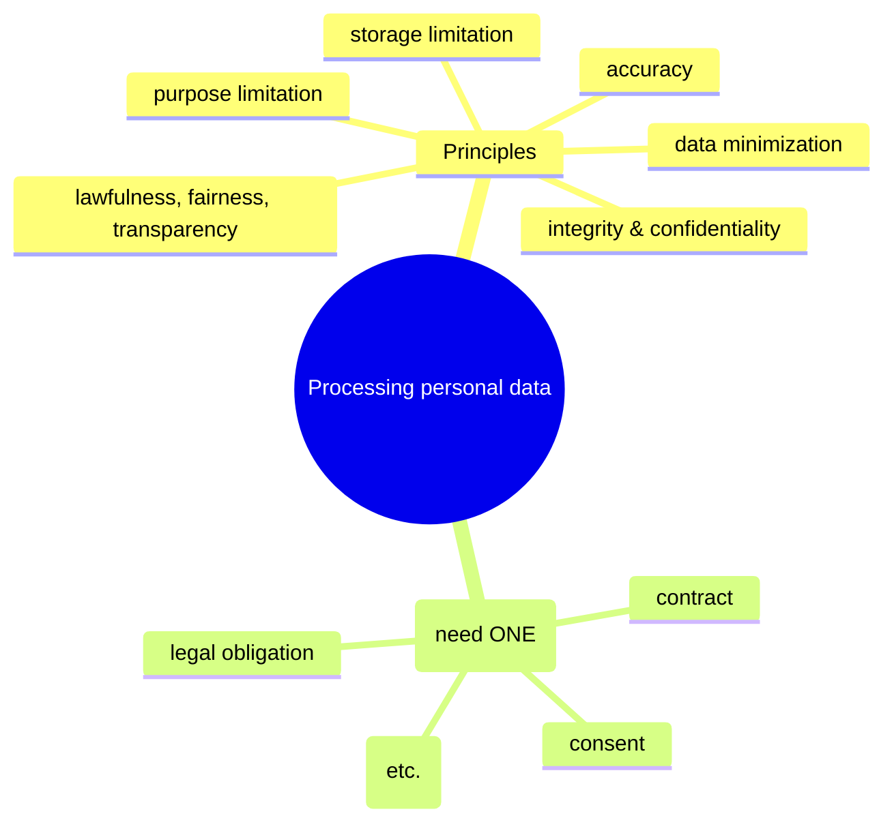
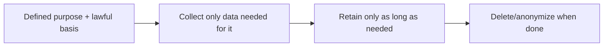
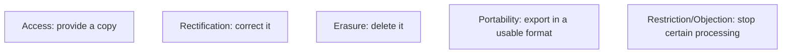
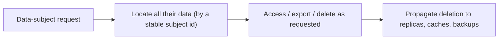
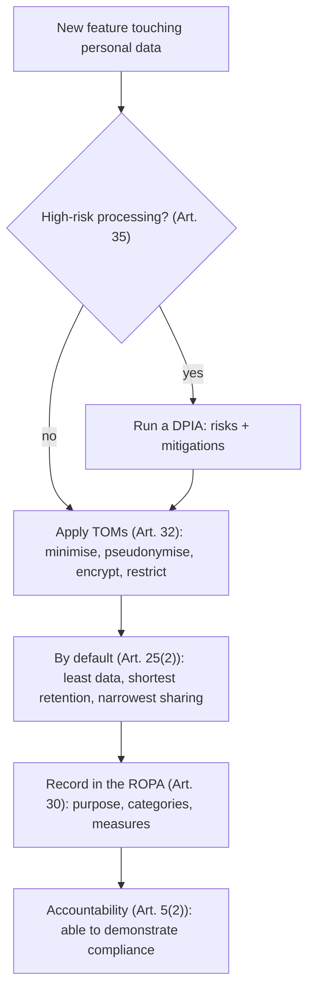
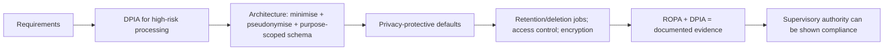

# Data Protection and GDPR Compliance - Complete Professional Guide

> **Category:** 09_security_and_privacy · **Language:** English

---

### Lawful basis, data-subject rights, and the principles of data protection
**Original guide written from first principles, current to 2026**

> **Original reference book (English).** This is an **independent, originally written** guide. It is not an extract, summary, or paraphrase of any third-party book; it explains data-protection law from first principles. It is **informational, not legal advice**. Canonical references are listed under **References** as pointers only. Each chapter follows the TO-BRAIN editorial standard (see `FILE_CONVENTIONS.md`).
>
> **Scope notice:** the GDPR (and similar laws like Brazil's LGPD) governs how personal data is processed. This guide covers the principles, lawful bases, and data-subject rights that developers and teams must build for, current to 2026.

---

## How to read this guide

| Level | Profile | Parts |
|-------|---------|-------|
| 1 — Beginner | New to data protection | Part I |
| 2 — Intermediate | Building compliant systems | Part II |

**Target audience:** developers, architects, and product people handling personal data.

**Structure of each chapter:** Introduction · Business context · Theoretical concepts · Architecture · Diagrams (Mermaid) · Real examples · Step by step · Complete examples · Exercises · Challenges · Checklist · Best practices · Anti-patterns · Troubleshooting · References.

> **Note on prerequisites.** None. **Not legal advice** — consult a qualified professional for specific cases.

---

## Table of Contents

**Part I – Foundations**
1. Principles and lawful basis
2. Data-subject rights

**Part II – Building for it**
3. Privacy by design in practice

> **Status of this guide:** complete. **Ready:** Part I (Ch. 1–2) and Part II (Ch. 3).

---

## Part I – Foundations

Data-protection law treats **personal data** (anything identifying a person) as something you may process only under defined conditions and principles. For engineers, the key shift is that personal data isn't yours to use freely — every use needs a justification and must respect the person's rights. Building this in is far cheaper than retrofitting it after a complaint or fine.

---

## Chapter 1 — Principles and lawful basis

### 1.1 Introduction

The GDPR sets **principles** for processing personal data — including **lawfulness**, **purpose limitation** (use data only for the stated purpose), **data minimization** (collect only what's needed), **accuracy**, **storage limitation** (keep it only as long as needed), and **security**. And every processing activity needs a **lawful basis** — a legal justification such as consent, contract, legal obligation, or legitimate interest.

### 1.2 Business context

Non-compliance carries severe fines (a percentage of global revenue) and reputational damage, and increasingly blocks market access. But beyond avoiding penalties, respecting these principles builds user trust and reduces risk (less data held = less to breach). Engineers who understand purpose limitation and minimization design systems that are compliant *and* leaner. Treating data protection as a design constraint, not an afterthought, is both a legal necessity and good engineering.

### 1.3 Theoretical concepts: principles + a lawful basis



Before processing personal data you must (a) have a **lawful basis** and (b) honor all the **principles**. "We might find it useful later" is not a basis — you need a specific purpose and justification *up front*. Minimization and purpose limitation directly shape what your schema should and shouldn't store.

### 1.4 Architecture: purpose drives the data model



### 1.5 Real example

**Scenario.** A signup form collects date of birth, phone, and address "in case we need them."

**Problem.** No purpose or lawful basis for that data — it violates minimization and purpose limitation, and increases breach risk.

**Solution.** Collect only what the actual purpose (creating an account) requires; justify each field.

**Implementation (minimization by design).**

```text
Purpose: create and authenticate an account
  needed: email, password         -> lawful basis: contract
  NOT needed now: DOB, phone, address  -> don't collect
  if a later feature needs DOB (e.g. age check): collect then, with its own basis
Retention: delete account data on request / after account closure + legal period
```

**Result.** The form collects only what's justified; less personal data is held (less risk, clearer compliance), and each field maps to a purpose and basis. Compliance and good data hygiene align.

**Future improvements.** Document a processing record (what data, why, basis, retention) — required and useful.

### 1.6 Exercises

1. Name four GDPR principles.
2. What is a "lawful basis" and why is one required?
3. How does purpose limitation shape a schema?

### 1.7 Challenges

- **Challenge.** Audit a form/table holding personal data. For each field, state the purpose and lawful basis. Drop any field that has neither.

### 1.8 Checklist

- [ ] Every processing activity has a lawful basis.
- [ ] I collect only data needed for a stated purpose.
- [ ] Data is retained only as long as needed.
- [ ] Principles (accuracy, security, etc.) are respected.

### 1.9 Best practices

- Define purpose and lawful basis before collecting.
- Minimize: collect and keep the least data possible.
- Set and enforce retention/deletion.

### 1.10 Anti-patterns

- Collecting data "just in case" with no purpose.
- Reusing data for new purposes without a basis.
- Indefinite retention of personal data.

### 1.11 Troubleshooting

| Symptom | Likely cause | Action |
|---------|--------------|--------|
| Holding data with no justification | No purpose/basis | Stop collecting; delete it |
| Data used for unintended purpose | Purpose limitation breach | Get a basis or stop the use |
| Old personal data piling up | No retention policy | Define and enforce retention |

### 1.12 References

- P. Voigt, A. von dem Bussche, *The EU GDPR: A Practical Guide*, 2nd ed. (Springer, 2017) — ISBN 978-3319579580.
- GDPR full text: https://gdpr-info.eu; Brazil LGPD: Lei nº 13.709/2018.

---

## Chapter 2 — Data-subject rights

### 2.1 Introduction

The GDPR gives people (**data subjects**) rights over their personal data, which systems must be able to honor: the right to **access** (get a copy), **rectification** (correct it), **erasure** ("right to be forgotten"), **portability** (receive it in a usable format), **restriction**, and **objection**. These aren't optional features — when a person exercises a right, you must comply within a deadline.

### 2.2 Business context

If your architecture can't find, export, or delete one person's data on request, you can't comply — and that's a legal failure with fines attached. Many systems that scattered personal data across services and backups struggle here. Designing for these rights up front (knowing where a person's data lives, being able to delete it) avoids frantic, error-prone retrofits and demonstrates the trustworthiness users increasingly demand.

### 2.3 Theoretical concepts: rights you must serve



To honor these you must be able to **locate all of a person's data** (across services, logs, backups), **export** it, and **delete** it on request — including from derived/replicated stores. This is an architectural requirement: data spread without tracking makes rights nearly impossible to serve.

### 2.4 Architecture: find, export, delete per person



### 2.5 Real example

**Scenario.** A user invokes their right to erasure.

**Problem.** Their data is in the main DB, a search index, an analytics warehouse, and backups — with no map of where.

**Solution.** Architect around a stable subject identifier and a deletion process that propagates everywhere.

**Implementation (erasure flow).**

```text
On erasure request for subject S:
  1. delete S's rows in the primary DB
  2. remove S from the search index and caches
  3. anonymize/delete S in the analytics warehouse
  4. flag S for purge from backups per the backup policy
  -> confirm and log completion within the legal deadline
Requires: every store keyed/traceable by the subject id.
```

**Result.** The person's data is removed everywhere it lives, on time — because the architecture tracks data by subject and propagates deletion. The right is genuinely honored, not just in the main DB.

**Future improvements.** Automate the flow; maintain a data map of where personal data resides for each subject.

### 2.6 Exercises

1. List four data-subject rights.
2. Why are these an architectural concern, not just a feature?
3. What's hard about the right to erasure in a distributed system?

### 2.7 Challenges

- **Challenge.** For your system, trace where one user's personal data lives (all stores, logs, backups). Could you delete it all on request? Note the gaps.

### 2.8 Checklist

- [ ] I can locate all of a person's data.
- [ ] I can export it in a usable format.
- [ ] I can delete it across all stores on request.
- [ ] Deletion propagates to replicas/caches/backups.

### 2.9 Best practices

- Key personal data by a stable subject id for findability.
- Design deletion to propagate everywhere.
- Maintain a data map of where personal data resides.

### 2.10 Anti-patterns

- Personal data scattered with no way to find it per person.
- Deletion that misses replicas, indexes, or backups.
- Treating rights as an afterthought.

### 2.11 Troubleshooting

| Symptom | Likely cause | Action |
|---------|--------------|--------|
| Can't fulfill an access/erasure request | Data untracked/scattered | Key by subject id; build a data map |
| Deleted data reappears | Replicas/caches not purged | Propagate deletion everywhere |
| Export not possible | No portability design | Add export in a standard format |

### 2.12 References

- P. Voigt, A. von dem Bussche, *The EU GDPR: A Practical Guide*, 2nd ed. (Springer, 2017) — ISBN 978-3319579580.
- European Data Protection Board guidelines: https://edpb.europa.eu.

---

> **End of Part I.** You can now build for data protection: process personal data only with a lawful basis and under the principles (especially purpose limitation and minimization, which shape your schema), and architect so you can locate, export, and delete one person's data across all stores to honor data-subject rights. **Part II — Building for it** (Chapter 3) covers privacy by design in practice — embedding these requirements into architecture from the start — and links to the privacy-engineering guide. *This guide is informational and not legal advice.*

---

## Part II – Building for it

Part I covered *what* the GDPR requires: lawful basis, the principles, and data-subject rights. Part II is about *how* to build so those requirements hold — and, crucially, so you can *prove* they hold. The GDPR does not treat privacy as a feature you bolt on before launch; Article 25 makes **data protection by design and by default** a directly enforceable legal obligation, and the **accountability** principle (Art. 5(2)) means you must be able to demonstrate compliance, not merely assert it. This chapter turns those duties into concrete engineering and organizational practice, and connects to the formal techniques in the *Privacy Engineering* guide.

---

## Chapter 3 — Privacy by design in practice

### 3.1 Introduction

**Data protection by design** (GDPR Art. 25) means embedding the Part I principles — minimization, purpose limitation, security — into systems *from the start*, through appropriate **technical and organisational measures (TOMs)**. **Data protection by default** means the out-of-the-box configuration processes only the personal data necessary for each specific purpose: the privacy-protective setting is the default, not an option the user must find. In practice this becomes a small set of recurring obligations: pseudonymise and minimise data (Art. 32), keep **records of processing activities** (ROPA, Art. 30) so you can prove what you do, and run a **Data Protection Impact Assessment** (DPIA, Art. 35) before any high-risk processing. The thread tying them together is **accountability**: you must be able to *demonstrate* compliance to a supervisory authority, which means design decisions have to be documented, not just made.

### 3.2 Business context

Retrofitting privacy onto a shipped system is expensive and often impossible — the schema already mixes purposes, the data is already over-collected, deletion paths don't exist. Article 25 exists precisely because privacy added late doesn't work; it has to be a design input. The business stakes are concrete: breaching the TOM obligation (Art. 32) alone can draw fines up to €10 million or 2% of global annual turnover, and the by-design/by-default duty is *directly enforceable*. Beyond fines, accountability changes how teams must operate: a regulator can ask you to *prove* you minimise data and have a lawful basis, and "we're pretty sure we do" is not an answer — the ROPA and DPIA are the evidence. Building for privacy from the start is therefore both cheaper (no retrofit) and the only way to satisfy a duty that is about demonstrable compliance, not good intentions.

### 3.3 Theoretical concepts: TOMs, by-default, ROPA, DPIA

Four mechanisms operationalize Article 25:

- **Technical and organisational measures (Art. 32).** Concrete safeguards proportionate to the risk: **data minimisation** (collect only what the purpose needs), **pseudonymisation** (Art. 4(5) — replace identifiers with references, keep the re-identification key separate and protected), encryption, access control, and the ability to restore availability after an incident. Note pseudonymised data *still falls under the GDPR* (unlike truly anonymous data) but is a recognized safeguard.
- **By default (Art. 25(2)).** Defaults must be the privacy-protective choice: shortest retention, narrowest sharing, least data — so a user who changes nothing is still protected.
- **Records of Processing Activities (ROPA, Art. 30).** A maintained record of what personal data you process, for which purposes, which categories, and the TOMs applied. It is the backbone of accountability — the document that lets you *prove* compliance.
- **Data Protection Impact Assessment (DPIA, Art. 35).** A preventive risk assessment required *before* processing that is likely to be high-risk (new technologies, large-scale sensitive data, systematic monitoring). It identifies risks to data subjects and the measures to mitigate them; if the risk can't be mitigated, you must consult the supervisory authority.



### 3.4 Architecture: privacy as a design input, evidence as an output



The architecture mirrors Part I's principles made concrete: purpose limitation shapes the schema (separate stores per purpose, foreign keys you can sever); minimization means columns you never collect can never leak; pseudonymisation keeps the linking key in a separate, tightly controlled store; and retention/deletion become scheduled jobs, not manual heroics. The *output* of building this way is evidence — the ROPA and DPIA — which is what accountability requires. For the formal, mathematical end of the toolbox (differential privacy, federated learning, secure computation), this chapter hands off to the **Privacy Engineering** guide.

### 3.5 Real example

**Scenario.** A team is adding a product-analytics feature that will process user behavior data at scale to personalize recommendations — clearly touching personal data, plausibly high-risk.

**Problem.** The instinct is to log everything ("we might need it later"), tie it all to the user's real account id, retain it indefinitely, and add a privacy review just before launch. That violates by-design/by-default, has no lawful-basis-aligned minimization, no DPIA for high-risk processing, and produces no evidence for accountability.

**Solution.** Treat privacy as a design input: run a DPIA first, minimise and pseudonymise by design, set privacy-protective defaults, and record everything in the ROPA.

**Implementation (Article 25 in practice).**

```text
1. DPIA (Art. 35) — BEFORE building, because this is large-scale behavioral profiling:
     - Risks: re-identification, function creep, excessive retention
     - Mitigations chosen below; documented and signed off (consult DPO)

2. TOMs / minimisation + pseudonymisation (Art. 32, Art. 4(5)):
     - Collect only events needed for the recommendation purpose (not "everything")
     - Replace account_id with a per-purpose pseudonym; keep the mapping in a
       separate, access-controlled vault (re-identification key held by few)
     - Encrypt at rest; restrict the analytics store to the analytics service

3. By default (Art. 25(2)):
     - Retention default = 90 days, then auto-delete (scheduled job)
     - Personalization off by default if a lawful basis (e.g. consent) isn't present
     - Narrowest sharing: no raw events to third parties

4. ROPA (Art. 30): record purpose, data categories, lawful basis, retention, TOMs
     => this record is the evidence that proves compliance on request (Art. 5(2))
```

**Result.** The feature processes the minimum data, under a pseudonym, with a default 90-day retention and privacy-protective defaults — by design, not by later patching. Because the DPIA ran first, high-risk issues were mitigated before code existed, and because the ROPA records purpose, categories, and measures, the team can *demonstrate* compliance to a supervisory authority instead of merely claiming it. The expensive retrofit was avoided and the legal duty (Art. 25, directly enforceable) is met.

**Future improvements.** Apply formal privacy techniques from the *Privacy Engineering* guide (differential privacy on published aggregates, federated learning so raw events stay on-device); automate ROPA updates from infrastructure; re-run the DPIA when the processing purpose changes.

### 3.6 Exercises

1. What does GDPR Article 25 require, and why is "by default" distinct from "by design"?
2. Name three technical and organisational measures (Art. 32) and what risk each reduces.
3. When is a DPIA (Art. 35) required, and what is its output?
4. Why is the ROPA central to the accountability principle?

### 3.7 Challenges

- **Challenge.** Take a feature you're planning that processes personal data. Decide whether it needs a DPIA. List the minimization and pseudonymisation measures you'd apply, choose privacy-protective defaults (retention, sharing), and draft the ROPA entry (purpose, categories, lawful basis, TOMs) that would prove compliance.

### 3.8 Checklist

- [ ] Privacy is a design input (Art. 25), not a pre-launch review.
- [ ] Data is minimised — only what each purpose needs is collected.
- [ ] Identifiers are pseudonymised; the re-identification key is stored separately and restricted.
- [ ] Defaults are privacy-protective (shortest retention, narrowest sharing, least data).
- [ ] A DPIA (Art. 35) is run before high-risk processing and documented.
- [ ] A ROPA (Art. 30) records purpose, categories, lawful basis, and TOMs.
- [ ] You can *demonstrate* compliance on request (accountability, Art. 5(2)).

### 3.9 Best practices

- Make minimization and purpose limitation schema decisions, not afterthoughts.
- Pseudonymise early; keep the linking key in a separate, tightly controlled store.
- Set privacy-protective defaults so an inactive user is still protected.
- Run the DPIA before building high-risk processing; consult the DPO/authority when risk can't be mitigated.
- Maintain the ROPA continuously — it is your evidence of accountability.

### 3.10 Anti-patterns

- "Collect everything, decide later" — over-collection with no purpose limitation.
- Privacy review bolted on just before launch (retrofit).
- Treating pseudonymised data as out of GDPR scope (it isn't).
- Indefinite retention with no default deletion.
- No DPIA for large-scale profiling/monitoring; no ROPA to prove compliance.

### 3.11 Troubleshooting

| Symptom | Likely cause | Action |
|---------|--------------|--------|
| Can't prove compliance to a regulator | No ROPA / undocumented decisions | Maintain a ROPA (Art. 30); document DPIAs |
| Privacy issues found at launch | Privacy added late, not by design | Make privacy a requirement input (Art. 25); DPIA first |
| Breach exposes more data than needed | No minimisation | Collect only what the purpose needs; pseudonymise |
| Re-identification from "pseudonymised" data | Key not separated/protected | Store the mapping separately with strict access control |
| High-risk feature shipped unassessed | DPIA skipped | Run a DPIA (Art. 35) before high-risk processing |

### 3.12 References

- P. Voigt, A. von dem Bussche, *The EU GDPR: A Practical Guide*, 2nd ed. (Springer, 2017), **§3.7 "Data Protection by Design and by Default"** (Art. 25), **§3.3 "Technical and Organisational Measures"** (Art. 32), **§3.4 "Records of Processing Activities"** (Art. 30), **§3.5 "Data Protection Impact Assessment"** (Art. 35), and §2.1.2.2 on pseudonymisation (Art. 4(5)) — ISBN 978-3319579580.
- Regulation (EU) 2016/679 (GDPR), Articles 5(2), 24, 25, 30, 32, 35; European Data Protection Board guidelines: https://edpb.europa.eu.
- See the **Privacy Engineering** guide for the formal techniques (differential privacy, federated learning, secure computation) that implement these TOMs.

---

> **End of Part II — end of guide.** You can now build for data protection by design and by default (GDPR Art. 25): make minimization and purpose limitation schema decisions, pseudonymise with the key held separately, set privacy-protective defaults, run a DPIA before high-risk processing, and maintain a ROPA so you can *demonstrate* compliance — because accountability (Art. 5(2)) means proving it, not asserting it. Combined with Part I's principles, lawful basis, and data-subject rights, you have an end-to-end path from legal requirement to running system; for the formal privacy techniques, continue with the *Privacy Engineering* guide. *This guide is informational and not legal advice.*
