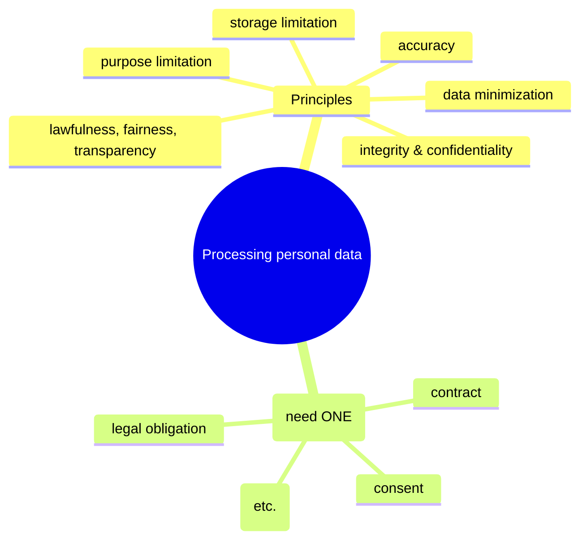
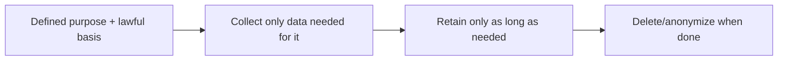
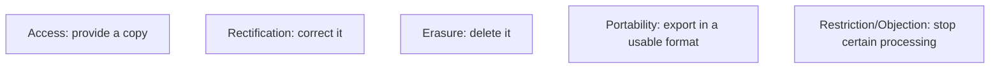
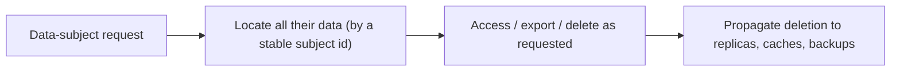

# Data Protection and GDPR Compliance - Complete Professional Guide

> **Category:** 09_security_and_privacy · **Language:** English

---

### Lawful basis, data-subject rights, and the principles of data protection
**Original guide written from first principles, current to 2026**

> **Original reference book (English).** This is an **independent, originally written** guide. It is not an extract, summary, or paraphrase of any third-party book; it explains data-protection law from first principles. It is **informational, not legal advice**. Canonical references are listed under **References** as pointers only. Each chapter follows the TO-BRAIN editorial standard (see `FILE_CONVENTIONS.md`).
>
> **Scope notice:** the GDPR (and similar laws like Brazil's LGPD) governs how personal data is processed. This guide covers the principles, lawful bases, and data-subject rights that developers and teams must build for, current to 2026.

---

## How to read this guide

| Level | Profile | Parts |
|-------|---------|-------|
| 1 — Beginner | New to data protection | Part I |
| 2 — Intermediate | Building compliant systems | Part II |

**Target audience:** developers, architects, and product people handling personal data.

**Structure of each chapter:** Introduction · Business context · Theoretical concepts · Architecture · Diagrams (Mermaid) · Real examples · Step by step · Complete examples · Exercises · Challenges · Checklist · Best practices · Anti-patterns · Troubleshooting · References.

> **Note on prerequisites.** None. **Not legal advice** — consult a qualified professional for specific cases.

---

## Table of Contents

**Part I – Foundations**
1. Principles and lawful basis
2. Data-subject rights

**Part II – Building for it**
3. Privacy by design in practice

> **Status of this guide:** phased delivery. **Ready:** Part I (Ch. 1–2). **In progress:** Part II.

---

## Part I – Foundations

Data-protection law treats **personal data** (anything identifying a person) as something you may process only under defined conditions and principles. For engineers, the key shift is that personal data isn't yours to use freely — every use needs a justification and must respect the person's rights. Building this in is far cheaper than retrofitting it after a complaint or fine.

---

## Chapter 1 — Principles and lawful basis

### 1.1 Introduction

The GDPR sets **principles** for processing personal data — including **lawfulness**, **purpose limitation** (use data only for the stated purpose), **data minimization** (collect only what's needed), **accuracy**, **storage limitation** (keep it only as long as needed), and **security**. And every processing activity needs a **lawful basis** — a legal justification such as consent, contract, legal obligation, or legitimate interest.

### 1.2 Business context

Non-compliance carries severe fines (a percentage of global revenue) and reputational damage, and increasingly blocks market access. But beyond avoiding penalties, respecting these principles builds user trust and reduces risk (less data held = less to breach). Engineers who understand purpose limitation and minimization design systems that are compliant *and* leaner. Treating data protection as a design constraint, not an afterthought, is both a legal necessity and good engineering.

### 1.3 Theoretical concepts: principles + a lawful basis



Before processing personal data you must (a) have a **lawful basis** and (b) honor all the **principles**. "We might find it useful later" is not a basis — you need a specific purpose and justification *up front*. Minimization and purpose limitation directly shape what your schema should and shouldn't store.

### 1.4 Architecture: purpose drives the data model



### 1.5 Real example

**Scenario.** A signup form collects date of birth, phone, and address "in case we need them."

**Problem.** No purpose or lawful basis for that data — it violates minimization and purpose limitation, and increases breach risk.

**Solution.** Collect only what the actual purpose (creating an account) requires; justify each field.

**Implementation (minimization by design).**

```text
Purpose: create and authenticate an account
  needed: email, password         -> lawful basis: contract
  NOT needed now: DOB, phone, address  -> don't collect
  if a later feature needs DOB (e.g. age check): collect then, with its own basis
Retention: delete account data on request / after account closure + legal period
```

**Result.** The form collects only what's justified; less personal data is held (less risk, clearer compliance), and each field maps to a purpose and basis. Compliance and good data hygiene align.

**Future improvements.** Document a processing record (what data, why, basis, retention) — required and useful.

### 1.6 Exercises

1. Name four GDPR principles.
2. What is a "lawful basis" and why is one required?
3. How does purpose limitation shape a schema?

### 1.7 Challenges

- **Challenge.** Audit a form/table holding personal data. For each field, state the purpose and lawful basis. Drop any field that has neither.

### 1.8 Checklist

- [ ] Every processing activity has a lawful basis.
- [ ] I collect only data needed for a stated purpose.
- [ ] Data is retained only as long as needed.
- [ ] Principles (accuracy, security, etc.) are respected.

### 1.9 Best practices

- Define purpose and lawful basis before collecting.
- Minimize: collect and keep the least data possible.
- Set and enforce retention/deletion.

### 1.10 Anti-patterns

- Collecting data "just in case" with no purpose.
- Reusing data for new purposes without a basis.
- Indefinite retention of personal data.

### 1.11 Troubleshooting

| Symptom | Likely cause | Action |
|---------|--------------|--------|
| Holding data with no justification | No purpose/basis | Stop collecting; delete it |
| Data used for unintended purpose | Purpose limitation breach | Get a basis or stop the use |
| Old personal data piling up | No retention policy | Define and enforce retention |

### 1.12 References

- P. Voigt, A. von dem Bussche, *The EU GDPR: A Practical Guide*, 2nd ed. (Springer, 2017) — ISBN 978-3319579580.
- GDPR full text: https://gdpr-info.eu; Brazil LGPD: Lei nº 13.709/2018.

---

## Chapter 2 — Data-subject rights

### 2.1 Introduction

The GDPR gives people (**data subjects**) rights over their personal data, which systems must be able to honor: the right to **access** (get a copy), **rectification** (correct it), **erasure** ("right to be forgotten"), **portability** (receive it in a usable format), **restriction**, and **objection**. These aren't optional features — when a person exercises a right, you must comply within a deadline.

### 2.2 Business context

If your architecture can't find, export, or delete one person's data on request, you can't comply — and that's a legal failure with fines attached. Many systems that scattered personal data across services and backups struggle here. Designing for these rights up front (knowing where a person's data lives, being able to delete it) avoids frantic, error-prone retrofits and demonstrates the trustworthiness users increasingly demand.

### 2.3 Theoretical concepts: rights you must serve



To honor these you must be able to **locate all of a person's data** (across services, logs, backups), **export** it, and **delete** it on request — including from derived/replicated stores. This is an architectural requirement: data spread without tracking makes rights nearly impossible to serve.

### 2.4 Architecture: find, export, delete per person



### 2.5 Real example

**Scenario.** A user invokes their right to erasure.

**Problem.** Their data is in the main DB, a search index, an analytics warehouse, and backups — with no map of where.

**Solution.** Architect around a stable subject identifier and a deletion process that propagates everywhere.

**Implementation (erasure flow).**

```text
On erasure request for subject S:
  1. delete S's rows in the primary DB
  2. remove S from the search index and caches
  3. anonymize/delete S in the analytics warehouse
  4. flag S for purge from backups per the backup policy
  -> confirm and log completion within the legal deadline
Requires: every store keyed/traceable by the subject id.
```

**Result.** The person's data is removed everywhere it lives, on time — because the architecture tracks data by subject and propagates deletion. The right is genuinely honored, not just in the main DB.

**Future improvements.** Automate the flow; maintain a data map of where personal data resides for each subject.

### 2.6 Exercises

1. List four data-subject rights.
2. Why are these an architectural concern, not just a feature?
3. What's hard about the right to erasure in a distributed system?

### 2.7 Challenges

- **Challenge.** For your system, trace where one user's personal data lives (all stores, logs, backups). Could you delete it all on request? Note the gaps.

### 2.8 Checklist

- [ ] I can locate all of a person's data.
- [ ] I can export it in a usable format.
- [ ] I can delete it across all stores on request.
- [ ] Deletion propagates to replicas/caches/backups.

### 2.9 Best practices

- Key personal data by a stable subject id for findability.
- Design deletion to propagate everywhere.
- Maintain a data map of where personal data resides.

### 2.10 Anti-patterns

- Personal data scattered with no way to find it per person.
- Deletion that misses replicas, indexes, or backups.
- Treating rights as an afterthought.

### 2.11 Troubleshooting

| Symptom | Likely cause | Action |
|---------|--------------|--------|
| Can't fulfill an access/erasure request | Data untracked/scattered | Key by subject id; build a data map |
| Deleted data reappears | Replicas/caches not purged | Propagate deletion everywhere |
| Export not possible | No portability design | Add export in a standard format |

### 2.12 References

- P. Voigt, A. von dem Bussche, *The EU GDPR: A Practical Guide*, 2nd ed. (Springer, 2017) — ISBN 978-3319579580.
- European Data Protection Board guidelines: https://edpb.europa.eu.

---

> **End of Part I.** You can now build for data protection: process personal data only with a lawful basis and under the principles (especially purpose limitation and minimization, which shape your schema), and architect so you can locate, export, and delete one person's data across all stores to honor data-subject rights. **Part II — Building for it** (Chapter 3) covers privacy by design in practice — embedding these requirements into architecture from the start — and links to the privacy-engineering guide. *This guide is informational and not legal advice.*

<!--APPEND-PART-II-->
