# Penetration Testing - Complete Professional Guide

> **Category:** 09_security_and_privacy · **Language:** English

---

### Attacking your own apps, APIs, and VPS before someone else does
**Original guide written from first principles, current to 2026**

> **Original reference book (English).** This is an **independent, originally written** guide. It is not an extract, summary, or paraphrase of any third-party book; it teaches penetration testing from first principles with original examples. Canonical books and standards are listed under **References** as pointers only. Each chapter follows the TO-BRAIN editorial standard (see `FILE_CONVENTIONS.md`).
>
> **Scope notice:** a penetration test is **authorized** offensive security — you attack a system you own or have written permission to test, to find and fix weaknesses before a real attacker does. This guide covers the full lifecycle (scoping → recon → exploitation → privilege escalation → reporting → retest) applied to **web frontends, backend APIs, and a self-managed VPS**, current to 2026 (OWASP Top 10:2021, OWASP API Top 10:2023, OWASP WSTG 4.2, MITRE ATT&CK, NIST SP 800-115, PTES).
>
> **Legal & ethical notice:** every technique here is for systems you **own or are explicitly authorized in writing to test**. Unauthorized access is a crime in virtually every jurisdiction (e.g. Brazil's Lei 12.737/2012 "Lei Carolina Dieckmann" and Lei 14.155/2021; the US CFAA; the UK Computer Misuse Act). Always test against a written scope and authorization. See Chapter 2.

---

## How to read this guide

| Level | Profile | Parts |
|-------|---------|-------|
| 1 — Beginner | New to offensive security | Part I |
| 2 — Intermediate | Testing web apps & APIs | Parts II–III |
| 3 — Advanced | Hardening infrastructure & VPS | Parts IV–V |

**Target audience:** developers and operators who run their own apps (frontend + backend) and a VPS, and want to test and harden them like an attacker would; plus security engineers formalizing a pentest practice.

**Structure of each chapter:** Introduction · Business context · Theoretical concepts · Architecture · Diagrams (Mermaid) · Real examples · Step by step · Exercises · Challenges · Checklist · Best practices · Anti-patterns · Troubleshooting · References.

> **Note on prerequisites.** Assumes web basics (HTTP, HTML, SQL, TLS), Linux command line, and familiarity with the *Web Application Security*, *Threat Modeling*, and *Security Engineering Principles* guides in this folder.

---

## Table of Contents

**Part I – Foundations**
1. What penetration testing is (and is not)
2. Rules of engagement: scope, authorization, and the law
3. Methodologies and the attacker's kill chain
4. The lab: building a safe environment to practice

**Part II – Reconnaissance and attack surface**
5. Passive recon and OSINT
6. Active scanning and enumeration
7. Mapping a web application's attack surface

**Part III – Web application and API pentesting (frontend + backend)**
8. Injection: SQL, NoSQL, command, and template
9. Cross-site scripting (XSS) and the DOM
10. CSRF, CORS, and the same-origin model
11. Broken authentication and session attacks
12. Broken access control, IDOR, and SSRF
13. API security testing (REST and GraphQL)
14. Frontend and client-side security (supply chain, secrets, CSP)
15. Business logic and file-handling flaws

**Part IV – Infrastructure and VPS pentesting**
16. Network exposure: ports, services, and the firewall
17. Hardening and testing SSH and remote access
18. TLS, reverse proxies, and transport security
19. Linux privilege escalation
20. Secrets, containers, and the CI/CD pipeline

**Part V – Operating a security practice**
21. Reporting, risk scoring, and remediation
22. Retesting, continuous testing, and DevSecOps

> **Status of this guide:** complete reference. All five parts are written; treat each chapter as a self-contained module you can apply independently.

---

## Part I – Foundations

A penetration test is a **structured, authorized simulation of an attack**. Before touching a single tool, you need three things: a clear definition of what a test is and what value it delivers (Ch. 1), a written agreement on what you may attack and how (Ch. 2), and a repeatable method so results are consistent and complete (Ch. 3) — practiced first in a safe lab (Ch. 4). Skipping this foundation is how well-meaning testing becomes an outage, a legal problem, or a false sense of security.

---

## Chapter 1 — What penetration testing is (and is not)

### 1.1 Introduction

A **penetration test** (pentest) is an authorized, goal-oriented exercise where a tester takes the attacker's perspective to find exploitable weaknesses in a system and demonstrate their real impact. The deliverable is not a list of theoretical issues — it is **proof**: "this input let me read every user's data," with the steps to reproduce and fix it. Pentesting differs from a vulnerability scan (automated, breadth-first, no exploitation) and from a security audit (compliance against a checklist). It sits at the sharp end: *can this actually be broken, and what happens if it is?*

### 1.2 Business context

You run apps and a VPS. Every exposed endpoint, port, and dependency is attack surface that a real adversary probes continuously and automatically. A pentest converts unknown, unquantified risk into a prioritized, fixable list **before** an attacker monetizes it (data theft, ransomware, defacement, crypto-mining on your VPS). The economics are stark: the cost of a focused test is a fraction of the cost of one breach (incident response, downtime, lost trust, LGPD/GDPR fines). For a solo operator or small team, pentesting your own stack is the single highest-leverage security activity — it tells you where to spend your limited hardening time.

### 1.3 Theoretical concepts: the three test perspectives

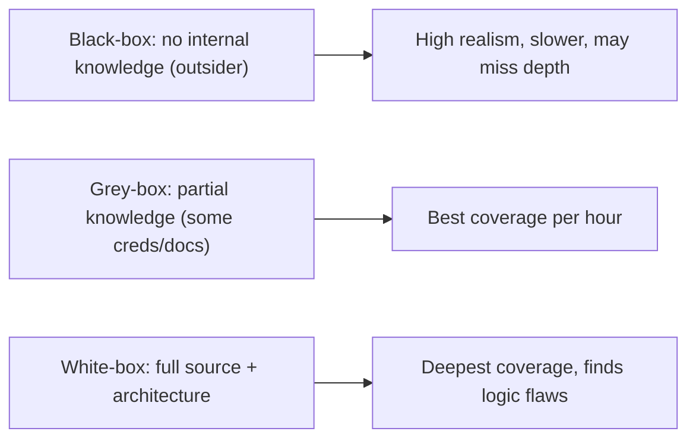

- **Black-box** — the tester knows only what a public attacker would (a URL, an IP). Realistic but inefficient; misses deep flaws.
- **Grey-box** — the tester gets limited credentials and some documentation. The sweet spot for most self-tests: you simulate an attacker who has phished one low-privilege account.
- **White-box** — full source, configs, and architecture. Finds the most (especially business-logic and access-control bugs) per hour. For testing your **own** stack, white-box is usually right — you already have the source, so use it.

A related distinction: a **pentest** is time-boxed and scoped; a **red team** engagement is goal-based and stealthy (e.g. "exfiltrate the customer table without being detected"), testing detection and response, not just vulnerabilities.

### 1.4 Architecture: where a pentest fits in the lifecycle

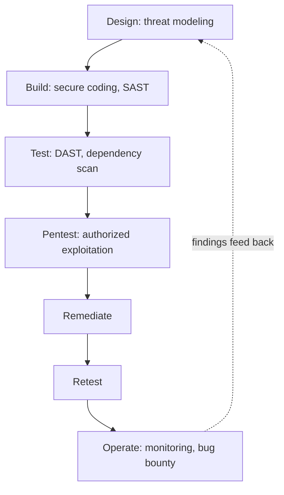

Pentesting is **not** a substitute for secure design, code review, or automated scanning — it is the validation layer that proves whether the earlier layers held. Cheap, frequent automated checks (SAST/DAST/dependency scanning) catch the easy issues continuously; the human-driven pentest finds what tools cannot: chained flaws, business-logic abuse, and access-control gaps.

### 1.5 Real example

**Scenario.** You have a web app (frontend SPA + backend API) and a VPS. You want to know if it can be broken into.

**Problem.** You don't know your real attack surface or which weaknesses are exploitable versus theoretical.

**Solution.** Run a grey-box pentest of the whole stack: recon the attack surface, test the web/API against OWASP Top 10, then test the VPS host and services, ending in a prioritized fix list.

**Implementation (the engagement at a glance).**

```text
1. Scope & authorize ......... define targets, exclusions, window, written OK (Ch.2)
2. Recon ..................... map domains, subdomains, ports, tech stack (Ch.5-7)
3. Web/API exploitation ...... injection, XSS, authn/authz, SSRF, API (Ch.8-15)
4. Host/VPS exploitation ..... services, SSH, privesc, secrets (Ch.16-20)
5. Report .................... findings, severity (CVSS), reproduction, fixes (Ch.21)
6. Remediate & retest ........ fix, then re-run the exploit to confirm (Ch.22)
```

**Result.** You move from "I think it's secure" to a concrete, evidence-backed list of what's broken, how bad it is, and how to fix it — and after retest, proof that it's fixed.

**Future improvements.** Automate the repeatable parts (recon, dependency and config scanning) so each release is checked, reserving manual effort for logic and access-control review.

### 1.6 Exercises

1. State the difference between a vulnerability scan and a penetration test.
2. For testing your own stack, which perspective (black/grey/white) is usually most efficient, and why?
3. What does a pentest deliver that a SAST tool cannot?

### 1.7 Challenges

- **Challenge.** Write a one-paragraph objective for a pentest of your own app and VPS. Make it goal-oriented ("prove whether an unauthenticated user can reach customer data") rather than vague ("check security").

### 1.8 Checklist

- [ ] I understand pentest vs. scan vs. audit vs. red team.
- [ ] I chose a test perspective (likely grey/white for my own stack).
- [ ] I treat pentesting as validation, not a replacement for secure design.
- [ ] My test has a concrete, falsifiable objective.

### 1.9 Best practices

- Define a clear, goal-oriented objective before starting.
- Prefer white/grey-box for your own systems — use the source you already have.
- Feed every finding back into design and automated checks so it can't recur.

### 1.10 Anti-patterns

- Treating an automated scan report as a "pentest."
- Testing without a defined objective ("just poke at it").
- Pentesting instead of (rather than after) fixing known issues from cheaper checks.

### 1.11 Troubleshooting

| Symptom | Likely cause | Action |
|---------|--------------|--------|
| Test finds only trivial issues | Pure black-box, time-boxed too short | Switch to grey/white-box; share creds and source |
| Report full of theoretical "info" items | No exploitation, just scanning | Require proof-of-impact for each finding |
| Same bugs recur every test | Findings not fed back into SDLC | Add regression tests and automated gates |

### 1.12 References

- NIST SP 800-115, *Technical Guide to Information Security Testing and Assessment*: https://csrc.nist.gov/pubs/sp/800/115/final.
- PTES, *Penetration Testing Execution Standard*: http://www.pentest-standard.org.
- OWASP, *Web Security Testing Guide (WSTG) 4.2*: https://owasp.org/www-project-web-security-testing-guide/.

---

## Chapter 2 — Rules of engagement: scope, authorization, and the law

### 2.1 Introduction

Before any technique, you need **authorization** and a **scope**. The rules of engagement (RoE) are the written contract that makes a test legal, safe, and useful: exactly which assets are in scope, which are excluded, what techniques are allowed, when testing happens, and who to call if something breaks. For your own systems this feels like a formality — but it protects you (from accidentally hitting a third party's infrastructure) and forces you to think before you act.

### 2.2 Business context

Even on systems you "own," boundaries blur: your VPS provider's terms may forbid certain tests; your app may call third-party APIs you must **not** attack; a stress test could cause an outage during business hours. The RoE prevents self-inflicted damage and legal exposure. Most VPS/cloud providers require notice or have an acceptable-use policy for security testing — testing infrastructure you merely rent can violate the provider's terms even if you "own" the application on it. Get this right once and reuse the template.

### 2.3 Theoretical concepts: the RoE checklist

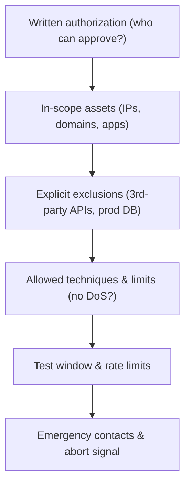

A complete RoE answers: **Who** authorizes (must own or control the asset)? **What** is in and out of scope (be explicit — list IPs/domains)? **How** (which techniques; is destructive testing, DoS, or social engineering allowed)? **When** (window, to avoid peak load)? **What if** (a kill switch / abort procedure and emergency contacts)? Always confirm the **hosting provider's** policy for security testing on rented infrastructure.

### 2.4 Architecture: authorization boundaries

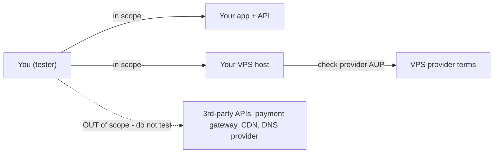

The trust boundary of your test stops at assets you control. Your app may *integrate* with Stripe, a mail provider, or a CDN — those are **out of scope**; attacking them is attacking someone else. Mark them clearly and route around them (use test/sandbox endpoints).

### 2.5 Real example

**Scenario.** You want to pentest your SaaS: SPA on `app.example.com`, API on `api.example.com`, both on a single VPS, with the DB on the same host. Auth is via a third-party identity provider.

**Problem.** Naively scanning everything could hit the identity provider, trip the VPS provider's abuse detection, or take down production mid-day.

**Solution.** Write an RoE: in scope = your two domains + the VPS IP; out of scope = the identity provider and any external API; window = low-traffic hours; no volumetric DoS; rate-limit scans; snapshot the VPS first; you are the emergency contact and the abort signal is "stop and restore snapshot."

**Implementation (RoE skeleton).**

```text
Authorization: I, <owner>, authorize testing of the assets below, <dates>.
In scope:      app.example.com, api.example.com, VPS 203.0.113.10 (host + services)
Out of scope:  auth0/identity provider, Stripe, SES, Cloudflare, DNS registrar
Allowed:       recon, scanning, web/API exploitation, authenticated logic tests
Forbidden:     volumetric DoS, data destruction, social engineering of real users
Window:        02:00-05:00 local, rate-limited; snapshot taken beforehand
Abort:         on outage/instability -> stop, restore snapshot, note time
Contacts:      <you>, VPS provider support, <on-call>
```

**Result.** You can test confidently: nothing outside your control is touched, the provider won't flag you, and a bad moment has a defined recovery.

**Future improvements.** Keep the RoE as a reusable template; add a pre-test snapshot/restore script so "abort" is one command.

### 2.6 Exercises

1. Why must third-party APIs your app calls be out of scope?
2. Name three things a complete RoE must specify.
3. Why check the VPS provider's acceptable-use policy even though you "own" the server?

### 2.7 Challenges

- **Challenge.** Write a full RoE for your own stack. List every in-scope asset by IP/domain and every out-of-scope dependency. Identify your abort procedure.

### 2.8 Checklist

- [ ] I have written authorization from the asset owner (me, documented).
- [ ] In-scope and out-of-scope assets are listed explicitly.
- [ ] Allowed/forbidden techniques (esp. DoS, data destruction) are defined.
- [ ] I checked my VPS/cloud provider's testing policy.
- [ ] I have a snapshot/backup and a defined abort procedure.

### 2.9 Best practices

- Snapshot/back up before testing; testing can break things.
- Test in a low-traffic window and rate-limit aggressive tools.
- Keep the RoE as a signed, dated, reusable document.

### 2.10 Anti-patterns

- "It's mine, I don't need authorization written down."
- Scanning a broad IP range that includes shared/provider infrastructure.
- Running destructive or volumetric tests against production with no backup.

### 2.11 Troubleshooting

| Symptom | Likely cause | Action |
|---------|--------------|--------|
| Provider sends abuse warning | Aggressive scan tripped detection | Notify provider in advance; rate-limit; check AUP |
| Third-party service errors during test | Out-of-scope dependency was hit | Route to sandbox endpoints; exclude explicitly |
| Production outage mid-test | No window/limits/backup | Define window, rate limits, snapshot, abort steps |

### 2.12 References

- PTES, "Pre-engagement Interactions": http://www.pentest-standard.org.
- Brazil: Lei 12.737/2012 and Lei 14.155/2021 (computer-intrusion offenses).
- Your VPS/cloud provider's Acceptable Use / Penetration Testing policy.

---

## Chapter 3 — Methodologies and the attacker's kill chain

### 3.1 Introduction

A method makes a pentest **repeatable and complete** — you cover the same phases every time, so nothing is forgotten and results are comparable across tests. The industry has several complementary frameworks: **PTES** (end-to-end engagement phases), **OWASP WSTG** (a detailed web-testing checklist), **NIST SP 800-115** (a planning framework), **MITRE ATT&CK** (a catalog of real attacker techniques), and the **Cyber Kill Chain** (the stages of an intrusion). You don't pick one — you use them together.

### 3.2 Business context

Without a method, testing is ad-hoc: you find what you happen to think of and miss the rest, and two tests of the same system give different results. A documented methodology means your coverage is defensible ("we tested every WSTG category"), your reports are consistent, and a teammate can reproduce your work. For continuous testing, the method is what you automate.

### 3.3 Theoretical concepts: the phases of an attack

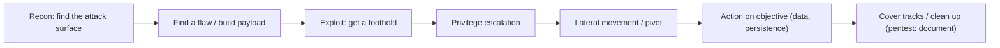

The kill chain mirrors how real attackers operate and structures the test: you cannot exploit what you didn't find in recon; you cannot escalate without a foothold. **MITRE ATT&CK** breaks each stage into concrete techniques (e.g. *Initial Access → Exploit Public-Facing Application T1190*), giving you a checklist of "how would a real adversary do this." For web specifically, **OWASP WSTG** enumerates the test cases per category (information gathering, authentication, session, input validation, etc.).

### 3.4 Architecture: layering the frameworks

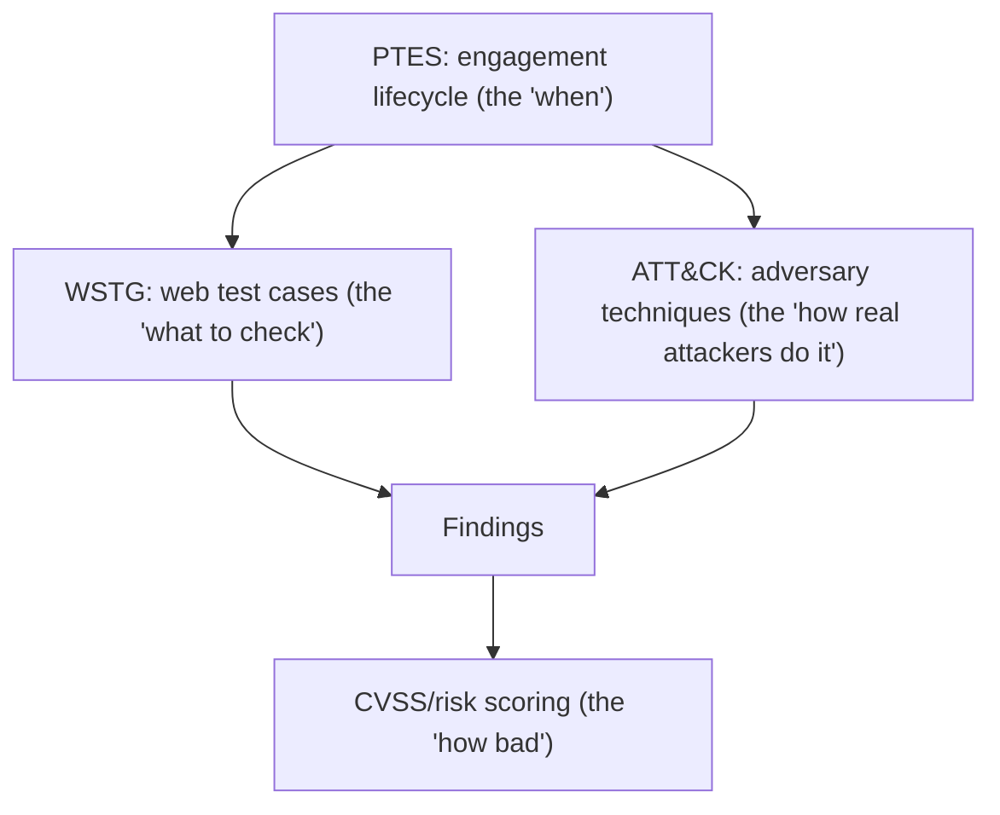

Use **PTES** to structure the engagement, **WSTG** as the web checklist, **ATT&CK** to make sure you covered realistic techniques, **NIST 800-115** for the overall plan, and **CVSS** to score what you find. Each framework answers a different question; together they give full, defensible coverage.

### 3.5 Real example

**Scenario.** You're testing your stack and want assurance you didn't miss a category.

**Problem.** Ad-hoc testing leaves blind spots (e.g. you tested injection thoroughly but never checked session fixation or SSRF).

**Solution.** Drive the test from a merged checklist: PTES phases on the outside, WSTG categories for the web app, ATT&CK techniques for the host, CVSS to score.

**Implementation (a working checklist header).**

```text
[PTES] Pre-engagement -> Intel -> Threat model -> Vuln analysis -> Exploit -> Post -> Report
[WSTG] INFO  IDNT  ATHN  ATHZ  SESS  INPV  ERRH  CRYP  BUSL  CLNT  APIT
        (info)(identity)(authn)(authz)(session)(input)(errors)(crypto)(logic)(client)(api)
[ATT&CK host] Initial Access -> Execution -> Persistence -> PrivEsc -> Defense Evasion ->
              Credential Access -> Discovery -> Lateral -> Collection -> Exfiltration
Score each finding: CVSS 3.1 base vector -> severity
```

**Result.** Every category is consciously covered or consciously skipped (with a reason), so the test is complete and the report is defensible.

**Future improvements.** Turn the checklist into a living document/issue template; mark which items are automated vs. manual.

### 3.6 Exercises

1. Why use multiple frameworks instead of one?
2. Which framework gives you a per-category web checklist?
3. What does MITRE ATT&CK add that PTES does not?

### 3.7 Challenges

- **Challenge.** Build a single-page checklist merging PTES phases with the WSTG categories relevant to your app. Use it on your next test and note any category you'd otherwise have skipped.

### 3.8 Checklist

- [ ] I follow a documented phase model (PTES/NIST).
- [ ] I cover the WSTG categories for web/API.
- [ ] I sanity-check host testing against ATT&CK techniques.
- [ ] I score findings with CVSS.
- [ ] Skipped items are recorded with a reason.

### 3.9 Best practices

- Use frameworks as a coverage map, not a script to follow blindly.
- Record what you skipped and why — gaps should be deliberate.
- Keep the checklist version-controlled so coverage improves over time.

### 3.10 Anti-patterns

- Inventing your own undocumented process each test.
- Stopping at the first finding instead of completing the phases.
- Treating ATT&CK/WSTG as exhaustive — they're a floor, not a ceiling.

### 3.11 Troubleshooting

| Symptom | Likely cause | Action |
|---------|--------------|--------|
| Inconsistent results test-to-test | No fixed method | Adopt PTES + WSTG checklist |
| Whole vuln class missed | No coverage map | Drive testing from WSTG categories |
| "How would a real attacker..." gaps | No adversary model | Cross-reference MITRE ATT&CK |

### 3.12 References

- MITRE ATT&CK: https://attack.mitre.org.
- OWASP WSTG 4.2 (test cases): https://owasp.org/www-project-web-security-testing-guide/.
- Lockheed Martin, "Cyber Kill Chain": https://www.lockheedmartin.com/en-us/capabilities/cyber/cyber-kill-chain.html.

---

## Chapter 4 — The lab: building a safe environment to practice

### 4.1 Introduction

You should never learn a technique by trying it for the first time on production. A **lab** is an isolated environment — typically VMs or containers on your machine — where you run deliberately vulnerable apps and a copy of your own stack, so you can break things freely. Building the lab also teaches you the tools you'll use against your real targets.

### 4.2 Business context

A lab de-risks testing: you validate that a tool/payload works (and won't destroy data) before pointing it at your VPS. It's also where you reproduce a finding safely to confirm the fix. The cost is a few hours of setup; the payoff is confidence and no accidental production damage.

### 4.3 Theoretical concepts: isolation and intentionally vulnerable targets

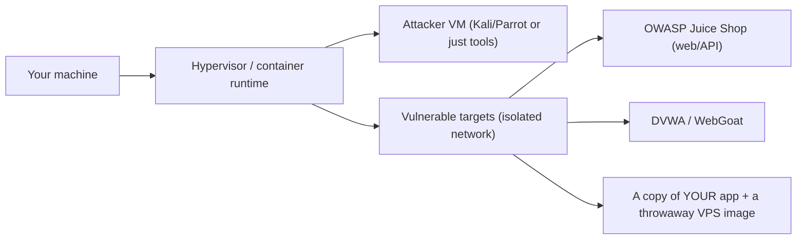

Two ingredients: **isolation** (a host-only/internal network so the lab cannot reach the internet or your real systems) and **targets** (well-known vulnerable apps to learn on, plus a clone of your own stack to test for real). Snapshots let you reset to a clean state instantly.

### 4.4 Architecture: the attacker/target split on an isolated network

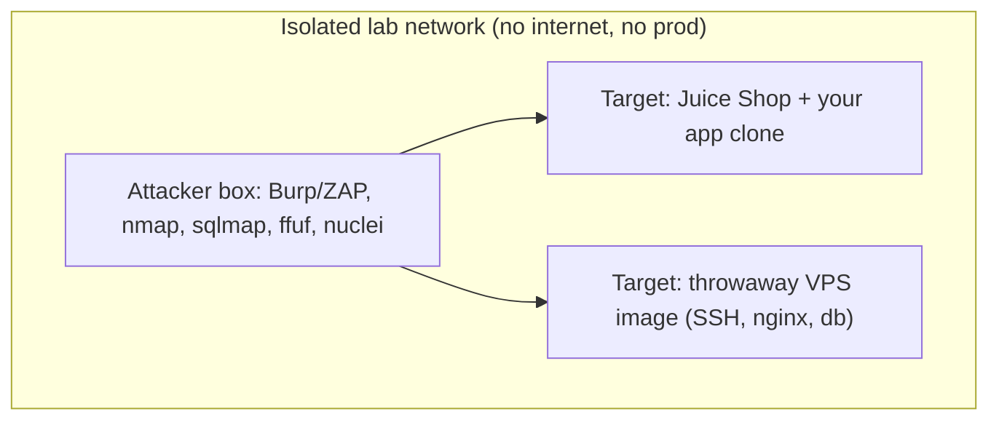

### 4.5 Real example

**Scenario.** You want to practice the techniques in Parts III–IV before testing your live stack.

**Problem.** Testing tools on production risks data loss and outages, and you can't iterate freely.

**Solution.** Stand up an isolated lab: an attacker toolset, OWASP Juice Shop as a web/API target, and a VM image that mirrors your VPS (same OS, nginx, DB).

**Implementation (Docker-based quick lab).**

```bash
# Isolated network so containers can't reach prod
docker network create --internal labnet

# A modern, intentionally vulnerable web+API target (OWASP Juice Shop)
docker run -d --name juice --network labnet -p 127.0.0.1:3000:3000 \
  bkimminich/juice-shop

# A VPS-like target to practice host testing (throwaway)
docker run -d --name vpsbox --network labnet \
  -p 127.0.0.1:2222:22 rastasheep/ubuntu-sshd:18.04

# Attacker tools (run from host or a tools container), e.g.:
nmap -sV -p- 127.0.0.1            # only your own lab ports
# Burp Suite / OWASP ZAP as the intercepting proxy for the web target
```

**Result.** You can run every Part III/IV technique against `juice` and `vpsbox`, snapshot/reset at will, and only move to your real stack once a technique is understood.

**Future improvements.** Add a clone of your actual app and a snapshot of your real VPS (sanitized of secrets) so lab findings translate directly.

### 4.6 Exercises

1. Why must the lab network be isolated from the internet and production?
2. Name two intentionally vulnerable apps suitable for practice.
3. What is the purpose of VM/container snapshots in a lab?

### 4.7 Challenges

- **Challenge.** Stand up Juice Shop and one VPS-like target on an isolated network. Confirm from the attacker box that you can reach the targets but the targets cannot reach the public internet.

### 4.8 Checklist

- [ ] Lab network is isolated (no route to prod/internet).
- [ ] I have at least one vulnerable web/API target and one host target.
- [ ] Snapshots exist so I can reset to clean state.
- [ ] My attacker toolset (proxy, scanner, fuzzers) is installed and working.

### 4.9 Best practices

- Keep the lab fully isolated; never bridge it to production.
- Snapshot before each exercise so you can reset instantly.
- Mirror your real stack (OS, web server, DB) for findings that transfer.

### 4.10 Anti-patterns

- Practicing new tools/payloads directly on production.
- A lab with internet access (vulnerable images can be hijacked).
- Reusing real secrets/data in the lab.

### 4.11 Troubleshooting

| Symptom | Likely cause | Action |
|---------|--------------|--------|
| Lab target reachable from internet | Bridged/NAT network | Use host-only/internal network |
| Can't reset after breaking a target | No snapshots | Snapshot clean state before testing |
| Findings don't transfer to prod | Lab differs from real stack | Mirror OS/web server/DB versions |

### 4.12 References

- OWASP Juice Shop: https://owasp.org/www-project-juice-shop/.
- OWASP WebGoat / DVWA: https://owasp.org/www-project-webgoat/.
- Kali Linux / Parrot OS tool documentation: https://www.kali.org/docs/.

---

> **End of Part I.** You can now define what a pentest is and isn't, write rules of engagement that keep testing legal and safe, drive the work from a complete methodology, and practice safely in an isolated lab. **Part II — Reconnaissance and attack surface** turns to the first active phase: discovering everything an attacker could see and reach across your domains, ports, and application.

## Part II – Reconnaissance and attack surface

You cannot exploit what you cannot see. Recon is the deliberate discovery of everything an attacker could find and reach: your domains and subdomains, the IPs and open ports behind them, the technologies in use, and every page, parameter, and API route. Done well, recon is often where the real win is — an exposed admin panel, a forgotten staging subdomain, a leaked API key — before any exploitation begins.

---

## Chapter 5 — Passive recon and OSINT

### 5.1 Introduction

**Passive reconnaissance** gathers information about a target **without sending traffic to it** — you query public sources (DNS, certificate logs, search engines, code repositories, breach data) instead of the target itself. It's stealthy and legal on public data, and it frequently surfaces attack surface you forgot you had: an old subdomain, a public S3 bucket, an API key committed to GitHub.

### 5.2 Business context

Attackers start here, automatically and continuously. Everything you leak publicly — a verbose `robots.txt`, a `.git` directory, a key in a public repo, an employee's tech-stack post — is free intelligence. Doing your own OSINT tells you what an attacker already knows about you, so you can close it (rotate the leaked key, take down the stale subdomain) before it's used.

### 5.3 Theoretical concepts: public sources of attack surface

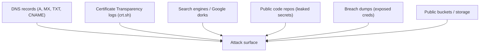

**Certificate Transparency** is especially powerful: every TLS certificate is logged publicly, so `crt.sh` reveals subdomains you never advertised. **Google dorks** (`site:example.com filetype:env`, `inurl:admin`) find exposed files and panels. **Public repos** often leak secrets in history even after deletion. None of this touches your server — it's all already public.

### 5.4 Architecture: from a domain to a full surface map

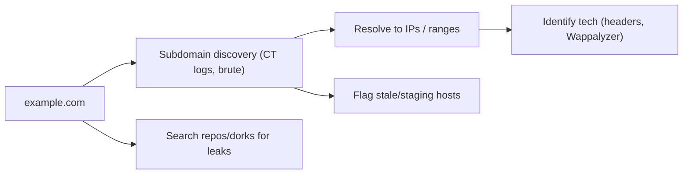

### 5.5 Real example

**Scenario.** You think your attack surface is just `app.example.com` and `api.example.com`.

**Problem.** A forgotten `staging.example.com` (with weaker auth and debug enabled) and an API key in an old public commit are reachable — and you don't know.

**Solution.** Enumerate subdomains via Certificate Transparency, then search public repos and dorks for leaks.

**Implementation.**

```bash
# Subdomains from Certificate Transparency logs (passive, no traffic to target)
curl -s "https://crt.sh/?q=%25.example.com&output=json" \
  | jq -r '.[].name_value' | sort -u

# Dedicated passive tools (use public data sources)
subfinder -d example.com -silent
amass enum -passive -d example.com

# Leaked secrets in your own org's public repos
# (gitleaks/trufflehog scan history, not just the latest commit)
gitleaks detect --source . --report-format sarif --report-path leaks.sarif
trufflehog github --org=your-org

# Google dorks to run manually:
#   site:example.com ext:env | ext:log | ext:bak
#   site:example.com inurl:admin | inurl:debug
```

**Result.** You discover `staging.example.com` and a leaked key in commit history — both invisible from your two "known" domains. You take staging down (or harden it) and rotate the key before an attacker uses them.

**Future improvements.** Run subdomain and secret discovery on a schedule; add a pre-commit secret scanner so keys never reach a public repo.

### 5.6 Exercises

1. Why can Certificate Transparency reveal subdomains you never published?
2. Why is passive recon "stealthy" — what makes it different from scanning?
3. Why does deleting a secret from the latest commit not fix the leak?

### 5.7 Challenges

- **Challenge.** Run `crt.sh` and a passive subdomain tool against your own domain. List every host you find. Are any of them stale, staging, or unexpectedly exposed?

### 5.8 Checklist

- [ ] I enumerated subdomains via CT logs and passive tools.
- [ ] I searched public repos for leaked secrets (full history).
- [ ] I ran search-engine dorks for exposed files/panels.
- [ ] Stale/staging hosts are flagged for takedown or hardening.

### 5.9 Best practices

- Enumerate subdomains from multiple sources (CT logs catch what brute-force misses).
- Scan repo *history*, not just current files, for secrets.
- Schedule recon — your surface changes with every deploy.

### 5.10 Anti-patterns

- Assuming your attack surface is only the hosts you actively use.
- Rotating a leaked secret's location but not the secret itself.
- Leaving staging/debug hosts publicly reachable.

### 5.11 Troubleshooting

| Symptom | Likely cause | Action |
|---------|--------------|--------|
| Unknown subdomains appear in CT logs | Stale/forgotten hosts | Decommission or harden them |
| Secret still works after "deletion" | Removed from HEAD, not rotated | Rotate the credential at the source |
| Dorks reveal exposed files | Misconfigured server/robots | Remove files; fix server config |

### 5.12 References

- crt.sh (Certificate Transparency search): https://crt.sh.
- OWASP WSTG, "Information Gathering" (WSTG-INFO): https://owasp.org/www-project-web-security-testing-guide/.
- ProjectDiscovery (subfinder), OWASP Amass, gitleaks, trufflehog documentation.

---

## Chapter 6 — Active scanning and enumeration

### 6.1 Introduction

**Active scanning** sends traffic to the target to discover **open ports, running services, and their versions**. Where passive recon maps what's public, scanning maps what's *reachable and listening*. The canonical tool is **nmap**: it tells you which ports are open, what service answers, and often the exact software version — the raw material for finding known vulnerabilities.

### 6.2 Business context

Every open port is a door. A VPS that should expose only 443 (HTTPS) but also has 22 (SSH), 5432 (Postgres), 6379 (Redis), and 9200 (Elasticsearch) listening on its public IP has four extra doors — and an exposed, unauthenticated Redis or Elasticsearch is a near-instant breach. Scanning your own host from the outside shows exactly what the internet can reach, which is frequently more than you intended.

### 6.3 Theoretical concepts: ports, services, and versions

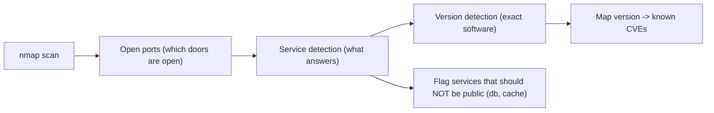

The progression is port → service → version → known vulnerabilities. Knowing a port is open is useful; knowing it runs `nginx 1.18.0` or `OpenSSH 7.6` lets you check it against CVE databases. The biggest wins are usually **services exposed that shouldn't be** — databases, caches, admin interfaces bound to `0.0.0.0` instead of `127.0.0.1`.

### 6.4 Architecture: external vs. internal view

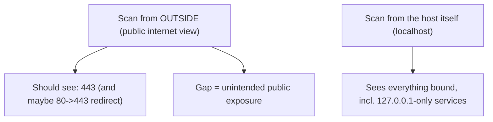

Scan from **outside** the VPS to see the attacker's view (what's truly public), and from **on the host** to inventory everything bound. The difference reveals services that are public when they should be localhost-only.

### 6.5 Real example

**Scenario.** Your VPS should expose only HTTPS. You scan it from an external machine.

**Problem.** Postgres (5432) and Redis (6379) are bound to the public interface — Redis with no password. An attacker can read/write your cache and possibly your DB directly.

**Solution.** Scan externally to find them, then bind them to `127.0.0.1` and/or firewall them (Ch. 16).

**Implementation.**

```bash
# Full external scan with service + version detection (from a DIFFERENT host)
nmap -sV -sC -p- -T4 203.0.113.10
# -p- = all 65535 ports; -sV = versions; -sC = default safe scripts

# Faster top-ports sweep first, then deep-scan what's open
nmap --top-ports 1000 -T4 203.0.113.10

# Targeted check for commonly-exposed data services
nmap -sV -p 22,80,443,3306,5432,6379,9200,27017,11211 203.0.113.10

# Example concerning output:
# 6379/tcp open  redis   Redis 6.0.5   <- public + no auth = critical
# 5432/tcp open  postgresql PostgreSQL 13.x  <- DB reachable from internet
```

**Result.** You discover two data services exposed to the internet, fix them (bind to localhost + firewall), and re-scan to confirm only 443 answers from outside.

**Future improvements.** Add an external port-scan to your monitoring so a future deploy that re-exposes a service is caught automatically.

### 6.6 Exercises

1. Why scan from both outside the host and on the host?
2. What does service/version detection enable that a plain port scan does not?
3. Why is an internet-exposed Redis with no password critical?

### 6.7 Challenges

- **Challenge.** Scan your own VPS's public IP from a different machine with `nmap -sV -p-`. List every open port. For each, justify why it must be public — and close anything that fails the test.

### 6.8 Checklist

- [ ] I scanned all ports (`-p-`) from outside the host.
- [ ] I have service and version detection results.
- [ ] Every open port has a justified reason to be public.
- [ ] Data services (DB, cache, search) are not internet-reachable.

### 6.9 Best practices

- Scan from an external network for the true attacker view.
- Bind data services to `127.0.0.1`; expose only the web port publicly.
- Re-scan after every infrastructure change.

### 6.10 Anti-patterns

- Assuming the firewall is right without verifying from outside.
- Binding databases/caches to `0.0.0.0` "for convenience."
- Scanning only the top ports and missing a high-numbered exposed service.

### 6.11 Troubleshooting

| Symptom | Likely cause | Action |
|---------|--------------|--------|
| Unexpected open ports externally | Service bound to public interface | Bind to localhost; add firewall rule |
| Scan misses a known service | Limited port range | Use `-p-` for all ports |
| Version shows outdated software | Unpatched service | Patch/upgrade; check CVEs for that version |

### 6.12 References

- nmap reference guide: https://nmap.org/book/man.html.
- OWASP WSTG, "Configuration and Deployment Management Testing".
- NIST SP 800-115, §4 (Technical testing techniques).

---

## Chapter 7 — Mapping a web application's attack surface

### 7.1 Introduction

Before attacking a web app you must **map** it: every page, every input, every parameter, every API route, every authentication state. This is **content discovery** (finding hidden endpoints) plus **spidering** (crawling linked content) plus **parameter analysis**. A complete map is what makes the exploitation phase systematic instead of guesswork — you can only test inputs you've found.

### 7.2 Business context

Modern apps have far more surface than their visible UI: backend API routes the SPA calls, admin endpoints, old API versions, debug routes, file-upload handlers. Each is a potential entry point. Attackers brute-force these paths automatically; an exposed `/api/internal/`, `/actuator`, `/.git/`, or `/admin` is a common breach origin. Mapping yours first means you test (and protect) the whole surface, not just the front door.

### 7.3 Theoretical concepts: discovery techniques

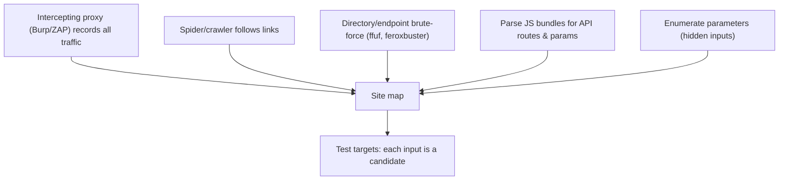

The most important tool is an **intercepting proxy** (Burp Suite or OWASP ZAP): it sits between your browser and the app, recording every request and letting you replay and modify them. Combine it with **directory brute-forcing** (using wordlists to find unlinked paths) and **JavaScript analysis** — modern SPAs hardcode API routes in their bundles, so reading the JS reveals the backend's full route list.

### 7.4 Architecture: the proxy in the middle

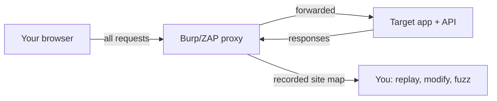

### 7.5 Real example

**Scenario.** Your SPA shows a clean UI, but the backend API has more routes than the UI uses, including an old `/api/v1/` and an admin route.

**Problem.** Testing only what the UI exercises misses `/api/v1/users` (no access control) and `/api/admin/` (weak auth) — both reachable directly.

**Solution.** Proxy all traffic through Burp/ZAP, crawl, brute-force endpoints, and parse the JS bundle for hidden routes.

**Implementation.**

```bash
# 1) Route the browser through an intercepting proxy (Burp/ZAP on :8080),
#    browse the whole app so the proxy builds a site map.

# 2) Brute-force hidden directories/endpoints with a wordlist
ffuf -u https://api.example.com/FUZZ -w wordlist.txt -mc 200,201,401,403 \
     -H "Authorization: Bearer <test-token>"
feroxbuster -u https://app.example.com -w wordlist.txt

# 3) Extract API routes hardcoded in the SPA's JS bundles
curl -s https://app.example.com/main.js | grep -oE '/api/[a-zA-Z0-9/_-]+' | sort -u

# 4) Reveals, e.g.:
#   /api/v1/users        (legacy, unauthenticated)
#   /api/admin/metrics   (should be internal)
#   /actuator/env        (framework debug endpoint leaking config)
```

**Result.** You now have the full route map — including legacy and admin endpoints the UI never links — and can test every one for access control and injection in Part III.

**Future improvements.** Keep an authoritative API route inventory; fail CI if a route exists that isn't documented and access-control-tested.

### 7.6 Exercises

1. Why is an intercepting proxy the central tool for web mapping?
2. How can a SPA's JavaScript bundle reveal backend routes?
3. Why test endpoints the UI never calls?

### 7.7 Challenges

- **Challenge.** Proxy your own app through Burp/ZAP, crawl it, then brute-force endpoints and parse the JS. Compare the discovered route list to what the UI actually uses. Test every "extra" route for access control.

### 7.8 Checklist

- [ ] All traffic is routed through an intercepting proxy.
- [ ] I crawled and brute-forced for hidden endpoints.
- [ ] I parsed JS bundles for backend routes and parameters.
- [ ] Legacy/admin/debug endpoints are identified.
- [ ] Every input/parameter is catalogued for testing.

### 7.9 Best practices

- Map the full surface before exploiting anything.
- Treat JS bundles as a route map — attackers read them.
- Remove legacy API versions and debug endpoints from production.

### 7.10 Anti-patterns

- Testing only what the visible UI exercises.
- Leaving old API versions and framework debug endpoints (`/actuator`, `/debug`) exposed.
- Assuming "unlinked" means "unreachable."

### 7.11 Troubleshooting

| Symptom | Likely cause | Action |
|---------|--------------|--------|
| Brute-force finds unlinked admin route | Endpoint not access-controlled | Add authz; remove if unused |
| JS reveals internal API routes | Routes shipped to client | Enforce authz server-side; don't rely on UI hiding |
| Debug endpoint leaks config | Framework actuator/debug enabled | Disable in production |

### 7.12 References

- PortSwigger Web Security Academy (Burp Suite): https://portswigger.net/web-security.
- OWASP ZAP documentation: https://www.zaproxy.org/docs/.
- OWASP WSTG, "Mapping the Application" (WSTG-INFO-07/08).

---

> **End of Part II.** You can now see your stack the way an attacker does: passive OSINT reveals forgotten subdomains and leaked secrets without touching the target; active scanning shows which ports and services are truly reachable; and web mapping catalogs every endpoint and input — including the legacy and admin routes your UI hides. With the attack surface mapped, **Part III — Web application and API pentesting** turns each discovered input into a test, working through injection, XSS, authentication, access control, SSRF, and API-specific flaws across both your frontend and backend.

## Part III – Web application and API pentesting (frontend + backend)

This is where most real-world risk lives. Your frontend and backend are exposed to anyone with a browser, and the OWASP Top 10:2021 and API Top 10:2023 catalog the classes that break them. Each chapter takes one class, shows how an attacker finds and exploits it, and — because this is your own stack — exactly how to fix and verify it. Every test here maps to inputs you catalogued in Part II.

---

## Chapter 8 — Injection: SQL, NoSQL, command, and template

### 8.1 Introduction

**Injection** occurs when untrusted input is interpreted as **code or commands** instead of data. The flagship is **SQL injection** (SQLi), but the same flaw appears as NoSQL injection, OS command injection, and **server-side template injection (SSTI)**. The universal root cause is mixing untrusted data into a command string; the universal fix is to **separate code from data** (parameterized queries, safe APIs, sandboxed templates).

### 8.2 Business context

Injection is consistently among the highest-impact web vulnerabilities: a single injectable query can dump or destroy your entire database, bypass authentication, or — with command injection or SSTI — give an attacker code execution on your VPS. It's also one of the most testable and most preventable classes. Finding and fixing injection in your own app removes a category that attackers' automated tools probe on every endpoint.

### 8.3 Theoretical concepts: code/data confusion across engines

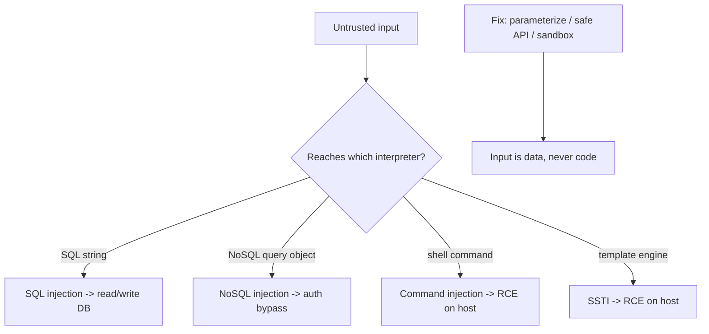

The test mindset is **taint tracking**: find where untrusted input enters (source) and where it reaches a dangerous interpreter (sink). NoSQL injection is often missed — passing `{"$gt": ""}` where a string is expected can bypass a MongoDB login. SSTI happens when user input is rendered *as* a template (`Hello {{name}}` where `name` is attacker-controlled) and modern engines let templates execute code.

### 8.4 Architecture: source to sink

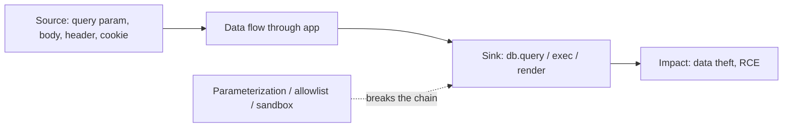

### 8.5 Real example

**Scenario.** Your backend has a search endpoint and a report feature that runs a shell command, plus a MongoDB-backed login.

**Problem.** The search concatenates input into SQL; the report passes input to a shell; the login compares a raw query object — all injectable.

**Solution.** Detect each with crafted payloads, then fix with parameterization, an argument array (no shell), and strict type/`$`-key validation.

**Implementation (detection then fix).**

```bash
# --- Detect SQLi (manual probe, then sqlmap on YOUR app only) ---
# Probe: does ' break the query? does ' OR '1'='1 change results?
curl "https://api.example.com/search?q=test%27%20OR%20%271%27=%271"
sqlmap -u "https://api.example.com/search?q=test" --batch --risk=2 --level=2

# --- Detect NoSQL auth bypass (JSON body) ---
curl -X POST https://api.example.com/login -H 'Content-Type: application/json' \
  -d '{"user":"admin","pass":{"$gt":""}}'   # logs in if query object is trusted

# --- Detect command injection ---
curl "https://api.example.com/report?name=x;id"   # ;id appended to a shell call?

# --- Detect SSTI ---
curl "https://api.example.com/greet?name=%7B%7B7*7%7D%7D"  # returns 49 => template eval
```

```js
// FIXES (Node.js examples; same principles in any stack)

// SQLi: parameterized query, input bound as data
db.query('SELECT * FROM items WHERE name = $1', [q]);   // not string concat

// NoSQL: validate type; reject objects/operators where a string is expected
if (typeof pass !== 'string') throw new Error('invalid');
await users.findOne({ user, pass });   // pass can't be a {$gt:""} object

// Command injection: no shell; pass args as an array to execFile
execFile('/usr/bin/report', [name], (err, out) => { /* ... */ });

// SSTI: never render user input AS a template; pass it as DATA
res.render('greet', { name });   // template fixed; name is escaped data
```

**Result.** Each payload now does nothing: the SQL string is literal, the login rejects non-string passwords, the shell never parses `;id`, and `{{7*7}}` renders as text. Re-running the probes confirms no injection.

**Future improvements.** Add least-privilege DB accounts, a SAST rule for string-built queries, and a CI test that fires these payloads and asserts they're neutralized.

### 8.6 Exercises

1. What single root cause unites SQLi, command injection, and SSTI?
2. How does `{"$gt": ""}` bypass a naive MongoDB login?
3. Why does passing command arguments as an array (no shell) prevent command injection?

### 8.7 Challenges

- **Challenge.** In your lab app, find one injectable input of each type (SQL, NoSQL, command, SSTI). Exploit it to prove impact, then apply the matching fix and confirm the payload is neutralized.

### 8.8 Checklist

- [ ] All DB access uses parameterized queries / safe ORM APIs.
- [ ] Inputs are type-validated (no objects/operators where strings expected).
- [ ] No untrusted input reaches a shell; args passed as arrays, no shell.
- [ ] User input is never rendered as a template.
- [ ] DB accounts are least-privilege.

### 8.9 Best practices

- Parameterize everything; treat all external input as hostile.
- Prefer libraries that avoid the shell entirely (`execFile`/`spawn` with arg arrays).
- Use logic-less or sandboxed templates; pass user data as variables, never as template source.

### 8.10 Anti-patterns

- Building queries/commands with string concatenation or interpolation.
- Trusting JSON body values to be the expected type.
- Blocklisting "dangerous characters" instead of separating code from data.

### 8.11 Troubleshooting

| Symptom | Likely cause | Action |
|---------|--------------|--------|
| `'` or `;` changes app behavior | Input reaches interpreter as code | Parameterize / use safe API |
| Login bypassed with JSON object | NoSQL operator injection | Validate input type strictly |
| `{{7*7}}` returns 49 | SSTI — input rendered as template | Render input as data, not template |

### 8.12 References

- OWASP, "Injection" (Top 10:2021 A03) and Injection Prevention Cheat Sheet: https://owasp.org.
- OWASP WSTG, "Testing for Injection" (WSTG-INPV).
- PortSwigger Academy: SQL injection, NoSQL injection, SSTI labs.

---

## Chapter 9 — Cross-site scripting (XSS) and the DOM

### 9.1 Introduction

**Cross-site scripting (XSS)** is injection into the **browser**: untrusted input is rendered into a page and executes as JavaScript in the victim's session, in your site's origin. The three forms are **stored** (persisted, e.g. a malicious comment), **reflected** (echoed from the request), and **DOM-based** (client-side JS writes input into the page unsafely). The defense is **context-aware output encoding** plus a **Content Security Policy (CSP)**.

### 9.2 Business context

XSS runs with the victim's authenticated privileges — it can steal sessions, perform actions as the user, exfiltrate data, or pivot to admins. For a frontend-heavy app (SPA), DOM-based XSS is especially relevant because so much rendering happens client-side. A single stored XSS in a shared field (username, comment) can compromise every viewer, including administrators.

### 9.3 Theoretical concepts: the three XSS types and contexts

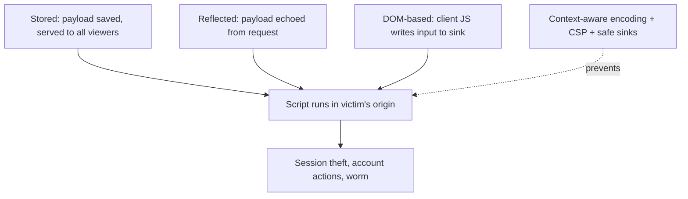

The **insertion context** determines the encoding: HTML body, HTML attribute, JavaScript, URL, and CSS each need different escaping. DOM XSS comes from dangerous **sinks** in client code: `innerHTML`, `document.write`, `eval`, `location`, and framework escape hatches (`dangerouslySetInnerHTML`, Angular `bypassSecurityTrust*`). Frameworks auto-encode by default — most DOM XSS is from deliberately bypassing that.

### 9.4 Architecture: input to execution, and where to break it

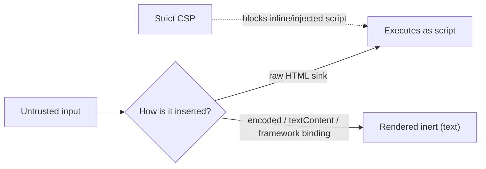

### 9.5 Real example

**Scenario.** Your app shows a user-set display name in several places, and a profile page renders a "bio" field with `innerHTML`.

**Problem.** A name/bio of `` executes for every viewer (stored XSS) and steals sessions.

**Solution.** Render via auto-encoding framework bindings (or `textContent`), sanitize any intentional HTML, and add a strict CSP.

**Implementation (detect then fix).**

```bash
# Detect: submit a benign marker payload, see if it executes/renders raw
#   Name = <script>document.title='XSS'</script>
#   Bio  = 
# If the page runs it, it's vulnerable. Test stored, reflected, and DOM paths.
```

```js
// VULNERABLE: raw insertion -> stored/DOM XSS
profileEl.innerHTML = user.bio;            // executes attacker HTML/JS

// SAFE: insert as text (auto-inert)
profileEl.textContent = user.bio;          //  shown as literal text
// In React/Angular/Vue: {user.bio} / {{user.bio}} auto-encodes by default.

// If you MUST allow some HTML (rich text), sanitize with an allowlist:
import DOMPurify from 'dompurify';
profileEl.innerHTML = DOMPurify.sanitize(user.bio);   // strips scripts/handlers
```

```nginx
# Defense in depth: a strict Content Security Policy header
add_header Content-Security-Policy
  "default-src 'self'; script-src 'self'; object-src 'none'; base-uri 'none'; frame-ancestors 'none'" always;
```

**Result.** The payload renders as harmless text (or is sanitized), and even if a sink were missed, the CSP blocks injected/inline script and exfiltration to `evil`. Re-testing the marker payloads shows no execution.

**Future improvements.** Audit every `innerHTML`/`dangerouslySetInnerHTML`/`bypassSecurityTrust*` use; add a lint rule forbidding them with untrusted data; move toward a nonce-based CSP.

### 9.6 Exercises

1. Why does injected script run with the victim's privileges?
2. What distinguishes DOM-based XSS from stored/reflected, and where does it originate?
3. How does a strict CSP limit the damage of an XSS that slips through?

### 9.7 Challenges

- **Challenge.** Find a stored and a DOM-based XSS in your lab app. Prove impact (e.g. read `document.cookie`), then fix with safe rendering + sanitization, and verify the CSP blocks a residual payload.

### 9.8 Checklist

- [ ] Untrusted output is context-encoded (or rendered via framework bindings).
- [ ] No `innerHTML`/`document.write`/`eval` with untrusted data.
- [ ] Framework escape hatches (`dangerouslySetInnerHTML`, `bypassSecurityTrust*`) audited.
- [ ] Rich-text HTML is sanitized with an allowlist (DOMPurify).
- [ ] A strict CSP is deployed.

### 9.9 Best practices

- Prefer frameworks that auto-encode; let them do the escaping.
- Sanitize, don't trust, any HTML you must render.
- Deploy a strict CSP (ideally nonce-based) as defense in depth.

### 9.10 Anti-patterns

- Inserting untrusted data as raw HTML.
- Relying on input filtering alone to stop XSS.
- Shipping no CSP, or a CSP weakened by `unsafe-inline`/`unsafe-eval`.

### 9.11 Troubleshooting

| Symptom | Likely cause | Action |
|---------|--------------|--------|
| Marker payload executes | Raw HTML sink | Use textContent/framework binding; sanitize |
| XSS only in client routing | DOM-based via JS sink | Fix the sink; avoid `innerHTML`/`eval` |
| Inline injected script still runs | Weak/absent CSP | Deploy strict CSP without `unsafe-inline` |

### 9.12 References

- OWASP, XSS Prevention & DOM XSS Prevention Cheat Sheets: https://owasp.org.
- OWASP WSTG, "Testing for Cross Site Scripting".
- MDN, Content Security Policy: https://developer.mozilla.org/docs/Web/HTTP/CSP.

---

## Chapter 10 — CSRF, CORS, and the same-origin model

### 10.1 Introduction

The browser's **same-origin policy (SOP)** is the foundation of web security: script from one origin cannot read responses from another. Two related issues live around it. **CSRF (Cross-Site Request Forgery)** abuses the browser's automatic sending of cookies to make a victim's browser perform an unwanted authenticated action. **CORS (Cross-Origin Resource Sharing)** is a controlled relaxation of SOP — and misconfiguring it can hand your data to any site.

### 10.2 Business context

CSRF can make a logged-in user change their email, transfer funds, or escalate an attacker's privileges — without the user's knowledge. CORS misconfiguration (e.g. reflecting any `Origin` with credentials) lets a malicious site read authenticated API responses, effectively stealing data cross-origin. Both are subtle, common, and fully preventable with the right defaults.

### 10.3 Theoretical concepts: cookies, origins, and trust

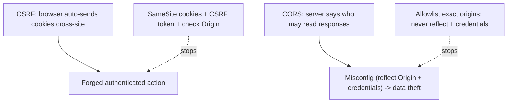

CSRF works because cookies are sent automatically on cross-site requests. The defenses: **SameSite cookies** (`Lax`/`Strict`) stop the browser sending the cookie on cross-site requests; an **anti-CSRF token** (unguessable, per-session) that the attacker's site can't read; and validating the `Origin`/`Referer`. CORS is the inverse — it controls cross-origin *reading*; the fatal mistake is reflecting the request's `Origin` while also allowing credentials, which trusts every site.

### 10.4 Architecture: the two failure modes

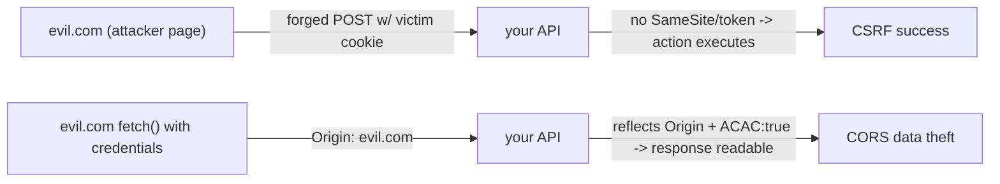

### 10.5 Real example

**Scenario.** Your API uses cookie-based sessions. A `POST /api/account/email` changes the user's email, and CORS is set to reflect the request origin with credentials.

**Problem.** A malicious page auto-submits a form to change the victim's email (CSRF), and any site can `fetch` authenticated endpoints and read the response (CORS).

**Solution.** Set `SameSite` cookies + CSRF tokens, validate `Origin`, and restrict CORS to an exact allowlist without reflecting arbitrary origins.

**Implementation (detect then fix).**

```html
<!-- CSRF proof-of-concept: this auto-submits using the victim's cookie -->
<form action="https://api.example.com/api/account/email" method="POST">
  <input name="email" value="attacker@evil.com">
</form><script>document.forms[0].submit()</script>
```

```bash
# CORS misconfig test: does the server trust an arbitrary origin + credentials?
curl -i https://api.example.com/api/me -H "Origin: https://evil.com"
# BAD response headers:
#   Access-Control-Allow-Origin: https://evil.com
#   Access-Control-Allow-Credentials: true     <- evil.com can read your data
```

```js
// FIX CSRF: cookie flags + token + origin check
res.cookie('sid', sid, { httpOnly: true, secure: true, sameSite: 'lax' });
// require a per-session CSRF token on state-changing requests:
if (req.headers['x-csrf-token'] !== req.session.csrf) return res.sendStatus(403);

// FIX CORS: exact allowlist, never reflect arbitrary origins with credentials
const ALLOWED = new Set(['https://app.example.com']);
const origin = req.headers.origin;
if (ALLOWED.has(origin)) {
  res.set('Access-Control-Allow-Origin', origin);
  res.set('Access-Control-Allow-Credentials', 'true');
  res.set('Vary', 'Origin');
}   // unknown origins get no CORS headers -> cannot read responses
```

**Result.** The forged email-change is rejected (missing/invalid CSRF token; `SameSite` blocks the cookie), and `evil.com` receives no permissive CORS headers, so it cannot read authenticated responses. Re-testing the PoC and the `Origin: evil.com` curl confirms both are blocked.

**Future improvements.** Prefer `SameSite=Strict` where UX allows; for token-based (non-cookie) auth, CSRF risk drops but CORS discipline still matters; add automated tests asserting CORS rejects unknown origins.

### 10.6 Exercises

1. Why does CSRF work — what browser behavior does it abuse?
2. Why is reflecting the request `Origin` with `Allow-Credentials: true` dangerous?
3. How do `SameSite` cookies reduce CSRF risk?

### 10.7 Challenges

- **Challenge.** Build a CSRF PoC page against a state-changing endpoint in your lab app and confirm it works. Then add `SameSite` + a CSRF token and confirm the PoC fails. Separately, test your CORS config with `Origin: https://evil.com`.

### 10.8 Checklist

- [ ] Session cookies are `HttpOnly`, `Secure`, and `SameSite=Lax/Strict`.
- [ ] State-changing requests require an anti-CSRF token (or are not cookie-authed).
- [ ] `Origin`/`Referer` is validated on sensitive actions.
- [ ] CORS uses an exact allowlist; no arbitrary `Origin` reflection with credentials.
- [ ] `Vary: Origin` is set when echoing allowed origins.

### 10.9 Best practices

- Default to `SameSite=Lax`; use `Strict` for high-value actions.
- Maintain a hardcoded CORS allowlist; treat `*` + credentials as forbidden.
- Combine SameSite + token (defense in depth) rather than relying on one.

### 10.10 Anti-patterns

- Reflecting `Access-Control-Allow-Origin` from the request with credentials.
- `Access-Control-Allow-Origin: *` on authenticated endpoints.
- Relying on a "secret" URL or a custom header alone to stop CSRF.

### 10.11 Troubleshooting

| Symptom | Likely cause | Action |
|---------|--------------|--------|
| Cross-site form changes user state | No CSRF token / SameSite | Add token + `SameSite` cookies |
| evil.com can read API responses | CORS reflects origin + credentials | Exact allowlist; no reflection |
| Legit cross-origin call breaks | Origin not in allowlist | Add the specific origin, set `Vary: Origin` |

### 10.12 References

- OWASP, CSRF Prevention Cheat Sheet: https://owasp.org.
- MDN, Same-origin policy & CORS: https://developer.mozilla.org/docs/Web/HTTP/CORS.
- PortSwigger Academy: CSRF and CORS labs.

---

## Chapter 11 — Broken authentication and session attacks

### 11.1 Introduction

**Authentication** proves who a user is; **session management** keeps them logged in. Breaking either grants access to accounts. This chapter covers credential attacks (brute force, credential stuffing, weak password policy), session flaws (predictable/fixed session IDs, missing expiry, insecure cookies), and **JWT/OAuth** pitfalls that dominate modern token-based auth.

### 11.2 Business context

Authentication is the front door — account takeover is one of the most damaging outcomes (full access to the victim's data and actions). Credential stuffing (reusing breached passwords) is automated and relentless; weak session handling lets an attacker ride a valid session; and a single JWT misconfiguration (`alg:none`, leaked signing key, no expiry) can forge any user. These are high-frequency, high-impact, and very testable.

### 11.3 Theoretical concepts: credentials, sessions, and tokens

```mermaid
flowchart TB
    cred["Credential attacks: brute force, stuffing, weak policy"] --> takeover["Account takeover"]
    sess["Session flaws: fixation, no expiry, weak cookie flags"] --> takeover
    token["Token flaws: alg:none, weak secret, no exp, no audience"] --> takeover
    fix["MFA + rate limit + strong sessions + verified JWT"] -.->|prevents| takeover
```

Key tests: does the login **rate-limit and lock out** (or use MFA) against brute force/stuffing? Does the session ID **rotate on login** (preventing fixation) and **expire**? Are cookies `HttpOnly`/`Secure`/`SameSite`? For JWTs: is the algorithm **pinned** (reject `none` and algorithm confusion), the **signature verified**, the **secret strong**, and are `exp`/`aud`/`iss` checked?

### 11.4 Architecture: the auth attack surface

```mermaid
flowchart LR
    login["Login endpoint"] -->|brute/stuffing| rl["Rate limit + lockout + MFA"]
    session["Session/token issuance"] -->|fixation/forgery| rotate["Rotate ID, sign+verify, set exp"]
    cookie["Cookie storage"] -->|theft| flags["HttpOnly+Secure+SameSite"]
    reset["Password reset / recovery"] -->|account takeover| safe["Tokened, expiring, single-use"]
```

### 11.5 Real example

**Scenario.** Your API issues a JWT on login. The login has no rate limit, and the JWT verification trusts the token's `alg` header.

**Problem.** Attackers credential-stuff the unthrottled login, and the JWT accepts `alg:none` (or an RS256→HS256 confusion), letting them forge an admin token.

**Solution.** Rate-limit + MFA the login; pin the JWT algorithm, verify the signature, and require `exp`/`aud`.

**Implementation (detect then fix).**

```bash
# Detect: is the login throttled? (run a small, authorized burst against YOUR app)
for i in $(seq 1 20); do
  curl -s -o /dev/null -w "%{http_code}\n" -X POST https://api.example.com/login \
    -H 'Content-Type: application/json' -d '{"user":"a@b.com","pass":"x'$i'"}'
done   # all 401 with no 429/lockout => no rate limiting

# Detect: JWT alg:none / weak secret
#   - Decode the token (jwt.io); try alg:"none" with empty signature
#   - Try cracking a weak HMAC secret offline:
hashcat -m 16500 token.jwt rockyou.txt   # JWT HS256 brute force
```

```js
// FIX JWT verification: pin algorithm, verify signature, check claims
import jwt from 'jsonwebtoken';
const payload = jwt.verify(token, PUBLIC_KEY, {
  algorithms: ['RS256'],          // reject 'none' and HS/RS confusion
  audience: 'api.example.com',
  issuer: 'auth.example.com',
});                                // throws on bad sig / expiry / wrong aud

// FIX login: rate limit + lockout (and add MFA)
import rateLimit from 'express-rate-limit';
app.use('/login', rateLimit({ windowMs: 15*60*1000, max: 10 }));
// + exponential backoff/lockout per account; + TOTP/WebAuthn MFA

// FIX session cookies (if cookie-based)
res.cookie('sid', id, { httpOnly: true, secure: true, sameSite: 'lax', maxAge: 3600_000 });
// rotate the session id on login to prevent fixation
```

**Result.** The login now throttles and locks out stuffing attempts; the JWT verifier rejects `alg:none`, algorithm confusion, weak secrets, and expired/wrong-audience tokens — forged admin tokens fail. Re-running the burst returns `429`, and the forged token is rejected.

**Future improvements.** Adopt WebAuthn/passkeys; use short-lived access tokens + rotating refresh tokens; store a strong, rotated signing key in a secrets manager (Ch. 20).

### 11.6 Exercises

1. What is session fixation and how does rotating the session ID on login prevent it?
2. Why is accepting the JWT's `alg` header (including `none`) dangerous?
3. How do rate limiting and MFA defeat credential stuffing?

### 11.7 Challenges

- **Challenge.** In your lab, forge a JWT using `alg:none` or a cracked weak secret and access another user's data. Then pin the algorithm + verify the signature and confirm the forged token is rejected.

### 11.8 Checklist

- [ ] Login is rate-limited and supports MFA; lockout/backoff on failures.
- [ ] Passwords are hashed with a strong algorithm (bcrypt/argon2) and a breach-list check.
- [ ] Session IDs rotate on login and expire; cookies are `HttpOnly`/`Secure`/`SameSite`.
- [ ] JWTs pin the algorithm, verify signatures, and check `exp`/`aud`/`iss`.
- [ ] Password-reset tokens are random, single-use, and expiring.

### 11.9 Best practices

- Prefer phishing-resistant MFA (WebAuthn/passkeys).
- Use short-lived access tokens with rotating refresh tokens.
- Store and rotate signing secrets in a dedicated secrets manager.

### 11.10 Anti-patterns

- Unthrottled login endpoints.
- Trusting the JWT `alg` header / not verifying signatures.
- Long-lived, non-expiring tokens or sessions; storing JWTs in `localStorage` exposed to XSS.

### 11.11 Troubleshooting

| Symptom | Likely cause | Action |
|---------|--------------|--------|
| Unlimited login attempts succeed | No rate limit/lockout | Add throttling, lockout, MFA |
| Forged token accepted | `alg:none`/weak secret/no verify | Pin alg, verify sig, strong key |
| Session survives logout/forever | No expiry/rotation | Set expiry; rotate and invalidate sessions |

### 11.12 References

- OWASP, Authentication & Session Management Cheat Sheets: https://owasp.org.
- OWASP, "Identification and Authentication Failures" (Top 10:2021 A07).
- RFC 8725, "JSON Web Token Best Current Practices".

---

## Chapter 12 — Broken access control, IDOR, and SSRF

### 12.1 Introduction

**Broken access control** is the #1 risk in the OWASP Top 10:2021 — it's when users can act outside their intended permissions. The most common form is **IDOR** (Insecure Direct Object Reference): changing an `id` in a request to access someone else's data. A related server-side flaw is **SSRF** (Server-Side Request Forgery): tricking your backend into making requests to internal resources (cloud metadata, internal services) it shouldn't reach.

### 12.2 Business context

Access-control bugs are both the most common and among the most damaging: an IDOR can expose every user's records by simply incrementing an ID, with no exploit code required. SSRF is the gateway to cloud breaches — reaching the cloud metadata endpoint (`169.254.169.254`) can hand over credentials for your entire infrastructure. Both are logic flaws that scanners miss and that require understanding your app's intended authorization model.

### 12.3 Theoretical concepts: authorization must be server-side and per-object

```mermaid
flowchart TB
    req["Request: action on object X by user U"] --> check{"Server checks: may U do this to X?"}
    check -->|yes| allow["Allow"]
    check -->|no| deny["Deny (403)"]
    missing["Missing/Client-side check"] --> idor["IDOR: U accesses X they don't own"]
    ssrf["User-controlled URL fetched by server"] --> internal["SSRF: reach metadata/internal services"]
```

The rule: **every** request must be authorized **server-side**, **per object**, against the **authenticated user** — never trust an ID, role, or flag supplied by the client. For SSRF: never fetch a user-supplied URL without an **allowlist**; block requests to private/link-local ranges and the cloud metadata IP.

### 12.4 Architecture: the authorization checkpoint and the SSRF boundary

```mermaid
flowchart LR
    user["Authenticated user"] --> gw["Per-request authz check (owner? role? scope?)"]
    gw -->|pass| data["Object"]
    gw -->|fail| block["403"]
    fetcher["Server-side URL fetch"] --> allowlist{"Allowlisted host?"}
    allowlist -->|no| reject["Reject (block 169.254/internal)"]
    allowlist -->|yes| ext["Allowed external call"]
```

### 12.5 Real example

**Scenario.** `GET /api/invoices/{id}` returns an invoice, and an avatar feature fetches a user-supplied image URL server-side.

**Problem.** The invoice endpoint returns any `id` without checking ownership (IDOR), and the avatar fetcher will request any URL, including `http://169.254.169.254/...` (SSRF → cloud credentials).

**Solution.** Enforce per-object ownership checks; for the fetcher, allowlist hosts and block internal ranges.

**Implementation (detect then fix).**

```bash
# Detect IDOR: as user A, request another user's object id
curl https://api.example.com/api/invoices/1001 -H "Authorization: Bearer A_TOKEN"
curl https://api.example.com/api/invoices/1002 -H "Authorization: Bearer A_TOKEN"
#   If 1002 (B's invoice) returns data to A => IDOR

# Detect SSRF: can the avatar fetcher be pointed inward?
curl -X POST https://api.example.com/api/avatar -H "Authorization: Bearer A_TOKEN" \
  -d '{"url":"http://169.254.169.254/latest/meta-data/iam/security-credentials/"}'
#   If it returns cloud metadata => SSRF to instance credentials
```

```js
// FIX IDOR: authorize per object against the authenticated user
const inv = await invoices.findOne({ id: req.params.id });
if (!inv || inv.ownerId !== req.user.id) return res.sendStatus(403);  // ownership check
return res.json(inv);

// FIX SSRF: allowlist + block private/link-local ranges, no redirects to internal
import { lookup } from 'dns/promises';
const url = new URL(req.body.url);
if (!ALLOWED_IMG_HOSTS.has(url.hostname)) return res.sendStatus(400);
const { address } = await lookup(url.hostname);
if (isPrivateOrLinkLocal(address)) return res.sendStatus(400);   // blocks 169.254/10./192.168 etc.
// fetch with redirects disabled and a timeout
```

**Result.** User A now gets `403` on B's invoice, and the avatar fetcher rejects internal/metadata URLs. Re-running both probes confirms the IDOR returns 403 and the SSRF is blocked.

**Future improvements.** Centralize authorization (a policy layer / middleware) so every endpoint is checked by default; use opaque/UUID IDs (defense in depth, not a substitute for authz); put the app on a network that has no route to the metadata endpoint, or use IMDSv2.

### 12.6 Exercises

1. Why is using UUIDs instead of sequential IDs not a sufficient fix for IDOR?
2. What makes the cloud metadata endpoint such a high-value SSRF target?
3. Why must authorization be enforced server-side and per object?

### 12.7 Challenges

- **Challenge.** Find an IDOR in your lab app by changing an object ID across two accounts. Then find an SSRF in any URL-fetching feature and point it at an internal address. Fix both and confirm 403/400 responses.

### 12.8 Checklist

- [ ] Every endpoint authorizes the action per object against the authenticated user.
- [ ] No authorization decision relies on a client-supplied role/flag/ID.
- [ ] Server-side URL fetches use an allowlist and block private/link-local ranges.
- [ ] Cloud metadata is protected (IMDSv2 / no route) where applicable.
- [ ] Authorization is centralized/default-deny, not per-endpoint ad hoc.

### 12.9 Best practices

- Default-deny: require an explicit authorization check on every handler.
- Block SSRF at both the application (allowlist) and network (egress firewall) layers.
- Log and alert on access-control denials and unusual ID enumeration.

### 12.10 Anti-patterns

- Trusting the client to send only "their own" IDs.
- Checking authorization in the UI but not the API.
- Fetching arbitrary user-supplied URLs with no allowlist.

### 12.11 Troubleshooting

| Symptom | Likely cause | Action |
|---------|--------------|--------|
| Changing an ID returns others' data | Missing per-object authz | Check ownership server-side |
| Server fetches internal addresses | SSRF, no allowlist | Allowlist hosts; block private ranges |
| Role bypass via request param | Client-trusted authorization | Derive role from session, server-side |

### 12.12 References

- OWASP, "Broken Access Control" (Top 10:2021 A01) & Authorization Cheat Sheet.
- OWASP, SSRF Prevention Cheat Sheet: https://owasp.org.
- PortSwigger Academy: Access control and SSRF labs.

---

## Chapter 13 — API security testing (REST and GraphQL)

### 13.1 Introduction

Your backend is an **API**, and APIs have their own dedicated risk catalog: the **OWASP API Security Top 10:2023**. The headline risks are object-level and function-level authorization (BOLA/BFLA — IDOR's API cousins), **excessive data exposure**, **mass assignment**, **lack of rate limiting**, and **GraphQL-specific** abuses (introspection, deeply nested queries, batching). APIs are tested directly (no UI), so every endpoint and field is in play.

### 13.2 Business context

Most modern breaches are API breaches — the SPA/mobile client is just one consumer, and attackers talk to the API directly. **BOLA** (Broken Object Level Authorization) is the #1 API risk and the cause of many large data leaks. **Excessive data exposure** (returning full objects and letting the client filter) and **mass assignment** (binding request fields straight to your model, so a user sets `role: admin`) are quietly catastrophic. GraphQL adds query-complexity DoS and introspection-driven discovery.

### 13.3 Theoretical concepts: the API Top 10 essentials

```mermaid
flowchart TB
    bola["BOLA: access others' objects by id"] --> breach["Data breach"]
    bfla["BFLA: call admin functions as a user"] --> breach
    expose["Excessive data exposure: API returns too much"] --> breach
    massasg["Mass assignment: client sets protected fields"] --> escalate["Privilege escalation"]
    norl["No rate limiting"] --> dos["Brute force / DoS / scraping"]
    gql["GraphQL: introspection + nested queries + batching"] --> dos
```

Test each endpoint for **BOLA/BFLA** (can a low-priv user reach another's object or an admin function?), **mass assignment** (send extra fields like `isAdmin`, `ownerId`, `verified`), **excessive exposure** (does the response include fields the client shouldn't see — internal flags, other users' PII?), and **rate limiting**. For **GraphQL**, check whether **introspection** is enabled in production, whether **deeply nested** queries are bounded, and whether **batching** bypasses rate limits.

### 13.4 Architecture: per-endpoint, per-field, per-object discipline

```mermaid
flowchart LR
    req["API request"] --> authz["Object + function authz (BOLA/BFLA)"]
    authz --> bind["Bind ONLY allowlisted fields (no mass assign)"]
    bind --> select["Return ONLY needed fields (no over-exposure)"]
    select --> rl["Rate / complexity limit"]
    rl --> resp["Response"]
```

### 13.5 Real example

**Scenario.** A REST endpoint `PATCH /api/users/{id}` updates a profile, and you also run a GraphQL endpoint.

**Problem.** The PATCH binds the whole body to the model (mass assignment → set `role:"admin"`), returns the full user object including `passwordHash` and other users' data on list endpoints (excessive exposure), and GraphQL has introspection on with unbounded query depth.

**Solution.** Allowlist updatable fields, project only safe fields in responses, enforce object authz, disable introspection, and add depth/complexity limits.

**Implementation (detect then fix).**

```bash
# Detect mass assignment: send a protected field
curl -X PATCH https://api.example.com/api/users/me -H "Authorization: Bearer U" \
  -H 'Content-Type: application/json' -d '{"name":"x","role":"admin"}'
#   If the user becomes admin => mass assignment

# Detect excessive exposure: inspect the full response for internal fields
curl https://api.example.com/api/users -H "Authorization: Bearer U" | jq '.[0]'
#   passwordHash, internalNotes, other users' email present? => over-exposure

# Detect GraphQL introspection (maps the entire schema for the attacker)
curl -X POST https://api.example.com/graphql -H 'Content-Type: application/json' \
  -d '{"query":"{__schema{types{name}}}"}'
```

```js
// FIX mass assignment: bind only allowlisted fields
const { name, bio } = req.body;                 // ignore role/ownerId/etc.
await users.update(req.user.id, { name, bio }); // never spread req.body into the model

// FIX excessive exposure: project only safe fields
const safe = (u) => ({ id: u.id, name: u.name, bio: u.bio }); // no passwordHash/PII
res.json(list.map(safe));

// FIX GraphQL: disable introspection in prod + depth/complexity limits
const server = new ApolloServer({
  schema, introspection: false,                 // off in production
  validationRules: [depthLimit(6), costLimit({ maxCost: 1000 })],
});
```

**Result.** The PATCH ignores `role`, responses exclude secrets and others' PII, introspection is disabled, and overly nested GraphQL queries are rejected. Re-running each probe confirms the protected field is ignored, the response is minimal, and introspection returns an error.

**Future improvements.** Generate response DTOs/schemas so "return everything" is impossible by construction; add per-user and per-IP rate limits (including GraphQL batch awareness); contract-test authorization on every endpoint.

### 13.6 Exercises

1. What is BOLA and why is it the top API risk?
2. How does mass assignment lead to privilege escalation?
3. Why disable GraphQL introspection and limit query depth in production?

### 13.7 Challenges

- **Challenge.** Against your lab API, demonstrate BOLA (reach another object), mass assignment (set a protected field), and excessive data exposure (find a secret field in a response). Fix each and verify.

### 13.8 Checklist

- [ ] Every endpoint enforces object- and function-level authorization.
- [ ] Updates bind only allowlisted fields (no mass assignment).
- [ ] Responses return only needed fields (DTOs/projections; no secrets/PII leakage).
- [ ] Rate limiting applies per user and per IP (and accounts for batching).
- [ ] GraphQL: introspection off in prod; depth/complexity limits enforced.

### 13.9 Best practices

- Use explicit request/response DTOs — never bind or return raw models.
- Centralize authorization so BOLA/BFLA can't slip through a new endpoint.
- Treat the API, not the UI, as the security boundary.

### 13.10 Anti-patterns

- Spreading `req.body` into your data model.
- Returning full records and filtering on the client.
- Leaving GraphQL introspection and unbounded queries enabled in production.

### 13.11 Troubleshooting

| Symptom | Likely cause | Action |
|---------|--------------|--------|
| User sets own role/owner | Mass assignment | Allowlist updatable fields |
| Secrets/PII in API responses | Excessive data exposure | Project safe fields via DTOs |
| GraphQL query exhausts server | No depth/complexity limit | Add depth & cost limits; off introspection |

### 13.12 References

- OWASP API Security Top 10:2023: https://owasp.org/API-Security/.
- OWASP, GraphQL Cheat Sheet: https://owasp.org.
- OWASP WSTG, "API Testing".

---

## Chapter 14 — Frontend and client-side security (supply chain, secrets, CSP)

### 14.1 Introduction

The frontend isn't just an XSS target — it's a distribution channel for code that runs in every user's browser. Client-side pentesting covers **dependency/supply-chain risk** (a malicious or vulnerable npm package), **secrets accidentally shipped in the bundle**, **insecure client storage**, **security headers** (CSP, HSTS, etc.), and **Subresource Integrity** for third-party scripts. The browser is hostile territory: anything you ship to it is readable and modifiable.

### 14.2 Business context

Supply-chain attacks (compromised packages, typosquats, malicious post-install scripts) have become a leading breach vector — your build pulls in hundreds of transitive dependencies, any of which can exfiltrate data or inject a skimmer. Secrets in frontend bundles (API keys, tokens) are routinely harvested by automated scanners. Missing security headers leave users exposed to clickjacking, downgrade attacks, and XSS that a CSP would have contained.

### 14.3 Theoretical concepts: trust nothing you ship to the client

```mermaid
flowchart TB
    deps["Dependencies (npm, transitive)"] --> sca["Audit (npm audit, Snyk, OSV) + lockfile + SRI"]
    secrets["Secrets in bundle"] --> noship["Never ship secrets; keep them server-side"]
    storage["localStorage/sessionStorage"] --> nostore["No tokens/PII in JS-readable storage"]
    headers["Security headers"] --> set["CSP, HSTS, X-Frame-Options/frame-ancestors, etc."]
    thirdparty["Third-party scripts"] --> sri["Subresource Integrity + minimize"]
```

Key principles: **anything in the bundle is public** (so no secrets); **don't store tokens in `localStorage`** (XSS reads it — prefer `HttpOnly` cookies); **audit and pin dependencies**; **set security headers**; and use **Subresource Integrity (SRI)** so a tampered CDN script won't run.

### 14.4 Architecture: the client-side trust boundary

```mermaid
flowchart LR
    build["Build pipeline"] -->|audit + lockfile| bundle["JS bundle"]
    bundle -->|no secrets, SRI on 3rd-party| browser["User's browser"]
    server["Server"] -->|HttpOnly cookie, security headers| browser
    browser -.->|everything here is attacker-readable| attacker["Attacker can read/modify client code"]
```

### 14.5 Real example

**Scenario.** Your SPA stores the JWT in `localStorage`, embeds a third-party analytics key, loads a CDN script without integrity, and ships no security headers.

**Problem.** An XSS steals the token from `localStorage`; the bundle leaks the key; a compromised CDN script runs unchecked; and there's no CSP/HSTS to contain any of it.

**Solution.** Move the token to an `HttpOnly` cookie, keep secrets server-side, add SRI, audit dependencies, and set a full security-header set.

**Implementation (detect then fix).**

```bash
# Detect secrets shipped in the bundle
curl -s https://app.example.com/main.js | grep -iE 'api[_-]?key|secret|token|AKIA[0-9A-Z]{16}'

# Detect vulnerable/known-bad dependencies
npm audit --production
npx osv-scanner --lockfile=package-lock.json

# Detect missing security headers
curl -sI https://app.example.com | grep -iE \
  'content-security-policy|strict-transport-security|x-frame-options|x-content-type-options'
```

```nginx
# FIX: full security-header set at the edge (nginx)
add_header Strict-Transport-Security "max-age=63072000; includeSubDomains; preload" always;
add_header Content-Security-Policy "default-src 'self'; object-src 'none'; frame-ancestors 'none'; base-uri 'none'" always;
add_header X-Content-Type-Options "nosniff" always;
add_header Referrer-Policy "strict-origin-when-cross-origin" always;
add_header Permissions-Policy "geolocation=(), camera=(), microphone=()" always;
```

```html
<!-- FIX: Subresource Integrity for third-party scripts -->
<script src="https://cdn.example.com/lib.js"
        integrity="sha384-<hash>" crossorigin="anonymous"></script>
<!-- FIX: store the session in an HttpOnly cookie (server-set), not localStorage -->
```

**Result.** The token is no longer JS-readable, no secret ships in the bundle, the CDN script won't execute if tampered with, vulnerable deps are flagged in CI, and the header set contains XSS/clickjacking/downgrade. Re-running the header and grep checks confirms the fixes.

**Future improvements.** Add a lockfile-integrity gate and a Software Bill of Materials (SBOM) to CI; pin/verify dependencies; move toward a nonce-based CSP; consider `npm ci` with provenance checks.

### 14.6 Exercises

1. Why is storing a session token in `localStorage` risky compared to an `HttpOnly` cookie?
2. What does Subresource Integrity protect against?
3. Why does a secret in a frontend bundle count as public?

### 14.7 Challenges

- **Challenge.** Grep your own production bundle for secrets and run a dependency audit. Check your live headers with `curl -sI`. Fix any leaked secret, vulnerable dependency, or missing header you find.

### 14.8 Checklist

- [ ] No secrets are present in any frontend bundle.
- [ ] Session tokens are in `HttpOnly` cookies, not `localStorage`.
- [ ] Dependencies are audited (CI gate) and pinned via lockfile.
- [ ] Third-party scripts use Subresource Integrity.
- [ ] Security headers (CSP, HSTS, X-Content-Type-Options, frame-ancestors, Referrer-Policy) are set.

### 14.9 Best practices

- Keep all secrets server-side; the client gets only what's safe to be public.
- Gate builds on dependency audits and lockfile integrity.
- Set a complete security-header baseline and test it on every deploy.

### 14.10 Anti-patterns

- Embedding API keys/secrets in client code.
- Storing JWTs/PII in `localStorage`.
- Loading third-party scripts without SRI; shipping no CSP/HSTS.

### 14.11 Troubleshooting

| Symptom | Likely cause | Action |
|---------|--------------|--------|
| Secret found in bundle | Secret used client-side | Move to server; rotate the secret |
| Token stolen via XSS | Token in `localStorage` | Use `HttpOnly` cookie |
| Tampered CDN script runs | No SRI | Add `integrity` hash; self-host if possible |
| Clickjacking / downgrade works | Missing headers | Add `frame-ancestors`/`X-Frame-Options`, HSTS |

### 14.12 References

- OWASP, Secure Headers Project: https://owasp.org/www-project-secure-headers/.
- OWASP, "Vulnerable and Outdated Components" (Top 10:2021 A06); npm audit / OSV-Scanner docs.
- MDN, Subresource Integrity & HSTS: https://developer.mozilla.org/.

---

## Chapter 15 — Business logic and file-handling flaws

### 15.1 Introduction

**Business logic flaws** are abuses of legitimate functionality used in unintended ways — no malformed input, just steps performed out of order, values manipulated, or workflows bypassed (e.g. negative quantities, skipping payment, replaying a one-time action). **File handling** (uploads, downloads, path handling) is a related high-risk area: unrestricted uploads can lead to code execution, and **path traversal** can read arbitrary files. These are logic-dependent, so they require understanding *your* app — scanners rarely find them.

### 15.2 Business context

Logic flaws hit revenue and integrity directly: buying for a negative price, coupon stacking, bypassing limits, or escalating a workflow. File flaws can be catastrophic — an uploaded `.php`/`.jsp` served by the web server is remote code execution on your VPS; a path-traversal `../../etc/passwd` (or your `.env`) leaks secrets. Because these depend on your specific rules, you are the best-placed tester.

### 15.3 Theoretical concepts: abuse the rules, constrain the files

```mermaid
flowchart TB
    logic["Business logic"] --> abuse{"Can a step be skipped/replayed/manipulated?"}
    abuse --> negq["Negative/huge quantities, price tampering"]
    abuse --> order["Out-of-order / skipped workflow steps"]
    abuse --> race["Race conditions (double-spend, replay)"]
    upload["File upload"] --> ufix["Validate type/size; store outside webroot; no execution"]
    path["Path/filename input"] --> pfix["Canonicalize + allowlist; block ../ traversal"]
```

For logic: enumerate each workflow and ask "what if I do this step twice / out of order / with an extreme value / concurrently (race)?" For files: validate content type and size, **store uploads outside the web root** and serve them non-executably, generate server-side filenames, and **canonicalize** any path input against an allowlist to stop `../` traversal.

### 15.4 Architecture: server-authoritative rules and file isolation

```mermaid
flowchart LR
    client["Client request (untrusted values)"] --> server["Server re-validates ALL business rules"]
    server -->|price, qty, ownership, state| decision["Authoritative decision"]
    fileup["Upload"] --> scan["Type/size check + AV"] --> store["Outside webroot, random name, no exec"]
    pathin["Path param"] --> canon["Canonicalize + allowlist"] --> read["Safe read"]
```

### 15.5 Real example

**Scenario.** A checkout trusts a client-sent `price` and `quantity`, a coupon can be applied repeatedly, and an upload endpoint saves files under the web root with the user's filename.

**Problem.** An attacker sets `price: 0` or `quantity: -1` (refund), stacks one coupon many times (race), and uploads `shell.php` that the server executes (RCE); a download endpoint allows `../../etc/passwd`.

**Solution.** Re-derive price/limits server-side, make coupon redemption atomic/single-use, restrict and isolate uploads, and canonicalize download paths.

**Implementation (detect then fix).**

```bash
# Detect price/qty tampering
curl -X POST https://api.example.com/api/checkout -H "Authorization: Bearer U" \
  -d '{"items":[{"sku":"A","price":0,"qty":-1}]}'    # server should ignore client price/qty sign

# Detect coupon race (replay in parallel)
seq 10 | xargs -P10 -I{} curl -s -X POST .../api/coupon -d '{"code":"SAVE50"}'

# Detect upload RCE
curl -F 'file=@shell.php' https://api.example.com/api/upload  # then try to browse it

# Detect path traversal
curl "https://api.example.com/api/download?file=../../../../etc/passwd"
```

```js
// FIX price/qty: never trust client; look up price, validate quantity
const price = await catalog.priceOf(item.sku);      // server-authoritative
if (!Number.isInteger(item.qty) || item.qty < 1) return res.sendStatus(400);

// FIX coupon: atomic single-use redemption (DB constraint / transaction)
const ok = await coupons.redeemOnce(code, req.user.id);  // unique constraint prevents replay
if (!ok) return res.sendStatus(409);

// FIX upload: validate, randomize name, store outside webroot, serve non-exec
if (!ALLOWED_MIME.has(file.mimetype) || file.size > MAX) return res.sendStatus(400);
const dest = path.join(UPLOAD_DIR_OUTSIDE_WEBROOT, randomUUID());  // no user filename, no exec

// FIX path traversal: canonicalize and confine to a base directory
const base = '/srv/files';
const resolved = path.resolve(base, path.basename(req.query.file)); // strip ../
if (!resolved.startsWith(base + path.sep)) return res.sendStatus(400);
```

**Result.** The server ignores client price and rejects invalid quantities, the coupon can be redeemed only once even under concurrency, uploads can't execute and live outside the web root, and traversal is blocked. Re-running each probe confirms the abuse no longer works.

**Future improvements.** Model critical workflows as explicit state machines (illegal transitions impossible); add idempotency keys to prevent replay; scan uploads with antivirus and serve them from a separate, sandboxed domain.

### 15.6 Exercises

1. Why can't an automated scanner reliably find business-logic flaws?
2. Why must uploaded files be stored outside the web root and served non-executably?
3. How does an atomic single-use redemption defeat a coupon race condition?

### 15.7 Challenges

- **Challenge.** In your app, pick one money/limit-related workflow and try to abuse it (extreme values, replay, out-of-order, concurrent). Separately, test your upload and any file-path feature for RCE and traversal. Fix what you find.

### 15.8 Checklist

- [ ] All business-critical values (price, totals, limits) are derived/validated server-side.
- [ ] Critical workflows enforce order and state; one-time actions are idempotent/atomic.
- [ ] Race conditions are handled (DB constraints/locks/idempotency keys).
- [ ] Uploads validate type/size, use server-generated names, and are stored outside the web root, non-executable.
- [ ] Path inputs are canonicalized and confined to an allowed base directory.

### 15.9 Best practices

- Treat the server as the single source of truth for every rule and value.
- Model critical flows as state machines; make illegal states unrepresentable.
- Isolate file storage from execution; serve user files from a separate domain.

### 15.10 Anti-patterns

- Trusting client-supplied prices, totals, roles, or quantities.
- Saving uploads under the web root with user-controlled filenames.
- Building file paths by concatenating user input.

### 15.11 Troubleshooting

| Symptom | Likely cause | Action |
|---------|--------------|--------|
| Order with price 0 / negative qty succeeds | Client-trusted values | Re-derive/validate server-side |
| Coupon/limit applied many times | Race / no single-use | Atomic redemption, DB constraint |
| Uploaded script executes | Upload under webroot, executable | Store outside webroot, no exec, random name |
| `../` reads system files | Path traversal | Canonicalize + confine to base dir |

### 15.12 References

- OWASP WSTG, "Business Logic Testing" and "Testing for File Upload".
- OWASP, File Upload & Path Traversal Cheat Sheets: https://owasp.org.
- OWASP, "Insecure Design" (Top 10:2021 A04).

---

> **End of Part III.** You can now test and fix the full web/API attack surface: injection (code/data separation), XSS (encoding + CSP), CSRF/CORS (SameSite, tokens, origin allowlists), authentication and sessions (rate limiting, MFA, verified JWTs), access control/IDOR/SSRF (server-side per-object authorization, allowlists), API-specific risks (BOLA/BFLA, mass assignment, over-exposure, GraphQL limits), client-side supply chain and headers, and business-logic and file-handling abuse. **Part IV — Infrastructure and VPS pentesting** moves below the application to the host itself: open ports and the firewall, SSH, TLS and reverse proxies, Linux privilege escalation, and the secrets/containers/CI-CD pipeline that can undo all of the above.

## Part IV – Infrastructure and VPS pentesting

A perfectly secure app on a weak host is still breachable. Your VPS is a Linux machine on the public internet, probed continuously by automated bots within minutes of coming online. This part tests the host itself: what's reachable through the firewall (Ch. 16), how remote access (SSH) is secured (Ch. 17), transport and the reverse proxy (Ch. 18), how a foothold becomes root (Ch. 19), and the secrets/containers/CI-CD that, if compromised, hand over everything (Ch. 20).

---

## Chapter 16 — Network exposure: ports, services, and the firewall

### 16.1 Introduction

The first host-level question is **what can the internet reach?** A VPS should expose the minimum: typically 443 (HTTPS), maybe 80 (redirect to 443), and SSH — ideally restricted to your IP. Everything else (databases, caches, admin panels, app ports) must be bound to `127.0.0.1` or blocked by a firewall. This chapter tests the firewall and service-binding from the attacker's external viewpoint.

### 16.2 Business context

Exposed data services are one of the fastest paths to a breach: an internet-reachable, unauthenticated Redis, MongoDB, Elasticsearch, or Postgres is found by mass scanners (Shodan, Censys) within hours and looted automatically. A default-deny firewall with a tiny allowlist eliminates an entire category of risk. Verifying it *from outside* is the only way to know your intent matches reality.

### 16.3 Theoretical concepts: default-deny and minimal exposure

```mermaid
flowchart TB
    internet["Internet"] --> fw{"Firewall: default deny"}
    fw -->|allow 443| web["Web server (public)"]
    fw -->|allow 22 from my IP| ssh["SSH (restricted)"]
    fw -.->|DENY all else| blocked["DB, cache, app ports, admin"]
    local["127.0.0.1 binding"] --> internalonly["Data services reachable only on host"]
```

Two layers: **bind** services to localhost so they never listen publicly, **and** a **default-deny firewall** (ufw/nftables, plus the provider's network firewall/security group) that allows only the needed ports. Defense in depth means a binding mistake is still caught by the firewall, and vice-versa.

### 16.4 Architecture: the two enforcement points

```mermaid
flowchart LR
    provider["Provider security group / cloud firewall"] --> host["Host firewall (ufw/nftables)"]
    host --> bindings["Service bindings (0.0.0.0 vs 127.0.0.1)"]
    bindings --> exposure["Effective public exposure"]
    exposure -->|verify externally| nmap["External nmap = ground truth"]
```

### 16.5 Real example

**Scenario.** Your VPS runs nginx (443), the app (3000), Postgres (5432), and Redis (6379).

**Problem.** Only 443 should be public, but Redis and the app port are bound to `0.0.0.0` and the firewall is permissive — both are internet-reachable.

**Solution.** Bind data/app services to localhost and set a default-deny firewall allowing only 443 (and SSH from your IP). Verify externally.

**Implementation (detect then fix).**

```bash
# Detect (from a DIFFERENT host): what's actually public?
nmap -sV -p- 203.0.113.10
#   6379/tcp open redis (no auth)  3000/tcp open  http  <- must not be public

# On the host: see what's listening and on which interface
ss -tlnp
#   0.0.0.0:6379  <- public   vs   127.0.0.1:6379  <- localhost only
```

```bash
# FIX bindings:
#   redis.conf:        bind 127.0.0.1 ::1      and  requirepass <strong>
#   postgresql.conf:   listen_addresses = 'localhost'
#   app:               listen on 127.0.0.1:3000 (nginx proxies to it)

# FIX firewall: default deny, allow only what's needed
ufw default deny incoming
ufw default allow outgoing
ufw allow 443/tcp
ufw allow from 198.51.100.5 to any port 22 proto tcp   # SSH only from your IP
ufw enable

# Verify again from outside — only 443 should answer
nmap -p- 203.0.113.10
```

**Result.** External scanning now shows only 443 (and SSH from your IP). Redis/Postgres/app are unreachable from the internet. The external re-scan is the proof.

**Future improvements.** Add the provider's network firewall/security group as a second layer; alert on any new listening socket; consider putting SSH behind a VPN/bastion (Ch. 17).

### 16.6 Exercises

1. Why verify exposure with an external scan rather than trusting the config?
2. What two independent layers reduce service exposure?
3. Why is an internet-reachable unauthenticated Redis a critical finding?

### 16.7 Challenges

- **Challenge.** External-scan your VPS. For every open port, either justify it or close it (bind to localhost / firewall). Re-scan to prove only intended ports remain.

### 16.8 Checklist

- [ ] Data/app services bind to `127.0.0.1`, not `0.0.0.0`.
- [ ] Host firewall is default-deny with a minimal allowlist.
- [ ] SSH is restricted to known IPs (or a bastion/VPN).
- [ ] Provider network firewall/security group mirrors the host rules.
- [ ] External scan confirms only intended ports are reachable.

### 16.9 Best practices

- Default-deny everywhere; allowlist the few required ports.
- Bind internal services to localhost even behind a firewall (defense in depth).
- Re-scan externally after every infrastructure change.

### 16.10 Anti-patterns

- Binding databases/caches to `0.0.0.0` for convenience.
- Trusting the firewall config without external verification.
- Leaving SSH open to the whole internet on port 22 with passwords.

### 16.11 Troubleshooting

| Symptom | Likely cause | Action |
|---------|--------------|--------|
| DB/cache reachable externally | Bound to 0.0.0.0 / open firewall | Bind to localhost; default-deny firewall |
| App port answers publicly | App not behind reverse proxy | Bind app to 127.0.0.1; proxy via nginx |
| Mass scan/abuse traffic | Wide-open ports | Restrict to needed ports/IPs |

### 16.12 References

- CIS Benchmarks (Linux, firewall): https://www.cisecurity.org/cis-benchmarks.
- nmap & ufw/nftables documentation.
- Shodan/Censys (see your own exposure): https://www.shodan.io.

---

## Chapter 17 — Hardening and testing SSH and remote access

### 17.1 Introduction

**SSH** is the keys to the VPS — if it falls, everything falls. SSH attacks are overwhelmingly **password brute force / credential stuffing** against `root` and common usernames, plus exploitation of weak configuration. Hardening (key-only auth, no root login, restricted source IPs, optional MFA/bastion) and verifying it is one of the highest-value host tests you can run.

### 17.2 Business context

Every internet-facing SSH port receives thousands of automated login attempts daily. Password auth on `root` is a coin-flip away from compromise; once in, the attacker has the host. Key-based auth with passwords disabled makes brute force essentially impossible, turning the most-attacked service into a non-issue. This is cheap, decisive hardening.

### 17.3 Theoretical concepts: keys, not passwords; least exposure

```mermaid
flowchart TB
    pw["Password auth"] --> brute["Brute force / stuffing succeeds eventually"]
    keys["Key-only auth (PasswordAuthentication no)"] --> nobrute["Brute force infeasible"]
    rootlogin["PermitRootLogin yes"] --> direct["Direct root compromise"]
    norootlogin["PermitRootLogin no + sudo user"] --> contained["Foothold ≠ root"]
    extra["Restrict source IP + fail2ban + MFA/bastion"] --> hardened["Minimal SSH exposure"]
```

The essentials: **disable password auth** (keys only), **disable root login**, **restrict source IPs** (firewall or `AllowUsers`/`Match`), add **fail2ban** to throttle, and for higher assurance a **bastion host** or **MFA**. Use strong modern key types (ed25519) and protect private keys with a passphrase.

### 17.4 Architecture: the hardened SSH path

```mermaid
flowchart LR
    admin["You (with ed25519 key)"] -->|from allowed IP| fw["Firewall (22 restricted)"]
    fw --> sshd["sshd: keys only, no root, fail2ban"]
    sshd --> user["Non-root sudo user"]
    attacker["Bot with passwords"] -.->|blocked: no password auth| sshd
```

### 17.5 Real example

**Scenario.** Your VPS allows SSH password login as `root` on port 22, open to the internet.

**Problem.** It's under constant brute force; a weak/reused root password means full compromise.

**Solution.** Switch to key-only auth, disable root login, restrict source IPs, and add fail2ban. Verify password auth is refused.

**Implementation (detect then fix).**

```bash
# Detect: is password auth offered? (authorized check of YOUR host)
ssh -o PreferredAuthentications=password -o PubkeyAuthentication=no root@203.0.113.10
#   A password prompt => password auth is enabled (bad)
nmap --script ssh-auth-methods -p22 203.0.113.10   # lists offered auth methods

# Review server config
sshd -T | grep -Ei 'passwordauthentication|permitrootlogin|pubkeyauthentication'
```

```bash
# FIX: /etc/ssh/sshd_config
#   PasswordAuthentication no
#   PermitRootLogin no
#   PubkeyAuthentication yes
#   AllowUsers deployer            # only this account
#   KbdInteractiveAuthentication no
systemctl restart ssh

# Generate a strong key (client side) and install it before disabling passwords
ssh-keygen -t ed25519 -C "you@host"
ssh-copy-id deployer@203.0.113.10

# Throttle brute force
apt install fail2ban && systemctl enable --now fail2ban

# Verify: password auth must now be refused
ssh -o PreferredAuthentications=password root@203.0.113.10   # => Permission denied
```

**Result.** Password login is refused, root can't log in directly, only your key on the `deployer` account works, and fail2ban bans repeat offenders. The verification SSH attempt is denied — brute force is no longer viable.

**Future improvements.** Put SSH behind a VPN/bastion (no public 22 at all), add hardware-key (FIDO2) or TOTP MFA, and rotate keys; monitor auth logs for anomalies.

### 17.6 Exercises

1. Why does key-only auth essentially eliminate SSH brute-force risk?
2. Why disable direct root login even with strong auth?
3. What does fail2ban add on top of key-only auth?

### 17.7 Challenges

- **Challenge.** Confirm whether your VPS offers SSH password auth (`ssh-auth-methods`). If so, move to key-only, disable root login, restrict the source IP, and verify a password login is refused.

### 17.8 Checklist

- [ ] `PasswordAuthentication no` (key-only).
- [ ] `PermitRootLogin no`; admin via a non-root sudo user.
- [ ] SSH source IPs restricted (firewall / `AllowUsers` / bastion).
- [ ] Strong key type (ed25519), passphrase-protected; keys rotated.
- [ ] fail2ban (or equivalent) throttles attempts; auth logs monitored.

### 17.9 Best practices

- Keys only, no passwords, no root login — the decisive trio.
- Remove public SSH entirely where possible (VPN/bastion).
- Add MFA (FIDO2/TOTP) for administrative access.

### 17.10 Anti-patterns

- Password auth as root on the open internet.
- Sharing one key across people/machines with no rotation.
- Leaving port 22 world-open when only you connect.

### 17.11 Troubleshooting

| Symptom | Likely cause | Action |
|---------|--------------|--------|
| Constant failed-login spam | Password auth + open 22 | Key-only; restrict IP; fail2ban |
| Direct root logins in logs | `PermitRootLogin yes` | Disable; use sudo user |
| Locked out after hardening | Disabled passwords before installing key | Use console/recovery; install key first |

### 17.12 References

- OpenSSH server hardening; Mozilla OpenSSH Guidelines: https://infosec.mozilla.org/guidelines/openssh.
- CIS Benchmark (SSH section).
- fail2ban documentation.

---

## Chapter 18 — TLS, reverse proxies, and transport security

### 18.1 Introduction

All traffic to your app should be **encrypted (HTTPS/TLS)** and terminated by a correctly configured **reverse proxy** (nginx/Caddy/Traefik). This chapter tests TLS configuration (protocol versions, ciphers, certificate validity, HSTS) and reverse-proxy hardening (request smuggling, header handling, hiding the backend). Weak transport security enables interception and downgrade; a misconfigured proxy can leak internals or be smuggled past.

### 18.2 Business context

Without TLS (or with weak TLS), credentials and data can be intercepted on the wire (public Wi-Fi, compromised networks) and sessions hijacked. Outdated protocols (SSLv3, TLS 1.0/1.1) and weak ciphers are exploitable and fail compliance. The reverse proxy is your edge — getting HSTS, redirects, and header forwarding right (and hiding backend version banners) shrinks the attack surface and prevents downgrade.

### 18.3 Theoretical concepts: strong TLS and a clean edge

```mermaid
flowchart TB
    tls["TLS config"] --> proto["TLS 1.2/1.3 only; strong ciphers"]
    tls --> cert["Valid cert, auto-renew, OCSP stapling"]
    tls --> hsts["HSTS (force HTTPS, prevent downgrade)"]
    proxy["Reverse proxy"] --> redirect["80 -> 443 redirect"]
    proxy --> hide["Hide backend banners/versions"]
    proxy --> smuggle["Consistent parsing (no request smuggling)"]
```

Test: only **TLS 1.2/1.3** with strong ciphers; a **valid, auto-renewing** certificate (Let's Encrypt); **HSTS** with a long max-age (and preload); HTTP redirected to HTTPS; backend **version banners hidden**; and consistent request parsing to avoid **HTTP request smuggling** between proxy and backend.

### 18.4 Architecture: TLS termination at the edge

```mermaid
flowchart LR
    client["Client"] -->|HTTPS, TLS 1.3, HSTS| proxy["Reverse proxy (TLS terminate)"]
    proxy -->|localhost only| app["App backend (127.0.0.1)"]
    proxy --> headers["Adds security headers, hides banners"]
    le["Let's Encrypt"] -->|auto-renew cert| proxy
```

### 18.5 Real example

**Scenario.** Your nginx serves HTTPS but also accepts TLS 1.0/1.1, has no HSTS, exposes its version in the `Server` header, and doesn't redirect HTTP.

**Problem.** Clients can be downgraded to weak TLS, sessions ride plaintext on first HTTP hit, and the version banner aids targeting.

**Solution.** Restrict to TLS 1.2/1.3 with strong ciphers, enable HSTS, redirect 80→443, and hide the banner. Verify with a TLS scanner.

**Implementation (detect then fix).**

```bash
# Detect: protocol/cipher/cert posture
nmap --script ssl-enum-ciphers -p443 203.0.113.10     # flags TLS 1.0/1.1, weak ciphers
testssl.sh https://app.example.com                    # full TLS audit, HSTS, cert
curl -sI http://app.example.com | grep -i location     # is 80 redirected to 443?
curl -sI https://app.example.com | grep -i server      # banner exposing version?
```

```nginx
# FIX nginx TLS + edge hardening
server {
    listen 443 ssl http2;
    ssl_protocols TLSv1.2 TLSv1.3;                      # drop 1.0/1.1
    ssl_ciphers 'ECDHE-ECDSA-AES128-GCM-SHA256:ECDHE-RSA-AES128-GCM-SHA256:...';
    ssl_prefer_server_ciphers off;
    ssl_stapling on; ssl_stapling_verify on;            # OCSP stapling
    add_header Strict-Transport-Security "max-age=63072000; includeSubDomains; preload" always;
    server_tokens off;                                  # hide nginx version
    location / { proxy_pass http://127.0.0.1:3000; }    # backend on localhost
}
server { listen 80; return 301 https://$host$request_uri; }   # force HTTPS
```

**Result.** Only TLS 1.2/1.3 negotiate, HTTP redirects to HTTPS, HSTS prevents downgrade, and the version banner is gone. Re-running `ssl-enum-ciphers`/`testssl.sh` shows a clean grade.

**Future improvements.** Add HSTS preload submission, automate cert renewal (certbot), set OCSP must-staple, and test for request smuggling between proxy and backend with consistent parsing settings.

### 18.6 Exercises

1. What does HSTS prevent that an HTTP→HTTPS redirect alone does not?
2. Why disable TLS 1.0/1.1?
3. Why hide the backend/server version banner?

### 18.7 Challenges

- **Challenge.** Run `testssl.sh` (or `nmap --script ssl-enum-ciphers`) against your domain. Eliminate any weak protocol/cipher, enable HSTS, force HTTPS, and hide the server banner. Re-scan to confirm.

### 18.8 Checklist

- [ ] Only TLS 1.2/1.3 with strong ciphers are enabled.
- [ ] Certificate is valid and auto-renews; OCSP stapling on.
- [ ] HSTS is set with a long max-age (consider preload).
- [ ] HTTP is redirected to HTTPS.
- [ ] Backend/server version banners are hidden; backend listens on localhost.

### 18.9 Best practices

- Use Mozilla's "Intermediate"/"Modern" TLS config as a baseline.
- Automate certificate issuance/renewal (Let's Encrypt + certbot/Caddy).
- Terminate TLS at the edge; keep the backend on localhost.

### 18.10 Anti-patterns

- Allowing legacy TLS/SSL and weak ciphers.
- Serving the app without HSTS or without forcing HTTPS.
- Exposing server/framework version banners.

### 18.11 Troubleshooting

| Symptom | Likely cause | Action |
|---------|--------------|--------|
| Scanner flags TLS 1.0/1.1/weak ciphers | Legacy protocols enabled | Restrict to TLS 1.2/1.3, strong ciphers |
| Downgrade/strip works on first hit | No HSTS | Add HSTS; preload |
| Version disclosed in headers | `server_tokens on` / banner | Hide banners (`server_tokens off`) |

### 18.12 References

- Mozilla SSL Configuration Generator: https://ssl-config.mozilla.org.
- testssl.sh: https://testssl.sh.
- OWASP, Transport Layer Protection & HSTS Cheat Sheets.

---

## Chapter 19 — Linux privilege escalation

### 19.1 Introduction

Once an attacker has *any* foothold on the host (a web shell, a low-priv SSH account, a compromised service account), the next move is **privilege escalation** — going from limited user to **root**. Testing this on your own VPS answers: "if one service is compromised, how far does the blast radius reach?" The common vectors are sudo misconfigurations, SUID binaries, writable files/cron, weak file permissions, and kernel/exploitable software.

### 19.2 Business context

Defense in depth assumes a breach *will* happen somewhere; privilege escalation determines whether a single compromised component means a single compromised component — or the whole server (and every secret on it). Minimizing privesc paths (least privilege, no unnecessary SUID, tight sudo, no secrets readable by service users) contains incidents. This is the "blast radius" test.

### 19.3 Theoretical concepts: common escalation vectors

```mermaid
flowchart TB
    foothold["Low-priv foothold"] --> sudo["Misconfigured sudo (NOPASSWD, GTFOBins)"]
    foothold --> suid["Dangerous SUID/SGID binaries"]
    foothold --> cron["Writable cron/scripts run as root"]
    foothold --> files["World-writable files / weak perms / readable secrets"]
    foothold --> kernel["Outdated kernel / vulnerable services"]
    sudo --> root["Root"]
    suid --> root
    cron --> root
    files --> root
    kernel --> root
```

Enumerate systematically: what can this user `sudo` (and can those binaries be abused per **GTFOBins**)? Are there unusual **SUID** binaries? Are any **cron jobs/scripts** writable by the user but run as root? Are config/secret files **readable** by the service user? Is the **kernel/software** outdated? Automated enumerators (`linpeas`, `linenum`) surface these quickly.

### 19.4 Architecture: containment by least privilege

```mermaid
flowchart LR
    svc["Service account (app)"] -->|no sudo, no secrets, no SUID abuse| contained["Compromise stays local"]
    svc -.->|misconfig| escalate["Escalation to root"]
    root2["Root"] --> everything["All data, all secrets, persistence"]
    least["Least privilege + patching + minimal SUID/sudo"] -.->|removes paths| escalate
```

### 19.5 Real example

**Scenario.** Your app runs as user `app`. Suppose an attacker gets a shell as `app` (via an RCE you're testing).

**Problem.** `app` can run `sudo /usr/bin/find` without a password (GTFOBins → root), a root cron job runs a script writable by `app`, and the `.env` with DB/root creds is world-readable.

**Solution.** Remove the sudo grant, fix file ownership/permissions, and lock down secrets. Re-run an enumerator to confirm no path remains.

**Implementation (detect then fix).**

```bash
# Detect (as the foothold user): automated + manual enumeration
sudo -l                                   # what can this user run as root?
find / -perm -4000 -type f 2>/dev/null    # SUID binaries
ls -la /etc/cron.* /etc/crontab           # cron scripts and their writability
find / -writable -type f 2>/dev/null | grep -vE '^/proc|^/sys' | head
./linpeas.sh                              # comprehensive privesc enumeration
# Cross-reference any sudo-able/SUID binary against GTFOBins.

# Example abuse this finds:
sudo find . -exec /bin/sh \; -quit        # find via sudo => root shell (GTFOBins)
```

```bash
# FIX: remove the dangerous sudo grant (edit with visudo)
#   delete:  app ALL=(ALL) NOPASSWD: /usr/bin/find
# FIX: cron script must be root-owned and not writable by app
chown root:root /opt/jobs/backup.sh && chmod 750 /opt/jobs/backup.sh
# FIX: lock down secrets to the service user only, never world-readable
chown app:app /srv/app/.env && chmod 600 /srv/app/.env
# FIX: patch kernel/packages
apt update && apt upgrade
```

**Result.** `sudo -l` shows nothing abusable, the SUID/cron/permission paths are closed, and secrets aren't world-readable. Re-running `linpeas` finds no escalation path — a foothold as `app` now stays as `app`.

**Future improvements.** Run the app under a dedicated unprivileged user with `systemd` sandboxing (`ProtectSystem`, `NoNewPrivileges`, `PrivateTmp`); apply CIS hardening; keep automatic security updates on; consider SELinux/AppArmor.

### 19.6 Exercises

1. What is GTFOBins and how does it relate to `sudo -l` output?
2. Why is a root cron job that runs a user-writable script an escalation path?
3. How does running the app as a minimal-privilege user contain a breach?

### 19.7 Challenges

- **Challenge.** On a lab/VPS clone, get a low-priv shell and run `linpeas`. Find at least one escalation path (sudo/SUID/cron/permissions), exploit it to root, then close it and confirm the path is gone.

### 19.8 Checklist

- [ ] The app runs as a dedicated non-root, least-privilege user.
- [ ] `sudo` grants are minimal and reviewed (no abusable NOPASSWD binaries).
- [ ] No unnecessary SUID/SGID binaries; cron scripts are root-owned and non-writable.
- [ ] Secrets/config files are owned by the service user and `chmod 600`, never world-readable.
- [ ] Kernel and packages are patched; automatic security updates enabled.

### 19.9 Best practices

- Least privilege for every service account; sandbox with systemd/AppArmor/SELinux.
- Audit sudo/SUID regularly; cross-check against GTFOBins.
- Keep the host patched; minimize installed software.

### 19.10 Anti-patterns

- Running the app as root "to avoid permission issues."
- Broad `NOPASSWD: ALL` or abusable sudo grants.
- World-readable secrets; user-writable scripts executed by root.

### 19.11 Troubleshooting

| Symptom | Likely cause | Action |
|---------|--------------|--------|
| Foothold user escalates to root | Sudo/SUID/cron misconfig | Remove grant; fix ownership/perms |
| Secrets readable by service user | World-readable `.env`/config | `chmod 600`, owner-only |
| Known kernel exploit applies | Outdated kernel | Patch; enable auto security updates |

### 19.12 References

- GTFOBins: https://gtfobins.github.io.
- PEASS-ng (linpeas) & LinEnum: https://github.com/carlospolop/PEASS-ng.
- CIS Linux Benchmark; systemd sandboxing & AppArmor/SELinux docs.

---

## Chapter 20 — Secrets, containers, and the CI/CD pipeline

### 20.1 Introduction

The path to your VPS often runs *around* the app: a leaked secret, an over-privileged container, or a compromised deployment pipeline. This chapter tests **secrets management** (no secrets in code/images/env dumps), **container security** (Docker daemon exposure, privileged/root containers, image vulnerabilities), and **CI/CD** (pipeline credentials, supply-chain integrity). These are the modern attacker's favorite shortcuts.

### 20.2 Business context

A single leaked deploy key, cloud credential, or CI token can grant full infrastructure access — bypassing every app-level control you built. The **exposed Docker daemon** (`2375/tcp`) is instant root on the host. A **privileged container** can escape to the host. A compromised **CI/CD pipeline** can inject backdoors into every future deploy (the SolarWinds-class risk). Securing this layer protects everything below it.

### 20.3 Theoretical concepts: secrets, isolation, and pipeline integrity

```mermaid
flowchart TB
    secrets["Secrets"] --> vault["Vault/secrets manager; never in code/images; rotate"]
    docker["Docker daemon"] --> nodaemon["Never expose 2375; socket access = root"]
    container["Container config"] --> nonroot["Non-root user; no --privileged; read-only FS; drop caps"]
    image["Images"] --> scan["Scan (Trivy/Grype); pin digests; minimal base"]
    cicd["CI/CD"] --> integrity["Scoped tokens; protected branches; signed builds; least privilege"]
```

Test: are secrets in source, image layers, or `printenv`? Is the **Docker socket/daemon** exposed (network or mounted into a container)? Do containers run as **root** or **`--privileged`**? Are **images** scanned and pinned? Does **CI/CD** use narrowly-scoped, rotated credentials and protected branches, and verify build provenance?

### 20.4 Architecture: securing the deploy path

```mermaid
flowchart LR
    dev["Code"] --> ci["CI/CD (scoped creds, scans, signing)"]
    ci --> registry["Image registry (scanned, pinned)"]
    registry --> host["VPS"]
    host --> run["Containers: non-root, no privileged, read-only"]
    vault["Secrets manager"] -->|injected at runtime| run
    leak["Secret in code/image"] -.->|bypasses all controls| attacker["Attacker -> infra"]
```

### 20.5 Real example

**Scenario.** Your deploy uses Docker. The `.env` with prod secrets is committed, images run as root, one container is `--privileged`, and the Docker daemon is reachable on the network.

**Problem.** The committed secret grants DB/cloud access; the privileged container and exposed daemon each give host root; images are unscanned.

**Solution.** Remove and rotate secrets, scan/pin images, run non-root and unprivileged, and lock down the daemon.

**Implementation (detect then fix).**

```bash
# Detect secrets in repo history and images
gitleaks detect --source .                       # secrets in git history
docker history --no-trunc your-image | grep -iE 'secret|key|password'
docker run --rm your-image printenv | grep -iE 'KEY|SECRET|TOKEN'

# Detect exposed Docker daemon (from outside) and risky container config
nmap -p2375,2376 203.0.113.10                    # 2375 open = unauth root on host
docker inspect <ctr> | jq '.[0].HostConfig | {Privileged, ReadonlyRootfs}'

# Scan the image for known CVEs
trivy image your-image
```

```dockerfile
# FIX image: minimal base, non-root, no secrets baked in
FROM node:22-slim
RUN useradd -r appuser
USER appuser                       # don't run as root
# secrets are injected at runtime from a secrets manager, never COPYed in
```

```bash
# FIX runtime hardening
docker run --user 1000:1000 --read-only --cap-drop ALL \
  --security-opt no-new-privileges --network app-net your-image
# never run --privileged; never -v /var/run/docker.sock:... into untrusted containers

# FIX daemon: do NOT expose 2375; use the local socket / TLS-only (2376) if remote
# FIX secrets: remove from repo, ROTATE them, store in a secrets manager
```

**Result.** No secret ships in code/image/env, images are scanned and run as a non-root, unprivileged, read-only container, and the Docker daemon isn't network-exposed. Re-running the detections finds no leaked secret, no open 2375, and a non-privileged container.

**Future improvements.** Adopt a real secrets manager (Vault, cloud KMS/Secrets Manager) with rotation; sign images (cosign) and verify provenance (SLSA); add SBOM generation and an image-scan gate in CI; use rootless Docker or Podman.

### 20.6 Exercises

1. Why does an exposed Docker daemon (2375) equal root on the host?
2. Why must a committed secret be rotated, not just deleted from the repo?
3. What does running a container as non-root + `--cap-drop ALL` + `--read-only` achieve?

### 20.7 Challenges

- **Challenge.** Scan your repo history and a built image for secrets, check for an exposed Docker daemon, and inspect a container's privileges. Fix any finding — rotate leaked secrets, harden the container, and lock the daemon.

### 20.8 Checklist

- [ ] No secrets in source, image layers, or runtime env dumps; secrets come from a manager and are rotated.
- [ ] Docker daemon/socket is not network-exposed or mounted into untrusted containers.
- [ ] Containers run as non-root, unprivileged, with dropped capabilities and read-only FS where possible.
- [ ] Images are scanned (Trivy/Grype), pinned by digest, built from minimal bases.
- [ ] CI/CD uses scoped, rotated credentials; branches are protected; builds are signed/verified.

### 20.9 Best practices

- Centralize secrets in a manager; inject at runtime; rotate regularly.
- Run least-privilege containers; prefer rootless Docker/Podman.
- Gate deploys on image scans and signed provenance.

### 20.10 Anti-patterns

- Committing `.env`/keys to the repo or baking them into images.
- Exposing the Docker daemon on the network; running `--privileged` containers.
- Unscanned, unpinned images; CI tokens with broad, long-lived scope.

### 20.11 Troubleshooting

| Symptom | Likely cause | Action |
|---------|--------------|--------|
| Secret found in repo/image | Hardcoded/committed secret | Remove, rotate, move to secrets manager |
| Port 2375 open | Exposed Docker daemon | Close; use local socket / TLS-only |
| Container escapes to host | `--privileged` / socket mount | Drop privileges; never mount the socket |
| Image has known CVEs | Outdated/unscanned base | Scan + pin; rebuild on minimal base |

### 20.12 References

- OWASP, Secrets Management & Docker Security Cheat Sheets: https://owasp.org.
- CIS Docker Benchmark; Trivy/Grype documentation.
- SLSA framework & cosign (supply-chain integrity): https://slsa.dev.

---

> **End of Part IV.** You've tested the host beneath the app: minimized and verified network exposure (default-deny firewall, localhost bindings), hardened and proved SSH (keys only, no root, restricted), enforced strong TLS and a clean reverse-proxy edge, mapped and closed Linux privilege-escalation paths (least privilege contains the blast radius), and secured the secrets/containers/CI-CD pipeline that can otherwise bypass every app control. **Part V — Operating a security practice** turns findings into action: scoring and reporting risk so fixes get prioritized, then retesting and folding security testing into your continuous DevSecOps workflow so the whole stack stays hardened over time.

## Part V – Operating a security practice

Finding vulnerabilities is only half the job — the value is realized when they're **fixed, verified, and prevented from recurring**. This part turns testing into an operating practice: scoring and reporting findings so the right things get fixed first (Ch. 21), then retesting and embedding security testing into your continuous workflow so the stack stays secure across every future change (Ch. 22).

---

## Chapter 21 — Reporting, risk scoring, and remediation

### 21.1 Introduction

A finding nobody acts on is wasted work. A good report makes each issue **understandable, reproducible, prioritized, and fixable**: what it is, how to reproduce it (proof of impact), how severe it is (a consistent score), and exactly how to remediate it. The standard scoring system is **CVSS** (Common Vulnerability Scoring System); the standard structure is impact-first and remediation-oriented.

### 21.2 Business context

You have limited time to fix things — the report's job is to point that time at the highest-risk issues first. Consistent severity scoring (CVSS) prevents arguing about priorities and lets you track risk over time. Clear reproduction steps and concrete fixes turn the report from a complaint into a to-do list. For your own stack, the "report" is really your prioritized remediation backlog.

### 21.3 Theoretical concepts: a finding's anatomy and CVSS

```mermaid
flowchart TB
    finding["Finding"] --> what["What: vulnerability + affected asset"]
    finding --> repro["Reproduction: exact steps / PoC"]
    finding --> impact["Impact: what an attacker gains"]
    finding --> sev["Severity: CVSS score + vector"]
    finding --> fix["Remediation: concrete fix + retest steps"]
    sev --> prio["Prioritized backlog (Critical -> High -> ...)"]
```

**CVSS 3.1/4.0** produces a 0–10 score from a vector (attack vector, complexity, privileges required, user interaction, scope, and CIA impact), mapping to Critical/High/Medium/Low. Score by **real, demonstrated** impact, not theory. Each finding should be independently actionable: a developer reading only that entry can reproduce and fix it.

### 21.4 Architecture: from findings to a prioritized backlog

```mermaid
flowchart LR
    test["Testing"] --> findings["Findings (with PoC)"]
    findings --> score["CVSS scoring"]
    score --> rank["Rank by severity x exploitability"]
    rank --> backlog["Remediation backlog"]
    backlog --> fix["Fix"]
    fix --> retest["Retest (Ch. 22)"]
```

### 21.5 Real example

**Scenario.** Your testing produced: an IDOR exposing all invoices, a missing security header, an internet-exposed Redis, and a self-XSS.

**Problem.** Without scoring you might fix the easy header first and leave the critical data exposure live.

**Solution.** Score each with CVSS, rank by severity and exploitability, and write each as a reproducible, fixable entry.

**Implementation (a finding entry template).**

```text
ID:         PT-2026-001
Title:      IDOR in GET /api/invoices/{id} exposes all customers' invoices
Severity:   CRITICAL — CVSS 3.1: 8.6 (AV:N/AC:L/PR:L/UI:N/S:C/C:H/I:N/A:N)
Asset:      api.example.com (backend)
Repro:      1) Auth as user A. 2) GET /api/invoices/1002 (user B's id).
            3) Response returns B's invoice -> no ownership check.
Impact:     Any authenticated user can read every customer's financial data (LGPD breach).
Fix:        Enforce per-object ownership: inv.ownerId === req.user.id else 403 (Ch.12).
Retest:     Re-run step 2 -> expect 403.

Priority order for this engagement:
  1. CRITICAL  Exposed Redis (no auth, internet-reachable)        CVSS 9.8
  2. CRITICAL  IDOR exposing all invoices                          CVSS 8.6
  3. MEDIUM    Missing security headers (CSP/HSTS)                 CVSS 5.3
  4. LOW       Self-XSS (requires victim to paste payload)         CVSS 3.1
```

**Result.** The two critical, internet-exploitable issues are fixed first; the medium/low items follow. Each entry is self-contained — reproduce, fix, retest — so nothing is ambiguous.

**Future improvements.** Track findings as issues with severity labels and due dates by severity (e.g. Critical: 24–72h); trend open risk over time; link each finding to a regression test.

### 21.6 Exercises

1. Why score findings with a consistent system like CVSS instead of ad-hoc labels?
2. What five elements make a finding independently actionable?
3. Why score by demonstrated impact rather than theoretical worst case?

### 21.7 Challenges

- **Challenge.** Take three findings from your own testing. Write each as a full entry (repro, impact, CVSS vector, fix, retest) and produce a single prioritized backlog. Justify the order.

### 21.8 Checklist

- [ ] Every finding has clear reproduction steps / PoC.
- [ ] Impact is stated in terms of what an attacker gains.
- [ ] Severity is a CVSS score with its vector.
- [ ] Each finding has a concrete remediation and retest step.
- [ ] Findings are ranked into a prioritized backlog with target fix times by severity.

### 21.9 Best practices

- Lead with impact and severity; make priority obvious.
- Make each finding self-contained and reproducible.
- Tie remediation timelines to severity; track risk trend over time.

### 21.10 Anti-patterns

- Tool-dump reports with no prioritization or proof of impact.
- Inconsistent, subjective severity labels.
- Findings without reproduction steps or a concrete fix.

### 21.11 Troubleshooting

| Symptom | Likely cause | Action |
|---------|--------------|--------|
| Wrong things get fixed first | No consistent scoring | Apply CVSS; rank by severity x exploitability |
| Devs can't reproduce a finding | Missing repro/PoC | Add exact steps and request/response |
| Findings linger unfixed | No owner/deadline | Assign owners; SLA by severity |

### 21.12 References

- FIRST, CVSS 3.1 / 4.0 specification & calculator: https://www.first.org/cvss/.
- NIST SP 800-115, §6 (Reporting); PTES (Reporting).
- OWASP Risk Rating Methodology: https://owasp.org.

---

## Chapter 22 — Retesting, continuous testing, and DevSecOps

### 22.1 Introduction

Security is not a one-time event — every deploy can introduce a new vulnerability or reintroduce an old one. **Retesting** confirms a fix actually works (re-run the original exploit). **Continuous testing** bakes security checks into your development and deployment pipeline (**DevSecOps**) so issues are caught automatically and early, reserving manual pentesting for the deep, logic-level work tools can't do. This is how the hardening from Parts II–IV stays in place over time.

### 22.2 Business context

A fix you don't retest may not work; a vulnerability class you fixed once will recur without a guardrail. Manual pentesting every release is infeasible — but automated SAST, DAST, dependency scanning, secret scanning, and config checks in CI/CD catch the bulk continuously and cheaply. The result is a system that resists regression: each finding becomes a permanent check, and your scarce manual effort targets what automation misses.

### 22.3 Theoretical concepts: shift left and automate the repeatable

```mermaid
flowchart TB
    commit["Commit"] --> secret["Secret scanning (gitleaks)"]
    commit --> sast["SAST (static analysis)"]
    build["Build"] --> sca["Dependency/SCA scan (osv, npm audit)"]
    build --> image["Image scan (Trivy)"]
    deploy["Deploy"] --> dast["DAST (ZAP) + config/header checks"]
    deploy --> recon["Scheduled external scan (nmap/nuclei)"]
    manual["Periodic manual pentest"] --> logic["Business logic, access control, chained flaws"]
    secret --> gate["Fail the pipeline on Critical/High"]
    sast --> gate
    sca --> gate
    image --> gate
    dast --> gate
```

The model: cheap automated checks run on **every** change (shift left), gating the pipeline on critical findings; **scheduled** scans catch drift in production exposure; and a **periodic manual pentest** finds the logic and access-control flaws automation can't. Every confirmed finding gets a **regression test** so it can never silently return.

### 22.4 Architecture: the DevSecOps loop

```mermaid
flowchart LR
    code["Code"] --> ci["CI: SAST + secret + dep scan (gate)"]
    ci --> cd["CD: image scan + DAST + header check (gate)"]
    cd --> prod["Production"]
    prod --> monitor["Scheduled recon + monitoring"]
    monitor --> findings["New findings"]
    findings --> code
    pentest["Periodic manual pentest"] --> findings
    findings --> regress["Each finding -> regression test"]
    regress --> ci
```

### 22.5 Real example

**Scenario.** You fixed the IDOR, exposed Redis, and missing headers from Ch. 21. You want them to stay fixed and new issues caught automatically.

**Problem.** Without retest + automation, a future refactor could reintroduce the IDOR, a new dependency could add a CVE, or a deploy could re-expose a port — silently.

**Solution.** Retest each fix, add a regression test per finding, and wire automated scans into CI/CD with a gate.

**Implementation (retest + pipeline gate).**

```bash
# Retest the fixes (re-run the original exploits; expect them blocked)
curl -s -o /dev/null -w "%{http_code}\n" \
  https://api.example.com/api/invoices/1002 -H "Authorization: Bearer A_TOKEN"  # expect 403
nmap -p6379 203.0.113.10            # expect closed/filtered
curl -sI https://app.example.com | grep -i content-security-policy             # expect present
```

```yaml
# CI/CD security gate (e.g. GitHub Actions) — fail on Critical/High
jobs:
  security:
    steps:
      - run: gitleaks detect --no-banner            # secrets
      - run: npm audit --audit-level=high           # dependencies (SCA)
      - run: semgrep ci                             # SAST
      - run: trivy image $IMAGE --exit-code 1 --severity CRITICAL,HIGH  # image scan
      - run: zap-baseline.py -t https://staging.example.com -I  # DAST on staging
  # Scheduled (cron) job: external nmap + nuclei against prod to catch exposure drift
```

```js
// Regression test for the IDOR finding — runs in CI forever
test('IDOR: user A cannot read user B invoice', async () => {
  const res = await api.get('/api/invoices/1002', { token: tokenA });
  expect(res.status).toBe(403);     // fails the build if the bug returns
});
```

**Result.** All three fixes are verified blocked; a regression test guards each so a refactor can't silently undo it; and CI/CD now fails on new secrets, vulnerable dependencies, SAST issues, or image CVEs — so most future issues are caught before production. A scheduled scan catches exposure drift on the host.

**Future improvements.** Add a bug-bounty/disclosure channel; track DORA-style security metrics (mean time to remediate); periodically commission an independent manual pentest; tune scanners to keep false positives low so the gate stays trusted.

### 22.6 Exercises

1. Why is retesting (re-running the original exploit) necessary after a fix?
2. Which checks belong in the automated pipeline, and which stay manual?
3. Why add a regression test for each confirmed finding?

### 22.7 Challenges

- **Challenge.** Pick one fixed finding. Retest it to confirm it's blocked, write a regression test that fails if the bug returns, and add one automated scan (secret/SAST/dependency/image/DAST) to your pipeline with a fail-the-build gate.

### 22.8 Checklist

- [ ] Every fix is retested by re-running the original exploit.
- [ ] Each confirmed finding has a regression test in CI.
- [ ] CI/CD runs secret, SAST, dependency, and image scans, gating on Critical/High.
- [ ] DAST runs against staging on deploy; scheduled external scans watch production drift.
- [ ] Manual pentesting is scheduled periodically for logic/access-control depth.

### 22.9 Best practices

- Shift left: catch issues at commit/build, cheaply and automatically.
- Turn every finding into a permanent automated check.
- Keep scanner noise low so the gate stays credible; reserve manual effort for what tools miss.

### 22.10 Anti-patterns

- Marking a finding "fixed" without retesting.
- Relying on a once-a-year pentest with no continuous checks.
- Letting scanners flood the pipeline with false positives until everyone ignores them.

### 22.11 Troubleshooting

| Symptom | Likely cause | Action |
|---------|--------------|--------|
| Fixed bug reappears later | No regression test | Add a test that fails if it returns |
| New CVEs reach production | No SCA/image scan gate | Add dependency/image scanning to CI |
| Port re-exposed after deploy | No drift detection | Schedule external scans; alert on changes |
| Team ignores scan results | Too many false positives | Tune rules; gate only on high-confidence findings |

### 22.12 References

- OWASP DevSecOps Guideline & DevSecOps Maturity Model: https://owasp.org.
- DORA / Accelerate metrics (delivery & security): https://dora.dev.
- Tooling: Semgrep, OWASP ZAP, Trivy, gitleaks, OSV-Scanner, Nuclei.

---

> **End of Part V — and of this guide.** You can now run a penetration test as a complete, repeatable practice: foundations and rules of engagement (Part I), reconnaissance and attack-surface mapping (Part II), full web and API exploitation across your frontend and backend (Part III), host and VPS testing from network exposure to privilege escalation to the deploy pipeline (Part IV), and the operating loop that scores, fixes, retests, and continuously verifies (Part V). The throughline is a single discipline: **think like an attacker, prove the impact, fix the root cause, and automate so it stays fixed.** Applied across your apps and VPS, this is how you reach — and stay at — a state where the common, high-impact vulnerability classes simply aren't present. Security is not a destination but a practice; keep testing, because your attackers never stop.

> **Appendix — quick command/tool index.** Recon: `crt.sh`, subfinder, amass, gitleaks, trufflehog. Scanning: nmap, nuclei, ffuf, feroxbuster. Web/API: Burp Suite, OWASP ZAP, sqlmap, DOMPurify (fix). TLS: testssl.sh, `nmap --script ssl-enum-ciphers`. Host/privesc: linpeas, GTFOBins, ss, ufw/nftables, fail2ban. Containers/secrets/CI: Trivy, Grype, gitleaks, Semgrep, cosign. Targets to practice: OWASP Juice Shop, WebGoat, DVWA. Always within an authorized scope (Ch. 2).


