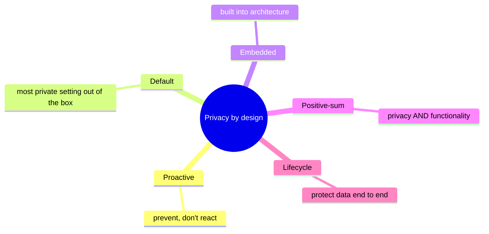
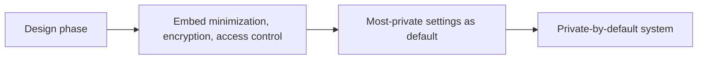
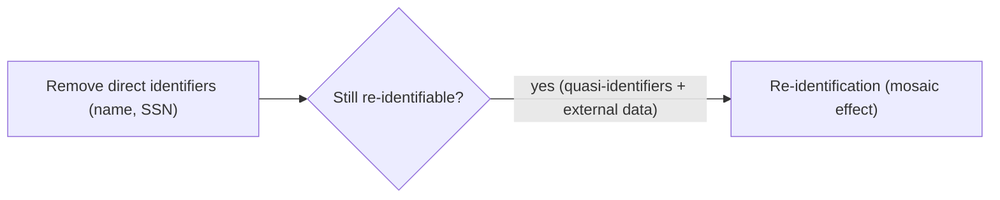
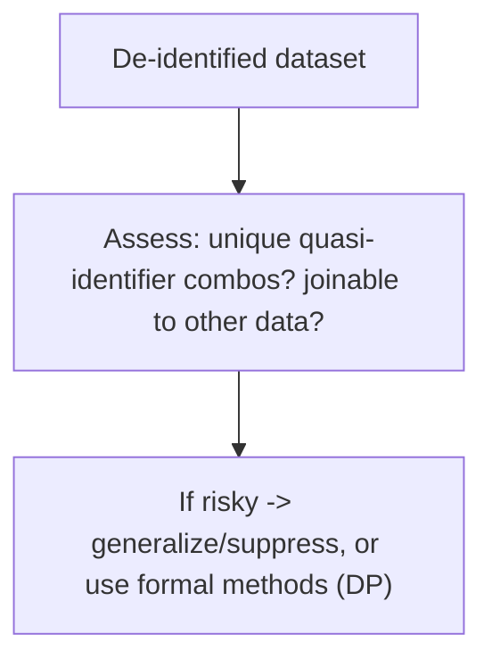
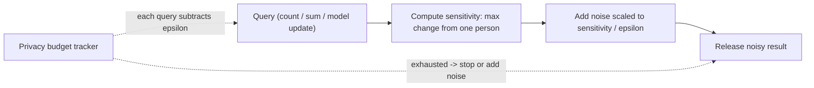
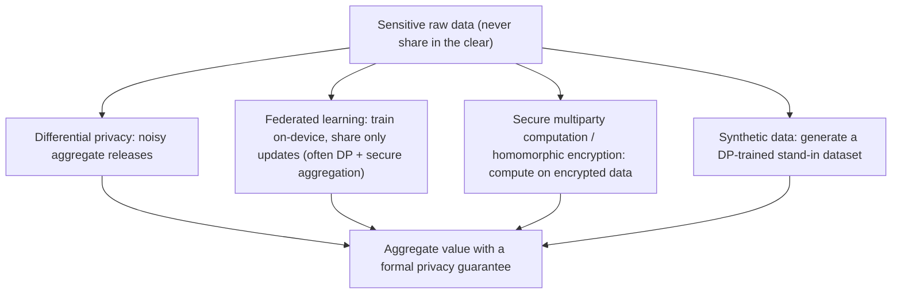

# Privacy Engineering - Complete Professional Guide

> **Category:** 09_security_and_privacy · **Language:** English

---

### Privacy by design, anonymization, and building systems that protect people
**Original guide written from first principles, current to 2026**

> **Original reference book (English).** This is an **independent, originally written** guide. It is not an extract, summary, or paraphrase of any third-party book; it teaches privacy engineering from first principles with original examples. Canonical books are listed under **References** as pointers only. Each chapter follows the TO-BRAIN editorial standard (see `FILE_CONVENTIONS.md`).
>
> **Scope notice:** privacy engineering builds privacy into systems technically, not just via policy. This guide covers privacy by design, the limits of anonymization, and modern techniques (differential privacy), current to 2026.

---

## How to read this guide

| Level | Profile | Parts |
|-------|---------|-------|
| 1 — Beginner | New to privacy eng | Part I |
| 2 — Intermediate | Building private systems | Part II |

**Target audience:** developers, data engineers, and architects who handle personal data.

**Structure of each chapter:** Introduction · Business context · Theoretical concepts · Architecture · Diagrams (Mermaid) · Real examples · Step by step · Complete examples · Exercises · Challenges · Checklist · Best practices · Anti-patterns · Troubleshooting · References.

> **Note on prerequisites.** Assumes the data-protection/GDPR guide.

---

## Table of Contents

**Part I – By design**
1. Privacy by design
2. The limits of anonymization

**Part II – Techniques**
3. Differential privacy and modern approaches

> **Status of this guide:** complete. **Ready:** Part I (Ch. 1–2) and Part II (Ch. 3).

---

## Part I – By design

Privacy can't be bolted on with a policy document; it must be **engineered into** how systems collect, store, and process data. Privacy engineering treats privacy as a technical design property — proactively built in, with the strongest protections as the default. It also requires honesty about a hard truth: "anonymized" data is often re-identifiable.

---

## Chapter 1 — Privacy by design

### 1.1 Introduction

**Privacy by design** means embedding privacy into a system **from the start**, as the default, rather than adding it later. Its tenets: be **proactive** (prevent privacy harms, don't react to them), make privacy the **default setting**, embed it into the design, and keep functionality **positive-sum** (privacy *and* features, not a trade-off). It turns privacy from a compliance checkbox into an architectural principle.

### 1.2 Business context

Retrofitting privacy after a system is built is expensive, incomplete, and often triggered by a complaint or breach. Designing for privacy up front is cheaper, more effective, and increasingly a market and legal expectation (GDPR mandates "data protection by design and by default"). It also builds user trust — a real differentiator. Privacy by design is both risk reduction and a feature users value, not a cost center.

### 1.3 Theoretical concepts: proactive, default, embedded



The practical levers mirror the data-protection principles: **minimize** what you collect, **limit** purposes, **protect** by default (encryption, access control), and **delete** when done. The most private configuration should require no user action — privacy as the default, not an opt-in setting buried in a menu.

### 1.4 Architecture: privacy as a default property



### 1.5 Real example

**Scenario.** A new analytics feature wants to track user behavior.

**Problem.** The default plan collects detailed, identifiable per-user data "for richer insights" — a privacy risk and a liability.

**Solution.** Design for privacy: collect aggregate/pseudonymized data by default; identifiable tracking only with explicit consent for a stated purpose.

**Implementation (private by default).**

```text
Default: aggregate metrics (counts, not identities); pseudonymous ids; short retention
Identifiable tracking: OFF by default, ON only with explicit opt-in consent + purpose
Storage: encrypted; access restricted; retention enforced
=> useful analytics with minimal personal data exposure, privacy as default
```

**Result.** The feature delivers insights while collecting the minimum identifiable data, with privacy as the default state — lower risk, compliant, and trust-building, without sacrificing the analytics goal (positive-sum).

**Future improvements.** Apply differential privacy (Chapter 3) so even aggregates can't leak individuals.

### 1.6 Exercises

1. State the core idea of privacy by design.
2. Why is the "default setting" tenet important?
3. What does "positive-sum" mean here?

### 1.7 Challenges

- **Challenge.** Take a feature that collects personal data. Redesign it to be private by default (minimize, pseudonymize, opt-in for more). Did functionality survive?

### 1.8 Checklist

- [ ] Privacy is designed in from the start.
- [ ] The default is the most private setting.
- [ ] Minimization and protection are embedded.
- [ ] Privacy doesn't require user action to enable.

### 1.9 Best practices

- Make the private option the default.
- Minimize and pseudonymize by default; expand only with consent.
- Embed encryption, access control, and retention from day one.

### 1.10 Anti-patterns

- Privacy as a late add-on or policy-only.
- Most-private settings hidden behind opt-ins.
- Collecting identifiable data by default for vague benefit.

### 1.11 Troubleshooting

| Symptom | Likely cause | Action |
|---------|--------------|--------|
| Costly privacy retrofits | Not designed in | Embed privacy from the start |
| Users exposed by default | Privacy is opt-in | Make private the default |
| Excess identifiable data | No minimization | Collect aggregate/pseudonymous by default |

### 1.12 References

- N. Kamara (and others), *Practical Data Privacy* (O'Reilly, 2023) — ISBN 978-1098129460.
- A. Cavoukian, "Privacy by Design: The 7 Foundational Principles."

---

## Chapter 2 — The limits of anonymization

### 2.1 Introduction

A dangerous myth is that removing names makes data "anonymous" and therefore free to use. In reality, **de-identified data is often re-identifiable** by combining it with other datasets (the **mosaic effect**) or via unique combinations of attributes (**quasi-identifiers** like birth date + ZIP + gender). Understanding this is essential: weak anonymization gives a false sense of safety and has caused real re-identification breaches.

### 2.2 Business context

Organizations routinely share or analyze "anonymized" data assuming it's safe — and have been embarrassed (and penalized) when researchers re-identified individuals from it. Treating de-identification as a guarantee is a liability. Knowing its limits leads to either truly robust techniques (Chapter 3) or treating the data as still-personal (with the protections that implies). This prevents the false-safety failures that turn "anonymized" releases into privacy breaches.

### 2.3 Theoretical concepts: quasi-identifiers and the mosaic effect



**Quasi-identifiers** are attributes that aren't unique alone but become identifying in combination (famously, a large fraction of people are uniquely identified by birth date + ZIP + gender). The **mosaic effect**: joining a de-identified dataset with another (public records, another leak) re-identifies individuals. So "we removed the names" is rarely sufficient — measure re-identification risk, don't assume safety.

### 2.4 Architecture: assess re-identification risk



### 2.5 Real example

**Scenario.** A team plans to release a "de-identified" dataset of user activity with names removed but birth date, ZIP, and gender kept.

**Problem.** Those three fields uniquely identify many individuals; joined with public data, users are re-identifiable — names removed but privacy not protected.

**Solution.** Reduce identifying power (generalize ZIP to region, age to ranges) or use a formal method; assess residual risk before release.

**Implementation (reduce identifiability).**

```text
Before: birthdate=1987-03-12, zip=04567, gender=F   -> often unique
After:  age_band=35-39, region=Southeast, gender=F  -> many people share it
Assess: are any rows still unique on quasi-identifiers? suppress/aggregate those.
Only release once re-identification risk is acceptably low.
```

**Result.** Records no longer single out individuals; the mosaic/quasi-identifier re-identification path is closed. The release protects people instead of giving false assurance from "names removed."

**Future improvements.** For strong guarantees on aggregate releases, apply differential privacy (Chapter 3).

### 2.6 Exercises

1. Why isn't removing names enough to anonymize data?
2. What are quasi-identifiers? Give an example combination.
3. What is the mosaic effect?

### 2.7 Challenges

- **Challenge.** Take a dataset you'd call "anonymized." List its quasi-identifiers. Could rows be unique or joined to external data? Reduce the risk.

### 2.8 Checklist

- [ ] I don't treat name-removal as anonymization.
- [ ] I identify quasi-identifiers and their combined risk.
- [ ] I assess re-identification (uniqueness, joinability).
- [ ] Risky data is generalized/suppressed or formally protected.

### 2.9 Best practices

- Measure re-identification risk before sharing data.
- Generalize/suppress identifying attribute combinations.
- Treat weakly de-identified data as still personal.

### 2.10 Anti-patterns

- "We removed names, so it's anonymous."
- Releasing data with intact quasi-identifiers.
- Ignoring joinability with external datasets.

### 2.11 Troubleshooting

| Symptom | Likely cause | Action |
|---------|--------------|--------|
| "Anonymized" data re-identified | Quasi-identifiers/mosaic effect | Generalize/suppress; reassess |
| False sense of safety | Name-removal assumed sufficient | Measure actual re-identification risk |
| Need strong guarantees | Ad-hoc de-identification | Use differential privacy (Ch. 3) |

### 2.12 References

- N. Kamara (and others), *Practical Data Privacy* (O'Reilly, 2023) — ISBN 978-1098129460.
- L. Sweeney, "Simple Demographics Often Identify People Uniquely" (2000).

---

> **End of Part I.** You can now engineer for privacy: build it in by design as the default (proactive, embedded, positive-sum) and minimize identifiable data, while understanding that de-identification is not a guarantee — quasi-identifiers and the mosaic effect make "anonymized" data often re-identifiable, so you must measure and reduce that risk. **Part II — Techniques** (Chapter 3) covers differential privacy — a formal, mathematical guarantee that aggregate data releases don't reveal individuals — and other modern privacy-enhancing technologies. *This guide is informational, not legal advice.*

---

## Part II – Techniques

Part I ended on an uncomfortable truth: de-identification is not a guarantee, because quasi-identifiers and the mosaic effect keep re-identifying "anonymized" data. Part II is the constructive response. Instead of trying to scrub identifiers out of a dataset and hoping, modern privacy-enhancing technologies (PETs) give you *formal* guarantees and architectures where the sensitive data is never centralized in the clear. The flagship is **differential privacy**, which makes a precise mathematical promise about what any release can reveal about an individual; around it sits a toolbox — federated learning, secure computation, synthetic data — for computing on data you never get to see in the raw.

---

## Chapter 3 — Differential privacy and modern approaches

### 3.1 Introduction

**Differential privacy (DP)** is a formal definition of privacy for data releases. Its promise: the result of an analysis should be *essentially the same whether or not any one individual's record is in the dataset*. If a query's output is (almost) indistinguishable with you in versus you out, then the output reveals (almost) nothing about *you* specifically — yet it can still reveal accurate aggregate facts about the population. DP achieves this by adding carefully calibrated random **noise** to results, with the amount governed by a parameter called **epsilon (ε)** that quantifies the privacy loss. Unlike de-identification, DP doesn't depend on assumptions about what an attacker knows or what auxiliary data exists — the guarantee holds regardless. Around DP sit the other modern PETs that let you compute without centralizing raw data.

### 3.2 Business context

Part I showed that the old model — collect everything, strip names, share — fails repeatedly and produces breaches and re-identification scandals. Regulators (GDPR, LGPD, CCPA) and users increasingly demand provable protection, not best-effort scrubbing. The business value of DP and PETs is that they let an organization *extract aggregate value* — statistics, dashboards, trained models — while making a defensible, quantifiable claim about individual privacy. The US Census Bureau adopted differential privacy for the 2020 Census precisely because reconstruction attacks had shown traditional methods leaked individuals. The cost is a managed trade-off: more privacy (smaller ε, more noise) means less accuracy, and that trade-off has to be set deliberately rather than discovered by accident. PETs like federated learning also reduce regulatory and breach exposure by ensuring sensitive raw data never leaves the user's device or the data owner's boundary.

### 3.3 Theoretical concepts: epsilon, noise, and the privacy budget

The core mechanism is **add calibrated noise to a result** so that the contribution of any single individual is masked. The most common is the **Laplace mechanism**: to release a count or sum, add random noise drawn from a Laplace distribution scaled to the query's *sensitivity* (how much one person can change the answer) divided by ε.

- **Epsilon (ε) is the privacy-loss budget.** Smaller ε → more noise → stronger privacy, lower accuracy. Larger ε → less noise → weaker privacy, higher accuracy. ε makes the privacy/utility trade-off an explicit dial, not a vague hope.
- **Composition consumes budget.** Every query against the data leaks a little; DP's composition property says the privacy losses *add up*. So you maintain a **privacy budget** and stop (or add more noise) when repeated queries would exhaust it — otherwise an attacker averages away the noise over many queries.
- **What DP guarantees and what it doesn't.** It bounds what can be learned about *any individual* from the *release*. It does **not** hide aggregate truths about groups, and it is only as good as your accounting — reusing the dataset without tracking the budget breaks the guarantee.
- **Global vs local DP.** In **global** (central) DP, a trusted curator holds raw data and adds noise to outputs. In **local** DP, noise is added *on each user's device* before data is ever sent, so no one ever holds the raw values — stronger trust model, but it needs much more data for the same accuracy.



### 3.4 Architecture: the PET toolbox around DP



The modern PETs share one architectural principle: **don't centralize raw data in the clear.**
- **Federated learning** trains a model across many devices, sending only model updates (not raw data) to the server — typically combined with secure aggregation and DP so individual updates can't be reverse-engineered.
- **Secure multiparty computation (SMC)** and **homomorphic encryption** let parties compute a joint result over inputs that stay encrypted, so no party sees another's raw data.
- **Synthetic data** generates an artificial dataset (ideally from a DP-trained generator) that preserves statistical structure for analysis without containing any real individual's record.

These compose: federated learning with DP and secure aggregation is a common production stack. The right choice depends on the trust model — who you're willing to trust with what — and the accuracy you need.

### 3.5 Real example

**Scenario.** A company wants to publish a public dashboard of "how many users in each city use feature X," and to share a usage dataset with an analytics partner.

**Problem.** Part I's lesson applies: raw counts (especially for small cities) plus the partner's auxiliary data can re-identify individuals (a city with three users of a rare feature effectively names them), and de-identifying the shared dataset won't reliably prevent the mosaic effect.

**Solution.** Use differential privacy for the published counts (with a tracked budget) and a DP-trained synthetic dataset for the partner — so both releases carry a formal guarantee instead of a hope.

**Implementation (DP counts + privacy budget).**

```python
import numpy as np

def dp_count(true_count: int, epsilon: float) -> float:
    # Counting query: one person changes the count by at most 1 -> sensitivity = 1
    sensitivity = 1.0
    noise = np.random.laplace(loc=0.0, scale=sensitivity / epsilon)
    return true_count + noise

# Privacy budget: total epsilon we are willing to "spend" on this data
TOTAL_EPSILON = 1.0
spent = 0.0
per_city_epsilon = 0.1            # each city's count costs 0.1 of the budget

for city, true_count in city_counts.items():
    if spent + per_city_epsilon > TOTAL_EPSILON:
        break                     # budget exhausted: stop releasing (composition!)
    published[city] = max(0, round(dp_count(true_count, per_city_epsilon)))
    spent += per_city_epsilon     # composition: privacy losses ADD UP

# For the partner: ship a DP-trained synthetic dataset, not real rows.
```

**Result.** The published per-city numbers are close to the truth for large cities and noticeably noisy for tiny ones — exactly where individual exposure was the risk — and the release carries a quantified ε guarantee: an observer (even with side data) learns essentially nothing about whether any specific person uses feature X. The budget tracker prevents an attacker from averaging away the noise across many queries. The partner gets statistically useful data with no real individual's record in it.

**Future improvements.** Move to local DP for the most sensitive signals so raw values never reach the server; adopt federated learning with secure aggregation for any on-device model training; use a vetted DP library rather than hand-rolled noise; have the ε choice reviewed (and documented) as a deliberate privacy/utility decision.

### 3.6 Exercises

1. State the differential-privacy guarantee in one sentence (the "in vs. out" intuition).
2. What does epsilon control, and what is the trade-off as it shrinks?
3. Why must you track a privacy budget across multiple queries (composition)?
4. Contrast global and local differential privacy by trust model.

### 3.7 Challenges

- **Challenge.** Take an aggregate metric you publish (a count or average). Estimate its sensitivity (how much one individual can change it), add Laplace noise for ε = 1.0 and ε = 0.1, and compare the noisy results to the true value. Decide which ε you could defend and why, and state how many such releases your budget allows.

### 3.8 Checklist

- [ ] Aggregate releases use a formal mechanism (DP), not just de-identification.
- [ ] Epsilon is chosen deliberately as a documented privacy/utility decision.
- [ ] A privacy budget is tracked; composition across queries is accounted for.
- [ ] Query sensitivity is computed correctly before adding noise.
- [ ] Raw sensitive data is not centralized in the clear where a PET (federated learning, SMC, synthetic data) could avoid it.
- [ ] Vetted DP/PET libraries are used instead of hand-rolled implementations.

### 3.9 Best practices

- Prefer formal guarantees (DP) over heuristic de-identification for any data release.
- Treat epsilon as an explicit dial and record the chosen value and rationale.
- Maintain and enforce a privacy budget; stop or add noise when it's exhausted.
- Keep raw data decentralized: federated learning, secure aggregation, encrypted computation, or synthetic stand-ins.
- Use audited libraries; have privacy-critical parameters reviewed.

### 3.10 Anti-patterns

- Publishing exact counts/averages for small groups (re-identification by side data).
- Choosing epsilon implicitly or letting it drift large "for accuracy."
- Ignoring composition — answering unlimited queries against the same data.
- Hand-rolling noise mechanisms with the wrong sensitivity.
- Centralizing raw data when a PET could keep it on-device or encrypted.

### 3.11 Troubleshooting

| Symptom | Likely cause | Action |
|---------|--------------|--------|
| "Anonymized" release re-identified | Heuristic de-id, no formal guarantee | Use differential privacy with a tracked budget |
| Noisy results still leak individuals | Budget not tracked across queries | Enforce composition; stop at the budget limit |
| DP numbers wildly inaccurate | Epsilon too small or sensitivity wrong | Recompute sensitivity; tune ε as a deliberate trade-off |
| Need to compute across parties' data | Raw data centralized | Use SMC / homomorphic encryption / federated learning |
| Model updates leak training data | No DP / secure aggregation in FL | Add DP noise + secure aggregation to updates |

### 3.12 References

- N. Kamara et al., *Practical Data Privacy* (O'Reilly, 2023), **Ch. 2–3 "Differential Privacy"** (defining DP, epsilon/privacy loss, the Laplace mechanism, privacy budgets and composition, global vs local DP, the US Census use) and **Ch. 6 "Federated Learning and Data Science"** — ISBN 978-1098129460.
- M. Dennedy, J. Fox, T. Finneran, *The Privacy Engineer's Manifesto* (Apress, 2014) — engineering privacy controls into systems and data lifecycles.
- W. Hartzog, *Privacy's Blueprint* (Harvard University Press, 2018) — designing technologies so privacy protection is the default, not an afterthought.
- C. Dwork, A. Roth, "The Algorithmic Foundations of Differential Privacy" (2014) — the formal foundations.

---

> **End of Part II — end of guide.** You can now go beyond best-effort de-identification to formal, defensible privacy: differential privacy gives a mathematical guarantee — calibrated noise governed by an explicit epsilon, with a tracked budget so composition can't undo it — that a release reveals essentially nothing about any individual while preserving aggregate value. Around it, the PET toolbox (federated learning, secure computation, synthetic data) lets you compute on data you never hold in the clear. Combined with Part I's privacy-by-design and the limits of anonymization, you can build systems that extract value from data while making a provable promise to the people in it. *This guide is informational, not legal advice.*
