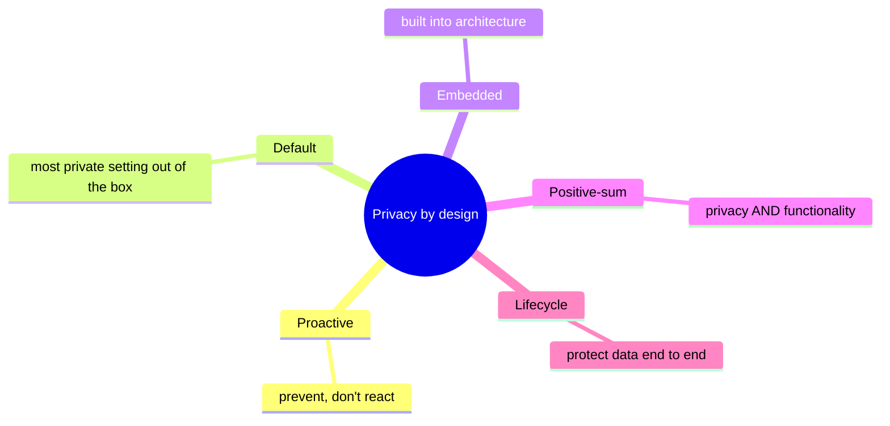
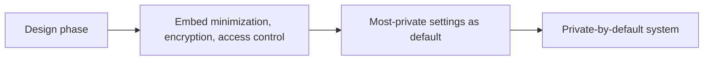
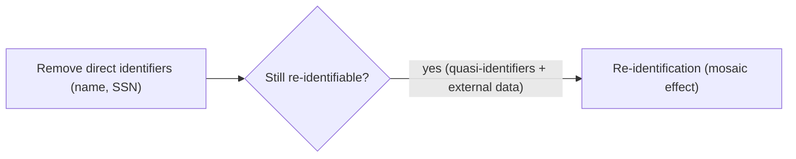
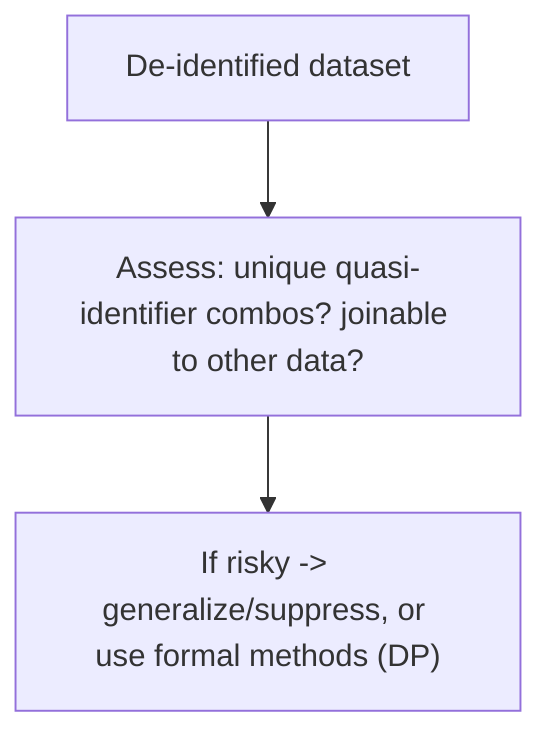

# Privacy Engineering - Complete Professional Guide

> **Category:** 09_security_and_privacy · **Language:** English

---

### Privacy by design, anonymization, and building systems that protect people
**Original guide written from first principles, current to 2026**

> **Original reference book (English).** This is an **independent, originally written** guide. It is not an extract, summary, or paraphrase of any third-party book; it teaches privacy engineering from first principles with original examples. Canonical books are listed under **References** as pointers only. Each chapter follows the TO-BRAIN editorial standard (see `FILE_CONVENTIONS.md`).
>
> **Scope notice:** privacy engineering builds privacy into systems technically, not just via policy. This guide covers privacy by design, the limits of anonymization, and modern techniques (differential privacy), current to 2026.

---

## How to read this guide

| Level | Profile | Parts |
|-------|---------|-------|
| 1 — Beginner | New to privacy eng | Part I |
| 2 — Intermediate | Building private systems | Part II |

**Target audience:** developers, data engineers, and architects who handle personal data.

**Structure of each chapter:** Introduction · Business context · Theoretical concepts · Architecture · Diagrams (Mermaid) · Real examples · Step by step · Complete examples · Exercises · Challenges · Checklist · Best practices · Anti-patterns · Troubleshooting · References.

> **Note on prerequisites.** Assumes the data-protection/GDPR guide.

---

## Table of Contents

**Part I – By design**
1. Privacy by design
2. The limits of anonymization

**Part II – Techniques**
3. Differential privacy and modern approaches

> **Status of this guide:** phased delivery. **Ready:** Part I (Ch. 1–2). **In progress:** Part II.

---

## Part I – By design

Privacy can't be bolted on with a policy document; it must be **engineered into** how systems collect, store, and process data. Privacy engineering treats privacy as a technical design property — proactively built in, with the strongest protections as the default. It also requires honesty about a hard truth: "anonymized" data is often re-identifiable.

---

## Chapter 1 — Privacy by design

### 1.1 Introduction

**Privacy by design** means embedding privacy into a system **from the start**, as the default, rather than adding it later. Its tenets: be **proactive** (prevent privacy harms, don't react to them), make privacy the **default setting**, embed it into the design, and keep functionality **positive-sum** (privacy *and* features, not a trade-off). It turns privacy from a compliance checkbox into an architectural principle.

### 1.2 Business context

Retrofitting privacy after a system is built is expensive, incomplete, and often triggered by a complaint or breach. Designing for privacy up front is cheaper, more effective, and increasingly a market and legal expectation (GDPR mandates "data protection by design and by default"). It also builds user trust — a real differentiator. Privacy by design is both risk reduction and a feature users value, not a cost center.

### 1.3 Theoretical concepts: proactive, default, embedded



The practical levers mirror the data-protection principles: **minimize** what you collect, **limit** purposes, **protect** by default (encryption, access control), and **delete** when done. The most private configuration should require no user action — privacy as the default, not an opt-in setting buried in a menu.

### 1.4 Architecture: privacy as a default property



### 1.5 Real example

**Scenario.** A new analytics feature wants to track user behavior.

**Problem.** The default plan collects detailed, identifiable per-user data "for richer insights" — a privacy risk and a liability.

**Solution.** Design for privacy: collect aggregate/pseudonymized data by default; identifiable tracking only with explicit consent for a stated purpose.

**Implementation (private by default).**

```text
Default: aggregate metrics (counts, not identities); pseudonymous ids; short retention
Identifiable tracking: OFF by default, ON only with explicit opt-in consent + purpose
Storage: encrypted; access restricted; retention enforced
=> useful analytics with minimal personal data exposure, privacy as default
```

**Result.** The feature delivers insights while collecting the minimum identifiable data, with privacy as the default state — lower risk, compliant, and trust-building, without sacrificing the analytics goal (positive-sum).

**Future improvements.** Apply differential privacy (Chapter 3) so even aggregates can't leak individuals.

### 1.6 Exercises

1. State the core idea of privacy by design.
2. Why is the "default setting" tenet important?
3. What does "positive-sum" mean here?

### 1.7 Challenges

- **Challenge.** Take a feature that collects personal data. Redesign it to be private by default (minimize, pseudonymize, opt-in for more). Did functionality survive?

### 1.8 Checklist

- [ ] Privacy is designed in from the start.
- [ ] The default is the most private setting.
- [ ] Minimization and protection are embedded.
- [ ] Privacy doesn't require user action to enable.

### 1.9 Best practices

- Make the private option the default.
- Minimize and pseudonymize by default; expand only with consent.
- Embed encryption, access control, and retention from day one.

### 1.10 Anti-patterns

- Privacy as a late add-on or policy-only.
- Most-private settings hidden behind opt-ins.
- Collecting identifiable data by default for vague benefit.

### 1.11 Troubleshooting

| Symptom | Likely cause | Action |
|---------|--------------|--------|
| Costly privacy retrofits | Not designed in | Embed privacy from the start |
| Users exposed by default | Privacy is opt-in | Make private the default |
| Excess identifiable data | No minimization | Collect aggregate/pseudonymous by default |

### 1.12 References

- N. Kamara (and others), *Practical Data Privacy* (O'Reilly, 2023) — ISBN 978-1098129460.
- A. Cavoukian, "Privacy by Design: The 7 Foundational Principles."

---

## Chapter 2 — The limits of anonymization

### 2.1 Introduction

A dangerous myth is that removing names makes data "anonymous" and therefore free to use. In reality, **de-identified data is often re-identifiable** by combining it with other datasets (the **mosaic effect**) or via unique combinations of attributes (**quasi-identifiers** like birth date + ZIP + gender). Understanding this is essential: weak anonymization gives a false sense of safety and has caused real re-identification breaches.

### 2.2 Business context

Organizations routinely share or analyze "anonymized" data assuming it's safe — and have been embarrassed (and penalized) when researchers re-identified individuals from it. Treating de-identification as a guarantee is a liability. Knowing its limits leads to either truly robust techniques (Chapter 3) or treating the data as still-personal (with the protections that implies). This prevents the false-safety failures that turn "anonymized" releases into privacy breaches.

### 2.3 Theoretical concepts: quasi-identifiers and the mosaic effect



**Quasi-identifiers** are attributes that aren't unique alone but become identifying in combination (famously, a large fraction of people are uniquely identified by birth date + ZIP + gender). The **mosaic effect**: joining a de-identified dataset with another (public records, another leak) re-identifies individuals. So "we removed the names" is rarely sufficient — measure re-identification risk, don't assume safety.

### 2.4 Architecture: assess re-identification risk



### 2.5 Real example

**Scenario.** A team plans to release a "de-identified" dataset of user activity with names removed but birth date, ZIP, and gender kept.

**Problem.** Those three fields uniquely identify many individuals; joined with public data, users are re-identifiable — names removed but privacy not protected.

**Solution.** Reduce identifying power (generalize ZIP to region, age to ranges) or use a formal method; assess residual risk before release.

**Implementation (reduce identifiability).**

```text
Before: birthdate=1987-03-12, zip=04567, gender=F   -> often unique
After:  age_band=35-39, region=Southeast, gender=F  -> many people share it
Assess: are any rows still unique on quasi-identifiers? suppress/aggregate those.
Only release once re-identification risk is acceptably low.
```

**Result.** Records no longer single out individuals; the mosaic/quasi-identifier re-identification path is closed. The release protects people instead of giving false assurance from "names removed."

**Future improvements.** For strong guarantees on aggregate releases, apply differential privacy (Chapter 3).

### 2.6 Exercises

1. Why isn't removing names enough to anonymize data?
2. What are quasi-identifiers? Give an example combination.
3. What is the mosaic effect?

### 2.7 Challenges

- **Challenge.** Take a dataset you'd call "anonymized." List its quasi-identifiers. Could rows be unique or joined to external data? Reduce the risk.

### 2.8 Checklist

- [ ] I don't treat name-removal as anonymization.
- [ ] I identify quasi-identifiers and their combined risk.
- [ ] I assess re-identification (uniqueness, joinability).
- [ ] Risky data is generalized/suppressed or formally protected.

### 2.9 Best practices

- Measure re-identification risk before sharing data.
- Generalize/suppress identifying attribute combinations.
- Treat weakly de-identified data as still personal.

### 2.10 Anti-patterns

- "We removed names, so it's anonymous."
- Releasing data with intact quasi-identifiers.
- Ignoring joinability with external datasets.

### 2.11 Troubleshooting

| Symptom | Likely cause | Action |
|---------|--------------|--------|
| "Anonymized" data re-identified | Quasi-identifiers/mosaic effect | Generalize/suppress; reassess |
| False sense of safety | Name-removal assumed sufficient | Measure actual re-identification risk |
| Need strong guarantees | Ad-hoc de-identification | Use differential privacy (Ch. 3) |

### 2.12 References

- N. Kamara (and others), *Practical Data Privacy* (O'Reilly, 2023) — ISBN 978-1098129460.
- L. Sweeney, "Simple Demographics Often Identify People Uniquely" (2000).

---

> **End of Part I.** You can now engineer for privacy: build it in by design as the default (proactive, embedded, positive-sum) and minimize identifiable data, while understanding that de-identification is not a guarantee — quasi-identifiers and the mosaic effect make "anonymized" data often re-identifiable, so you must measure and reduce that risk. **Part II — Techniques** (Chapter 3) covers differential privacy — a formal, mathematical guarantee that aggregate data releases don't reveal individuals — and other modern privacy-enhancing technologies. *This guide is informational, not legal advice.*

<!--APPEND-PART-II-->
