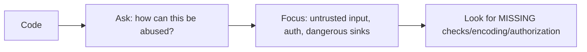
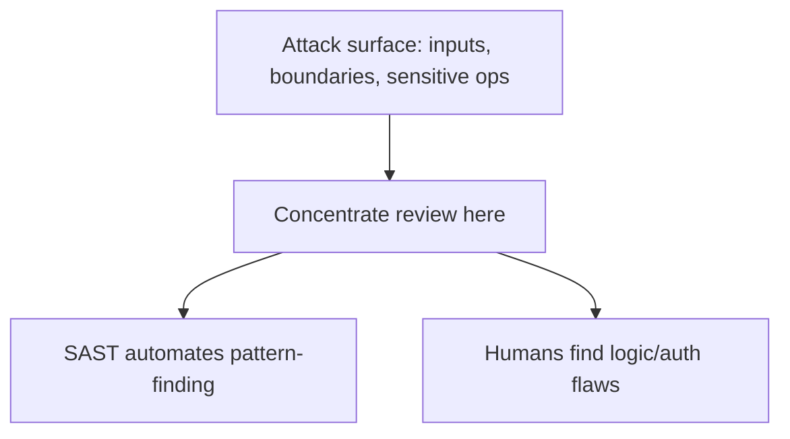
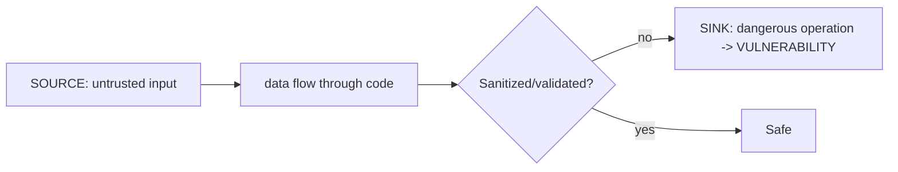
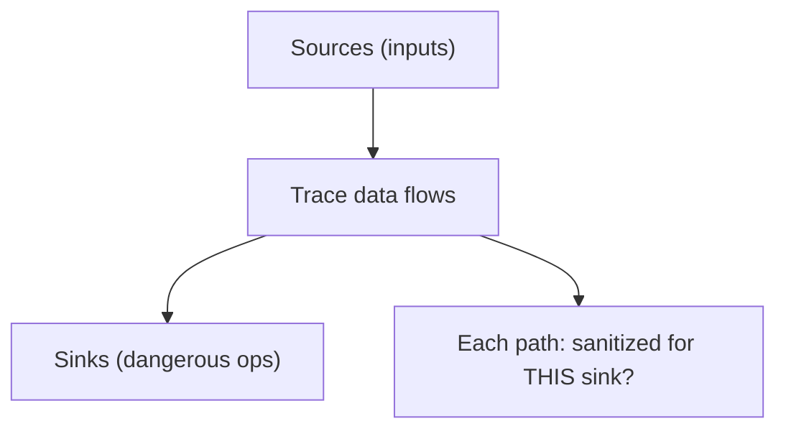
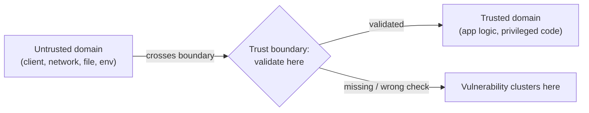
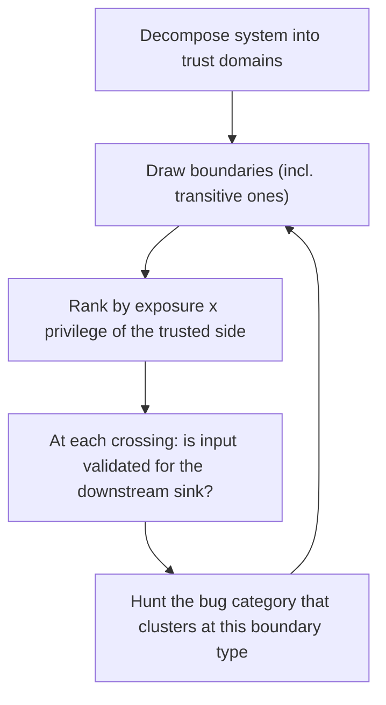

# Secure Code Review - Complete Professional Guide

> **Category:** 09_security_and_privacy · **Language:** English

---

### Auditing code for vulnerabilities with taint analysis
**Original guide written from first principles, current to 2026**

> **Original reference book (English).** This is an **independent, originally written** guide. It is not an extract, summary, or paraphrase of any third-party book; it teaches secure code review from first principles with original examples. Canonical books are listed under **References** as pointers only. Each chapter follows the TO-BRAIN editorial standard (see `FILE_CONVENTIONS.md`).
>
> **Scope notice:** secure code review finds vulnerabilities by reading code systematically, especially by tracing how untrusted data flows to dangerous operations. This guide covers the auditing mindset and taint analysis (source → sink), current to 2026 (SAST tooling).

---

## How to read this guide

| Level | Profile | Parts |
|-------|---------|-------|
| 1 — Beginner | New to code auditing | Part I |
| 2 — Intermediate | Reviewing for security | Part II |

**Target audience:** developers and security engineers reviewing code for vulnerabilities.

**Structure of each chapter:** Introduction · Business context · Theoretical concepts · Architecture · Diagrams (Mermaid) · Real examples · Step by step · Complete examples · Exercises · Challenges · Checklist · Best practices · Anti-patterns · Troubleshooting · References.

> **Note on prerequisites.** Assumes the web-security and threat-modeling guides.

---

## Table of Contents

**Part I – Method**
1. The auditing mindset
2. Taint analysis: tracing source to sink

**Part II – Coverage**
3. Trust boundaries and where bugs cluster

> **Status of this guide:** complete. **Ready:** Part I (Ch. 1–2) and Part II (Ch. 3).

---

## Part I – Method

Reviewing code for security is different from reviewing for correctness: you read **adversarially**, asking "how could an attacker abuse this?" rather than "does it do what's intended?" The most productive technique is **taint analysis** — following untrusted input from where it enters (a **source**) to where it could cause harm (a **sink**) — because that path is where vulnerabilities live.

---

## Chapter 1 — The auditing mindset

### 1.1 Introduction

Security code review requires an **adversarial mindset**: assume inputs are hostile, look for what the code *fails* to defend against, and focus on the highest-risk areas rather than reading everything uniformly. You're hunting for the assumptions the developer made that an attacker can violate — unchecked input, missing authorization, unsafe operations on untrusted data.

### 1.2 Business context

Vulnerabilities found in review are far cheaper than those found by attackers. But reviewing all code equally is inefficient; a focused, risk-driven audit (input handling, auth, sensitive operations) finds the serious bugs fast. Skilled secure review — and the SAST tools that automate parts of it — is a high-leverage defense, catching whole vulnerability classes before release. The business value is fewer breaches at a fraction of the post-incident cost.

### 1.3 Theoretical concepts: read for what's missing



Prioritize by risk: input parsing, authentication/authorization, cryptography, file/command/DB operations, and anything crossing a trust boundary. The bug is usually an **absence** — a validation not done, an authorization not checked, encoding not applied. Combine manual review (judgment, business logic) with **SAST** tools (scale, known patterns); each catches what the other misses.

### 1.4 Architecture: risk-driven attention



### 1.5 Real example

**Scenario.** Reviewing an endpoint that returns a user's document by id.

**Problem.** A correctness review confirms it returns the right document; a security review asks "can I read *someone else's*?"

**Solution.** Adversarial reading reveals a missing authorization check (an IDOR / broken access control bug).

**Implementation (what the audit finds).**

```java
// Correctness: returns the document for the given id -> "works"
Document get(long id) { return repo.findById(id); }   // BUG: no ownership check!

// Secure review asks: is the caller allowed THIS id?
Document get(long id, User caller) {
    Document d = repo.findById(id);
    if (!d.ownerId().equals(caller.id())) throw new ForbiddenException(); // missing check
    return d;
}
```

**Result.** The audit catches that any user could fetch any document by guessing ids (a classic broken-access-control flaw) — invisible to a correctness review but obvious to an adversarial one. The fix is the missing authorization check.

**Future improvements.** Add an authorization test asserting cross-user access is denied; apply the check pattern across all id-based endpoints.

### 1.6 Exercises

1. How does security review differ from correctness review?
2. Why is a vulnerability usually an "absence"?
3. Where should review attention concentrate?

### 1.7 Challenges

- **Challenge.** Take an endpoint that fetches a resource by id. Review it adversarially: can a user access another's resource? If the ownership check is missing, that's the bug.

### 1.8 Checklist

- [ ] I read adversarially ("how can this be abused?").
- [ ] I focus on input, auth, and sensitive operations.
- [ ] I look for missing checks/encoding/authorization.
- [ ] I combine manual review with SAST.

### 1.9 Best practices

- Prioritize high-risk code (boundaries, auth, dangerous sinks).
- Hunt for absent defenses, not just present bugs.
- Pair human judgment with automated SAST.

### 1.10 Anti-patterns

- Reviewing all code uniformly, missing the risky parts.
- Only checking correctness, never abuse cases.
- Relying solely on tools (miss logic/auth flaws) or solely on humans (miss scale).

### 1.11 Troubleshooting

| Symptom | Likely cause | Action |
|---------|--------------|--------|
| Auth bugs slip through | Correctness-only review | Review adversarially for access control |
| Vulnerabilities missed at scale | No SAST | Add automated scanning |
| Tool noise, real bugs missed | Tools only | Add focused human review |

### 1.12 References

- M. Dowd, J. McDonald, J. Schuh, *The Art of Software Security Assessment* (Addison-Wesley, 2006) — ISBN 978-0321444424.
- OWASP, "Code Review Guide": https://owasp.org/www-project-code-review-guide/.

---

## Chapter 2 — Taint analysis: source to sink

### 2.1 Introduction

**Taint analysis** is the core technique of vulnerability hunting: treat data from untrusted **sources** (user input, network, files) as "tainted," and trace whether it can reach a dangerous **sink** (a SQL query, an HTML page, an OS command, a file path) **without being sanitized**. A tainted source reaching a sink unsanitized *is* a vulnerability. Following these flows finds injection, XSS, path traversal, and more.

### 2.2 Business context

Most high-severity web vulnerabilities are a tainted-data-reaches-sink problem (SQL injection, XSS, command injection, SSRF, path traversal). Taint analysis gives reviewers a systematic, repeatable way to find them instead of hoping to spot them. It's also what modern SAST tools automate. Teams that think in source→sink terms catch these classes consistently, dramatically reducing the vulnerabilities that reach production and get exploited.

### 2.3 Theoretical concepts: source → (sanitizer?) → sink



To audit, enumerate **sources** (request params, headers, body, files, env), enumerate **sinks** (DB queries, HTML output, `exec`, file paths, redirects, deserialization), and for each source-to-sink path ask: is the data **sanitized appropriately for that sink** in between? A correct sanitizer for one sink (HTML-encoding) may be wrong for another (SQL) — sanitization must match the sink.

### 2.4 Architecture: trace each path



### 2.5 Real example

**Scenario.** A file-download endpoint takes a filename parameter.

**Problem.** The filename (a tainted source) is used to build a file path (a sink) with no sanitization → **path traversal** (`../../etc/passwd`).

**Solution.** Taint analysis flags the source→sink path; add validation that confines the path to the intended directory.

**Implementation (close the tainted path).**

```java
// VULNERABLE: tainted 'name' flows to a file-path sink unsanitized
File f = new File(baseDir, request.getParameter("name"));  // ../../ -> traversal

// SAFE: validate/canonicalize; confine to baseDir (sanitizer matched to the sink)
Path base = baseDir.toPath().toRealPath();
Path target = base.resolve(name).normalize().toRealPath();
if (!target.startsWith(base)) throw new ForbiddenException();  // reject traversal
```

**Result.** The tainted filename can no longer escape the intended directory; the path-traversal vulnerability on this source→sink path is closed. Systematic taint tracing found it.

**Future improvements.** Map all sources and sinks in the app; let SAST continuously check these flows in CI.

### 2.6 Exercises

1. Define source, sink, and tainted data.
2. Why must a sanitizer match the specific sink?
3. Trace a source→sink path for a vulnerability you know.

### 2.7 Challenges

- **Challenge.** Pick an endpoint. List its sources (inputs) and sinks (dangerous ops). For each source→sink path, check whether the data is sanitized for that sink. Find one gap.

### 2.8 Checklist

- [ ] I enumerate untrusted sources.
- [ ] I enumerate dangerous sinks.
- [ ] I trace each source→sink path for sanitization.
- [ ] Sanitizers match their specific sink.

### 2.9 Best practices

- Think in source→sink flows when auditing.
- Match sanitization to each sink's context.
- Automate taint checks with SAST in CI.

### 2.10 Anti-patterns

- Assuming "we sanitize input" covers all sinks (wrong sanitizer).
- Untracked data flows from input to dangerous operations.
- Relying on one global filter for every sink.

### 2.11 Troubleshooting

| Symptom | Likely cause | Action |
|---------|--------------|--------|
| Injection/traversal bugs | Tainted source reaches sink unsanitized | Trace and sanitize per sink |
| Sanitization didn't help | Wrong sanitizer for the sink | Match sanitizer to the sink context |
| Recurring vuln classes | No systematic taint analysis | Adopt source→sink review + SAST |

### 2.12 References

- M. Dowd, J. McDonald, J. Schuh, *The Art of Software Security Assessment* (Addison-Wesley, 2006) — ISBN 978-0321444424.
- OWASP, "Source and Sink" / SAST guidance: https://owasp.org.

---

> **End of Part I.** You can now review code for security: read adversarially (hunting the missing defense, focused on high-risk areas, combining human judgment with SAST), and apply taint analysis — tracing untrusted data from sources to dangerous sinks and verifying it's sanitized appropriately for each sink along the way. **Part II — Coverage** (Chapter 3) covers using trust boundaries to drive review scope and the categories of bug that cluster at each boundary, so audits are systematic rather than ad hoc.

---

## Part II – Coverage

Part I gave you the *technique* — adversarial reading and taint tracing. Part II gives you the *map*: where to point that technique so a finite review covers the code that actually matters. The organizing idea is the **trust boundary**. Bugs are not scattered uniformly through a codebase; they concentrate where data and control cross from a less-trusted region to a more-trusted one, because that crossing is exactly where someone must validate, and "must validate" is exactly where someone forgets. Find the boundaries and you have found where the bugs cluster.

---

## Chapter 3 — Trust boundaries and where bugs cluster

### 3.1 Introduction

A **trust relationship** is the degree of trust one component places in another; a **trust boundary** is the line between two regions that trust each other differently — a **trust domain** on each side. Data crossing a boundary moves from a region where it was untrusted to one where downstream code assumes it is safe. That assumption is the vulnerability waiting to happen: the boundary is precisely the place where validation is *required*, and therefore precisely the place where a missing or wrong validation becomes a bug. Reviewing by trust boundary turns an open-ended "read all the code" into a targeted "examine every crossing" — systematic coverage instead of ad-hoc spelunking.

### 3.2 Business context

A large codebase cannot be reviewed line-by-line with equal attention in any realistic budget — that is the central practical problem of security assessment. Spreading effort evenly wastes most of it on code that never touches attacker-controlled data, while the few dangerous crossings get the same shallow glance as everything else. Trust boundaries solve the allocation problem: they are a small, enumerable set of places that concentrate risk, so a review scoped to them gets disproportionate return. They also expose the boundaries nobody *designed* — the transitive ones, where your component trusts a library that trusts a network that trusts user input — which are where the subtle, expensive vulnerabilities live. The business value is coverage you can defend: "we reviewed every point where untrusted data enters a trusted domain," rather than "we read a lot of the code and hoped."

### 3.3 Theoretical concepts: domains, boundaries, and transitive trust

Every system decomposes into **trust domains** (regions of shared trust) separated by **trust boundaries** (module edges where trust changes). At each boundary, the more-trusted side must treat input from the less-trusted side as hostile until validated. Three properties make boundaries the natural unit of review:

- **Validation is the boundary's job.** Inside a domain, code reasonably assumes its peers are well-behaved; at the boundary, that assumption is unearned, so the validation must live there. A missing check *inside* a domain is usually benign; a missing check *at* a boundary is usually a vulnerability.
- **Trust is transitive.** If A trusts B and B trusts C, then A implicitly trusts C — a **chain of trust**. The dangerous boundaries are often the ones no one drew: your app trusts a parser, the parser trusts a file, the file came from an attacker. Auditors must follow trust across components, not stop at the first hop.
- **Bugs cluster by category at each kind of boundary.** Network/parser boundaries cluster memory-corruption and malformed-input bugs; process/privilege boundaries cluster privilege-escalation and TOCTOU bugs; the app↔datastore boundary clusters injection; the app↔client boundary clusters access-control and authentication bugs. Knowing the boundary type predicts the bug type to hunt.



### 3.4 Architecture: enumerate boundaries, then audit each crossing



Scope follows **exposure**: a boundary reachable by a remote, unauthenticated attacker that crosses into highly privileged code is the top priority; an internal boundary between two equally trusted modules is low. Review each crossing by connecting Part I's taint analysis to the boundary — the *source* is the untrusted side, the *sink* is whatever the trusted side does with the data, and the question is whether validation appropriate to that sink happens *at the crossing*.

### 3.5 Real example

**Scenario.** A document-processing service accepts uploaded files, hands them to an in-house parser, and stores extracted metadata in a database. The team plans to "review the whole service."

**Problem.** An undifferentiated read of tens of thousands of lines will exhaust the budget on glue code and miss the dangerous crossings. Worse, the most exposed boundary is *transitive and undrawn*: the HTTP handler trusts the parser, the parser trusts the raw uploaded bytes — so attacker-controlled file content reaches memory-handling code three hops away from any visible "input" check.

**Solution.** Decompose into trust domains, draw the boundaries (including the transitive file→parser→storage chain), rank by exposure, and audit each crossing for the bug category it clusters.

**Implementation (boundary-driven review plan).**

```text
Trust domains & boundaries (ranked by exposure x downstream privilege):

  B1  [Internet/client] --upload--> [HTTP handler]      remote, unauth   => HIGH
        sink: file bytes, size, content-type, filename
        hunt: path traversal in filename, size/DoS, content-type spoofing

  B2  [HTTP handler] --raw bytes--> [in-house parser]    TRANSITIVE       => HIGH
        the handler trusts the parser; the parser trusts attacker bytes
        sink: memory handling on malformed input
        hunt: buffer overflow, integer overflow, out-of-bounds (Part II bug classes)

  B3  [parser] --extracted fields--> [database]          app->datastore   => MEDIUM
        sink: SQL/NoSQL query construction
        hunt: injection (is the extracted text parameterized?)

  B4  [worker] --status--> [internal admin UI]            authenticated    => LOW

Review effort: concentrate on B1 + B2; verify validation lives AT each crossing.
```

**Result.** The review covers every point where untrusted data enters a more-trusted domain, in priority order, hunting the specific bug class each boundary attracts. The high-risk transitive boundary B2 — invisible on an org-chart reading of the code — is now explicitly in scope. Coverage is defensible and the budget lands where the bugs cluster, not on inert glue code.

**Future improvements.** Record the boundary map as living documentation so future changes are reviewed against it; add tests/fuzzing at B1–B2 (the malformed-input boundary); re-run the decomposition whenever a new external dependency adds a transitive boundary.

### 3.6 Exercises

1. Define trust domain, trust boundary, and trust relationship.
2. Why do bugs cluster at boundaries rather than inside a trust domain?
3. What is transitive trust, and why does it create the most dangerous boundaries?
4. Match a boundary type to the bug category it tends to cluster (e.g., app↔datastore → ?).

### 3.7 Challenges

- **Challenge.** Take a service you know. Draw its trust domains and every boundary between them, *including* transitive ones introduced by libraries and external systems. Rank the boundaries by exposure × downstream privilege, and for the top one name the bug category you'd hunt and where the validation should live.

### 3.8 Checklist

- [ ] The system is decomposed into trust domains with explicit boundaries.
- [ ] Transitive boundaries (via libraries, files, networks) are drawn, not just the obvious ones.
- [ ] Boundaries are ranked by exposure × privilege of the trusted side.
- [ ] Each crossing is audited for validation appropriate to its downstream sink.
- [ ] The bug category that clusters at each boundary type is specifically hunted.
- [ ] The boundary map is recorded so future changes are reviewed against it.

### 3.9 Best practices

- Scope review by trust boundary, not by file count or even coverage.
- Follow trust across components; never stop at the first hop.
- Connect taint analysis to boundaries: untrusted side = source, trusted side's action = sink.
- Prioritize remote, unauthenticated boundaries into privileged code.
- Predict the bug class from the boundary type and hunt it deliberately.

### 3.10 Anti-patterns

- Reviewing uniformly, giving glue code the same attention as dangerous crossings.
- Treating only the visible "input" layer as a boundary, ignoring transitive trust.
- Assuming a trusted internal component sanitizes input it actually forwards raw.
- Validating deep inside a domain instead of at the crossing where the data arrives.

### 3.11 Troubleshooting

| Symptom | Likely cause | Action |
|---------|--------------|--------|
| Review ran long, found little | Effort spread evenly, not boundary-scoped | Enumerate trust boundaries; audit crossings in priority order |
| Vulnerability found far from any "input" code | Transitive boundary missed | Follow trust across components; draw chains of trust |
| Same bug class keeps slipping through | Boundary type's cluster not hunted | Map boundary type → bug category; hunt it deliberately |
| Validation present but bug remains | Check is in the wrong place | Move validation to the crossing; match it to the sink |

### 3.12 References

- M. Dowd, J. McDonald, J. Schuh, *The Art of Software Security Assessment* (Addison-Wesley, 2006), **Ch. 2 "Design Review"** (trust relationships, trust boundaries, trust domains, the trust model, transitive/chain-of-trust) and **Ch. 1 "Software Vulnerability Fundamentals"** (common threads) — ISBN 978-0321444424.
- M. Dowd et al., *The Art of Software Security Assessment*, **Ch. 3 "Operational Review"** (exposure/attack surface) and **Ch. 4 "Application Review Process"** (code-auditing strategies).
- A. Shostack, *Threat Modeling* (Wiley, 2014) — trust boundaries on data-flow diagrams (cross-reference).

---

> **End of Part II — end of guide.** You can now make a security review systematic: decompose the system into trust domains, draw every boundary between them — including the transitive ones no one designed — rank the crossings by exposure and downstream privilege, and at each crossing apply Part I's adversarial reading and taint analysis to confirm that validation appropriate to the sink lives *at the boundary*. Bugs cluster where trust changes; point your finite review there, hunt the bug class each boundary attracts, and your coverage becomes defensible rather than ad hoc.
