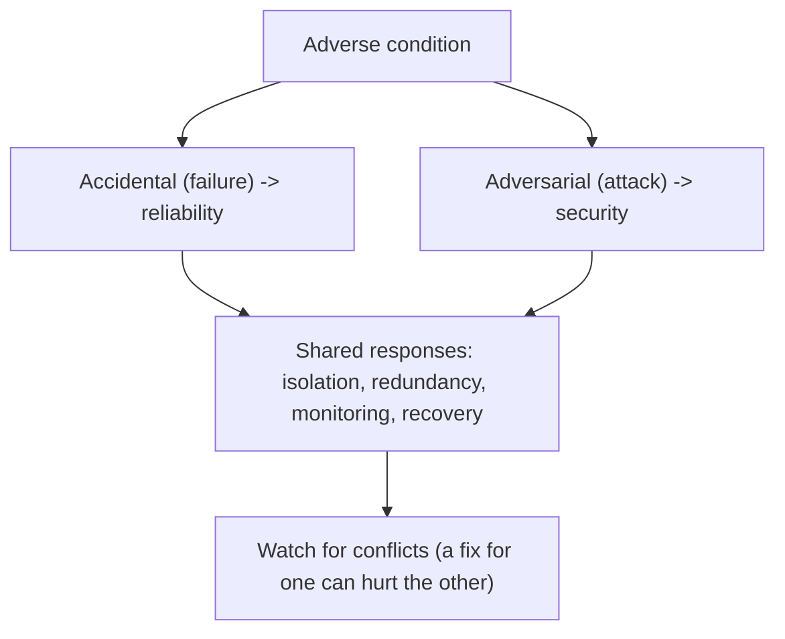
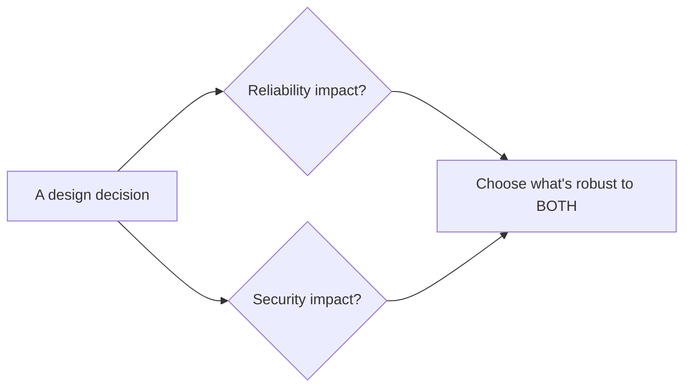
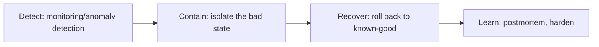
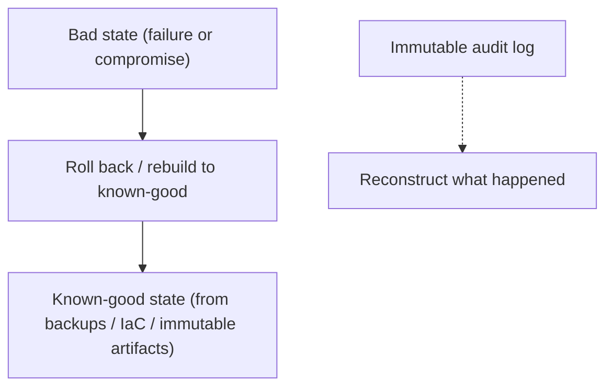

# Secure and Reliable Systems Design - Complete Professional Guide

> **Category:** 09_security_and_privacy · **Language:** English

---

### Designing for security and reliability together across the lifecycle
**Original guide written from first principles, current to 2026**

> **Original reference book (English).** This is an **independent, originally written** guide. It is not an extract, summary, or paraphrase of any third-party book; it teaches secure-and-reliable system design from first principles with original examples. Canonical books are listed under **References** as pointers only. Each chapter follows the TO-BRAIN editorial standard (see `FILE_CONVENTIONS.md`).
>
> **Scope notice:** security and reliability are deeply intertwined — both are about a system behaving correctly under stress, whether accidental (failures) or adversarial (attacks). This guide covers designing for both together, current to 2026.

---

## How to read this guide

| Level | Profile | Parts |
|-------|---------|-------|
| 1 — Beginner | New to the intersection | Part I |
| 2 — Intermediate | Designing systems | Part II |

**Target audience:** architects, SREs, and security engineers building systems that must be both secure and reliable.

**Structure of each chapter:** Introduction · Business context · Theoretical concepts · Architecture · Diagrams (Mermaid) · Real examples · Step by step · Complete examples · Exercises · Challenges · Checklist · Best practices · Anti-patterns · Troubleshooting · References.

> **Note on prerequisites.** Assumes the SRE, threat-modeling, and security-engineering guides.

---

## Table of Contents

**Part I – The intersection**
1. Security and reliability are the same problem
2. Designing for recovery (from failures and attacks)

**Part II – Operating**
3. Least privilege and blast-radius control in practice

> **Status of this guide:** phased delivery. **Ready:** Part I (Ch. 1–2). **In progress:** Part II.

---

## Part I – The intersection

Reliability engineering asks "what if a component fails?"; security asks "what if a component is attacked?" Both are really the same question — "does the system still behave correctly under adverse conditions?" — and many design techniques (redundancy, isolation, recovery) serve both. Treating them together produces systems that are robust against accidents *and* adversaries.

---

## Chapter 1 — Security and reliability are the same problem

### 1.1 Introduction

Security and reliability both concern a system **continuing to do the right thing under stress**. The stressor differs — random failure vs deliberate attack — but the design responses overlap heavily: isolation, redundancy, monitoring, and graceful degradation all help with both. Crucially, the two can also **conflict** (a reliability measure can open a security hole, and vice versa), so they must be designed together, not in separate silos.

### 1.2 Business context

When security and reliability teams work in isolation, they create blind spots and conflicts: a reliability "fix" (an unauthenticated retry endpoint) becomes an attack vector; a security control (aggressive lockout) becomes a denial-of-service. Designing for both together avoids these and reuses effort — one isolation mechanism serves both goals. For a business, this means systems that stay up *and* stay safe, with less duplicated work and fewer self-inflicted vulnerabilities.

### 1.3 Theoretical concepts: shared techniques, possible conflicts



Design responses that serve both: **isolation** (a failure or compromise stays contained), **redundancy** (survive a lost or attacked component), **monitoring** (detect anomalies whether from bugs or attackers), and **graceful degradation**. But check each measure against *both* lenses — e.g. a generous retry helps reliability but can amplify attacks; rate limits help security but must not block legitimate recovery.

### 1.4 Architecture: design with both lenses



### 1.5 Real example

**Scenario.** A service adds automatic retries to improve reliability.

**Problem.** Unbounded, unauthenticated retries (good for reliability) let an attacker amplify load — a denial-of-service vector (bad for security).

**Solution.** Design retries with both lenses: bounded, backoff with jitter, and authenticated/rate-limited so they help reliability without enabling abuse.

**Implementation (both lenses).**

```text
Retry policy designed for reliability AND security:
  - bounded attempts + exponential backoff with jitter (reliability: avoid herds)
  - per-client rate limiting + auth on the endpoint (security: prevent amplification)
  - circuit breaker so a struggling dependency isn't hammered (both)
=> resilient to failures without becoming an attack amplifier
```

**Result.** Retries improve reliability without creating a DoS amplifier; one design satisfies both goals. The conflict that siloed teams would have missed is resolved by considering both lenses together.

**Future improvements.** Add monitoring that distinguishes a legitimate failure spike from an attack pattern.

### 1.6 Exercises

1. Why are security and reliability "the same problem"?
2. Name two techniques that serve both.
3. Give an example where a reliability measure can hurt security.

### 1.7 Challenges

- **Challenge.** Take a reliability mechanism in your system (retries, failover, caching). Examine it through a security lens — does it open any attack vector?

### 1.8 Checklist

- [ ] I consider both failure and attack for adverse conditions.
- [ ] I reuse shared techniques (isolation, redundancy, monitoring).
- [ ] I check each measure against both lenses.
- [ ] Security and reliability are designed together.

### 1.9 Best practices

- Design every robustness measure for failures *and* attacks.
- Reuse isolation/redundancy/monitoring for both goals.
- Review reliability fixes for security side effects (and vice versa).

### 1.10 Anti-patterns

- Security and reliability designed in separate silos.
- Reliability mechanisms that become attack vectors.
- Security controls that cause self-inflicted outages.

### 1.11 Troubleshooting

| Symptom | Likely cause | Action |
|---------|--------------|--------|
| A reliability feature gets abused | No security lens applied | Add auth/limits to robustness mechanisms |
| A security control causes outages | No reliability lens | Tune controls to avoid self-DoS |
| Duplicated effort | Siloed teams | Design for both together |

### 1.12 References

- H. Adkins et al. (Google), *Building Secure and Reliable Systems* (O'Reilly, 2020) — ISBN 978-1492083122; https://sre.google/books/.
- B. Beyer et al., *Site Reliability Engineering* (O'Reilly, 2016) — ISBN 978-1491929124.

---

## Chapter 2 — Designing for recovery

### 2.1 Introduction

You will be compromised or fail eventually — so design for **recovery**, not just prevention. A system that can detect a bad state and return to a known-good one limits the damage of both attacks and failures. This means recoverable, auditable state, the ability to roll back, and rehearsed response procedures. Resilience is the assumption that things *will* go wrong and the plan for when they do.

### 2.2 Business context

Prevention always eventually fails (a new vulnerability, an unforeseen failure). Organizations that invested only in prevention are paralyzed when it's breached. Those that designed for recovery — backups, rollback, incident playbooks, immutable audit logs — limit damage and restore service fast, turning a potential catastrophe into a managed incident. Recovery capability is what bounds the cost of the inevitable bad day.

### 2.3 Theoretical concepts: detect, contain, recover



Recovery requires: the ability to **detect** a bad state (security or reliability anomaly), **contain** it (isolation, kill switches), **recover** to a known-good state (backups, rollback, rebuild from source/IaC), and **learn** (blameless postmortem). Immutable **audit logs** are key — you must be able to reconstruct what happened, and an attacker shouldn't be able to erase the evidence.

### 2.4 Architecture: known-good recovery path



### 2.5 Real example

**Scenario.** A deployment introduces a vulnerability (or a serious bug) that's exploited/triggered in production.

**Problem.** Without a recovery plan, the team scrambles, unsure of the last-good state or how to restore it.

**Solution.** Designed-for-recovery: immutable artifacts and IaC let you redeploy a known-good version fast; audit logs show the blast radius; rotate any exposed secrets.

**Implementation (recovery flow).**

```text
1. Detect: monitoring/alert flags the anomaly
2. Contain: disable the affected feature (kill switch) / isolate the service
3. Recover: redeploy the previous known-good immutable artifact (rollback)
4. Investigate: immutable audit logs -> scope of impact; rotate exposed secrets
5. Learn: blameless postmortem; add a test/control for this failure mode
```

**Result.** The incident is contained and service restored to a known-good state quickly, with a clear record of impact — because recovery was designed in. The bad day is a managed incident, not a catastrophe.

**Future improvements.** Rehearse recovery (game days/chaos drills) so the procedure works under pressure.

### 2.6 Exercises

1. Why design for recovery, not just prevention?
2. What four capabilities does recovery require?
3. Why must audit logs be immutable?

### 2.7 Challenges

- **Challenge.** For a critical service, write its recovery plan: how you'd detect, contain, and roll back to known-good after a compromise or bad deploy. Identify a gap.

### 2.8 Checklist

- [ ] I assume failures/compromise will happen.
- [ ] I can detect, contain, and recover to known-good.
- [ ] Recovery uses backups / IaC / immutable artifacts.
- [ ] Audit logs are immutable and sufficient to investigate.

### 2.9 Best practices

- Build rollback and rebuild-from-source capability.
- Keep immutable, tamper-evident audit logs.
- Rehearse recovery procedures regularly.

### 2.10 Anti-patterns

- Prevention-only posture with no recovery plan.
- Mutable logs an attacker can erase.
- Untested recovery procedures.

### 2.11 Troubleshooting

| Symptom | Likely cause | Action |
|---------|--------------|--------|
| Paralysis after a breach/failure | No recovery design | Build detect/contain/recover capability |
| Can't reconstruct an incident | Insufficient/mutable logs | Keep immutable audit logs |
| Recovery fails under pressure | Never rehearsed | Run recovery game days |

### 2.12 References

- H. Adkins et al. (Google), *Building Secure and Reliable Systems* (O'Reilly, 2020) — ISBN 978-1492083122; https://sre.google/books/.
- NIST, "Computer Security Incident Handling Guide" (SP 800-61).

---

> **End of Part I.** You can now design for security and reliability as one problem — robust behavior under both accidental failure and deliberate attack — reusing shared techniques (isolation, redundancy, monitoring) while watching for conflicts, and you design for recovery (detect, contain, recover to known-good, learn) rather than prevention alone. **Part II — Operating** (Chapter 3) goes deeper on least privilege and blast-radius control in running systems: compartmentalization, credential rotation, and limiting what any compromised component can reach.

<!--APPEND-PART-II-->
