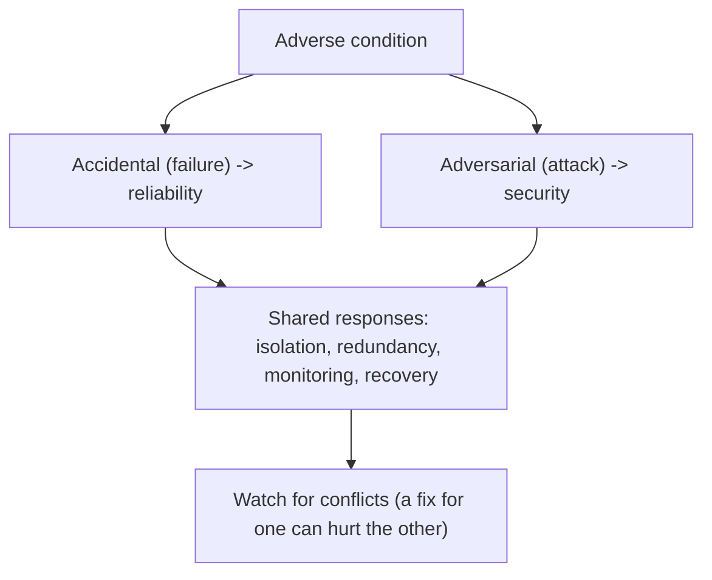
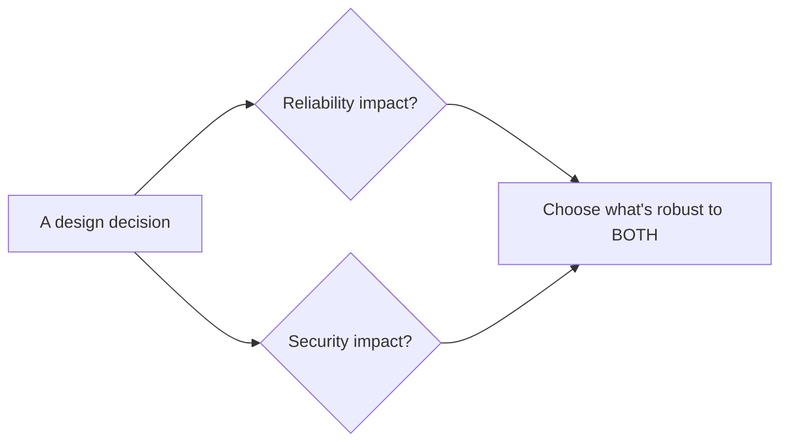
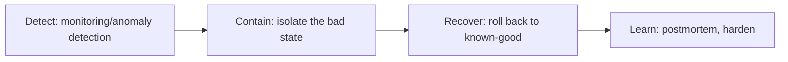
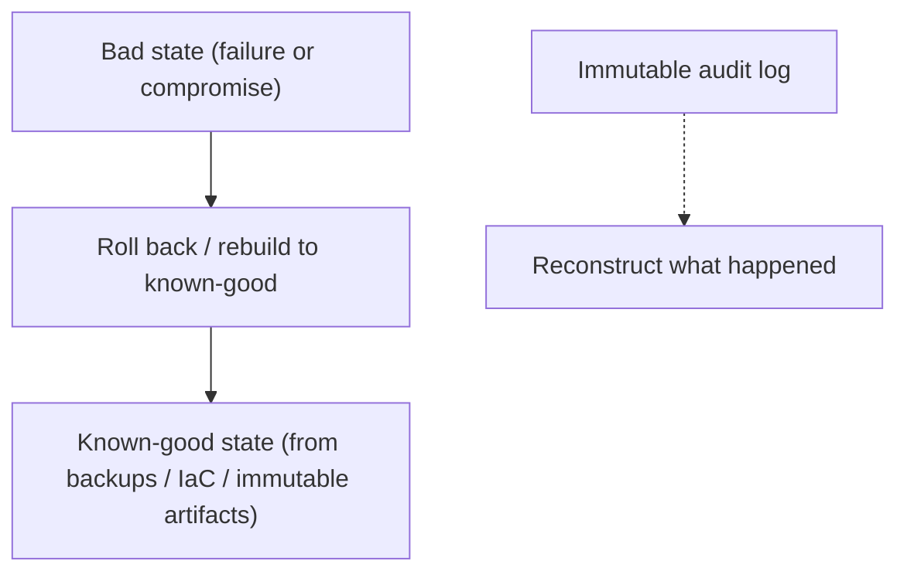
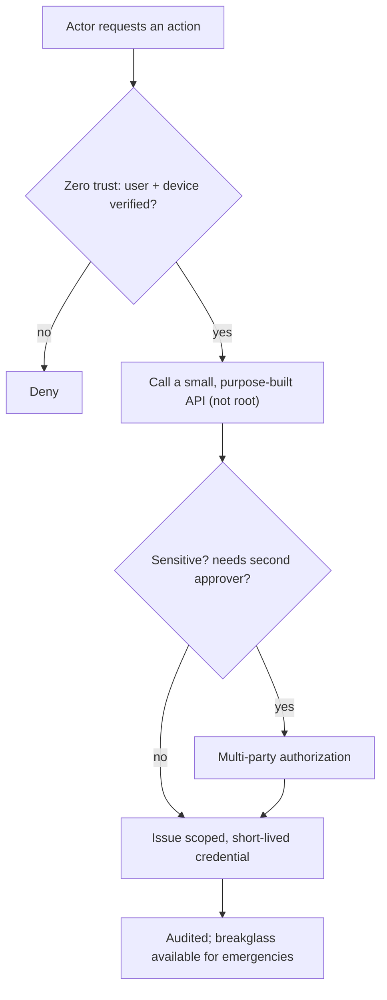
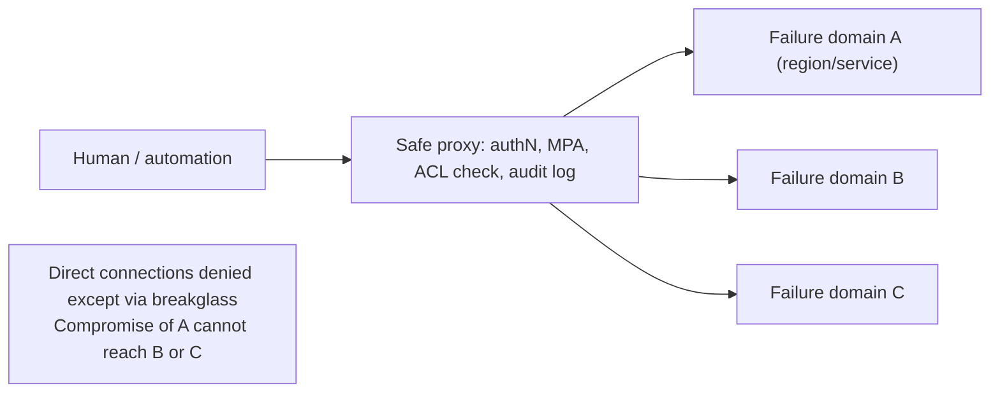

# Secure and Reliable Systems Design - Complete Professional Guide

> **Category:** 09_security_and_privacy · **Language:** English

---

### Designing for security and reliability together across the lifecycle
**Original guide written from first principles, current to 2026**

> **Original reference book (English).** This is an **independent, originally written** guide. It is not an extract, summary, or paraphrase of any third-party book; it teaches secure-and-reliable system design from first principles with original examples. Canonical books are listed under **References** as pointers only. Each chapter follows the TO-BRAIN editorial standard (see `FILE_CONVENTIONS.md`).
>
> **Scope notice:** security and reliability are deeply intertwined — both are about a system behaving correctly under stress, whether accidental (failures) or adversarial (attacks). This guide covers designing for both together, current to 2026.

---

## How to read this guide

| Level | Profile | Parts |
|-------|---------|-------|
| 1 — Beginner | New to the intersection | Part I |
| 2 — Intermediate | Designing systems | Part II |

**Target audience:** architects, SREs, and security engineers building systems that must be both secure and reliable.

**Structure of each chapter:** Introduction · Business context · Theoretical concepts · Architecture · Diagrams (Mermaid) · Real examples · Step by step · Complete examples · Exercises · Challenges · Checklist · Best practices · Anti-patterns · Troubleshooting · References.

> **Note on prerequisites.** Assumes the SRE, threat-modeling, and security-engineering guides.

---

## Table of Contents

**Part I – The intersection**
1. Security and reliability are the same problem
2. Designing for recovery (from failures and attacks)

**Part II – Operating**
3. Least privilege and blast-radius control in practice

> **Status of this guide:** complete. **Ready:** Part I (Ch. 1–2) and Part II (Ch. 3).

---

## Part I – The intersection

Reliability engineering asks "what if a component fails?"; security asks "what if a component is attacked?" Both are really the same question — "does the system still behave correctly under adverse conditions?" — and many design techniques (redundancy, isolation, recovery) serve both. Treating them together produces systems that are robust against accidents *and* adversaries.

---

## Chapter 1 — Security and reliability are the same problem

### 1.1 Introduction

Security and reliability both concern a system **continuing to do the right thing under stress**. The stressor differs — random failure vs deliberate attack — but the design responses overlap heavily: isolation, redundancy, monitoring, and graceful degradation all help with both. Crucially, the two can also **conflict** (a reliability measure can open a security hole, and vice versa), so they must be designed together, not in separate silos.

### 1.2 Business context

When security and reliability teams work in isolation, they create blind spots and conflicts: a reliability "fix" (an unauthenticated retry endpoint) becomes an attack vector; a security control (aggressive lockout) becomes a denial-of-service. Designing for both together avoids these and reuses effort — one isolation mechanism serves both goals. For a business, this means systems that stay up *and* stay safe, with less duplicated work and fewer self-inflicted vulnerabilities.

### 1.3 Theoretical concepts: shared techniques, possible conflicts



Design responses that serve both: **isolation** (a failure or compromise stays contained), **redundancy** (survive a lost or attacked component), **monitoring** (detect anomalies whether from bugs or attackers), and **graceful degradation**. But check each measure against *both* lenses — e.g. a generous retry helps reliability but can amplify attacks; rate limits help security but must not block legitimate recovery.

### 1.4 Architecture: design with both lenses



### 1.5 Real example

**Scenario.** A service adds automatic retries to improve reliability.

**Problem.** Unbounded, unauthenticated retries (good for reliability) let an attacker amplify load — a denial-of-service vector (bad for security).

**Solution.** Design retries with both lenses: bounded, backoff with jitter, and authenticated/rate-limited so they help reliability without enabling abuse.

**Implementation (both lenses).**

```text
Retry policy designed for reliability AND security:
  - bounded attempts + exponential backoff with jitter (reliability: avoid herds)
  - per-client rate limiting + auth on the endpoint (security: prevent amplification)
  - circuit breaker so a struggling dependency isn't hammered (both)
=> resilient to failures without becoming an attack amplifier
```

**Result.** Retries improve reliability without creating a DoS amplifier; one design satisfies both goals. The conflict that siloed teams would have missed is resolved by considering both lenses together.

**Future improvements.** Add monitoring that distinguishes a legitimate failure spike from an attack pattern.

### 1.6 Exercises

1. Why are security and reliability "the same problem"?
2. Name two techniques that serve both.
3. Give an example where a reliability measure can hurt security.

### 1.7 Challenges

- **Challenge.** Take a reliability mechanism in your system (retries, failover, caching). Examine it through a security lens — does it open any attack vector?

### 1.8 Checklist

- [ ] I consider both failure and attack for adverse conditions.
- [ ] I reuse shared techniques (isolation, redundancy, monitoring).
- [ ] I check each measure against both lenses.
- [ ] Security and reliability are designed together.

### 1.9 Best practices

- Design every robustness measure for failures *and* attacks.
- Reuse isolation/redundancy/monitoring for both goals.
- Review reliability fixes for security side effects (and vice versa).

### 1.10 Anti-patterns

- Security and reliability designed in separate silos.
- Reliability mechanisms that become attack vectors.
- Security controls that cause self-inflicted outages.

### 1.11 Troubleshooting

| Symptom | Likely cause | Action |
|---------|--------------|--------|
| A reliability feature gets abused | No security lens applied | Add auth/limits to robustness mechanisms |
| A security control causes outages | No reliability lens | Tune controls to avoid self-DoS |
| Duplicated effort | Siloed teams | Design for both together |

### 1.12 References

- H. Adkins et al. (Google), *Building Secure and Reliable Systems* (O'Reilly, 2020) — ISBN 978-1492083122; https://sre.google/books/.
- B. Beyer et al., *Site Reliability Engineering* (O'Reilly, 2016) — ISBN 978-1491929124.

---

## Chapter 2 — Designing for recovery

### 2.1 Introduction

You will be compromised or fail eventually — so design for **recovery**, not just prevention. A system that can detect a bad state and return to a known-good one limits the damage of both attacks and failures. This means recoverable, auditable state, the ability to roll back, and rehearsed response procedures. Resilience is the assumption that things *will* go wrong and the plan for when they do.

### 2.2 Business context

Prevention always eventually fails (a new vulnerability, an unforeseen failure). Organizations that invested only in prevention are paralyzed when it's breached. Those that designed for recovery — backups, rollback, incident playbooks, immutable audit logs — limit damage and restore service fast, turning a potential catastrophe into a managed incident. Recovery capability is what bounds the cost of the inevitable bad day.

### 2.3 Theoretical concepts: detect, contain, recover



Recovery requires: the ability to **detect** a bad state (security or reliability anomaly), **contain** it (isolation, kill switches), **recover** to a known-good state (backups, rollback, rebuild from source/IaC), and **learn** (blameless postmortem). Immutable **audit logs** are key — you must be able to reconstruct what happened, and an attacker shouldn't be able to erase the evidence.

### 2.4 Architecture: known-good recovery path



### 2.5 Real example

**Scenario.** A deployment introduces a vulnerability (or a serious bug) that's exploited/triggered in production.

**Problem.** Without a recovery plan, the team scrambles, unsure of the last-good state or how to restore it.

**Solution.** Designed-for-recovery: immutable artifacts and IaC let you redeploy a known-good version fast; audit logs show the blast radius; rotate any exposed secrets.

**Implementation (recovery flow).**

```text
1. Detect: monitoring/alert flags the anomaly
2. Contain: disable the affected feature (kill switch) / isolate the service
3. Recover: redeploy the previous known-good immutable artifact (rollback)
4. Investigate: immutable audit logs -> scope of impact; rotate exposed secrets
5. Learn: blameless postmortem; add a test/control for this failure mode
```

**Result.** The incident is contained and service restored to a known-good state quickly, with a clear record of impact — because recovery was designed in. The bad day is a managed incident, not a catastrophe.

**Future improvements.** Rehearse recovery (game days/chaos drills) so the procedure works under pressure.

### 2.6 Exercises

1. Why design for recovery, not just prevention?
2. What four capabilities does recovery require?
3. Why must audit logs be immutable?

### 2.7 Challenges

- **Challenge.** For a critical service, write its recovery plan: how you'd detect, contain, and roll back to known-good after a compromise or bad deploy. Identify a gap.

### 2.8 Checklist

- [ ] I assume failures/compromise will happen.
- [ ] I can detect, contain, and recover to known-good.
- [ ] Recovery uses backups / IaC / immutable artifacts.
- [ ] Audit logs are immutable and sufficient to investigate.

### 2.9 Best practices

- Build rollback and rebuild-from-source capability.
- Keep immutable, tamper-evident audit logs.
- Rehearse recovery procedures regularly.

### 2.10 Anti-patterns

- Prevention-only posture with no recovery plan.
- Mutable logs an attacker can erase.
- Untested recovery procedures.

### 2.11 Troubleshooting

| Symptom | Likely cause | Action |
|---------|--------------|--------|
| Paralysis after a breach/failure | No recovery design | Build detect/contain/recover capability |
| Can't reconstruct an incident | Insufficient/mutable logs | Keep immutable audit logs |
| Recovery fails under pressure | Never rehearsed | Run recovery game days |

### 2.12 References

- H. Adkins et al. (Google), *Building Secure and Reliable Systems* (O'Reilly, 2020) — ISBN 978-1492083122; https://sre.google/books/.
- NIST, "Computer Security Incident Handling Guide" (SP 800-61).

---

> **End of Part I.** You can now design for security and reliability as one problem — robust behavior under both accidental failure and deliberate attack — reusing shared techniques (isolation, redundancy, monitoring) while watching for conflicts, and you design for recovery (detect, contain, recover to known-good, learn) rather than prevention alone. **Part II — Operating** (Chapter 3) goes deeper on least privilege and blast-radius control in running systems: compartmentalization, credential rotation, and limiting what any compromised component can reach.

---

## Part II – Operating

Part I argued that security and reliability are one problem and that you should design for recovery. Part II turns to the *operating* discipline that makes that real in a running system: who and what can do which actions, with how much scope, for how long. The same principle — least privilege — protects against the mistaken insider and the account-takeover attacker at once, because once an attacker holds an employee's credentials, the two are indistinguishable. The companion discipline is **blast-radius control**: structuring the system so that any single compromise — a stolen credential, a bad deploy, a buggy service — can only reach a bounded fraction of it.

---

## Chapter 3 — Least privilege and blast-radius control in practice

### 3.1 Introduction

**Least privilege** means every human, automated task, and machine gets the minimum access needed to do the job *at hand* — minimal in **scope** (which resources, which actions) and in **duration** (only while needed). **Blast-radius control** means designing failure domains so that one compromise can't cascade: a stolen credential scoped to one region can't reach another; a compromised service can call only a handful of narrow APIs, not the whole control plane. The two are the same idea seen from two angles — grant little, and contain what a breach of that little can touch. They defend equally against the well-meaning insider who fat-fingers a command and the attacker who has hijacked that insider's account.

### 3.2 Business context

In most organizations, the access an engineer holds was granted once and never revoked — broad, standing, ambient authority that lets any single compromised account or careless command do enormous damage. That standing access is precisely what an attacker inherits the moment they phish a credential. The cost of *not* applying least privilege is paid twice: in security (one stolen credential = total compromise) and in reliability (one mistaken command = fleet-wide outage). Google's own analysis found a large share of outages were caused by insiders who didn't realize their impact — the same standing privilege that an attacker would abuse. Designing for least privilege at the *start* is cheap; retrofitting it onto a running system whose every tool assumes ambient root is expensive and slow. The business case is that bounded blast radius turns "any mistake or breach can be catastrophic" into "the worst case is contained, observable, and recoverable."

### 3.3 Theoretical concepts: scope, duration, and failure domains

Least privilege is enforced through a handful of concrete mechanisms. **Zero-trust networking**: network location grants no authority — a port in the office is no more trusted than the public internet; access derives from verified user *and* device credentials. **Small functional APIs**: expose narrow, purpose-built operations instead of broad shell/root access, so the granted capability is exactly the task and nothing more. **Multi-party authorization (MPA)**: sensitive actions require a second approver, defeating both a lone malicious insider and a single stolen credential. **Scoped, expiring credentials**: bound to a region/service and short-lived, so a stolen token's reach is small and its window brief. **Breakglass**: an audited, alarmed bypass for emergencies, so least privilege never blocks incident recovery.



Blast radius is then a property of how you **compartmentalize**: distinct failure domains (per region, per service, per data class) with credentials scoped to each, so lateral movement and privilege escalation are structurally limited rather than merely discouraged.

### 3.4 Architecture: the safe proxy and bounded failure domains



Routing privileged actions through a **safe proxy** (Google's "Zero Touch Prod" pattern) gives one central place to enforce multi-party authorization, apply ACLs, and log every command — while denying direct connections to production. Because each target sits in its own failure domain with region- or service-scoped credentials, a compromise of one domain cannot move laterally into the others. The proxy is the choke point where least privilege is enforced and the audit trail is produced; the compartments are what keep the blast radius bounded when a compromise nonetheless happens.

### 3.5 Real example

**Scenario.** An on-call engineer needs to restart a misbehaving service in one region. Today every on-call holds standing SSH-as-root across the entire fleet.

**Problem.** That standing root is a double liability: a fat-fingered command can take down the whole fleet (reliability), and a single phished on-call credential hands an attacker total control (security). The blast radius of any mistake or breach is "everything."

**Solution.** Replace ambient root with least privilege: a small functional API for the specific operation (restart-service), routed through a safe proxy that enforces MPA for risky actions, issues region-scoped short-lived credentials, logs everything, and offers an audited breakglass path for emergencies.

**Implementation (least privilege + bounded blast radius).**

```text
Before:  on-call has standing SSH root on all regions  => blast radius = entire fleet

After:
  - No standing root. Access via safe proxy only (direct prod connections denied).
  - Action exposed as a narrow API:  restartService(region, service)   # not a shell
  - Credentials: scoped to ONE region, expire in 1 hour
  - Risky actions (e.g. delete, drain region): require multi-party approval (MPA)
  - Every call logged to an immutable audit trail
  - Breakglass: alarmed, audited bypass for emergencies only

Result of a phished on-call credential now:
  - usable only via the proxy, only for narrow APIs, only in one region, for <1h
  - destructive actions still blocked without a second approver
  => blast radius = one region, one hour, no destructive ops
```

**Result.** The same credential that previously meant "total compromise" now reaches one region for under an hour and cannot perform destructive actions alone. A mistaken command is contained to one failure domain; a stolen credential is contained the same way. Recovery is unaffected because breakglass remains available, audited, and alarmed.

**Future improvements.** Push more actions behind small functional APIs to shrink the remaining shell access; tighten credential lifetimes; add anomaly detection on proxy logs so an attempted abuse is visible in real time; rehearse breakglass in game days so it works under pressure.

### 3.6 Exercises

1. Define least privilege in terms of both scope and duration.
2. Why does least privilege defend against the mistaken insider and the account-takeover attacker with one mechanism?
3. What does a safe proxy centralize, and why is that valuable?
4. How do scoped, expiring credentials bound the blast radius of a stolen token?

### 3.7 Challenges

- **Challenge.** Pick a role in your system that holds standing, broad access. List the *specific* actions that role actually performs in a typical week. Design a small functional API for the two most common ones, decide which actions warrant multi-party authorization, and state the blast radius before and after.

### 3.8 Checklist

- [ ] No standing ambient authority (no default root/admin); access is granted per task.
- [ ] Access is scoped (resource, action, region/service) and time-bound (expires).
- [ ] Sensitive actions require multi-party authorization.
- [ ] Privileged actions flow through an audited choke point (safe proxy); direct prod access is denied.
- [ ] Failure domains are compartmentalized so one compromise can't move laterally.
- [ ] An alarmed, audited breakglass path exists for emergencies.

### 3.9 Best practices

- Design for least privilege at the start of the lifecycle, not as a retrofit.
- Replace broad shell/root with small, purpose-built APIs.
- Scope credentials to the narrowest region/service and the shortest lifetime that works.
- Route privileged actions through a safe proxy to centralize MPA, ACLs, and audit logging.
- Compartmentalize into failure domains; keep breakglass available, alarmed, and rehearsed.

### 3.10 Anti-patterns

- Standing root / ambient authority "for convenience."
- Network-location trust ("inside the VPN" treated as authorized).
- Long-lived, broadly scoped credentials that an attacker inherits intact.
- A flat blast radius where any compromise reaches the whole fleet.
- Breakglass with no audit or alarm — an unmonitored backdoor.

### 3.11 Troubleshooting

| Symptom | Likely cause | Action |
|---------|--------------|--------|
| One mistake/breach reaches the whole fleet | No compartmentalization | Build failure domains; scope credentials per domain |
| Stolen credential = total compromise | Standing, broad, long-lived access | Apply least privilege; scope and expire credentials |
| Can't tell who did what in an incident | No central audited choke point | Route privileged actions through a safe proxy with logging |
| Least privilege blocks emergency recovery | No breakglass path | Add an alarmed, audited breakglass mechanism |
| Lone insider can perform destructive ops | No multi-party authorization | Require a second approver for sensitive actions |

### 3.12 References

- H. Adkins et al. (Google), *Building Secure and Reliable Systems* (O'Reilly, 2020), **Ch. 5 "Design for Least Privilege"** (zero-trust networking, small functional APIs, multi-party authorization, breakglass) — ISBN 978-1492083122; https://sre.google/books/building-secure-reliable-systems/.
- H. Adkins et al., *Building Secure and Reliable Systems*, **Ch. 3 "Case Study: Safe Proxies"** (Zero Touch Prod) and **Ch. 8 "Design for Resilience"** (controlling the blast radius, compartmentalization).
- NIST, "Zero Trust Architecture" (SP 800-207).

---

> **End of Part II — end of guide.** You can now operate a system under least privilege and bounded blast radius: grant minimal scope for minimal duration, expose narrow purpose-built APIs instead of ambient root, require multi-party authorization for sensitive actions, route privileged access through an audited safe proxy, and compartmentalize into failure domains so a single compromise — mistaken insider or account-takeover attacker alike — is contained, observable, and recoverable. Together with Part I's "security and reliability are one problem, design for recovery," this gives you a coherent way to build systems that keep working correctly under both accident and attack.
