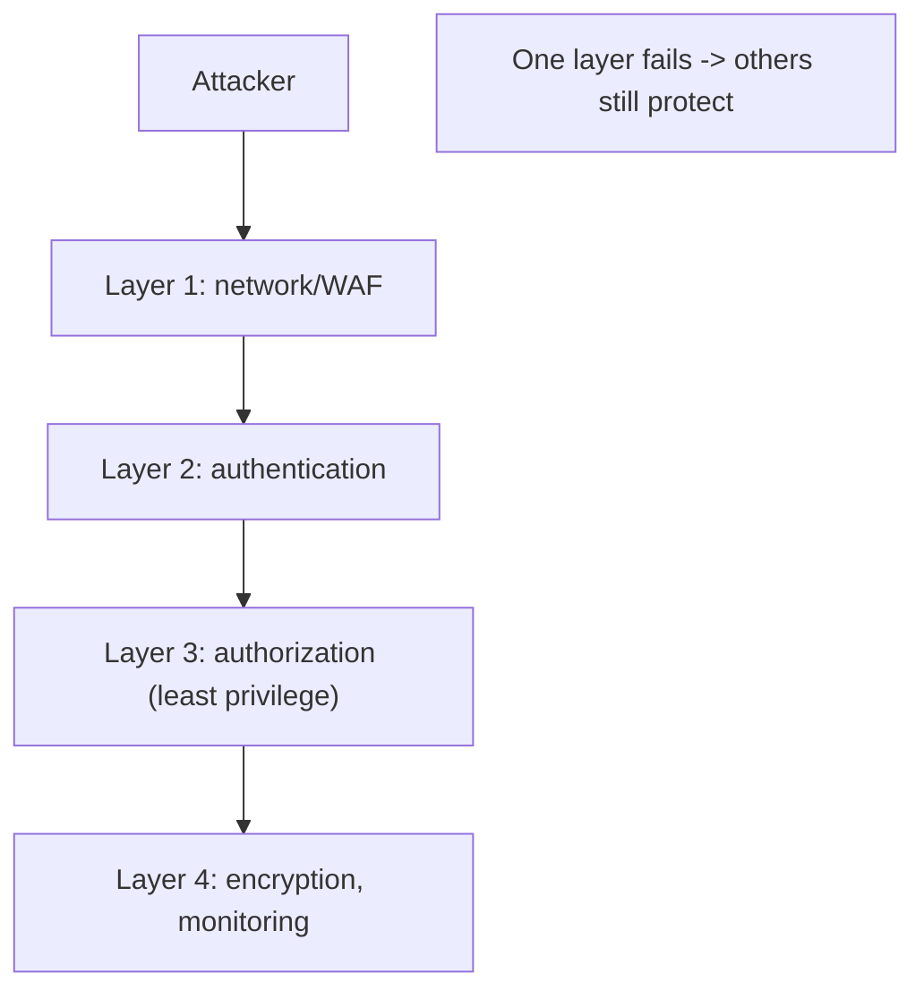
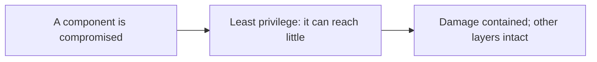
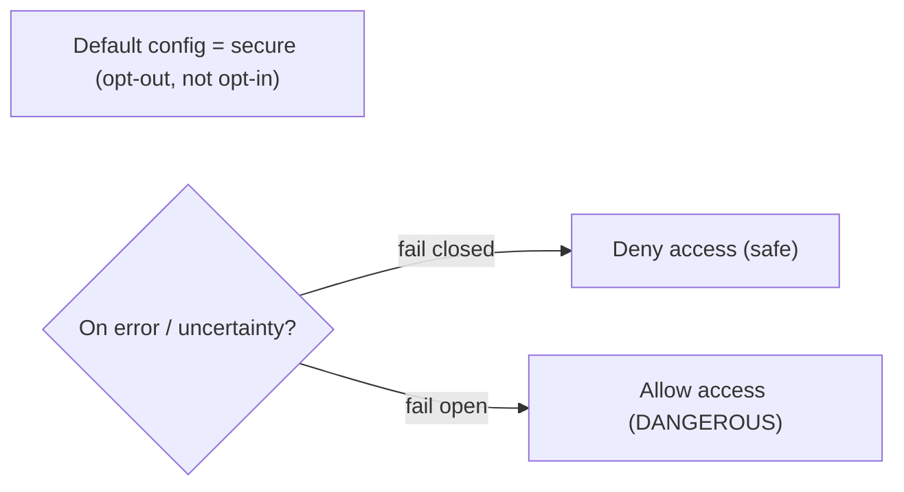
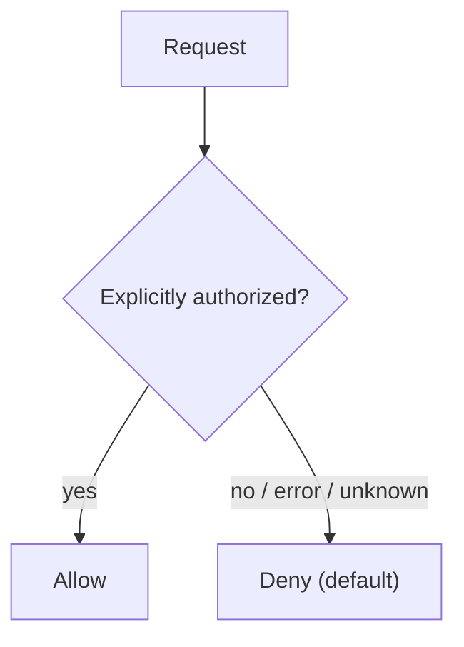

# Security Engineering Principles - Complete Professional Guide

> **Category:** 09_security_and_privacy · **Language:** English

---

### Defense in depth, least privilege, and thinking like an attacker
**Original guide written from first principles, current to 2026**

> **Original reference book (English).** This is an **independent, originally written** guide. It is not an extract, summary, or paraphrase of any third-party book; it teaches security engineering principles from first principles with original examples. Canonical books are listed under **References** as pointers only. Each chapter follows the TO-BRAIN editorial standard (see `FILE_CONVENTIONS.md`).
>
> **Scope notice:** security engineering is building systems that keep working correctly in the presence of **adversaries**. This guide covers the durable principles — defense in depth, least privilege, secure defaults, and attacker thinking — that apply across any system, current to 2026.

---

## How to read this guide

| Level | Profile | Parts |
|-------|---------|-------|
| 1 — Beginner | New to security | Part I |
| 2 — Intermediate | Designing securely | Part II |

**Target audience:** engineers and architects responsible for building secure systems.

**Structure of each chapter:** Introduction · Business context · Theoretical concepts · Architecture · Diagrams (Mermaid) · Real examples · Step by step · Complete examples · Exercises · Challenges · Checklist · Best practices · Anti-patterns · Troubleshooting · References.

> **Note on prerequisites.** Assumes the threat-modeling guide.

---

## Table of Contents

**Part I – Core principles**
1. Defense in depth and least privilege
2. Secure by default and failing safely

**Part II – The adversary**
3. Thinking like an attacker; the economics of security

> **Status of this guide:** phased delivery. **Ready:** Part I (Ch. 1–2). **In progress:** Part II.

---

## Part I – Core principles

Security isn't a feature you add; it's a property that emerges from how a system is designed. A handful of principles, applied consistently, account for most of real-world security. They assume that components *will* be compromised and aim to limit what an attacker gains when they are — designing for failure, not just for success.

---

## Chapter 1 — Defense in depth and least privilege

### 1.1 Introduction

**Defense in depth** means using **multiple, independent layers** of security so that one failure doesn't cause a breach — if the attacker gets past one control, another stops them. **Least privilege** means every component, user, and process gets only the **minimum access** it needs. Together they limit both the chance and the impact of compromise.

### 1.2 Business context

No single control is perfect — patches lag, configs drift, humans err. Relying on one defense (a firewall, say) means one failure is a total breach. Defense in depth ensures a single failure is contained; least privilege ensures a compromised component can't reach much. Together they turn "one mistake = catastrophe" into "one mistake = limited, recoverable damage" — which is the difference between an incident and a headline breach.

### 1.3 Theoretical concepts: layers and minimal access



Layers should be **independent** (a single flaw shouldn't defeat several at once). Least privilege applies everywhere: DB accounts, service permissions, API scopes, file access — grant the minimum and nothing more. The combination means an attacker who breaches one layer finds limited access and more barriers ahead.

### 1.4 Architecture: contain the blast radius



### 1.5 Real example

**Scenario.** A web app's database holds sensitive data.

**Problem.** If the app server is compromised and its DB account is an admin, the attacker gets everything.

**Solution.** Least privilege + layers: the app uses a restricted DB account; data is encrypted; the DB isn't internet-reachable; monitoring watches for anomalies.

**Implementation (layered least privilege).**

```text
- App DB user: only SELECT/INSERT/UPDATE on its tables (no DROP, no admin)
- DB network: reachable only from the app subnet (not the internet)
- Sensitive columns: encrypted at rest; keys held separately
- Monitoring: alert on unusual query volume / access patterns
=> a compromised app server cannot drop tables, reach the DB directly,
   read keys, or act unnoticed
```

**Result.** Even with the app server breached, the attacker's reach is sharply limited (no admin, no direct DB access, encrypted data, alerts firing). One failure is contained, not catastrophic.

**Future improvements.** Rotate credentials; segment further; add anomaly-based blocking.

### 1.6 Exercises

1. Define defense in depth and least privilege.
2. Why must layers be independent?
3. How does least privilege limit breach impact?

### 1.7 Challenges

- **Challenge.** Pick a service you run. Does any component have more privilege than it needs? Reduce one to least privilege and note the reduced blast radius.

### 1.8 Checklist

- [ ] Security relies on multiple independent layers.
- [ ] Every component has least privilege.
- [ ] A single control failure isn't a full breach.
- [ ] Sensitive resources have extra layers.

### 1.9 Best practices

- Layer independent controls; assume each can fail.
- Grant minimum privilege everywhere; review regularly.
- Segment networks and data to contain breaches.

### 1.10 Anti-patterns

- A single control as the only defense ("hard shell, soft center").
- Over-privileged accounts/services for convenience.
- Flat networks where one breach reaches everything.

### 1.11 Troubleshooting

| Symptom | Likely cause | Action |
|---------|--------------|--------|
| One failure = full breach | No defense in depth | Add independent layers |
| Compromise spreads widely | Over-privilege / flat network | Apply least privilege; segment |
| Sensitive data exposed on breach | No encryption layer | Encrypt; separate keys |

### 1.12 References

- R. Anderson, *Security Engineering*, 3rd ed. (Wiley, 2020) — ISBN 978-1119642787; https://www.cl.cam.ac.uk/~rja14/book.html.
- NIST, "Zero Trust Architecture" (SP 800-207).

---

## Chapter 2 — Secure by default and failing safely

### 2.1 Introduction

**Secure by default** means the system is safe in its **default configuration** — security isn't an opt-in users must remember to enable. **Failing safely** (fail-closed) means that when something errors, the system defaults to **denying** access rather than allowing it. Both put the safe path as the path of least resistance, so security doesn't depend on perfect configuration or perfect conditions.

### 2.2 Business context

Most breaches exploit misconfigurations and insecure defaults, not exotic zero-days. If safety requires users to flip switches, many won't, and those become victims. Secure defaults make the out-of-the-box state safe, eliminating a huge class of real-world failures. Failing closed ensures errors don't accidentally grant access. Together they reduce the breaches that come from human oversight — which is most of them.

### 2.3 Theoretical concepts: safe default, deny on error



Secure defaults: encryption on, unnecessary features off, strong settings pre-configured. Fail-closed: if an auth check throws, treat it as "not authorized," not "allow." The dangerous opposite — **fail open** — turns an error into an access grant, a common and serious bug.

### 2.4 Architecture: deny by default



### 2.5 Real example

**Scenario.** An authorization check calls a service that occasionally times out.

**Problem.** If the code treats a timeout as "allow" (fail open), an outage becomes an access-control bypass.

**Solution.** Fail closed: any error or uncertainty denies access.

**Implementation (fail-closed authorization).**

```java
boolean canAccess(User u, Resource r) {
    try {
        return authz.isAllowed(u, r);     // explicit allow only
    } catch (Exception e) {
        log.warn("authz check failed; denying", e);
        return false;                     // FAIL CLOSED: deny on error
    }
}
```

**Result.** An authorization-service hiccup denies access (safe) instead of granting it — the outage can't be turned into a bypass. Security holds even when components fail.

**Future improvements.** Make secure settings the defaults everywhere; add tests asserting deny-on-error behavior.

### 2.6 Exercises

1. What does "secure by default" mean?
2. Contrast fail-open and fail-closed.
3. Why are insecure defaults a top breach cause?

### 2.7 Challenges

- **Challenge.** Find an error path in an access-control check. Does it fail open or closed? Make it deny on error and add a test.

### 2.8 Checklist

- [ ] The default configuration is secure.
- [ ] Security is opt-out, not opt-in.
- [ ] Errors/uncertainty deny access (fail closed).
- [ ] Unneeded features are off by default.

### 2.9 Best practices

- Ship safe defaults; make insecurity require deliberate action.
- Fail closed on any auth/authorization error.
- Disable unused features and ports by default.

### 2.10 Anti-patterns

- Insecure defaults requiring users to harden.
- Fail-open error handling in security checks.
- Leaving unnecessary features/ports enabled.

### 2.11 Troubleshooting

| Symptom | Likely cause | Action |
|---------|--------------|--------|
| Breach via misconfiguration | Insecure defaults | Make defaults secure (opt-out) |
| Outage caused access bypass | Fail-open logic | Fail closed on error |
| Large attack surface | Unneeded features on | Disable by default |

### 2.12 References

- R. Anderson, *Security Engineering*, 3rd ed. (Wiley, 2020) — ISBN 978-1119642787.
- J. Saltzer, M. Schroeder, "The Protection of Information in Computer Systems" (1975), classic security principles.

---

> **End of Part I.** You can now apply the core security-engineering principles: defense in depth (independent layers so one failure isn't a breach) with least privilege (minimum access everywhere to contain blast radius), and secure-by-default configuration that fails closed (denying access on error or uncertainty). **Part II — The adversary** (Chapter 3) covers thinking like an attacker — assuming malice, enumerating attack paths — and the economics of security: spending defense effort where the risk (probability × impact) is highest.

<!--APPEND-PART-II-->
