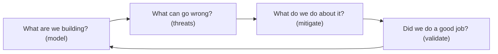
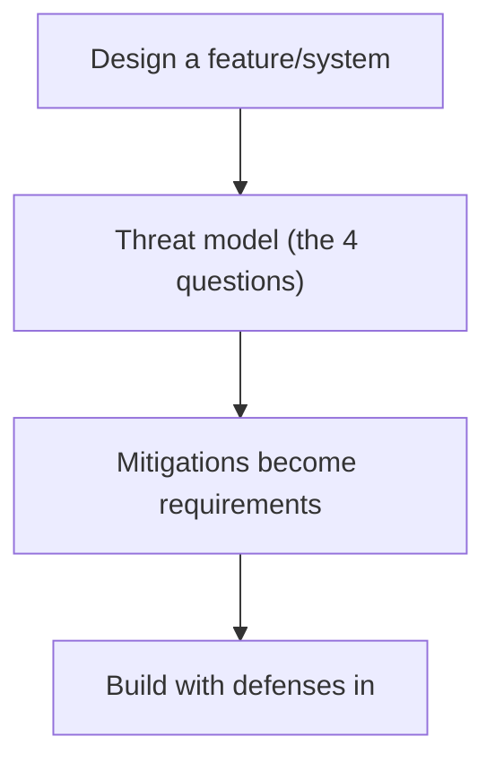
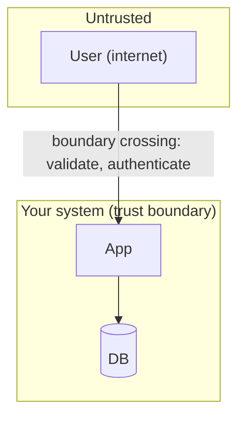

# Threat Modeling - Complete Professional Guide

> **Category:** 09_security_and_privacy · **Language:** English

---

### Finding security flaws in design with STRIDE and data flow diagrams
**Original guide written from first principles, current to 2026**

> **Original reference book (English).** This is an **independent, originally written** guide. It is not an extract, summary, or paraphrase of any third-party book; it teaches threat modeling from first principles with original examples. Canonical books are listed under **References** as pointers only. Each chapter follows the TO-BRAIN editorial standard (see `FILE_CONVENTIONS.md`).
>
> **Scope notice:** threat modeling finds security problems in a **design** — before they're built — by reasoning systematically about what could go wrong. This guide covers the four-question framework, data flow diagrams with trust boundaries, and STRIDE, current to 2026.

---

## How to read this guide

| Level | Profile | Parts |
|-------|---------|-------|
| 1 — Beginner | New to threat modeling | Part I |
| 2 — Intermediate | Modeling a system | Part II |

**Target audience:** developers, architects, and security engineers designing systems that must be secure.

**Structure of each chapter:** Introduction · Business context · Theoretical concepts · Architecture · Diagrams (Mermaid) · Real examples · Step by step · Complete examples · Exercises · Challenges · Checklist · Best practices · Anti-patterns · Troubleshooting · References.

> **Note on prerequisites.** Assumes basic system design.

---

## Table of Contents

**Part I – The framework**
1. The four questions of threat modeling
2. Data flow diagrams and trust boundaries

**Part II – Enumerating threats**
3. STRIDE

> **Status of this guide:** phased delivery. **Ready:** Part I (Ch. 1–2). **In progress:** Part II.

---

## Part I – The framework

Security bugs are cheapest to fix in **design**, before any code exists. Threat modeling is the practice of looking at a system's design and asking, systematically, how it could be attacked — so you build in defenses rather than bolt them on after a breach. It's a structured thinking exercise, not a tool you run.

---

## Chapter 1 — The four questions

### 1.1 Introduction

Threat modeling boils down to four questions: **What are we building?** (model the system), **What can go wrong?** (find threats), **What are we going to do about it?** (mitigate), and **Did we do a good job?** (validate). This simple framework keeps threat modeling approachable and repeatable — anyone on the team can apply it to a feature or system.

### 1.2 Business context

Security flaws caught in design cost a fraction of those caught in production (or by attackers). Threat modeling shifts security **left** — into design reviews — turning vague "is this secure?" worry into a structured analysis that surfaces concrete risks early. For a business, this means fewer breaches, lower remediation cost, and security built in rather than bolted on. It's one of the highest-ROI security practices.

### 1.3 Theoretical concepts: a four-step loop



You don't need to be a security expert to start. Model the system (Chapter 2), brainstorm threats (a structured technique like STRIDE helps — Chapter 3), decide mitigations (fix, accept, transfer, or remove the risk), and check your work. Do it during design and revisit as the system changes.

### 1.4 Architecture: threat modeling in the design flow



### 1.5 Real example

**Scenario.** A team designs a password-reset feature.

**Problem.** Without analysis, they might ship a reset flow vulnerable to account takeover (e.g. guessable tokens, no rate limiting).

**Solution.** Apply the four questions before building.

**Implementation (the four questions applied).**

```text
1. What are we building? reset flow: request -> email link with token -> set new password
2. What can go wrong?
   - token guessable -> account takeover
   - no rate limit -> brute force / enumeration
   - link doesn't expire -> stolen-link reuse
3. What do we do?
   - cryptographically random, single-use, short-TTL tokens
   - rate-limit requests; generic responses (no user enumeration)
4. Did we do well? review against the threats; add tests for each
```

**Result.** The reset feature is designed with defenses against takeover, brute force, and enumeration from the start — flaws that would otherwise have shipped and been exploited.

**Future improvements.** Re-threat-model when the flow changes (e.g. adding SMS reset introduces new threats).

### 1.6 Exercises

1. List the four questions of threat modeling.
2. Why is design-time the cheapest place to fix security flaws?
3. What are the options when you find a threat?

### 1.7 Challenges

- **Challenge.** Pick a feature you're building. Walk the four questions. List three concrete "what can go wrong" threats and a mitigation for each.

### 1.8 Checklist

- [ ] I threat-model during design, not after.
- [ ] I model what I'm building first.
- [ ] I enumerate concrete threats.
- [ ] Mitigations become requirements and tests.

### 1.9 Best practices

- Threat-model features as part of design review.
- Make mitigations explicit requirements.
- Revisit the model as the system evolves.

### 1.10 Anti-patterns

- Treating security as a post-build audit only.
- "We'll secure it later" with no analysis.
- A one-time threat model never updated.

### 1.11 Troubleshooting

| Symptom | Likely cause | Action |
|---------|--------------|--------|
| Security bugs found in production | No design-time modeling | Threat-model during design |
| Vague security concerns | No structured analysis | Apply the four questions |
| Model outdated | Not revisited | Re-model on significant changes |

### 1.12 References

- A. Shostack, *Threat Modeling: Designing for Security* (Wiley, 2014) — ISBN 978-1118809990.
- OWASP Threat Modeling: https://owasp.org/www-community/Threat_Modeling.

---

## Chapter 2 — Data flow diagrams and trust boundaries

### 2.1 Introduction

To find threats you need a **model** of the system, and the classic one is a **data flow diagram (DFD)**: external entities, processes, data stores, and the data flows between them. The critical addition is **trust boundaries** — lines where the level of trust changes (e.g. internet → your server). Threats concentrate at these boundaries, so drawing them tells you where to look hardest.

### 2.2 Business context

You can't analyze what you can't see. A DFD with trust boundaries makes the attack surface visible — every flow crossing a boundary is a place an attacker can act and where validation/authentication must happen. This focuses security effort on the points that matter (boundaries) instead of spreading it thin. It also creates a shared artifact the whole team can reason about, improving design discussions.

### 2.3 Theoretical concepts: elements and boundaries


A DFD has four element types: **external entities** (users, other systems), **processes** (your code), **data stores** (databases, files), and **data flows** (arrows). A **trust boundary** is drawn wherever trust changes — between the internet and your app, between your app and a third party, between privilege levels. **Every flow crossing a boundary is a prime threat location** (needs auth, validation, encryption).

### 2.4 Architecture: boundaries focus the analysis



### 2.5 Real example

**Scenario.** Model a web app that takes user input and calls a payment provider.

**Problem.** Without a model, it's unclear where to enforce validation, auth, and encryption.

**Solution.** A DFD with trust boundaries highlights the crossings.

**Implementation (the model, conceptually).**

```text
External (untrusted): User --[HTTPS, validate input]--> [TRUST BOUNDARY] Web app
Web app --> DB (within trust boundary; still least-privilege)
Web app --[TRUST BOUNDARY: authenticated, encrypted]--> Payment provider (external)
-> threats focus on the two boundary crossings:
   user->app (injection, auth bypass) and app->provider (mTLS, secrets)
```

**Result.** The two trust-boundary crossings are flagged as the highest-risk spots, telling the team exactly where to enforce input validation, authentication, and encryption.

**Future improvements.** Apply STRIDE (Chapter 3) to each element/flow to enumerate specific threats systematically.

### 2.6 Exercises

1. Name the four DFD element types.
2. What is a trust boundary and why do threats cluster there?
3. What must happen at a boundary crossing?

### 2.7 Challenges

- **Challenge.** Draw a DFD for a feature you're building. Mark every trust boundary. For each crossing, note what defense (auth/validation/encryption) is needed.

### 2.8 Checklist

- [ ] I model the system as a DFD.
- [ ] I mark trust boundaries explicitly.
- [ ] I scrutinize every boundary-crossing flow.
- [ ] Boundary crossings have auth/validation/encryption.

### 2.9 Best practices

- Draw DFDs at a useful level of detail (not too fine).
- Always mark trust boundaries — that's where the value is.
- Enforce validation/auth at every crossing.

### 2.10 Anti-patterns

- Models with no trust boundaries (missing the point).
- Trusting input that crossed a boundary.
- Over-detailed DFDs nobody maintains.

### 2.11 Troubleshooting

| Symptom | Likely cause | Action |
|---------|--------------|--------|
| Unclear where to add security | No trust boundaries marked | Add them; focus on crossings |
| Injection/auth bugs at edges | Untrusted input trusted | Validate/authenticate at boundaries |
| Model too complex to use | Excessive detail | Simplify to meaningful elements |

### 2.12 References

- A. Shostack, *Threat Modeling: Designing for Security* (Wiley, 2014) — ISBN 978-1118809990.
- OWASP, "Threat Modeling Process": https://owasp.org/www-community/Threat_Modeling_Process.

---

> **End of Part I.** You can now threat-model systematically: apply the four questions (what are we building, what can go wrong, what do we do, did we do well) during design, and model the system as a data flow diagram with explicit trust boundaries so you focus analysis on the boundary-crossing flows where attacks concentrate. **Part II — Enumerating threats** (Chapter 3) covers STRIDE — Spoofing, Tampering, Repudiation, Information disclosure, Denial of service, Elevation of privilege — a structured prompt to find specific threats against each element of your model.

<!--APPEND-PART-II-->
