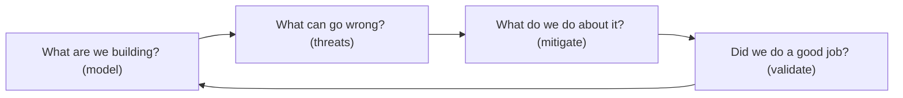
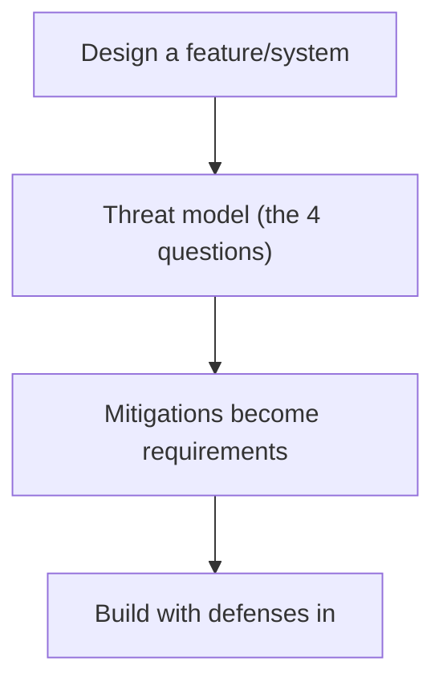
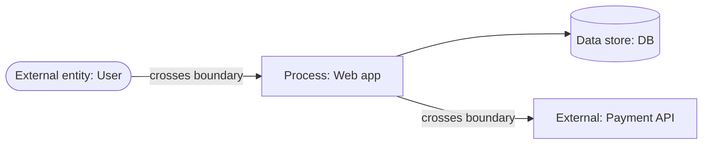
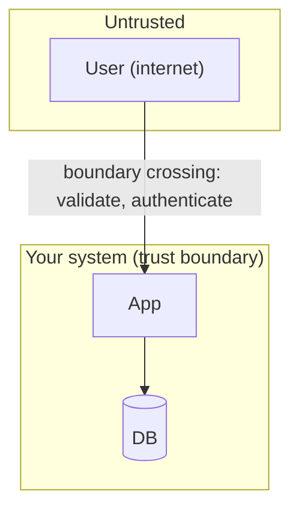
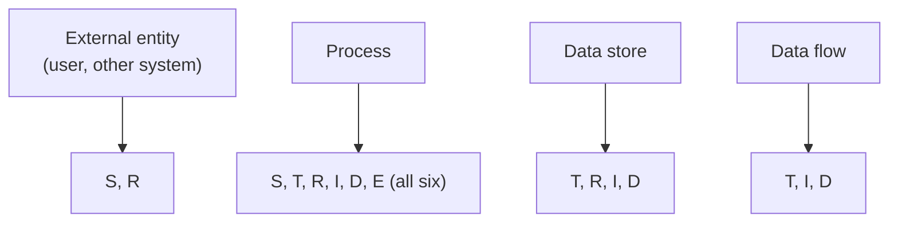
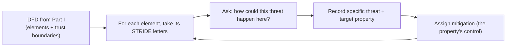

# Threat Modeling - Complete Professional Guide

> **Category:** 09_security_and_privacy · **Language:** English

---

### Finding security flaws in design with STRIDE and data flow diagrams
**Original guide written from first principles, current to 2026**

> **Original reference book (English).** This is an **independent, originally written** guide. It is not an extract, summary, or paraphrase of any third-party book; it teaches threat modeling from first principles with original examples. Canonical books are listed under **References** as pointers only. Each chapter follows the TO-BRAIN editorial standard (see `FILE_CONVENTIONS.md`).
>
> **Scope notice:** threat modeling finds security problems in a **design** — before they're built — by reasoning systematically about what could go wrong. This guide covers the four-question framework, data flow diagrams with trust boundaries, and STRIDE, current to 2026.

---

## How to read this guide

| Level | Profile | Parts |
|-------|---------|-------|
| 1 — Beginner | New to threat modeling | Part I |
| 2 — Intermediate | Modeling a system | Part II |

**Target audience:** developers, architects, and security engineers designing systems that must be secure.

**Structure of each chapter:** Introduction · Business context · Theoretical concepts · Architecture · Diagrams (Mermaid) · Real examples · Step by step · Complete examples · Exercises · Challenges · Checklist · Best practices · Anti-patterns · Troubleshooting · References.

> **Note on prerequisites.** Assumes basic system design.

---

## Table of Contents

**Part I – The framework**
1. The four questions of threat modeling
2. Data flow diagrams and trust boundaries

**Part II – Enumerating threats**
3. STRIDE

> **Status of this guide:** complete. **Ready:** Part I (Ch. 1–2) and Part II (Ch. 3).

---

## Part I – The framework

Security bugs are cheapest to fix in **design**, before any code exists. Threat modeling is the practice of looking at a system's design and asking, systematically, how it could be attacked — so you build in defenses rather than bolt them on after a breach. It's a structured thinking exercise, not a tool you run.

---

## Chapter 1 — The four questions

### 1.1 Introduction

Threat modeling boils down to four questions: **What are we building?** (model the system), **What can go wrong?** (find threats), **What are we going to do about it?** (mitigate), and **Did we do a good job?** (validate). This simple framework keeps threat modeling approachable and repeatable — anyone on the team can apply it to a feature or system.

### 1.2 Business context

Security flaws caught in design cost a fraction of those caught in production (or by attackers). Threat modeling shifts security **left** — into design reviews — turning vague "is this secure?" worry into a structured analysis that surfaces concrete risks early. For a business, this means fewer breaches, lower remediation cost, and security built in rather than bolted on. It's one of the highest-ROI security practices.

### 1.3 Theoretical concepts: a four-step loop



You don't need to be a security expert to start. Model the system (Chapter 2), brainstorm threats (a structured technique like STRIDE helps — Chapter 3), decide mitigations (fix, accept, transfer, or remove the risk), and check your work. Do it during design and revisit as the system changes.

### 1.4 Architecture: threat modeling in the design flow



### 1.5 Real example

**Scenario.** A team designs a password-reset feature.

**Problem.** Without analysis, they might ship a reset flow vulnerable to account takeover (e.g. guessable tokens, no rate limiting).

**Solution.** Apply the four questions before building.

**Implementation (the four questions applied).**

```text
1. What are we building? reset flow: request -> email link with token -> set new password
2. What can go wrong?
   - token guessable -> account takeover
   - no rate limit -> brute force / enumeration
   - link doesn't expire -> stolen-link reuse
3. What do we do?
   - cryptographically random, single-use, short-TTL tokens
   - rate-limit requests; generic responses (no user enumeration)
4. Did we do well? review against the threats; add tests for each
```

**Result.** The reset feature is designed with defenses against takeover, brute force, and enumeration from the start — flaws that would otherwise have shipped and been exploited.

**Future improvements.** Re-threat-model when the flow changes (e.g. adding SMS reset introduces new threats).

### 1.6 Exercises

1. List the four questions of threat modeling.
2. Why is design-time the cheapest place to fix security flaws?
3. What are the options when you find a threat?

### 1.7 Challenges

- **Challenge.** Pick a feature you're building. Walk the four questions. List three concrete "what can go wrong" threats and a mitigation for each.

### 1.8 Checklist

- [ ] I threat-model during design, not after.
- [ ] I model what I'm building first.
- [ ] I enumerate concrete threats.
- [ ] Mitigations become requirements and tests.

### 1.9 Best practices

- Threat-model features as part of design review.
- Make mitigations explicit requirements.
- Revisit the model as the system evolves.

### 1.10 Anti-patterns

- Treating security as a post-build audit only.
- "We'll secure it later" with no analysis.
- A one-time threat model never updated.

### 1.11 Troubleshooting

| Symptom | Likely cause | Action |
|---------|--------------|--------|
| Security bugs found in production | No design-time modeling | Threat-model during design |
| Vague security concerns | No structured analysis | Apply the four questions |
| Model outdated | Not revisited | Re-model on significant changes |

### 1.12 References

- A. Shostack, *Threat Modeling: Designing for Security* (Wiley, 2014) — ISBN 978-1118809990.
- OWASP Threat Modeling: https://owasp.org/www-community/Threat_Modeling.

---

## Chapter 2 — Data flow diagrams and trust boundaries

### 2.1 Introduction

To find threats you need a **model** of the system, and the classic one is a **data flow diagram (DFD)**: external entities, processes, data stores, and the data flows between them. The critical addition is **trust boundaries** — lines where the level of trust changes (e.g. internet → your server). Threats concentrate at these boundaries, so drawing them tells you where to look hardest.

### 2.2 Business context

You can't analyze what you can't see. A DFD with trust boundaries makes the attack surface visible — every flow crossing a boundary is a place an attacker can act and where validation/authentication must happen. This focuses security effort on the points that matter (boundaries) instead of spreading it thin. It also creates a shared artifact the whole team can reason about, improving design discussions.

### 2.3 Theoretical concepts: elements and boundaries



A DFD has four element types: **external entities** (users, other systems), **processes** (your code), **data stores** (databases, files), and **data flows** (arrows). A **trust boundary** is drawn wherever trust changes — between the internet and your app, between your app and a third party, between privilege levels. **Every flow crossing a boundary is a prime threat location** (needs auth, validation, encryption).

### 2.4 Architecture: boundaries focus the analysis



### 2.5 Real example

**Scenario.** Model a web app that takes user input and calls a payment provider.

**Problem.** Without a model, it's unclear where to enforce validation, auth, and encryption.

**Solution.** A DFD with trust boundaries highlights the crossings.

**Implementation (the model, conceptually).**

```text
External (untrusted): User --[HTTPS, validate input]--> [TRUST BOUNDARY] Web app
Web app --> DB (within trust boundary; still least-privilege)
Web app --[TRUST BOUNDARY: authenticated, encrypted]--> Payment provider (external)
-> threats focus on the two boundary crossings:
   user->app (injection, auth bypass) and app->provider (mTLS, secrets)
```

**Result.** The two trust-boundary crossings are flagged as the highest-risk spots, telling the team exactly where to enforce input validation, authentication, and encryption.

**Future improvements.** Apply STRIDE (Chapter 3) to each element/flow to enumerate specific threats systematically.

### 2.6 Exercises

1. Name the four DFD element types.
2. What is a trust boundary and why do threats cluster there?
3. What must happen at a boundary crossing?

### 2.7 Challenges

- **Challenge.** Draw a DFD for a feature you're building. Mark every trust boundary. For each crossing, note what defense (auth/validation/encryption) is needed.

### 2.8 Checklist

- [ ] I model the system as a DFD.
- [ ] I mark trust boundaries explicitly.
- [ ] I scrutinize every boundary-crossing flow.
- [ ] Boundary crossings have auth/validation/encryption.

### 2.9 Best practices

- Draw DFDs at a useful level of detail (not too fine).
- Always mark trust boundaries — that's where the value is.
- Enforce validation/auth at every crossing.

### 2.10 Anti-patterns

- Models with no trust boundaries (missing the point).
- Trusting input that crossed a boundary.
- Over-detailed DFDs nobody maintains.

### 2.11 Troubleshooting

| Symptom | Likely cause | Action |
|---------|--------------|--------|
| Unclear where to add security | No trust boundaries marked | Add them; focus on crossings |
| Injection/auth bugs at edges | Untrusted input trusted | Validate/authenticate at boundaries |
| Model too complex to use | Excessive detail | Simplify to meaningful elements |

### 2.12 References

- A. Shostack, *Threat Modeling: Designing for Security* (Wiley, 2014) — ISBN 978-1118809990.
- OWASP, "Threat Modeling Process": https://owasp.org/www-community/Threat_Modeling_Process.

---

> **End of Part I.** You can now threat-model systematically: apply the four questions (what are we building, what can go wrong, what do we do, did we do well) during design, and model the system as a data flow diagram with explicit trust boundaries so you focus analysis on the boundary-crossing flows where attacks concentrate. **Part II — Enumerating threats** (Chapter 3) covers STRIDE — Spoofing, Tampering, Repudiation, Information disclosure, Denial of service, Elevation of privilege — a structured prompt to find specific threats against each element of your model.

---

## Part II – Enumerating threats

Part I's second question — "what can go wrong?" — is the hardest, because a blank page invites either panic or paralysis. STRIDE is the answer: a mnemonic that turns "think of every threat" into "check these six specific categories against each element of your diagram." It is not a guarantee of completeness, but it is a structured prompt that makes a team's threat enumeration repeatable, teachable, and far more thorough than unaided brainstorming. This part takes the data-flow diagram you built in Part I and walks STRIDE across it.

---

## Chapter 3 — STRIDE

### 3.1 Introduction

**STRIDE** is a mnemonic for six categories of threat, each the violation of a security property you want the system to have:

| Letter | Threat | Property it violates | Mitigated by |
|--------|--------|----------------------|--------------|
| **S** | **Spoofing** — pretending to be someone/something else | Authenticity | Authentication |
| **T** | **Tampering** — modifying data or code | Integrity | Integrity controls (hashes, signatures, permissions) |
| **R** | **Repudiation** — denying having done something | Non-repudiability | Logging, audit trails, signatures |
| **I** | **Information disclosure** — exposing data to the unauthorized | Confidentiality | Encryption, access control |
| **D** | **Denial of service** — degrading or denying availability | Availability | Rate limiting, quotas, redundancy |
| **E** | **Elevation of privilege** — doing what you're not authorized to | Authorization | Authorization, input validation, isolation |

The power of STRIDE is that it converts the open-ended "what can go wrong?" into six concrete questions you ask of every element in your model. You don't have to be creative on a blank page; you have to be *thorough* against a checklist.

### 3.2 Business context

Most teams that "do threat modeling" without a framework produce an unstructured list dominated by whatever attack was in the news that week — heavy on the familiar, blind to whole categories. The expensive misses are the categories the team simply never thought to consider: the audit-trail gap (Repudiation) discovered only during an incident investigation, the missing rate limit (DoS) found only under attack, the privilege boundary (Elevation) that no one questioned. STRIDE's value is coverage you can demonstrate and repeat: a new engineer can apply it on their first week, two reviewers applying it reach similar lists, and "did we consider tampering with this data store?" has a recorded yes/no answer. It is the difference between threat enumeration as an art only the senior security person can do and a process the whole team can run on every design.

### 3.3 Theoretical concepts: STRIDE-per-element

The most usable variant is **STRIDE-per-element**: not every threat applies to every element type, so you ask only the categories that are relevant to each kind of diagram element. This sharply reduces noise and makes the walk mechanical.



The rules of thumb: **external entities** can be spoofed and can repudiate (S, R). **Processes** are exposed to all six (S, T, R, I, D, E) — they are the richest targets. **Data stores** suffer Tampering, Repudiation (especially if they *are* the logs), Information disclosure, and DoS (T, R, I, D). **Data flows** suffer Tampering, Information disclosure, and DoS in transit (T, I, D). You walk each element of the DFD, ask only its relevant letters, and record a specific threat (and later a mitigation) for each that applies. Boundary-crossing flows from Part I get the most attention, because that is where the untrusted meets the trusted.

### 3.4 Architecture: walking STRIDE across the data-flow diagram



STRIDE plugs directly into the four questions: it *is* the engine for question 2 ("what can go wrong?"), and the property→mitigation pairing in the table feeds question 3 ("what do we do?"). Because each threat names the property it violates, the mitigation is not guesswork — a Spoofing threat is answered by authentication, a Tampering threat by integrity controls, and so on down the table.

### 3.5 Real example

**Scenario.** Continuing Part I's password-reset flow: a user requests a reset, the service emails a link containing a token, the user follows it and sets a new password. The DFD has an external entity (user), a process (reset service), a data store (token table), and data flows (HTTP request, email, token lookup).

**Problem.** Unaided brainstorming "covered" the obvious — a guessable token — but missed entire categories: nothing logs who triggered resets (Repudiation), the token table is readable by an over-broad DB account (Information disclosure), and there's no limit on reset requests (DoS / mailbomb).

**Solution.** Walk STRIDE-per-element across the DFD and record a specific threat and mitigation for each applicable letter.

**Implementation (STRIDE-per-element on the reset flow).**

```text
Element: User (external entity)            -> S, R
  S  Attacker requests reset for victim's email     -> Auth: bind token to account; verify ownership on use
  R  User denies requesting the reset               -> Non-repudiation: log request (who, when, IP)

Element: Reset service (process)           -> S, T, R, I, D, E
  S  Forged request impersonates the service        -> Authentication / TLS
  T  Tamper with reset logic via injected input     -> Integrity: validate input; parameterize queries
  R  No record of reset actions                     -> Logging / audit trail
  I  Error leaks whether an email exists            -> Confidentiality: uniform responses
  D  Unlimited reset requests exhaust mail/DB        -> Rate limiting per account + IP
  E  Reset endpoint reachable without authz checks  -> Authorization: enforce on every step

Element: Token table (data store)          -> T, R, I, D
  T  Token modified/extended                        -> Integrity: single-use, server-controlled
  R  Can't prove which token was issued/used        -> Audit columns (issued_at, used_at)
  I  Over-broad DB account can read all tokens      -> Least privilege; encrypt/hash tokens at rest
  D  Table flooded with tokens                      -> Expiry + cleanup; rate limit issuance

Element: Email link / token lookup (data flow) -> T, I, D
  T  Token altered in transit                       -> TLS; bind token to account
  I  Token leaks via referrer/logs                  -> Short expiry, single use, no token in referer
  D  Flood the lookup path                          -> Rate limit; cache negative lookups
```

**Result.** The reset flow now has a recorded threat *and* a property-matched mitigation for every applicable STRIDE letter on every element. The categories unaided brainstorming missed — Repudiation (no logging), Information disclosure (email enumeration, broad DB read), DoS (no rate limit) — are now explicit findings with owners, not surprises discovered during an incident. The analysis is repeatable: another reviewer walking the same DFD with STRIDE reaches substantially the same list.

**Future improvements.** Use STRIDE-per-interaction for the highest-risk boundary crossings (more precise than per-element); turn each mitigation into a test (e.g., assert reset is rate-limited and responses are uniform); revisit the model when the flow changes.

### 3.6 Exercises

1. Expand the STRIDE acronym and name the property each letter violates.
2. Which STRIDE categories apply to a data flow, and why not all six?
3. Why is STRIDE-per-element less noisy than asking all six of every element?
4. Match each STRIDE category to its mitigating property (e.g., Tampering → ?).

### 3.7 Challenges

- **Challenge.** Take the DFD you drew for the Part I challenge. Walk STRIDE-per-element across it, recording at least one specific threat and a property-matched mitigation for each applicable letter on each element. Note any category you'd never have considered without the prompt.

### 3.8 Checklist

- [ ] Every DFD element has been walked with its applicable STRIDE letters.
- [ ] Each applicable letter has a *specific* threat recorded, not a generic restatement.
- [ ] Each threat names the security property it violates.
- [ ] Each threat has a mitigation matched to that property.
- [ ] Boundary-crossing flows received the most attention.
- [ ] The model and findings are recorded so the walk is repeatable.

### 3.9 Best practices

- Use STRIDE-per-element to scope which categories apply to each element type.
- Record a concrete, system-specific threat for each applicable letter — not "tampering is possible."
- Let the violated property pick the mitigation (the right-hand columns of the STRIDE table).
- Concentrate on boundary-crossing data flows from your Part I diagram.
- Turn mitigations into tests so coverage is verified, not just asserted.

### 3.10 Anti-patterns

- Free-form brainstorming that over-weights last week's headline attack and misses whole categories.
- Applying all six letters to every element, drowning real threats in noise.
- Recording vague threats ("DoS possible") with no specific vector or mitigation.
- Treating STRIDE output as a finished list rather than feeding it into mitigation and testing.

### 3.11 Troubleshooting

| Symptom | Likely cause | Action |
|---------|--------------|--------|
| Whole threat categories missed in review | No structured prompt | Walk STRIDE-per-element across the DFD |
| Threat list is noisy and unfocused | All six asked of every element | Use per-element rules; ask only relevant letters |
| Threats found but no clear fixes | Property not identified | Name the violated property; take its mitigation from the table |
| Two reviewers produce very different lists | Ad-hoc method | Standardize on STRIDE + the DFD; record the walk |
| Repudiation/DoS keep surprising you in prod | These categories skipped at design | Make R and D mandatory letters for processes and stores |

### 3.12 References

- A. Shostack, *Threat Modeling: Designing for Security* (Wiley, 2014), **Ch. 3 "STRIDE"** — understanding STRIDE, the six threat categories, STRIDE-per-element and STRIDE-per-interaction; ISBN 978-1118809990.
- A. Shostack, *Threat Modeling*, **Part III** on mitigation — the property→control pairings (authentication, integrity, non-repudiation, confidentiality, availability, authorization).
- Microsoft, "The STRIDE Threat Model" and the SDL Threat Modeling Tool; OWASP, "Threat Modeling Process": https://owasp.org/www-community/Threat_Modeling_Process.

---

> **End of Part II — end of guide.** You can now answer "what can go wrong?" systematically: take the data-flow diagram from Part I and walk STRIDE-per-element across it, asking only the categories relevant to each element type, recording a specific threat for each, and letting the violated property pick the mitigation. Combined with Part I's four questions and trust-boundary-focused DFDs, STRIDE turns threat enumeration from an art only experts can do into a repeatable, teachable process the whole team can run on every design — thorough by checklist, not by luck.
