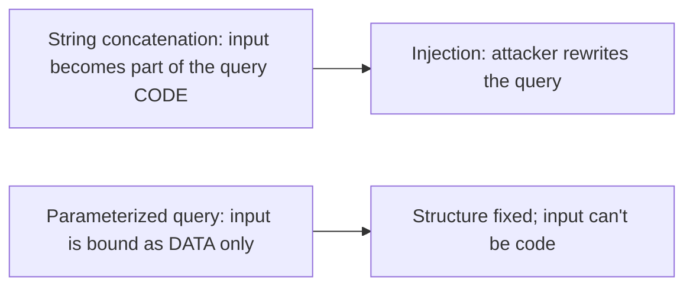
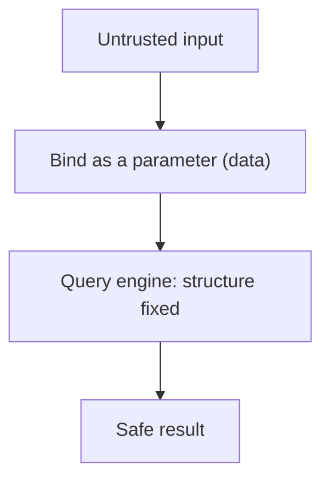
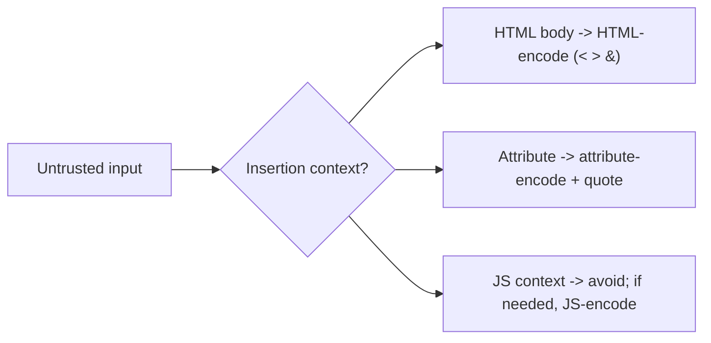
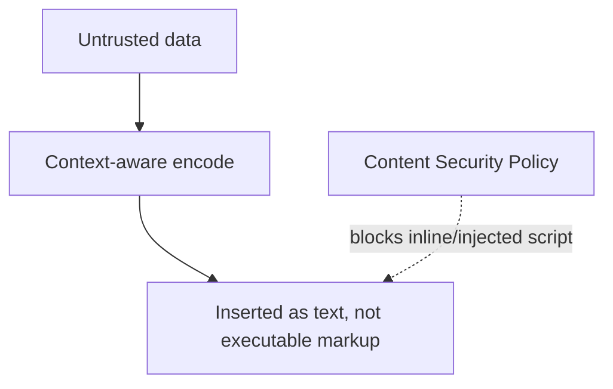
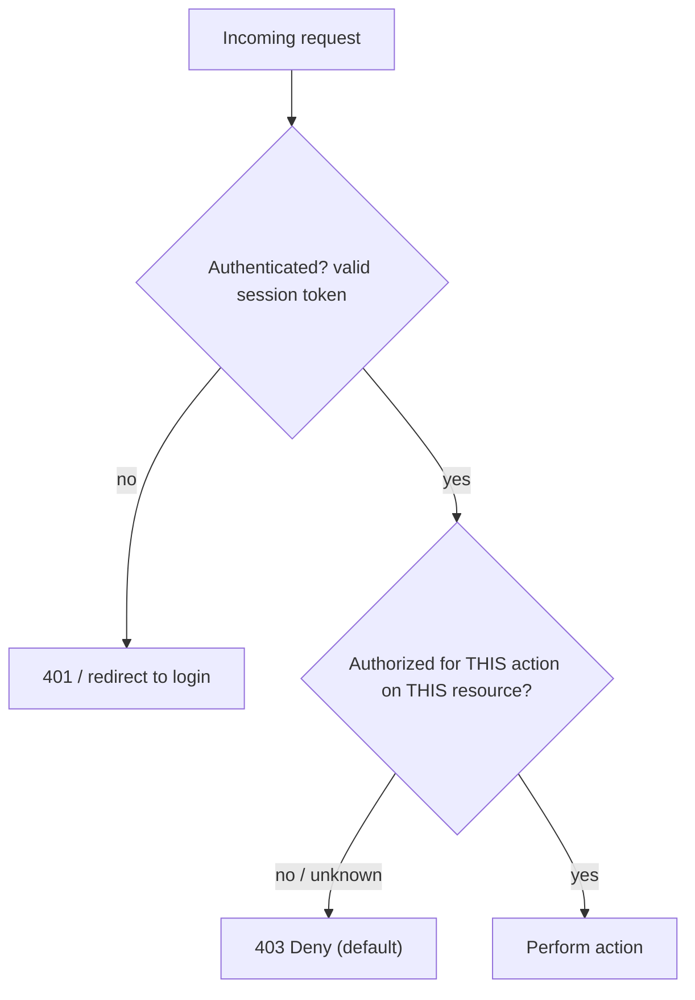
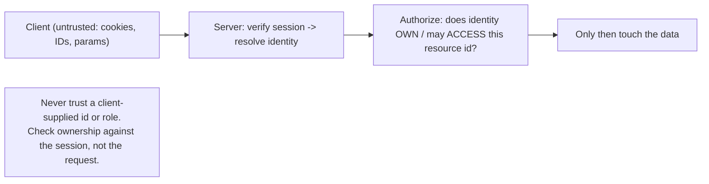

# Web Application Security - Complete Professional Guide

> **Category:** 09_security_and_privacy · **Language:** English

---

### Injection, XSS, broken auth, and the browser trust model
**Original guide written from first principles, current to 2026**

> **Original reference book (English).** This is an **independent, originally written** guide. It is not an extract, summary, or paraphrase of any third-party book; it teaches web application security from first principles with original examples. Canonical books are listed under **References** as pointers only. Each chapter follows the TO-BRAIN editorial standard (see `FILE_CONVENTIONS.md`).
>
> **Scope notice:** web apps are exposed to anyone with a browser, so their security depends on never trusting input and understanding the browser's trust model. This guide covers the most common vulnerability classes and their defenses, current to 2026 (OWASP Top 10).

---

## How to read this guide

| Level | Profile | Parts |
|-------|---------|-------|
| 1 — Beginner | New to web security | Part I |
| 2 — Intermediate | Hardening apps | Part II |

**Target audience:** web developers and security engineers building or assessing web applications.

**Structure of each chapter:** Introduction · Business context · Theoretical concepts · Architecture · Diagrams (Mermaid) · Real examples · Step by step · Complete examples · Exercises · Challenges · Checklist · Best practices · Anti-patterns · Troubleshooting · References.

> **Note on prerequisites.** Assumes web basics (HTTP, HTML, SQL) and the threat-modeling guide.

---

## Table of Contents

**Part I – Never trust input**
1. Injection (SQL and beyond)
2. Cross-site scripting (XSS) and the browser model

**Part II – Identity**
3. Broken authentication and access control

> **Status of this guide:** complete. **Ready:** Part I (Ch. 1–2) and Part II (Ch. 3).

---

## Part I – Never trust input

Almost every web vulnerability traces to one root cause: **trusting input that crosses a trust boundary**. Data from a user (or any external source) can be hostile. The defenses — validation, parameterization, output encoding — all enforce "treat external input as untrusted." Master that principle and most of the OWASP Top 10 follows.

---

## Chapter 1 — Injection

### 1.1 Introduction

**Injection** happens when untrusted input is interpreted as **code or commands** instead of data — classically SQL injection, but also OS command, LDAP, and others. The fix is the same everywhere: **separate code from data** so input can never change the structure of a query/command. For SQL, that means **parameterized queries** (prepared statements), never string concatenation.

### 1.2 Business context

Injection remains one of the most damaging web vulnerabilities — it can dump or destroy an entire database, bypass authentication, or run commands on a server. A single concatenated query is enough. The defense (parameterization) is cheap and universal, so injection is largely a solved problem *if* developers apply it consistently. The business cost of getting it wrong (breach, data loss, regulatory fines) is enormous; the cost to prevent it is near zero.

### 1.3 Theoretical concepts: separate code from data



In a parameterized query the SQL structure is fixed and sent separately from the parameter **values**; the database never parses user input as SQL. This makes injection structurally impossible for that query. The same principle (use safe APIs that separate code and data) applies to every injection type.

### 1.4 Architecture: input as data, always



### 1.5 Real example

**Scenario.** A login looks up a user by email.

**Problem.** Concatenating the email into SQL lets an attacker inject `' OR '1'='1` to bypass auth or dump data.

**Solution.** A parameterized query binds the email as data.

**Implementation.**

```java
// VULNERABLE: input concatenated into SQL code
String q = "SELECT * FROM users WHERE email = '" + email + "'";   // injectable

// SAFE: parameterized — email is bound as DATA, never parsed as SQL
PreparedStatement ps = conn.prepareStatement(
    "SELECT * FROM users WHERE email = ?");
ps.setString(1, email);    // structure fixed; ' OR '1'='1 is just a literal string
```

**Result.** The malicious input is treated as a literal email value, not SQL — the injection attack does nothing. Auth bypass and data dumping via this query become impossible.

**Future improvements.** Use an ORM/query builder that parameterizes by default; add input validation as defense in depth.

### 1.6 Exercises

1. What is the root cause of injection?
2. Why do parameterized queries prevent SQL injection?
3. Name two non-SQL injection types.

### 1.7 Challenges

- **Challenge.** Find a query built by string concatenation in code you know. Convert it to a parameterized query and explain why it's now safe.

### 1.8 Checklist

- [ ] I never concatenate untrusted input into queries/commands.
- [ ] I use parameterized queries / safe APIs.
- [ ] Input is treated as data, not code.
- [ ] Validation backs up parameterization.

### 1.9 Best practices

- Always parameterize; use safe, code/data-separating APIs.
- Apply least-privilege DB accounts (limit blast radius).
- Validate input as defense in depth.

### 1.10 Anti-patterns

- Building queries/commands by string concatenation.
- Relying only on input filtering (blacklists) to stop injection.
- Running the app DB user as an admin.

### 1.11 Troubleshooting

| Symptom | Likely cause | Action |
|---------|--------------|--------|
| Injectable queries | String-built SQL | Parameterize all queries |
| Filter bypassed | Blacklist approach | Use parameterization, not filtering |
| Huge breach blast radius | Over-privileged DB user | Least-privilege DB accounts |

### 1.12 References

- D. Stuttard, M. Pinto, *The Web Application Hacker's Handbook*, 2nd ed. (Wiley, 2011) — ISBN 978-1118026472.
- OWASP, "Top 10" and "Injection Prevention Cheat Sheet": https://owasp.org.

---

## Chapter 2 — Cross-site scripting (XSS)

### 2.1 Introduction

**Cross-site scripting (XSS)** is injection into the **browser**: untrusted input is rendered into a page as HTML/JavaScript and executes in the victim's browser, in the site's security context. It lets attackers steal sessions, perform actions as the user, or deface pages. The defense is **context-aware output encoding** — encode data for the place it's inserted — plus a Content Security Policy.

### 2.2 Business context

XSS is pervasive and dangerous because it runs with the victim's authenticated session — it can hijack accounts, exfiltrate data, or spread worms. It stems from the same root as SQL injection (untrusted input treated as code), here on the client side. Understanding the **browser trust model** — why a script from your page can act as the user — is essential to defending it. The cost of an XSS breach (account takeover at scale) is severe; the defenses are well understood.

### 2.3 Theoretical concepts: encode for context



The browser's **same-origin** model trusts scripts running on your page — so injected script is trusted too. Prevent injection by **encoding output for its context** (HTML, attribute, URL, JavaScript), so input renders as inert text, not markup/code. Prefer frameworks that auto-encode (React, Angular) and avoid `innerHTML`/`dangerouslySetInnerHTML` with untrusted data. Add a **Content Security Policy** as defense in depth.

### 2.4 Architecture: untrusted data rendered inert



### 2.5 Real example

**Scenario.** A page displays a user-supplied display name.

**Problem.** Rendering it raw lets `<script>steal()</script>` execute in every viewer's browser.

**Solution.** HTML-encode the value (or use a framework that auto-encodes).

**Implementation.**

```js
// VULNERABLE: raw insertion -> script executes
el.innerHTML = "Hello, " + userName;          // XSS if userName = "<script>...</script>"

// SAFE: insert as text (browser renders it inert)
el.textContent = "Hello, " + userName;        // <script> shown as literal text
// In frameworks: {userName} in JSX/templates auto-encodes by default.
```

**Result.** The malicious script is displayed as harmless text rather than executed — XSS is neutralized. Account-hijacking via this field becomes impossible.

**Future improvements.** Add a strict Content Security Policy; audit for any `innerHTML`/`dangerouslySetInnerHTML` use with untrusted data.

### 2.6 Exercises

1. Why does injected script run with the victim's privileges?
2. What is context-aware output encoding?
3. How does a Content Security Policy help?

### 2.7 Challenges

- **Challenge.** Find a place rendering user data via `innerHTML` (or equivalent). Switch to a safe, auto-encoding method and verify a `<script>` payload no longer executes.

### 2.8 Checklist

- [ ] Untrusted output is context-encoded.
- [ ] I avoid `innerHTML`/`dangerouslySetInnerHTML` with untrusted data.
- [ ] I use auto-encoding frameworks/templates.
- [ ] A Content Security Policy is in place.

### 2.9 Best practices

- Encode output for its exact context.
- Prefer frameworks that auto-encode by default.
- Deploy a strict CSP as defense in depth.

### 2.10 Anti-patterns

- Inserting untrusted data as raw HTML.
- Relying on input sanitization alone for XSS.
- No CSP.

### 2.11 Troubleshooting

| Symptom | Likely cause | Action |
|---------|--------------|--------|
| Script executes from user input | Raw HTML insertion | Context-encode; use textContent/auto-encoding |
| XSS despite filtering | Input-only defense | Encode on output; add CSP |
| Injected inline scripts run | No CSP | Add a strict Content Security Policy |

### 2.12 References

- M. Zalewski, *The Tangled Web* (No Starch Press, 2011) — ISBN 978-1593273880.
- OWASP, "XSS Prevention Cheat Sheet" & "Top 10": https://owasp.org.

---

> **End of Part I.** You can now defend against the two most common web vulnerability classes by enforcing one principle — never trust input across a boundary: stop injection by separating code from data (parameterized queries and safe APIs), and stop XSS with context-aware output encoding plus a Content Security Policy, understanding that the browser trusts scripts running in your page's origin. **Part II — Identity** (Chapter 3) covers broken authentication (session management, credential handling) and broken access control (the most common modern web risk) — ensuring users can only do and see what they're authorized to.

---

## Part II – Identity

Part I was about *what* the user can send; Part II is about *who* the user is and *what they may do*. Injection and XSS abuse trust in data; the bugs in this part abuse trust in identity. Two questions matter: **authentication** — is this request really from who it claims to be? — and **access control** (authorization) — is this identity allowed to perform this action on this resource? Broken access control is the single most common serious web risk (OWASP Top 10 A01), and broken authentication is close behind, precisely because both are about enforcing a *policy* the attacker is actively trying to step outside of.

---

## Chapter 3 — Broken authentication and access control

### 3.1 Introduction

**Authentication** establishes identity (login, credentials, the session that follows). **Session management** carries that identity across stateless HTTP requests, usually via a token in a cookie. **Access control** (authorization) decides, on every request, whether the established identity may perform the requested action on the requested resource. A failure in any of the three is a direct path to acting as someone else or doing something forbidden. The unifying rule: **authenticate strongly, bind the session securely, and authorize every request on the server — by default deny.** The attacker's whole game here is to be treated as a user they are not, or to reach a resource they were never granted.

### 3.2 Business context

Authentication and access-control flaws are the breaches that make headlines: account takeover, one user reading another's data, an ordinary user reaching an admin function. They are common because the happy path *looks* correct — the legitimate user logs in, sees their own data, and never tries the forbidden action — so the missing check is invisible in normal use and in most tests. The attacker, by contrast, *only* tries the forbidden action: incrementing an ID in a URL, replaying a token, requesting `/admin` directly. The cost of getting this wrong is severe and regulated (a horizontal access-control bug that exposes every customer's record is both a breach and, under GDPR/LGPD, a reportable incident). The cost of getting it right is modest — a centralized authorization check and secure session handling — but it must be applied *everywhere*, because the attacker will find the one endpoint that forgot.

### 3.3 Theoretical concepts: identity, session, authorization

**Authentication** must resist guessing and theft: rate-limit and lock out brute force, store passwords with a slow salted hash (bcrypt/argon2), avoid username enumeration (uniform responses and timing), and offer multi-factor authentication. **Session management** must make the token unforgeable and unstealable: high-entropy random tokens, transmitted only over TLS, in cookies marked `HttpOnly` (no JS access — limits XSS impact), `Secure` (HTTPS only), and `SameSite` (mitigates CSRF); rotate the token on login (prevent fixation) and expire/invalidate on logout. **Access control** comes in two flavors — **vertical** (a regular user reaching higher-privilege functions) and **horizontal** (a user reaching another user's data of the same type, the classic *insecure direct object reference*, IDOR). The cardinal rule is that authorization is decided **server-side on every request**, never inferred from a hidden field, a URL the UI didn't show, or "they couldn't have found this link."



### 3.4 Architecture: deny-by-default authorization on every request



The identity always comes from the *server-validated session*, never from a request parameter. When the client asks for resource `id=123`, the server must check that the session's user actually owns or may access record 123 — not merely that 123 exists. Access control that lives only in the UI (hiding a button, omitting a link) is no control at all: the attacker speaks HTTP directly.

### 3.5 Real example

**Scenario.** A banking app shows a statement at `GET /api/accounts/{id}/statement`, and the front end only ever requests the logged-in user's own account id.

**Problem (horizontal access control / IDOR).** The server fetches the statement for whatever `{id}` is in the URL and returns it. An attacker logs in to their own account, then changes `{id}` to another account number — and reads a stranger's statement. The login worked (authentication is fine); the *authorization* check is missing. Compounding it, the session cookie lacks `HttpOnly`/`Secure`/`SameSite`, so a single XSS or a non-HTTPS hop could also steal the session outright.

**Solution.** Authorize every request server-side against the session identity (check ownership, not existence), and harden the session token. Deny by default.

**Implementation (ownership check + hardened session).**

```java
// Session cookie set at login:
//   Set-Cookie: sid=<256-bit random>; HttpOnly; Secure; SameSite=Lax; Path=/
//   (rotate sid on login to prevent fixation; invalidate on logout)

@GetMapping("/api/accounts/{id}/statement")
Statement statement(@PathVariable long id, @SessionUser User user) {
    Account acct = accounts.findById(id)
        .orElseThrow(() -> new NotFound());          // existence
    if (acct.ownerId() != user.id() && !user.isAdmin())
        throw new Forbidden();                        // AUTHORIZATION: ownership
    return statements.forAccount(acct);               // only now touch data
}
```

**Result.** Changing `{id}` to someone else's account now returns `403 Forbidden`: the server checks ownership against the *session* user, not the URL. The `HttpOnly`/`Secure`/`SameSite` flags mean a stolen-cookie attack via XSS or plain HTTP no longer works, and token rotation defeats session fixation. The forbidden action — the only thing the attacker tries — is blocked, while the legitimate user is unaffected.

**Future improvements.** Centralize the ownership check in a policy layer so no endpoint can forget it; add automated tests that assert *another* user gets 403 on every resource endpoint; add MFA for high-value actions; log and alert on repeated 403s (probing).

### 3.6 Exercises

1. Distinguish authentication, session management, and access control.
2. What is an insecure direct object reference (IDOR), and which kind of access control does it break?
3. Why is hiding a button or link not a valid access control?
4. Name three cookie flags that harden a session token and what each prevents.

### 3.7 Challenges

- **Challenge.** Take an endpoint in your app that accepts a resource id. Logged in as user A, request user B's resource. If you get B's data, you have an IDOR — add a server-side ownership check and a test that asserts A receives 403 for B's resources.

### 3.8 Checklist

- [ ] Passwords stored with a slow salted hash (bcrypt/argon2); brute force is rate-limited/locked out.
- [ ] No username enumeration (uniform responses and timing); MFA available for sensitive accounts.
- [ ] Session tokens are high-entropy random, TLS-only, `HttpOnly` + `Secure` + `SameSite`.
- [ ] Token rotates on login (no fixation) and is invalidated on logout/expiry.
- [ ] Every request is authorized server-side against the session identity — deny by default.
- [ ] Ownership is checked (does this user own this resource?), not just existence.
- [ ] No authorization decision relies on hidden fields, client-supplied roles, or UI-only hiding.

### 3.9 Best practices

- Derive identity from the server-validated session, never from a request parameter.
- Centralize authorization so endpoints can't individually forget the check.
- Authorize on every request for both vertical (privilege) and horizontal (ownership) access.
- Harden session cookies and rotate tokens on privilege change.
- Test access control adversarially: assert that the *other* user is denied.

### 3.10 Anti-patterns

- "Security by obscurity": relying on the user not guessing a URL or an id.
- Access control enforced only in the UI (hidden buttons, omitted links).
- Trusting a client-supplied role, user id, or hidden form field.
- Checking that a resource *exists* but not that the caller *may access* it (IDOR).
- Long-lived, JS-readable session cookies with no rotation.

### 3.11 Troubleshooting

| Symptom | Likely cause | Action |
|---------|--------------|--------|
| One user can read another's data | Missing horizontal access control (IDOR) | Check resource ownership against the session on every request |
| Regular user reaches admin function | Missing vertical access control | Authorize by privilege server-side; deny by default |
| Sessions hijacked after an XSS | Cookie not `HttpOnly`/`Secure` | Set `HttpOnly`, `Secure`, `SameSite`; rotate on login |
| Account takeover via guessing | Weak hashing / no rate limit / enumeration | bcrypt/argon2, lockout, uniform responses, MFA |
| New endpoints keep missing checks | Authorization scattered per-endpoint | Centralize authorization in a policy layer + tests |

### 3.12 References

- D. Stuttard, M. Pinto, *The Web Application Hacker's Handbook*, 2nd ed. (Wiley, 2011), **Ch. 6 "Attacking Authentication"**, **Ch. 7 "Attacking Session Management"**, **Ch. 8 "Attacking Access Controls"** — ISBN 978-1118026472.
- M. Zalewski, *The Tangled Web* (No Starch Press, 2011), **Ch. 3 "Hypertext Transfer Protocol"** (HTTP cookie semantics, HTTP authentication) and **Ch. 9 "Content Isolation Logic"** (same-origin policy, security policy for cookies) — ISBN 978-1593273880.
- OWASP, "Top 10" — A01:2021 Broken Access Control, A07:2021 Identification and Authentication Failures; "Session Management Cheat Sheet": https://owasp.org.

---

> **End of Part II — end of guide.** You can now defend identity on the web: authenticate strongly (slow hashing, rate limits, no enumeration, MFA), carry the session in an unforgeable, unstealable token (`HttpOnly` + `Secure` + `SameSite`, rotated on login), and authorize **every** request server-side against the session identity — checking ownership, not just existence, and denying by default. Together with Part I's "never trust input" (injection, XSS), this covers the four highest-impact web vulnerability classes: trust no input, and prove who the user is and what they may do on every single request.

